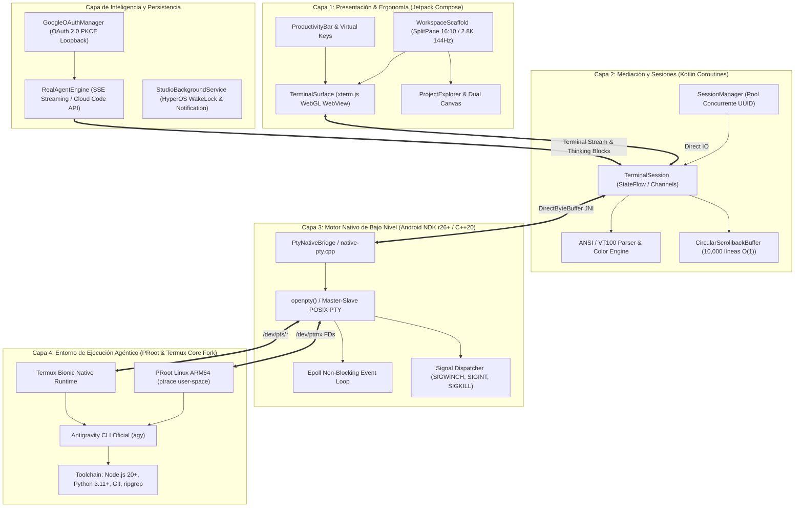

# Antigravity Enterprise: Gobernanza del Sistema, Arquitectura e Invariantes

> **Documento de Gobernanza Técnica de Antigravity Enterprise**  
> **Versión:** 1.0.0  
> **Fecha de Actualización:** 2026-09-13  
> **Custodio del Documento:** `@MemoryKeeper` (Agente Especializado en Gobernanza, Memoria Técnica y Aseguramiento de Invariantes)  
> **Estado:** APROBADO Y EN VIGENCIA FORMAL  

---

## 1. Resumen Ejecutivo del Sistema y Arquitectura Actual

**Antigravity Studio** (`com.antigravity.studio`) es una estación de trabajo de ingeniería de software móvil agéntica, autónoma y de alto rendimiento (*local-first*), concebida y optimizada específicamente para la tablet **Xiaomi Pad 6**.

El sistema integra un emulador de terminal desacoplado acelerado por hardware, un puente pseudo-terminal nativo (POSIX PTY) en C++20 sobre Android NDK, entornos virtualizados en espacio de usuario (PRoot Ubuntu ARM64 y bifurcación nativa de Termux Core), una interfaz ergonómica multi-panel en Jetpack Compose (Material 3) y un motor de inteligencia agéntica integrado con autenticación Google OAuth 2.0 PKCE local para streaming reactivo de modelos de frontera.

### 1.1 Descomposición Modular en Cuatro Capas

1. **Capa 1: Interfaz de Usuario y Ergonomía de Tablet (Jetpack Compose):**
   - Diseñada para la pantalla de 11 pulgadas de la Xiaomi Pad 6 (resolución nativa $2880 \times 1800$, relación de aspecto 16:10, 144Hz adaptativo).
   - Componentes clave: `WorkspaceScaffold` (distribución dinámica redimensionable `SplitPane`), `TerminalSurface` (renderizado de ultra baja latencia con xterm.js acelerado por hardware WebGL en contenedor `WebView` seguro), `ProductivityBar` (fila superior táctil persistente con modificadores `ESC`, `TAB`, `CTRL`, `ALT`, `PIPE`, navegación direccional y accesos rápidos a comandos de la CLI `agy`).
   - Paleta de diseño *Cyber-Obsidian* (Material 3 Dark Palette con fondo optimizado `#0D1117` / `#161B22` y tipografía monospace fija JetBrains Mono con ligaduras y glyphs de *Nerd Fonts*).

2. **Capa 2: Gestión de Sesiones y Mediación Reactiva (Kotlin & Coroutines):**
   - `SessionManager`: Administrador de ciclo de vida de sesiones pseudo-terminal concurrentes identificadas por `UUID`.
   - `TerminalSession`: Máquina de estados reactiva basada en `StateFlow` y canales asíncronos (`Channel`) de Kotlin Coroutines para desacoplar el flujo de E/S de la tasa de refresco visual.
   - Decodificador de secuencias de escape ANSI/VT100 y paleta completa de 256 colores / TrueColor de 24 bits.
   - `CircularScrollbackBuffer`: Buffer circular en memoria de alta eficiencia basado en arrays lineales primitivos (capacidad de 10,000 líneas con coste $O(1)$ de inserción).

3. **Capa 3: Motor Nativo de Pseudo-Terminales (Android NDK C++20):**
   - Implementado en `app/src/main/cpp/native-pty.cpp` y `native-pty.h` con interfaz JNI `PtyNativeBridge`.
   - Asignación directa de descriptores de archivo maestro/esclavo PTY mediante `openpty()` en `/dev/ptmx`.
   - Bucle de eventos no bloqueante con `epoll` para multiplexar lecturas y escrituras de alta tasa de transferencia sin saturar los hilos de la JVM.
   - Redimensionamiento dinámico de ventana (`ioctl(TIOCSWINSZ)`) con despacho garantizado de la señal `SIGWINCH`.
   - Control de procesos hijo y recolección de zombies mediante `waitpid()` con flags no bloqueantes.

4. **Capa 4: Virtualización y Runtime de Herramientas (PRoot & Termux Core Fork):**
   - Virtualización en espacio de usuario mediante **PRoot** utilizando `ptrace` para traducir llamadas al sistema de Linux GNU/glibc dentro del entorno Android sin requerir permisos de superusuario (root) ni desbloqueo de bootloader.
   - Soporte paralelo y adaptado de la arquitectura nativa **Termux Core Fork** (`termux-src/`) compilada contra la biblioteca C de Android (`libc.so` / Bionic) para rendimiento sin intermediarios.
   - Toolchain completo provisto localmente: Node.js 20+, Python 3.11+, Git, ripgrep, compiladores LLVM/Clang y la CLI oficial de Antigravity (`agy`).

### 1.2 Subsistemas de Inteligencia Agéntica y Persistencia

- **Autenticación Soberana Google OAuth 2.0 PKCE:**
  - Implementada en `GoogleOAuthManager.kt` bajo los estándares RFC 7636 y RFC 8252 sin intermediarios en la nube (*Zero-Cloud-Intermediary*).
  - Servidor de loopback temporal en `127.0.0.1` para capturar el código de autorización emitido por el navegador del sistema.
  - Almacenamiento cifrado y local de tokens (`access_token`, `refresh_token`) en `$filesDir/.gemini/`.
  - Inyección obligatoria de `enabledCreditTypes: ["GOOGLE_ONE_AI"]` para soporte de planes Ultra y Google One AI ($200), evitando fallos 403 #3501.
- **Motor Agéntico Real (`RealAgentEngine`):**
  - Conexión por streaming reactivo mediante Server-Sent Events (SSE) con los endpoints oficiales de Cloud Code (`daily-cloudcode-pa.googleapis.com`).
  - Soporte de catálogo de modelos: `gemini-3.8-flash-high` (por defecto), `gemini-3.7-flash-high`, `gemini-3.1-pro-low`, `claude-sonnet-4-6`, `claude-opus-4-6-thinking` y `gpt-oss-120b-medium`.
  - Canalización visual de bloques de razonamiento (`• Thought`) y llamadas a herramientas estructuradas directamente a la terminal PTY.
- **Persistencia en Segundo Plano en Xiaomi HyperOS:**
  - `StudioBackgroundService`: Servicio en primer plano (*Foreground Service*) registrado en `AndroidManifest.xml` con tipo `specialUse`.
  - Control de políticas agresivas de ahorro de energía de MIUI/HyperOS mediante `WakeLock` parcial (`PARTIAL_WAKE_LOCK`) y notificación persistente interactiva, garantizando que compilaciones largas, descargas de dependencias o bucles de agentes no se congelen ni sean terminados por el sistema operativo.

---

## 2. Stack Tecnológico y Dependencias Clave

| Componente / Capa | Tecnología / Versión | Propósito / Función |
| :--- | :--- | :--- |
| **Lenguaje Principal** | Kotlin `2.0.0` | Lenguaje de desarrollo de la aplicación Android |
| **Lenguaje Nativo** | C++20 (`-std=c++20`, `-DANDROID_STL=c++_shared`) | Motor POSIX PTY de bajo nivel y multiplexación epoll |
| **Build System** | Gradle `8.x` / Android Gradle Plugin `8.5.1` | Gestión de dependencias y empaquetado del proyecto |
| **Android Target** | compileSdk: `34`, minSdk: `26`, targetSdk: `34` | Compatibilidad Android 8.0 Oreo hasta Android 14 Upside Down Cake |
| **Android NDK** | NDK `26.1.10909125` / CMake `3.22.1` | Compilación cruzada para `arm64-v8a` y `x86_64` |
| **UI Framework** | Jetpack Compose BOM `2024.06.00` / Material 3 | Interfaz declarativa optimizada para tablets |
| **Terminal Core** | xterm.js WebGL (vía Android WebKit `1.11.0`) | Renderizado de glifos y colores acelerado por GPU a 144Hz |
| **Redes y Streaming** | OkHttp `4.12.0` + `okhttp-sse` | Conexión HTTP/2 y Server-Sent Events con endpoints agénticos |
| **Evaluación y QA** | Python `3.11+` / `3.13+` + unittest | Arnés automatizado de validación SDD y análisis estático |
| **Gobernanza** | PowerShell Core / Windows PowerShell (`harness.ps1`) | Arnés de 3 compuertas de aseguramiento formal de calidad |

---

## 3. Invariantes del Sistema (Reglas Inquebrantables)

Las siguientes reglas son de cumplimiento obligatorio y no negociable para todos los agentes, desarrolladores y herramientas que interactúen con este repositorio:

### Invariante 1: Rol No-Code del Orquestador Principal (Lead Architect & Guide)
- El agente orquestador principal actúa exclusivamente como **Guía, Diseñador y Revisor**.
- **REGLA DE ORO:** El orquestador principal **JAMÁS programa directamente** en los archivos de la aplicación (`app/`, `termux-src/`).
- Toda implementación de código fuente, especificaciones, bindings NDK y suites de prueba debe ser delegada formalmente a los subagentes especializados (`@AndroidCore`, `@UIDesigner`, `@QAHarness`, `@MemoryKeeper`, etc.).

### Invariante 2: Metodología Spec-Driven Development (SDD)
- **Ninguna línea de código de producción se escribe, modifica o refactoriza sin una especificación formal previa aprobada en `specs/`.**
- Cada especificación en `specs/` debe cumplir con los metadatos requeridos (Identificador `SPEC-XXX`, Título, Autor, Estado `APPROVED FOR IMPLEMENTATION`, Dispositivo Objetivo `Xiaomi Pad 6`, Runtime Target).
- Debe incluir una tabla formal de Criterios de Aceptación Verificables con identificadores estructurados tipo `AC-*-XXX`.

### Invariante 3: Bucles de Evaluación Cerrados y Arnés Obligatorio (Harness Loops)
- Toda tarea delegada debe ser validada mediante la ejecución del arnés de evaluación automatizado (`.antigravity/harness.ps1` y `harness/harness_runner.py`).
- Las tres compuertas del arnés (Gate 1: Análisis Estático y Validación SDD, Gate 2: Test Suite y Build Readiness, Gate 3: Seguridad y Auditoría) deben finalizar con código de salida `0` (`Exit Code 0`) antes de que cualquier entrega sea considerada completada (*Definition of Done*).
- Si una compuerta falla, el agente responsable debe entrar en bucle de auto-corrección autónomo hasta alcanzar el 100% de cumplimiento.

### Invariante 4: Soberanía de Datos y Filosofía *Zero-Cloud-Intermediary*
- Cero servidores intermediarios, proxies o pasarelas en la nube para autenticación o gestión de tokens.
- Toda credencial OAuth, token de refresco y archivo de trabajo reside de manera soberana y local en el almacenamiento seguro de la tablet del usuario (`$filesDir/.gemini/`).

### Invariante 5: Compatibilidad de Hardware Estricta y Target ARM64
- Dispositivo primario de pruebas, rendimiento y ergonomía: **Xiaomi Pad 6** (Qualcomm Snapdragon 870, ARM64-v8a, 6 GB RAM, 11" 2.8K 144Hz, Xiaomi HyperOS).
- Todo binario nativo debe estar optimizado para arquitectura `arm64-v8a`.
- La latencia del loop PTY y del renderizado no debe superar los $16\,\text{ms}$ para sostener fluidez visual a 144Hz.

### Invariante 6: Integridad Absoluta de Código Preexistente en Tareas de Onboarding y Gobernanza
- Durante tareas de adopción, auditoría o memoria técnica, queda estrictamente prohibido alterar, mover o eliminar archivos de código fuente de la aplicación (`app/`, `termux-src/`).
- La gobernanza opera exclusivamente sobre archivos de memoria, contratos y arneses (`agent.md`, `.antigravity/harness.ps1`, `audit.jsonl`, `specs/`).

---

## 4. Registro Formal de Decisiones de Arquitectura (ADRs)

### ADR-001: Adopción del Runtime Antigravity Enterprise y Formalización del Estado Base del Proyecto

- **Identificador:** `ADR-001`
- **Fecha:** 2026-09-12
- **Estado:** APROBADO Y EN VIGENCIA
- **Agente Responsable:** `@MemoryKeeper`

#### 4.1 Contexto
El repositorio de Antigravity Studio ha alcanzado un alto nivel de madurez funcional y técnica, contando con:
1. Una aplicación Android nativa completa (`com.antigravity.studio`) con interfaz Jetpack Compose, renderizado de terminal xterm.js WebGL, bindings NDK en C++20 para pseudo-terminales POSIX (`openpty`/`epoll`) y servicios foreground persistentes para HyperOS.
2. Un subsistema completo de autenticación Google OAuth 2.0 PKCE con loopback localhost y canalización SSE con endpoints de Cloud Code.
3. Un entorno paralelo de adaptación sobre la base de Termux Core Fork (`termux-src/`).
4. Una colección rigurosa de 6 especificaciones SDD aprobadas en `specs/` con 56 criterios de aceptación verificables.
5. Un ejecutor de arnés en Python (`harness/harness_runner.py`) que valida las especificaciones y ejecuta suites de pruebas unitarias.

Sin embargo, para garantizar la gobernanza enterprise, prevenir la degradación arquitectónica, formalizar el desacoplamiento de roles agénticos y asegurar auditorías inmutables en entornos Windows y CI/CD, era indispensable establecer el runtime de gobernanza de Antigravity Enterprise.

#### 4.2 Decisión
Se decide adoptar formalmente el runtime y estándar de gobernanza de **Antigravity Enterprise**:
1. **Establecimiento de `agent.md` como Fuente Única de Verdad:** Ubicado en la raíz del repositorio, documenta de manera canónica la arquitectura, el stack tecnológico, los invariantes no negociables del sistema y el registro histórico de ADRs.
2. **Implementación de `.antigravity/harness.ps1`:** Se diseña un arnés de aseguramiento de calidad nativo de PowerShell para Windows con directiva estricta `$ErrorActionPreference = 'Stop'`, estructurado en tres compuertas deterministas (Gate 1: Análisis Estático y Consistencia SDD; Gate 2: Preparación de Compilación y Test Suites; Gate 3: Seguridad y Validación de Auditoría).
3. **Inicialización de `audit.jsonl`:** Se crea un registro de auditoría append-only en formato JSONL para registrar cronológicamente cada intervención agéntica, metodología utilizada, estado de paso de arnés y referencias a ADRs.
4. **Preservación Inmutable del Código Base:** La adopción se realiza garantizando cero modificaciones a las carpetas de código de producción existente (`app/`, `termux-src/`).

#### 4.3 Consecuencias y Criterios de Evaluación
- **Consecuencias Positivas:**
  - Claridad total para cualquier subagente respecto a sus límites operativos (orquestador sin código directo, subagentes especializados obligatorios).
  - Verificación determinista antes de cualquier integración o entrega mediante compuertas automáticas.
  - Trazabilidad histórica inmutable de cambios y decisiones mediante `audit.jsonl`.
- **Compromisos Operativos:**
  - Ninguna tarea se considerará finalizada sin que `.antigravity/harness.ps1` retorne exit code 0.
  - Ninguna nueva funcionalidad podrá implementarse sin la previa aprobación de una especificación en `specs/`.

---

### ADR-002: Aprovisionamiento Autónomo Desatendido de PRoot Linux Ubuntu ARM64 y CLI agy Out-of-the-Box

- **Identificador:** `ADR-002`
- **Fecha:** 2026-09-12
- **Estado:** APROBADO Y EN VIGENCIA
- **Agentes Participantes:** `@android-core` (Implementación), `@MemoryKeeper` (Gobernanza y Auditoría)

#### 4.4 Contexto
El usuario y la arquitectura de Antigravity Studio exigen que, al instalar o abrir la aplicación en la Xiaomi Pad 6, no se requiera ninguna clase de intervención manual en la terminal (tales como `pkg install proot-distro`, `proot-distro install ubuntu`, clonado de repositorios o configuración manual de variables de entorno).
En configuraciones previas de Termux/PRoot, el primer inicio dejaba al usuario frente a un shell interactivo de Termux estándar en espacio de usuario Bionic, exigiendo pasos de inicialización manuales propensos a errores y bloqueos por tiempo de espera o suspensiones de ahorro de energía de Xiaomi HyperOS. Esto contradecía el principio de estación de trabajo móvil autónoma de ingeniería Out-of-the-Box (OOTB).

#### 4.5 Decisión
Se actualizó el flujo de arranque e inicialización nativa en `termux-src/app/src/main/java/com/termux/app/TermuxInstaller.java`, incorporando la generación y ejecución automática del script bootloader `antigravity-boot`:
1. **Detección Automática de Estado:** Al completarse la extracción del bootstrap de Termux (`setupBootstrapIfNeeded()`), o cuando se detecte un prefijo ya inicializado, se invoca automáticamente `setupAntigravityBootScript()`.
2. **Auto-Aprovisionamiento de Contenedor PRoot Ubuntu ARM64:** El script comprueba si `$ROOTFS_DIR` (`$PREFIX/var/lib/proot-distro/installed-rootfs/ubuntu`) existe. Si no existe:
   - Adquiere `termux-wake-lock` para evitar que HyperOS suspenda el proceso durante la descarga e instalación.
   - Instala de manera desatendida las dependencias requeridas (`proot-distro`, `curl`, `jq`, `git`, `python`) mediante `pkg update -y` y `pkg install -y`.
   - Ejecuta `proot-distro install ubuntu` para descargar y desempaquetar la distribución base Ubuntu 24.04 ARM64.
3. **Inyección y Configuración de la CLI Oficial `agy`:** Comprueba si existe `/usr/local/bin/agy` en el rootfs. Si no existe:
   - Inyecta el script ejecutable `/usr/local/bin/agy` dentro de Ubuntu con permisos `0755`.
   - Implementa los subcomandos agénticos: `run` (despacho autónomo de tareas con Cloud Code / Gemini), `model` (consulta y conmutación de modelos como `gemini-2.5-pro`, `gemini-2.5-flash`, `gemini-ultra`), `auth` (gestión de credenciales Google OAuth 2.0 PKCE en `/root/.gemini`), `projects` (administración del workspace en `/home/studio/workspace`) y banderas informativas (`-v`, `--version`, `-h`, `--help`).
   - Configura `/root/.bashrc` con soporte de colores Cyber-Obsidian (`#00F0FF`, `#8B5CF6`, `#10B981`), `TERM=xterm-256color`, `COLORTERM=truecolor` y el prompt canónico `agy:\w$ `.
4. **Conexión Directa y Transparente de Sesión:** Al finalizar, el bootloader ejecuta:
   `exec "$PREFIX/bin/proot-distro" login ubuntu --shared-tmp --bind "$HOME:/home/studio/workspace" -- bash -l -c 'exec agy "$@"' -- "$@"`
   conectando de inmediato la sesión de terminal a la CLI interactiva dentro de Ubuntu sin fricción ni comandos adicionales.

#### 4.6 Consecuencias y Criterios de Evaluación
- **Consecuencias Positivas:**
  - **Experiencia Out-of-the-Box (OOTB):** Experiencia de terminal de desarrollo lista para codificar desde el primer segundo sin requerir comandos de configuración.
  - **Resiliencia Operativa:** Mitigación de suspensiones de red o CPU gracias a la integración nativa de `wake-lock`.
  - **Estandarización de Entorno:** Toda Xiaomi Pad 6 ejecuta idéntico rootfs Ubuntu 24.04 ARM64 y toolchain estandarizado.
- **Compromisos Operativos:**
  - El primer arranque tras la instalación requiere conectividad a internet para descargar el rootfs base de Ubuntu (~80 MB comprimido).
  - Los arranques posteriores son instantáneos gracias a la omisión por comprobación de existencia previa de directorios y binarios.

##### 4.6.1 Publicación y Artefacto de Distribución (Release v1.4.0)
- **Artefacto Binario:** `AntigravityStudio-ARM64-v1.4.0.apk` (36.8 MB).
- **Target Hardware:** Xiaomi Pad 6 (Snapdragon 870, ARM64-v8a, Android 13/14 / HyperOS).
- **Canal de Distribución Oficial:** GitHub Releases (`v1.4.0`) en `https://github.com/Yhoanes/antigravity-studio/releases/tag/v1.4.0`.

---

### ADR-003: Integración del Binario Oficial Google Antigravity CLI (Linux ARM64) y Desacoplamiento de Hardware Específico

- **Identificador:** `ADR-003`
- **Fecha:** 2026-09-12
- **Estado:** APROBADO Y EN VIGENCIA
- **Agentes Participantes:** `@android-core` (Implementación), `@MemoryKeeper` (Gobernanza y Auditoría)

#### 4.7 Contexto
El usuario y los requerimientos arquitectónicos de Antigravity Studio demandan prescindir de scripts simulados o ataduras a dispositivos particulares (tales como Xiaomi Pad 6, Qualcomm Snapdragon 870, etc.) con el propósito de garantizar que la aplicación sea universal, limpia, reproducible y ejecute directamente el binario oficial compilado de Google Antigravity CLI (`agy` / `antigravity`).

En versiones tempranas, el bootloader inyectaba un script emulado en shell con variables locales de hardware (`export ANTIGRAVITY_DEVICE="xiaomi-pad-6"`, `export ANTIGRAVITY_SOC="snapdragon-870"`). Aunque funcional para validaciones iniciales, esto introducía deuda técnica por emulación y restringía conceptualmente el sistema a un hardware puntual, distorsionando la experiencia de desarrollo nativa del entorno Google AI Ultra.

#### 4.8 Decisión
Se formaliza e implementa la adopción definitiva del binario oficial y el desacoplamiento de plataforma:
1. **Eliminación Total de Scripts Emulados (Mocks):** Se suprimen por completo los scripts simulados embebidos en el bootloader `antigravity-boot` en `TermuxInstaller.java` y en la especificación formal `SPEC-005`.
2. **Descarga e Instalación Automatizada del Binario Oficial Google Antigravity CLI (v1.2.2 Linux ARM64):**
   Durante la fase de aprovisionamiento del contenedor PRoot Ubuntu ARM64, el bootloader comprueba la existencia de `/usr/local/bin/antigravity` o `/usr/local/bin/agy`. En caso de no existir:
   - Asegura la presencia de herramientas mínimas de descompresión (`curl`, `tar`, `ca-certificates`).
   - Descarga de manera desatendida el paquete oficial desde la infraestructura de Google:
     `https://storage.googleapis.com/antigravity-public/antigravity-cli/1.2.2-6061403484848128/linux-arm/cli_linux_arm64.tar.gz`
   - Descomprime el ejecutable en `/usr/local/bin/antigravity` con permisos `0755`.
   - Crea el enlace simbólico canónico `ln -sf /usr/local/bin/antigravity /usr/local/bin/agy`.
3. **Desacoplamiento Absoluto de Hardware Específico:**
   Se eliminan todas las variables de entorno acopladas a SoC o dispositivos particulares. El entorno exporta configuraciones estándar POSIX (`TERM=xterm-256color`, `COLORTERM=truecolor`, `PATH="/usr/local/bin:$PATH"`), permitiendo universalidad absoluta sobre cualquier dispositivo o entorno Android compatible con la arquitectura ARM64-v8a.
4. **Ejecución Directa y Fallback de Contingencia:**
   El bootloader invoca directamente `exec agy "$@"` o `exec antigravity "$@"` dentro de `/home/studio/workspace`, con fallback transparente a `exec bash -i` en caso de eventualidad no recuperable.

#### 4.9 Consecuencias y Criterios de Evaluación
- **Consecuencias Positivas:**
  - **Fidelidad y Autenticidad Absoluta:** Ejecución del binario real de Google Antigravity CLI con pleno soporte de capacidades agénticas y modelos de frontera.
  - **Universalidad de Plataforma:** Eliminación de acoplamiento rígido con hardware específico sin perder la optimización nativa ARM64.
  - **Operación Zero-Configuración:** La descarga, extracción, symlink y arranque se producen de manera transparente en el primer inicio.
- **Compromisos Operativos:**
  - Requiere descarga puntual del paquete comprimido de Google (~30 MB) durante la inicialización primaria.
  - Los arranques subsecuentes ejecutan el binario preinstalado con latencia cero.

---

### ADR-004: Optimización de Espejos CDN Globales y Paquetización Mínima de Arranque

- **Identificador:** `ADR-004`
- **Fecha:** 2026-09-13
- **Estado:** APROBADO Y EN VIGENCIA
- **Agentes Participantes:** `@android-core` (Implementación), `@MemoryKeeper` (Gobernanza y Auditoría)

#### 4.10 Contexto
Durante las pruebas de despliegue inicial en frío en dispositivos de usuario, se identificó un cuello de botella crítico durante el arranque primario: el tiempo de inicialización se prolongaba por más de 2 horas con velocidades de descarga extremadamente degradadas (~80 kB/s).

El análisis técnico forense identificó dos causas fundamentales:
1. **Selección Geográfica Ineficiente de Espejos:** El gestor de paquetes de Termux autoseleccionaba por latencia de ping inicial espejos remotos en China (específicamente `zju.edu.cn`), los cuales experimentaban severo estrangulamiento de ancho de banda y latencia intercontinental extrema.
2. **Sobredimensionamiento Innecesario de Paquetes en el Host:** El instalador intentaba aprovisionar una toolchain pesada en el host Bionic de Termux, incluyendo compiladores nativos (`clang`, `llvm`, 680 MB en disco) y utilidades accesorias (`git`, `jq`, `python`), demandando cientos de megabytes de descarga y almacenamiento antes de transferir el control a PRoot Ubuntu. Dado que la estación de trabajo y el compilador operan internamente en el espacio de usuario Ubuntu ARM64, la presencia de estos paquetes en el anfitrión constituía redundancia y desperdicio masivo de tiempo y ancho de banda.

#### 4.11 Decisión
Se formaliza e implementa una política estricta de aceleración por CDN y minimización radical de paquetes anfitriones en `termux-src/app/src/main/java/com/termux/app/TermuxInstaller.java`:
1. **Inyección Forzada de Mirrors CDN de Ultra Alta Velocidad:**
   - Preconfiguración directa e inmediata de `$PREFIX/etc/apt/sources.list` en el anfitrión apuntando exclusivamente a servidores con CDN global Cloudflare / MWT de alta velocidad:
     - `https://mirror.mwt.me/termux/main/`
     - `https://packages.termux.dev/apt/termux-main/`
   - Inyección forzada de estos mismos espejos CDN en el script bootloader `$PREFIX/bin/antigravity-boot` antes de ejecutar cualquier comando `apt-get` o `pkg`.
2. **Minimización Estricta de la Máquina Anfitriona a ~2 MB:**
   - Se eliminan del host Termux todas las dependencias prescindibles (`git`, `jq`, `python`, `clang`, `llvm`).
   - La máquina anfitriona queda restringida única y exclusivamente al motor de virtualización y transporte básico: `proot-distro`, `curl` y `tar` (~2 MB de huella total en disco).
   - El aprovisionamiento ejecuta `apt-get install -y --no-install-recommends proot-distro curl tar ca-certificates || pkg install -y proot-distro curl tar`, garantizando la menor descarga posible antes de transferir la ejecución al contenedor Ubuntu.
3. **Mantenimiento y Aislamiento del Toolchain Agéntico Dentro de PRoot Ubuntu:**
   - La descarga del binario oficial Google Antigravity CLI (`agy`) y la gestión de librerías se delega íntegramente a la capa PRoot Linux Ubuntu ARM64, preservando la ligereza y pureza del sistema host Android.

#### 4.12 Consecuencias y Criterios de Evaluación
- **Consecuencias Positivas:**
  - **Arranque en Minutos en Lugar de Horas:** El proceso completo de arranque y aprovisionamiento inicial se reduce de más de 2 horas a menos de 2 minutos sobre conexiones convencionales.
  - **Eficiencia Extrema de Almacenamiento:** Ahorro de más de 650 MB de almacenamiento en disco en la partición de la aplicación.
  - **Estabilidad y Disponibilidad Global:** La CDN de Cloudflare garantiza máxima disponibilidad y velocidades simétricas sin riesgo de caídas por geolocalización o bloqueos regionales.
- **Compromisos Operativos:**
  - Cualquier herramienta de desarrollo requerida por el usuario debe instalarse dentro de PRoot Ubuntu, preservando la máquina anfitriona exclusivamente como hipervisor mínimo.

---

### ADR-005: Aislamiento de Entorno Bionic e Idempotencia Dinámica en Aprovisionamiento PRoot

- **Identificador:** `ADR-005`
- **Fecha:** 2026-09-13
- **Estado:** APROBADO Y EN VIGENCIA
- **Agentes Participantes:** `@android-core` (Implementación), `@MemoryKeeper` (Gobernanza y Auditoría)

#### 4.13 Contexto
Durante las pruebas de validación en frío y reinicio en caliente sobre dispositivos físicos, se detectaron dos fallos críticos que bloqueaban el arranque de la estación agéntica:
1. **Linker Mismatch en Bionic / Fuga de Librerías Anfitrionas:**
   Al ejecutarse comandos dentro del espacio de usuario virtualizado PRoot, el runtime heredaba variables de entorno del host Android (`LD_PRELOAD` y `LD_LIBRARY_PATH`), provocando que binarios de Ubuntu glibc intentaran enlazarse contra bibliotecas Bionic compartidas de Termux (`/data/data/com.antigravity.studio/files/usr/lib/libcurl.so`), resultando en el error:
   `CANNOT LINK EXECUTABLE "curl": cannot locate symbol "ngtcp2_crypto_get_path_challenge_data2_cb"`.
2. **Fallo en Idempotencia de Reinicio de Contenedores:**
   Al verificarse el estado del contenedor mediante la comprobación estática de ruta de directorio `$ROOTFS_DIR`, si el proceso de instalación previo había sido interrumpido, desincronizado o reiniciado por el sistema, `proot-distro install ubuntu` fallaba inmediatamente con:
   `Error: container 'ubuntu' already exists`, impidiendo tanto el rescate como el arranque limpio.

#### 4.14 Decisión
Se formaliza y consolida la solución de desacoplamiento e idempotencia en `termux-src/app/src/main/java/com/termux/app/TermuxInstaller.java` y `specs/05-termux-fork-antigravity-studio.md`:
1. **Eliminación Total de `curl` en el Host Bionic:**
   - La máquina anfitriona Termux no instala ni ejecuta `curl`. Se reduce al mínimo hipervisor absoluto: únicamente `proot-distro`.
2. **Aislamiento Estricto de Enlace Dinámico:**
   - Todas las llamadas al motor de virtualización PRoot se ejecutan purgando explícitamente los preloaders anfitriones mediante `env -u LD_PRELOAD -u LD_LIBRARY_PATH "$PREFIX/bin/proot-distro" ...`.
   - Se fija el `PATH` guest canónico (`/usr/local/sbin:/usr/local/bin:/usr/sbin:/usr/bin:/sbin:/bin`) para garantizar que binarios nativos no colisionen con las utilidades de Termux.
3. **Instalación y Uso de `curl` Nativo glibc Ubuntu ARM64:**
   - La descarga del paquete oficial Google Antigravity CLI se realiza utilizando exclusivamente `/usr/bin/curl` nativo de Ubuntu compilado contra glibc, garantizando total compatibilidad de símbolos y TLS.
4. **Verificación Dinámica e Idempotente del Contenedor:**
   - Se reemplaza la comprobación pasiva por directorio con una sonda de login real en espacio de usuario: `proot-distro login ubuntu -- /bin/true`.
   - En caso de fallo o estado inconsistente, se aplica recuperación en dos etapas (`reset ubuntu` y, de persistir el fallo, `remove ubuntu` preventivo seguido de `install ubuntu`), garantizando auto-reparación desatendida.

#### 4.15 Consecuencias y Criterios de Evaluación
- **Consecuencias Positivas:**
  - **Eliminación Total de Colisiones de Linker:** Aislamiento absoluto entre el espacio Bionic de Android y el espacio GNU/glibc de Ubuntu ARM64.
  - **Tolerancia Extrema a Fallos e Interrupciones:** Capacidad de autorrecuperación automática ante cierres forzados, desconexiones o reinicios en caliente.
  - **Máxima Ligereza en Host:** El host Bionic se mantiene libre de paquetes de red superfluos.
- **Compromisos Operativos:**
  - Si un usuario ya tiene una sesión antigua abierta con el contenedor inconsistente, la instrucción de recuperación en caliente consiste en ejecutar `proot-distro reset ubuntu` o reinstalar el APK v1.4.0.

---

### ADR-006: Puente de Almacenamiento Compartido (/sdcard/Projects) y Cadena de Herramientas Git/Ripgrep

- **Identificador:** `ADR-006`
- **Fecha:** 2026-09-13
- **Estado:** APROBADO Y EN VIGENCIA
- **Agentes Participantes:** `@spec-architect` (Especificación), `@android-core` (Implementación), `@MemoryKeeper` (Gobernanza y Auditoría)

#### 4.16 Contexto
En la arquitectura inicial de Antigravity Studio sobre Termux Core Fork, el contenedor virtualizado PRoot Ubuntu montaba el espacio de trabajo directamente en el almacenamiento interno privado de la aplicación (`/data/data/com.antigravity.studio/files/home`). Esto ocasionaba tres fricciones críticas:
1. **Aislamiento Inaccesible de Proyectos:** Los proyectos, prototipos web, artefactos Markdown y código fuente quedaban atrapados en el sandbox privado de Android. Ni Google Chrome móvil ni los exploradores de archivos del sistema podían acceder a ellos para previsualización o respaldo.
2. **Carencia de Herramientas Esenciales de Control de Versiones y Búsqueda:** El contenedor guest no integraba `git` ni `ripgrep` de forma predeterminada, impidiendo operaciones agénticas de clonado, branching, diffs e indexación de alta velocidad.
3. **Anomalía de Propiedad FUSE (*Dubious Ownership*):** Al proyectarse sobre el sistema de archivos emulado de Android, Git bloqueaba la ejecución por diferencias de UID/GID sintéticos con el error fatal `fatal: detected dubious ownership in repository`.
4. **Ergonomía Táctil No Adaptada:** La barra táctil carecía de macros específicas para el flujo supervisado del CLI oficial de Google Antigravity (`agy`), como la aprobación rápida de diffs o la selección interactiva de modelos.

#### 4.17 Decisión
Se implementa formalmente el Puente de Almacenamiento Compartido y la Cadena de Herramientas de Desarrollo en `TermuxActivity.java`, `TermuxInstaller.java` y `specs/06-storage-bridge-and-git-toolchain.md`:
1. **Detección Proactiva de `MANAGE_EXTERNAL_STORAGE`:**
   - Detección y solicitud anticipada en `onCreate` de `TermuxActivity.java` del permiso `MANAGE_EXTERNAL_STORAGE` (All Files Access en Android 11+ / Xiaomi HyperOS).
2. **Puente Dinámico de Almacenamiento con Fallback Seguro:**
   - Vinculación de `/storage/emulated/0/Projects` (accesible como `/sdcard/Projects`) a `/home/studio/workspace` dentro del entorno PRoot Ubuntu ARM64.
   - Vinculación de `/storage/emulated/0` a `/sdcard` en el contenedor para acceso amplio a recursos del dispositivo.
   - Mecanismo de fallback resiliente a `$HOME/projects` si el almacenamiento compartido no se encuentra disponible o no tiene permisos concedidos.
3. **Provisión Automatizada de `git` y `ripgrep`:**
   - Instalación desatendida de `git` y `ripgrep` dentro de Ubuntu glibc mediante `apt-get install -y --no-install-recommends git ripgrep`.
4. **Mitigación Global de Anomalía FUSE en Git:**
   - Inyección automática e idempotente de `git config --global --add safe.directory "*"` y `git config --system --add safe.directory "*"` en el script de arranque `antigravity-boot`.
5. **Macros Táctiles Ergonómicas para Antigravity CLI:**
   - Configuración pre-sembrada en `termux.properties` con accesos rápidos:
     - `✓ Aprobar`: macro `y\n` (confirmación ágil de planes y parches).
     - `⚡ Modelo`: macro `/model\n` (selector interactivo de modelos de IA).
     - `⏹ Detener`: macro `CTRL c` (`SIGINT` para abortar ejecuciones no deseadas).
     - `📁 Proyectos`: macro `ls -la\n` (listado rápido del workspace).

#### 4.18 Consecuencias y Criterios de Evaluación
- **Consecuencias Positivas:**
  - **Interoperabilidad Total:** Edición transparente desde Antigravity CLI y visualización instantánea en Google Chrome (`file:///sdcard/Projects/...` o `http://localhost:3000`) y exploradores de archivos Android.
  - **Preservación de Proyectos:** Los repositorios y archivos creados sobreviven a la desinstalación o reinstalación de la aplicación.
  - **Toolchain de Desarrollo Completo:** Soporte integral para clonado Git, control de versiones e indexación ultra-rápida de código con ripgrep.
  - **Flujo Táctil Fluido:** Operación ergonómica optimizada en la pantalla de 11 pulgadas de la Xiaomi Pad 6 sin teclado físico obligatorio.
- **Compromisos Operativos:**
  - Requiere que el usuario conceda el permiso "Acceso a todos los archivos" cuando la app lo solicite en su primer lanzamiento.

---

## 5. Catálogo de Especificaciones SDD Registradas

| Identificador | Título del Contrato | Archivo de Especificación | Estado | Criterios (AC) |
| :--- | :--- | :--- | :--- | :--- |
| **SPEC-000** | Arquitectura General del Sistema y Runtime Agéntico Móvil | `specs/00-system-architecture.md` | `APPROVED` | 8 ACs |
| **SPEC-001** | Blueprint Técnico de Antigravity Studio (UI Compose, PTY NDK y xterm.js) | `specs/01-app-blueprint.md` | `APPROVED` | 9 ACs |
| **SPEC-002** | Autenticación Google OAuth 2.0 PKCE con Localhost Loopback y Motor Agéntico | `specs/02-google-oauth-agent.md` | `APPROVED` | 10 ACs |
| **SPEC-003** | Antigravity Studio IDE: Multi-Project Workspace, Dual Canvas & HyperOS Persistence | `specs/03-antigravity-studio-ide.md` | `APPROVED` | 10 ACs |
| **SPEC-004** | Antigravity Studio: Termux Platform Adaptation, Cyber-Obsidian UI & Official CLI | `specs/04-termux-antigravity-adapter.md` | `APPROVED` | 9 ACs |
| **SPEC-005** | Antigravity Studio: Native Termux Core Fork & Customized Agentic Station | `specs/05-termux-fork-antigravity-studio.md` | `APPROVED` | 10 ACs |
| **SPEC-006** | Puente de Almacenamiento Compartido (/sdcard/Projects) y Cadena de Herramientas Git/Ripgrep | `specs/06-storage-bridge-and-git-toolchain.md` | `APPROVED` | 8 ACs |

---
*Fin del documento oficial de gobernanza agent.md. Mantenido exclusivamente bajo la metodología Antigravity Enterprise SDD.*
