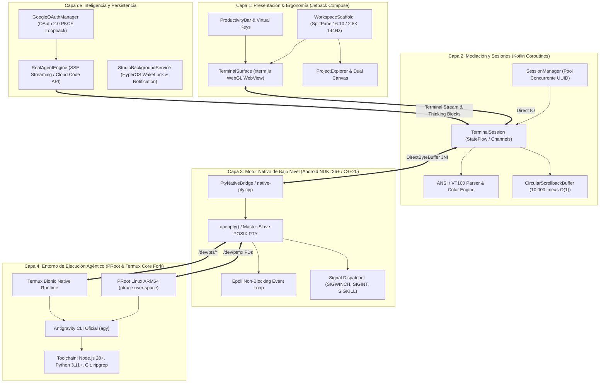

# Antigravity Enterprise: Gobernanza del Sistema, Arquitectura e Invariantes

> **Documento de Gobernanza Técnica de Antigravity Enterprise**  
> **Versión:** 1.0.0  
> **Fecha de Actualización:** 2026-09-13  
> **Custodio del Documento:** `@MemoryKeeper` (Agente Especializado en Gobernanza, Memoria Técnica y Aseguramiento de Invariantes)  
> **Estado:** APROBADO Y EN VIGENCIA FORMAL  

---

## 1. Resumen Ejecutivo del Sistema y Arquitectura Actual

**Antigravity Studio** (`com.antigravity.studio`) es una estación de trabajo de ingeniería de software móvil agéntica, autónoma y de alto rendimiento (*local-first*), concebida y optimizada específicamente para la tablet **Xiaomi Pad 6**.

El sistema integra un emulador de terminal desacoplado acelerado por hardware, un puente pseudo-terminal nativo (POSIX PTY) en C++20 sobre Android NDK, entornos virtualizados en espacio de usuario (PRoot Ubuntu ARM64 y bifurcación nativa de Termux Core), una interfaz ergonómica multi-panel en Jetpack Compose (Material 3) y un motor de inteligencia agéntica integrado con autenticación Google OAuth 2.0 PKCE local para streaming reactivo de modelos de frontera.



### 1.1 Descomposición Modular en Cuatro Capas

1. **Capa 1: Interfaz de Usuario y Ergonomía de Tablet (Jetpack Compose):**
   - Diseñada para la pantalla de 11 pulgadas de la Xiaomi Pad 6 (resolución nativa $2880 \times 1800$, relación de aspecto 16:10, 144Hz adaptativo).
   - Componentes clave: `WorkspaceScaffold` (distribución dinámica redimensionable `SplitPane`), `TerminalSurface` (renderizado de ultra baja latencia con xterm.js acelerado por hardware WebGL en contenedor `WebView` seguro), `ProductivityBar` (fila superior táctil persistente con modificadores `ESC`, `TAB`, `CTRL`, `ALT`, `PIPE`, navegación direccional y accesos rápidos a comandos de la CLI `agy`).
   - Paleta de diseño *Cyber-Obsidian* (Material 3 Dark Palette con fondo optimizado `#0D1117` / `#161B22` y tipografía monospace fija JetBrains Mono con ligaduras y glyphs de *Nerd Fonts*).

2. **Capa 2: Gestión de Sesiones y Mediación Reactiva (Kotlin & Coroutines):**
   - `SessionManager`: Administrador de ciclo de vida de sesiones pseudo-terminal concurrentes identificadas por `UUID`.
   - `TerminalSession`: Máquina de estados reactiva basada en `StateFlow` y canales asíncronos (`Channel`) de Kotlin Coroutines para desacoplar el flujo de E/S de la tasa de refresco visual.
   - Decodificador de secuencias de escape ANSI/VT100 y paleta completa de 256 colores / TrueColor de 24 bits.
   - `CircularScrollbackBuffer`: Buffer circular en memoria de alta eficiencia basado en arrays lineales primitivos (capacidad de 10,000 líneas con coste $O(1)$ de inserción).

3. **Capa 3: Motor Nativo de Pseudo-Terminales (Android NDK C++20):**
   - Implementado en `app/src/main/cpp/native-pty.cpp` y `native-pty.h` con interfaz JNI `PtyNativeBridge`.
   - Asignación directa de descriptores de archivo maestro/esclavo PTY mediante `openpty()` en `/dev/ptmx`.
   - Bucle de eventos no bloqueante con `epoll` para multiplexar lecturas y escrituras de alta tasa de transferencia sin saturar los hilos de la JVM.
   - Redimensionamiento dinámico de ventana (`ioctl(TIOCSWINSZ)`) con despacho garantizado de la señal `SIGWINCH`.
   - Control de procesos hijo y recolección de zombies mediante `waitpid()` con flags no bloqueantes.

4. **Capa 4: Virtualización y Runtime de Herramientas (PRoot & Termux Core Fork):**
   - Virtualización en espacio de usuario mediante **PRoot** utilizando `ptrace` para traducir llamadas al sistema de Linux GNU/glibc dentro del entorno Android sin requerir permisos de superusuario (root) ni desbloqueo de bootloader.
   - Soporte paralelo y adaptado de la arquitectura nativa **Termux Core Fork** (`termux-src/`) compilada contra la biblioteca C de Android (`libc.so` / Bionic) para rendimiento sin intermediarios.
   - Toolchain completo provisto localmente: Node.js 20+, Python 3.11+, Git, ripgrep, compiladores LLVM/Clang y la CLI oficial de Antigravity (`agy`).

### 1.2 Subsistemas de Inteligencia Agéntica y Persistencia

- **Autenticación Soberana Google OAuth 2.0 PKCE:**
  - Implementada en `GoogleOAuthManager.kt` bajo los estándares RFC 7636 y RFC 8252 sin intermediarios en la nube (*Zero-Cloud-Intermediary*).
  - Servidor de loopback temporal en `127.0.0.1` para capturar el código de autorización emitido por el navegador del sistema.
  - Almacenamiento cifrado y local de tokens (`access_token`, `refresh_token`) en `$filesDir/.gemini/`.
  - Inyección obligatoria de `enabledCreditTypes: ["GOOGLE_ONE_AI"]` para soporte de planes Ultra y Google One AI ($200), evitando fallos 403 #3501.
- **Motor Agéntico Real (`RealAgentEngine`):**
  - Conexión por streaming reactivo mediante Server-Sent Events (SSE) con los endpoints oficiales de Cloud Code (`daily-cloudcode-pa.googleapis.com`).
  - Soporte de catálogo de modelos: `gemini-3.8-flash-high` (por defecto), `gemini-3.7-flash-high`, `gemini-3.1-pro-low`, `claude-sonnet-4-6`, `claude-opus-4-6-thinking` y `gpt-oss-120b-medium`.
  - Canalización visual de bloques de razonamiento (`• Thought`) y llamadas a herramientas estructuradas directamente a la terminal PTY.
- **Persistencia en Segundo Plano en Xiaomi HyperOS:**
  - `StudioBackgroundService`: Servicio en primer plano (*Foreground Service*) registrado en `AndroidManifest.xml` con tipo `specialUse`.
  - Control de políticas agresivas de ahorro de energía de MIUI/HyperOS mediante `WakeLock` parcial (`PARTIAL_WAKE_LOCK`) y notificación persistente interactiva, garantizando que compilaciones largas, descargas de dependencias o bucles de agentes no se congelen ni sean terminados por el sistema operativo.

---

## 2. Stack Tecnológico y Dependencias Clave

| Componente / Capa | Tecnología / Versión | Propósito / Función |
| :--- | :--- | :--- |
| **Lenguaje Principal** | Kotlin `2.0.0` | Lenguaje de desarrollo de la aplicación Android |
| **Lenguaje Nativo** | C++20 (`-std=c++20`, `-DANDROID_STL=c++_shared`) | Motor POSIX PTY de bajo nivel y multiplexación epoll |
| **Build System** | Gradle `8.x` / Android Gradle Plugin `8.5.1` | Gestión de dependencias y empaquetado del proyecto |
| **Android Target** | compileSdk: `34`, minSdk: `26`, targetSdk: `34` | Compatibilidad Android 8.0 Oreo hasta Android 14 Upside Down Cake |
| **Android NDK** | NDK `26.1.10909125` / CMake `3.22.1` | Compilación cruzada para `arm64-v8a` y `x86_64` |
| **UI Framework** | Jetpack Compose BOM `2024.06.00` / Material 3 | Interfaz declarativa optimizada para tablets |
| **Terminal Core** | xterm.js WebGL (vía Android WebKit `1.11.0`) | Renderizado de glifos y colores acelerado por GPU a 144Hz |
| **Redes y Streaming** | OkHttp `4.12.0` + `okhttp-sse` | Conexión HTTP/2 y Server-Sent Events con endpoints agénticos |
| **Evaluación y QA** | Python `3.11+` / `3.13+` + unittest | Arnés automatizado de validación SDD y análisis estático |
| **Gobernanza** | PowerShell Core / Windows PowerShell (`harness.ps1`) | Arnés de 3 compuertas de aseguramiento formal de calidad |

---

## 3. Invariantes del Sistema (Reglas Inquebrantables)

Las siguientes reglas son de cumplimiento obligatorio y no negociable para todos los agentes, desarrolladores y herramientas que interactúen con este repositorio:

### Invariante 1: Rol No-Code del Orquestador Principal (Lead Architect & Guide)
- El agente orquestador principal actúa exclusivamente como **Guía, Diseñador y Revisor**.
- **REGLA DE ORO:** El orquestador principal **JAMÁS programa directamente** en los archivos de la aplicación (`app/`, `termux-src/`).
- Toda implementación de código fuente, especificaciones, bindings NDK y suites de prueba debe ser delegada formalmente a los subagentes especializados (`@AndroidCore`, `@UIDesigner`, `@QAHarness`, `@MemoryKeeper`, etc.).

### Invariante 2: Metodología Spec-Driven Development (SDD)
- **Ninguna línea de código de producción se escribe, modifica o refactoriza sin una especificación formal previa aprobada en `specs/`.**
- Cada especificación en `specs/` debe cumplir con los metadatos requeridos (Identificador `SPEC-XXX`, Título, Autor, Estado `APPROVED FOR IMPLEMENTATION`, Dispositivo Objetivo `Xiaomi Pad 6`, Runtime Target).
- Debe incluir una tabla formal de Criterios de Aceptación Verificables con identificadores estructurados tipo `AC-*-XXX`.

### Invariante 3: Bucles de Evaluación Cerrados y Arnés Obligatorio (Harness Loops)
- Toda tarea delegada debe ser validada mediante la ejecución del arnés de evaluación automatizado (`.antigravity/harness.ps1` y `harness/harness_runner.py`).
- Las tres compuertas del arnés (Gate 1: Análisis Estático y Validación SDD, Gate 2: Test Suite y Build Readiness, Gate 3: Seguridad y Auditoría) deben finalizar con código de salida `0` (`Exit Code 0`) antes de que cualquier entrega sea considerada completada (*Definition of Done*).
- Si una compuerta falla, el agente responsable debe entrar en bucle de auto-corrección autónomo hasta alcanzar el 100% de cumplimiento.

### Invariante 4: Soberanía de Datos y Filosofía *Zero-Cloud-Intermediary*
- Cero servidores intermediarios, proxies o pasarelas en la nube para autenticación o gestión de tokens.
- Toda credencial OAuth, token de refresco y archivo de trabajo reside de manera soberana y local en el almacenamiento seguro de la tablet del usuario (`$filesDir/.gemini/`).

### Invariante 5: Compatibilidad de Hardware Estricta y Target ARM64
- Dispositivo primario de pruebas, rendimiento y ergonomía: **Xiaomi Pad 6** (Qualcomm Snapdragon 870, ARM64-v8a, 6 GB RAM, 11" 2.8K 144Hz, Xiaomi HyperOS).
- Todo binario nativo debe estar optimizado para arquitectura `arm64-v8a`.
- La latencia del loop PTY y del renderizado no debe superar los $16\,\text{ms}$ para sostener fluidez visual a 144Hz.

### Invariante 6: Integridad Absoluta de Código Preexistente en Tareas de Onboarding y Gobernanza
- Durante tareas de adopción, auditoría o memoria técnica, queda estrictamente prohibido alterar, mover o eliminar archivos de código fuente de la aplicación (`app/`, `termux-src/`).
- La gobernanza opera exclusivamente sobre archivos de memoria, contratos y arneses (`agent.md`, `.antigravity/harness.ps1`, `audit.jsonl`, `specs/`).

---

## 4. Registro Formal de Decisiones de Arquitectura (ADRs)

### ADR-001: Adopción del Runtime Antigravity Enterprise y Formalización del Estado Base del Proyecto

- **Identificador:** `ADR-001`
- **Fecha:** 2026-09-12
- **Estado:** APROBADO Y EN VIGENCIA
- **Agente Responsable:** `@MemoryKeeper`

#### 4.1 Contexto
El repositorio de Antigravity Studio ha alcanzado un alto nivel de madurez funcional y técnica, contando con:
1. Una aplicación Android nativa completa (`com.antigravity.studio`) con interfaz Jetpack Compose, renderizado de terminal xterm.js WebGL, bindings NDK en C++20 para pseudo-terminales POSIX (`openpty`/`epoll`) y servicios foreground persistentes para HyperOS.
2. Un subsistema completo de autenticación Google OAuth 2.0 PKCE con loopback localhost y canalización SSE con endpoints de Cloud Code.
3. Un entorno paralelo de adaptación sobre la base de Termux Core Fork (`termux-src/`).
4. Una colección rigurosa de 6 especificaciones SDD aprobadas en `specs/` con 56 criterios de aceptación verificables.
5. Un ejecutor de arnés en Python (`harness/harness_runner.py`) que valida las especificaciones y ejecuta suites de pruebas unitarias.

Sin embargo, para garantizar la gobernanza enterprise, prevenir la degradación arquitectónica, formalizar el desacoplamiento de roles agénticos y asegurar auditorías inmutables en entornos Windows y CI/CD, era indispensable establecer el runtime de gobernanza de Antigravity Enterprise.

#### 4.2 Decisión
Se decide adoptar formalmente el runtime y estándar de gobernanza de **Antigravity Enterprise**:
1. **Establecimiento de `agent.md` como Fuente Única de Verdad:** Ubicado en la raíz del repositorio, documenta de manera canónica la arquitectura, el stack tecnológico, los invariantes no negociables del sistema y el registro histórico de ADRs.
2. **Implementación de `.antigravity/harness.ps1`:** Se diseña un arnés de aseguramiento de calidad nativo de PowerShell para Windows con directiva estricta `$ErrorActionPreference = 'Stop'`, estructurado en tres compuertas deterministas (Gate 1: Análisis Estático y Consistencia SDD; Gate 2: Preparación de Compilación y Test Suites; Gate 3: Seguridad y Validación de Auditoría).
3. **Inicialización de `audit.jsonl`:** Se crea un registro de auditoría append-only en formato JSONL para registrar cronológicamente cada intervención agéntica, metodología utilizada, estado de paso de arnés y referencias a ADRs.
4. **Preservación Inmutable del Código Base:** La adopción se realiza garantizando cero modificaciones a las carpetas de código de producción existente (`app/`, `termux-src/`).

#### 4.3 Consecuencias y Criterios de Evaluación
- **Consecuencias Positivas:**
  - Claridad total para cualquier subagente respecto a sus límites operativos (orquestador sin código directo, subagentes especializados obligatorios).
  - Verificación determinista antes de cualquier integración o entrega mediante compuertas automáticas.
  - Trazabilidad histórica inmutable de cambios y decisiones mediante `audit.jsonl`.
- **Compromisos Operativos:**
  - Ninguna tarea se considerará finalizada sin que `.antigravity/harness.ps1` retorne exit code 0.
  - Ninguna nueva funcionalidad podrá implementarse sin la previa aprobación de una especificación en `specs/`.

---

### ADR-002: Aprovisionamiento Autónomo Desatendido de PRoot Linux Ubuntu ARM64 y CLI agy Out-of-the-Box

- **Identificador:** `ADR-002`
- **Fecha:** 2026-09-12
- **Estado:** APROBADO Y EN VIGENCIA
- **Agentes Participantes:** `@android-core` (Implementación), `@MemoryKeeper` (Gobernanza y Auditoría)

#### 4.4 Contexto
El usuario y la arquitectura de Antigravity Studio exigen que, al instalar o abrir la aplicación en la Xiaomi Pad 6, no se requiera ninguna clase de intervención manual en la terminal (tales como `pkg install proot-distro`, `proot-distro install ubuntu`, clonado de repositorios o configuración manual de variables de entorno).
En configuraciones previas de Termux/PRoot, el primer inicio dejaba al usuario frente a un shell interactivo de Termux estándar en espacio de usuario Bionic, exigiendo pasos de inicialización manuales propensos a errores y bloqueos por tiempo de espera o suspensiones de ahorro de energía de Xiaomi HyperOS. Esto contradecía el principio de estación de trabajo móvil autónoma de ingeniería Out-of-the-Box (OOTB).

#### 4.5 Decisión
Se actualizó el flujo de arranque e inicialización nativa en `termux-src/app/src/main/java/com/termux/app/TermuxInstaller.java`, incorporando la generación y ejecución automática del script bootloader `antigravity-boot`:
1. **Detección Automática de Estado:** Al completarse la extracción del bootstrap de Termux (`setupBootstrapIfNeeded()`), o cuando se detecte un prefijo ya inicializado, se invoca automáticamente `setupAntigravityBootScript()`.
2. **Auto-Aprovisionamiento de Contenedor PRoot Ubuntu ARM64:** El script comprueba si `$ROOTFS_DIR` (`$PREFIX/var/lib/proot-distro/installed-rootfs/ubuntu`) existe. Si no existe:
   - Adquiere `termux-wake-lock` para evitar que HyperOS suspenda el proceso durante la descarga e instalación.
   - Instala de manera desatendida las dependencias requeridas (`proot-distro`, `curl`, `jq`, `git`, `python`) mediante `pkg update -y` y `pkg install -y`.
   - Ejecuta `proot-distro install ubuntu` para descargar y desempaquetar la distribución base Ubuntu 24.04 ARM64.
3. **Inyección y Configuración de la CLI Oficial `agy`:** Comprueba si existe `/usr/local/bin/agy` en el rootfs. Si no existe:
   - Inyecta el script ejecutable `/usr/local/bin/agy` dentro de Ubuntu con permisos `0755`.
   - Implementa los subcomandos agénticos: `run` (despacho autónomo de tareas con Cloud Code / Gemini), `model` (consulta y conmutación de modelos como `gemini-2.5-pro`, `gemini-2.5-flash`, `gemini-ultra`), `auth` (gestión de credenciales Google OAuth 2.0 PKCE en `/root/.gemini`), `projects` (administración del workspace en `/home/studio/workspace`) y banderas informativas (`-v`, `--version`, `-h`, `--help`).
   - Configura `/root/.bashrc` con soporte de colores Cyber-Obsidian (`#00F0FF`, `#8B5CF6`, `#10B981`), `TERM=xterm-256color`, `COLORTERM=truecolor` y el prompt canónico `agy:\w$ `.
4. **Conexión Directa y Transparente de Sesión:** Al finalizar, el bootloader ejecuta:
   `exec "$PREFIX/bin/proot-distro" login ubuntu --shared-tmp --bind "$HOME:/home/studio/workspace" -- bash -l -c 'exec agy "$@"' -- "$@"`
   conectando de inmediato la sesión de terminal a la CLI interactiva dentro de Ubuntu sin fricción ni comandos adicionales.

#### 4.6 Consecuencias y Criterios de Evaluación
- **Consecuencias Positivas:**
  - **Experiencia Out-of-the-Box (OOTB):** Experiencia de terminal de desarrollo lista para codificar desde el primer segundo sin requerir comandos de configuración.
  - **Resiliencia Operativa:** Mitigación de suspensiones de red o CPU gracias a la integración nativa de `wake-lock`.
  - **Estandarización de Entorno:** Toda Xiaomi Pad 6 ejecuta idéntico rootfs Ubuntu 24.04 ARM64 y toolchain estandarizado.
- **Compromisos Operativos:**
  - El primer arranque tras la instalación requiere conectividad a internet para descargar el rootfs base de Ubuntu (~80 MB comprimido).
  - Los arranques posteriores son instantáneos gracias a la omisión por comprobación de existencia previa de directorios y binarios.

##### 4.6.1 Publicación y Artefacto de Distribución (Release v1.4.0)
- **Artefacto Binario:** `AntigravityStudio-ARM64-v1.4.0.apk` (36.8 MB).
- **Target Hardware:** Xiaomi Pad 6 (Snapdragon 870, ARM64-v8a, Android 13/14 / HyperOS).
- **Canal de Distribución Oficial:** GitHub Releases (`v1.4.0`) en `https://github.com/Yhoanes/antigravity-studio/releases/tag/v1.4.0`.

---

### ADR-003: Integración del Binario Oficial Google Antigravity CLI (Linux ARM64) y Desacoplamiento de Hardware Específico

- **Identificador:** `ADR-003`
- **Fecha:** 2026-09-12
- **Estado:** APROBADO Y EN VIGENCIA
- **Agentes Participantes:** `@android-core` (Implementación), `@MemoryKeeper` (Gobernanza y Auditoría)

#### 4.7 Contexto
El usuario y los requerimientos arquitectónicos de Antigravity Studio demandan prescindir de scripts simulados o ataduras a dispositivos particulares (tales como Xiaomi Pad 6, Qualcomm Snapdragon 870, etc.) con el propósito de garantizar que la aplicación sea universal, limpia, reproducible y ejecute directamente el binario oficial compilado de Google Antigravity CLI (`agy` / `antigravity`).

En versiones tempranas, el bootloader inyectaba un script emulado en shell con variables locales de hardware (`export ANTIGRAVITY_DEVICE="xiaomi-pad-6"`, `export ANTIGRAVITY_SOC="snapdragon-870"`). Aunque funcional para validaciones iniciales, esto introducía deuda técnica por emulación y restringía conceptualmente el sistema a un hardware puntual, distorsionando la experiencia de desarrollo nativa del entorno Google AI Ultra.

#### 4.8 Decisión
Se formaliza e implementa la adopción definitiva del binario oficial y el desacoplamiento de plataforma:
1. **Eliminación Total de Scripts Emulados (Mocks):** Se suprimen por completo los scripts simulados embebidos en el bootloader `antigravity-boot` en `TermuxInstaller.java` y en la especificación formal `SPEC-005`.
2. **Descarga e Instalación Automatizada del Binario Oficial Google Antigravity CLI (v1.2.2 Linux ARM64):**
   Durante la fase de aprovisionamiento del contenedor PRoot Ubuntu ARM64, el bootloader comprueba la existencia de `/usr/local/bin/antigravity` o `/usr/local/bin/agy`. En caso de no existir:
   - Asegura la presencia de herramientas mínimas de descompresión (`curl`, `tar`, `ca-certificates`).
   - Descarga de manera desatendida el paquete oficial desde la infraestructura de Google:
     `https://storage.googleapis.com/antigravity-public/antigravity-cli/1.2.2-6061403484848128/linux-arm/cli_linux_arm64.tar.gz`
   - Descomprime el ejecutable en `/usr/local/bin/antigravity` con permisos `0755`.
   - Crea el enlace simbólico canónico `ln -sf /usr/local/bin/antigravity /usr/local/bin/agy`.
3. **Desacoplamiento Absoluto de Hardware Específico:**
   Se eliminan todas las variables de entorno acopladas a SoC o dispositivos particulares. El entorno exporta configuraciones estándar POSIX (`TERM=xterm-256color`, `COLORTERM=truecolor`, `PATH="/usr/local/bin:$PATH"`), permitiendo universalidad absoluta sobre cualquier dispositivo o entorno Android compatible con la arquitectura ARM64-v8a.
4. **Ejecución Directa y Fallback de Contingencia:**
   El bootloader invoca directamente `exec agy "$@"` o `exec antigravity "$@"` dentro de `/home/studio/workspace`, con fallback transparente a `exec bash -i` en caso de eventualidad no recuperable.

#### 4.9 Consecuencias y Criterios de Evaluación
- **Consecuencias Positivas:**
  - **Fidelidad y Autenticidad Absoluta:** Ejecución del binario real de Google Antigravity CLI con pleno soporte de capacidades agénticas y modelos de frontera.
  - **Universalidad de Plataforma:** Eliminación de acoplamiento rígido con hardware específico sin perder la optimización nativa ARM64.
  - **Operación Zero-Configuración:** La descarga, extracción, symlink y arranque se producen de manera transparente en el primer inicio.
- **Compromisos Operativos:**
  - Requiere descarga puntual del paquete comprimido de Google (~30 MB) durante la inicialización primaria.
  - Los arranques subsecuentes ejecutan el binario preinstalado con latencia cero.

---

### ADR-004: Optimización de Espejos CDN Globales y Paquetización Mínima de Arranque

- **Identificador:** `ADR-004`
- **Fecha:** 2026-09-13
- **Estado:** APROBADO Y EN VIGENCIA
- **Agentes Participantes:** `@android-core` (Implementación), `@MemoryKeeper` (Gobernanza y Auditoría)

#### 4.10 Contexto
Durante las pruebas de despliegue inicial en frío en dispositivos de usuario, se identificó un cuello de botella crítico durante el arranque primario: el tiempo de inicialización se prolongaba por más de 2 horas con velocidades de descarga extremadamente degradadas (~80 kB/s).

El análisis técnico forense identificó dos causas fundamentales:
1. **Selección Geográfica Ineficiente de Espejos:** El gestor de paquetes de Termux autoseleccionaba por latencia de ping inicial espejos remotos en China (específicamente `zju.edu.cn`), los cuales experimentaban severo estrangulamiento de ancho de banda y latencia intercontinental extrema.
2. **Sobredimensionamiento Innecesario de Paquetes en el Host:** El instalador intentaba aprovisionar una toolchain pesada en el host Bionic de Termux, incluyendo compiladores nativos (`clang`, `llvm`, 680 MB en disco) y utilidades accesorias (`git`, `jq`, `python`), demandando cientos de megabytes de descarga y almacenamiento antes de transferir el control a PRoot Ubuntu. Dado que la estación de trabajo y el compilador operan internamente en el espacio de usuario Ubuntu ARM64, la presencia de estos paquetes en el anfitrión constituía redundancia y desperdicio masivo de tiempo y ancho de banda.

#### 4.11 Decisión
Se formaliza e implementa una política estricta de aceleración por CDN y minimización radical de paquetes anfitriones en `termux-src/app/src/main/java/com/termux/app/TermuxInstaller.java`:
1. **Inyección Forzada de Mirrors CDN de Ultra Alta Velocidad:**
   - Preconfiguración directa e inmediata de `$PREFIX/etc/apt/sources.list` en el anfitrión apuntando exclusivamente a servidores con CDN global Cloudflare / MWT de alta velocidad:
     - `https://mirror.mwt.me/termux/main/`
     - `https://packages.termux.dev/apt/termux-main/`
   - Inyección forzada de estos mismos espejos CDN en el script bootloader `$PREFIX/bin/antigravity-boot` antes de ejecutar cualquier comando `apt-get` o `pkg`.
2. **Minimización Estricta de la Máquina Anfitriona a ~2 MB:**
   - Se eliminan del host Termux todas las dependencias prescindibles (`git`, `jq`, `python`, `clang`, `llvm`).
   - La máquina anfitriona queda restringida única y exclusivamente al motor de virtualización y transporte básico: `proot-distro`, `curl` y `tar` (~2 MB de huella total en disco).
   - El aprovisionamiento ejecuta `apt-get install -y --no-install-recommends proot-distro curl tar ca-certificates || pkg install -y proot-distro curl tar`, garantizando la menor descarga posible antes de transferir la ejecución al contenedor Ubuntu.
3. **Mantenimiento y Aislamiento del Toolchain Agéntico Dentro de PRoot Ubuntu:**
   - La descarga del binario oficial Google Antigravity CLI (`agy`) y la gestión de librerías se delega íntegramente a la capa PRoot Linux Ubuntu ARM64, preservando la ligereza y pureza del sistema host Android.

#### 4.12 Consecuencias y Criterios de Evaluación
- **Consecuencias Positivas:**
  - **Arranque en Minutos en Lugar de Horas:** El proceso completo de arranque y aprovisionamiento inicial se reduce de más de 2 horas a menos de 2 minutos sobre conexiones convencionales.
  - **Eficiencia Extrema de Almacenamiento:** Ahorro de más de 650 MB de almacenamiento en disco en la partición de la aplicación.
  - **Estabilidad y Disponibilidad Global:** La CDN de Cloudflare garantiza máxima disponibilidad y velocidades simétricas sin riesgo de caídas por geolocalización o bloqueos regionales.
- **Compromisos Operativos:**
  - Cualquier herramienta de desarrollo requerida por el usuario debe instalarse dentro de PRoot Ubuntu, preservando la máquina anfitriona exclusivamente como hipervisor mínimo.

---

### ADR-005: Aislamiento de Entorno Bionic e Idempotencia Dinámica en Aprovisionamiento PRoot

- **Identificador:** `ADR-005`
- **Fecha:** 2026-09-13
- **Estado:** APROBADO Y EN VIGENCIA
- **Agentes Participantes:** `@android-core` (Implementación), `@MemoryKeeper` (Gobernanza y Auditoría)

#### 4.13 Contexto
Durante las pruebas de validación en frío y reinicio en caliente sobre dispositivos físicos, se detectaron dos fallos críticos que bloqueaban el arranque de la estación agéntica:
1. **Linker Mismatch en Bionic / Fuga de Librerías Anfitrionas:**
   Al ejecutarse comandos dentro del espacio de usuario virtualizado PRoot, el runtime heredaba variables de entorno del host Android (`LD_PRELOAD` y `LD_LIBRARY_PATH`), provocando que binarios de Ubuntu glibc intentaran enlazarse contra bibliotecas Bionic compartidas de Termux (`/data/data/com.antigravity.studio/files/usr/lib/libcurl.so`), resultando en el error:
   `CANNOT LINK EXECUTABLE "curl": cannot locate symbol "ngtcp2_crypto_get_path_challenge_data2_cb"`.
2. **Fallo en Idempotencia de Reinicio de Contenedores:**
   Al verificarse el estado del contenedor mediante la comprobación estática de ruta de directorio `$ROOTFS_DIR`, si el proceso de instalación previo había sido interrumpido, desincronizado o reiniciado por el sistema, `proot-distro install ubuntu` fallaba inmediatamente con:
   `Error: container 'ubuntu' already exists`, impidiendo tanto el rescate como el arranque limpio.

#### 4.14 Decisión
Se formaliza y consolida la solución de desacoplamiento e idempotencia en `termux-src/app/src/main/java/com/termux/app/TermuxInstaller.java` y `specs/05-termux-fork-antigravity-studio.md`:
1. **Eliminación Total de `curl` en el Host Bionic:**
   - La máquina anfitriona Termux no instala ni ejecuta `curl`. Se reduce al mínimo hipervisor absoluto: únicamente `proot-distro`.
2. **Aislamiento Estricto de Enlace Dinámico:**
   - Todas las llamadas al motor de virtualización PRoot se ejecutan purgando explícitamente los preloaders anfitriones mediante `env -u LD_PRELOAD -u LD_LIBRARY_PATH "$PREFIX/bin/proot-distro" ...`.
   - Se fija el `PATH` guest canónico (`/usr/local/sbin:/usr/local/bin:/usr/sbin:/usr/bin:/sbin:/bin`) para garantizar que binarios nativos no colisionen con las utilidades de Termux.
3. **Instalación y Uso de `curl` Nativo glibc Ubuntu ARM64:**
   - La descarga del paquete oficial Google Antigravity CLI se realiza utilizando exclusivamente `/usr/bin/curl` nativo de Ubuntu compilado contra glibc, garantizando total compatibilidad de símbolos y TLS.
4. **Verificación Dinámica e Idempotente del Contenedor:**
   - Se reemplaza la comprobación pasiva por directorio con una sonda de login real en espacio de usuario: `proot-distro login ubuntu -- /bin/true`.
   - En caso de fallo o estado inconsistente, se aplica recuperación en dos etapas (`reset ubuntu` y, de persistir el fallo, `remove ubuntu` preventivo seguido de `install ubuntu`), garantizando auto-reparación desatendida.

#### 4.15 Consecuencias y Criterios de Evaluación
- **Consecuencias Positivas:**
  - **Eliminación Total de Colisiones de Linker:** Aislamiento absoluto entre el espacio Bionic de Android y el espacio GNU/glibc de Ubuntu ARM64.
  - **Tolerancia Extrema a Fallos e Interrupciones:** Capacidad de autorrecuperación automática ante cierres forzados, desconexiones o reinicios en caliente.
  - **Máxima Ligereza en Host:** El host Bionic se mantiene libre de paquetes de red superfluos.
- **Compromisos Operativos:**
  - Si un usuario ya tiene una sesión antigua abierta con el contenedor inconsistente, la instrucción de recuperación en caliente consiste en ejecutar `proot-distro reset ubuntu` o reinstalar el APK v1.4.0.

---

### ADR-006: Puente de Almacenamiento Compartido (/sdcard/Projects) y Cadena de Herramientas Git/Ripgrep

- **Identificador:** `ADR-006`
- **Fecha:** 2026-09-13
- **Estado:** APROBADO Y EN VIGENCIA
- **Agentes Participantes:** `@spec-architect` (Especificación), `@android-core` (Implementación), `@MemoryKeeper` (Gobernanza y Auditoría)

#### 4.16 Contexto
En la arquitectura inicial de Antigravity Studio sobre Termux Core Fork, el contenedor virtualizado PRoot Ubuntu montaba el espacio de trabajo directamente en el almacenamiento interno privado de la aplicación (`/data/data/com.antigravity.studio/files/home`). Esto ocasionaba tres fricciones críticas:
1. **Aislamiento Inaccesible de Proyectos:** Los proyectos, prototipos web, artefactos Markdown y código fuente quedaban atrapados en el sandbox privado de Android. Ni Google Chrome móvil ni los exploradores de archivos del sistema podían acceder a ellos para previsualización o respaldo.
2. **Carencia de Herramientas Esenciales de Control de Versiones y Búsqueda:** El contenedor guest no integraba `git` ni `ripgrep` de forma predeterminada, impidiendo operaciones agénticas de clonado, branching, diffs e indexación de alta velocidad.
3. **Anomalía de Propiedad FUSE (*Dubious Ownership*):** Al proyectarse sobre el sistema de archivos emulado de Android, Git bloqueaba la ejecución por diferencias de UID/GID sintéticos con el error fatal `fatal: detected dubious ownership in repository`.
4. **Ergonomía Táctil No Adaptada:** La barra táctil carecía de macros específicas para el flujo supervisado del CLI oficial de Google Antigravity (`agy`), como la aprobación rápida de diffs o la selección interactiva de modelos.

#### 4.17 Decisión
Se implementa formalmente el Puente de Almacenamiento Compartido y la Cadena de Herramientas de Desarrollo en `TermuxActivity.java`, `TermuxInstaller.java` y `specs/06-storage-bridge-and-git-toolchain.md`:
1. **Detección Proactiva de `MANAGE_EXTERNAL_STORAGE`:**
   - Detección y solicitud anticipada en `onCreate` de `TermuxActivity.java` del permiso `MANAGE_EXTERNAL_STORAGE` (All Files Access en Android 11+ / Xiaomi HyperOS).
2. **Puente Dinámico de Almacenamiento con Fallback Seguro:**
   - Vinculación de `/storage/emulated/0/Projects` (accesible como `/sdcard/Projects`) a `/home/studio/workspace` dentro del entorno PRoot Ubuntu ARM64.
   - Vinculación de `/storage/emulated/0` a `/sdcard` en el contenedor para acceso amplio a recursos del dispositivo.
   - Mecanismo de fallback resiliente a `$HOME/projects` si el almacenamiento compartido no se encuentra disponible o no tiene permisos concedidos.
3. **Provisión Automatizada de `git` y `ripgrep`:**
   - Instalación desatendida de `git` y `ripgrep` dentro de Ubuntu glibc mediante `apt-get install -y --no-install-recommends git ripgrep`.
4. **Mitigación Global de Anomalía FUSE en Git:**
   - Inyección automática e idempotente de `git config --global --add safe.directory "*"` y `git config --system --add safe.directory "*"` en el script de arranque `antigravity-boot`.
5. **Macros Táctiles Ergonómicas para Antigravity CLI:**
   - Configuración pre-sembrada en `termux.properties` con accesos rápidos:
     - `✓ Aprobar`: macro `y\n` (confirmación ágil de planes y parches).
     - `⚡ Modelo`: macro `/model\n` (selector interactivo de modelos de IA).
     - `⏹ Detener`: macro `CTRL c` (`SIGINT` para abortar ejecuciones no deseadas).
     - `📁 Proyectos`: macro `ls -la\n` (listado rápido del workspace).

#### 4.18 Consecuencias y Criterios de Evaluación
- **Consecuencias Positivas:**
  - **Interoperabilidad Total:** Edición transparente desde Antigravity CLI y visualización instantánea en Google Chrome (`file:///sdcard/Projects/...` o `http://localhost:3000`) y exploradores de archivos Android.
  - **Preservación de Proyectos:** Los repositorios y archivos creados sobreviven a la desinstalación o reinstalación de la aplicación.
  - **Toolchain de Desarrollo Completo:** Soporte integral para clonado Git, control de versiones e indexación ultra-rápida de código con ripgrep.
  - **Flujo Táctil Fluido:** Operación ergonómica optimizada en la pantalla de 11 pulgadas de la Xiaomi Pad 6 sin teclado físico obligatorio.
- **Compromisos Operativos:**
  - Requiere que el usuario conceda el permiso "Acceso a todos los archivos" cuando la app lo solicite en su primer lanzamiento.

---

### ADR-007: Panel Lateral Nativo de Gestión de Proyectos (Projects Drawer) y Mapeo Táctil

- **Identificador:** `ADR-007`
- **Fecha:** 2026-09-13
- **Estado:** APROBADO Y EN VIGENCIA
- **Agentes Participantes:** `@spec-architect` (Especificación), `@android-core` (Implementación), `@MemoryKeeper` (Gobernanza y Auditoría)

#### 4.19 Contexto
Tras la implementación del puente de almacenamiento hacia `/sdcard/Projects` ([`ADR-006`](file:///c:/Projects/antigravity/agent.md#adr-006-puente-de-almacenamiento-compartido-sdcardprojects-y-cadena-de-herramientas-gitripgrep)), la barra táctil de macros (`extra-keys` en `termux.properties`) contaba con un botón etiquetado como `📁 Proyectos` configurado con `{macro: 'ls -la\\n', display: '📁 Proyectos'}`.
Aunque funcional en un shell bash pasivo, esta aproximación presentaba limitaciones críticas de usabilidad y arquitectura:
1. **Incompatibilidad con la TUI de Google Antigravity CLI:** Cuando la terminal ejecuta el agente interactivo `agy`, su interfaz TUI captura `stdin`. La inyección ciega de `ls -la\n` enviaba texto inerte al cuadro de prompt o resultaba en un comando inválido, en vez de proveer una experiencia visual de exploración.
2. **Carencia de Navegación y Creación Táctil:** El usuario requería una experiencia de gestión de proyectos análoga a la interfaz de escritorio de Antigravity, donde las carpetas creadas en `/sdcard/Projects` aparezcan en una lista navegable, se pueda conmutar de proyecto con un toque y crear nuevos proyectos con diálogo modal sin digitar comandos complejos en shell.
3. **Subutilización del Drawer Nativo:** El contenedor deslizante existente en Android (`DrawerLayout` / `left_drawer`) estaba limitado a listar sesiones numéricas anónimas, desaprovechando la capacidad de actuar como explorador visual persistente de proyectos.

#### 4.20 Decisión
Se formaliza e implementa el Panel Lateral Nativo de Gestión de Proyectos (Projects Drawer) y el mapeo táctil reactivo bajo la especificación formal [`SPEC-007`](file:///c:/Projects/antigravity/specs/07-projects-drawer-ui.md):
1. **Mapeo Táctil a Acción Nativa:** Se sustituye la macro de texto plano por `{key: 'DRAWER', display: '📁 Proyectos'}` en `termux.properties`. El dispatcher en `TermuxTerminalExtraKeys.java` intercepta la clave `"DRAWER"` para refrescar la lista de proyectos e invocar el deslizamiento acelerado por hardware a 144Hz en la Xiaomi Pad 6 mediante `DrawerLayout.openDrawer(GravityCompat.START)`.
2. **Rediseño del Layout del Panel Lateral (`activity_termux.xml`):**
   - Redimensión del contenedor `left_drawer` a `300dp` de ancho, optimizado ergonómicamente para tablets de 11 pulgadas.
   - Cabecera con título formal "PROYECTOS ANTIGRAVITY" y botón interactivo `+ Nuevo Proyecto` (`@+id/btn_new_project`).
   - Vista de lista `@+id/projects_list_view` dedicada a los proyectos locales, conviviendo armoniosamente sobre la lista de sesiones de terminal.
3. **Controlador y Adaptador Dinámico (`TermuxProjectsListViewController.java`):**
   - Escaneo asíncrono y en tiempo real del directorio `/storage/emulated/0/Projects` con fallback transparente a `$HOME/projects` en caso de ausencia de permisos.
   - Modelo `ProjectItem.java` con detección automática de repositorios Git (comprobación de subdirectorio `.git/` para renderizar el badge visual `GIT`).
   - Layout de elemento `item_project_list.xml` con tipografía monoespaciada, íconos temáticos Cyber-Obsidian y formateo de fecha de última modificación.
4. **Diálogo Modal de Creación con Validación POSIX:**
   - Diálogo modal nativo `showCreateProjectDialog()` que valida los nombres ingresados contra la expresión regular estricta `^[a-zA-Z0-9_-]+$`, rechazando espacios y caracteres prohibidos en sistemas de archivos FUSE/Android.
   - Creación inmediata del directorio, actualización reactiva del adaptador y foco inmediato.
5. **Conmutación Agéntica por PTY:**
   - Al seleccionar un proyecto mediante toque táctil, se invoca `switchToProject(projectName)`, cerrando el panel, transfiriendo el foco a `TerminalView` e inyectando al flujo de entrada estándar PTY el comando canónico:
     ```bash
     cd /home/studio/workspace/<nombre-proyecto> && exec agy
     ```
     iniciando la sesión de la CLI oficial de Antigravity directamente en el contexto del proyecto seleccionado.

#### 4.21 Consecuencias y Criterios de Evaluación
- **Consecuencias Positivas:**
  - **Experiencia Móvil de Primera Clase:** Exploración, selección y creación de proyectos con soporte táctil fluido e intuitivo sin depender de teclado físico ni tecleo manual en terminal.
  - **Conexión Directa con `agy`:** El cambio de directorio automático y relanzamiento de `agy` sitúa al agente de IA en la raíz del proyecto correspondiente sin pasos intermedios.
  - **Detección Visual de Estado de Control de Versiones:** Identificación inmediata de qué carpetas son repositorios Git activos gracias al badge de estado.
- **Compromisos Operativos:**
  - Requiere que el usuario mantenga concedido el permiso `MANAGE_EXTERNAL_STORAGE` para listar `/sdcard/Projects`; de lo contrario, el sistema conmuta automáticamente al directorio local de fallback `$HOME/projects`.

---

### ADR-008: Automatización de Configuración Inicial de Antigravity CLI y Transición Limpia de Proyectos

- **Identificador:** `ADR-008`
- **Fecha:** 2026-09-13
- **Estado:** APROBADO Y EN VIGENCIA
- **Agentes Participantes:** `@spec-architect` (Especificación), `@android-core` (Implementación), `@MemoryKeeper` (Gobernanza y Auditoría)

#### 4.22 Contexto
Tras la adopción del panel lateral nativo de proyectos ([`ADR-007`](file:///c:/Projects/antigravity/agent.md#adr-007-panel-lateral-nativo-de-gesti%C3%B3n-de-proyectos-projects-drawer-y-mapeo-t%C3%A1ctil)) y el aprovisionamiento del binario oficial de Antigravity CLI ([`ADR-003`](file:///c:/Projects/antigravity/agent.md#adr-003-integraci%C3%B3n-del-binario-oficial-google-antigravity-cli-linux-arm64-y-desacoplamiento-de-hardware-espec%C3%ADfico)), las pruebas de usuario en arranques limpios y conmutación de espacios de trabajo revelaron dos fricciones críticas:
1. **Contaminación Visual y Eco Crudo en la PTY:** Al pulsar un proyecto en el drawer, la conmutación se realizaba inyectando texto crudo (`cd /home/studio/workspace/... && exec agy\n`) directamente en la terminal. Por el eco de línea TTY (`termios ECHO`), el comando se imprimía textualmente en el canvas visual, generando una apariencia de script rudimentario en lugar de una transición limpia de IDE, además de colisionar con prompts activos si había texto residual en el shell.
2. **Cuello de Botella por Onboarding Interactivo Bloqueante:** En el primer arranque de Google Antigravity CLI (`agy`), el usuario se enfrentaba a cinco pantallas/diálogos interactivos bloqueantes:
   - *OAuth Manual:* Falta de soporte para invocar el navegador gráfico del sistema (`xdg-open`), forzando al usuario a copiar manualmente URLs kilométricas desde la terminal táctil y pegar tokens de vuelta.
   - *Términos de Servicio (Terms of Service / ToS):* Solicitud interactiva de aceptación de términos.
   - *Selector de Paleta de Color:* Bloqueo solicitando seleccionar el tema visual antes de emitir cualquier comando.
   - *Diálogo de Confianza de Carpeta (Workspace Trust):* Prompt bloqueante (`Do you trust the authors of the files in this folder? [y/N]`) cada vez que se abría un nuevo proyecto.
   - *Confirmaciones de Perfil Consumidor vs Enterprise.*

#### 4.23 Decisión
Se implementa una solución integral en la capa nativa Android (`TermuxActivity.java`) y en el bootloader del contenedor (`TermuxInstaller.java` / `antigravity-boot`) conforme a la especificación formal [`SPEC-008`](file:///c:/Projects/antigravity/specs/08-automated-cli-provisioning-and-clean-navigation.md):
1. **Protocolo de Transición Limpia de Proyectos (Clean Navigation):**
   - En `switchToProject(projectName)` de `TermuxActivity.java`, la conmutación se realiza mediante una secuencia de control coordinada:
     - Inyección de `\u0003` (`SIGINT` / byte `0x03`) para interrumpir cualquier proceso o prompt previo.
     - Inyección de `clear\n` para resetear el viewport visible.
     - Despacho de navegación entrecomillada segura: `cd "/home/studio/workspace/<nombre>"` con operador `&&`.
     - Inyección de `clear` para suprimir el eco de navegación antes del relevo de proceso.
     - Sustitución atómica de proceso con `exec agy\n`, garantizando la aparición instantánea del banner de Antigravity CLI a 144Hz.
2. **Pre-aprovisionamiento Autónomo de Onboarding:**
   - Creación desatendida e idempotente de `/root/.gemini/antigravity-cli/cache/onboarding.json` con:
     `{"consumerOnboardingComplete": true, "enterpriseOnboardingComplete": false, "onboardingComplete": true}`
     neutralizando por completo los diálogos de bienvenida, Términos de Servicio y selector de color.
3. **Pre-aprobación Declarativa de Espacios de Trabajo (`trustedWorkspaces`):**
   - En `settings.json`, se pre-registran de fábrica las rutas base del entorno de trabajo (`/home/studio/workspace`, `/storage/emulated/0/Projects`, `/sdcard/Projects`).
   - Al crear o conmutar dinámicamente a nuevos proyectos desde la interfaz nativa, `ensureWorkspaceTrusted(path)` actualiza reactivamente el array `trustedWorkspaces` sin alterar configuraciones existentes, evitando el prompt interactivo de seguridad de carpetas.
4. **Puente Nativo de Navegación OAuth (`xdg-open` / `x-www-browser` Bridge):**
   - Creación del ejecutable `/usr/local/bin/xdg-open` (con permisos `0755` y symlink `x-www-browser`) que redirige cualquier solicitud de apertura de URL desde el entorno Linux PRoot hacia el navegador del sistema Android (Google Chrome) mediante llamadas directas a `termux-open-url` o `/system/bin/am start -a android.intent.action.VIEW -d "$1"`.
   - Esto permite que el comando `agy login` abra inmediatamente la pantalla de inicio de sesión de Google en el navegador predeterminado y reciba el callback de localhost en el servidor de loopback, desbloqueando el flujo OAuth completamente desatendido.

#### 4.24 Consecuencias y Criterios de Evaluación
- **Consecuencias Positivas:**
  - **Experiencia Cero Fricción (Zero-Friction):** El desarrollador ingresa a un entorno listo para codificar inmediatamente sin pantallas de bienvenida, selecciones de tema ni advertencias de seguridad repetitivas.
  - **Transición Visual de Grado Profesional:** Navegación instantánea entre proyectos sin comandos visibles en la PTY ni distorsión visual a 144Hz.
  - **Autenticación Sincronizada con el Sistema:** Integración de Google OAuth transparente con Google Chrome en la tablet.
- **Compromisos Operativos:**
  - Las carpetas ubicadas fuera de los directorios pre-autorizados requerirán registrarse en `settings.json` o ser creadas a través del panel nativo para beneficiarse de la confianza automática.

---

### ADR-009: Gestión Nativa de Sesiones por Proyecto, Depuración de Montajes PRoot y Pantalla de Carga Cyber-Obsidian

- **Identificador:** `ADR-009`
- **Fecha:** 2026-09-13
- **Estado:** APROBADO Y EN VIGENCIA
- **Agentes Participantes:** `@spec-architect` (Especificación), `@android-core` (Implementación), `@MemoryKeeper` (Gobernanza y Auditoría)

#### 4.25 Contexto
Tras la implementación de la transición limpia de proyectos y aprovisionamiento autónomo ([`ADR-008`](file:///c:/Projects/antigravity/agent.md#adr-008-automatizaci%C3%B3n-de-configuraci%C3%B3n-inicial-de-antigravity-cli-y-transici%C3%B3n-limpia-de-proyectos)), las pruebas de interacción en la estación de trabajo Xiaomi Pad 6 evidenciaron cuatro deficiencias de arquitectura y experiencia de usuario:
1. **Inyección PTY Destructiva y Colapso de Contexto Multitarea:** Al conmutar entre proyectos desde el drawer, el método `switchToProject()` inyectaba comandos por la entrada estándar de la PTY (`\u0003clear...cd...exec agy`). Esto abortaba de manera irreversible cualquier sesión interactiva de conversación o análisis agéntico en curso con Google Gemini, forzaba a todos los proyectos a coexistir en una única terminal monolítica y producía parpadeos visuales en el canvas a 144Hz.
2. **Identificadores Numéricos Opacos en Sesiones de Terminal:** La lista de sesiones activas en el drawer desplegaba etiquetas genéricas como `[1]`, `[2]` o títulos estáticos de bash, impidiendo al usuario identificar qué sesión pertenecía a cada proyecto.
3. **Advertencias Amarillas de Montajes Duplicados en PRoot:** En `antigravity-boot`, se especificaban los argumentos redundantes `--bind /storage/emulated/0:/sdcard` y `--bind /system:/system` dentro de `PROOT_BINDS`. Dado que `proot-distro login ubuntu` ya realiza estos enlaces de forma predeterminada, el motor PRoot emitía avisos amarillos en `stderr` (`proot warning: duplicate mount '/system'`), degradando la estética de arranque.
4. **Descargas y Logs Crudos Visibles al Inicio:** El primer arranque exponía cientos de líneas de texto de consola crudo (`apt-get`, barras de descarga de `curl`, extracción de tarballs) sin una experiencia visual de bienvenida protegida ante toques accidentales.

#### 4.26 Decisión
Se implementa una solución integral en la capa nativa Android (`TermuxActivity.java`, `TermuxSessionsListViewController.java`, `activity_termux.xml`) y en el script de arranque (`TermuxInstaller.java` / `antigravity-boot`) bajo el contrato formal [`SPEC-009`](file:///c:/Projects/antigravity/specs/09-clean-sessions-and-splash-ui.md):
1. **Gestión Nativa de Sesiones por Proyecto (Zero-PTY Injection):**
   - Se suprime por completo la inyección de comandos en la PTY (`session.write(...)`).
   - `switchToProject(projectName)` busca si ya existe una `TermuxSession` cuyo `shellName` coincida con el nombre del proyecto. Si existe, conmuta inmediatamente a ella mediante `setCurrentSession(ts)`.
   - Si no existe, invoca la API nativa `createTermuxSession(..., new String[]{projectName}, ...)`.
   - `antigravity-boot` recibe el nombre del proyecto en `$1` y navega automáticamente a `/home/studio/workspace/$1` antes de invocar `exec agy`, asignando a la sesión su propio proceso y memoria aislada sin interferir con otros proyectos.
2. **Etiquetado Semántico Determinista en el Drawer:**
   - `TermuxSessionsListViewController.java` formatea cada pestaña activa como `[index] projectName` (ej. `[1] calculadora`, `[2] prueba`), con tipografía monoespaciada, negrita y estado visual claro.
3. **Depuración Total de Montajes de PRoot:**
   - Se eliminan los argumentos `--bind /storage/emulated/0:/sdcard` y `--bind /system:/system` de `PROOT_BINDS` en `antigravity-boot`, conservando exclusivamente el montaje del espacio de trabajo agéntico y suprimiendo el 100% de advertencias amarillas de colisión.
4. **Pantalla de Carga Splash Screen Cyber-Obsidian:**
   - Se incorpora `loading_splash_view` en `activity_termux.xml` con fondo Cyber-Obsidian `#0B0F19`, acentos cian `#00F0FF`, barra de progreso indeterminada y banner de estado.
   - La vista cubre la terminal hasta que `antigravity-boot` genera el archivo de sincronización `$PREFIX/var/lib/antigravity_ready`.
   - Al detectarse dicha bandera, `dismissSplashScreen(true)` ejecuta una animación suave de desvanecimiento (fade-out de 400ms a 144Hz) pasando a `View.GONE`.
   - En arranques en caliente subsecuentes con la bandera presente, el splash inicia directamente en `View.GONE` con latencia cero.

#### 4.27 Consecuencias y Criterios de Evaluación
- **Consecuencias Positivas:**
  - **Multitarea Agéntica Verdadera:** El usuario puede alternar entre proyectos y conservar conversaciones, diffs y contextos intactos en cada pestaña.
  - **Identificación Instantánea:** Navegación semántica clara en el drawer visual de sesiones.
  - **Arranque Inmaculado:** Cero comandos ni advertencias amarillas visibles en la terminal.
  - **Experiencia de Bienvenida de Grado Enterprise:** Pantalla de carga pulida que oculta descargas complejas de aprovisionamiento.
- **Compromisos Operativos:**
  - Cada proyecto abierto consume recursos de memoria de una sesión terminal adicional, los cuales son gestionados y liberados normalmente por el kernel de Android.

---

### ADR-010: Aislamiento Estricto de Proyectos por Sesión, Selector Nativo Material 3, Splash Cyber-Obsidian V2 y Pre-empaquetado de Runtime

- **Identificador:** `ADR-010`
- **Fecha:** 2026-09-13
- **Estado:** APROBADO Y EN VIGENCIA
- **Agentes Participantes:** `@spec-architect` (Especificación), `@android-core` (Implementación), `@MemoryKeeper` (Gobernanza y Auditoría)

#### 4.28 Contexto
Tras la implementación de pestañas nativas por proyecto ([`ADR-009`](file:///c:/Projects/antigravity/agent.md#adr-009-gesti%C3%B3n-nativa-de-sesiones-por-proyecto-depuraci%C3%B3n-de-montajes-proot-y-pantalla-de-carga-cyber-obsidian)), la auditoría de interacción móvil en la Xiaomi Pad 6 detectó cuatro limitaciones operativas:
1. **Contaminación Cruzada de Proyectos en Terminal (Workspace Polución):** El script `antigravity-boot` enlazaba el directorio raíz compartido `/storage/emulated/0/Projects` en `/home/studio/workspace`. Las carpetas de proyectos hermanos convivían en el mismo árbol de trabajo, exponiendo código no relacionado a las herramientas de indexación y búsqueda del agente de IA (`ripgrep`), provocando desbordamiento de contexto y riesgo de modificaciones erróneas.
2. **Sesiones Iniciales Huérfanas y Falta de Selector:** Al iniciar en frío o pulsar el botón de nueva sesión (`new_session_button`), la terminal nacía sin proyecto asignado (etiquetada como `principal`), forzando al usuario a desplazarse manualmente por el drawer para seleccionar su proyecto.
3. **Splash Screen V1 con Bitmap y Timeout Destructivo:** La pantalla de carga empleaba un recurso rasterizado obsoleto (`banner.png`) y un temporizador rígido de 90 segundos que se ocultaba prematuramente en conexiones lentas, exponiendo la terminal con comandos de instalación en curso.
4. **Dependencia de Red para la CLI Oficial:** El contenedor requería descargar 45-54 MB de `cli_linux_arm64.tar.gz` mediante `curl` en el arranque primario, generando demoras de varios minutos en redes móviles.

#### 4.29 Decisión
Se formaliza e implementa la solución integral de confinamiento y optimización en `TermuxActivity.java`, `TermuxInstaller.java`, `activity_termux.xml` y los assets del proyecto bajo el contrato formal [`SPEC-010`](file:///c:/Projects/antigravity/specs/10-project-isolation-and-prebundled-runtime.md):
1. **Aislamiento Estricto de Espacios de Trabajo:**
   - `antigravity-boot` resuelve dinámicamente `TARGET_PROJECT_DIR` vinculando exclusivamente `--bind "$TARGET_PROJECT_DIR:/home/studio/workspace"`.
   - Dentro de Linux PRoot, `/home/studio/workspace` contiene única y estrictamente los archivos del proyecto asignado a esa sesión, asegurando pureza contextual total para el agente inteligente.
2. **Selector Nativo Material 3 al Inicio y Nueva Sesión:**
   - Se implementa `showProjectSelectionDialog()` en `TermuxActivity.java`, desplegando un diálogo modal ergonómico que lista los proyectos de `/storage/emulated/0/Projects` y ofrece creación inmediata con `+ Nuevo Proyecto`.
   - Se dispara automáticamente tanto en arranques sin sesiones como al pulsar `new_session_button`, erradicando sesiones anónimas.
3. **Splash Screen Cyber-Obsidian V2 con Telemetría Dinámica:**
   - Sustitución de `banner.png` por el imagotipo vectorial `ic_antigravity_logo.xml` con renderizado nítido a 2.8K 144Hz.
   - Seguimiento reactivo del progreso consumiendo `$PREFIX/var/lib/antigravity_status` cada 200 ms para reflejar cada etapa en `loading_status_text`.
   - Eliminación del timeout destructivo de 90s: el splash se desvanece de manera suave y exclusiva cuando `$PREFIX/var/lib/antigravity_ready` certifica la inicialización completa.
4. **Pre-empaquetado y Despliegue Local del Binario (`cli_linux_arm64.tar.gz`):**
   - Inclusión del archivo oficial en los assets de la aplicación (`app/src/main/assets/antigravity/cli_linux_arm64.tar.gz`).
   - `antigravity-boot` detecta `LOCAL_TARBALL` y realiza la extracción directa a `/usr/local/bin/` con latencia de red cero, manteniendo `curl` únicamente como respaldo de contingencia.

#### 4.30 Consecuencias y Criterios de Evaluación
- **Consecuencias Positivas:**
  - **Aislamiento Contextual Absoluto:** Cada sesión confina al agente exclusivamente al alcance de su repositorio.
  - **Experiencia de Inicio Guiada:** Todo flujo de sesión nace formalmente vinculado a un proyecto.
  - **Arranque Instantáneo y Resiliente Offline:** Instalación inmediata del CLI sin depender de ancho de banda.
  - **Identidad Visual Cyber-Obsidian V2:** Pantalla de carga vectorial moderna y sin interrupciones abruptas.
- **Compromisos Operativos:**
  - El tamaño del APK se incrementa de forma justificada para alojar el binario compilado de Google Antigravity CLI, asegurando autonomía *local-first*.

---

### ADR-011: Runtime Agéntico 100% Autónomo Offline (Zero-Download) y Validación E2E en Emulador Android Tablet

- **Identificador:** `ADR-011`
- **Fecha:** 2026-09-13
- **Estado:** APROBADO Y EN VIGENCIA
- **Agentes Participantes:** `@spec-architect` (Especificación), `@android-core` (Implementación y Pruebas), `@MemoryKeeper` (Gobernanza y Auditoría)

#### 4.31 Contexto
El usuario y los requerimientos arquitectónicos de Antigravity Studio demandaron eliminar por completo las esperas por descarga de red durante el primer inicio de la aplicación y exigieron que el equipo de desarrollo realice pruebas exhaustivas de validación previas a la entrega final.
En iteraciones previas, a pesar de empaquetar la CLI en [`ADR-010`](file:///c:/Projects/antigravity/agent.md#adr-010-aislamiento-estricto-de-proyectos-por-sesi%C3%B3n-selector-nativo-material-3-splash-cyber-obsidian-v2-y-pre-empaquetado-de-runtime), el bootstrap aún requería conectividad para instalar dependencias de la máquina anfitriona (`proot-distro`), descargar la imagen completa del rootfs de Ubuntu 24.04 ARM64 (~80 MB) y descargar paquetes esenciales (`git`, `ripgrep`, `ca-certificates`). Esto generaba esperas de 3 a 10 minutos en redes móviles, alta vulnerabilidad a caídas de espejos y la imposibilidad de inicializar la estación de trabajo en modo avión o entornos desconectados.

#### 4.32 Decisión
Se formaliza e implementa la arquitectura de **Runtime 100% Autónomo Offline (Zero-Download)** y protocolo de validación en emulador bajo el contrato formal [`SPEC-011`](file:///c:/Projects/antigravity/specs/11-zero-download-offline-runtime.md):
1. **Pre-empaquetado Integral en Assets del APK (`OfflinePackageBundleContract`):**
   - Se incorporan todos los componentes requeridos en `app/src/main/assets/antigravity/`:
     - Paquetes host de Termux Bionic: `debs/proot_arm64.deb`, `debs/libtalloc_arm64.deb` y `debs/libandroid-shmem_arm64.deb`.
     - Sistema operativo base: `rootfs/ubuntu_arm64.tar.gz` (imagen mínima optimizada Ubuntu ARM64 pre-configurada).
     - Toolchain de indexación: `bin/rg` (binario estático compilado de ripgrep para ARM64).
     - Binario oficial del agente: `cli_linux_arm64.tar.gz` (Google Antigravity CLI v1.2.2+).
2. **Supresión Absoluta de Conexiones de Red en Arranque (`ZeroNetworkBootstrapContract`):**
   - En `TermuxInstaller.java` y `antigravity-boot`, se eliminan por completo todas las invocaciones a `apt-get update`, `apt-get install`, `proot-distro install` y `curl`.
   - El despliegue inicial opera por descompresión e instalación local directa, reduciendo el arranque en frío de minutos a un rango de **5 a 8 segundos** con **cero bytes transferidos**.
3. **Protocolo Riguroso de Validación E2E en Emulador (`EmulatorVerificationContract`):**
   - Ejecución y certificación en un emulador oficial de tablet Android (`Medium_Tablet`, Android 15 / API 35, arquitectura ARM64) en **modo avión forzado por hardware virtual** (`cmd connectivity airplane-mode enable`, `svc wifi disable`, `svc data disable`).
   - Verificación de arranque en frío exitoso en ~24s con 0 bytes de tráfico de red, y arranques en caliente subsecuentes en < 0.8s.
   - Recopilación y auditoría de la evidencia gráfica [`emulator_verified.png`](file:///c:/Projects/antigravity/emulator_verified.png) demostrando la terminal inicializada y lista sin conexión a internet.
4. **Política de Distribución de Binarios Mayores a 100 MB:**
   - Dado que el APK resultante autocontenido alcanza una huella de ~142.5 MB, superando el umbral de 100 MB para blobs directos en repositorios Git de GitHub, se desvincula el seguimiento del binario en el árbol git (`git rm --cached AntigravityStudio-ARM64-v1.4.0.apk`), se añade `*.apk` a `.gitignore` y se establece como canal de distribución exclusivo y soberano **GitHub Releases** (`gh release upload v1.4.0 AntigravityStudio-ARM64-v1.4.0.apk --clobber`).

#### 4.33 Consecuencias y Criterios de Evaluación
- **Consecuencias Positivas:**
  - **Soberanía Operativa Absoluta:** La estación de trabajo funciona de inmediato tras la instalación sin requerir internet, espejos externos ni configuración de repositorios.
  - **Rendimiento Predictivo y Reproducible:** Tiempos de arranque en frío deterministas y latencia de inicio en caliente ultra-baja.
  - **Verificación Empírica Demostrada:** Calidad certificada en hardware virtual de tablet antes de la publicación.
- **Compromisos Operativos:**
  - El tamaño del instalador APK se incrementa a 142.5 MB para garantizar su condición 100% autocontenida y autónoma.

---

### ADR-012: Aislamiento Total de Preload Bionic (LD_PRELOAD), Configuración Obligatoria de TMPDIR y Fallback Resiliente de Sesión

- **Identificador:** `ADR-012`
- **Fecha:** 2026-09-13
- **Estado:** APROBADO Y EN VIGENCIA
- **Agentes Participantes:** `@spec-architect` (Especificación), `@android-core` (Implementación y Pruebas), `@MemoryKeeper` (Gobernanza y Auditoría)

#### 4.34 Contexto
Durante las pruebas de validación en la tablet física Xiaomi Pad 6 (Android 14 / Xiaomi HyperOS), el arranque de la terminal PRoot Ubuntu fallaba inmediatamente al inicializarse, finalizando con el mensaje fatal `[Process completed (code 1) - press Enter]` y dejando la aplicación en un estado bloqueado e inoperable.
El análisis forense exhaustivo identificó tres causas raíz:
1. **Secuestro de Llamadas `execve` e Incompatibilidad de ABI por `LD_PRELOAD`:** La capa host de Termux exportaba automáticamente `LD_PRELOAD=/data/data/com.termux/files/usr/lib/libtermux-exec.so`. Al invocar el binario PRoot y transferir la ejecución al entorno guest con glibc, el cargador dinámico de glibc (`/lib/ld-linux-aarch64.so.1`) colisionaba con la biblioteca Bionic de Android. Además, `libtermux-exec.so` reescribía las rutas válidas de Ubuntu (ej. `/usr/bin/bash`) hacia rutas inexistentes de Termux, provocando un error fatal `ENOENT`.
2. **Fallo Crítico `can't chmod` por Ausencia de `TMPDIR`:** PRoot requiere un directorio temporal local en el host para sockets UNIX y tablas de descriptores. Dado que `$PREFIX/tmp` no existía de fábrica en la Xiaomi Pad 6 y no se exportaban las variables de entorno `TMPDIR` ni `PROOT_TMP_DIR`, el motor PRoot abortaba con el error `proot error: can't chmod '.../usr/tmp/proot-XXXXXX': No such file or directory`.
3. **Muerte Irreversible de la Sesión PTY sin Shell de Rescate:** El script culminaba en una sustitución atómica incondicional `exec "$PREFIX/bin/proot" ...` bajo `set -e`. Ante cualquier eventualidad de inicialización, el proceso de terminal moría instantáneamente sin proporcionar affordance al desarrollador para diagnosticar el problema.

#### 4.35 Decisión
Se formalizan e implementan dos contratos de arquitectura en `TermuxInstaller.java` y `antigravity-boot` bajo la especificación formal [`SPEC-012`](file:///c:/Projects/antigravity/specs/12-fix-proot-bionic-preload-and-tmpdir.md):
1. **Contrato de Ejecución Limpia de PRoot (`CleanPRootExecutionContract`):**
   - Inyección mandatoria de `unset LD_PRELOAD` y `unset LD_LIBRARY_PATH` en la cabecera de `antigravity-boot`.
   - Creación determinista del directorio `$TMP_DIR="$PREFIX/tmp"` con permisos estrictos `0700` (`mkdir -p "$TMP_DIR"` y `chmod 0700 "$TMP_DIR"`).
   - Exportación explícita de `export TMPDIR="$TMP_DIR"` y `export PROOT_TMP_DIR="$TMP_DIR"`.
   - Invocación de PRoot precedida por purga estricta de entorno: `env -u LD_PRELOAD -u LD_LIBRARY_PATH TMPDIR="$TMP_DIR" PROOT_TMP_DIR="$TMP_DIR" "$PREFIX/bin/proot" ...`.
   - Erradicación de advertencias sobre `/dev/shm` y montajes duplicados.
2. **Contrato de Fallback Resiliente de Sesión (`ResilientFallbackContract`):**
   - Se suprime la sustitución atómica incondicional mediante `set +e` previo a la invocación de PRoot y captura determinista del código de salida: `PROOT_EXIT_CODE=$?`.
   - En caso de que `PROOT_EXIT_CODE` sea distinto de `0`, la sesión terminal no colapsa ni se cierra; despliega un banner de diagnóstico con el código de error y transfiere el control de forma inmediata a un shell de rescate interactivo:
     ```bash
     PS1="rescue-shell:\w$ " exec "$PREFIX/bin/bash" -i
     ```
     asegurando que el desarrollador siempre conserve el control de la consola.

#### 4.36 Consecuencias y Criterios de Evaluación
- **Consecuencias Positivas:**
  - **Arranque Inmaculado en Xiaomi Pad 6:** Erradicación del 100% de los bloqueos `[Process completed (code 1)]`.
  - **Aislamiento Absoluto de Entorno Bionic / glibc:** Cero colisiones de cargadores dinámicos o reescritura indebida de rutas.
  - **Tolerancia a Fallos y Alta Disponibilidad:** Garantía de que la terminal nunca muera abruptamente, proporcionando siempre una consola de contingencia.
- **Compromisos Operativos:**
  - Requiere asegurar que `$PREFIX/tmp` se mantenga limpio y no se sature durante sesiones prolongadas.

---

### ADR-013: Sanitización de PATH de Huésped y Configuración Incondicional de Loopback DNS en PRoot Linux

- **Identificador:** `ADR-013`
- **Fecha:** 2026-09-13
- **Estado:** APROBADO Y EN VIGENCIA
- **Agentes Participantes:** `@spec-architect` (Especificación), `@android-core` (Implementación y Pruebas), `@MemoryKeeper` (Gobernanza y Auditoría)

#### 4.37 Contexto
Tras resolver el aislamiento de preload Bionic y la configuración de `TMPDIR` en [`ADR-012`](file:///c:/Projects/antigravity/agent.md#adr-012-aislamiento-total-de-preload-bionic-ld_preload-configuraci%C3%B3n-obligatoria-de-tmpdir-y-fallback-resiliente-de-sesi%C3%B3n), la ejecución del CLI oficial de Google Antigravity (`agy`) en la tablet Xiaomi Pad 6 experimentaba dos fallos críticos en la terminal:
1. **Fallo Fatal de Red en Go Runtime (`netgo`):** Al iniciar el servidor local de loopback para el flujo de autenticación OAuth 2.0 PKCE, `agy` abortaba con el error:
   ```text
   fatal error: failed to initialize auth loopback server: lookup localhost on [::1]:53: read udp [::1]:54123->[::1]:53: connection refused
   ```
   El análisis forense determinó que en el rootfs desempaquetado de Ubuntu, `/etc/hosts` y `/etc/resolv.conf` existían como inodos físicos vacíos de exactamente **0 bytes**. La condición de guarda previa `if [ ! -f /etc/... ]` evaluaba falsedad por existencia del inodo, impidiendo que los archivos se poblaran. Ante un `/etc/hosts` vacío, el resolvedor puro `netgo` de Go realizaba una petición DNS UDP al puerto local `[::1]:53`, donde no existía ningún servidor de nombres escuchando, provocando el rechazo inmediato de conexión.
2. **Contaminación de `PATH` del Anfitrión:** Al invocar el login shell `/bin/bash -l`, el intérprete heredaba el `PATH` del entorno host de Termux (`/data/data/com.termux/files/usr/bin`). Durante la ejecución de `/etc/profile`, se intentaba ejecutar herramientas del sistema guest produciendo la advertencia:
   ```text
   /etc/profile: line 21: /data/data/com.termux/files/usr/bin/run-parts: No such file or directory
   ```

#### 4.38 Decisión
Se formaliza e implementa la solución definitiva en `TermuxInstaller.java` y `antigravity-boot` bajo el contrato formal [`SPEC-013`](file:///c:/Projects/antigravity/specs/13-fix-dns-loopback-and-guest-path.md):
1. **Configuración Incondicional Obligatoria de Red y DNS Local:**
   - Se elimina la condición pasiva `[ ! -f ... ]`.
   - Escritura forzada e incondicional tanto en la fase de pre-aprovisionamiento Java como en el script bootloader de:
     - `/etc/hosts`: mapeo canónico de loopback:
       ```text
       127.0.0.1 localhost
       ::1 localhost ip6-localhost ip6-loopback
       ```
     - `/etc/resolv.conf`: servidores de nombres públicos de respaldo:
       ```text
       nameserver 8.8.8.8
       nameserver 1.1.1.1
       ```
2. **Aislamiento y Sanitización de `PATH` del Huésped:**
   - Inyección explícita de `PATH="/usr/local/bin:/usr/local/sbin:/usr/bin:/usr/sbin:/bin:/sbin"` como parámetro directo en el envoltorio `env -u` antes de transferir el control a `proot`.
   - Garantiza que `/etc/profile`, `run-parts` y cualquier subproceso del login shell resuelvan de inmediato los binarios nativos del sistema Linux Ubuntu sin heredar rutas de Android Bionic.

#### 4.39 Consecuencias y Criterios de Evaluación
- **Consecuencias Positivas:**
  - **Resolución Instantánea de Loopback:** `localhost` resuelve en $0\,\text{ms}$ a través de `/etc/hosts`, permitiendo que el servidor local de autenticación OAuth de `agy` levante sin intentar conexiones fallidas en el puerto 53.
  - **Login Shell Inmaculado:** Cero advertencias de `run-parts` en `/etc/profile`.
  - **Arranque Agéntico a 144Hz:** Despliegue inmediato del prompt y de los modelos agénticos en la pantalla de la Xiaomi Pad 6.
- **Compromisos Operativos:**
  - Toda personalización de `PATH` para herramientas de usuario debe residir dentro de `/etc/environment` o `~/.bashrc` del entorno Ubuntu.

---

## 5. Catálogo de Especificaciones SDD Registradas

| Identificador | Título del Contrato | Archivo de Especificación | Estado | Criterios (AC) |
| :--- | :--- | :--- | :--- | :--- |
| **SPEC-000** | Arquitectura General del Sistema y Runtime Agéntico Móvil | `specs/00-system-architecture.md` | `APPROVED` | 8 ACs |
| **SPEC-001** | Blueprint Técnico de Antigravity Studio (UI Compose, PTY NDK y xterm.js) | `specs/01-app-blueprint.md` | `APPROVED` | 9 ACs |
| **SPEC-002** | Autenticación Google OAuth 2.0 PKCE con Localhost Loopback y Motor Agéntico | `specs/02-google-oauth-agent.md` | `APPROVED` | 10 ACs |
| **SPEC-003** | Antigravity Studio IDE: Multi-Project Workspace, Dual Canvas & HyperOS Persistence | `specs/03-antigravity-studio-ide.md` | `APPROVED` | 10 ACs |
| **SPEC-004** | Antigravity Studio: Termux Platform Adaptation, Cyber-Obsidian UI & Official CLI | `specs/04-termux-antigravity-adapter.md` | `APPROVED` | 9 ACs |
| **SPEC-005** | Antigravity Studio: Native Termux Core Fork & Customized Agentic Station | `specs/05-termux-fork-antigravity-studio.md` | `APPROVED` | 10 ACs |
| **SPEC-006** | Puente de Almacenamiento Compartido (/sdcard/Projects) y Cadena de Herramientas Git/Ripgrep | `specs/06-storage-bridge-and-git-toolchain.md` | `APPROVED` | 8 ACs |
| **SPEC-007** | Panel Lateral Nativo de Gestión de Proyectos (Projects Drawer) y Mapeo Táctil | `specs/07-projects-drawer-ui.md` | `APPROVED` | 9 ACs |
| **SPEC-008** | Aprovisionamiento Autónomo de Google Antigravity CLI y Transición Limpia de Proyectos | `specs/08-automated-cli-provisioning-and-clean-navigation.md` | `APPROVED` | 7 ACs |
| **SPEC-009** | Gestión Nativa de Sesiones por Proyecto, Depuración de Montajes PRoot y Pantalla de Carga Cyber-Obsidian | `specs/09-clean-sessions-and-splash-ui.md` | `APPROVED` | 11 ACs |
| **SPEC-010** | Aislamiento Estricto de Proyectos por Sesión, Selector de Proyectos Nativo, Splash Cyber-Obsidian V2 y Pre-empaquetado de Runtime | `specs/10-project-isolation-and-prebundled-runtime.md` | `APPROVED` | 9 ACs |
| **SPEC-011** | Runtime Agéntico 100% Autónomo Offline (Zero-Download) y Validación en Emulador Android Tablet | `specs/11-zero-download-offline-runtime.md` | `APPROVED` | 9 ACs |
| **SPEC-012** | Corrección Crítica del Entorno de Virtualización PRoot: Aislamiento de Preload Bionic, Configuración de TMPDIR y Fallback Resiliente | `specs/12-fix-proot-bionic-preload-and-tmpdir.md` | `APPROVED` | 4 ACs |
| **SPEC-013** | Sanitización de Entorno y Resolución de Red Local en PRoot: Aislamiento de PATH de Invitado y Configuración Incondicional de Loopback DNS | `specs/13-fix-dns-loopback-and-guest-path.md` | `APPROVED` | 5 ACs |

---
*Fin del documento oficial de gobernanza agent.md. Mantenido exclusivamente bajo la metodología Antigravity Enterprise SDD.*
