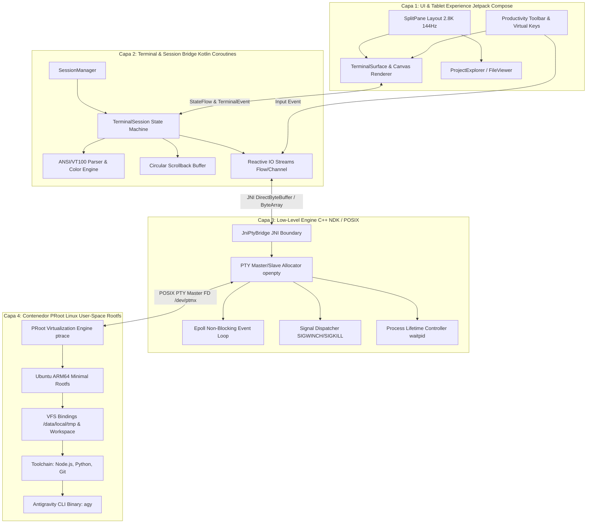
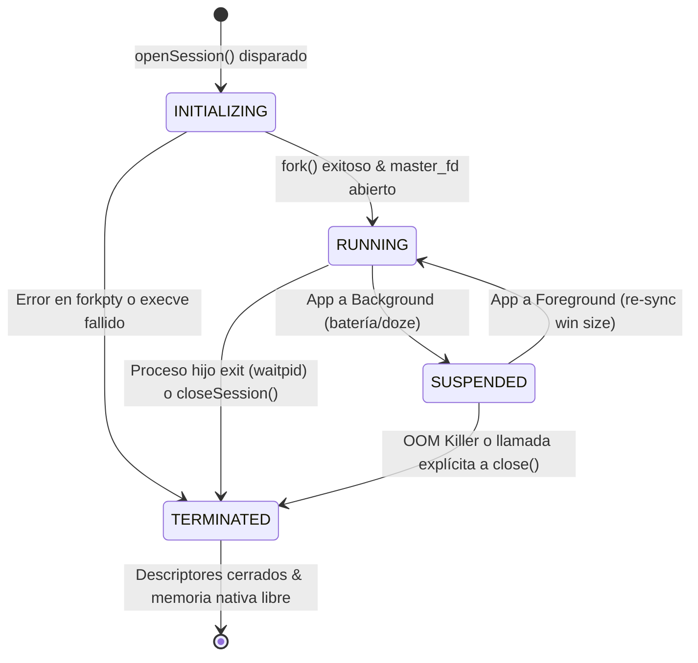

# SPEC-000: Arquitectura del Sistema - Antigravity Mobile

| Metadato | Valor |
| :--- | :--- |
| **Identificador** | `SPEC-000` |
| **Título** | Arquitectura General del Sistema y Runtime Agéntico Móvil |
| **Autor** | `spec_architect` |
| **Estado** | `APPROVED FOR IMPLEMENTATION` |
| **Fecha de Creación** | 2026-09-12 |
| **Dispositivo Objetivo** | Xiaomi Pad 6 (Qualcomm Snapdragon 870, ARM64-v8a, 6 GB RAM, 11" 2.8K 144Hz, HyperOS / Android 13/14) |
| **Runtime Target** | Kotlin 2.0+ / Jetpack Compose / Android NDK r26+ (C++20) / PRoot ARM64 Linux |

---

## 1. Visión General y Objetivos

### 1.1 Declaración del Problema y Visión
El desarrollo asistido por agentes inteligentes requiere entornos POSIX completos (compiladores, runtimes de Node.js/Python, herramientas de control de versiones y shells interactivos). Las soluciones móviles tradicionales dependen de servidores remotos (VPS/SSH) o terminales aisladas no especializadas (Termux), carentes de ergonomía para desarrollo agéntico asistido por IA y sin integración contextual entre la UI táctil y el flujo de trabajo de la herramienta.

**Antigravity Mobile** transforma la Xiaomi Pad 6 en una estación de trabajo agéntica autónoma y local (*local-first*), ejecutando la CLI de Antigravity (`agy`) directamente sobre el hardware del dispositivo mediante virtualización a nivel de espacio de usuario (PRoot), exponiendo una interfaz táctil y de teclado optimizada en Jetpack Compose con renderizado de terminal de baja latencia.

### 1.2 Objetivos de Arquitectura
1. **Autonomía Total (No-Cloud Dependency):** El runtime de Linux, el daemon de PTY y el entorno agéntico de `agy` deben ejecutarse 100% en el dispositivo en modo offline, sin necesidad de root ni desbloqueo de bootloader.
2. **Rendimiento de Grado de Producción:** Latencia de entrada de terminal $\le 16\,\text{ms}$ para sostener una tasa de refresco fluida a 144Hz en la pantalla 2.8K de la Xiaomi Pad 6.
3. **Ergonomía Especializada para Tablets:** Distribución adaptativa multi-panel (split view) y barra de herramientas contextual de productividad para mitigar la fricción de entrada táctil y potenciar teclados físicos.
4. **Aislamiento y Robustez:** Contención limpia de procesos hijo, control riguroso de señales POSIX (`SIGWINCH`, `SIGINT`, `SIGHUP`) y recolección garantizada de procesos huérfanos/zombies.

---

## 2. Descomposición Modular del Sistema

El sistema se estructura en cuatro capas desacopladas con contratos unidireccionales:



---

### 2.1 Capa 1: UI & Tablet Experience (Jetpack Compose)
Diseñada para maximizar el área de trabajo en la pantalla de 11 pulgadas (resolución nativa $2880 \times 1800$, relación de aspecto 16:10).

- **Layout Adaptativo Multi-Panel:**
  - `AdaptiveWorkspaceScaffold`: Soporte para orientación horizontal (*landscape*) nativa con divisor dinámico redimensionable (`SplitPane`).
  - Panel Izquierdo/Principal: Emulador de terminal con renderizado acelerado por hardware (`TerminalSurface`).
  - Panel Secundario (Colapsable / Deslizable): Explorador de árbol de archivos de proyecto, visualizador de diffs unificados y visor de logs estructurados de agentes.
- **Paleta y Tematización Oscura de Alto Contraste:**
  - Basado en Material 3 Dark Palette con fondo optimizado `#0D1117` / `#161B22` para reducir fatiga visual en sesiones prolongadas.
  - Tipografía monospace de ancho fijo obligatoria: `JetBrains Mono` con soporte completo para ligaduras de programación y glyphs de *Nerd Fonts* (Powerline, Git status, iconos de sistema).
- **Barra de Productividad y Teclas Virtuales (`ProductivityBar`):**
  - Fila superior persistente sobre el teclado en pantalla con modificadores esenciales ausentes en teclados móviles: `ESC`, `TAB`, `CTRL`, `ALT`, `PIPE (|)`, `TILDE (~)`, `BACKTICK (\`)`, `ARROWS (↑, ↓, ←, →)`.
  - Botones de acción rápida dedicados para la CLI de Antigravity: `agy run`, `agy test`, `agy diff`, `agy commit`, `Interrupt (SIGINT ^C)`.
  - Atajos de teclado físico (soporte para Xiaomi Smart Keyboard / Bluetooth): `Ctrl+Tab` para ciclar sesiones, `Ctrl+Shift+F` para búsqueda en scrollback, `Ctrl+L` para limpiar pantalla.

---

### 2.2 Capa 2: Terminal & Session Bridge (Kotlin & Coroutines)
Actúa como el núcleo de mediación reactiva entre la capa de presentación y el motor nativo de PTY.

- **Gestión de Sesiones Concurrentes (`SessionManager`):**
  - Mantiene un pool de `TerminalSession` activas identificadas por `UUID`.
  - Soporta cambio de contexto instantáneo sin destruir el proceso subyacente.
- **Parser ANSI/VT100 / xterm-256color:**
  - Decodificación por máquina de estados de secuencias de escape ANSI (SGR, secuencias de movimiento de cursor, modo de pantalla alternativa DEC `\e[?1049h`, borrado de línea/pantalla).
  - Mapeo de estilos: atributos de texto (negrita, cursiva, subrayado), paleta de 16 colores estándar, paleta de 256 colores e índices TrueColor de 24 bits (RGB).
- **Buffer de Scrollback Circular (`CircularScrollbackBuffer`):**
  - Buffer en memoria de alta eficiencia basado en arrays primitivos lineales para mitigar presión en el recolector de basura (GC).
  - Capacidad predeterminada: 10,000 líneas.
  - Operaciones O(1) de inserción de línea y O(log N) para búsqueda binaria de texto y selección de bloques rectangulares.
- **Streams Reactivos Asíncronos:**
  - Salida desde PTY a UI: `Flow<ByteArray>` procesado en un `CoroutineDispatcher` de cómputo dedicado (`Dispatchers.Default`), emitido como `StateFlow<TerminalFrame>` a la UI.
  - Entrada desde UI/Teclado a PTY: `Channel<ByteArray>(capacity = Channel.BUFFERED)` consumido en `Dispatchers.IO` hacia el descriptor de escritura nativo.

---

### 2.3 Capa 3: Low-Level Engine (C++ NDK & POSIX PTY)
Implementación nativa compilada contra Android NDK r26+ (`arm64-v8a`) con estándar C++20 para control de bajo nivel del sistema operativo.

- **Gestión de Pseudo-Terminales (PTY Master/Slave):**
  - Asignación mediante `openpty(&master_fd, &slave_fd, nullptr, &win, nullptr)` o implementación manual robusta con `posix_openpt(O_RDWR | O_NOCTTY | O_CLOEXEC)`, `grantpt`, `unlockpt` y `ptsname_r`.
  - Configuración del esclavo PTY: modo de entrada/salida raw (`termios`), habilitación de control de flujo estándar y codificación UTF-8 (`IUTF8`).
- **Loop de I/O Asíncrono no Bloqueante con `epoll`:**
  - El descriptor master PTY opera en modo `O_NONBLOCK`.
  - Un hilo dedicado nativo corre un bucle `epoll_wait` para detectar eventos `EPOLLIN`, `EPOLLHUP` y `EPOLLERR`, transfiriendo buffers de lectura a la capa Java/Kotlin con cero copias innecesarias mediante `DirectByteBuffer`.
- **Despacho de Señales y Control de Procesos:**
  - Redimensionamiento de pantalla: Actualización de `struct winsize` vía `ioctl(master_fd, TIOCSWINSZ, &ws)` propagando automáticamente `SIGWINCH` al grupo de procesos hijo.
  - Creación de sesiones aisladas mediante `fork()` / `execve()` con llamada a `setsid()` en el proceso hijo para desacoplarlo del proceso host de Android.
  - Prevención de procesos zombies: monitorización activa mediante `waitpid(child_pid, &status, WNOHANG)` en un thread nativo de supervisión o mediante captura de `SIGCHLD`.

---

### 2.4 Capa 4: Contenedor PRoot Linux (Ubuntu ARM64)
Proporciona el espacio de usuario GNU/Linux sin privilegios de root ni modificaciones del kernel de HyperOS.

- **Mecanismo de Virtualización PRoot:**
  - Utiliza `ptrace(2)` en el espacio de usuario para interceptar y reescribir llamadas al sistema (`sys_openat`, `sys_stat`, `sys_readlink`, etc.).
  - Emulación de privilegios: ejecuta programas simulando UID 0 (`root`) de forma segura dentro del rootfs mediante la bandera `-0`.
- **Bootstrap y Distribución Base:**
  - Rootfs mínimo de Ubuntu 22.04 / 24.04 LTS para arquitectura `aarch64`.
  - Despliegue empaquetado en assets o descargable en el primer arranque hacia `${CONTEXT_FILES_DIR}/rootfs/ubuntu-arm64`.
- **Esquema de Montajes Virtuales (Bindings):**
  - `/dev`, `/proc`, `/sys` mapeados de forma coherente desde el host de Android.
  - Directorio de intercambio temporal: `/data/local/tmp` enlazado a `/tmp` dentro del contenedor.
  - Directorio de proyectos y workspace: `${APP_INTERNAL_STORAGE}/workspaces` montado en `/root/workspace` o `/home/antigravity/workspace`.
  - Enlaces de lectura/escritura hacia almacenamiento accesible mediante Storage Access Framework (SAF) para persistencia externa.
- **Entorno de Ejecución Agéntico (`agy` Toolchain):**
  - Variables de entorno obligatorias inicializadas:
    ```bash
    export PATH=/usr/local/sbin:/usr/local/bin:/usr/sbin:/usr/bin:/sbin:/bin:$HOME/.antigravity/bin
    export HOME=/root
    export TERM=xterm-256color
    export LANG=C.UTF-8
    export LC_ALL=C.UTF-8
    ```
  - Instalación preconfigurada o script de aprovisionamiento de Node.js v20+, Python 3.11+, Git, y la CLI compilada de `agy`.

---

## 3. Contratos de Interfaces (APIs / IPC)

### 3.1 Contrato JNI Kotlin $\leftrightarrow$ C++ NDK

#### 3.1.1 Manejadores y Estructuras de Datos
El identificador de sesión nativa se gestiona como un puntero opaco encapsulado en un handle seguro de 64 bits (`jlong` $\leftrightarrow$ `uintptr_t`).

```kotlin
package com.antigravity.mobile.core.pty

/**
 * Handle de sesión nativa PTY.
 * @property nativeHandle Dirección de memoria del struct PtySession nativo.
 */
@JvmInline
value class PtyHandle(val nativeHandle: Long) {
    val isValid: Boolean get() = nativeHandle != 0L
    companion object {
        val INVALID = PtyHandle(0L)
    }
}

/**
 * Dimensiones físicas de la ventana de la terminal en celdas y píxeles.
 */
data class PtyWindowSize(
    val rows: Int,
    val cols: Int,
    val pixelWidth: Int = 0,
    val pixelHeight: Int = 0
)
```

#### 3.1.2 Declaración de Métodos Nativos en Kotlin (`NativePtyBridge`)
```kotlin
package com.antigravity.mobile.core.pty

import java.nio.ByteBuffer

interface NativePtyBridge {
    /**
     * Inicializa y hace fork de un proceso bajo una PTY POSIX.
     *
     * @param executable Ruta absoluta al binario ejecutable (ej. proot o bash).
     * @param args Array de argumentos de línea de comandos.
     * @param env Array de variables de entorno con formato "CLAVE=VALOR".
     * @param cwd Directorio de trabajo inicial.
     * @param rows Número inicial de filas de caracteres.
     * @param cols Número inicial de columnas de caracteres.
     * @return PtyHandle válido si la operación tuvo éxito, o un handle inválido en caso de error.
     */
    fun openSession(
        executable: String,
        args: Array<String>,
        env: Array<String>,
        cwd: String,
        rows: Int,
        cols: Int
    ): PtyHandle

    /**
     * Escribe bytes en el descriptor maestro de la PTY.
     * @return Número de bytes efectivamente escritos, o código de error negativo.
     */
    fun write(handle: PtyHandle, buffer: ByteArray, offset: Int, length: Int): Int

    /**
     * Lectura no bloqueante desde el descriptor maestro.
     * @return Número de bytes leídos (0 si no hay datos disponibles), o -1 en EOF/error.
     */
    fun read(handle: PtyHandle, buffer: ByteArray, offset: Int, length: Int): Int

    /**
     * Escribe datos directamente usando un buffer fuera del heap (zero-copy).
     */
    fun readDirect(handle: PtyHandle, directBuffer: ByteBuffer, capacity: Int): Int

    /**
     * Envía SIGWINCH y actualiza la estructura winsize del terminal.
     */
    fun resize(handle: PtyHandle, rows: Int, cols: Int, pixelWidth: Int, pixelHeight: Int): Boolean

    /**
     * Envía una señal POSIX estándar al grupo de procesos hijo.
     * @param signal Código numérico de la señal (ej. 2 = SIGINT, 9 = SIGKILL, 15 = SIGTERM, 28 = SIGWINCH).
     */
    fun signal(handle: PtyHandle, signal: Int): Boolean

    /**
     * Espera de forma no bloqueante o con timeout la salida del proceso.
     * @return Código de salida del proceso, o -1 si continúa en ejecución.
     */
    fun pollExitCode(handle: PtyHandle): Int

    /**
     * Cierra los descriptores PTY y libera las estructuras de memoria nativas asociadas.
     */
    fun closeSession(handle: PtyHandle)
}
```

#### 3.1.3 Definición de Cabecera C++ (`native_pty.h`)
```cpp
#ifndef ANTIGRAVITY_NATIVE_PTY_H
#define ANTIGRAVITY_NATIVE_PTY_H

#include <jni.h>
#include <sys/types.h>
#include <termios.h>

#ifdef __cplusplus
extern "C" {
#endif

struct PtySession {
    int master_fd;
    pid_t child_pid;
    int exit_status;
    bool is_terminated;
};

JNIEXPORT jlong JNICALL
Java_com_antigravity_mobile_core_pty_NativePtyBridgeImpl_openSession(
    JNIEnv* env,
    jobject thiz,
    jstring executable,
    jobjectArray args,
    jobjectArray envp,
    jstring cwd,
    jint rows,
    jint cols
);

JNIEXPORT jint JNICALL
Java_com_antigravity_mobile_core_pty_NativePtyBridgeImpl_write(
    JNIEnv* env,
    jobject thiz,
    jlong handle,
    jbyteArray buffer,
    jint offset,
    jint length
);

JNIEXPORT jint JNICALL
Java_com_antigravity_mobile_core_pty_NativePtyBridgeImpl_read(
    JNIEnv* env,
    jobject thiz,
    jlong handle,
    jbyteArray buffer,
    jint offset,
    jint length
);

JNIEXPORT jint JNICALL
Java_com_antigravity_mobile_core_pty_NativePtyBridgeImpl_readDirect(
    JNIEnv* env,
    jobject thiz,
    jlong handle,
    jobject direct_buffer,
    jint capacity
);

JNIEXPORT jboolean JNICALL
Java_com_antigravity_mobile_core_pty_NativePtyBridgeImpl_resize(
    JNIEnv* env,
    jobject thiz,
    jlong handle,
    jint rows,
    jint cols,
    jint pixel_width,
    jint pixel_height
);

JNIEXPORT jboolean JNICALL
Java_com_antigravity_mobile_core_pty_NativePtyBridgeImpl_signal(
    JNIEnv* env,
    jobject thiz,
    jlong handle,
    jint signal_code
);

JNIEXPORT jint JNICALL
Java_com_antigravity_mobile_core_pty_NativePtyBridgeImpl_pollExitCode(
    JNIEnv* env,
    jobject thiz,
    jlong handle
);

JNIEXPORT void JNICALL
Java_com_antigravity_mobile_core_pty_NativePtyBridgeImpl_closeSession(
    JNIEnv* env,
    jobject thiz,
    jlong handle
);

#ifdef __cplusplus
}
#endif

#endif // ANTIGRAVITY_NATIVE_PTY_H
```

---

### 3.2 Máquina de Estados del Ciclo de Vida de la Sesión



#### 3.2.1 Definición de Estados y Eventos en Kotlin
```kotlin
package com.antigravity.mobile.core.session

sealed interface SessionState {
    data object Initializing : SessionState
    data class Running(val pid: Int, val ttyPath: String) : SessionState
    data class Suspended(val reason: String) : SessionState
    data class Terminated(val exitCode: Int, val terminationSignal: Int? = null) : SessionState
}

sealed interface SessionEvent {
    data class OutputReceived(val bytes: ByteArray) : SessionEvent
    data class StateChanged(val newState: SessionState) : SessionEvent
    data class BellRang(val visualOnly: Boolean = true) : SessionEvent
    data class ErrorOccurred(val throwable: Throwable) : SessionEvent
}
```

---

## 4. Restricciones del Sistema Operativo Android y Seguridad

### 4.1 Restricciones W^X y Ejecución de Binarios
- A partir de Android 10 (API 29) y con SELinux en modo Enforcing, ejecutar binarios nativos ubicados en directorios con permisos de escritura (como `/data/data/.../files`) está severamente restringido a menos que se cumplan las políticas de la aplicación.
- **Estrategia Antigravity:**
  1. El binario estático de `proot` debe empaquetarse y distribuirse como biblioteca compartida simulada dentro del APK en `jniLibs/arm64-v8a/libproot.so` para que el sistema operativo lo instale con permisos de ejecución nativos (`r-x`) en `${CONTEXT.applicationInfo.nativeLibraryDir}`.
  2. Al invocar `proot`, se ejecuta directamente la ruta en `nativeLibraryDir`.

### 4.2 Supervivencia en Segundo Plano (Foreground Service)
- Para evitar que HyperOS y Android OS suspendan las sesiones de terminal de larga duración o la compilación de tareas agénticas, la sesión activa debe anclarse a un **Foreground Service** con tipo `foregroundServiceType="specialUse"` o `shortService`/`dataSync` según las directrices de Android 14.
- Se mantendrá un `WakeLock` parcial controlado mientras haya procesos activos en segundo plano (`SessionState.Running`).

---

## 5. Criterios de Aceptación Verificables (Acceptance Criteria)

Este checklist formal sirve como especificación contractual para la construcción del arnés de pruebas automatizado por el agente `qa_harness`:

| ID | Módulo | Criterio de Aceptación | Método de Verificación |
| :--- | :--- | :--- | :--- |
| **`AC-ARCH-001`** | PTY Engine | Asignación correcta de master/slave PTY mediante JNI retornando un `PtyHandle` válido y descriptor abierto. | Test unitario instrumentado en Android (`PtyLifecycleTest`). |
| **`AC-ARCH-002`** | PTY Engine | La escritura de bytes (`write`) en el PTY master genera eco legible inmediato en `read` en modo canónico o procesado según configuración `termios`. | Test de loopback nativo JNI. |
| **`AC-ARCH-003`** | PTY Engine | La llamada `resize(rows, cols)` actualiza `winsize` e induce la señal `SIGWINCH` comprobada en el proceso hijo. | Test de verificación de señal con handler `SIGWINCH` en proceso de prueba. |
| **`AC-ARCH-004`** | PTY Engine | `closeSession()` cierra todos los descriptores de archivo asociados y no deja procesos zombis (`waitpid` finalizado). | Inspección de `/proc/[pid]` y retorno de estado de proceso en suite de tests. |
| **`AC-ARCH-005`** | Terminal Session | Flujo reactivo `Flow<ByteArray>` no pierde paquetes bajo ráfagas intensivas de datos ($\ge 1\,\text{MB/s}$). | Test de estrés de buffer con generación continua de secuencias ANSI. |
| **`AC-ARCH-006`** | Terminal Session | El `CircularScrollbackBuffer` almacena hasta 10,000 líneas sin desbordamiento de memoria (`OutOfMemoryError`). | Microbenchmark de asignación de memoria heap de JVM. |
| **`AC-ARCH-007`** | PRoot Linux | Descompresión y bootstrap del rootfs de Ubuntu ARM64 en el almacenamiento privado de la app finaliza con código 0. | Test de integración de bootstrap en emulador ARM64 o dispositivo real. |
| **`AC-ARCH-008`** | PRoot Linux | Ejecución exitosa de comandos GNU básicos (`/bin/uname -m`, `/bin/ls /`) dentro del sandbox de PRoot retornando `aarch64`. | Test de ejecución de subproceso PRoot vía PTY. |
| **`AC-ARCH-009`** | PRoot Linux | Los montajes virtuales de `/data/local/tmp` y carpetas de proyecto son accesibles con permisos de lectura/escritura dentro de PRoot. | Test de I/O de archivos en directorio compartido host $\leftrightarrow$ guest. |
| **`AC-ARCH-010`** | UI Compose | El layout `SplitPane` responde a cambios de orientación y mantiene una relación de aspecto fluida sin reconstrucción de PTY. | Test UI con ComposeTestRule validando persistencia de sesión al rotar. |
| **`AC-ARCH-011`** | UI Compose | La barra de herramientas de productividad emite los códigos ASCII/ANSI esperados (`ESC` = `0x1B`, `Ctrl+C` = `0x03`, `TAB` = `0x09`). | Test unitario de mapping de eventos de teclado en `ProductivityBar`. |
| **`AC-ARCH-012`** | UI Latency | El tiempo entre la llegada de bytes de PTY y la recomposición visual de la superficie de terminal es $\le 16\,\text{ms}$. | Benchmark de renderizado con AndroidX Macrobenchmark. |

---

## 6. Hoja de Ruta de Implementación para Subagentes

1. **`android-core` (Próximo paso técnico):**
   - Implementar `specs/01-pty-terminal-contract.md` detallando las firmas C++ y la integración de CMake.
   - Construir la librería nativa `libantigravity-pty.so` con implementaciones de `openpty`, `epoll` y despacho de señales.
   - Empaquetar y configurar el ejecutable `proot` y los scripts de descompresión del rootfs Ubuntu ARM64.
2. **`ui-designer`:**
   - Implementar `specs/02-ui-tablet-design.md` con los tokens de diseño Material 3, canvas de renderizado para terminal y componentes de la barra de herramientas.
3. **`qa-harness`:**
   - Crear el framework de pruebas automatizadas bajo `harness/` implementando la suite de validación para los criterios `AC-ARCH-001` a `AC-ARCH-012`.
