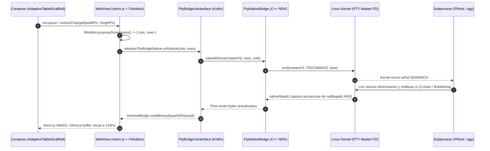

# SPEC-001: Blueprint Técnico de Antigravity Studio (UI Compose, PTY NDK y xterm.js)

| Metadato | Valor |
| :--- | :--- |
| **Identificador** | `SPEC-001` |
| **Título** | Blueprint Técnico de Antigravity Studio (UI Compose, PTY NDK y xterm.js) |
| **Autor** | `spec_architect` |
| **Estado** | `APPROVED FOR IMPLEMENTATION` |
| **Fecha de Creación** | 2026-09-12 |
| **Dispositivo Objetivo** | Xiaomi Pad 6 (Qualcomm Snapdragon 870, ARM64-v8a, 6 GB RAM, 11" 2.8K 144Hz, HyperOS / Android 13/14) |
| **Runtime Target** | Kotlin 2.0+ / Jetpack Compose Material 3 / Android NDK C++20 / xterm.js WebGL |
| **Nombre de la Aplicación** | Antigravity Studio |
| **Package ID** | `com.antigravity.studio` |

---

## 1. Visión General, Contexto y Arquitectura de la Solución

### 1.1 Contexto y Propósito
**Antigravity Studio** (`com.antigravity.studio`) es la aplicación Android nativa diseñada para transformar la tablet **Xiaomi Pad 6** en una estación de ingeniería agéntica autónoma y local (*local-first*). La aplicación integra:
1. Una capa de presentación ergonómica en **Jetpack Compose (Material 3)** optimizada para la relación de aspecto 16:10 y resolución 2.8K de la pantalla de 11 pulgadas.
2. Un puente de terminal híbrido de ultra alto rendimiento que ejecuta **xterm.js con aceleración por hardware WebGL** embebido dentro de un `WebView` altamente optimizado.
3. Un motor de bajo nivel compilado en **C++20 (Android NDK)** que gestiona pseudo-terminales POSIX (`pty`) mediante llamadas al sistema Linux directas y comunicación JNI sin sobrecarga de recolección de basura.
4. Soporte directo para orquestar la CLI de Antigravity (`agy`) y entornos virtualizados en espacio de usuario (PRoot Ubuntu ARM64).

### 1.2 Por qué xterm.js con WebGL en Android
Aunque un renderizador nativo sobre `androidx.compose.ui.graphics.Canvas` es técnicamente viable, `xterm.js` complementado con `@xterm/addon-webgl` ofrece ventajas determinantes para estaciones de trabajo móviles:
- **Compatibilidad Terminal Estándar:** Soporte maduro e inmediato para secuencias de escape ANSI/VT100/VT220/xterm-256color, modos de pantalla alternativa DEC (`\e[?1049h`), tracking de eventos de ratón SGR (`\e[?1006h`), osciladores de cursor y paletas TrueColor (24-bit RGB).
- **Rendimiento GPU Extremo a 144Hz:** El addon WebGL sube el atlas de glifos a texturas de GPU mediante un contexto WebGL2 acelerado por hardware. En la GPU Adreno 650 del Snapdragon 870, esto permite sostener una tasa de refresco de 144 FPS estables con latencia de cuadro inferior a $6.94\,\text{ms}$, superando holgadamente el requisito de latencia interactiva $\le 16\,\text{ms}$.
- **Consistencia Tipográfica:** Renderizado idéntico de fuentes monospace de programación con ligaduras complejas y símbolos de *Nerd Fonts* (iconos de Git, ramas, status bars de Neovim/Tmux).

---

## 2. Identidad Visual y Sistema de Diseño (Design System)

La interfaz de Antigravity Studio implementa el lenguaje estético **Cyber-Obsidian**, combinando tonos oscuros profundos para mitigar la fatiga visual en sesiones prolongadas de programación con acentos de alta luminosidad que identifican el estado agéntico.

### 2.1 Paleta de Colores
| Nombre del Token | Valor Hexadecimal | Uso Principal |
| :--- | :--- | :--- |
| `CyberObsidian` | `#0B0E14` | Fondo principal de la ventana y viewport de la terminal. |
| `SurfaceObsidian` | `#111622` | Superficie de paneles laterales, barras de herramientas y diálogos. |
| `SurfaceElevated` | `#182030` | Tarjetas elevadas, estados hover y botones secundarios. |
| `NeonCyan` | `#00F0FF` | Acento primario, cursor de terminal, prompts agénticos, enlaces activos. |
| `CosmicViolet` | `#8B5CF6` | Acento secundario, badges de agentes, indicadores de compilación y ejecución. |
| `TextPrimary` | `#E6EDF3` | Tipografía principal de alto contraste (W3C AAA). |
| `TextSecondary` | `#8B949E` | Metadatos, etiquetas inactivas y números de línea. |
| `BorderObsidian` | `#1E2638` | Divisores estructurales y bordes de paneles multi-ventana. |
| `StatusSuccess` | `#22C55E` | Pruebas superadas, procesos en ejecución (`EXIT_SUCCESS`). |
| `StatusError` | `#EF4444` | Fallos de ejecución, `SIGSEGV`, errores del compilador. |
| `StatusWarning` | `#F59E0B` | Advertencias de linter y alertas del harness. |

### 2.2 Tipografía
- **Familia Primaria de Código:** `JetBrains Mono` con soporte completo para ligaduras tipográficas (`calt`, `liga`) y símbolos de *Powerline / Nerd Fonts*.
- **Familia Primaria de UI:** `Inter` o `Roboto Flex` para controles del sistema, menús y botones.
- **Tamaño de Fuente Base en Terminal:** $13\,\text{sp}$ por defecto, escalable dinámicamente mediante gestos de pellizco (*pinch-to-zoom*) entre $9\,\text{sp}$ y $24\,\text{sp}$.

---

## 3. Diagramas Arquitectónicos del Sistema

### 3.1 Flujo General de Componentes e I/O de Datos
El siguiente diagrama detalla cómo interactúan las capas de presentación Jetpack Compose, el WebView con xterm.js WebGL, la capa intermedia reactiva Kotlin y el motor POSIX C++ NDK:

```mermaid
graph TD
    subgraph UI Layer Compose & Hardware Viewport
        A1[AdaptiveTabletScaffold] --> A2[ProductivityToolbar Modifier Bar]
        A1 --> A3[TerminalViewBridge AndroidView]
        A1 --> A4[WorkspaceInspector SidePanel]
    end

    subgraph Emulation & Graphics Layer WebView Sandbox
        A3 --> B1[WebView Hardware-Accelerated]
        B1 --> B2[xterm.js Terminal Instance]
        B2 --> B3[@xterm/addon-webgl GPU Atlas]
        B2 --> B4[@xterm/addon-fit FitAddon]
    end

    subgraph Inter-Process / Bridge Layer Kotlin Coroutines
        C1[PtyBridgeJsInterface @JavascriptInterface] <-->|Bidirectional IPC| B2
        C2[PtySessionManager] <--> C1
        C2 --> C3[Flow Output Channel]
        C2 --> C4[Channel Input Buffer]
    end

    subgraph Native Engine Layer C++20 NDK
        D1[PtyNativeBridge JNI Boundary] <--> C2
        D1 --> D2[nativeCreateSubprocess forkpty / openpty]
        D1 --> D3[nativeWrite / nativeRead non-blocking]
        D1 --> D4[nativeResize TIOCSWINSZ]
        D1 --> D5[nativeClose waitpid / SIGKILL]
    end

    subgraph Operating System & Sandbox POSIX Subprocess
        D2 <-->|Master FD /dev/ptmx| E1[PRoot Linux Subprocess or Shell]
        E1 --> E2[Ubuntu ARM64 Minimal User-Space]
        E2 --> E3[Antigravity CLI Binary: agy]
    end

    A2 -->|Key / Command Events| C2
    C3 -->|evaluateJavascript writeBinary| B2
```

---

### 3.2 Diagrama de Secuencia: Redimensionamiento Dinámico de Ventana (Resize Flow)
Cuando el usuario ajusta el divisor en `AdaptiveTabletScaffold` o rota el dispositivo, la ventana gráfica debe propagar la nueva dimensión de caracteres (`cols` y `rows`) sin desbordamientos visuales ni pérdida de texto:



---

## 4. Componentes UI Clave en Jetpack Compose

### 4.1 `AdaptiveTabletScaffold`
El scaffold adaptativo gestiona el espacio de trabajo en la pantalla de 11 pulgadas de la Xiaomi Pad 6 (resolución nativa $2880 \times 1800$ píxeles, relación de aspecto 16:10).

#### Principios de Diseño:
1. **Landscape-First:** Optimizado prioritariamente para uso en atril o teclado físico acoplado (*Xiaomi Smart Keyboard* o periféricos USB-C/Bluetooth).
2. **Divisor de Proporción Dinámica (Dynamic Splitter):** Divide la pantalla entre el área de terminal (`TerminalViewBridge`) y el panel de contexto/inspector (`WorkspaceInspector`). Proporción por defecto: $65\%$ terminal / $35\%$ inspector, ajustable mediante arrastre táctil continuo.
3. **Soporte Adaptativo Portrait:** En orientación vertical, el panel de inspección colapsa automáticamente a un `ModalNavigationDrawer` o una hoja inferior deslizable (`BottomSheet`), otorgando el 100% del ancho a la terminal.
4. **Resistencia a Recomposiciones:** El estado de la sesión nativa (`masterFd`, buffers) se preserva en un `ViewModel` con ciclo de vida vinculado a la actividad para evitar destrucciones accidentales durante cambios de configuración.

#### Contrato de Interfaz Kotlin:
```kotlin
package com.antigravity.studio.ui.layout

import androidx.compose.runtime.Composable
import androidx.compose.ui.Modifier

/**
 * Estado que gobierna la disposición adaptativa multi-panel.
 */
data class AdaptiveTabletScaffoldState(
    val splitFraction: Float = 0.65f,
    val isInspectorExpanded: Boolean = true,
    val isLandscape: Boolean = true
)

/**
 * Scaffold adaptativo para tablets de 11 pulgadas optimizado para 144Hz.
 *
 * @param modifier Modificador de diseño Compose.
 * @param state Estado reactivo del layout.
 * @param onSplitFractionChange Callback emitido al arrastrar el divisor central.
 * @param toolbar Barra de productividad táctil (superior o inferior).
 * @param terminalSlot Contenedor dedicado a la superficie de terminal interactiva.
 * @param inspectorSlot Contenedor dedicado al explorador de archivos, visor de diffs y logs agénticos.
 */
@Composable
fun AdaptiveTabletScaffold(
    modifier: Modifier = Modifier,
    state: AdaptiveTabletScaffoldState,
    onSplitFractionChange: (Float) -> Unit,
    toolbar: @Composable () -> Unit,
    terminalSlot: @Composable () -> Unit,
    inspectorSlot: @Composable () -> Unit
)
```

---

### 4.2 `ProductivityToolbar`
La barra de herramientas de productividad resuelve la carencia de teclas físicas críticas en teclados virtuales móviles y acelera la interacción con la CLI `agy`.

#### Funcionalidades y Teclas:
1. **Modificadores de Estado (Sticky/Latch Keys):**
   - `CTRL`: Alterna estado activo. Cuando está activo, la siguiente tecla alfanumérica pulsada se traduce a su código de control ASCII correspondiente (ej. `CTRL` + `C` = `\x03`, `CTRL` + `D` = `\x04`, `CTRL` + `Z` = `\x1A`).
   - `ALT`: Emite prefijo `ESC` (`\x1B`) antes del siguiente carácter pulsado.
2. **Teclas Inmediatas de Navegación y Código:**
   - `ESC` (`\x1B`), `TAB` (`\x09`), `PIPE (|)`, `TILDE (~)`, `BACKTICK (\`)`, `SLASH (/)`, `BACKSLASH (\)`.
   - Flechas direccionales: `↑` (`\x1B[A`), `↓` (`\x1B[B`), `→` (`\x1B[C`), `←` (`\x1B[D`).
3. **Comandos de Acceso Rápido para Antigravity (`agy` Shortcuts):**
   - `agy run`: Envía directamente `agy run\r` al PTY.
   - `agy test`: Envía directamente `agy test\r` al PTY.
   - `SIGINT (^C)`: Envía inmediatamente la secuencia de interrupción `\x03`.
4. **Respuesta Háptica:** Cada pulsación desencadena retroalimentación háptica sutil (`HapticFeedbackType.TextHandleMove`) calibrada para el motor de vibración háptico de la Xiaomi Pad 6.

#### Contrato de Interfaz Kotlin:
```kotlin
package com.antigravity.studio.ui.toolbar

import androidx.compose.runtime.Composable
import androidx.compose.ui.Modifier

sealed interface KeyAction {
    data class RawBytes(val bytes: ByteArray) : KeyAction
    data class ShortcutCommand(val commandText: String) : KeyAction
    data object ToggleCtrl : KeyAction
    data object ToggleAlt : KeyAction
}

@Composable
fun ProductivityToolbar(
    modifier: Modifier = Modifier,
    isCtrlActive: Boolean,
    isAltActive: Boolean,
    onKeyAction: (KeyAction) -> Unit
)
```

---

### 4.3 `TerminalViewBridge`
El componente `TerminalViewBridge` encapsula la instancia de `android.webkit.WebView` en un composable `AndroidView`, configurando aceleración por hardware con WebGL y estableciendo el canal de enlace bidireccional de baja latencia ($\le 16\,\text{ms}$).

#### Requisitos de Configuración de WebView:
- **Aceleración Gráfica:** Habilitar aceleración por hardware a nivel de ventana (`LAYER_TYPE_HARDWARE`).
- **Seguridad y Origen Seguro:** Los archivos locales de xterm.js se sirven mediante `androidx.webkit.WebViewAssetLoader` utilizando el esquema seguro `https://appassets.androidplatform.net/assets/terminal/` para evitar vulnerabilidades de `file:///` y permitir almacenamiento local/IndexedDB.
- **Configuración de Renderizado:** WebGL2 y DOM Storage habilitados; deshabilitar soporte de zoom multitáctil nativo del WebView para que `xterm.js` maneje eventos táctiles limpios.

#### Contrato de Interfaz Kotlin:
```kotlin
package com.antigravity.studio.ui.terminal

import androidx.compose.runtime.Composable
import androidx.compose.ui.Modifier
import kotlinx.coroutines.flow.SharedFlow

/**
 * Contenedor Compose para el emulador de terminal xterm.js WebGL.
 *
 * @param modifier Modificador Compose.
 * @param outputStream Flujo reactivo de datos crudos provenientes del PTY master.
 * @param onUserInput Callback para emitir bytes de teclado o pegar texto hacia el PTY.
 * @param onTerminalResized Callback emitido cuando xterm.js calcula nuevas columnas y filas.
 * @param onRendererReady Callback invocado una vez que el contexto WebGL está listo para dibujar.
 */
@Composable
fun TerminalViewBridge(
    modifier: Modifier = Modifier,
    outputStream: SharedFlow<ByteArray>,
    onUserInput: (ByteArray) -> Unit,
    onTerminalResized: (cols: Int, rows: Int) -> Unit,
    onRendererReady: () -> Unit
)
```

---

## 5. Capa Nativa PTY (C++20 NDK)

La capa nativa interactúa directamente con el kernel de Linux subyacente de Android mediante llamadas al sistema POSIX, asignando descriptores pseudo-terminales (`/dev/ptmx`), controlando el ciclo de vida de los procesos y transmitiendo datos con baja latencia.

### 5.1 Firmas JNI del Puente Nativo (`PtyNativeBridge`)

La clase Kotlin `PtyNativeBridge` declara los métodos nativos invocados por la capa de sesión:

```kotlin
package com.antigravity.studio.core.pty

/**
 * Enlace directo con la biblioteca nativa libantigravity_studio_pty.so.
 */
object PtyNativeBridge {

    init {
        System.loadLibrary("antigravity_studio_pty")
    }

    /**
     * Crea un nuevo pseudoterminal POSIX y hace fork/exec del binario objetivo.
     *
     * @param executable Ruta absoluta al ejecutable (ej. "/system/bin/sh" o binario proot).
     * @param args Array de argumentos de línea de comandos.
     * @param envp Variables de entorno en formato "KEY=VALUE".
     * @param cwd Directorio de trabajo inicial para el subproceso.
     * @param rows Número inicial de filas de la terminal.
     * @param cols Número inicial de columnas de la terminal.
     * @param outMasterFd Array de 1 posición para devolver el descriptor de archivo maestro PTY.
     * @return El Process ID (PID) del proceso hijo creado, o código de error negativo si falla.
     */
    external fun nativeCreateSubprocess(
        executable: String,
        args: Array<String>,
        envp: Array<String>,
        cwd: String,
        rows: Int,
        cols: Int,
        outMasterFd: IntArray
    ): Int

    /**
     * Escribe bytes de entrada de forma sincrónica en el descriptor maestro del PTY.
     *
     * @param masterFd Descriptor de archivo PTY maestro retornado por nativeCreateSubprocess.
     * @param buffer Array de bytes a transmitir al subproceso.
     * @param offset Posición inicial en el array.
     * @param length Cantidad de bytes a escribir.
     * @return Cantidad de bytes efectivamente escritos, o < 0 en caso de error POSIX.
     */
    external fun nativeWrite(
        masterFd: Int,
        buffer: ByteArray,
        offset: Int,
        length: Int
    ): Int

    /**
     * Lee bytes de salida disponibles desde el descriptor maestro del PTY de forma no bloqueante.
     *
     * @param masterFd Descriptor de archivo PTY maestro.
     * @param buffer Array de destino donde se depositarán los bytes leídos.
     * @param offset Posición inicial en el array de destino.
     * @param length Capacidad máxima de lectura solicitada.
     * @return Cantidad de bytes leídos (0 si no hay datos disponibles en modo non-blocking),
     *         o -1 en caso de fin de archivo (EOF / hang-up) o error.
     */
    external fun nativeRead(
        masterFd: Int,
        buffer: ByteArray,
        offset: Int,
        length: Int
    ): Int

    /**
     * Actualiza el tamaño de la ventana de la terminal (TIOCSWINSZ) y propaga SIGWINCH.
     *
     * @param masterFd Descriptor de archivo PTY maestro.
     * @param rows Nuevo número de filas de caracteres.
     * @param cols Nuevo número de columnas de caracteres.
     * @return true si la llamada ioctl tuvo éxito, false en caso contrario.
     */
    external fun nativeResize(
        masterFd: Int,
        rows: Int,
        cols: Int
    ): Boolean

    /**
     * Cierra el descriptor PTY maestro y recolecta el estado del proceso hijo mediante waitpid.
     *
     * @param masterFd Descriptor de archivo PTY maestro a cerrar.
     * @param childPid PID del proceso hijo para envío de señales y recolección.
     * @return Código de salida del proceso hijo, o código de terminación por señal.
     */
    external fun nativeClose(
        masterFd: Int,
        childPid: Int
    ): Int
}
```

---

### 5.2 Definición de Cabecera C++ (`pty_native.h`)

La interfaz C++20 que implementa los bindings JNI:

```cpp
#ifndef ANTIGRAVITY_STUDIO_PTY_NATIVE_H
#define ANTIGRAVITY_STUDIO_PTY_NATIVE_H

#include <jni.h>
#include <sys/types.h>
#include <termios.h>

#ifdef __cplusplus
extern "C" {
#endif

/*
 * Métodos JNI correspondientes al package com.antigravity.studio.core.pty.PtyNativeBridge
 */

JNIEXPORT jint JNICALL
Java_com_antigravity_studio_core_pty_PtyNativeBridge_nativeCreateSubprocess(
    JNIEnv* env,
    jobject thiz,
    jstring executable,
    jobjectArray args,
    jobjectArray envp,
    jstring cwd,
    jint rows,
    jint cols,
    jintArray out_master_fd
);

JNIEXPORT jint JNICALL
Java_com_antigravity_studio_core_pty_PtyNativeBridge_nativeWrite(
    JNIEnv* env,
    jobject thiz,
    jint master_fd,
    jbyteArray buffer,
    jint offset,
    jint length
);

JNIEXPORT jint JNICALL
Java_com_antigravity_studio_core_pty_PtyNativeBridge_nativeRead(
    JNIEnv* env,
    jobject thiz,
    jint master_fd,
    jbyteArray buffer,
    jint offset,
    jint length
);

JNIEXPORT jboolean JNICALL
Java_com_antigravity_studio_core_pty_PtyNativeBridge_nativeResize(
    JNIEnv* env,
    jobject thiz,
    jint master_fd,
    jint rows,
    jint cols
);

JNIEXPORT jint JNICALL
Java_com_antigravity_studio_core_pty_PtyNativeBridge_nativeClose(
    JNIEnv* env,
    jobject thiz,
    jint master_fd,
    jint child_pid
);

#ifdef __cplusplus
}
#endif

#endif // ANTIGRAVITY_STUDIO_PTY_NATIVE_H
```

---

### 5.3 Reglas de Implementación en C++20
1. **Asignación PTY y `termios` Raw:**
   - La asignación del pseudoterminal se realiza con `posix_openpt(O_RDWR | O_NOCTTY | O_CLOEXEC)`.
   - Tras llamar a `grantpt(master_fd)` y `unlockpt(master_fd)`, se obtiene la ruta del dispositivo esclavo mediante `ptsname_r(master_fd, ...)`.
   - Se configuran los atributos del esclavo usando `termios`: habilitar `CS8`, activar `IUTF8` para soporte multibyte UTF-8 completo, y aplicar modo crudo (`cfmakeraw`).
2. **Creación del Proceso Hijo:**
   - Se ejecuta `fork()`.
   - En el hijo: `setsid()` desacopla el proceso de cualquier sesión anterior. Se abre el esclavo PTY y se designa como terminal de control mediante `ioctl(slave_fd, TIOCSCTTY, 0)`. Se duplican los descriptores de archivo hacia `STDIN_FILENO` (0), `STDOUT_FILENO` (1) y `STDERR_FILENO` (2) con `dup2()`. Se cambian los directorios de trabajo a `cwd` y se llama a `execve()`.
   - En el padre: el esclavo se cierra inmediatamente para asegurar que el EOF se transmita cuando el hijo termine. El descriptor `master_fd` se configura en modo no bloqueante (`fcntl(master_fd, F_SETFL, O_NONBLOCK)`).
3. **Manejo Seguro de Señales y Zombies:**
   - En `nativeClose`: Si el proceso hijo aún está vivo, se le envía `SIGHUP`. Si no finaliza en un periodo de gracia (100 ms), se escala a `SIGTERM` o `SIGKILL`.
   - Se realiza `waitpid(child_pid, &status, WNOHANG)` para recolectar el código de salida y evitar procesos zombis en el sistema Android.

---

## 6. Contrato de Comunicación Bidireccional xterm.js $\leftrightarrow$ Kotlin

### 6.1 Contrato JavaScript / TypeScript (`terminal_bridge.ts`)
El script embebido en el bundle del WebView expone `window.terminalBridge` y consume la interfaz nativa inyectada `window.PtyBridgeNative`:

```typescript
/**
 * Interfaz inyectada desde Android Kotlin mediante addJavascriptInterface.
 */
interface PtyBridgeNative {
    sendData(dataBase64: string): void;
    onResize(cols: number, rows: number): void;
    onRendererReady(): void;
    logDebug(message: string): void;
}

declare global {
    interface Window {
        PtyBridgeNative?: PtyBridgeNative;
        terminalBridge: TerminalBridgeController;
    }
}

export class TerminalBridgeController {
    private term!: import('@xterm/xterm').Terminal;
    private fitAddon!: import('@xterm/addon-fit').FitAddon;
    private webglAddon?: import('@xterm/addon-webgl').WebglAddon;

    public initTerminal(container: HTMLElement): void {
        const Terminal = (window as any).Terminal;
        const FitAddon = (window as any).FitAddon.FitAddon;
        const WebglAddon = (window as any).WebglAddon.WebglAddon;

        this.term = new Terminal({
            cursorBlink: true,
            fontSize: 13,
            fontFamily: "'JetBrains Mono', monospace",
            lineHeight: 1.15,
            letterSpacing: 0,
            theme: {
                background: '#0B0E14',
                foreground: '#E6EDF3',
                cursor: '#00F0FF',
                cursorAccent: '#0B0E14',
                selectionBackground: '#182030',
                black: '#0B0E14',
                red: '#EF4444',
                green: '#22C55E',
                yellow: '#F59E0B',
                blue: '#00F0FF',
                magenta: '#8B5CF6',
                cyan: '#06B6D4',
                white: '#E6EDF3'
            },
            allowProposedApi: true
        });

        this.fitAddon = new FitAddon();
        this.term.loadAddon(this.fitAddon);
        this.term.open(container);

        // Inicializar aceleración por hardware WebGL
        try {
            this.webglAddon = new WebglAddon();
            this.webglAddon.onContextLoss(() => {
                this.webglAddon?.dispose();
            });
            this.term.loadAddon(this.webglAddon);
        } catch (e) {
            console.warn("Fallo al inicializar WebGL Addon, fallback a Canvas/DOM renderer", e);
        }

        this.fitAddon.fit();

        // Notificar a Kotlin el tamaño inicial de terminal
        window.PtyBridgeNative?.onResize(this.term.cols, this.term.rows);

        // Suscribirse a la entrada de usuario (teclado táctil / físico / pegar)
        this.term.onData((data: string) => {
            const base64Data = btoa(unescape(encodeURIComponent(data)));
            window.PtyBridgeNative?.sendData(base64Data);
        });

        // Detectar cambios en las dimensiones de la ventana
        window.addEventListener('resize', () => {
            this.fit();
        });

        window.PtyBridgeNative?.onRendererReady();
    }

    public fit(): void {
        if (!this.fitAddon || !this.term) return;
        this.fitAddon.fit();
        window.PtyBridgeNative?.onResize(this.term.cols, this.term.rows);
    }

    public writeBinary(base64Data: string): void {
        const binaryString = atob(base64Data);
        const bytes = new Uint8Array(binaryString.length);
        for (let i = 0; i < binaryString.length; i++) {
            bytes[i] = binaryString.charCodeAt(i);
        }
        this.term.write(bytes);
    }
}

window.terminalBridge = new TerminalBridgeController();
```

---

### 6.2 Clase Enlace en Kotlin (`PtyBridgeJsInterface`)
```kotlin
package com.antigravity.studio.ui.terminal

import android.util.Base64
import android.webkit.JavascriptInterface

/**
 * Interfaz inyectada en el WebView para recibir eventos de xterm.js.
 */
class PtyBridgeJsInterface(
    private val onDataReceivedFromJs: (ByteArray) -> Unit,
    private val onResizeRequested: (cols: Int, rows: Int) -> Unit,
    private val onRendererReadyCallback: () -> Unit
) {

    @JavascriptInterface
    fun sendData(dataBase64: String) {
        val decodedBytes = Base64.decode(dataBase64, Base64.NO_WRAP)
        onDataReceivedFromJs(decodedBytes)
    }

    @JavascriptInterface
    fun onResize(cols: Int, rows: Int) {
        if (cols > 0 && rows > 0) {
            onResizeRequested(cols, rows)
        }
    }

    @JavascriptInterface
    fun onRendererReady() {
        onRendererReadyCallback()
    }

    @JavascriptInterface
    fun logDebug(message: String) {
        android.util.Log.d("xterm.js", message)
    }
}
```

---

## 7. Criterios de Aceptación Verificables (Acceptance Criteria)

La siguiente tabla define los criterios formales y verificables para la suite de pruebas del arnés (`qa_harness`):

| ID | Módulo | Criterio de Aceptación | Método de Verificación |
| :--- | :--- | :--- | :--- |
| **`AC-APP-001`** | PTY Native Engine | `nativeCreateSubprocess` asigna un pseudoterminal POSIX válido, genera un PID hijo activo y devuelve un `masterFd > 0`. | Test unitario instrumentado en Android ejecutando `/system/bin/sh` y verificando `masterFd` y PID en `/proc`. |
| **`AC-APP-002`** | PTY Native Engine | `nativeWrite` transmite bytes sin corrupción y `nativeRead` lee la respuesta en modo no bloqueante preservando codificación UTF-8. | Test de eco loopback en PTY escribiendo caracteres multibyte (ej. emojis, caracteres acentuados) y leyendo el resultado. |
| **`AC-APP-003`** | PTY Native Engine | `nativeResize` actualiza `struct winsize` mediante `TIOCSWINSZ` y propaga con éxito la señal `SIGWINCH` al proceso hijo. | Subproceso de prueba que captura `SIGWINCH` e imprime las variables `$COLUMNS` y `$LINES` para validar coincidencia. |
| **`AC-APP-004`** | PTY Native Engine | `nativeClose` cierra los descriptores de archivo y recolecta el estado del proceso hijo vía `waitpid`, previniendo fugas de FDs y procesos zombis. | Verificación en `/proc/self/fd` y `/proc/[pid]` tras invocar `nativeClose`. |
| **`AC-APP-005`** | TerminalViewBridge | `TerminalViewBridge` instancia `xterm.js` con el addon WebGL activo en el `WebView`, sosteniendo una tasa de refresco fluida (hasta 144Hz) con latencia de renderizado $\le 16\,\text{ms}$. | Benchmark de GPU/Macrobenchmark midiendo tiempos de frame de Compose y renderizado WebGL sobre Xiaomi Pad 6. |
| **`AC-APP-006`** | Terminal Bridge IPC | La comunicación bidireccional entre JavaScript (`sendData`/`writeBinary`) y Kotlin transmite datos interactivos con latencia round-trip $\le 16\,\text{ms}$. | Prueba de latencia instrumentada midiendo el tiempo transcurrido desde la pulsación de tecla hasta la recepción en `xterm.js`. |
| **`AC-APP-007`** | ProductivityToolbar | La barra de herramientas emite los códigos ASCII/ANSI correctos para modificadores (`ESC`=`0x1B`, `TAB`=`0x09`, `^C`=`0x03`) y atajos agénticos (`agy run\r`, `agy test\r`). | Test unitario de Compose (`ComposeTestRule`) simulando clics y validando los bytes emitidos en el callback. |
| **`AC-APP-008`** | AdaptiveTabletScaffold | El layout mantiene la estabilidad del panel multi-ventana en pantalla 11" 16:10 en resolución 2.8K, preservando la sesión PTY activa ante cambios de tamaño o rotación. | Test de integración en dispositivo/emulador verificando que la sesión PTY no se reinicia al redimensionar el divisor. |

---

## 8. Consideraciones de Rendimiento y Memoria en Xiaomi Pad 6

1. **Gestión de Memoria en WebView:**
   - La Xiaomi Pad 6 cuenta con 6 GB de memoria RAM física compartida con la GPU.
   - El buffer de scrollback en `xterm.js` se fijará en un límite seguro predeterminado de **5,000 líneas** en el frontend web, mientras que el historial extendido completo de 10,000+ líneas se mantiene en memoria nativa o almacenamiento indexado si se requiere búsqueda histórica.
2. **Buffer Transfer Zero-Allocation:**
   - Las escrituras desde Kotlin hacia xterm.js deben empaquetar ráfagas de bytes cada $8\,\text{ms}$ a $16\,\text{ms}$ (alineado con VSYNC de la pantalla) mediante conflation/throttling si se reciben flujos masivos de datos ($> 2\,\text{MB/s}$), evitando saturar el hilo principal de la UI del WebView.
3. **Manejo de Ciclo de Vida y Modo Doze:**
   - Al pasar la aplicación a segundo plano (`onPause` / `onStop`), la sesión de terminal activa debe mantenerse vinculada a un servicio en primer plano (*Foreground Service*) de Android para evitar que HyperOS elimine el subproceso PTY o termine tareas activas de `agy`.
