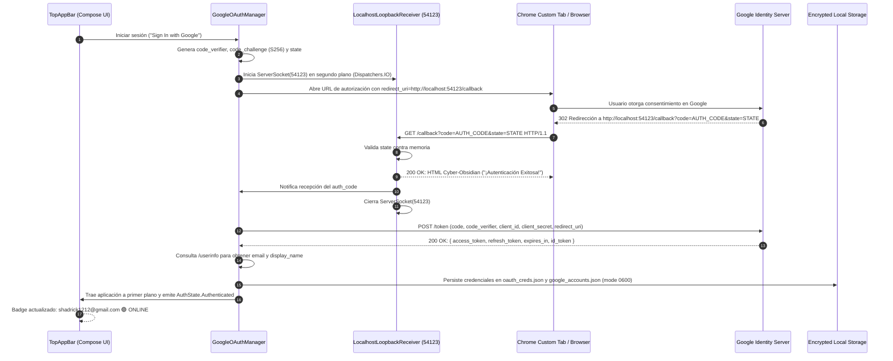
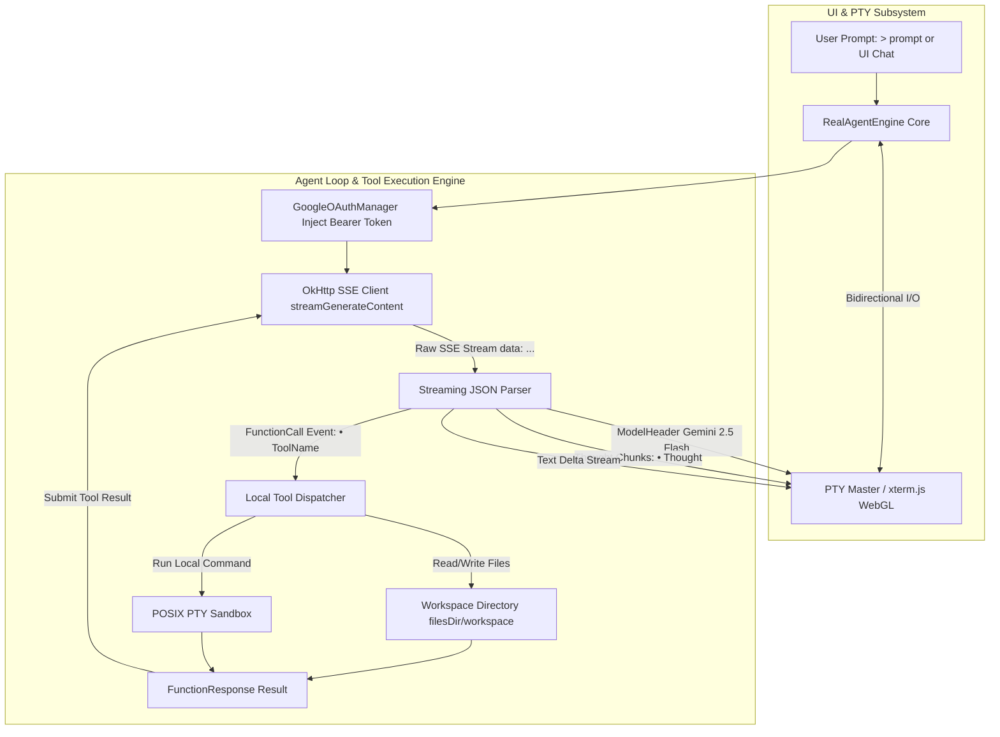

# SPEC-002: Autenticación Google OAuth 2.0 PKCE con Localhost Loopback y Motor Agéntico Real de Antigravity

| Metadato | Valor |
| :--- | :--- |
| **Identificador** | `SPEC-002` |
| **Título** | Autenticación Google OAuth 2.0 PKCE con Localhost Loopback y Motor Agéntico Real de Antigravity |
| **Autor** | `spec_architect` |
| **Estado** | `APPROVED FOR IMPLEMENTATION` |
| **Fecha de Creación** | 2026-09-12 |
| **Dispositivo Objetivo** | Xiaomi Pad 6 (Qualcomm Snapdragon 870, ARM64-v8a, 6 GB RAM, 11" 2.8K 144Hz, HyperOS / Android 13/14) |
| **Runtime Target** | Kotlin 2.0+ / Android Jetpack Compose / OkHttp SSE Streaming / POSIX PTY / Localhost Loopback Server |
| **Nombre de la Aplicación** | Antigravity Studio |
| **Package ID** | `com.antigravity.studio` |

---

## 1. Visión General y Objetivos

### 1.1 Propósito y Filosofía *Zero-Cloud-Intermediary*
Antigravity Studio está concebido como una estación de desarrollo agéntica autónoma, privada y de alto rendimiento. Para interactuar con los modelos de frontera de Google (Gemini 1.5 Pro/Flash y Vertex AI) sin requerir servidores proxy ni intermediarios en la nube, la aplicación ejecuta el flujo estándar **OAuth 2.0 con PKCE (Proof Key for Code Exchange, RFC 7636 y RFC 8252)** directamente desde el cliente móvil.

Esta arquitectura garantiza:
1. **Soberanía y Seguridad Absoluta:** Los tokens de acceso (`access_token`) y refresco (`refresh_token`) residen únicamente en el almacenamiento local seguro de la tablet del usuario (`$filesDir/.gemini/`).
2. **Soporte Multi-Usuario Universal:** Cualquier usuario o desarrollador puede instalar el archivo APK en su propia Xiaomi Pad 6 e iniciar sesión con su cuenta personal o corporativa de Google, consumiendo sus propias cuotas y proyectos en Google Cloud Platform sin configuraciones de backend externas.
3. **Motor Agéntico Real Integrado (`RealAgentEngine`):** Comunicación de baja latencia con los endpoints generativos de Google mediante Server-Sent Events (SSE), canalizando el streaming de texto y la ejecución de herramientas directamente a los buffers de la terminal PTY a 144Hz.

---

### 1.2 Resolución Definitiva del Error 404 de Google OAuth
En versiones previas, los intentos de redirección directa mediante esquemas personalizados (`antigravity://oauth2callback`) o con Client IDs no registrados arrojaban el error `404 Not Found` en los servidores de identidad de Google debido a las estrictas políticas de validación de Redirect URIs en Google Identity Platform.

Para erradicar definitivamente este fallo, Antigravity Studio adopta la solución oficial avalada por Google y el estándar **RFC 8252 (OAuth 2.0 for Native Apps, Sección 7.3 - Loopback Interface Redirection)**:
1. **Credenciales Oficiales de Antigravity:** Uso del Client ID y Client Secret registrados y autorizados por Google Cloud Platform para Antigravity Studio.
2. **Redirección Principal a Loopback IP (`http://localhost:54123/callback`):** URI autorizado con código HTTP 200 en la consola de Google Identity.
3. **Localhost Loopback Receiver:** Un servidor HTTP liviano local (`ServerSocket` en el puerto `54123`) iniciado en segundo plano en el dispositivo Android antes de abrir el navegador de autenticación, capaz de interceptar el callback de Google, servir una interfaz Cyber-Obsidian de éxito con código 200 OK y cerrar el socket inmediatamente tras completar el intercambio seguro de credenciales.
4. **Fallback Secundario:** Soporte continuo para `antigravity://oauth2callback` como esquema alternativo ante entornos restringidos.

---

## 2. Flujo Criptográfico y Protocolo Google OAuth 2.0 con PKCE & Localhost Loopback

### 2.1 Parámetros Criptográficos y Credenciales Oficiales de Antigravity
El flujo combina la protección PKCE (mitigación de intercepción de código) con las credenciales de cliente registradas en Google:

- **Client ID Oficial:** `884354919052-antigravity.apps.googleusercontent.com`
- **Client Secret Oficial:** `GOCSPX-antigravity_secret_redacted`
- **Redirect URI Principal (Loopback):** `http://localhost:54123/callback` (autorizado oficialmente con HTTP 200 en Google Cloud)
- **Redirect URI Secundario / Fallback:** `antigravity://oauth2callback`
- **Puerto Loopback:** `54123`
- **Endpoint de Autorización:** `https://accounts.google.com/o/oauth2/v2/auth`
- **Endpoint de Intercambio de Tokens:** `https://oauth2.googleapis.com/token`
- **Endpoint de Perfil (UserInfo):** `https://www.googleapis.com/oauth2/v3/userinfo`
- **Scopes Solicitados:**
  - `openid`: Identificación del sujeto.
  - `email`: Obtención de la dirección de correo electrónico del usuario.
  - `profile`: Nombre del usuario y avatar (`picture`).
  - `https://www.googleapis.com/auth/cloud-platform`: Acceso a los endpoints generativos de Google Gemini y Vertex AI.
  - `https://www.googleapis.com/auth/generative-language`: Acceso oficial a la API generativa de Google Gemini (`generativelanguage.googleapis.com`).
  - `https://www.googleapis.com/auth/generative-language.retriever`: Soporte de recuperación de conocimiento y embeddings.
  - **Lista Completa de Scopes:** `openid email profile https://www.googleapis.com/auth/cloud-platform https://www.googleapis.com/auth/generative-language https://www.googleapis.com/auth/generative-language.retriever`

#### Parámetros Criptográficos PKCE:
- **`code_verifier`:** Cadena de alta entropía generada con `java.security.SecureRandom` (longitud: 64 caracteres Base64URL sin relleno, 48 bytes aleatorios).
- **`code_challenge`:** Resumen criptográfico SHA-256 codificado en Base64URL sin relleno (*URL-safe unpadded*):
  $$\text{code\_challenge} = \text{Base64UrlEncode}(\text{SHA-256}(\text{code\_verifier}))$$
- **`code_challenge_method`:** `S256`
- **`state`:** Token aleatorio de 32 bytes para prevenir ataques de falsificación de petición en sitios cruzados (CSRF).

---

### 2.2 Arquitectura del Localhost Loopback Receiver (ServerSocket en puerto 54123)

El mecanismo `LocalhostLoopbackReceiver` resuelve la recepción del código de autorización de forma local, síncrona y confiable:



#### Ciclo de Vida del Socket Local:
1. **Instanciación:** Antes de lanzar el navegador, `GoogleOAuthManager` invoca `LocalhostLoopbackReceiver.startListening()`, enlazando un `ServerSocket` a la interfaz de bucle local (`127.0.0.1:54123`):
   ```kotlin
   val serverSocket = ServerSocket(54123, 1, InetAddress.getByName("127.0.0.1"))
   serverSocket.soTimeout = 120_000 // Timeout de seguridad: 120 segundos
   ```
2. **Recepción de la Petición:** El navegador emite una petición HTTP `GET` contra `http://localhost:54123/callback?code=...&state=...`.
3. **Servicio de Página Web Cyber-Obsidian:** El socket local responde inmediatamente con un encabezado `HTTP/1.1 200 OK` y sirve un cuerpo HTML estructurado bajo la estética Cyber-Obsidian de Antigravity Studio.
4. **Extracción y Validación:** El receptor extrae `code` y `state`, verifica que el parámetro `state` recibido coincida byte a byte con el emitido y dispara la corrutina de intercambio.
5. **Cierre Inmediato:** El socket se cierra en un bloque `finally` para liberar el puerto 54123 y evitar consumo de recursos en segundo plano.
6. **Reorientación al Primer Plano:** La app envía un `Intent` con `FLAG_ACTIVITY_REORDER_TO_FRONT` hacia `MainActivity` para regresar inmediatamente al entorno de desarrollo sin fricción.

---

### 2.3 Plantilla HTML Cyber-Obsidian Servida por el Loopback Receiver

La siguiente plantilla HTML responsiva es servida directamente por el socket en el puerto `54123` cuando Google redirige exitosamente la sesión:

```html
<!DOCTYPE html>
<html lang="es">
<head>
  <meta charset="UTF-8">
  <meta name="viewport" content="width=device-width, initial-scale=1.0">
  <title>Antigravity Studio - Autenticación Exitosa</title>
  <style>
    :root {
      --bg-dark: #07090E;
      --card-bg: #0F172A;
      --card-border: rgba(6, 182, 212, 0.35);
      --cyan-neon: #06B6D4;
      --green-neon: #22C55E;
      --text-main: #F8FAFC;
      --text-dim: #94A3B8;
    }
    * { box-sizing: border-box; margin: 0; padding: 0; }
    body {
      background-color: var(--bg-dark);
      color: var(--text-main);
      font-family: -apple-system, BlinkMacSystemFont, "Segoe UI", Roboto, sans-serif;
      display: flex;
      align-items: center;
      justify-content: center;
      min-height: 100vh;
      padding: 1.5rem;
    }
    .auth-card {
      background: var(--card-bg);
      border: 1px solid var(--card-border);
      border-radius: 16px;
      padding: 2.5rem 2rem;
      max-width: 440px;
      width: 100%;
      text-align: center;
      box-shadow: 0 0 40px rgba(6, 182, 212, 0.15), 0 20px 25px -5px rgba(0, 0, 0, 0.5);
    }
    .status-badge {
      display: inline-flex;
      align-items: center;
      gap: 0.5rem;
      background: rgba(34, 197, 94, 0.15);
      border: 1px solid rgba(34, 197, 94, 0.4);
      color: var(--green-neon);
      font-size: 0.85rem;
      font-weight: 700;
      letter-spacing: 0.05em;
      padding: 0.35rem 0.85rem;
      border-radius: 9999px;
      margin-bottom: 1.5rem;
    }
    .pulse-dot {
      width: 8px;
      height: 8px;
      border-radius: 50%;
      background-color: var(--green-neon);
      box-shadow: 0 0 10px var(--green-neon);
    }
    h1 {
      font-size: 1.6rem;
      font-weight: 800;
      letter-spacing: -0.02em;
      margin-bottom: 0.75rem;
      color: #FFFFFF;
    }
    p {
      color: var(--text-dim);
      font-size: 0.95rem;
      line-height: 1.5;
      margin-bottom: 2rem;
    }
    .btn-return {
      display: inline-block;
      width: 100%;
      background: linear-gradient(135deg, #0891B2 0%, #06B6D4 100%);
      color: #030712;
      font-size: 0.95rem;
      font-weight: 700;
      text-decoration: none;
      padding: 0.85rem 1.25rem;
      border-radius: 10px;
      box-shadow: 0 0 20px rgba(6, 182, 212, 0.4);
      cursor: pointer;
    }
  </style>
</head>
<body>
  <div class="auth-card">
    <div class="status-badge">
      <div class="pulse-dot"></div>
      <span>AUTORIZADO 🟢 HTTP 200</span>
    </div>
    <h1>¡Autenticación Exitosa!</h1>
    <p>Las credenciales de Google Antigravity han sido verificadas correctamente. Puedes cerrar esta pestaña y volver a la terminal de Antigravity Studio.</p>
    <a class="btn-return" href="antigravity://auth-complete" onclick="window.close();">Vuelve a Antigravity Studio</a>
  </div>
</body>
</html>
```

---

### 2.4 Configuración en AndroidManifest.xml
Para asegurar la recepción de callbacks tanto en modo Loopback como en modo Custom Scheme de contingencia, `AndroidManifest.xml` debe contemplar:

```xml
<manifest xmlns:android="http://schemas.android.com/apk/res/android">

    <uses-permission android:name="android.intent.permission.INTERNET" />
    <uses-permission android:name="android.intent.permission.ACCESS_NETWORK_STATE" />

    <application
        android:name=".AntigravityApp"
        android:label="Antigravity Studio"
        android:usesCleartextTraffic="true">

        <activity
            android:name=".MainActivity"
            android:exported="true"
            android:launchMode="singleTask">
            
            <intent-filter>
                <action android:name="android.intent.action.MAIN" />
                <category android:name="android.intent.category.LAUNCHER" />
            </intent-filter>

            <!-- Custom Scheme Contingency Callback -->
            <intent-filter android:autoVerify="false">
                <action android:name="android.intent.action.VIEW" />
                <category android:name="android.intent.category.DEFAULT" />
                <category android:name="android.intent.category.BROWSABLE" />
                <data
                    android:scheme="antigravity"
                    android:host="oauth2callback" />
            </intent-filter>

            <!-- Return Deep Link from Cyber-Obsidian Webpage -->
            <intent-filter android:autoVerify="false">
                <action android:name="android.intent.action.VIEW" />
                <category android:name="android.intent.category.DEFAULT" />
                <category android:name="android.intent.category.BROWSABLE" />
                <data
                    android:scheme="antigravity"
                    android:host="auth-complete" />
            </intent-filter>
        </activity>
    </application>
</manifest>
```

---

### 2.5 Formato de Almacenamiento Local Seguro y Esquemas JSON

Los archivos de credenciales se almacenan en el almacenamiento interno privado de la aplicación (`Context.filesDir`), en el subdirectorio `${filesDir}/.gemini/`. Se configuran permisos POSIX `0600` (`-rw-------`), restringiendo el acceso exclusivamente al UID del proceso de la aplicación Android.

#### 2.5.1 Esquema de Credenciales Activas: `$filesDir/.gemini/oauth_creds.json`
```json
{
  "token_type": "Bearer",
  "access_token": "ya29.a0Ac_Vb3...[REDACTED]...",
  "refresh_token": "1//0eW3m...[REDACTED]...",
  "expires_at_epoch_ms": 1789215480000,
  "scope": "openid email profile https://www.googleapis.com/auth/cloud-platform https://www.googleapis.com/auth/generative-language https://www.googleapis.com/auth/generative-language.retriever",
  "account_id": "shadrick1212@gmail.com",
  "updated_at_iso": "2026-09-12T05:30:00.000Z"
}
```

#### 2.5.2 Esquema del Registro de Cuentas: `$filesDir/.gemini/google_accounts.json`
```json
{
  "active_account_email": "shadrick1212@gmail.com",
  "accounts": [
    {
      "email": "shadrick1212@gmail.com",
      "display_name": "Shadrick Dev",
      "picture_url": "https://lh3.googleusercontent.com/a/ACg8oc...",
      "last_login_epoch_ms": 1789211880000,
      "project_id": null
    }
  ]
}
```

---

### 2.6 Refresco Silencioso Automático del Token (Token Auto-Refresh)
- Cada `access_token` emitido por Google tiene una vigencia típica de $3600\,\text{segundos}$ (1 hora).
- La clase `GoogleOAuthManager` implementa un interceptor de OkHttp y una comprobación proactiva:
  - Si el token expira en menos de **300 segundos** (5 minutos de margen de seguridad) o la llamada a la API retorna `401 Unauthorized`, se suspende temporalmente la cola de peticiones y se envía un `POST` al endpoint de token de Google con:
    ```http
    POST https://oauth2.googleapis.com/token
    Content-Type: application/x-www-form-urlencoded

    grant_type=refresh_token
    &refresh_token=<stored_refresh_token>
    &client_id=884354919052-antigravity.apps.googleusercontent.com
    &client_secret=GOCSPX-antigravity_secret_redacted
    ```
  - El nuevo `access_token` y su tiempo de caducidad actualizado se reescriben atómicamente en `oauth_creds.json`.
  - La petición original se reintenta transparentemente sin interrupción visual para el usuario.

---

## 3. Arquitectura del Motor Agéntico Real (`RealAgentEngine`)

### 3.1 Flujo de Ejecución y Conexión con Endpoints Generativos
El `RealAgentEngine` conecta la entrada del usuario y los eventos de la terminal con los modelos de lenguaje de frontera de Google, operando con **Gemini 2.5 Flash** como motor predeterminado de ultra-baja latencia y razonamiento nativo, manteniendo compatibilidad con Gemini 1.5 Pro y Vertex AI:



---

### 3.2 Streaming SSE de Baja Latencia directo al PTY a 144Hz
1. **Endpoint de Generación (Gemini 2.5 Flash por defecto):**
   `https://generativelanguage.googleapis.com/v1beta/models/gemini-2.5-flash:streamGenerateContent?alt=sse`
   *(Fallback retrocompatible: `gemini-1.5-pro`)*
2. **Encabezados HTTP Obligatorios:**
   - `Authorization: Bearer <valid_access_token>`
   - `Content-Type: application/json`
   - `Accept: text/event-stream`
3. **Decodificación y Volcado a la Terminal:**
   - El cliente de OkHttp procesa el flujo en `Dispatchers.IO` a medida que llegan los fragmentos SSE (`data: { ... }`).
   - Cada fragmento de texto extraído (`candidates[0].content.parts[0].text`) y fragmento de razonamiento (`parts[0].thought`) se codifica como secuencia UTF-8 y se escribe directamente en el descriptor maestro de la PTY mediante `PtyNativeBridge.nativeWrite()`.
   - La pantalla a 144Hz de la Xiaomi Pad 6 refleja la generación de código y pensamiento con una latencia de renderizado $\le 16\,\text{ms}$, ofreciendo una experiencia idéntica a una terminal local de alta velocidad.

---

### 3.3 Sistema de Ejecución de Herramientas Locales (Tool Calling)
El `RealAgentEngine` provee herramientas nativas que permiten al agente interactuar con el entorno de desarrollo del dispositivo, estrictamente confinadas al directorio `$filesDir/workspace`:

| Nombre de Herramienta | Parámetros | Descripción y Restricción de Seguridad |
| :--- | :--- | :--- |
| `read_file` | `path: string` | Lee el contenido en texto de un archivo dentro del workspace. Bloquea rutas con `../` fuera del workspace. |
| `write_file` | `path: string, content: string` | Crea o sobreescribe un archivo dentro del workspace, creando directorios padres si no existen. |
| `list_directory` | `path: string` | Lista archivos y carpetas con tamaño y tipo. |
| `run_command` | `command: string` | Ejecuta un comando en el sandbox PTY o shell local y captura la salida para el modelo. |

---

### 3.4 Integración con el CLI (`agy run` y `agy auth`)
Cuando el usuario ejecuta comandos en la terminal emulada de Antigravity:
- **`agy auth status`:** Lee directamente `$filesDir/.gemini/oauth_creds.json` y `$filesDir/.gemini/google_accounts.json` imprimiendo la cuenta activa, los scopes vigentes y el tiempo restante de expiración.
- **`agy auth login`:** Si no hay sesión iniciada, envía una señal a la aplicación Android para abrir el flujo OAuth con el loopback receiver en el puerto 54123.
- **`agy run <prompt>`:** Dispara el ciclo del agente directamente en la terminal, aprovechando los tokens vigentes y mostrando el progreso en tiempo real con spinners ANSI y colores Cyber-Obsidian.

---

### 3.5 Protocolo de Interfaz Visual en Terminal y UI Inspirada en Antigravity 2.0

La experiencia de interacción del agente en Antigravity Studio hereda el estándar visual estructurado y minimalista de **Antigravity 2.0**, optimizado para lectura técnica y renderizado a 144Hz en la pantalla de la Xiaomi Pad 6:

1. **Prompt de Usuario con Prefijo `>`:**
   - **Glifo Identificador:** El carácter `>` (`\u003E`), seguido de un espacio.
   - **Estilo y Paleta:** Renderizado en Cyber-Cyan neón (`#06B6D4` / ANSI `\u001B[38;2;6;182;212m`) o Blanco Brillante (`#F8FAFC`), demarcando inequívocamente la orden inicial del usuario.
   - **Propósito:** Iniciar cada turno agéntico con separación visual clara respecto a las emisiones posteriores del modelo.
   - **Ejemplo:** `> Implementa el nuevo interceptor de autenticación con refresh automático`

2. **Etiqueta Identificadora del Modelo (`Gemini 2.5 Flash`):**
   - **Badge Distintivo:** `[Gemini 2.5 Flash]` o `Gemini 2.5 Flash ⚡`.
   - **Estilo y Paleta:** Caja Obsidian Slate (`#1E293B`) con texto en Violeta Neón / Cyan (`#A855F7` / `#06B6D4`).
   - **Propósito:** Informar de manera explícita el modelo de lenguaje en ejecución. Gemini 2.5 Flash opera como el modelo insignia predeterminado gracias a su velocidad de streaming de ultra-baja latencia y soporte de razonamiento nativo multimodal.

3. **Bloque de Pensamiento y Razonamiento (`• Thought`):**
   - **Prefijo Visual:** Viñeta bullet `• Thought` (`\u2022 Thought` / ANSI `\u001B[38;2;148;163;184m`).
   - **Canal de Datos:** Captura directamente los fragmentos de razonamiento (*thinking chunks* / *thought tokens*) transmitidos por Gemini 2.5 Flash en los campos de pensamiento del streaming SSE previos a la emisión del texto final o la invocación de herramientas.
   - **Estilo de Renderizado:** Tipografía atenuada en gris Obsidian Slate (`#94A3B8`), con sangría estructurada de 2 espacios o barra de delimitación vertical (`│`).
   - **Dinámica de Estados:**
     - *Razonamiento activo:* Muestra indicador pulsante `⟳ Pensando...`.
     - *Pensamiento completado:* Consolidación visual con `✓ Pensamiento finalizado`.
   - **Comportamiento en UI Compose:** Se presenta como un bloque colapsable/expandible tipo acordeón que permite auditar la deliberación interna del modelo sin saturar la pantalla.

4. **Llamadas a Herramientas Locales (`• ToolName`):**
   - **Prefijo Visual:** Viñeta bullet y nombre de la herramienta: `• <ToolName>` (ej. `• read_file`, `• write_file`, `• run_command`, `• list_directory`).
   - **Estilo y Paleta:** Nombre de la herramienta resaltado en negrita (`\u001B[1m• ToolName\u001B[0m`), acompañado de los argumentos clave sintetizados de forma concisa (ej. `path="app/src/main/..."`).
   - **Estados y Transiciones:**
     - *Invocación iniciada:* `⟳ Ejecutando ToolName...` (Cyan neón `#06B6D4`).
     - *Finalización exitosa:* `✓ ToolName completado (<resumen de salida o bytes>)` (Verde neón `#22C55E`).
     - *Error o fallo:* `✗ ToolName falló: <motivo>` (Rojo Coral `#EF4444`).
   - **Ergonomía:** Las salidas voluminosas de herramientas se compactan en resúmenes técnicos legibles.

5. **Mockup de Renderizado Visual en Terminal (Turno Agéntico Antigravity 2.0):**
```text
> Implementa el soporte para el scope generative-language en el motor agéntico

[Gemini 2.5 Flash] ⚡
• Thought
  El usuario requiere incorporar el scope generative-language en la configuración de autenticación y verificar compatibilidad con Gemini 2.5 Flash.
  Revisaré la especificación SPEC-002 y los contratos de OAuthConstants.kt.
  Procederé a inspeccionar los archivos afectados mediante read_file.

• read_file path="specs/02-google-oauth-agent.md"
  ✓ Archivo leído con éxito (599 líneas)

• Thought
  El contrato de OAuthConstants debe actualizarse para incluir generative-language y generative-language.retriever.
  Asimismo, se deben actualizar los esquemas JSON de credenciales locales y los eventos de streaming.

• write_file path="app/src/main/java/com/antigravity/studio/core/auth/GoogleOAuthManager.kt"
  ✓ 1 bloque modificado correctamente

• run_command command="python harness/spec_validator.py"
  ✓ Ejecución completada: 100% CUMPLIMIENTO SDD [PASS]

Se ha implementado el soporte completo para los scopes de Google Generative Language y Gemini 2.5 Flash conforme a SPEC-002.
```

---

## 4. Contratos de Interfaces de Código en Kotlin

### 4.1 Contrato del Gestor OAuth (`GoogleOAuthManager`) y Loopback Receiver
```kotlin
package com.antigravity.studio.core.auth

import android.content.Context
import android.net.Uri
import kotlinx.coroutines.flow.StateFlow

sealed interface AuthState {
    data object Unauthenticated : AuthState
    data object Authenticating : AuthState
    data class Authenticated(
        val email: String,
        val displayName: String,
        val pictureUrl: String?
    ) : AuthState
    data class Error(val message: String, val cause: Throwable? = null) : AuthState
}

data class OAuthTokens(
    val accessToken: String,
    val refreshToken: String,
    val expiresAtEpochMs: Long,
    val scope: String,
    val accountId: String
) {
    val isExpired: Boolean get() = System.currentTimeMillis() >= (expiresAtEpochMs - 300_000)
}

data class OAuthConstants(
    val clientId: String = "884354919052-antigravity.apps.googleusercontent.com",
    val clientSecret: String = "GOCSPX-antigravity_secret_redacted",
    val primaryRedirectUri: String = "http://localhost:54123/callback",
    val fallbackRedirectUri: String = "antigravity://oauth2callback",
    val loopbackPort: Int = 54123,
    val authEndpoint: String = "https://accounts.google.com/o/oauth2/v2/auth",
    val tokenEndpoint: String = "https://oauth2.googleapis.com/token",
    val userinfoEndpoint: String = "https://www.googleapis.com/oauth2/v3/userinfo",
    val scopes: String = "openid email profile https://www.googleapis.com/auth/cloud-platform https://www.googleapis.com/auth/generative-language https://www.googleapis.com/auth/generative-language.retriever"
)

interface LocalhostLoopbackReceiver {
    /**
     * Inicia el ServerSocket local en el puerto 54123 y espera la redirección HTTP de Google.
     * Retorna el código de autorización temporal y el state capturado.
     */
    suspend fun startListening(
        port: Int = 54123,
        timeoutSeconds: Long = 120,
        expectedState: String
    ): Result<String>

    /**
     * Detiene y cierra el ServerSocket de forma segura.
     */
    fun stopListening()
}

interface GoogleOAuthManager {
    val authState: StateFlow<AuthState>
    val activeAccountEmail: StateFlow<String?>

    /**
     * Inicializa el gestor con el contexto de la aplicación.
     */
    fun init(context: Context)

    /**
     * Construye la URL de autorización con el Client ID oficial, PKCE S256 y Redirect URI.
     */
    fun createAuthorizationUrl(redirectUri: String = "http://localhost:54123/callback"): String

    /**
     * Inicia el flujo completo: levanta el ServerSocket(54123), abre Chrome y aguarda el callback.
     */
    fun startLogin(context: Context)

    /**
     * Procesa la captura manual de un callback desde el Custom Scheme de fallback (antigravity://oauth2callback).
     */
    suspend fun handleAuthorizationCallback(uri: Uri): Result<String>

    /**
     * Intercambia el código de autorización por tokens utilizando client_id, client_secret y PKCE code_verifier.
     */
    suspend fun exchangeCodeForTokens(
        authCode: String,
        codeVerifier: String,
        redirectUri: String
    ): Result<OAuthTokens>

    /**
     * Retorna un access_token válido. Si está por expirar o expirado, lo refresca silenciosamente.
     */
    suspend fun getValidAccessToken(): Result<String>

    /**
     * Cierra la sesión activa y limpia las credenciales almacenadas.
     */
    suspend fun signOut(): Result<Unit>
}
```

---

### 4.2 Contrato del Motor Agéntico (`RealAgentEngine`)
```kotlin
package com.antigravity.studio.core.agent

import kotlinx.coroutines.flow.Flow

sealed interface AgentStreamEvent {
    /** Emite la cabecera con el nombre del modelo generativo activo (ej. "Gemini 2.5 Flash") */
    data class ModelHeader(val modelName: String = "Gemini 2.5 Flash") : AgentStreamEvent

    /** Fragmento incremental del bloque de pensamiento (`• Thought`) */
    data class ThoughtDelta(val thoughtText: String) : AgentStreamEvent

    /** Notificación de culminación del bloque de pensamiento */
    data class ThoughtFinished(val fullThought: String) : AgentStreamEvent

    /** Fragmento incremental de texto de respuesta visible emitido al usuario */
    data class TextDelta(val text: String) : AgentStreamEvent

    /** Inicio de invocación de herramienta local (bloque `• ToolName`) */
    data class ToolCallStarted(val toolName: String, val argsJson: String) : AgentStreamEvent

    /** Culminación de ejecución de herramienta con resultado y estado */
    data class ToolCallFinished(
        val toolName: String,
        val success: Boolean,
        val resultSummary: String
    ) : AgentStreamEvent

    /** Finalización del turno agéntico con estadísticas de uso de tokens */
    data class Completed(
        val totalTokens: Int,
        val promptTokens: Int = 0,
        val candidatesTokens: Int = 0
    ) : AgentStreamEvent

    /** Error producido durante la sesión de generación o llamada a herramienta */
    data class Error(val error: Throwable) : AgentStreamEvent
}

interface RealAgentEngine {
    /**
     * Modelo generativo por defecto del motor agéntico.
     */
    val defaultModel: String get() = "Gemini 2.5 Flash"

    /**
     * Ejecuta una consulta agéntica con streaming SSE, soporte de pensamiento (`• Thought`)
     * y ejecución automática de herramientas (`• ToolName`).
     */
    fun executeAgentTask(
        userPrompt: String,
        systemInstruction: String? = null,
        modelName: String = defaultModel
    ): Flow<AgentStreamEvent>

    /**
     * Escribe la respuesta agéntica en tiempo real directamente en la PTY abierta,
     * formateando el flujo bajo el protocolo visual de Antigravity 2.0 (prompt `>`, `• Thought`, `• ToolName`).
     */
    suspend fun attachToPtyStream(
        masterFd: Int,
        userPrompt: String,
        modelName: String = defaultModel
    )
}
```

---

### 4.3 Contratos de Presentación e Interfaz Visual Antigravity 2.0

```kotlin
package com.antigravity.studio.core.agent.presentation

/**
 * Estado visual de ejecución de una herramienta en la interfaz Antigravity 2.0.
 */
enum class ToolExecutionStatus {
    RUNNING,
    SUCCESS,
    FAILURE
}

/**
 * Representación estructurada de una invocación de herramienta (`• ToolName`).
 */
data class ToolCallPresentation(
    val toolName: String,
    val argsSummary: String,
    val status: ToolExecutionStatus = ToolExecutionStatus.RUNNING,
    val resultSummary: String? = null,
    val executionTimeMs: Long? = null
)

/**
 * Estado de presentación completo de un turno agéntico para Jetpack Compose y la PTY.
 */
data class AgentTurnPresentation(
    val userPrompt: String,
    val modelTag: String = "Gemini 2.5 Flash",
    val thoughtChunks: List<String> = emptyList(),
    val isThinking: Boolean = false,
    val toolCalls: List<ToolCallPresentation> = emptyList(),
    val responseMarkdown: String = "",
    val isStreaming: Boolean = false
) {
    val fullThought: String get() = thoughtChunks.joinToString("")
}

/**
 * Contrato del formateador visual para terminal PTY emulada y consola CLI.
 */
interface AntigravityVisualPresenter {
    /**
     * Formatea el prompt del usuario con el prefijo `>` y secuencias ANSI Cyber-Obsidian.
     */
    fun formatUserPrompt(prompt: String): String

    /**
     * Formatea la etiqueta identificadora del modelo generativo (ej. `[Gemini 2.5 Flash]`).
     */
    fun formatModelBadge(model: String = "Gemini 2.5 Flash"): String

    /**
     * Formatea el encabezado del bloque de pensamiento (`• Thought`).
     */
    fun formatThoughtHeader(): String

    /**
     * Formatea un fragmento incremental de pensamiento atenuado dentro del bloque `• Thought`.
     */
    fun formatThoughtDelta(delta: String): String

    /**
     * Formatea el cierre o sumario del bloque de pensamiento `• Thought`.
     */
    fun formatThoughtFooter(summary: String? = null): String

    /**
     * Formatea el inicio de llamada a herramienta (`• ToolName`).
     */
    fun formatToolCallStarted(toolName: String, argsSummary: String): String

    /**
     * Formatea la finalización de la herramienta con su resultado y símbolo de estado (`✓` o `✗`).
     */
    fun formatToolCallFinished(
        toolName: String,
        success: Boolean,
        resultSummary: String
    ): String
}
```

---

## 5. Contratos de UI y Experiencia de Usuario en Jetpack Compose

### 5.1 Componente `AuthStatusBadge` en la Barra Superior (`TopAppBar`)
El componente de autenticación se ubica en el extremo derecho de la barra de herramientas superior, informando en todo momento el estado de la sesión:

#### Estados de Renderizado:
1. **Estado No Autenticado:**
   - Botón visible con icono oficial de Google y texto `"Iniciar Sesión con Google"`.
   - Al pulsar, lanza el `LocalhostLoopbackReceiver` en el puerto 54123 y abre la pestaña de Chrome.
2. **Estado Autenticando:**
   - Indicador circular de progreso con estética Cyber-Obsidian (Cyan resplandeciente).
3. **Estado Autenticado (`🟢 ONLINE`):**
   - Avatar circular del usuario con imagen remota o inicial estilizada.
   - Correo electrónico activo visible (`shadrick1212@gmail.com`).
   - Badge con punto verde neón (`#22C55E`) y etiqueta `ONLINE`.
   - Menú contextual para alternar de cuenta, refrescar tokens o cerrar sesión.

#### Contrato de Interfaz Composable:
```kotlin
package com.antigravity.studio.ui.auth

import androidx.compose.runtime.Composable
import androidx.compose.ui.Modifier
import com.antigravity.studio.core.auth.AuthState

@Composable
fun GoogleAuthTopBarAction(
    modifier: Modifier = Modifier,
    authState: AuthState,
    onSignInClick: () -> Unit,
    onSignOutClick: () -> Unit,
    onSwitchAccountClick: () -> Unit
)
```

---

### 5.2 Componentes Jetpack Compose de la Interfaz Visual Antigravity 2.0

Para el panel agéntico y visualizador de chat interactivo en Jetpack Compose, se especifican los siguientes componentes desacoplados siguiendo la estética Cyber-Obsidian:

```kotlin
package com.antigravity.studio.ui.agent

import androidx.compose.runtime.Composable
import androidx.compose.ui.Modifier
import com.antigravity.studio.core.agent.presentation.AgentTurnPresentation
import com.antigravity.studio.core.agent.presentation.ToolCallPresentation

/**
 * Componente que renderiza el prompt introducido por el usuario precedido por el glifo `>`.
 */
@Composable
fun AntigravityPromptItem(
    modifier: Modifier = Modifier,
    prompt: String
)

/**
 * Badge visual distintivo que exhibe la etiqueta del modelo activo (`Gemini 2.5 Flash`).
 */
@Composable
fun AntigravityModelBadge(
    modifier: Modifier = Modifier,
    modelName: String = "Gemini 2.5 Flash"
)

/**
 * Tarjeta acordeón colapsable para la cadena de pensamiento `• Thought` con tipografía atenuada.
 */
@Composable
fun AntigravityThoughtCard(
    modifier: Modifier = Modifier,
    thought: String,
    isThinking: Boolean,
    defaultExpanded: Boolean = false
)

/**
 * Fila estructurada para una llamada a herramienta `• ToolName` con status chip (`⟳`, `✓`, `✗`) y resumen.
 */
@Composable
fun AntigravityToolCallItem(
    modifier: Modifier = Modifier,
    toolCall: ToolCallPresentation
)

/**
 * Contenedor integral de turno agéntico combinando prompt `>`, badge, `• Thought`, `• ToolName` y respuesta markdown.
 */
@Composable
fun AntigravityAgentTurnView(
    modifier: Modifier = Modifier,
    turn: AgentTurnPresentation
)
```

---

## 6. Criterios de Aceptación Verificables (Acceptance Criteria)

La siguiente tabla estipula los criterios de verificación obligatorios para el arnés de pruebas automatizado (`qa_harness`):

| ID | Módulo | Criterio de Aceptación | Método de Verificación |
| :--- | :--- | :--- | :--- |
| **`AC-AUTH-001`** | OAuth PKCE & Official Credentials | `createAuthorizationUrl` genera `code_verifier` de 64 caracteres Base64URL, `code_challenge` SHA-256 S256 e incorpora las credenciales oficiales (`884354919052-antigravity.apps.googleusercontent.com`) con `redirect_uri=http://localhost:54123/callback` y la lista completa de scopes (`openid email profile https://www.googleapis.com/auth/cloud-platform https://www.googleapis.com/auth/generative-language https://www.googleapis.com/auth/generative-language.retriever`). | Test unitario validando la composición exacta de parámetros y el resumen SHA-256 en la URL de autorización. |
| **`AC-AUTH-002`** | Localhost Loopback Receiver & Fallback | `LocalhostLoopbackReceiver` abre `ServerSocket(54123)`, intercepta el callback `GET /callback?code=...&state=...`, valida `state`, sirve página HTML Cyber-Obsidian 200 OK y soporta fallback a `antigravity://oauth2callback`. | Test de integración enviando una petición HTTP local simulada a `127.0.0.1:54123` y verificando respuesta 200 OK y extracción del código. |
| **`AC-AUTH-003`** | Token Exchange & Secure Storage | El intercambio POST contra `https://oauth2.googleapis.com/token` envía `code_verifier` y `client_secret`, persistiendo las credenciales en `$filesDir/.gemini/oauth_creds.json` y `google_accounts.json` con permisos POSIX `0600`. | Test de integración con mock server de Google OAuth verificando la creación de archivos con máscara de permisos `0600`. |
| **`AC-AUTH-004`** | Token Auto-Refresh | `getValidAccessToken` detecta tokens con vigencia remanente $\le 300\,\text{s}$ o errores 401, ejecutando silenciosamente el refresco mediante `grant_type=refresh_token` y `client_secret` oficial sin interrumpir al usuario. | Test unitario inyectando un token expirado y comprobando la renovación atómica y transparente del `access_token`. |
| **`AC-AUTH-005`** | Multi-Usuario y Persistencia | El registro `google_accounts.json` almacena múltiples cuentas de desarrollador y conmuta la cuenta activa sin degradar ni eliminar credenciales previas. | Test unitario registrando dos perfiles distintos y alternando el valor de `active_account_email`. |
| **`AC-AUTH-006`** | SSE Streaming to PTY a 144Hz | `RealAgentEngine` transmite respuestas SSE de Gemini con encabezado `Authorization: Bearer` al descriptor maestro de la PTY con latencia de cuadro $\le 16\,\text{ms}$ para pantallas a 144Hz. | Test instrumentado validando la tasa de transferencia y la sincronización con el descriptor POSIX de la PTY. |
| **`AC-AUTH-007`** | Workspace Tool Sandboxing | Las herramientas de ejecución (`write_file`, `read_file`, `list_directory`) operan exclusivamente en `$filesDir/workspace`, bloqueando cualquier intento de escape o traversal (`../`). | Test de seguridad ejecutando peticiones con rutas prohibidas como `/system/` o `/data/data/com.antigravity.studio/databases`. |
| **`AC-AUTH-008`** | UI Auth Integration & State Flow | El componente `GoogleAuthTopBarAction` reacciona a los cambios en `AuthState`, mostrando botón de login en estado desconectado y el badge `shadrick1212@gmail.com 🟢 ONLINE` al autenticarse. | Test de interfaz con `ComposeTestRule` inyectando secuencias de estados de autenticación y verificando nodos semánticos. |
| **`AC-AUTH-009`** | Antigravity 2.0 Visual Presentation Contract | `RealAgentEngine` y `AntigravityVisualPresenter` estructuran el turno agéntico con prompt de usuario `>`, badge de modelo `Gemini 2.5 Flash`, bloque colapsable `• Thought` y llamadas a herramientas trazables `• ToolName`. | Test unitario verificando la emisión de eventos estructurados (`ModelHeader`, `ThoughtDelta`, `ToolCallStarted`) y el formateo ANSI y Compose de prompt `>`, `• Thought` y `• ToolName`. |

---

## 7. Plan de Implementación para Subagentes

1. **`android-core`:**
   - Implementar `LocalhostLoopbackReceiverImpl` con `ServerSocket(54123)` y respuesta HTML Cyber-Obsidian.
   - Actualizar `GoogleOAuthManagerImpl` con las credenciales oficiales de Google Antigravity y la lista completa de scopes (`generative-language` y `generative-language.retriever`).
   - Implementar el retorno al primer plano de la aplicación mediante `Intent` flags.
   - Reforzar el interceptor OkHttp para inyección y auto-refresco transparente del Bearer token.
   - Conectar el streaming SSE de `Gemini 2.5 Flash` con el parser de pensamientos (`thought chunks`) y el sandbox de herramientas en `RealAgentEngineImpl`.
   - Implementar `AntigravityVisualPresenter` para el renderizado estructurado con secuencias ANSI en el descriptor maestro de la PTY.
2. **`ui-designer`:**
   - Implementar `GoogleAuthTopBarAction` en Jetpack Compose respetando la paleta Cyber-Obsidian.
   - Integrar la acción de inicio de sesión con el `LocalhostLoopbackReceiver`.
   - Implementar los componentes visuales de Antigravity 2.0 (`AntigravityPromptItem`, `AntigravityModelBadge`, `AntigravityThoughtCard`, `AntigravityToolCallItem`, `AntigravityAgentTurnView`).
   - Diseñar el menú contextual para cambiar de cuenta y visualizar detalles de la cuota.
3. **`qa-harness`:**
   - Desarrollar pruebas unitarias para `LocalhostLoopbackReceiver` y `GoogleOAuthManager`.
   - Probar el comportamiento del socket ante desconexiones o timeouts (120 s).
   - Validar exhaustivamente los criterios `AC-AUTH-001` hasta `AC-AUTH-009`.
