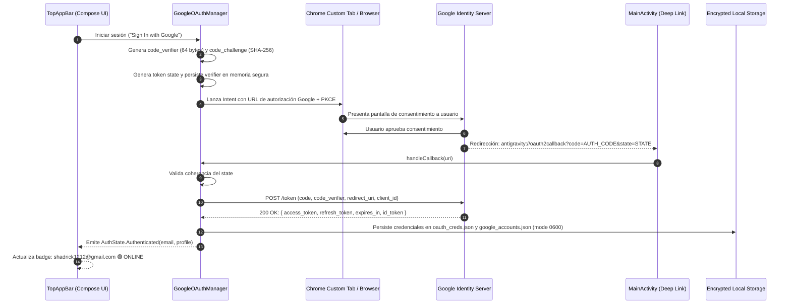
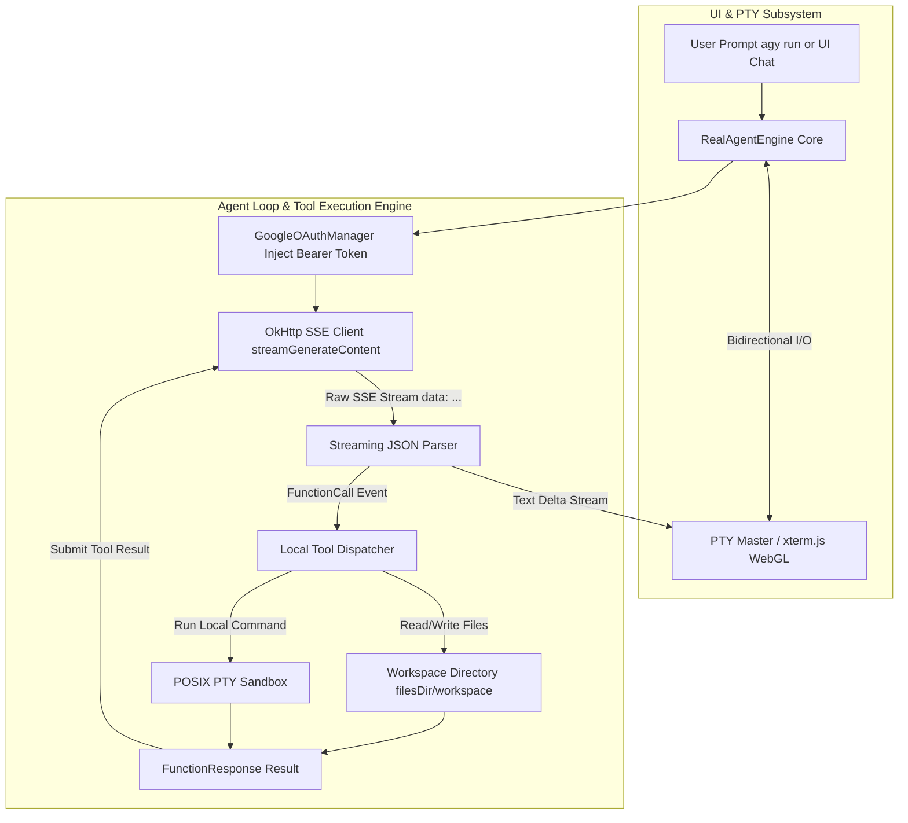

# SPEC-002: Autenticación Google OAuth 2.0 PKCE y Motor Agéntico Real de Antigravity

| Metadato | Valor |
| :--- | :--- |
| **Identificador** | `SPEC-002` |
| **Título** | Autenticación Google OAuth 2.0 PKCE y Motor Agéntico Real de Antigravity |
| **Autor** | `spec_architect` |
| **Estado** | `APPROVED FOR IMPLEMENTATION` |
| **Fecha de Creación** | 2026-09-12 |
| **Dispositivo Objetivo** | Xiaomi Pad 6 (Qualcomm Snapdragon 870, ARM64-v8a, 6 GB RAM, 11" 2.8K 144Hz, HyperOS / Android 13/14) |
| **Runtime Target** | Kotlin 2.0+ / Android Jetpack Compose / OkHttp SSE Streaming / POSIX PTY |
| **Nombre de la Aplicación** | Antigravity Studio |
| **Package ID** | `com.antigravity.studio` |

---

## 1. Visión General y Objetivos

### 1.1 Propósito y Filosofía *Zero-Cloud-Intermediary*
Antigravity Studio está concebido como una estación de desarrollo agéntica autónoma y privada. Para interactuar con los modelos de frontera de Google (Gemini 1.5 Pro/Flash y Vertex AI) sin requerir un servidor proxy o backend intermedio propio, la aplicación implementa el flujo estándar **OAuth 2.0 con PKCE (Proof Key for Code Exchange, RFC 7636)** directamente desde el cliente móvil.

Esta arquitectura garantiza:
1. **Soberanía y Seguridad:** Los tokens de acceso (`access_token`) y de refresco (`refresh_token`) residen exclusivamente en el almacenamiento seguro de la tablet del usuario (`$filesDir/.gemini/`).
2. **Soporte Multi-Usuario:** Cualquier usuario o desarrollador puede instalar el archivo APK en su propia Xiaomi Pad 6 e iniciar sesión con su cuenta personal o de trabajo de Google, utilizando sus propias cuotas y proyectos en Google Cloud Platform sin configuraciones manuales complejas.
3. **Motor Agéntico Real Integrado (`RealAgentEngine`):** Comunicación de baja latencia con los endpoints generativos de Google mediante Server-Sent Events (SSE), canalizando el streaming de texto y herramientas directamente a los buffers de la terminal PTY a 144Hz.

---

## 2. Flujo Criptográfico y Protocolo Google OAuth 2.0 con PKCE

### 2.1 Parámetros Criptográficos y Configuración OAuth
El flujo PKCE elimina la necesidad de almacenar un `client_secret` en el código de la aplicación cliente (inseguro en binarios móviles distribuidos).

- **`code_verifier`:** Cadena pseudoaleatoria de alta entropía criptográfica generada mediante `java.security.SecureRandom`, con longitud de entre 43 y 128 caracteres (alfanumérico y caracteres seguros: `[A-Z]`, `[a-z]`, `[0-9]`, `-`, `.`, `_`, `~`).
- **`code_challenge`:** Resumen SHA-256 del `code_verifier`, codificado en Base64URL sin relleno (*URL-safe, unpadded*):
  $$\text{code\_challenge} = \text{Base64UrlEncode}(\text{SHA-256}(\text{code\_verifier}))$$
- **`state`:** Token aleatorio criptográfico de 32 bytes utilizado para mitigar ataques CSRF en la redirección.
- **Endpoint de Autorización:** `https://accounts.google.com/o/oauth2/v2/auth`
- **Endpoint de Intercambio de Tokens:** `https://oauth2.googleapis.com/token`
- **Redirect URI (Custom Scheme):** `antigravity://oauth2callback`
- **Scopes Solicitados:**
  - `openid`: Identificación del sujeto.
  - `email`: Obtención de la dirección de correo electrónico del usuario.
  - `profile`: Nombre del usuario y avatar (`picture`).
  - `https://www.googleapis.com/auth/cloud-platform`: Acceso a los endpoints generativos de Google Gemini y Vertex AI.

---

### 2.2 Diagrama de Secuencia: Flujo Completo OAuth 2.0 PKCE



---

### 2.3 Configuración de Deep Linking en AndroidManifest.xml
Para capturar el callback de redirección `antigravity://oauth2callback`, `MainActivity` debe registrar el siguiente intent filter con modo de lanzamiento `singleTask`:

```xml
<activity
    android:name=".MainActivity"
    android:exported="true"
    android:launchMode="singleTask">
    <intent-filter>
        <action android:name="android.intent.action.MAIN" />
        <category android:name="android.intent.category.LAUNCHER" />
    </intent-filter>

    <!-- Deep Link para OAuth 2.0 Callback -->
    <intent-filter android:autoVerify="false">
        <action android:name="android.intent.action.VIEW" />
        <category android:name="android.intent.category.DEFAULT" />
        <category android:name="android.intent.category.BROWSABLE" />
        <data
            android:scheme="antigravity"
            android:host="oauth2callback" />
    </intent-filter>
</activity>
```

---

### 2.4 Formato de Almacenamiento Local Seguro y Esquemas JSON

Los archivos de credenciales se almacenan en el almacenamiento interno privado de la aplicación (`Context.filesDir`), concretamente en la carpeta protegida `${filesDir}/.gemini/`. Se configuran permisos POSIX `0600` (`-rw-------`), restringiendo el acceso únicamente al UID del proceso de la aplicación Android.

#### 2.4.1 Esquema de Credenciales Activas: `$filesDir/.gemini/oauth_creds.json`
```json
{
  "token_type": "Bearer",
  "access_token": "ya29.a0Ac_Vb3...[REDACTED]...",
  "refresh_token": "1//0eW3m...[REDACTED]...",
  "expires_at_epoch_ms": 1789215480000,
  "scope": "openid email profile https://www.googleapis.com/auth/cloud-platform",
  "account_id": "shadrick1212@gmail.com",
  "updated_at_iso": "2026-09-12T05:30:00.000Z"
}
```

#### 2.4.2 Esquema del Registro de Cuentas: `$filesDir/.gemini/google_accounts.json`
```json
{
  "active_account_email": "shadrick1212@gmail.com",
  "accounts": [
    {
      "email": "shadrick1212@gmail.com",
      "display_name": "Shadrick Dev",
      "picture_url": "https://lh3.googleusercontent.com/a/ACg8oc...",
      "last_login_epoch_ms": 1789211880000,
      "project_id": null
    }
  ]
}
```

---

### 2.5 Refresco Silencioso Automático del Token (Token Auto-Refresh)
- Cada `access_token` emitido por Google tiene una vigencia típica de $3600\,\text{segundos}$ (1 hora).
- La clase `GoogleOAuthManager` implementa un interceptor de OkHttp y una comprobación proactiva:
  - Si el token expira en menos de **300 segundos** (5 minutos de margen de seguridad) o la llamada a la API retorna `401 Unauthorized`, se suspende temporalmente la cola de peticiones y se envía un `POST` al endpoint de token de Google con `grant_type=refresh_token`.
  - El nuevo `access_token` y su tiempo de caducidad actualizado se reescriben atómicamente en `oauth_creds.json`.
  - La petición original se reintenta transparentemente sin interrupción visual para el usuario.

---

## 3. Arquitectura del Motor Agéntico Real (`RealAgentEngine`)

### 3.1 Flujo de Ejecución y Conexión con Endpoints Generativos
El `RealAgentEngine` conecta la entrada del usuario y los eventos de la terminal con los modelos de lenguaje de Google (por ejemplo, Gemini 1.5 Pro vía API Generativa de Google / Vertex AI):



---

### 3.2 Streaming SSE de Baja Latencia directo al PTY a 144Hz
1. **Endpoint de Generación:**
   `https://generativelanguage.googleapis.com/v1beta/models/gemini-1.5-pro:streamGenerateContent?alt=sse`
2. **Encabezados HTTP Obligatorios:**
   - `Authorization: Bearer <valid_access_token>`
   - `Content-Type: application/json`
   - `Accept: text/event-stream`
3. **Decodificación y Volcado a la Terminal:**
   - El cliente de OkHttp procesa el flujo en `Dispatchers.IO` a medida que llegan los fragmentos SSE (`data: { ... }`).
   - Cada fragmento de texto extraído (`candidates[0].content.parts[0].text`) se codifica como secuencia UTF-8 y se escribe directamente en el descriptor maestro de la PTY mediante `PtyNativeBridge.nativeWrite()`.
   - La pantalla a 144Hz de la Xiaomi Pad 6 refleja la generación de código con una latencia de renderizado $\le 16\,\text{ms}$, ofreciendo una experiencia idéntica a una terminal local de alta velocidad.

---

### 3.3 Sistema de Ejecución de Herramientas Locales (Tool Calling)
El `RealAgentEngine` provee herramientas nativas que permiten al agente interactuar con el entorno de desarrollo del dispositivo, estrictamente confinadas al directorio `$filesDir/workspace`:

| Nombre de Herramienta | Parámetros | Descripción y Restricción de Seguridad |
| :--- | :--- | :--- |
| `read_file` | `path: string` | Lee el contenido en texto de un archivo dentro del workspace. Bloquea rutas con `../` fuera del workspace. |
| `write_file` | `path: string, content: string` | Crea o sobreescribe un archivo dentro del workspace, creando directorios padres si no existen. |
| `list_directory` | `path: string` | Lista archivos y carpetas con tamaño y tipo. |
| `run_command` | `command: string` | Ejecuta un comando en el sandbox PTY o shell local y captura la salida para el modelo. |

---

### 3.4 Integración con el CLI (`agy run` y `agy auth`)
Cuando el usuario ejecuta comandos en la terminal emulada de Antigravity:
- **`agy auth status`:** Lee directamente `$filesDir/.gemini/oauth_creds.json` y `$filesDir/.gemini/google_accounts.json` imprimiendo la cuenta activa, los scopes vigentes y el tiempo restante de expiración.
- **`agy auth login`:** Si no hay sesión iniciada, envía una señal a la aplicación Android para abrir el flujo OAuth PKCE en el navegador.
- **`agy run <prompt>`:** Dispara el ciclo del agente directamente en la terminal, aprovechando los tokens vigentes y mostrando el progreso en tiempo real con spinners ANSI y colores Cyber-Obsidian.

---

## 4. Contratos de Interfaces de Código en Kotlin

### 4.1 Contrato del Gestor OAuth (`GoogleOAuthManager`)
```kotlin
package com.antigravity.studio.core.auth

import android.net.Uri
import kotlinx.coroutines.flow.StateFlow

sealed interface AuthState {
    data object Unauthenticated : AuthState
    data object Authenticating : AuthState
    data class Authenticated(
        val email: String,
        val displayName: String,
        val pictureUrl: String?
    ) : AuthState
    data class Error(val message: String, val cause: Throwable? = null) : AuthState
}

data class OAuthTokens(
    val accessToken: String,
    val refreshToken: String,
    val expiresAtEpochMs: Long,
    val scope: String
) {
    val isExpired: Boolean get() = System.currentTimeMillis() >= (expiresAtEpochMs - 300_000)
}

interface GoogleOAuthManager {
    val authState: StateFlow<AuthState>

    /**
     * Inicia el flujo PKCE generando code_verifier, state y retornando el URI para el navegador.
     */
    suspend fun createAuthorizationUrl(): String

    /**
     * Procesa el callback capturado desde el Custom Scheme antigravity://oauth2callback.
     */
    suspend fun handleAuthorizationCallback(uri: Uri): Result<Unit>

    /**
     * Retorna un access_token válido. Si está por expirar o expirado, lo refresca silenciosamente.
     */
    suspend fun getValidAccessToken(): Result<String>

    /**
     * Cierra la sesión activa y limpia o invalida las credenciales almacenadas.
     */
    suspend fun signOut(): Result<Unit>
}
```

---

### 4.2 Contrato del Motor Agéntico (`RealAgentEngine`)
```kotlin
package com.antigravity.studio.core.agent

import kotlinx.coroutines.flow.Flow

sealed interface AgentStreamEvent {
    data class TextDelta(val text: String) : AgentStreamEvent
    data class ToolCallStarted(val toolName: String, val argsJson: String) : AgentStreamEvent
    data class ToolCallFinished(val toolName: String, val resultSummary: String) : AgentStreamEvent
    data class Completed(val totalTokens: Int) : AgentStreamEvent
    data class Error(val error: Throwable) : AgentStreamEvent
}

interface RealAgentEngine {
    /**
     * Ejecuta una consulta agéntica con streaming SSE y ejecución automática de herramientas.
     */
    fun executeAgentTask(
        userPrompt: String,
        systemInstruction: String? = null
    ): Flow<AgentStreamEvent>

    /**
     * Escribe la respuesta agéntica en tiempo real directamente en la PTY abierta.
     */
    suspend fun attachToPtyStream(masterFd: Int, userPrompt: String)
}
```

---

## 5. Contratos de UI y Experiencia de Usuario en Jetpack Compose

### 5.1 Componente `AuthStatusBadge` en la Barra Superior (`TopAppBar`)
El componente de autenticación se ubica en el extremo derecho de la barra de herramientas superior, manteniendo al usuario informado sobre el estado de su conexión y cuenta activa.

#### Estados de Renderizado:
1. **Estado No Autenticado:**
   - Botón visible con icono de Google y texto `"Iniciar Sesión con Google"`.
   - Al pulsar, lanza la pestaña de Chrome/Navegador con el flujo PKCE.
2. **Estado Autenticado (`🟢 ONLINE`):**
   - Muestra avatar circular del usuario (o inicial con gradiente Cyber-Obsidian / Neon Cyan).
   - Muestra el correo electrónico activo (ej. `shadrick1212@gmail.com`).
   - Badge indicador de estado con punto verde resplandeciente (`#22C55E`) y etiqueta `ONLINE`.
   - Al pulsar, despliega un menú contextual para cambiar de cuenta, refrescar sesión o cerrar sesión.

#### Contrato de Interfaz Composable:
```kotlin
package com.antigravity.studio.ui.auth

import androidx.compose.runtime.Composable
import androidx.compose.ui.Modifier
import com.antigravity.studio.core.auth.AuthState

@Composable
fun GoogleAuthTopBarAction(
    modifier: Modifier = Modifier,
    authState: AuthState,
    onSignInClick: () -> Unit,
    onSignOutClick: () -> Unit,
    onSwitchAccountClick: () -> Unit
)
```

---

## 6. Criterios de Aceptación Verificables (Acceptance Criteria)

La siguiente tabla estipula los criterios de verificación obligatorios para el arnés de pruebas automatizado (`qa_harness`):

| ID | Módulo | Criterio de Aceptación | Método de Verificación |
| :--- | :--- | :--- | :--- |
| **`AC-AUTH-001`** | OAuth PKCE | `createAuthorizationUrl` genera un `code_verifier` de alta entropía (longitud entre 43 y 128 caracteres) y un `code_challenge` SHA-256 Base64URL sin relleno (*unpadded*). | Test unitario validando regex del verifier y cómputo de resumen criptográfico SHA-256. |
| **`AC-AUTH-002`** | OAuth Deep Link | `handleAuthorizationCallback` procesa el URI `antigravity://oauth2callback`, verifica la correspondencia estricta del parámetro `state` y extrae el código de autorización temporal. | Test unitario pasando URIs simulados válidos y con `state` adulterado comprobando rechazo de seguridad. |
| **`AC-AUTH-003`** | Token Exchange & Storage | El intercambio por `code` contra `https://oauth2.googleapis.com/token` persiste los datos en `oauth_creds.json` y `google_accounts.json` con permisos de archivo `0600`. | Test de integración verificando existencia de los archivos JSON y comprobación de permisos de acceso en almacenamiento privado. |
| **`AC-AUTH-004`** | Token Auto-Refresh | `getValidAccessToken` detecta tokens a punto de expirar ($\le 300\,\text{s}$) e invoca silenciosamente el refresco mediante `refresh_token`, actualizando el archivo local sin intervención del usuario. | Test unitario con token artificialmente caducado comprobando refresco automático antes de la llamada. |
| **`AC-AUTH-005`** | Multi-Usuario | El registro `google_accounts.json` soporta almacenar múltiples identidades de usuario y alternar la cuenta activa sin perder las credenciales previas. | Test unitario agregando dos cuentas de prueba y conmutando el puntero `active_account_email`. |
| **`AC-AUTH-006`** | SSE Streaming to PTY | `RealAgentEngine` procesa respuestas SSE de Gemini con encabezado `Authorization: Bearer` y escribe los bytes de texto directamente al PTY master con latencia de cuadro $\le 16\,\text{ms}$ a 144Hz. | Test instrumentado conectando un mock SSE server y validando la lectura inmediata en el descriptor de PTY. |
| **`AC-AUTH-007`** | Workspace Tool Sandboxing | Las herramientas de archivo (`write_file`, `read_file`) operan estrictamente dentro de `$filesDir/workspace`, bloqueando cualquier intento de escape o traversal (`../`). | Test de seguridad de herramientas locales intentando escribir en `/system/` o `/data/data/com.antigravity.studio/databases`. |
| **`AC-AUTH-008`** | UI Auth Integration | La interfaz `GoogleAuthTopBarAction` reacciona al `AuthState`, renderizando el botón de login en estado desconectado y el badge `shadrick1212@gmail.com 🟢 ONLINE` al autenticarse. | Test de interfaz con `ComposeTestRule` inyectando diferentes estados de `AuthState`. |

---

## 7. Plan de Implementación para Subagentes

1. **`android-core`:**
   - Implementar `GoogleOAuthManagerImpl` en `com.antigravity.studio.core.auth`.
   - Implementar el interceptor OkHttp para inyección y refresco del token Bearer.
   - Implementar el cliente SSE y el despacho de herramientas en `RealAgentEngineImpl`.
2. **`ui-designer`:**
   - Integrar `GoogleAuthTopBarAction` dentro de `AdaptiveTabletScaffold` con la estética Cyber-Obsidian.
   - Diseñar el diálogo de conmutación de cuentas y visualización del perfil.
3. **`qa-harness`:**
   - Escribir la suite de pruebas unitarias y de integración para validar los criterios `AC-AUTH-001` a `AC-AUTH-008`.
