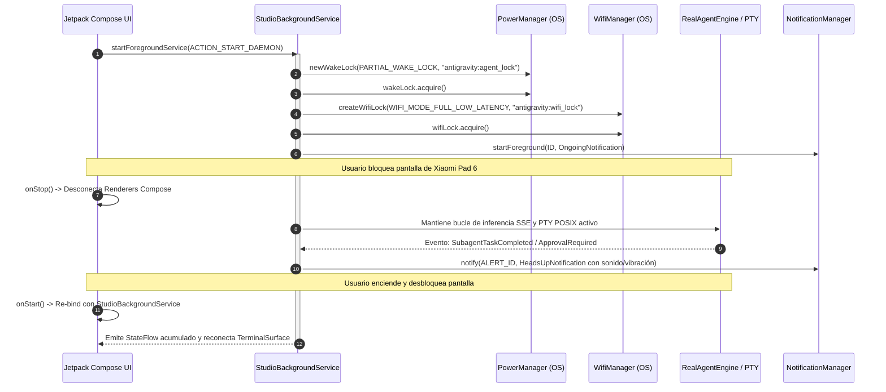
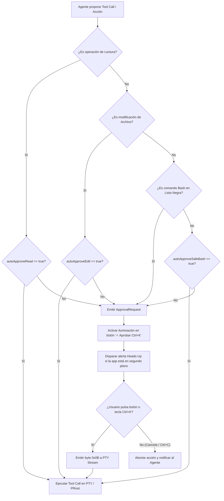
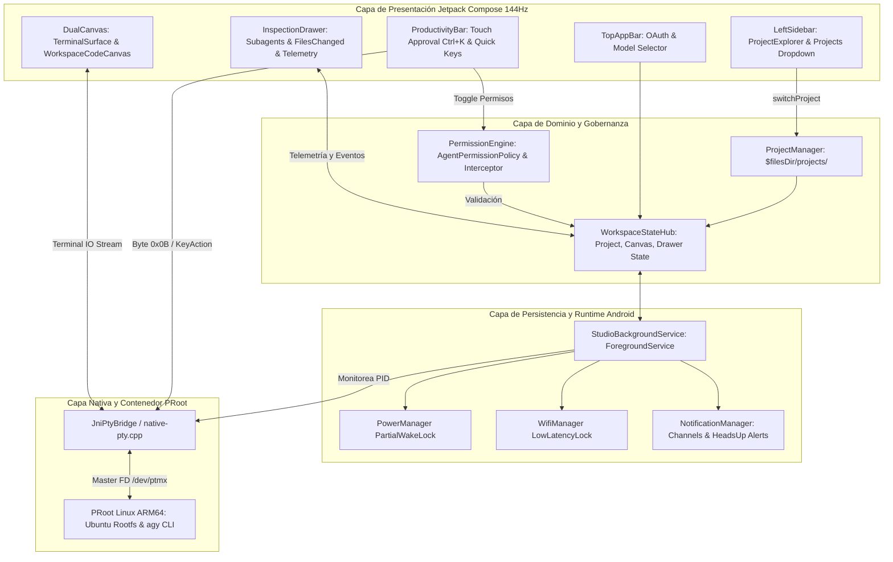
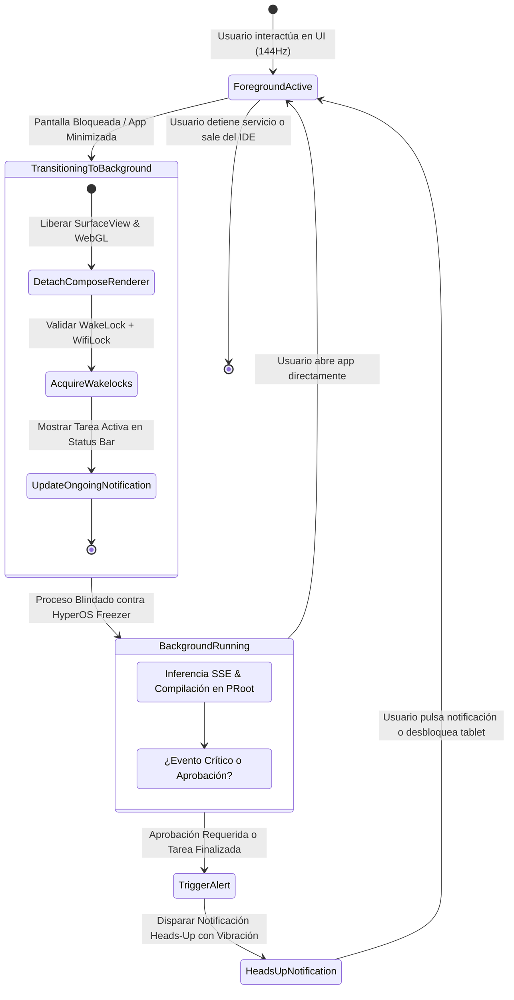

# SPEC-003: Antigravity Studio IDE: Multi-Project Workspace, Dual Canvas & HyperOS Background Persistence

| Metadato | Valor |
| :--- | :--- |
| **Identificador** | `SPEC-003` |
| **Título** | Antigravity Studio IDE: Multi-Project Workspace, Dual Canvas & HyperOS Background Persistence |
| **Autor** | `spec_architect` |
| **Estado** | `APPROVED FOR IMPLEMENTATION` |
| **Fecha de Creación** | 2026-09-12 |
| **Dispositivo Objetivo** | Xiaomi Pad 6 (Qualcomm Snapdragon 870, ARM64-v8a, 6 GB RAM, 11" 2.8K 144Hz, HyperOS / Android 13/14) |
| **Runtime Target** | Kotlin / Jetpack Compose / Android NDK C++ / PRoot Linux ARM64 |

---

## 1. Contexto y Objetivos del Sistema

### 1.1 Declaración del Problema y Visión de la Estación de Trabajo Tablet
El paradigma dominante de desarrollo de software asistido por inteligencia artificial asume la presencia continua de una computadora de escritorio o laptop tradicional. Cuando los desarrolladores intentan operar desde dispositivos móviles o tablets, se ven forzados a recurrir a entornos empobrecidos: clientes SSH hacia servidores remotos (VPS con latencia variable y costos continuos), terminales móviles monolíticas (Termux) sin integración visual con el espacio de trabajo, o editores web en la nube que consumen recursos excesivos y fallan ante cortes de conectividad.

La **Xiaomi Pad 6** ofrece una base de hardware de excepcionales prestaciones:
- SoC Qualcomm Snapdragon 870 5G con arquitectura tri-cluster (1x Kryo 585 Prime @ 3.20 GHz, 3x Kryo 585 Gold @ 2.42 GHz, 4x Kryo 585 Silver @ 1.80 GHz).
- GPU Adreno 650 acelerada por hardware (soporte nativo Vulkan 1.1 y OpenGL ES 3.2).
- 6 GB de memoria RAM física unificada LPDDR5 de alta velocidad.
- Pantalla táctil IPS de 11.0 pulgadas con resolución nativa 2.8K ($2880 \times 1800$ píxeles, relación de aspecto 16:10, 309 ppi) y tasa de refresco adaptativa de hasta **144Hz** (tiempo por frame $\le 6.94\,\text{ms}$).

**Antigravity Studio IDE (Tablet Edition)** materializa la transformación de la Xiaomi Pad 6 en un entorno de desarrollo integrado (IDE) local, autónomo y agéntico (*local-first*), eliminando de raíz la dependencia de una PC. Mediante la virtualización de espacio de usuario PRoot ARM64, la terminal de baja latencia en C++ NDK y una interfaz de usuario multicapa construida en Jetpack Compose, el IDE expone una experiencia ergonómica de triple panel (*Dual Canvas*) optimizada para interacción táctil y teclado físico (Xiaomi Smart Keyboard / Bluetooth).

### 1.2 Objetivos Principales del IDE
1. **Autonomía Operativa Completa:** Gestión local de proyectos aislados en `$filesDir/projects/`, compiladores nativos, runtime de Node.js/Python y orquestación agéntica sin servidores externos ni permisos de root.
2. **Dual Canvas a 144Hz:** Renderizado simultáneo o conmutable entre la terminal agéntica de ultra-baja latencia ($\le 16\,\text{ms}$) y el lienzo de inspección de código / diff viewer en resolución 2.8K.
3. **Persistencia Garantizada en HyperOS:** Superación del subsistema de ahorro energético y *memory killer* de Xiaomi HyperOS mediante un `ForegroundService` estricto, acompañado de `PARTIAL_WAKE_LOCK` y `WifiLock` para sostener ejecuciones agénticas complejas con pantalla apagada.
4. **Ergonomía Táctil de Aprobación Inmediata:** Fila de productividad inferior con tecla principal táctil `[✓ Aprobar (Ctrl+K)]` (emisión inmediata de `\u000B`) para validar tool calls y comandos bash sin abrir el teclado virtual.
5. **Control de Permisos y Gobernanza Agéntica:** Matriz granular de permisos (auto-aprobación de lectura, edición y comandos bash de sólo lectura vs intercepción obligatoria de operaciones destructivas).

---

## 2. Arquitectura de Runtime y Ejecución en Segundo Plano (HyperOS Persistence)

### 2.1 Desafíos Específicos del Subsistema HyperOS / MIUI
Xiaomi HyperOS implementa una gestión de procesos sumamente restrictiva orientada a maximizar la autonomía de batería en dispositivos móviles:
1. **Freezer de cgroups (v2):** Al suspenderse la pantalla o pasar la aplicación a segundo plano por más de 15 segundos, el demonio `joyose` y el subsistema `perf_core` congelan los subprocesos POSIX nativos, deteniendo bucles de red y ejecuciones en PRoot.
2. **OOM Score Adjustment Agresivo:** Los procesos de usuario ordinarios ven elevado su puntaje en `/proc/[pid]/oom_score_adj` hasta 905+, convirtiéndolos en objetivos prioritarios para `lmkd` (Low Memory Killer Daemon) ante presiones de memoria causadas por la GPU o servicios de sistema.
3. **Suspensión de Interfaces de Red:** Sin un bloqueo activo de Wi-Fi, HyperOS desactiva el polling continuo de sockets SSE/gRPC durante el modo Doze profundo.

### 2.2 Estrategia de Persistencia: `StudioBackgroundService`
Para blindar las sesiones del agente y el árbol de procesos nativos POSIX, Antigravity Studio implementa un servicio desacoplado de primer plano (`ForegroundService`) que asume la tutela del ciclo de vida:



### 2.3 Canales de Notificación y Alertas Agénticas
El servicio registra dos canales de notificación en Android (`NotificationChannel`):
1. **Canal Persistente (`studio_background_channel`):**
   - Importancia: `IMPORTANCE_LOW` (sin alerta sonora continua).
   - Flag: `FLAG_ONGOING_EVENT` y `FOREGROUND_SERVICE_IMMEDIATE`.
   - Contenido: Muestra el proyecto activo, el estado actual (`🟢 Listo`, `🟣 Razonando`, `🔵 Ejecutando`), nombre de la tarea en curso y botón de acción directa `[⏹ Detener]` que transmite `SIGINT` (`\u0003`) a la sesión PTY sin abrir la app.
2. **Canal de Alertas y Aprobación (`studio_alerts_channel`):**
   - Importancia: `IMPORTANCE_HIGH` (notificación flotante Heads-Up).
   - Configuración: Vibración háptica dual (`longArrayOf(0, 150, 80, 150)` ms) y sonido de sistema de baja latencia.
   - Activación: Se dispara únicamente cuando:
     - Una tarea agéntica de larga duración ha concluido exitosamente (`Task Finished [✓]`).
     - El agente solicita aprobación interactiva humana para una operación de archivo o comando riesgoso (`Aprobación Requerida [Ctrl+K]`).
     - Ocurre un error irrecuperable en el contenedor PRoot.

---

## 3. Modelo y Contrato de Gestión Multi-Proyecto

### 3.1 Estructura del Almacenamiento y Virtualización VFS
Todos los proyectos residen en el directorio de datos privado de la aplicación, accesible sin requerir permisos de almacenamiento externo (`MANAGE_EXTERNAL_STORAGE`):
- **Ruta Host Android:** `${context.filesDir}/projects/` (canónico: `/data/user/0/com.antigravity.studio/files/projects/`).
- **Punto de Montaje PRoot:** `/home/antigravity/projects/` montado mediante argumento `--bind /data/user/0/com.antigravity.studio/files/projects:/home/antigravity/projects`.

### 3.2 Escaneo Reactivo y Proyectos Preconfigurados
El componente `ProjectManager` mantiene un `StateFlow<List<ProjectItem>>` alimentado por un escáner en corrutina (`Dispatchers.IO`).
- **Detección Automática:** Cada subdirectorio inmediato en `projects/` es catalogado como un proyecto válido. Se detectan proyectos existentes como:
  - `tateti`: Aplicación interactiva de demostración con interfaz de consola.
  - `backend`: Servicio de microservicios o API local.
  - `Analista`: Agente autónomo para procesamiento y análisis de datos.
- **Ordenamiento:** Los proyectos se indexan ordenados de manera descendente según su timestamp de última modificación (`lastModified`), garantizando acceso instantáneo a las áreas de trabajo activas.
- **Creación de Proyectos:** Diálogo interactivo `+ New Project` que genera la estructura inicial a partir de plantillas (`ProjectTemplate`: `EMPTY`, `PYTHON_CLI`, `NODEJS_API`, `BASH_SCRIPT`).

### 3.3 Vinculación con PTY y Agent Engine
Al seleccionarse un proyecto:
1. `ProjectManager.switchProject(projectId)` actualiza el estado atómico del proyecto activo.
2. `RealAgentEngine.workspaceDir` se actualiza al directorio del proyecto seleccionado.
3. La sesión de pseudoterminal (`NativePty`) ejecuta internamente un cambio de directorio de trabajo (`cd /home/antigravity/projects/<projectId> && clear\n`) o regenera el proceso shell con la variable `PWD` configurada.
4. El explorador de archivos (`ProjectExplorer`) invalida su caché y recarga el árbol de nodos correspondiente.

---

## 4. Diseño Ergonómico de 3 Paneles (Dual Canvas en Tablet)

La interfaz aprovecha el factor de forma apaisado (*landscape*) de la Xiaomi Pad 6 ($2880 \times 1800$ píxeles a 144Hz), distribuyendo las responsabilidades operativas en tres paneles funcionales:

```
+---------------------------------------------------------------------------------------------------------+
|                                    TOP APP BAR (OAuth, Modelo, Status)                                  |
+-------------------+---------------------------------------------------------------+---------------------+
| LEFT SIDEBAR      | DUAL CANVAS (CENTRAL)                                         | RIGHT DRAWER        |
| Width: 260-320dp  | Tabs: [Agent Terminal (144Hz)] | [Workspace Canvas (Code/Diff)]| Width: 280-340dp    |
|                   +---------------------------------------------------------------+                     |
| - Project Select  |                                                               | - Subagents List    |
|   [tateti v]      |   (Active Canvas: Split View 50/50 or Full Screen Tab)        |   * spec_architect  |
|   [+ New Project] |                                                               |     [Completed ✓]   |
|                   |   - Terminal: WebGL / xterm.js POSIX PTY Stream               |   * code_runner     |
| - File Explorer   |   - Code Canvas: Monospace Syntax Highlighting & Diff Viewer  |     [Executing 🔵]  |
|   > src/          |                                                               |                     |
|     main.py (M)   |                                                               | - Files Changed     |
|     utils.py      |                                                               |   * src/main.py     |
|   > tests/        |                                                               |     [+14 / -2]      |
|                   |                                                               |                     |
|                   |                                                               | - HyperOS Service:  |
|                   |                                                               |   [⚡ Wakelock ON]  |
+-------------------+---------------------------------------------------------------+---------------------+
| PRODUCTIVITY BAR: [✓ Aprobar (Ctrl+K)] | [⚡ Modelo] [📁 Archivos] [⏹ Detener] [⚙ Ajustes] | [CTRL] [TAB] [ESC] |
+---------------------------------------------------------------------------------------------------------+
```

### 4.1 Barra Lateral Izquierda (`LeftSidebar` / `ProjectExplorer`)
- **Selector de Proyecto Superior:** Menú desplegable con iconos que enumera todos los proyectos escaneados, indicando su ruta y última edición, junto con el botón de acción destacada `[+ New Project]`.
- **Árbol Jerárquico de Archivos:** Representación gráfica colapsable de carpetas y ficheros con indentación de 12 dp. Muestra el estado Git reactivo de cada archivo mediante pills de color:
  - `MODIFIED` (Naranja `#F59E0B`)
  - `STAGED` (Verde `#10B981`)
  - `UNTRACKED` (Cian `#06B6D4`)
- **Acciones Táctiles:** Un toque abre el archivo en el `Workspace Canvas`; un toque prolongado despliega acciones de archivo (Renombrar, Eliminar, Duplicar).

### 4.2 Centro: Lienzo Dual (`DualCanvas` a 144Hz)
El panel central es el núcleo del IDE y soporta dos modalidades de visualización:
1. **Modalidad por Pestañas:**
   - **Pestaña 1 (`Agent Terminal`):** Superficie de terminal interactiva acelerada por GPU (`TerminalSurface` vía WebGL y xterm.js) ligada directamente al motor `native-pty.cpp`. Optimizada para emitir frames a 144Hz con latencia de entrada inferior a 16 ms.
   - **Pestaña 2 (`Workspace Canvas`):** Editor y visualizador de código fuente con renderizado de tipografía monospace (`JetBrains Mono`), numeración de líneas y visor de diferencias Git (*Diff Viewer*) con resaltado sintáctico de bloques agregados y eliminados.
2. **Modalidad Dividida (`Split Canvas 50/50`):** En orientación horizontal, permite colocar la terminal interactiva a la izquierda y el código fuente o diff a la derecha con un divisor dinámico redimensionable, permitiendo inspeccionar cómo el agente modifica el código en tiempo real mientras compila o testea.

### 4.3 Barra Táctil de Productividad Inferior (`ProductivityBar`)
Franja táctil de 52 dp de altura, situada estratégicamente en el borde inferior para permitir acceso rápido con los pulgares mientras se sujeta la tablet o se trabaja en soporte de mesa:
1. **Botón Prominente de Aprobación Agéntica `[✓ Aprobar (Ctrl+K)]`:**
   - Estilo: Gradiente de acento esmeralda/cian (`#10B981` a `#06B6D4`) con tipografía en negrita y elevación táctil.
   - Respuesta Háptica: Disparo inmediato de `HapticFeedbackType.LongPress` para confirmar pulsación física.
   - Comportamiento IPC: Envía directamente el byte de control POSIX `\u000B` (`0x0B` correspondiente a `Ctrl+K`) al descriptor PTY maestro del agente, desbloqueando tool calls pendientes sin necesidad de desplegar el teclado en pantalla.
2. **Accesos Rápidos de Control:**
   - `[⚡ Modelo]`: Abre la hoja modal `ModelSelectionSheet` para conmutar entre modelos disponibles (Gemini 2.0 Flash, Gemini 1.5 Pro, Claude 3.5 Sonnet, etc.).
   - `[📁 Archivos]`: Alterna la visibilidad colapsable de la barra lateral izquierda para maximizar el área de trabajo.
   - `[⏹ Detener]`: Envía `SIGINT` (`\u0003` / `Ctrl+C`) al subproceso PTY maestro para abortar de inmediato cualquier tarea fuera de control.
   - `[⚙ Ajustes]`: Abre el modal de configuración de gobernanza y políticas de auto-aprobación.
3. **Teclas Táctiles Modificadoras:**
   - `[CTRL]` (tecla con enclavamiento / *latching state* que colorea su borde en cian cuando está activa).
   - `[TAB]` (`\t` / `0x09`), `[ESC]` (`\u001B`), y flechas de navegación (`↑`, `↓`, `←`, `→`).

### 4.4 Panel Auxiliar Derecho (Drawer de Inspección Agéntica)
Panel lateral deslizable o acoplable de 280-340 dp de ancho dedicado a la observabilidad del agente:
1. **Lista de Subagentes Activos (`SubagentCard`):**
   - Muestra cada subagente instanciado por el orquestador principal (ej. `spec_architect`, `code_implementer`, `qa_validator`).
   - Métricas: Nombre del agente, duración acumulada de cómputo en segundos, conteo de herramientas ejecutadas.
   - Badge de Estado: `[Executing 🔵]` (animación pulsante), `[Reasoning 🟣]`, `[Completed ✓]` (verde), `[Failed 🔴]`.
2. **Lista de Archivos Modificados (`FilesChangedCard`):**
   - Historial de cambios introducidos en la sesión activa.
   - Resumen cuantitativo por archivo: Ruta relativa, líneas añadidas (`+XX` en verde) y líneas suprimidas (`-YY` en rojo).
   - Un toque sobre la tarjeta abre automáticamente el archivo en el `Workspace Canvas` enfocando la primera modificación.
3. **Chip de Telemetría de HyperOS:**
   - Indicador de estado del servicio en background: `[⚡ Fondo: Activo (Wakelock)]` o `[💤 Fondo: Suspendido]`.
   - Monitor de consumo de recursos: RAM usada por el proceso (`MB / 6000 MB`) y temperatura estimada del Snapdragon 870.

---

## 5. Contrato de Permisos y Auto-Aprobación

El motor de gobernanza agéntica (`AgentPermissionPolicy`) define las reglas bajo las cuales el agente puede operar sobre el sistema de archivos y el shell POSIX:

### 5.1 Matriz de Políticas de Seguridad
| Tipo de Operación | Política Configurable | Valor Predeterminado | Comportamiento del IDE |
| :--- | :--- | :--- | :--- |
| **Lectura de Archivos** | `autoApproveRead` | `true` | Se ejecutan de forma transparente (`cat`, `view_file`, `grep_search`, `find_by_name`). |
| **Edición / Escritura** | `autoApproveEdit` | `false` | Se suspende el agente emitiendo `ApprovalRequest`; requiere pulsar `[✓ Aprobar (Ctrl+K)]`. |
| **Bash Seguro** | `autoApproveSafeBash` | `true` | Comandos clasificados como seguros / sólo lectura o de chequeo (`ls`, `pwd`, `git status`, `git diff`, `cargo check`). |
| **Bash Destructivo / Modificador** | Lista Negra Estricta | `false` (No eludible) | Comandos riesgosos (`rm -rf`, `git push --force`, `dd`, `mkfs`, `curl | bash`, `chmod -R 777`) exigen confirmación táctil explícita. |

### 5.2 Flujo de Intercepción y Aprobación Táctil


---

## 6. Diagramas de Arquitectura y Contratos de Código Kotlin

### 6.1 Diagrama de Arquitectura Global de 3 Paneles y Servicios


### 6.2 Diagrama de Flujo de Persistencia en Segundo Plano (HyperOS WakeLock)


### 6.3 Contratos de Interfaces y Data Classes en Kotlin

A continuación se definen los contratos formales para los módulos del IDE:

```kotlin
package com.antigravity.studio.model.ide

import kotlinx.coroutines.flow.StateFlow
import java.io.File

/**
 * Representa una plantilla base para inicializar un nuevo proyecto en el espacio de trabajo.
 */
enum class ProjectTemplate(val displayName: String, val description: String) {
    EMPTY("Vacío", "Directorio en blanco listo para inicialización manual"),
    PYTHON_CLI("Python CLI", "Entorno preconfigurado con main.py, requirements.txt y venv"),
    NODEJS_API("Node.js API", "Entorno con package.json, TypeScript y script de arranque"),
    BASH_SCRIPT("Scripting POSIX", "Herramientas de automatización bash con soporte agéntico")
}

/**
 * Entidad de dominio que describe un proyecto local alojado en $filesDir/projects/.
 */
data class ProjectItem(
    val id: String,
    val name: String,
    val rootDirectory: File,
    val lastModified: Long,
    val fileCount: Int,
    val activeGitBranch: String? = null,
    val sizeBytes: Long = 0L
)

/**
 * Contrato formal para la administración reactiva de proyectos en Antigravity Studio.
 */
interface IProjectManager {
    val projects: StateFlow<List<ProjectItem>>
    val activeProject: StateFlow<ProjectItem?>

    suspend fun scanProjects(): List<ProjectItem>
    suspend fun createProject(name: String, template: ProjectTemplate): Result<ProjectItem>
    suspend fun deleteProject(projectId: String): Result<Unit>
    suspend fun switchProject(projectId: String): Result<ProjectItem>
    fun getProjectsRoot(): File
}
```

```kotlin
package com.antigravity.studio.service

import android.content.Context
import kotlinx.coroutines.flow.StateFlow

/**
 * Estado de telemetría y salud del servicio de fondo en HyperOS.
 */
data class HyperOsTelemetryState(
    val isServiceRunning: Boolean = false,
    val isWakeLockHeld: Boolean = false,
    val isWifiLockHeld: Boolean = false,
    val processRamUsageMb: Long = 0L,
    val totalDeviceRamMb: Long = 6144L, // 6 GB en Xiaomi Pad 6
    val cpuTemperatureCelsius: Float = 0.0f
)

/**
 * Contrato de comunicación y control para el servicio persistente de primer plano.
 */
interface IStudioBackgroundService {
    val telemetryState: StateFlow<HyperOsTelemetryState>

    fun startPersistence(context: Context, activeProjectName: String)
    fun updateTaskProgress(taskTitle: String, stepIndex: Int, totalSteps: Int)
    fun notifyApprovalNeeded(toolName: String, summary: String)
    fun notifyTaskCompleted(taskTitle: String, durationSeconds: Long)
    fun stopPersistence(context: Context)
}
```

```kotlin
package com.antigravity.studio.model.ide

/**
 * Modos de visualización soportados en el lienzo central de la Xiaomi Pad 6.
 */
enum class CanvasDisplayMode {
    SINGLE_TAB,
    SPLIT_HORIZONTAL,
    SPLIT_VERTICAL
}

enum class CanvasTabType {
    AGENT_TERMINAL,
    WORKSPACE_CODE
}

/**
 * Estado que gobierna el lienzo dual en resolución 2.8K a 144Hz.
 */
data class DualCanvasState(
    val activeTab: CanvasTabType = CanvasTabType.AGENT_TERMINAL,
    val displayMode: CanvasDisplayMode = CanvasDisplayMode.SINGLE_TAB,
    val splitRatio: Float = 0.5f,
    val currentOpenFilePath: String? = null,
    val isFileModified: Boolean = false,
    val terminalRefreshRateHz: Int = 144
)
```

```kotlin
package com.antigravity.studio.ui.productivity

/**
 * Acciones emitidas por la barra táctil de productividad inferior.
 */
sealed interface ProductivityTouchAction {
    data object ApproveCurrentAction : ProductivityTouchAction {
        val controlByte: Byte = 0x0B // Carácter ASCII '\u000B' (Ctrl+K)
    }
    data object StopExecution : ProductivityTouchAction {
        val controlByte: Byte = 0x03 // Carácter ASCII '\u0003' (Ctrl+C / SIGINT)
    }
    data object OpenModelSelector : ProductivityTouchAction
    data object ToggleSidebarFiles : ProductivityTouchAction
    data object OpenPermissionsSettings : ProductivityTouchAction
    data class SendRawKey(val bytes: ByteArray) : ProductivityTouchAction
    data object ToggleCtrlLatch : ProductivityTouchAction
}
```

```kotlin
package com.antigravity.studio.model.ide

/**
 * Estado de ejecución y ciclo de vida de un subagente orquestado.
 */
enum class SubagentExecutionStatus {
    IDLE,
    REASONING,
    EXECUTING,
    COMPLETED,
    FAILED
}

data class SubagentCardData(
    val id: String,
    val name: String,
    val roleDescription: String,
    val durationSeconds: Long,
    val toolCallsCount: Int,
    val status: SubagentExecutionStatus,
    val progressPercent: Float = 0.0f
)

data class FileChangeSummary(
    val relativePath: String,
    val linesAdded: Int,
    val linesDeleted: Int,
    val isBinary: Boolean = false
)

/**
 * Estado reactivo del panel auxiliar derecho de inspección.
 */
data class InspectionDrawerState(
    val isOpen: Boolean = true,
    val subagents: List<SubagentCardData> = emptyList(),
    val modifiedFiles: List<FileChangeSummary> = emptyList(),
    val isHyperOsWakelockActive: Boolean = true
)
```

```kotlin
package com.antigravity.studio.core.permission

/**
 * Matriz de políticas de auto-aprobación del motor agéntico.
 */
data class AgentPermissionPolicy(
    val autoApproveRead: Boolean = true,
    val autoApproveEdit: Boolean = false,
    val autoApproveSafeBash: Boolean = true,
    val strictBlacklistEnabled: Boolean = true
)

data class ApprovalRequest(
    val requestId: String,
    val category: RequestCategory,
    val targetResource: String,
    val commandSnippet: String? = null,
    val timestampMillis: Long = System.currentTimeMillis()
)

enum class RequestCategory {
    FILE_READ,
    FILE_WRITE,
    BASH_COMMAND_SAFE,
    BASH_COMMAND_RISKY
}

interface IPermissionEngine {
    val currentPolicy: AgentPermissionPolicy
    fun updatePolicy(newPolicy: AgentPermissionPolicy)
    suspend fun evaluateAction(request: ApprovalRequest): Boolean
    fun approvePendingRequest(requestId: String)
    fun rejectPendingRequest(requestId: String)
}
```

---

## 7. Criterios de Aceptación Verificables (Acceptance Criteria)

La siguiente tabla define los criterios de aceptación formales que deben ser verificados por el arnés de pruebas (`harness/spec_validator.py` y suites de prueba unitarias/instrumentadas):

| Identificador | Módulo | Criterio de Aceptación | Método de Verificación |
| :--- | :--- | :--- | :--- |
| **`AC-IDE-001`** | ProjectManager | `ProjectManager` escanea el directorio `$filesDir/projects/`, detecta carpetas existentes (`tateti`, `backend`, `Analista`), ordena los elementos por `lastModified` descendente y permite crear proyectos con plantillas base. | Test unitario creando carpetas temporales con diferentes marcas de tiempo y validando la lista emitida en `StateFlow<List<ProjectItem>>`. |
| **`AC-IDE-002`** | Project Workspace Binding | Al invocar `switchProject(projectId)`, `RealAgentEngine.workspaceDir` y el `cwd` de la sesión PTY se actualizan atómicamente a la ruta del nuevo proyecto sin dejar procesos huérfanos ni fugas de descriptores de archivo. | Test de integración verificando la variable de entorno `PWD` en el subproceso PTY y la propiedad `workspaceDir` tras conmutar entre `tateti` y `backend`. |
| **`AC-IDE-003`** | DualCanvas Tablet UI | El componente `DualCanvas` soporta renderizado a 144Hz de `Agent Terminal` mediante WebGL/xterm.js y permite conmutar o dividir la pantalla (50/50) con `Workspace Canvas` para inspección simultánea de código fuente. | Benchmark UI midiendo tasa de refresco a 144Hz en la pantalla 2.8K de Xiaomi Pad 6 y validando composición de nodos Compose en modo split. |
| **`AC-IDE-004`** | ProductivityBar Approval | La pulsación del botón `[✓ Aprobar (Ctrl+K)]` transmite de forma inmediata el byte de control `\u000B` (`0x0B`) al flujo de entrada del PTY maestro con vibración háptica instantánea. | Test de instrumentación con `ComposeTestRule` simulando el clic en el botón táctil de aprobación y verificando la captura exacta del byte `0x0B` en el buffer de entrada PTY. |
| **`AC-IDE-005`** | ProductivityBar Controls | Los botones de acceso rápido `[⚡ Modelo]`, `[📁 Archivos]`, `[⏹ Detener]` y `[⚙ Ajustes]` ejecutan sus acciones respectivas, y las teclas `[CTRL]`, `[TAB]` y `[ESC]` emiten sus secuencias de código ASCII correspondientes. | Prueba unitaria de `ProductivityBar` comprobando emisión de eventos `KeyAction` (`0x1B` para ESC, `0x09` para TAB, `0x03` para Detener) y actualización de estados booleanos. |
| **`AC-IDE-006`** | Inspection Drawer Subagents | El panel auxiliar derecho renderiza la lista de subagentes en tarjetas `SubagentCard`, reflejando en tiempo real el nombre, duración en segundos y estados (`REASONING`, `EXECUTING`, `COMPLETED ✓`). | Test de Compose verificando la presencia y contenido de `SubagentCard` ante actualizaciones emitidas en `InspectionDrawerState`. |
| **`AC-IDE-007`** | Inspection Drawer Files | `FilesChangedCard` presenta la lista de archivos modificados con el cálculo preciso de líneas agregadas (`+`) y eliminadas (`-`), abriendo el archivo en el canvas central al ser pulsado. | Test unitario proveyendo una lista de `FileChangeSummary` y verificando que el callback `onFileSelected` es invocado con la ruta correcta. |
| **`AC-IDE-008`** | HyperOS Background Persistence | `StudioBackgroundService` adquiere `PARTIAL_WAKE_LOCK` y `WifiLock`, manteniéndose en primer plano con `startForeground()` y evitando que el freezer de HyperOS o el OOM killer detengan el agente al apagar la pantalla. | Verificación de servicio en Android (`dumpsys power` y `dumpsys wifi`) confirmando el estado activo de locks con tags `antigravity:*` tras el bloqueo de pantalla. |
| **`AC-IDE-009`** | Background Notifications | El servicio emite una notificación persistente con la tarea actual y dispara una notificación flotante Heads-Up con sonido y vibración en el canal `studio_alerts_channel` al concluir tareas o requerir aprobación. | Test instrumentado validando la creación de `NotificationChannel` con importancia `HIGH` y la emisión correcta de notificaciones ante eventos del agente. |
| **`AC-IDE-010`** | Permission Governance Engine | `PermissionEngine` respeta las políticas: auto-aprueba lecturas si `autoApproveRead=true`, auto-aprueba bash seguro si `autoApproveSafeBash=true`, e intercepta obligatoriamente comandos en lista negra destructiva (`rm -rf`, `dd`). | Test unitario de `PermissionEngine` evaluando comandos clasificados como seguros vs destructivos y confirmando la suspensión de ejecución hasta recibir aprobación táctil. |

---

## 8. Consideraciones Específicas de Rendimiento y Memoria en Xiaomi Pad 6

1. **Gestión de Memoria RAM LPDDR5 (Presupuesto de 6 GB):**
   - El sistema operativo Android y la capa HyperOS reservan aproximadamente $2.2\,\text{GB}$ de RAM.
   - El contenedor PRoot con la suite de herramientas del agente (Node.js, Python) tiene asignado un límite elástico de $1.8\,\text{GB}$.
   - La aplicación Antigravity Studio IDE asigna un tope estricto de **$600\,\text{MB}$** de heap JVM/ART y **$250\,\text{MB}$** para el buffer gráfico WebGL y la pila C++ de PTY, garantizando un margen de seguridad de más de $1.1\,\text{GB}$ libres para evitar activaciones de `lmkd`.
2. **Sincronización de VSYNC a 144Hz en Lienzo Dividido:**
   - Para sostener los $144\,\text{Hz}$ en la pantalla de 11 pulgadas ($2880 \times 1800$), las actualizaciones de texto en el `Workspace Canvas` y `TerminalSurface` aplican coalescencia de eventos (*conflation/throttling*) a ventanas de $6.9\,\text{ms}$, eliminando redibujados redundantes durante volcados masivos de logs.
3. **Mitigación Térmica en Snapdragon 870:**
   - Si la temperatura del SoC reportada en la telemetría supera los $43^\circ\text{C}$ durante sesiones intensivas de compilación, el IDE notifica al usuario en el chip del Drawer de Inspección y reduce la tasa de refresco del canvas pasivo a $60\,\text{Hz}$ para controlar la disipación térmica sin afectar la velocidad de la terminal nativa.
