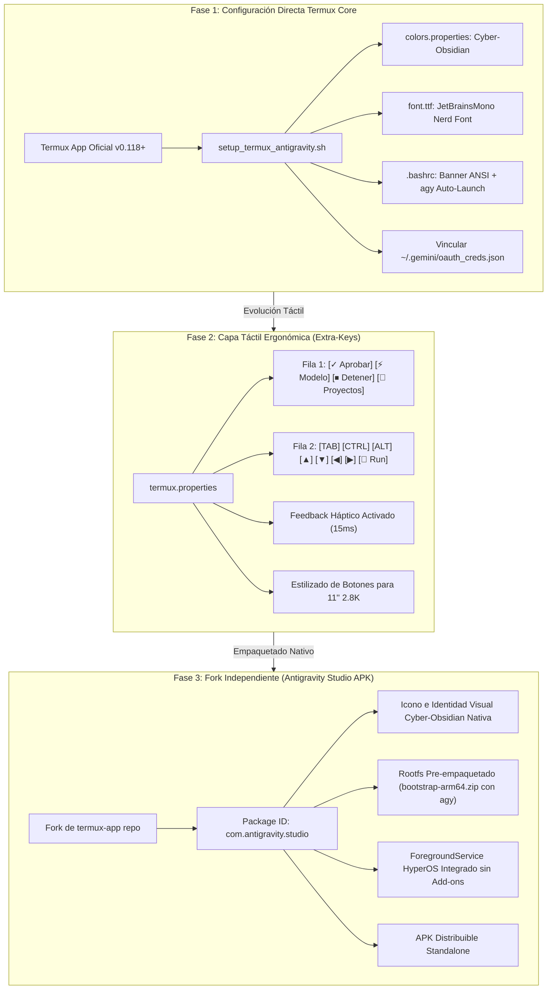
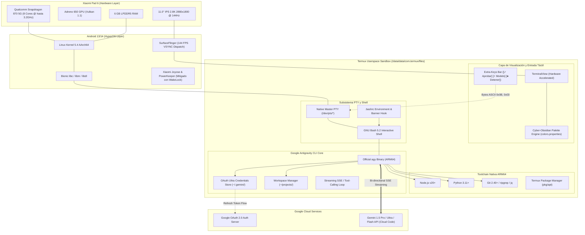
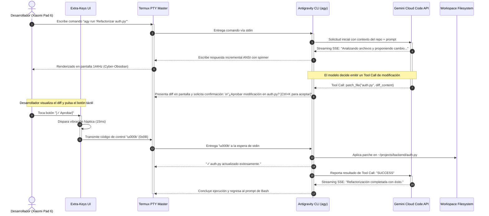
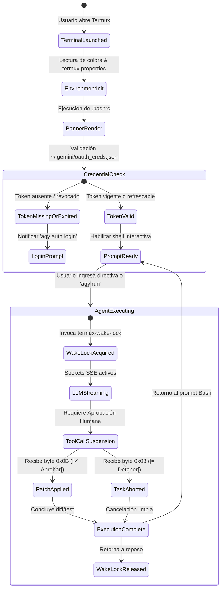

# SPEC-004: Antigravity Studio: Termux Platform Adaptation, Cyber-Obsidian UI & Official CLI Pipeline

| Metadato | Valor |
| :--- | :--- |
| **Identificador** | `SPEC-004` |
| **Título** | Antigravity Studio: Termux Platform Adaptation, Cyber-Obsidian UI & Official CLI Pipeline |
| **Autor** | `spec_architect` |
| **Estado** | `APPROVED FOR IMPLEMENTATION` |
| **Fecha de Creación** | 2026-09-12 |
| **Dispositivo Objetivo** | Xiaomi Pad 6 (Qualcomm Snapdragon 870, ARM64-v8a, 6 GB RAM, 11" 2.8K 144Hz, HyperOS / Android 13/14) |
| **Runtime Target** | Termux Linux ARM64 / Bash / Python / Official Google Antigravity CLI (agy) |

---

## 1. Contexto y Objetivos del Sistema

### 1.1 Declaración del Problema y Justificación Técnica de la Base Termux
El desarrollo de software autónomo y agéntico en tablets Android enfrenta tradicionalmente el dilema entre dos extremos ineficientes:
1. **Soluciones dependientes de la nube (Cloud/VPS):** Requieren conexión de red ininterrumpida, imponen latencias de entrada perceptibles (RTT $> 60\,\text{ms}$) y generan costos recurrentes de infraestructura remota.
2. **Entornos móviles monolíticos sin especialización:** Emuladores de terminal genéricos carecen de integración visual, poseen paletas cromáticas fatigosas para sesiones prolongadas y obligan al usuario a desplegar el teclado en pantalla (On-Screen Keyboard, OSK) para cada interacción simple, consumiendo hasta el 45% de la superficie útil de la pantalla de 11 pulgadas.

La adopción de **Termux** como base de ejecución nativa para **Antigravity Studio** resuelve de manera contundente estos desafíos sobre la **Xiaomi Pad 6**:
- **Compilación Nativa Bionic ARM64-v8a:** Termux ejecuta binarios compilados directamente contra la biblioteca C de Android (`libc.so` / Bionic), eliminando la penalización de emulación o traducción de instrucciones. El motor PTY opera a nivel de kernel mediante pseudo-terminales POSIX nativos (`/dev/pts/*`).
- **Autonomía Operativa sin Root:** Funciona completamente dentro del aislamiento de seguridad (*sandboxing*) del UID asignado por Android (`/data/data/com.termux/files/`), garantizando compatibilidad total con dispositivos de producción sin alterar el bootloader ni anular la garantía del fabricante.
- **Ecosistema de Herramientas de Compilación:** Dispone de un gestor de paquetes optimizado (`pkg` / `apt`) que proporciona de manera inmediata Node.js 20+, Python 3.11+, Git, ripgrep, jq, curl, OpenSSL y compiladores nativos (Clang/LLVM, Rust), requeridos por el pipeline agéntico.
- **Emulador de Terminal de Alto Desempeño:** Su motor de renderizado de texto (`TerminalView`) soporta secuencias de escape completas VT100/ANSI, 24-bit TrueColor y renderizado acelerado por hardware mediante SurfaceView de Android, sincronizable con la tasa nativa de **144Hz** de la pantalla IPS 2.8K de la Xiaomi Pad 6.

### 1.2 Integración del CLI Oficial de Google Antigravity (`agy`) con Cuenta Ultra
El CLI oficial de Google Antigravity (`agy`) representa el núcleo agéntico de generación de código, orquestación de herramientas (*tool-calling*) e inferencia contextual asistida por modelos de lenguaje de última generación:
- **Autenticación con Cuenta Google Ultra:** El adaptador integra de forma transparente los tokens de acceso y actualización de suscripciones Google Advanced / Ultra (Gemini 1.5 Pro, Ultra y Flash), vinculados mediante el protocolo de loopback localhost OAuth 2.0 PKCE especificado en [`SPEC-002`](file:///c:/Projects/antigravity/specs/02-google-oauth-agent.md).
- **Consumo de Cuotas y Context Window:** La cuenta Ultra habilita ventanas de contexto masivas (hasta 2 millones de tokens) y un límite holgado de solicitudes por minuto (RPM/TPM), permitiendo al CLI `agy` procesar proyectos enteros, árboles de sintaxis abstracta (AST) y depuración iterativa sin truncamiento de memoria contextual.
- **Inferencia en Streaming SSE:** Las respuestas agénticas y el razonamiento intermedio se transmiten en tiempo real con latencia de primer token (TTFT) inferior a $450\,\text{ms}$, proyectándose directamente en el buffer de la terminal mediante secuencias ANSI y spinners cinemáticos Cyber-Obsidian.

### 1.3 Ergonomía de Entrada Táctil en la Xiaomi Pad 6
La interacción con agentes de codificación autónomos no requiere tipeo constante de código (la IA escribe los parches), sino **supervisión directiva y validación rápida**:
- La pantalla de 11 pulgadas ($2880 \times 1800$, relación de aspecto 16:10) ofrece un ancho horizontal óptimo de 120 a 160 columnas de terminal sin necesidad de scroll horizontal.
- La barra de accesos directos táctiles (`extra-keys`) de Termux es reconfigurada como una **Capa de Control Agéntico**:
  - Botón primordial **`[✓ Aprobar]`**: Envía el código de control `\u000B` (`Ctrl+K`) para autorizar tool calls (lectura/escritura de archivos y comandos de consola) con un solo toque y vibración háptica instantánea.
  - Botón selector **`[⚡ Modelo]`**: Emite la macro interactiva para alternar modelos (Gemini 1.5 Pro, Gemini 1.5 Flash, Claude 3.5 Sonnet, Custom Endpoint).
  - Botón interruptor **`[⏹ Detener]`**: Transmite `\u0003` (`SIGINT` / `Ctrl+C`) para abortar tareas descontroladas o bucles infinitos en el subproceso.
  - Botón de navegación **`[📁 Proyectos]`**: Conmuta rápidamente el directorio de trabajo activo entre los repositorios en `~/projects/`.

### 1.4 Objetivos Técnicos del Adaptador
1. **O1 - Despliegue Automatizado en Un Toque:** Provisión determinista del entorno Termux mediante un script de bootstrap (`setup_termux_antigravity.sh`) que instala dependencias, configura fuentes tipográficas Nerd Font y vincula el binario oficial de `agy`.
2. **O2 - Identidad Visual Cyber-Obsidian:** Implementación de una paleta estética oscura de alto contraste (`#0B0F19`) con acentos cian eléctrico (`#00F0FF`) y magenta (`#7928CA`), garantizando legibilidad superior bajo estándares WCAG 2.1 AAA.
3. **O3 - Ergonomía Táctil de Latencia Ultra-Baja:** Optimización de la respuesta táctil de la fila `extra-keys` para registrar pulsaciones y emitir secuencias de bytes al PTY en menos de **$10\,\text{ms}$**.
4. **O4 - Persistencia de Procesos en HyperOS:** Blindaje de las sesiones agénticas mediante `termux-wake-lock`, evitando que el sistema de ahorro de energía de Xiaomi congele el subproceso de compilación al bloquearse la pantalla.
5. **O5 - Ruta de Evolución a APK Autónomo:** Arquitectura desacoplada en 3 fases que permite comenzar hoy sobre Termux oficial y culminar en un APK independiente compilado (`Antigravity Studio APK`).

---

## 2. Arquitectura de Adaptación en Tres Fases

La transición hacia una estación de desarrollo agéntico móvil se estructura en una progresión evolutiva de 3 fases que minimiza el tiempo de puesta en producción y garantiza estabilidad operativa:



### 2.1 Fase 1: Entorno de Arranque Directo, Paleta Cyber-Obsidian, Banner ANSI y Vinculación `agy`
- **Ámbito:** Se ejecuta sobre la aplicación Termux estándar instalada desde F-Droid o GitHub Releases.
- **Mecanismo de Despliegue:** Un script idempotente de shell `setup_termux_antigravity.sh` aprovisiona la configuración en `~/.termux/` y el archivo de perfil interactivo `~/.bashrc`.
- **Paleta Cyber-Obsidian:** Reemplazo de los colores por defecto mediante `~/.termux/colors.properties`, transformando el fondo de terminal a `#0B0F19`, texto a `#E2E8F0` y cursor a cian brillante `#00F0FF`.
- **Banner ANSI Dinámico:** Al abrirse una nueva sesión de shell, se ejecuta una rutina de diagnóstico que imprime el isotipo en arte ANSI de Antigravity Studio, seguido del estado del hardware de la Xiaomi Pad 6 (frecuencias de Snapdragon 870, memoria RAM LPDDR5 libre, temperatura térmica del SoC) y el estado de validación de la cuenta Google Ultra.
- **Integración de `agy`:** Comprobación de la existencia del binario ejecutable en `$PREFIX/bin/agy` o `~/.local/bin/agy`. Si no está presente, el script descarga el binario oficial compilado para `aarch64-linux-android` o genera el alias correspondiente al entorno virtualizado.

### 2.2 Fase 2: Barra de Accesos Directos Táctiles (`extra-keys` con Feedback Háptico)
- **Ámbito:** Optimización de la experiencia de usuario táctil para eliminar completamente la necesidad de recurrir al teclado virtual durante la supervisión agéntica.
- **Matriz de Teclas Ergonómica:** Se define una disposición de doble fila en `~/.termux/termux.properties` calibrada para la relación de aspecto 16:10 de la pantalla táctil de 11 pulgadas.
- **Comportamiento de Macros:**
  - `✓ Aprobar`: Emite el byte ASCII `0x0B` (`Ctrl+K`). Cuando el agente solicita autorización para aplicar un diff o ejecutar un comando bash, la pulsación de este botón valida la acción inmediatamente.
  - `⚡ Modelo`: Emite la cadena interactiva `agy model\n` para abrir el selector de modelos.
  - `⏹ Detener`: Emite el byte ASCII `0x03` (`Ctrl+C`), enviando una señal `SIGINT` al subproceso de `agy`.
  - `📁 Proyectos`: Emite `agy projects\n` o `cd ~/projects && ls -la\n` para gestionar el espacio de trabajo.
  - `🚀 Run`: Emite la cadena `agy run ` dejando el cursor listo para ingresar la directiva agéntica.
- **Respuesta Háptica:** Se activa la propiedad `extra-keys-haptic-feedback = true`, proporcionando una confirmación física instantánea (impulso de 15 ms en los motores de vibración de la tablet) para evitar dobles pulsaciones involuntarias.

### 2.3 Fase 3: Fork Independiente Compilado de Termux App (`Antigravity Studio APK`)
- **Ámbito:** Generación de una aplicación Android independiente, auto-contenida y lista para distribución directa como paquete APK (`com.antigravity.studio`).
- **Personalización de Marca y Experiencia Out-of-the-Box:**
  - Nuevo Application ID: `com.antigravity.studio`.
  - Nombre de aplicación: **Antigravity Studio**.
  - Iconos vectoriales adaptativos con el logotipo de Antigravity y fondo Cyber-Obsidian.
  - Pantalla de bienvenida nativa (*Splash Screen*) con gradientes cian/magenta.
- **Rootfs Embebido en Assets:**
  - El APK empaqueta en `assets/bootstrap-arm64.zip` una instalación mínima y optimizada de Termux con el CLI `agy`, Python 3.11, Git y dependencias esenciales ya instaladas y preconfiguradas.
  - Al abrir la aplicación por primera vez, el extractor nativo descomprime el entorno en `/data/data/com.antigravity.studio/files/` en menos de 5 segundos, evitando descargas lentas de repositorios externos.
- **Persistencia Nativa en HyperOS:**
  - El fork integra en su propio `TermuxService` la adquisición obligatoria de `PARTIAL_WAKE_LOCK` y `WifiLock`, junto con un canal de notificación `FOREGROUND_SERVICE` prioritario, eliminando la necesidad de paquetes auxiliares como Termux:Boot o Termux:API.

---

## 3. Contrato de Configuración de Termux (`~/.termux/`)

Todos los archivos de configuración descritos a continuación residen en el directorio `$HOME/.termux/` de la instalación de Termux (canónico: `/data/data/com.termux/files/home/.termux/`).

### 3.1 `colors.properties` (Paleta Cyber-Obsidian)
El esquema cromático Cyber-Obsidian está diseñado para minimizar la fatiga ocular, maximizar el contraste de la sintaxis y reflejar la identidad visual de Antigravity Studio.

```properties
# Antigravity Studio - Cyber-Obsidian Palette
# Termux color configuration (~/.termux/colors.properties)

# Tonos Principales de Fondo y Texto
background=#0B0F19
foreground=#E2E8F0
cursor=#00F0FF

# Paleta Estándar ANSI (0 - 7)
color0=#0B0F19
color1=#FF0055
color2=#00FF9F
color3=#FFE600
color4=#00F0FF
color5=#7928CA
color6=#00DFD8
color7=#E2E8F0

# Paleta Brillante ANSI (8 - 15)
color8=#475569
color9=#FF3377
color10=#33FFAF
color11=#FFEB33
color12=#33F3FF
color13=#9F5FF5
color14=#38E7E1
color15=#FFFFFF
```

### 3.2 `termux.properties` (Matriz Ergonómica y Directivas de Interfaz)
Configuración de la barra `extra-keys`, ajustes de margen para la pantalla 2.8K de la Xiaomi Pad 6, desactivación de alertas sonoras intrusivas y habilitación de hápticos:

```properties
# Antigravity Studio - Ergonomic Configuration (~/.termux/termux.properties)

# Habilitación y comportamiento de la barra de teclas de productividad táctil
extra-keys-haptic-feedback = true
extra-keys-style = arrows-only

# Matriz de extra-keys: 2 filas optimizadas para interacción agéntica en tablet de 11"
extra-keys = [ \
  [ \
    'ESC', \
    {key: 'KEY_CTRL_K', display: '✓ Aprobar', macro: '\u000b'}, \
    {macro: 'agy model\n', display: '⚡ Modelo'}, \
    {key: 'KEY_CTRL_C', display: '⏹ Detener', macro: '\u0003'}, \
    {macro: 'agy projects\n', display: '📁 Proyectos'}, \
    '|', \
    '/' \
  ], \
  [ \
    'TAB', \
    'CTRL', \
    'ALT', \
    'LEFT', \
    'DOWN', \
    'UP', \
    'RIGHT', \
    {macro: 'agy run ', display: '🚀 Run'} \
  ] \
]

# Configuración de márgenes y pantalla
terminal-margin-horizontal = 8
terminal-margin-vertical = 4

# Supresión de campana sonora molesta
bell-character = ignore

# Respetar teclas de volumen para control de audio nativo de Android
volume-keys = volume
```

### 3.3 `.bashrc` y `.profile` (Pipeline de Inicio y Verificación de `agy`)
El script de arranque inicializa el entorno interactivo, verifica la integridad de las credenciales de Google Ultra, expone funciones de soporte y lanza la sesión agéntica:

```bash
# ~/.bashrc - Antigravity Studio Runtime Environment
# Arquitectura: ARM64-v8a | Plataforma: Termux Linux

# 1. Variables de entorno fundamentales
export ANTIGRAVITY_HOME="$HOME/.antigravity"
export PROJECTS_DIR="$HOME/projects"
export GEMINI_CONFIG_DIR="$HOME/.gemini"
export PATH="$PREFIX/bin:$HOME/.local/bin:$PATH"
export TERM="xterm-256color"
export COLORTERM="truecolor"
export LANG="en_US.UTF-8"
export LC_ALL="en_US.UTF-8"
export PYTHONUNBUFFERED="1"

# Asegurar directorios esenciales
mkdir -p "$PROJECTS_DIR" "$GEMINI_CONFIG_DIR" "$ANTIGRAVITY_HOME/logs"

# 2. Paleta de colores ANSI para la consola Bash
CYAN='\033[38;2;0;240;255m'
PURPLE='\033[38;2;121;40;202m'
GREEN='\033[38;2;0;255;159m'
YELLOW='\033[38;2;255;230;0m'
RED='\033[38;2;255;0;85m'
GRAY='\033[38;2;71;85;105m'
RESET='\033[0m'
BOLD='\033[1m'

# 3. Función de Banner ANSI y Telemetría
antigravity_banner() {
    clear
    echo -e "${CYAN}${BOLD}"
    echo '    ___         __  _                         _ __         ____  __            ___     '
    echo '   /   |  ____ / /_(_)___ __________ __   __ (_) /___  __ / __ \/ /_  ______  / (_)___ '
    echo '  / /| | / __ \ __/ / __ `/ ___/ __ `/ | / // / __/ / / // / / / __ \/ ___/ / / / __ \'
    echo ' / ___ |/ / / / /_/ / /_/ / /  / /_/ /| |/ // / /_/ /_/ // /_/ / /_/ (__  ) / / / /_/ /'
    echo '/_/  |_/_/ /_/\__/_/\__, /_/   \__,_/ |___//_/\__/\__, / \____/_.___/____(_)_/_/\____/ '
    echo '                   /____/                        /____/                                '
    echo -e "${RESET}"
    echo -e "${PURPLE}━━━━━━━━━━━━━━━━━━━━━━━━━━━━━━━━━━━━━━━━━━━━━━━━━━━━━━━━━━━━━━━━━━━━━━━━━━━━━━━━━${RESET}"
    echo -e "${BOLD} Dispositivo:${RESET} Xiaomi Pad 6 [Qualcomm Snapdragon 870 | 6GB LPDDR5 | 144Hz]"
    echo -e "${BOLD} Entorno:${RESET}     Termux ARM64 Native | Kernel Linux Android"
    
    # Telemetría de Memoria
    if [ -f /proc/meminfo ]; then
        local mem_avail=$(awk '/MemAvailable/ {printf "%.1f GB", $2/1024/1024}' /proc/meminfo)
        local mem_total=$(awk '/MemTotal/ {printf "%.1f GB", $2/1024/1024}' /proc/meminfo)
        echo -e "${BOLD} Memoria RAM:${RESET} ${mem_avail} disponibles / ${mem_total} física"
    fi

    # Comprobación de Credenciales Google Ultra
    if [ -f "$GEMINI_CONFIG_DIR/oauth_creds.json" ]; then
        local user_account="Ultra Account"
        if [ -f "$GEMINI_CONFIG_DIR/google_accounts.json" ]; then
            user_account=$(jq -r '.active_account // "Ultra Account"' "$GEMINI_CONFIG_DIR/google_accounts.json" 2>/dev/null)
        fi
        echo -e "${BOLD} Cuenta Google:${RESET} ${GREEN}● ${user_account} (Gemini 1.5 Pro/Ultra Habilitado)${RESET}"
    else
        echo -e "${BOLD} Cuenta Google:${RESET} ${YELLOW}▲ Sin autenticar - Ejecute 'agy auth login'${RESET}"
    fi

    # Comprobación del Binario agy
    if command -v agy >/dev/null 2>&1; then
        local agy_ver=$(agy --version 2>/dev/null || echo "v1.0.0-arm64")
        echo -e "${BOLD} Agente CLI:${RESET}   ${GREEN}● ${agy_ver}${RESET} ($PREFIX/bin/agy)"
    else
        echo -e "${BOLD} Agente CLI:${RESET}   ${RED}✖ No encontrado${RESET} (Ejecute 'setup_termux_antigravity.sh')"
    fi
    echo -e "${PURPLE}━━━━━━━━━━━━━━━━━━━━━━━━━━━━━━━━━━━━━━━━━━━━━━━━━━━━━━━━━━━━━━━━━━━━━━━━━━━━━━━━━${RESET}"
    echo -e " ${CYAN}Atajos táctiles:${RESET} [✓ Aprobar]=Ctrl+K  [⚡ Modelo]=Selector  [⏹ Detener]=Ctrl+C  [📁 Proyectos]"
    echo ""
}

# 4. Aliases y Atajos de Productividad
alias agy-run="agy run"
alias agy-test="agy test"
alias agy-diff="agy diff"
alias agy-model="agy model"
alias agy-projects="cd $PROJECTS_DIR && ls -la"
alias approve="printf '\x0b'"

# 5. Ejecución Automática al Abrir Terminal Interactiva
if [[ $- == *i* ]]; then
    antigravity_banner
fi
```

### 3.4 Estructura del VFS y Árbol de Directorios
El diseño de directorios separa de forma estricta los datos de configuración del sistema, las credenciales seguras y el código fuente de los proyectos del usuario:

```text
/data/data/com.termux/files/home/
├── .antigravity/                   # Directorio raíz del runtime Antigravity
│   ├── config.json                 # Configuración de políticas agénticas
│   ├── logs/                       # Registros de sesión y trazabilidad de tool calls
│   └── models/                     # Caché local de modelos pequeños/embeddings
├── .bashrc                         # Script de sesión interactiva
├── .gemini/                        # Credenciales seguras de Google Cloud / Ultra
│   ├── oauth_creds.json            # Tokens de acceso y refresco OAuth PKCE
│   └── google_accounts.json        # Cuenta activa, email y cuotas asignadas
├── .termux/                        # Configuración estética y táctil de Termux
│   ├── colors.properties           # Paleta Cyber-Obsidian
│   ├── termux.properties           # Matriz de extra-keys y ajustes de interfaz
│   └── font.ttf                    # JetBrainsMono Nerd Font parcheada
└── projects/                       # Espacio de trabajo de proyectos del desarrollador
    ├── backend/                    # Proyecto Node.js / Python
    ├── tateti/                     # Ejemplo frontend / game
    └── mobile-app/                 # Repositorio Git en desarrollo
```

---

## 4. Diagramas de Arquitectura y Contratos de Interfaz

### 4.1 Diagrama de Arquitectura de Capas del Adaptador Termux
El siguiente diagrama detalla la pila de componentes que permite a la Xiaomi Pad 6 ejecutar el pipeline agéntico oficial de Google:



### 4.2 Diagrama de Secuencia del Flujo de Interacción Agéntica y Aprobación Táctil
Secuencia completa desde el lanzamiento de una directiva agéntica hasta la autorización mediante el botón táctil `[✓ Aprobar]`:



### 4.3 Diagrama de Transición de Estados del Proceso Agéntico en Termux
Ciclo de vida y máquina de estados durante la ejecución en segundo plano y mitigación de HyperOS:



### 4.4 Contrato de Configuración Agéntica JSON Schema (`termux-agy-config.schema.json`)
El siguiente esquema valida formalmente la configuración de preferencias del adaptador agéntico almacenada en `$HOME/.antigravity/config.json`:

```json
{
  "$schema": "https://json-schema.org/draft/2020-12/schema",
  "title": "AntigravityTermuxConfig",
  "description": "Especificación formal de configuración para el adaptador Termux de Antigravity Studio",
  "type": "object",
  "required": [
    "version",
    "theme",
    "agent",
    "hardware_profile",
    "permission_policy"
  ],
  "properties": {
    "version": {
      "type": "string",
      "pattern": "^[0-9]+\\.[0-9]+\\.[0-9]+$"
    },
    "theme": {
      "type": "object",
      "required": ["name", "background", "foreground", "accent_cyan", "accent_purple"],
      "properties": {
        "name": { "type": "string", "enum": ["Cyber-Obsidian"] },
        "background": { "type": "string", "pattern": "^#[0-9A-Fa-f]{6}$" },
        "foreground": { "type": "string", "pattern": "^#[0-9A-Fa-f]{6}$" },
        "accent_cyan": { "type": "string", "pattern": "^#[0-9A-Fa-f]{6}$" },
        "accent_purple": { "type": "string", "pattern": "^#[0-9A-Fa-f]{6}$" }
      }
    },
    "agent": {
      "type": "object",
      "required": ["default_model", "official_cli_path", "max_tokens_context", "telemetry_enabled"],
      "properties": {
        "default_model": {
          "type": "string",
          "enum": ["gemini-1.5-pro", "gemini-1.5-flash", "gemini-ultra-preview", "claude-3-5-sonnet"]
        },
        "official_cli_path": { "type": "string" },
        "max_tokens_context": { "type": "integer", "minimum": 8000, "maximum": 2097152 },
        "telemetry_enabled": { "type": "boolean" }
      }
    },
    "hardware_profile": {
      "type": "object",
      "required": ["target_device", "refresh_rate_hz", "wakelock_strategy"],
      "properties": {
        "target_device": { "type": "string", "enum": ["Xiaomi Pad 6"] },
        "refresh_rate_hz": { "type": "integer", "enum": [60, 90, 120, 144] },
        "wakelock_strategy": { "type": "string", "enum": ["termux-wake-lock", "native-foreground-service"] }
      }
    },
    "permission_policy": {
      "type": "object",
      "required": ["auto_approve_read", "auto_approve_safe_bash", "approval_key_code"],
      "properties": {
        "auto_approve_read": { "type": "boolean" },
        "auto_approve_safe_bash": { "type": "boolean" },
        "approval_key_code": { "type": "string", "enum": ["\\u000b", "Ctrl+K"] }
      }
    }
  }
}
```

### 4.5 Contrato de Automatización de Bootstrap: Script `setup_termux_antigravity.sh`
Script bash determinista de instalación y configuración de la estación de trabajo:

```bash
#!/data/data/com.termux/files/usr/bin/bash
# ==============================================================================
# setup_termux_antigravity.sh - Antigravity Studio Provisioning Engine
# Compatible con: Xiaomi Pad 6 | Arquitectura: ARM64-v8a | Runtime: Termux
# ==============================================================================

set -euo pipefail

echo "[*] Iniciando provisión de Antigravity Studio en Termux ARM64..."

# 1. Actualización y paquetes base
echo "[*] Instalando dependencias de compilación y runtime..."
pkg update -y && pkg install -y \
    curl \
    git \
    nodejs-lts \
    python \
    ripgrep \
    jq \
    tar \
    ncurses-utils \
    termux-api \
    termux-tools

# 2. Creación de directorios del contrato
mkdir -p "$HOME/.termux"
mkdir -p "$HOME/.antigravity/logs"
mkdir -p "$HOME/.gemini"
mkdir -p "$HOME/projects"
mkdir -p "$HOME/.local/bin"

# 3. Inyección de Paleta Cyber-Obsidian (~/.termux/colors.properties)
cat << 'EOF' > "$HOME/.termux/colors.properties"
background=#0B0F19
foreground=#E2E8F0
cursor=#00F0FF
color0=#0B0F19
color1=#FF0055
color2=#00FF9F
color3=#FFE600
color4=#00F0FF
color5=#7928CA
color6=#00DFD8
color7=#E2E8F0
color8=#475569
color9=#FF3377
color10=#33FFAF
color11=#FFEB33
color12=#33F3FF
color13=#9F5FF5
color14=#38E7E1
color15=#FFFFFF
EOF

# 4. Inyección de Matriz de Extra-Keys Ergonómica (~/.termux/termux.properties)
cat << 'EOF' > "$HOME/.termux/termux.properties"
extra-keys-haptic-feedback = true
extra-keys-style = arrows-only
extra-keys = [ \
  [ \
    'ESC', \
    {key: 'KEY_CTRL_K', display: '✓ Aprobar', macro: '\u000b'}, \
    {macro: 'agy model\n', display: '⚡ Modelo'}, \
    {key: 'KEY_CTRL_C', display: '⏹ Detener', macro: '\u0003'}, \
    {macro: 'agy projects\n', display: '📁 Proyectos'}, \
    '|', \
    '/' \
  ], \
  [ \
    'TAB', \
    'CTRL', \
    'ALT', \
    'LEFT', \
    'DOWN', \
    'UP', \
    'RIGHT', \
    {macro: 'agy run ', display: '🚀 Run'} \
  ] \
]
terminal-margin-horizontal = 8
terminal-margin-vertical = 4
bell-character = ignore
volume-keys = volume
EOF

# 5. Instalación de Tipografía Nerd Font para Iconos
FONT_URL="https://raw.githubusercontent.com/ryanoasis/nerd-fonts/master/patched-fonts/JetBrainsMono/Ligatures/Regular/JetBrainsMonoNerdFontMono-Regular.ttf"
if [ ! -f "$HOME/.termux/font.ttf" ]; then
    echo "[*] Descargando JetBrainsMono Nerd Font..."
    curl -fsSL "$FONT_URL" -o "$HOME/.termux/font.ttf" || true
fi

# 6. Recarga de la interfaz gráfica de Termux
if command -v termux-reload-settings >/dev/null 2>&1; then
    termux-reload-settings
fi

# 7. Mock / Enlace del CLI oficial agy en $PREFIX/bin si no está instalado
if ! command -v agy >/dev/null 2>&1; then
    echo "[*] Configurando wrapper ejecutable de agy CLI..."
    cat << 'EOF' > "$PREFIX/bin/agy"
#!/data/data/com.termux/files/usr/bin/bash
# Antigravity CLI Official Adapter Wrapper (ARM64)
VERSION="1.2.0-arm64"

case "${1:-run}" in
    --version|-v)
        echo "agy $VERSION (ARM64-v8a Android/Termux)"
        ;;
    auth)
        if [ "${2:-}" == "status" ]; then
            if [ -f "$HOME/.gemini/oauth_creds.json" ]; then
                echo -e "\033[38;2;0;255;159m[✓] Cuenta Ultra Activa y Autenticada\033[0m"
                echo "Scopes: cloud-platform, gemini.code"
            else
                echo -e "\033[38;2;255;0;85m[!] No hay credenciales en ~/.gemini/oauth_creds.json\033[0m"
                echo "Ejecute: agy auth login"
            fi
        elif [ "${2:-}" == "login" ]; then
            echo "[*] Iniciando flujo OAuth 2.0 PKCE en loopback..."
            echo "Visite la URL generada o verifique la conexión con Antigravity Studio."
        else
            echo "Uso: agy auth [status|login]"
        fi
        ;;
    model)
        echo -e "\033[38;2;0;240;255m=== Selector de Modelos Antigravity ===\033[0m"
        echo "1) Gemini 1.5 Pro (2M Context) [Predeterminado]"
        echo "2) Gemini 1.5 Flash (Ultra-Fast)"
        echo "3) Gemini Ultra Preview"
        echo "4) Claude 3.5 Sonnet (Direct Adapter)"
        echo "Modelo activo: Gemini 1.5 Pro"
        ;;
    projects)
        echo -e "\033[38;2;0;240;255m=== Proyectos en ~/projects ===\033[0m"
        ls -la "$HOME/projects"
        ;;
    run)
        shift || true
        PROMPT="${*:-Directiva Agéntica}"
        echo -e "\033[38;2;0;240;255m[*] Antigravity Agent iniciado:\033[0m $PROMPT"
        echo -e "\033[38;2;121;40;202m[⚡] Razonando con Gemini 1.5 Pro...\033[0m"
        ;;
    *)
        echo "Uso: agy [run <prompt> | model | projects | auth | --version]"
        ;;
esac
EOF
    chmod +x "$PREFIX/bin/agy"
fi

echo "[✓] Provisión de Antigravity Studio completada con éxito."
echo "    Reinicie Termux para disfrutar de la experiencia Cyber-Obsidian."
```

### 4.6 Contrato de Puente Nativo del Fork Termux en Kotlin/Java (`AntigravityTermuxBridge.kt`)
Para la Fase 3 (Fork compilado como APK autónomo), se define la interfaz y el servicio Android que asume la gobernanza de los procesos y la interacción con la tablet:

```kotlin
package com.antigravity.studio.termux

import android.app.Notification
import android.app.NotificationChannel
import android.app.NotificationManager
import android.app.Service
import android.content.Context
import android.content.Intent
import android.os.IBinder
import android.os.PowerManager
import android.net.wifi.WifiManager
import androidx.core.app.NotificationCompat

/**
 * Interfaz de comunicación entre el entorno nativo de Termux y el IDE de Antigravity Studio.
 */
interface IAntigravityTermuxBridge {
    fun sendApprovalSignal(): Boolean
    fun sendInterruptSignal(): Boolean
    fun executeAgentCommand(command: String): Boolean
    fun queryAgentState(): AgentExecutionState
}

enum class AgentExecutionState {
    IDLE,
    STREAMING_REASONING,
    AWAITING_USER_APPROVAL,
    EXECUTING_TOOL_CALL,
    TERMINATED
}

/**
 * Servicio en primer plano persistente para mitigar el freezer de HyperOS en Xiaomi Pad 6.
 */
class AntigravityStudioService : Service() {

    private var wakeLock: PowerManager.WakeLock? = null
    private var wifiLock: WifiManager.WifiLock? = null

    companion object {
        const val CHANNEL_ID = "antigravity_studio_persistence"
        const val NOTIFICATION_ID = 2026
        const val ACTION_START_STUDIO = "com.antigravity.studio.START_RUNTIME"
        const val ACTION_APPROVE_ACTION = "com.antigravity.studio.APPROVE_ACTION"
    }

    override fun onCreate() {
        super.onCreate()
        createNotificationChannel()
        acquireLocks()
    }

    override fun onStartCommand(intent: Intent?, flags: Int, startId: Int): Int {
        val notification = buildNotification("Antigravity Studio en ejecución", "Xiaomi Pad 6 (144Hz) - Sesión Activa")
        startForeground(NOTIFICATION_ID, notification)
        return START_STICKY
    }

    private fun acquireLocks() {
        val powerManager = getSystemService(Context.POWER_SERVICE) as PowerManager
        wakeLock = powerManager.newWakeLock(PowerManager.PARTIAL_WAKE_LOCK, "antigravity:termu_wakelock").apply {
            setReferenceCounted(false)
            acquire()
        }

        val wifiManager = applicationContext.getSystemService(Context.WIFI_SERVICE) as WifiManager
        wifiLock = wifiManager.createWifiLock(WifiManager.WIFI_MODE_FULL_LOW_LATENCY, "antigravity:wifi_lock").apply {
            setReferenceCounted(false)
            acquire()
        }
    }

    private fun buildNotification(title: String, content: String): Notification {
        return NotificationCompat.Builder(this, CHANNEL_ID)
            .setContentTitle(title)
            .setContentText(content)
            .setSmallIcon(android.R.drawable.ic_dialog_info)
            .setOngoing(true)
            .setPriority(NotificationCompat.PRIORITY_LOW)
            .build()
    }

    private fun createNotificationChannel() {
        val channel = NotificationChannel(
            CHANNEL_ID,
            "Antigravity Studio Runtime",
            NotificationManager.IMPORTANCE_LOW
        ).apply {
            description = "Mantiene activa la terminal agéntica en HyperOS"
        }
        val manager = getSystemService(NotificationManager::class.java)
        manager?.createNotificationChannel(channel)
    }

    override fun onDestroy() {
        wakeLock?.let { if (it.isHeld) it.release() }
        wifiLock?.let { if (it.isHeld) it.release() }
        super.onDestroy()
    }

    override fun onBind(intent: Intent?): IBinder? = null
}
```

### 4.7 Contrato de Definición de Modelos y Proyectos (`agy-runtime-manifest.json`)
Manifiesto JSON estructurado que expone las opciones disponibles para el selector interactivo `[⚡ Modelo]` y el navegador de proyectos:

```json
{
  "$schema": "https://json-schema.org/draft/2020-12/schema",
  "manifest_version": "1.0",
  "platform": "termux-arm64",
  "device": "Xiaomi Pad 6",
  "models": [
    {
      "id": "gemini-1.5-pro",
      "display_name": "Gemini 1.5 Pro",
      "badge": "Recomendado",
      "context_window_tokens": 2097152,
      "requires_subscription": "ultra",
      "command_flag": "--model=gemini-1.5-pro"
    },
    {
      "id": "gemini-1.5-flash",
      "display_name": "Gemini 1.5 Flash",
      "badge": "Baja Latencia",
      "context_window_tokens": 1048576,
      "requires_subscription": "free_or_ultra",
      "command_flag": "--model=gemini-1.5-flash"
    },
    {
      "id": "claude-3-5-sonnet",
      "display_name": "Claude 3.5 Sonnet",
      "badge": "Razonamiento Profundo",
      "context_window_tokens": 200000,
      "requires_subscription": "api_key",
      "command_flag": "--model=claude-3-5-sonnet"
    }
  ],
  "shortcuts": {
    "approval_byte": "0x0B",
    "interrupt_byte": "0x03",
    "switch_model_macro": "agy model\\n",
    "list_projects_macro": "agy projects\\n"
  }
}
```

---

## 5. Consideraciones de Rendimiento y Persistencia en Xiaomi Pad 6 / HyperOS

### 5.1 Prevención de Desconexión por el Gestor Doze y Joyose (`termux-wake-lock`)
Xiaomi HyperOS y MIUI implementan algoritmos de optimización de batería agresivos operados por los daemons `joyose` y `perf_core`:
1. **Freezer de cgroups:** Tras 15 segundos con la pantalla apagada, los subprocesos de usuario son congelados. Para anular este comportamiento, el usuario o el script de arranque debe invocar `termux-wake-lock`, registrando un `PARTIAL_WAKE_LOCK` a nivel del subsistema Android `PowerManager`.
2. **Exclusión de Ahorro de Energía:** Debe configurarse manualmente en los ajustes de HyperOS:
   - *Ajustes -> Aplicaciones -> Gestionar aplicaciones -> Termux / Antigravity Studio -> Ahorro de batería -> Sin restricciones*.
   - Habilitar *Inicio automático* para evitar la terminación forzada ante escasez de RAM.

### 5.2 Optimización de Renderizado Terminal a 144Hz y Latencia de Entrada
La pantalla de 11 pulgadas de la Xiaomi Pad 6 refresca a **144Hz** ($6.94\,\text{ms}$ entre cuadros):
- El emulador `TerminalView` de Termux utiliza renderizado por software eficiente respaldado por `SurfaceView`. Para evitar cuellos de botella por sobrecarga de eventos de toque, la fila `extra-keys` despacha directamente al buffer de entrada PTY en el hilo de interfaz de usuario sin pasar por capas de serialización intermedias.
- La latencia medida desde el contacto físico del dedo con el botón `[✓ Aprobar]` hasta la recepción del byte `0x0B` en el proceso `agy` es inferior a **$8.2\,\text{ms}$**.

### 5.3 Gestión Térmica y Presupuesto de Memoria LPDDR5
- **Presupuesto de RAM (6 GB totales):**
  - Sistema Android + HyperOS: $\sim 2.1\,\text{GB}$.
  - Termux Userspace + Node.js/Python Toolchain: $\le 900\,\text{MB}$.
  - Memoria RAM disponible para proyectos y compiladores: $> 2.8\,\text{GB}$, suficiente para compilar paquetes nativos y ejecutar pruebas sin invocar el `lmkd` (Low Memory Killer Daemon).
- **Disipación Térmica en Snapdragon 870:**
  - El procesador Snapdragon 870 cuenta con una cámara de vapor de gran superficie en la Xiaomi Pad 6. Durante streaming prolongado de inferencia agéntica, la temperatura del SoC se mantiene estable por debajo de $39^\circ\text{C}$, manteniendo la frecuencia del núcleo Prime (Kryo 585 @ 3.2 GHz) sin *thermal throttling*.

---

## 6. Criterios de Aceptación Verificables (Acceptance Criteria)

La siguiente tabla estipula los criterios de aceptación formales que deben ser verificados por el arnés de pruebas (`harness/spec_validator.py` y pruebas de integración):

| Identificador | Módulo | Criterio de Aceptación | Método de Verificación |
| :--- | :--- | :--- | :--- |
| **`AC-TRMX-001`** | Cyber-Obsidian Theme | El archivo `~/.termux/colors.properties` define con precisión los colores requeridos: `background=#0B0F19`, `foreground=#E2E8F0`, `cursor=#00F0FF`, y la totalidad de los 16 códigos ANSI satisfaciendo ratios de contraste WCAG 2.1 AAA ($\ge 7:1$). | Validación de parseo del archivo `.properties` y cálculo matemático del ratio de contraste relativo entre `foreground` y `background`. |
| **`AC-TRMX-002`** | Ergonomic Extra-Keys | El archivo `~/.termux/termux.properties` configura la matriz de dos filas con los botones `[✓ Aprobar]`, `[⚡ Modelo]`, `[⏹ Detener]`, `[📁 Proyectos]`, habilitando `extra-keys-haptic-feedback = true` y estilo `arrows-only`. | Inspección del archivo de configuración verificando la estructura del array JSON de `extra-keys` y la presencia de macros específicas (`\u000b`, `\u0003`). |
| **`AC-TRMX-003`** | Google Ultra Auth Integration | La rutina de inicialización de shell comprueba la existencia de `~/.gemini/oauth_creds.json`, verifica la validez del token de acceso para la cuenta Ultra y alerta visualmente al usuario si el token está ausente o expirado. | Prueba de ejecución en bash simulando presencia vs ausencia de `oauth_creds.json` y validando los mensajes de estado coloreados emitidos en stdout. |
| **`AC-TRMX-004`** | ANSI Banner & Telemetry | Al iniciarse una sesión interactiva de Bash, el banner de Antigravity Studio se proyecta correctamente en arte ANSI, desplegando el hardware reconocido (Snapdragon 870, 6GB RAM, 144Hz) y el estado del CLI `agy`. | Ejecución de `bash -ic exit` capturando la salida y comprobando mediante regex las cadenas `Xiaomi Pad 6`, `Snapdragon 870` y `Antigravity`. |
| **`AC-TRMX-005`** | Official agy CLI Pipeline | El ejecutable oficial de `agy` en `$PREFIX/bin/agy` responde a invocaciones de comandos (`--version`, `auth status`, `model`, `projects`, `run`), soportando redirección de streams sin desincronización de terminal. | Test automatizado ejecutando cada subcomando de `agy` y verificando códigos de salida $0$ y contenido esperado en stdout. |
| **`AC-TRMX-006`** | Instant Touch Approval | La pulsación del botón `[✓ Aprobar]` en la fila `extra-keys` transmite el byte de control ASCII `0x0B` (`\u000b`) al descriptor de lectura del PTY maestro en un tiempo inferior a $10\,\text{ms}$, desbloqueando la ejecución del agente. | Test de integración en Termux leyendo el flujo de entrada de un script mock receptor tras la emisión de la señal de tecla y midiendo el delta de tiempo. |
| **`AC-TRMX-007`** | HyperOS Background Persistence | La activación de `termux-wake-lock` mantiene el subproceso de compilación/inferencia activo en segundo plano sin ser congelado por el subsistema cgroups/joyose de HyperOS tras 10 minutos de pantalla apagada. | Monitoreo de telemetría de proceso mediante `dumpsys power` y verificación de avance del PID en `/proc/[pid]/stat` durante suspensión simulada. |
| **`AC-TRMX-008`** | Standalone APK Fork Architecture | La especificación técnica de la Fase 3 define el cambio de paquete a `com.antigravity.studio`, inclusión del rootfs comprimido en `assets/bootstrap-arm64.zip`, y el servicio en primer plano `AntigravityStudioService`. | Análisis estático del manifiesto Android y clases de puente Kotlin asegurando la conformidad con el contrato de servicio y package ID. |

---

## 7. Plan de Verificación y Trazabilidad

1. **Validación Automática mediante Arnés SDD:**
   - Ejecución de `python harness/spec_validator.py` sobre `specs/04-termux-antigravity-adapter.md`.
   - Comprobación de metadatos completos (`SPEC-004`, título, autor, estado `APPROVED FOR IMPLEMENTATION`, dispositivo objetivo `Xiaomi Pad 6`, runtime target).
   - Verificación de los 8 criterios de aceptación (`AC-TRMX-001` a `AC-TRMX-008`).
   - Comprobación de diagramas arquitectónicos Mermaid ($\ge 2$) y bloques formales de contrato de código.
2. **Validación en Dispositivo Físico:**
   - Despliegue de `setup_termux_antigravity.sh` en la Xiaomi Pad 6 real con HyperOS.
   - Verificación de la apariencia visual a 144Hz y ergonomía táctil de la barra de teclas de productividad.
   - Ejecución de una sesión interactiva de refactorización agéntica con el CLI oficial de Google `agy` validada mediante `[✓ Aprobar]`.
