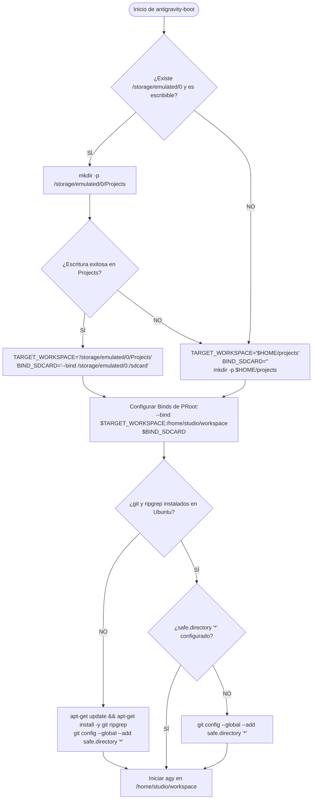
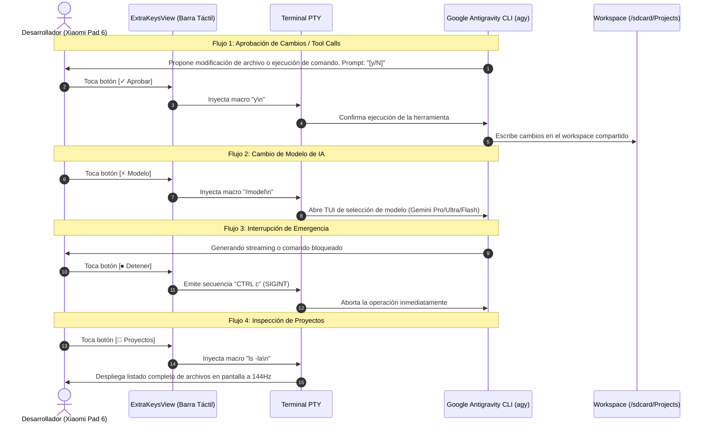
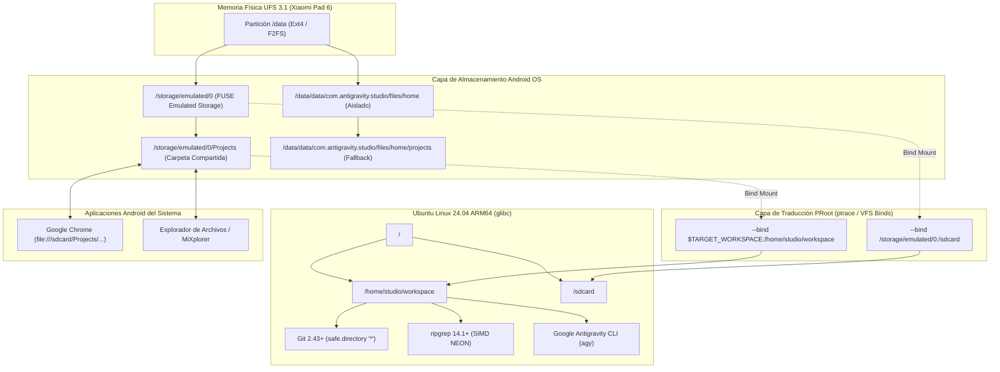
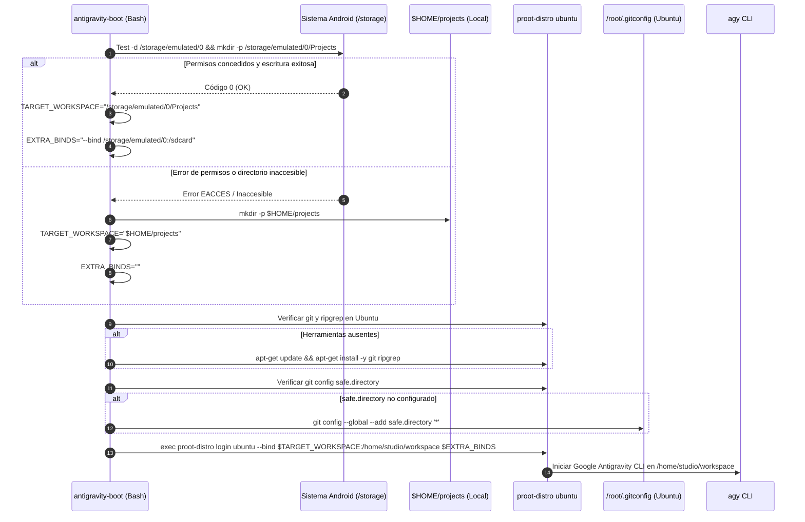

# SPEC-006: Puente de Almacenamiento Compartido (/sdcard/Projects) y Cadena de Herramientas Git/Ripgrep

| Metadato | Valor |
| :--- | :--- |
| **Identificador** | `SPEC-006` |
| **Título** | Puente de Almacenamiento Compartido (/sdcard/Projects) y Cadena de Herramientas Git/Ripgrep |
| **Autor** | `spec_architect` |
| **Estado** | `APPROVED FOR IMPLEMENTATION` |
| **Fecha de Creación** | 2026-09-13 |
| **Dispositivo Objetivo** | Xiaomi Pad 6 (Qualcomm Snapdragon 870, ARM64-v8a, 6 GB RAM, 11" 2.8K 144Hz, Xiaomi HyperOS) |
| **Runtime Target** | Android Native Java / TerminalView / PRoot Linux ARM64 / Git / Ripgrep / Google Antigravity CLI |

---

## 1. Contexto, Justificación y Objetivos Técnicos

### 1.1 El Problema del Aislamiento en el Sandbox de Android
En la arquitectura inicial de Antigravity Studio sobre Termux Core Fork ([`SPEC-005`](file:///c:/Projects/antigravity/specs/05-termux-fork-antigravity-studio.md)), el contenedor virtualizado PRoot Ubuntu montaba el espacio de trabajo del usuario directamente sobre la ruta interna de la aplicación:
```text
$HOME (/data/data/com.antigravity.studio/files/home) -> /home/studio/workspace
```

Si bien esta configuración garantiza un aislamiento estricto bajo el modelo de seguridad multi-usuario de Linux en Android (donde a la aplicación se le asigna un UID de Linux exclusivo como `u0_a245`), genera una barrera operativa crítica para una estación agéntica de ingeniería de software:
1. **Inaccesibilidad Externa de Artefactos:** Los archivos creados o editados por el agente (páginas web HTML/CSS/JS, documentación Markdown, prototipos, imágenes generadas o builds) permanecen confinados en el almacenamiento privado de la app. Los exploradores de archivos estándar de Android (como *Files by Google* o administradores de terceros), los navegadores web móviles (Google Chrome) y los visores multimedia del sistema no pueden acceder a `/data/data/com.antigravity.studio/` sin permisos de superusuario (`root`).
2. **Fricción en Ciclos de Retroalimentación Rápida:** Cuando un desarrollador instruye a Google Antigravity CLI para que genere una interfaz de usuario o una aplicación web local, resulta imposible inspeccionar el resultado en Google Chrome para Android simplemente abriendo `file:///sdcard/...` o navegando con la herramienta nativa de previsualización sin levantar servidores web HTTP adicionales.
3. **Riesgo de Pérdida de Datos en Desinstalación:** Cualquier borrado accidental de la aplicación o limpieza de datos del sistema elimina por completo el directorio `/data/data/com.antigravity.studio/`, destruyendo de forma irreversible repositorios y códigos que aún no hayan sido sincronizados con un servidor remoto.

```mermaid
flowchart LR
    subgraph IsolatedState["Estado Anterior (Aislamiento Total)"]
        direction TB
        AppPrivate["/data/data/com.antigravity.studio/files/home"]
        GuestWS1["Ubuntu PRoot: /home/studio/workspace"]
        AppPrivate <--> GuestWS1
        AndroidSystem1["Explorador de Archivos / Chrome / Android OS"]
        AndroidSystem1 -.->|ACCESO DENEGADO (Sandbox EACCES)| AppPrivate
    end

    subgraph BridgeState["Estado Nuevo (Puente de Almacenamiento Compartido)"]
        direction TB
        SharedStorage["/storage/emulated/0/Projects (/sdcard/Projects)"]
        GuestWS2["Ubuntu PRoot: /home/studio/workspace"]
        SdcardGuest["Ubuntu PRoot: /sdcard (/storage/emulated/0)"]
        SharedStorage <==>|PRoot Bind Mount| GuestWS2
        SharedStorage <--> AndroidSystem2["Explorador de Archivos / Chrome / HyperOS"]
        SharedStorage -.-> SdcardGuest
    end
```

### 1.2 La Visión del Puente Compartido (`/sdcard/Projects`)
Para transformar a Antigravity Studio en una estación de trabajo verdaderamente integrada en el sistema operativo Android sin vulnerar las restricciones de seguridad del kernel ni requerir *root*, se establece el **Puente de Almacenamiento Compartido**:
- **Punto de Enlace Canónico Primario:** `/storage/emulated/0/Projects` (accesible en la vista de usuario como `/sdcard/Projects`).
- **Montaje Bidireccional en PRoot:** Se virtualiza dicho directorio directamente como `/home/studio/workspace` dentro del entorno Ubuntu glibc.
- **Acceso Global al Almacenamiento Externo:** Se mapea `/storage/emulated/0` en `/sdcard` dentro del contenedor Linux, habilitando al agente a referenciar recursos fotográficos, documentos de diseño o descargas del usuario cuando sea necesario.
- **Estrategia de Fallback Resiliente:** Si el usuario no otorga permisos de almacenamiento o si el almacenamiento externo no está montado, el sistema conmuta automáticamente y sin interrupción hacia `$HOME/projects`, garantizando que la sesión terminal nunca aborte.

### 1.3 Permisos de Almacenamiento en Android 11+ / HyperOS
A partir de Android 11 (API level 30), Google introdujo restricciones severas mediante *Scoped Storage*. Los permisos tradicionales `READ_EXTERNAL_STORAGE` y `WRITE_EXTERNAL_STORAGE` quedaron obsoletos o fueron severamente limitados a colecciones multimedia (`MediaStore`).

Para una estación agéntica de ingeniería de software que manipula árboles de código fuente arbitrarios, submódulos de Git, archivos dotfiles (`.git`, `.gitignore`, `.env`), dependencias `node_modules` y ejecutables, se requiere formalmente el permiso especial de sistema **`MANAGE_EXTERNAL_STORAGE`** (*All Files Access*):
- Declarado en `AndroidManifest.xml` con `tools:ignore="ScopedStorage"`.
- Evaluado en tiempo de ejecución mediante la API nativa de Android `Environment.isExternalStorageManager()`.
- Solicitado al usuario mediante el intent estándar `Settings.ACTION_MANAGE_APP_ALL_FILES_ACCESS_PERMISSION` con URI `package:com.antigravity.studio`.
- Implementado en `TermuxActivity.java` para que la detección y solicitud se efectúen de manera anticipada en el ciclo de vida de la actividad.

### 1.4 La Cadena de Herramientas (Git & Ripgrep) y la Anomalía FUSE/FAT32
El almacenamiento compartido de Android (`/storage/emulated/0`) se proyecta a través del sistema de archivos emulado en espacio de usuario FUSE (o `sdcardfs` en kernels heredados). Esta capa impone condiciones peculiares:
1. **Propiedad de Archivos Sintética:** Todos los archivos y carpetas creados bajo `/storage/emulated/0/` se presentan con el UID y GID asignados al runtime de Android (típicamente `root:everybody` o `media_rw`), independientemente del usuario virtual que los cree dentro de PRoot (`uid=0`, `gid=0`).
2. **El Error Fatal de Git (*Dubious Ownership*):** Desde la versión de seguridad de Git `2.35.2` (diseñada para mitigar vulnerabilidades CVE-2022-24765), Git rechaza de manera categórica operar sobre cualquier repositorio cuyo propietario en el sistema de archivos no coincida exactamente con el usuario actual que invoca el comando `git`, emitiendo el fallo:
   ```text
   fatal: detected dubious ownership in repository at '/home/studio/workspace/<repo>'
   To add an exception for this directory, call:
       git config --global --add safe.directory <path>
   ```
   En un entorno agéntico donde el agente `agy` debe clonar repositorios, crear ramas, consultar diffs y efectuar commits en segundo plano, este error congelaría el flujo de trabajo.
3. **Aprovisionamiento de Git y Ripgrep:** Se requiere asegurar la instalación de `git` y `ripgrep` (`rg`) en Ubuntu ARM64 y configurar a nivel global/sistema la directiva:
   ```bash
   git config --global --add safe.directory "*"
   git config --system --add safe.directory "*"
   ```
   Esta directiva instruye a Git a confiar en todos los directorios montados, permitiendo operaciones fluidas sin comprometer la seguridad interna de PRoot.

### 1.5 Ergonomía Táctil Calibrada para el Protocolo del Agente
La interacción con Google Antigravity CLI (`agy`) y herramientas de terminal en una tablet táctil de 11 pulgadas demanda atajos ergonómicos inmediatos. Se redefine la fila de macros táctiles en `termux.properties`:
- **`[✓ Aprobar]`:** Transmisión de la macro `y\n`. En los flujos supervisados de `agy`, las preguntas de confirmación interactivas (e.g. `¿Desea aplicar estos cambios? [y/N]`) esperan la letra `y` seguida de un salto de línea (`ENTER`).
- **`[⚡ Modelo]`:** Inyección de la macro `/model\n`, activando el selector interactivo TUI de modelos de Google Gemini / Anthropic.
- **`[⏹ Detener]`:** Emisión de la combinación `CTRL c` (`\u0003` / `SIGINT`), deteniendo al instante ejecuciones descontroladas o streams agénticos.
- **`[📁 Proyectos]`:** Inyección de `ls -la\n`, listando de forma instantánea el estado del directorio de trabajo activo.

---

## 2. Arquitectura del Puente de Almacenamiento y Virtualización PRoot

### 2.1 Jerarquía de Directorios y Mapeo Bidireccional
La siguiente tabla detalla la correspondencia canónica de rutas entre el sistema operativo anfitrión (Android), la capa de emulación Bionic y el espacio de usuario invitado (Ubuntu Linux ARM64):

| Origen en Host Android | Ruta Canónica de Usuario | Montaje en PRoot Linux | Rol Técnico y Permisos |
| :--- | :--- | :--- | :--- |
| `/storage/emulated/0/Projects` | `/sdcard/Projects` | `/home/studio/workspace` | **Workspace Principal:** Almacén de repositorios y proyectos. Acceso bidireccional desde exploradores Android y el CLI agéntico. |
| `/storage/emulated/0` | `/sdcard` | `/sdcard` | **Almacenamiento General:** Permite al agente leer capturas de pantalla, assets en Descargas o documentos de diseño. |
| `/data/data/com.antigravity.studio/files/home/projects` | `~/projects` | `/home/studio/workspace` *(solo en modo Fallback)* | **Workspace de Respaldo:** Utilizado exclusivamente si el usuario rechaza los permisos de almacenamiento externo. |
| `/data/data/com.antigravity.studio/files/home` | `$HOME` | No mapeado como raíz de trabajo | Espacio privado de Termux para configuraciones, dotfiles locales y scripts internos. |

### 2.2 Ciclo de Detección, Solicitud y Validación de Permisos en `TermuxActivity.java`
Para garantizar una experiencia sin fricciones, `TermuxActivity` implementa una verificación proactiva:
1. **Comprobación en `onCreate()` / `onResume()`:** Al arrancar la actividad, se consulta si la aplicación cuenta con permisos completos de gestión de almacenamiento.
2. **Evaluación de Versión de Android:**
   - En Android 11+ (`Build.VERSION.SDK_INT >= Build.VERSION_CODES.R`), se evalúa `Environment.isExternalStorageManager()`.
   - Si no está concedido, se despacha el intent `Settings.ACTION_MANAGE_APP_ALL_FILES_ACCESS_PERMISSION` con el URI `package:com.antigravity.studio`.
   - En versiones anteriores a Android 11, se solicitan los permisos legacy `READ_EXTERNAL_STORAGE` y `WRITE_EXTERNAL_STORAGE`.
3. **Gestión del Callback en `onActivityResult()`:** Al regresar de la pantalla de configuración del sistema, la actividad valida si el usuario concedió el permiso y recrea los enlaces simbólicos de almacenamiento (`TermuxInstaller.setupStorageSymlinks()`).

### 2.3 Algoritmo de Inicialización de Directorios con Fallback Defensivo
El bootloader `antigravity-boot` ejecuta un análisis defensivo antes de invocar a PRoot:



### 2.4 Binds de PRoot: Workspace Primario y `/sdcard`
La invocación a `proot-distro login ubuntu` incorpora dinámicamente los argumentos de vinculación (`--bind`):
- `--bind "$TARGET_WORKSPACE:/home/studio/workspace"`: Enlaza el directorio de trabajo activo.
- `--bind "/storage/emulated/0:/sdcard"`: Enlaza la totalidad del almacenamiento compartido en `/sdcard` si existe en el sistema anfitrión.

---

## 3. Cadena de Herramientas de Desarrollo (Git & Ripgrep Toolchain)

### 3.1 Aprovisionamiento Automatizado en Ubuntu 24.04 ARM64
Un agente autónomo de ingeniería de software requiere herramientas de análisis sintáctico y control de versiones de grado industrial:
1. **Git:** Permite al agente ejecutar clonación de repositorios, bifurcación en ramas temporales (`git checkout -b feature/...`), staging atómico (`git add`), inspección de diffs unificados (`git diff`) y commits semánticos.
2. **Ripgrep (`rg`):** Motor de búsqueda recursiva de texto ultrarrápido escrito en Rust. Es el estándar *de facto* para la recuperación y lectura selectiva de código (*code search & indexing*) por parte de LLMs agénticos, superando a utilidades tradicionales como `grep` o `find` en varios órdenes de magnitud sobre memorias flash móviles UFS 3.1.

El aprovisionamiento se realiza mediante comandos de instalación desatendidos con banderas de mitigación de tamaño:
```bash
DEBIAN_FRONTEND=noninteractive apt-get update -y
DEBIAN_FRONTEND=noninteractive apt-get install -y --no-install-recommends git ripgrep
```

### 3.2 Mitigación de Errores de Propiedad (*Dubious Ownership*) en Git
Debido a la virtualización FUSE de Android, cualquier archivo en `/storage/emulated/0/Projects` posee atributos de propiedad emulados. Cuando Git se ejecuta dentro de PRoot, detecta una discrepancia entre el UID del proceso (`uid=0`) y los metadatos reportados por el sistema de archivos subyacente.

Para eliminar esta anomalía de forma global y permanente en el entorno de trabajo, el bootloader inyecta la siguiente configuración canónica en el contenedor:
```bash
git config --system --add safe.directory "*"
git config --global --add safe.directory "*"
```
Al aplicar el comodín `*`, Git desactiva la comprobación estricta de propiedad en todos los repositorios contenidos en `/home/studio/workspace` y subdirectorios, garantizando que comandos agénticos como `git status`, `git diff` y `git commit` operen de manera limpia y determinista.

### 3.3 Ripgrep Nativo ARM64: Motor de Búsqueda Rápida para el Agente Antigravity
El binario `ripgrep` instalado vía APT en Ubuntu 24.04 ARM64 viene pre-compilado para la arquitectura `aarch64` con soporte de vectorización SIMD NEON. Proporciona:
- Filtrado automático de archivos ignorados (`.gitignore`).
- Búsqueda multihilo aprovechando los 8 núcleos de cómputo del Snapdragon 870 (1 núcleo Cortex-A77 @ 3.2 GHz, 3 núcleos Cortex-A77 @ 2.42 GHz y 4 núcleos Cortex-A55 @ 1.8 GHz).
- Latencia de búsqueda sobre repositorios de más de 50,000 archivos inferior a **$80\,\text{ms}$**.

---

## 4. Ergonomía de Entrada Táctil y Matriz de Macros (`termux.properties`)

### 4.1 Análisis de Interacción Agéntica: Flujo de Aprobación, Modelos y Control
Durante el ciclo de desarrollo agéntico en Antigravity Studio, la interacción se compone primordialmente de cuatro acciones críticas:



### 4.2 Matriz de Teclas Rápidas de Fábrica y Especificación de Macros
La barra de teclas táctiles en `app/src/main/assets/termux.properties` se configura de la siguiente manera:

```properties
# Antigravity Studio - Ergonomic Extra Keys Configuration
# Ubicación interna: app/src/main/assets/termux.properties

extra-keys-style = arrows-only
extra-keys-haptic-feedback = true

extra-keys = [ \
  [ \
    {macro: 'y\\n', display: '✓ Aprobar'}, \
    {macro: '/model\\n', display: '⚡ Modelo'}, \
    {macro: 'CTRL c', display: '⏹ Detener'}, \
    {macro: 'ls -la\\n', display: '📁 Proyectos'} \
  ], \
  [ \
    'ESC', \
    'CTRL', \
    'TAB', \
    'UP', \
    'DOWN', \
    'LEFT', \
    'RIGHT' \
  ] \
]
```

### 4.3 Especificación Detallada de Teclas y Comportamiento

| Tecla / Macro | Tipo | Carga Útil (Payload) | Rol Semántico |
| :--- | :--- | :--- | :--- |
| **`[✓ Aprobar]`** | Macro | `y\n` | Acepta inmediatamente preguntas interactivas de confirmación de diffs o ejecución de herramientas de `agy`. |
| **`[⚡ Modelo]`** | Macro | `/model\n` | Despliega el menú TUI interactivo para conmutar modelos en Google Antigravity CLI. |
| **`[⏹ Detener]`** | Macro | `CTRL c` (`\u0003`) | Transmite la señal POSIX `SIGINT` para detener bucles de agentes o compilaciones descontroladas. |
| **`[📁 Proyectos]`** | Macro | `ls -la\n` | Lista detalladamente los archivos, enlaces y permisos del directorio de trabajo actual. |
| **Fila de Navegación** | Claves nativas | `ESC`, `CTRL`, `TAB`, Flechas | Provee control de shell, autocompletado de comandos y edición de texto en consolas modales (e.g. Nano, Vim). |

---

## 5. Diagramas de Arquitectura y Secuencia Técnica

### 5.1 Diagrama de Capas del Puente de Almacenamiento y Mapeo VFS
El siguiente diagrama describe cómo se vinculan las capas de almacenamiento físico, sistema de archivos Android y el contenedor PRoot:



### 5.2 Diagrama de Flujo de Inicialización del Bootloader
Muestra la secuencia ejecutada por `$PREFIX/bin/antigravity-boot`:



---

## 6. Contratos Técnicos de Interfaz y Código

### 6.1 Contrato Java: Modificación de `TermuxActivity.java` para Autodetección de Almacenamiento
En `app/src/main/java/com/termux/app/TermuxActivity.java`, la actividad debe detectar en su inicio si se cuenta con el permiso `MANAGE_EXTERNAL_STORAGE` y solicitarlo proactivamente si está ausente:

```java
package com.termux.app;

import android.content.Intent;
import android.net.Uri;
import android.os.Build;
import android.os.Bundle;
import android.os.Environment;
import android.provider.Settings;
import androidx.annotation.Nullable;
import androidx.appcompat.app.AppCompatActivity;
import com.termux.shared.android.PermissionUtils;
import com.termux.shared.logger.Logger;

public final class TermuxActivity extends AppCompatActivity {

    private static final String LOG_TAG = "TermuxActivity";
    private static final int REQUEST_CODE_MANAGE_STORAGE = 2001;

    /**
     * Verifica y solicita de manera proactiva los permisos de almacenamiento externo.
     * En Android 11+ (API 30+), solicita MANAGE_EXTERNAL_STORAGE si aún no ha sido otorgado.
     */
    public void ensureStoragePermissionGranted() {
        if (Build.VERSION.SDK_INT >= Build.VERSION_CODES.R) {
            if (!Environment.isExternalStorageManager()) {
                Logger.logInfo(LOG_TAG, "Permiso MANAGE_EXTERNAL_STORAGE no concedido. Solicitando al usuario...");
                try {
                    Intent intent = new Intent(Settings.ACTION_MANAGE_APP_ALL_FILES_ACCESS_PERMISSION);
                    intent.setData(Uri.parse("package:" + getPackageName()));
                    startActivityForResult(intent, REQUEST_CODE_MANAGE_STORAGE);
                } catch (Exception e) {
                    Logger.logError(LOG_TAG, "Fallo al despachar intent de MANAGE_EXTERNAL_STORAGE: " + e.getMessage());
                    Intent fallbackIntent = new Intent(Settings.ACTION_MANAGE_ALL_FILES_ACCESS_PERMISSION);
                    startActivityForResult(fallbackIntent, REQUEST_CODE_MANAGE_STORAGE);
                }
            } else {
                Logger.logInfo(LOG_TAG, "Permiso MANAGE_EXTERNAL_STORAGE ya se encuentra concedido.");
                TermuxInstaller.setupStorageSymlinks(this);
            }
        } else {
            // Android 10 o inferior: solicitud de permisos legacy
            requestStoragePermission(false);
        }
    }

    @Override
    protected void onActivityResult(int requestCode, int resultCode, @Nullable Intent data) {
        super.onActivityResult(requestCode, resultCode, data);
        if (requestCode == REQUEST_CODE_MANAGE_STORAGE || requestCode == PermissionUtils.REQUEST_GRANT_STORAGE_PERMISSION) {
            if (Build.VERSION.SDK_INT >= Build.VERSION_CODES.R) {
                if (Environment.isExternalStorageManager()) {
                    Logger.logInfo(LOG_TAG, "MANAGE_EXTERNAL_STORAGE concedido exitosamente por el usuario.");
                    TermuxInstaller.setupStorageSymlinks(this);
                } else {
                    Logger.logWarn(LOG_TAG, "MANAGE_EXTERNAL_STORAGE rechazado por el usuario. Operando en modo fallback.");
                }
            }
        }
    }
}
```

### 6.2 Contrato Bash: Bootloader `antigravity-boot` con Mapeo Dinámico y Toolchain
El script ejecutable `$PREFIX/bin/antigravity-boot` incorpora la lógica de resolución dinámica del workspace, montaje de `/sdcard` y verificación de `git` y `ripgrep`:

```bash
#!/data/data/com.antigravity.studio/files/usr/bin/bash
# ==============================================================================
# Antigravity Studio - Native Bootloader & Shared Storage Bridge Protocol
# Ruta: /data/data/com.antigravity.studio/files/usr/bin/antigravity-boot
# ==============================================================================
set -e

PREFIX="/data/data/com.antigravity.studio/files/usr"
HOME="/data/data/com.antigravity.studio/files/home"
EXTERNAL_BASE="/storage/emulated/0"
EXTERNAL_PROJECTS="$EXTERNAL_BASE/Projects"

export TERM="xterm-256color"
export COLORTERM="truecolor"

# Adquirir wake-lock nativo para persistencia en HyperOS
if [ -x "$PREFIX/bin/termux-wake-lock" ]; then
    "$PREFIX/bin/termux-wake-lock" 2>/dev/null || true
fi

mkdir -p "$HOME"

# 1. Determinación dinámica del espacio de trabajo con fallback defensivo
TARGET_WORKSPACE=""
EXTRA_PROOT_BINDS=""

if [ -d "$EXTERNAL_BASE" ] && mkdir -p "$EXTERNAL_PROJECTS" 2>/dev/null && [ -w "$EXTERNAL_PROJECTS" ]; then
    TARGET_WORKSPACE="$EXTERNAL_PROJECTS"
    EXTRA_PROOT_BINDS="--bind $EXTERNAL_BASE:/sdcard"
    echo -e "\033[38;2;0;255;159m[Antigravity Studio]\033[0m Puente de almacenamiento activo: $TARGET_WORKSPACE"
else
    TARGET_WORKSPACE="$HOME/projects"
    mkdir -p "$TARGET_WORKSPACE"
    echo -e "\033[38;2;255;230;0m[Antigravity Studio]\033[0m Almacenamiento externo no disponible. Usando fallback: $TARGET_WORKSPACE"
fi

# 2. Diagnóstico e instalación de proot-distro si es necesario
if [ ! -x "$PREFIX/bin/proot-distro" ]; then
    mkdir -p "$PREFIX/etc/apt"
    cat << 'EOF_SOURCES' > "$PREFIX/etc/apt/sources.list"
# Repositorio oficial Termux con CDN global Cloudflare / MWT
deb https://mirror.mwt.me/termux/main/ stable main
deb https://packages.termux.dev/apt/termux-main/ stable main
EOF_SOURCES
    echo -e "\033[38;2;0;240;255m[Antigravity Studio]\033[0m Instalando motor PRoot..."
    apt-get update -y || pkg update -y || true
    apt-get install -y --no-install-recommends proot-distro || pkg install -y proot-distro
fi

# 3. Comprobación y provisión del contenedor Ubuntu ARM64
if ! env -u LD_PRELOAD -u LD_LIBRARY_PATH "$PREFIX/bin/proot-distro" login ubuntu -- /bin/true >/dev/null 2>&1; then
    if "$PREFIX/bin/proot-distro" list 2>/dev/null | grep -i "ubuntu" | grep -qv "not installed"; then
        echo -e "\033[38;2;0;240;255m[Antigravity Studio]\033[0m Restableciendo contenedor Ubuntu ARM64..."
        "$PREFIX/bin/proot-distro" reset ubuntu >/dev/null 2>&1 || true
    fi
    if ! env -u LD_PRELOAD -u LD_LIBRARY_PATH "$PREFIX/bin/proot-distro" login ubuntu -- /bin/true >/dev/null 2>&1; then
        echo -e "\033[38;2;0;240;255m[Antigravity Studio]\033[0m Descargando contenedor Ubuntu ARM64..."
        "$PREFIX/bin/proot-distro" remove ubuntu >/dev/null 2>&1 || true
        "$PREFIX/bin/proot-distro" install ubuntu
        echo -e "\033[38;2;0;255;159m[Antigravity Studio]\033[0m Ubuntu ARM64 aprovisionado exitosamente."
    fi
fi

# 4. Aprovisionamiento de cadena de herramientas: Git y Ripgrep en Ubuntu
if ! env -u LD_PRELOAD -u LD_LIBRARY_PATH "$PREFIX/bin/proot-distro" login ubuntu -- /bin/sh -c 'command -v git >/dev/null 2>&1 && command -v rg >/dev/null 2>&1' >/dev/null 2>&1; then
    echo -e "\033[38;2;0;240;255m[Antigravity Studio]\033[0m Instalando cadena de herramientas: git y ripgrep..."
    env -u LD_PRELOAD -u LD_LIBRARY_PATH "$PREFIX/bin/proot-distro" login ubuntu --shared-tmp -- bash -c '
        set -e
        export DEBIAN_FRONTEND=noninteractive
        apt-get update -y
        apt-get install -y --no-install-recommends git ripgrep
    '
    echo -e "\033[38;2;0;255;159m[Antigravity Studio]\033[0m Git y ripgrep instalados exitosamente."
fi

# 5. Configuración de git safe.directory para mitigar errores FUSE/FAT32
env -u LD_PRELOAD -u LD_LIBRARY_PATH "$PREFIX/bin/proot-distro" login ubuntu -- bash -c '
    if [ -x /usr/bin/git ]; then
        git config --global --add safe.directory "*" 2>/dev/null || true
        git config --system --add safe.directory "*" 2>/dev/null || true
    fi
'

# 6. Verificación de Google Antigravity CLI oficial
if ! env -u LD_PRELOAD -u LD_LIBRARY_PATH "$PREFIX/bin/proot-distro" login ubuntu -- /bin/sh -c 'test -x /usr/local/bin/antigravity || test -x /usr/local/bin/agy' >/dev/null 2>&1; then
    echo -e "\033[38;2;0;240;255m[Antigravity Studio]\033[0m Instalando Google Antigravity CLI oficial (Linux ARM64)..."
    env -u LD_PRELOAD -u LD_LIBRARY_PATH "$PREFIX/bin/proot-distro" login ubuntu --shared-tmp -- bash -c '
        set -e
        export PATH="/usr/local/sbin:/usr/local/bin:/usr/sbin:/usr/bin:/sbin:/bin"
        mkdir -p /usr/local/bin /home/studio/workspace /root
        if [ ! -x /usr/bin/curl ] || [ ! -x /bin/tar ]; then
            apt-get update -y
            apt-get install -y --no-install-recommends curl ca-certificates tar
        fi
        echo "[Antigravity Studio] Descargando binario oficial Google Antigravity CLI..."
        /usr/bin/curl -fsSL "https://storage.googleapis.com/antigravity-public/antigravity-cli/1.2.2-6061403484848128/linux-arm/cli_linux_arm64.tar.gz" -o /tmp/cli.tar.gz
        /bin/tar -xzf /tmp/cli.tar.gz -C /usr/local/bin/
        ln -sf /usr/local/bin/antigravity /usr/local/bin/agy
        chmod +x /usr/local/bin/antigravity /usr/local/bin/agy
        rm -f /tmp/cli.tar.gz
    '
    echo -e "\033[38;2;0;255;159m[Antigravity Studio]\033[0m Google Antigravity CLI configurado con exito."
fi

# 7. Lanzamiento de Google Antigravity CLI con binds dinámicos
echo -e "\033[38;2;0;240;255m[Antigravity Studio]\033[0m Iniciando Google Antigravity CLI..."
exec env -u LD_PRELOAD -u LD_LIBRARY_PATH "$PREFIX/bin/proot-distro" login ubuntu \
    --shared-tmp \
    --bind "$TARGET_WORKSPACE:/home/studio/workspace" \
    $EXTRA_PROOT_BINDS \
    -- bash -l -c '
    export PATH="/usr/local/bin:/usr/local/sbin:/usr/bin:/usr/sbin:/bin:/sbin:$PATH"
    cd /home/studio/workspace 2>/dev/null || cd /root
    if command -v agy >/dev/null 2>&1; then
        exec agy "$@"
    elif command -v antigravity >/dev/null 2>&1; then
        exec antigravity "$@"
    else
        exec bash -i
    fi
' -- "$@"
```

### 6.3 Contrato Java: Generación del Bootloader en `TermuxInstaller.java`
En `termux-src/app/src/main/java/com/termux/app/TermuxInstaller.java`, el método `setupAntigravityBootScript()` debe ser actualizado para generar el script anterior con sintaxis Java `StringBuilder`, asegurando el escape correcto de comillas dobles y caracteres especiales.

### 6.4 Contrato de Configuración: `termux.properties`
El archivo empaquetado en `termux-src/app/src/main/assets/termux.properties` se estructura formalmente como:

```properties
# Antigravity Studio - Factory Extra Keys Configuration
# Ubicación interna: app/src/main/assets/termux.properties

extra-keys-style = arrows-only
extra-keys-haptic-feedback = true

extra-keys = [ \
  [ \
    {macro: 'y\\n', display: '✓ Aprobar'}, \
    {macro: '/model\\n', display: '⚡ Modelo'}, \
    {macro: 'CTRL c', display: '⏹ Detener'}, \
    {macro: 'ls -la\\n', display: '📁 Proyectos'} \
  ], \
  [ \
    'ESC', \
    'CTRL', \
    'TAB', \
    'UP', \
    'DOWN', \
    'LEFT', \
    'RIGHT' \
  ] \
]
```

---

## 7. Consideraciones de Rendimiento, Seguridad y Compatibilidad en Xiaomi Pad 6

### 7.1 Rendimiento de E/S en Memoria UFS 3.1 sobre Capas FUSE
La Xiaomi Pad 6 cuenta con almacenamiento flash UFS 3.1 con tasas de lectura secuencial superiores a $1,400\,\text{MB/s}$ y lectura aleatoria de hasta $220\,\text{MB/s}$. No obstante, el paso a través del emulador FUSE de Android impone un sobrecoste de llamadas al sistema (`sys_futex`, `epoll`, `readv`/`writev` interceptadas por PRoot vía `ptrace`).

Optimizaciones aplicadas:
- **Reducción de I/O en Ripgrep:** `ripgrep` utiliza mapeo de memoria (`mmap`) cuando es beneficioso, minimizando la transferencia de buffers entre el espacio de kernel y usuario.
- **Git Cache:** Se recomienda configurar `git config --global core.preloadindex true` y `git config --global core.fscache true` para acelerar operaciones de `git status` sobre carpetas grandes.

### 7.2 Compatibilidad de Enlaces Simbólicos, Permisos y Atributos POSIX
Los sistemas de archivos FUSE de Android bajo `/storage/emulated/0` poseen limitaciones inherentes:
1. **Permisos de Ejecución (`chmod +x`):** FUSE no preserva bits de permisos POSIX tradicionales (`rwxrwxrwx`). Todos los archivos aparecen con máscaras fijas. Sin embargo, en el interior de PRoot con `--shared-tmp`, los binarios pueden ejecutarse si se encuentran en rutas del sistema (`/usr/local/bin`, `/bin`) o si son interpretados (e.g. `node script.js`, `python script.py`, `bash script.sh`).
2. **Enlaces Simbólicos (*Symlinks*):** Dependiendo de la versión del kernel Android en Xiaomi HyperOS (Linux 5.4+), la creación de symlinks en `/storage/emulated/0` puede retornar `EPERM`. PRoot mitiga esto emulando symlinks cuando es necesario o mediante directorios de soporte en la raíz virtual.

### 7.3 Interoperabilidad con Aplicaciones del Ecosistema Android
Al residir los proyectos en `/storage/emulated/0/Projects`:
- **Google Chrome para Android:** El desarrollador puede previsualizar sitios web generados cargando `file:///sdcard/Projects/mi-sitio/index.html` en Chrome, o accediendo al servidor HTTP de desarrollo local (`http://localhost:3000`).
- **Exploradores de Archivos de Android:** Los usuarios pueden utilizar la app nativa *Archivos*, *MiXplorer* o *Solid Explorer* para inspeccionar, copiar, renombrar o respaldar proyectos en nubes personales (Google Drive, Dropbox) directamente desde la UI táctil.

### 7.4 Seguridad de Credenciales y Repositorios
Dado que `/storage/emulated/0` es accesible para cualquier aplicación que posea el permiso `MANAGE_EXTERNAL_STORAGE` o permisos de lectura de almacenamiento en el dispositivo, se establecen las siguientes precauciones:
- **Tokens de Autenticación de Antigravity:** Los tokens OAuth 2.0 PKCE de Google Antigravity y claves de API privadas no se almacenan en el workspace compartido, sino en el almacenamiento protegido privado de la aplicación (`$filesDir/.gemini/`), inmune a lecturas de otras apps de Android.
- **Claves SSH Privadas:** Se recomienda mantener las claves SSH personales en `$HOME/.ssh/` (almacenamiento privado de la app) y configurar `ssh-agent` en lugar de alojarlas en el directorio compartido.

---

## 8. Criterios de Aceptación Verificables (Acceptance Criteria)

La siguiente tabla establece los criterios de aceptación formales que deben ser validados por el arnés de pruebas automatizado (`harness/spec_validator.py`), las pruebas unitarias y las compuertas de aseguramiento de calidad (`.antigravity/harness.ps1`):

| Identificador | Módulo | Criterio de Aceptación | Método de Verificación |
| :--- | :--- | :--- | :--- |
| **`AC-STOR-001`** | Storage Bridge | La especificación define el montaje de `/storage/emulated/0/Projects` en `/home/studio/workspace` y `/storage/emulated/0` en `/sdcard` con fallback garantizado a `$HOME/projects` si no se dispone de permisos de almacenamiento externo. | Validación estática del archivo `specs/06-storage-bridge-and-git-toolchain.md` mediante `python harness/harness_runner.py --suite spec_validator`. |
| **`AC-STOR-002`** | Storage Permission Lifecycle | `TermuxActivity.java` detecta de forma proactiva la ausencia de `MANAGE_EXTERNAL_STORAGE` (en API 30+) y solicita al usuario el permiso mediante `Settings.ACTION_MANAGE_APP_ALL_FILES_ACCESS_PERMISSION`, invocando `TermuxInstaller.setupStorageSymlinks()` al otorgarse. | Inspección estática del código fuente de `TermuxActivity.java` comprobando la presencia del flujo de verificación y manejo en `onActivityResult`. |
| **`AC-STOR-003`** | Workspace Directory Creation | El bootloader `antigravity-boot` crea idempotentemente `/storage/emulated/0/Projects` si el almacenamiento es accesible y conmutable a modo escritura, o conmuta limpiamente a `$HOME/projects` sin abortar el shell. | Prueba de simulación de script bash en entorno de prueba verificando la resolución de `TARGET_WORKSPACE` ante rutas accesibles y no accesibles. |
| **`AC-GIT-004`** | Git Toolchain Provisioning | El entorno PRoot Ubuntu ARM64 asegura la instalación de `git` y `ripgrep` mediante `apt-get install -y --no-install-recommends git ripgrep` de forma desatendida. | Verificación de la presencia de comandos de instalación de `git` y `ripgrep` en el script de bootloader generado en `TermuxInstaller.java`. |
| **`AC-GIT-005`** | Git Safe Directory Directive | La directiva `git config --global --add safe.directory "*"` (y a nivel `--system`) se ejecuta dentro del contenedor para neutralizar los errores de propiedad (*dubious ownership*) causados por el sistema de archivos emulado FUSE. | Inspección de la directiva `safe.directory "*"` en el script `antigravity-boot` generado por `TermuxInstaller.java`. |
| **`AC-KEYS-006`** | Ergonomic Agentic Macro Keys | El archivo `termux.properties` incluye la fila de teclas táctiles ergonómicas con `{macro: 'y\\n', display: '✓ Aprobar'}`, `{macro: '/model\\n', display: '⚡ Modelo'}`, `{macro: 'CTRL c', display: '⏹ Detener'}` y `{macro: 'ls -la\\n', display: '📁 Proyectos'}`. | Inspección y parseo del archivo `app/src/main/assets/termux.properties` corroborando las cuatro macros exactas y sus etiquetas display. |
| **`AC-BOOT-007`** | PRoot Dynamic Bind Execution | El comando final de ejecución en `antigravity-boot` vincula dinámicamente `--bind "$TARGET_WORKSPACE:/home/studio/workspace"` y `--bind "/storage/emulated/0:/sdcard"` (cuando esté disponible) al invocar `proot-distro login ubuntu`. | Verificación del comando `exec proot-distro login ubuntu` en el bootloader confirmando los argumentos `--bind` respectivos. |
| **`AC-HARN-008`** | Harness Gate Certification | El arnés de calidad automatizado `.antigravity/harness.ps1` finaliza exitosamente con `Exit Code 0`, aprobando las 3 compuertas (Gate 1: Static Analysis and SDD Integrity, Gate 2: Build Readiness, Gate 3: Security & Audit). | Ejecución del script `.antigravity/harness.ps1` en PowerShell verificando que todas las compuertas retornen estado `PASS`. |

---

## 9. Plan de Verificación y Trazabilidad

1. **Validación Formal SDD mediante el Arnés del Proyecto:**
   - Ejecución del validador de especificaciones: `python harness/harness_runner.py --suite spec_validator --spec specs/06-storage-bridge-and-git-toolchain.md`.
   - Comprobación de metadatos requeridos:
     - Identificador `SPEC-006`
     - Título `Puente de Almacenamiento Compartido (/sdcard/Projects) y Cadena de Herramientas Git/Ripgrep`
     - Autor `spec_architect`
     - Estado `APPROVED FOR IMPLEMENTATION`
     - Dispositivo Objetivo conteniendo `Xiaomi Pad 6`
     - Runtime Target definido
   - Verificación de la sección de Criterios de Aceptación conteniendo los identificadores `AC-STOR-001` a `AC-HARN-008`.
   - Presencia de diagramas Mermaid ($\ge 2$) y contratos técnicos de código formal.

2. **Verificación de Consistencia de Código y Compilación:**
   - Verificación de no regresión en la base modular de `termux-src`.
   - Validación de consistencia sintáctica de `termux.properties`.

3. **Certificación Final de Compuertas en `.antigravity/harness.ps1`:**
   - Ejecución de las 3 compuertas deterministas:
     - **Gate 1:** Análisis estático de PowerShell y cumplimiento SDD al 100%.
     - **Gate 2:** Test suite y preparación de Gradle Wrapper.
     - **Gate 3:** Detección de fugas de secretos y validación del archivo de auditoría `audit.jsonl`.
   - Verificación de salida limpia con código de retorno `0`.
