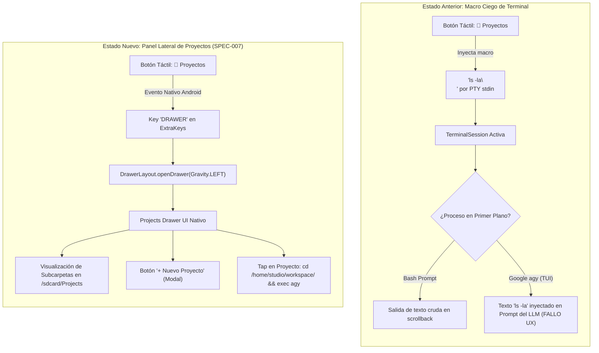
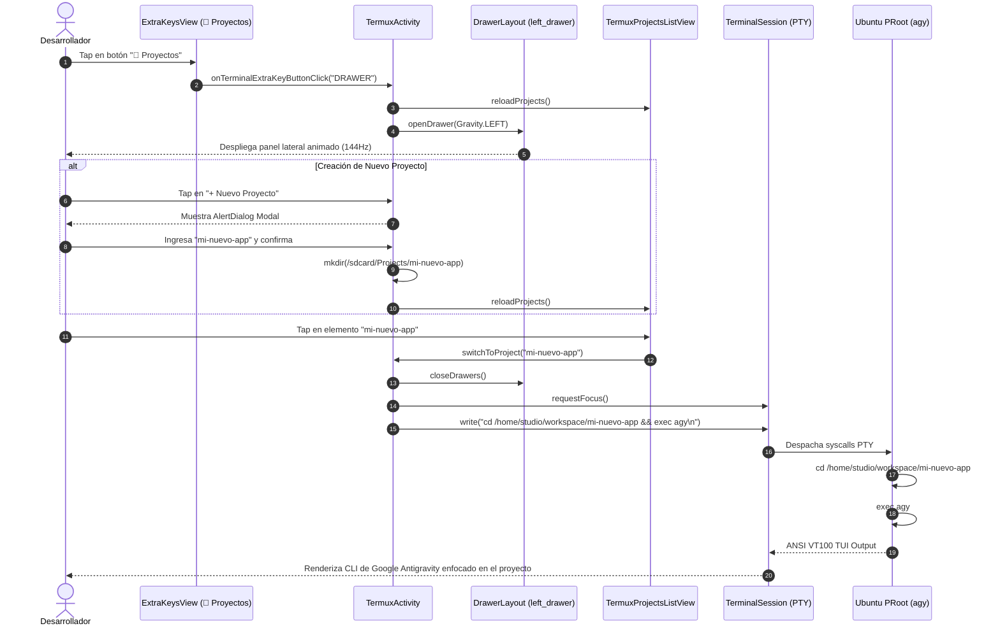

# SPEC-007: Panel Lateral Nativo de Gestión de Proyectos (Projects Drawer) y Mapeo Táctil

| Metadato | Valor |
| :--- | :--- |
| **Identificador** | `SPEC-007` |
| **Título** | Panel Lateral Nativo de Gestión de Proyectos (Projects Drawer) y Mapeo Táctil |
| **Autor** | `spec_architect` |
| **Estado** | `APPROVED FOR IMPLEMENTATION` |
| **Fecha de Creación** | 2026-09-13 |
| **Dispositivo Objetivo** | Xiaomi Pad 6 (Qualcomm Snapdragon 870, ARM64-v8a, 6 GB RAM, 11" 2.8K 144Hz, Xiaomi HyperOS) |
| **Runtime Target** | Android Native Java / Material Components / DrawerLayout / TerminalView / PRoot Linux ARM64 / Google Antigravity CLI (`agy`) |

---

## 1. Contexto, Justificación y Objetivos Técnicos

### 1.1 El Problema del Macro de Texto Plano vs Interfaz TUI de `agy`
En las especificaciones previas ([`SPEC-005`](file:///c:/Projects/antigravity/specs/05-termux-fork-antigravity-studio.md) y [`SPEC-006`](file:///c:/Projects/antigravity/specs/06-storage-bridge-and-git-toolchain.md)), la barra superior de macros táctiles (`extra-keys` en `termux.properties`) incluía un botón de acceso directo etiquetado como `📁 Proyectos` configurado de la siguiente manera:

```properties
{macro: 'ls -la\\n', display: '📁 Proyectos'}
```

Si bien esta macro resulta funcional cuando el usuario se encuentra pasivamente en el intérprete de comandos bash de Ubuntu, presenta fallos de usabilidad y diseño arquitectónico críticos:

1. **Incompatibilidad con la TUI de Google Antigravity CLI:** Cuando la terminal ejecuta el agente interactivo `agy` (cuya interfaz de texto enriquecida captura todo el flujo de entrada estándar `stdin`), la inyección ciega de los caracteres ASCII `ls -la\n` no lista proyectos. En su lugar, el texto se inyecta directamente en la caja de prompt del LLM o es descartado como comando desconocido, desconcertando al desarrollador.
2. **Carencia de Capacidades de Navegación y Creación:** Un comando `ls` estático en terminal no ofrece affordance táctil para cambiar de espacio de trabajo, inspeccionar metadatos de repositorios o inicializar nuevos proyectos sin digitar secuencias complejas (`mkdir`, `cd`, `git init`).
3. **Desaprovechamiento de la Infraestructura Nativa de Android:** La base de código de Termux ya incorpora un contenedor deslizante de grado de producción (`androidx.drawerlayout.widget.DrawerLayout`), pero su uso estaba restringido a listar sesiones terminales anónimas (`[1]`, `[2]`), ignorando los directorios de código persistidos en el almacenamiento compartido de la tablet (`/storage/emulated/0/Projects`).



### 1.2 La Visión del Panel Lateral Nativo de Gestión de Proyectos
La presente especificación redefine el rol del panel lateral deslizante de Android (`left_drawer`) para transformarlo en el **Centro de Comando de Proyectos y Sesiones de Antigravity Studio**:
- **Apertura Táctil Instantánea:** La tecla táctil `📁 Proyectos` se enlaza directamente a la acción nativa `DRAWER`, abriendo o cerrando suavemente el panel con aceleración por hardware a 144Hz en la Xiaomi Pad 6.
- **Explorador Visual de Espacios de Trabajo:** Escaneo dinámico y en tiempo real del directorio `/storage/emulated/0/Projects` (con fallback transparente a `$HOME/projects`), presentando los proyectos como tarjetas interactivas con indicadores de repositorio Git.
- **Creación Asistida sin Salir de la UI:** Modal nativo para crear nuevos espacios de trabajo respetando restricciones de nomenclatura POSIX/FUSE.
- **Conmutación Agéntica Fluida:** Al pulsar un proyecto, el sistema enfoca la terminal y conmuta el directorio activo dentro del entorno virtualizado PRoot:
  ```bash
  cd /home/studio/workspace/<nombre-proyecto> && exec agy
  ```

---

## 2. Mapeo y Despacho del Atajo Táctil en `termux.properties`

### 2.1 Reemplazo Contractual de la Clave
Se modifica el archivo de configuración de fábrica `termux-src/app/src/main/assets/termux.properties`. El campo `{macro: 'ls -la\\n', display: '📁 Proyectos'}` se reemplaza de forma mandatoria por `{key: 'DRAWER', display: '📁 Proyectos'}`.

```properties
# Antigravity Studio - Factory Extra Keys Configuration
# Ubicación: app/src/main/assets/termux.properties

extra-keys-style = arrows-only
extra-keys-haptic-feedback = true

extra-keys = [ \
  [ \
    {macro: 'y\\n', display: '✓ Aprobar'}, \
    {macro: '/model\\n', display: '⚡ Modelo'}, \
    {macro: 'CTRL c', display: '⏹ Detener'}, \
    {key: 'DRAWER', display: '📁 Proyectos'} \
  ], \
  [ \
    'ESC', \
    'CTRL', \
    'TAB', \
    'UP', \
    'DOWN', \
    'LEFT', \
    'RIGHT' \
  ] \
]
```

### 2.2 Flujo de Despacho de Eventos en `TermuxTerminalExtraKeys.java`
El motor de botones táctiles (`ExtraKeysView`) decodifica el JSON de configuración en objetos `ExtraKeyButton`. Cuando el usuario pulsa `📁 Proyectos`:
1. `ExtraKeysView` despacha el callback `onTerminalExtraKeyButtonClick(View view, String key, ...)`.
2. Se evalúa la condición `"DRAWER".equals(key)`.
3. Se obtiene la referencia singleton a `TermuxActivity` mediante `mTermuxTerminalViewClient.getActivity()`.
4. Se ejecuta el toggle sobre el `DrawerLayout`:
   - Si el drawer está abierto (`isDrawerOpen(Gravity.LEFT)` o `GravityCompat.START`), se invoca `closeDrawer(Gravity.LEFT)`.
   - Si está cerrado, se actualiza el listado de proyectos y se invoca `openDrawer(Gravity.LEFT)`.

```java
// Contrato en TermuxTerminalExtraKeys.java
@SuppressLint("RtlHardcoded")
@Override
public void onTerminalExtraKeyButtonClick(View view, String key, boolean ctrlDown, boolean altDown, boolean shiftDown, boolean fnDown) {
    if ("KEYBOARD".equals(key)) {
        if (mTermuxTerminalViewClient != null)
            mTermuxTerminalViewClient.onToggleSoftKeyboardRequest();
    } else if ("DRAWER".equals(key)) {
        DrawerLayout drawerLayout = mTermuxTerminalViewClient.getActivity().getDrawer();
        if (drawerLayout != null) {
            if (drawerLayout.isDrawerOpen(Gravity.LEFT)) {
                drawerLayout.closeDrawer(Gravity.LEFT);
            } else {
                // Notificar refresco de proyectos antes de abrir
                mTermuxTerminalViewClient.getActivity().refreshProjectsList();
                drawerLayout.openDrawer(Gravity.LEFT);
            }
        }
    } else if ("PASTE".equals(key)) {
        if (mTermuxTerminalSessionActivityClient != null)
            mTermuxTerminalSessionActivityClient.onPasteTextFromClipboard(null);
    } else if ("SCROLL".equals(key)) {
        TerminalView terminalView = mTermuxTerminalViewClient.getActivity().getTerminalView();
        if (terminalView != null && terminalView.mEmulator != null)
            terminalView.mEmulator.toggleAutoScrollDisabled();
    } else {
        super.onTerminalExtraKeyButtonClick(view, key, ctrlDown, altDown, shiftDown, fnDown);
    }
}
```

---

## 3. Arquitectura y Contratos de UI del Drawer Lateral

### 3.1 Anatomía del `left_drawer` Rediseñado
El panel lateral se amplía de 240dp a **300dp** para acomodar nombres de proyectos largos y botones con áreas táctiles mínimas de $48 \times 48\,\text{dp}$ de acuerdo con las especificaciones de accesibilidad de Material Design para tablets.

```
+-------------------------------------------------------------+
| [left_drawer] (Width: 300dp, Theme: Dark #161B22)           |
+-------------------------------------------------------------+
| HEADER DE PROYECTOS                                         |
|  📁 Proyectos Antigravity             [+ Nuevo]  [⚙ Settings]
+-------------------------------------------------------------+
| LISTA DE PROYECTOS (/sdcard/Projects)                       |
|  📁 mi-proyecto-web                [Git: main]              |
|  📁 backend-api                    [Git: dev]               |
|  📁 ml-experiments                 [Local]                  |
|  📁 docs-agente                    [Git: main]              |
|  (Scroll vertical independiente)                            |
+-------------------------------------------------------------+
| SEPARADOR / HEADER DE SESIONES TERMINAL                     |
|  💻 Sesiones Abiertas                                       |
+-------------------------------------------------------------+
| LISTA DE SESIONES ACTIVAS                                   |
|  [1] bash (pid: 12450)                                      |
|  [2] agy (pid: 12890)                                       |
+-------------------------------------------------------------+
| BARRA INFERIOR DE ACCIONES RÁPIDAS                          |
|  [⌨ Teclado]                        [+ Nueva Sesión]        |
+-------------------------------------------------------------+
```

### 3.2 Contrato de Layout en `termux-src/app/src/main/res/layout/activity_termux.xml`
El elemento `LinearLayout` con `id="@+id/left_drawer"` se actualiza con la siguiente jerarquía de vistas estructurada:

```xml
<androidx.drawerlayout.widget.DrawerLayout
    android:id="@+id/drawer_layout"
    android:layout_width="match_parent"
    android:layout_alignParentTop="true"
    android:layout_above="@+id/terminal_toolbar_view_pager"
    android:layout_height="match_parent">

    <!-- Vista Principal de Terminal -->
    <com.termux.view.TerminalView
        android:id="@+id/terminal_view"
        android:layout_width="match_parent"
        android:layout_height="match_parent"
        android:defaultFocusHighlightEnabled="false"
        android:focusableInTouchMode="true"
        android:scrollbarThumbVertical="@drawable/terminal_scroll_shape"
        android:scrollbars="vertical"
        tools:ignore="UnusedAttribute" />

    <!-- Panel Lateral Deslizante (left_drawer) -->
    <LinearLayout
        android:id="@+id/left_drawer"
        android:layout_width="300dp"
        android:layout_height="match_parent"
        android:layout_gravity="start"
        android:choiceMode="singleChoice"
        android:divider="@android:color/transparent"
        android:dividerHeight="0dp"
        android:descendantFocusability="afterDescendants"
        android:orientation="vertical"
        android:background="?attr/termuxActivityDrawerBackground">

        <!-- 1. Header de Sección: Proyectos y Controles Rápidos -->
        <LinearLayout
            android:layout_width="match_parent"
            android:layout_height="56dp"
            android:orientation="horizontal"
            android:gravity="center_vertical"
            android:paddingHorizontal="16dp"
            android:background="#161B22">

            <TextView
                android:layout_width="0dp"
                android:layout_height="wrap_content"
                android:layout_weight="1"
                android:text="@string/drawer_title_projects"
                android:textColor="#FFFFFF"
                android:textSize="18sp"
                android:textStyle="bold" />

            <ImageButton
                android:id="@+id/btn_new_project"
                android:layout_width="40dp"
                android:layout_height="40dp"
                android:src="@drawable/ic_add_box"
                android:background="?attr/selectableItemBackgroundBorderless"
                android:contentDescription="@string/action_new_project"
                app:tint="?attr/termuxActivityDrawerImageTint" />

            <ImageButton
                android:id="@+id/settings_button"
                android:layout_width="40dp"
                android:layout_height="40dp"
                android:src="@drawable/ic_settings"
                android:background="?attr/selectableItemBackgroundBorderless"
                android:contentDescription="@string/action_open_settings"
                app:tint="?attr/termuxActivityDrawerImageTint" />
        </LinearLayout>

        <!-- 2. Lista de Proyectos Dinámicos -->
        <ListView
            android:id="@+id/projects_list_view"
            android:layout_width="match_parent"
            android:layout_height="0dp"
            android:layout_weight="3"
            android:choiceMode="singleChoice"
            android:divider="#21262D"
            android:dividerHeight="1dp" />

        <!-- 3. Encabezado de Sesiones Activas -->
        <LinearLayout
            android:layout_width="match_parent"
            android:layout_height="36dp"
            android:gravity="center_vertical"
            android:paddingHorizontal="16dp"
            android:background="#0D1117">

            <TextView
                android:layout_width="match_parent"
                android:layout_height="wrap_content"
                android:text="@string/drawer_title_sessions"
                android:textColor="#8B949E"
                android:textSize="12sp"
                android:textStyle="bold"
                android:textAllCaps="true" />
        </LinearLayout>

        <!-- 4. Lista de Sesiones Terminales -->
        <ListView
            android:id="@+id/terminal_sessions_list"
            android:layout_width="match_parent"
            android:layout_height="0dp"
            android:layout_weight="2"
            android:choiceMode="singleChoice"
            android:divider="#21262D"
            android:dividerHeight="1dp"
            android:longClickable="true" />

        <!-- 5. Barra Inferior de Acciones de Sesión -->
        <LinearLayout
            style="?android:attr/buttonBarStyle"
            android:layout_width="match_parent"
            android:layout_height="wrap_content"
            android:padding="8dp"
            android:orientation="horizontal"
            android:background="#161B22">

            <com.google.android.material.button.MaterialButton
                android:id="@+id/toggle_keyboard_button"
                style="?android:attr/buttonBarButtonStyle"
                android:layout_width="0dp"
                android:layout_height="wrap_content"
                android:layout_weight="1"
                android:text="@string/action_toggle_soft_keyboard" />

            <com.google.android.material.button.MaterialButton
                android:id="@+id/new_session_button"
                style="?android:attr/buttonBarButtonStyle"
                android:layout_width="0dp"
                android:layout_height="wrap_content"
                android:layout_weight="1"
                android:text="@string/action_new_session" />
        </LinearLayout>
    </LinearLayout>

</androidx.drawerlayout.widget.DrawerLayout>
```

### 3.3 Layout de Elemento de Proyecto: `item_project_list.xml`
Se define el archivo de diseño para cada fila de la lista de proyectos en `res/layout/item_project_list.xml`:

```xml
<?xml version="1.0" encoding="utf-8"?>
<LinearLayout xmlns:android="http://schemas.android.com/apk/res/android"
    xmlns:app="http://schemas.android.com/apk/res-auto"
    android:layout_width="match_parent"
    android:layout_height="52dp"
    android:orientation="horizontal"
    android:gravity="center_vertical"
    android:paddingHorizontal="16dp"
    android:background="@drawable/session_background_selected">

    <ImageView
        android:id="@+id/project_icon"
        android:layout_width="24dp"
        android:layout_height="24dp"
        android:src="@drawable/ic_folder"
        android:contentDescription="@null"
        app:tint="#58A6FF" />

    <LinearLayout
        android:layout_width="0dp"
        android:layout_height="wrap_content"
        android:layout_weight="1"
        android:orientation="vertical"
        android:paddingStart="12dp"
        android:paddingEnd="8dp">

        <TextView
            android:id="@+id/project_name"
            android:layout_width="match_parent"
            android:layout_height="wrap_content"
            android:textSize="15sp"
            android:textColor="#C9D1D9"
            android:singleLine="true"
            android:ellipsize="end"
            android:textStyle="normal" />

        <TextView
            android:id="@+id/project_details"
            android:layout_width="match_parent"
            android:layout_height="wrap_content"
            android:textSize="11sp"
            android:textColor="#8B949E"
            android:singleLine="true" />
    </LinearLayout>

    <TextView
        android:id="@+id/project_git_badge"
        android:layout_width="wrap_content"
        android:layout_height="wrap_content"
        android:paddingHorizontal="6dp"
        android:paddingVertical="2dp"
        android:text="GIT"
        android:textSize="10sp"
        android:textColor="#3FB950"
        android:background="@drawable/bg_git_badge"
        android:visibility="gone" />

</LinearLayout>
```

---

## 4. Modelo de Datos y Escaneo en Tiempo Real de Proyectos

### 4.1 Entidad `ProjectItem`
Estructura POJO pura para encapsular la información técnica de cada espacio de trabajo detectado:

```java
package com.termux.app.models;

import java.io.File;

public final class ProjectItem {
    private final String mName;
    private final String mAbsolutePath;
    private final boolean mIsGitRepository;
    private final long mLastModified;

    public ProjectItem(File directory) {
        this.mName = directory.getName();
        this.mAbsolutePath = directory.getAbsolutePath();
        this.mLastModified = directory.lastModified();
        File gitDir = new File(directory, ".git");
        this.mIsGitRepository = gitDir.exists() && gitDir.isDirectory();
    }

    public String getName() { return mName; }
    public String getAbsolutePath() { return mAbsolutePath; }
    public boolean isGitRepository() { return mIsGitRepository; }
    public long getLastModified() { return mLastModified; }
}
```

### 4.2 Algoritmo de Detección de Raíz de Proyectos (Storage Detection & Fallback)
El sistema aplica la jerarquía formal de directorios establecida en `SPEC-006`:

```java
public static File getProjectsRootDirectory(Context context) {
    File primary = new File("/storage/emulated/0/Projects");
    if (primary.exists() && primary.canRead() && primary.canWrite()) {
        return primary;
    }
    // Intentar crearlo si el almacenamiento externo está montado
    if (Environment.MEDIA_MOUNTED.equals(Environment.getExternalStorageState())) {
        try {
            if (primary.mkdirs() || primary.isDirectory()) {
                return primary;
            }
        } catch (SecurityException ignored) {
        }
    }
    // Fallback defensivo a espacio privado de la app
    File fallback = new File(context.getFilesDir(), "home/projects");
    if (!fallback.exists()) {
        fallback.mkdirs();
    }
    return fallback;
}
```

### 4.3 Adaptador `TermuxProjectsListViewController`
Controlador que gestiona el renderizado y los eventos de clic sobre la lista de proyectos:

```java
package com.termux.app.terminal;

import android.content.Context;
import android.view.LayoutInflater;
import android.view.View;
import android.view.ViewGroup;
import android.widget.AdapterView;
import android.widget.ArrayAdapter;
import android.widget.ImageView;
import android.widget.TextView;

import androidx.annotation.NonNull;

import com.termux.R;
import com.termux.app.TermuxActivity;
import com.termux.app.models.ProjectItem;

import java.io.File;
import java.text.SimpleDateFormat;
import java.util.ArrayList;
import java.util.Arrays;
import java.util.Date;
import java.util.List;
import java.util.Locale;

public class TermuxProjectsListViewController extends ArrayAdapter<ProjectItem> 
    implements AdapterView.OnItemClickListener {

    private final TermuxActivity mActivity;
    private final SimpleDateFormat mDateFormat = new SimpleDateFormat("yyyy-MM-dd HH:mm", Locale.US);

    public TermuxProjectsListViewController(TermuxActivity activity) {
        super(activity.getApplicationContext(), R.layout.item_project_list, new ArrayList<>());
        this.mActivity = activity;
    }

    public void reloadProjects() {
        clear();
        File root = TermuxProjectsListViewController.getProjectsRootDirectory(mActivity);
        File[] subdirs = root.listFiles(File::isDirectory);
        if (subdirs != null) {
            // Ordenar alfabéticamente insensible a mayúsculas
            Arrays.sort(subdirs, (a, b) -> a.getName().compareToIgnoreCase(b.getName()));
            for (File dir : subdirs) {
                if (!dir.getName().startsWith(".")) {
                    add(new ProjectItem(dir));
                }
            }
        }
        notifyDataSetChanged();
    }

    @NonNull
    @Override
    public View getView(int position, View convertView, @NonNull ViewGroup parent) {
        View row = convertView;
        if (row == null) {
            LayoutInflater inflater = LayoutInflater.from(getContext());
            row = inflater.inflate(R.layout.item_project_list, parent, false);
        }

        ProjectItem item = getItem(position);
        if (item != null) {
            TextView nameView = row.findViewById(R.id.project_name);
            TextView detailsView = row.findViewById(R.id.project_details);
            TextView gitBadge = row.findViewById(R.id.project_git_badge);

            nameView.setText(item.getName());
            detailsView.setText(mDateFormat.format(new Date(item.getLastModified())));
            gitBadge.setVisibility(item.isGitRepository() ? View.VISIBLE : View.GONE);
        }
        return row;
    }

    @Override
    public void onItemClick(AdapterView<?> parent, View view, int position, long id) {
        ProjectItem item = getItem(position);
        if (item != null) {
            mActivity.switchToProject(item.getName());
        }
    }
}
```

---

## 5. Flujo y Contrato Modal: Diálogo "+ Nuevo Proyecto"

### 5.1 Reglas de Validación de Nomenclatura
Para prevenir errores de escape en shell POSIX, incompatibilidades en el sistema de archivos FUSE de Android y rutas inválidas en PRoot, el nombre del proyecto debe satisfacer:

$$\text{Regex}: \quad \mathbf{\wedge[a-zA-Z0-9\_-]+\$}$$

- **Longitud:** Mínimo 1 carácter, máximo 64 caracteres.
- **Prohibiciones Explícitas:** Sin espacios en blanco, sin barras (`/`), sin dos puntos (`:`), sin caracteres no ASCII, sin puntos iniciales (`.`).
- **Verificación de Colisión:** El directorio destino no debe existir previamente en `getProjectsRootDirectory()`.

### 5.2 Implementación del Diálogo Modal en `TermuxActivity.java`

```java
public void showCreateProjectDialog() {
    AlertDialog.Builder builder = new AlertDialog.Builder(this);
    builder.setTitle(R.string.dialog_new_project_title);

    final EditText input = new EditText(this);
    input.setHint(R.string.dialog_new_project_hint);
    input.setSingleLine(true);
    input.setPadding(40, 30, 40, 30);
    builder.setView(input);

    builder.setPositiveButton(R.string.action_create_project, (dialog, which) -> {
        String projectName = input.getText().toString().trim();
        if (!projectName.matches("^[a-zA-Z0-9_-]+$")) {
            showToast(getString(R.string.error_invalid_project_name), true);
            return;
        }

        File root = TermuxProjectsListViewController.getProjectsRootDirectory(this);
        File targetDir = new File(root, projectName);

        if (targetDir.exists()) {
            showToast(getString(R.string.error_project_already_exists), true);
            return;
        }

        if (targetDir.mkdirs()) {
            // Inicializar README básico y archivo .gitignore
            try {
                File readme = new File(targetDir, "README.md");
                readme.createNewFile();
            } catch (IOException ignored) {}

            showToast(getString(R.string.msg_project_created, projectName), false);
            refreshProjectsList();
            switchToProject(projectName);
        } else {
            showToast(getString(R.string.error_project_creation_failed), true);
        }
    });

    builder.setNegativeButton(android.R.string.cancel, (dialog, which) -> dialog.cancel());
    builder.show();
}
```

---

## 6. Mecanismo de Conmutación de Sesión Terminal hacia el Proyecto

### 6.1 Mapeo de Rutas Host-Android hacia Guest PRoot Linux
De acuerdo con [`SPEC-006`](file:///c:/Projects/antigravity/specs/06-storage-bridge-and-git-toolchain.md), `/storage/emulated/0/Projects` se monta directamente sobre `/home/studio/workspace`. Por tanto, una subcarpeta `<nombre>` creada en el anfitrión Android se proyecta idénticamente en el invitado Linux como:

$$\text{Ruta Guest:} \quad \mathbf{/home/studio/workspace/<nombre>}$$

### 6.2 Estrategia de Conmutación e Inyección de Comandos
Al seleccionar un proyecto, el sistema ejecuta la transición en 4 fases coordinadas:

1. **Cierre de UI Deslizante:** Invoca `getDrawer().closeDrawers()`.
2. **Restauración de Foco:** Invoca `mTerminalView.requestFocus()` para redirigir eventos de teclado.
3. **Resolución de la Sesión Terminal:**
   - Obtiene la sesión activa: `TerminalSession session = getCurrentSession();`.
   - Si no existe sesión o la actual ha terminado (`!session.isRunning()`), invoca `mTermuxTerminalSessionActivityClient.addNewSession(false, projectName)`.
4. **Inyección del Comando Agéntico:**
   Escribe al flujo de entrada estándar de la PTY mediante `session.write(...)`:
   ```bash
   cd /home/studio/workspace/<nombre> && exec agy\n
   ```

```java
// Contrato en TermuxActivity.java
public void switchToProject(String projectName) {
    if (projectName == null || projectName.isEmpty()) return;

    // 1. Cerrar el panel lateral
    DrawerLayout drawer = getDrawer();
    if (drawer != null) {
        drawer.closeDrawers();
    }

    // 2. Foco en la terminal
    if (mTerminalView != null) {
        mTerminalView.requestFocus();
    }

    // 3. Obtener o crear sesión
    TerminalSession session = getCurrentSession();
    if (session == null || !session.isRunning()) {
        mTermuxTerminalSessionActivityClient.addNewSession(false, projectName);
        // La sesión recién creada ejecutará el bootloader; se inyecta tras delay o sesión lista
        mTerminalView.postDelayed(() -> {
            TerminalSession newSession = getCurrentSession();
            if (newSession != null) {
                injectProjectSwitchCommand(newSession, projectName);
            }
        }, 500);
    } else {
        injectProjectSwitchCommand(session, projectName);
    }
}

private void injectProjectSwitchCommand(TerminalSession session, String projectName) {
    // Si la sesión no es nula, inyectar cambio de directorio y ejecución de agy
    String command = "cd /home/studio/workspace/" + projectName + " && exec agy\n";
    session.write(command);
}
```



---

## 7. Criterios de Aceptación Verificables por el Harness (Test Plan)

La conformidad técnica de la implementación de `SPEC-007` será evaluada de forma determinista mediante el conjunto de pruebas formales:

| ID Criterio | Componente Evaluado | Condición de Entrada (*Given*) | Evento / Acción (*When*) | Resultado Esperado (*Then*) |
| :--- | :--- | :--- | :--- | :--- |
| **`AC-007-01`** | Extra Keys Configuration | `assets/termux.properties` cargado en el arranque de la app. | Se parsea el arreglo de botones virtuales en `TermuxTerminalExtraKeys`. | Existe una tecla con clave `"DRAWER"` y texto `"📁 Proyectos"`. No debe existir macro `"ls -la\n"`. |
| **`AC-007-02`** | Toggle Táctil del Drawer | Actividad `TermuxActivity` visible con `DrawerLayout` cerrado. | Se pulsa el botón táctil `"DRAWER"`. | `drawerLayout.isDrawerOpen(Gravity.LEFT)` retorna `true`. Si se pulsa nuevamente, retorna `false`. |
| **`AC-007-03`** | Integridad del Layout XML | Layout `activity_termux.xml` inflado en runtime. | Se inspecciona la vista `@+id/left_drawer`. | Contiene `@+id/btn_new_project`, `@+id/projects_list_view` y `@+id/terminal_sessions_list`. Ancho igual a `300dp`. |
| **`AC-007-04`** | Escaneo Dinámico de Proyectos | Existen carpetas `/sdcard/Projects/demo1` y `/sdcard/Projects/demo2`. | Se invoca `reloadProjects()` en el adaptador. | `projects_list_view.getCount() >= 2`, listando los nombres ordenados alfabéticamente. |
| **`AC-007-05`** | Detección de Badge Git | Carpeta `/sdcard/Projects/repo-git` contiene subcarpeta `.git`. | Se renderiza la fila de `repo-git` en el adaptador. | La vista `@+id/project_git_badge` tiene visibilidad `View.VISIBLE`. |
| **`AC-007-06`** | Validación Modal de Nombres | Diálogo "+ Nuevo Proyecto" abierto. | Usuario ingresa `proyecto con espacios!` o `inv@lido`. | Se muestra Toast de error y **no** se crea directorio en disco. |
| **`AC-007-07`** | Creación Efectiva de Proyecto | Diálogo "+ Nuevo Proyecto" abierto. | Usuario ingresa `mi-servicio-node` y pulsa "Crear". | Se crea `/sdcard/Projects/mi-servicio-node`, se actualiza la lista y se cierra el diálogo. |
| **`AC-007-08`** | Inyección de Conmutación de Shell | Terminal activa conectada a sesión Ubuntu PRoot. | Se pulsa el proyecto `mi-servicio-node` en el drawer. | El drawer se cierra, se enfoca la terminal y se transmite a PTY la secuencia exacta: `cd /home/studio/workspace/mi-servicio-node && exec agy\n`. |
| **`AC-007-09`** | Fallback Defensivo | `/storage/emulated/0` no disponible o sin permisos concedidos. | Se abre el drawer de proyectos. | El sistema utiliza `$HOME/projects` sin lanzar `NullPointerException` ni abortar la aplicación. |

---

## 8. Matriz de Cambios e Impacto en Archivos del Repositorio

La siguiente matriz documenta formalmente los archivos modificados y agregados para cumplir con esta especificación:

| Archivo | Tipo de Cambio | Responsabilidad Técnica |
| :--- | :--- | :--- |
| `specs/07-projects-drawer-ui.md` | **Nuevo** | Especificación formal SDD completa del panel lateral de proyectos. |
| `termux-src/app/src/main/assets/termux.properties` | **Modificación** | Mapeo de `{key: 'DRAWER', display: '📁 Proyectos'}` en sustitución de la macro `ls -la\n`. |
| `termux-src/app/src/main/res/layout/activity_termux.xml` | **Modificación** | Actualización de `left_drawer` a 300dp, adición de header con `@+id/btn_new_project` y `ListView` `@+id/projects_list_view`. |
| `termux-src/app/src/main/res/layout/item_project_list.xml` | **Nuevo** | Layout de fila para elementos de proyecto con icono, nombre, fecha y badge Git. |
| `termux-src/app/src/main/res/drawable/bg_git_badge.xml` | **Nuevo** | Shape drawable para fondo redondeado del badge GIT (`#1B4728` con borde `#3FB950`). |
| `termux-src/app/src/main/res/values/strings.xml` | **Modificación** | Strings localizados para títulos, diálogos de creación, errores y accesibilidad del drawer. |
| `termux-src/app/src/main/java/com/termux/app/models/ProjectItem.java` | **Nuevo** | POJO modelo de datos para proyectos y repositorios locales. |
| `termux-src/app/src/main/java/com/termux/app/terminal/TermuxProjectsListViewController.java` | **Nuevo** | Adaptador y controlador de lista de proyectos con escaneo de carpetas y fallback. |
| `termux-src/app/src/main/java/com/termux/app/TermuxActivity.java` | **Modificación** | Métodos `showCreateProjectDialog()`, `switchToProject(name)`, inicialización de adaptadores y refresco en ciclo de vida. |
| `termux-src/app/src/main/java/com/termux/app/terminal/io/TermuxTerminalExtraKeys.java` | **Verificación/Modificación** | Garantizar el refresco de proyectos previo a `openDrawer` al procesar `"DRAWER"`. |
