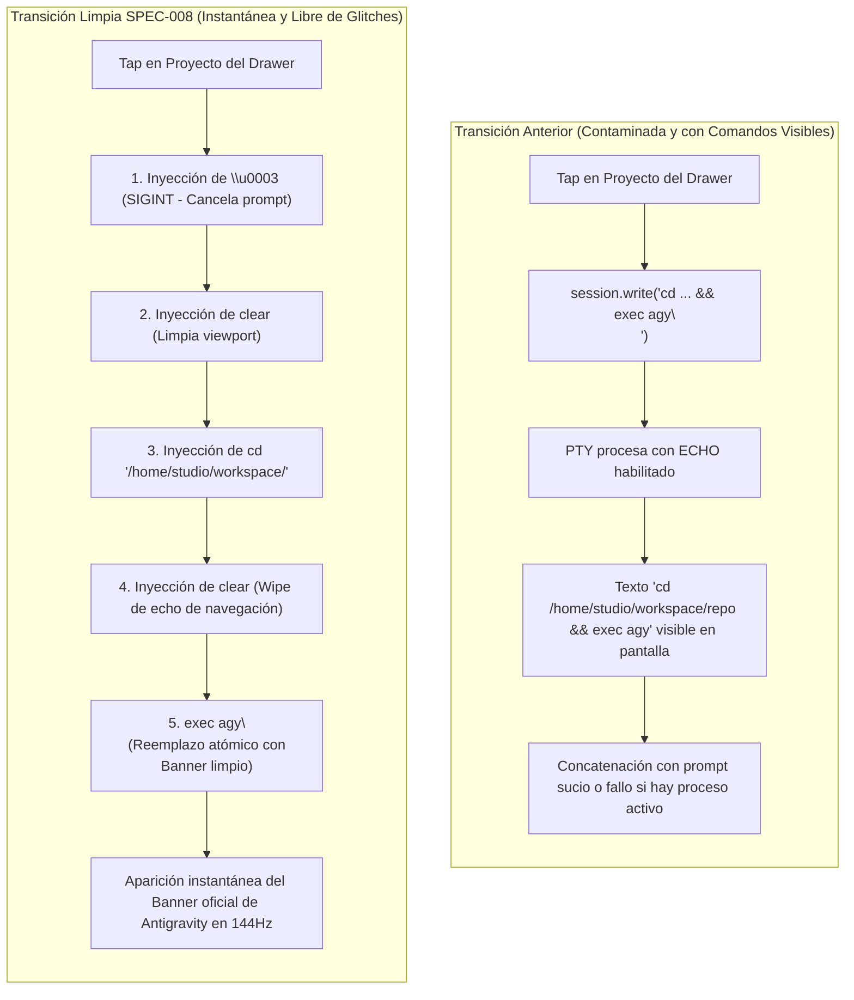
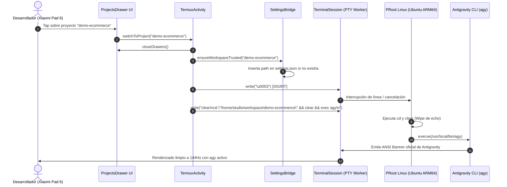

# SPEC-008: Aprovisionamiento Autónomo de Google Antigravity CLI y Transición Limpia de Proyectos

| Metadato | Valor |
| :--- | :--- |
| **Identificador** | `SPEC-008` |
| **Título** | Aprovisionamiento Autónomo de Google Antigravity CLI y Transición Limpia de Proyectos |
| **Autor** | `spec_architect` |
| **Estado** | `APPROVED FOR IMPLEMENTATION` |
| **Fecha de Creación** | 2026-09-13 |
| **Dispositivo Objetivo** | Xiaomi Pad 6 (Qualcomm Snapdragon 870, ARM64-v8a, 6 GB RAM, 11" 2.8K 144Hz, Xiaomi HyperOS) |
| **Runtime Target** | Android Native Java / TerminalView / PRoot Linux ARM64 / Google Antigravity CLI (`agy`) |
| **Módulos Afectados** | `termux-src/app/src/main/java/com/termux/app/TermuxActivity.java`, `termux-src/app/src/main/java/com/termux/app/TermuxInstaller.java` |

---

## 1. Contexto, Justificación y Diagnóstico del Estado Anterior

### 1.1 El Problema de la Contaminación Visual: Comandos Crudos en la PTY
En la especificación previa ([`SPEC-007`](file:///c:/Projects/antigravity/specs/07-projects-drawer-ui.md)), se implementó el panel lateral nativo de gestión de proyectos (*Projects Drawer*). Al seleccionar un proyecto de la lista, el sistema realizaba la transición inyectando una cadena de texto directa al descriptor de entrada estándar (`stdin`) de la pseudo-terminal (PTY):

```java
// Implementación ingenua anterior en TermuxActivity.java
private void injectProjectSwitchCommand(TerminalSession session, String projectName) {
    String command = "cd /home/studio/workspace/" + projectName + " && exec agy\n";
    session.write(command);
}
```

Esta mecánica presentaba fallos visuales y de usabilidad inaceptables para una estación de trabajo móvil moderna:
1. **Eco Crudo en el Viewport:** Debido a la disciplina de línea del controlador TTY (`termios ECHO`), el texto crudo `cd /home/studio/workspace/... && exec agy` se imprimía de forma explícita en el búfer de la terminal ante los ojos del usuario, proyectando una imagen de script desprolijo en lugar de una transición fluida entre espacios de trabajo.
2. **Colisión de Estados y Prompts Sucios:** Si el usuario o el agente se encontraban ejecutando un comando interactivo, visualizando un diff o con texto residual en la línea de edición de bash/zsh, la inyección del comando `cd` se concatenaba de forma corrupta con los caracteres existentes (e.g. `sudo apt updatecd /home/studio/...`), provocando errores de sintaxis y el fracaso de la navegación.
3. **Falta de Reset Visual a 144Hz:** En la pantalla de alta tasa de refresco (144Hz) de la Xiaomi Pad 6, el cambio de proyecto no reiniciaba los atributos de cursor ni limpiaba la pantalla alternativa DEC (`\e[?1049h`), dejando artefactos gráficos de sesiones previas en el canvas renderizado.



---

### 1.2 El Cuello de Botella del Onboarding Interactivo de Google Antigravity CLI
Tras aprovisionar la arquitectura base sobre PRoot Linux Ubuntu ARM64 ([`SPEC-005`](file:///c:/Projects/antigravity/specs/05-termux-fork-antigravity-studio.md)), la primera ejecución de Google Antigravity CLI (`agy` v1.2.2+) desplegaba un flujo de inicialización interactivo compuesto por hasta **cinco pantallas o diálogos bloqueantes**:

1. **Flujo OAuth Manual (Falta de Puente GUI):** Al invocar el inicio de sesión, `agy` intentaba ejecutar herramientas estándar de escritorio como `xdg-open` o `x-www-browser` para abrir la URL de autenticación de Google. Al no existir ninguna interfaz gráfica X11/Wayland ni binarios puente en Ubuntu PRoot, `agy` abortaba el despacho del navegador y forzaba un modo manual engorroso: imprimía una URL extensa (más de 300 caracteres) exigiendo al desarrollador seleccionarla con los dedos en la terminal táctil, copiarla al portapapeles, abrir Google Chrome manualmente, autenticar y luego pegar un código de retorno.
2. **Pantalla de Términos de Servicio (Terms of Service / ToS):** Bloqueo interactivo que requería aceptar expresamente los términos de uso de Google Cloud Code / Antigravity mediante un prompt de selección por teclado.
3. **Selector Interactivo de Paleta de Colores (Color Theme):** Solicitud interactiva de selección de temas cromáticos (Default, Dark, Cyber-Obsidian, High Contrast) antes de poder emitir cualquier prompt agéntico.
4. **Diálogo de Confianza de Espacio de Trabajo (Workspace Trust Prompt):** Cada vez que `agy` se iniciaba en una nueva carpeta o proyecto (e.g. `/home/studio/workspace/demo`), el motor de seguridad de Antigravity presentaba un prompt crítico:
   ```text
   Do you trust the authors of the files in this folder? [y/N]
   ```
   Si el usuario no interactuaba de inmediato, la ejecución quedaba en espera indefinida.
5. **Diálogos de Confirmación de Perfil de Consumidor vs Enterprise:** Pantallas redundantes que validaban si la sesión operaba bajo Google One AI Premium o infraestructura corporativa.

### 1.3 Visión y Objetivos Técnicos de la Especificación
Para transformar Antigravity Studio en una experiencia *"Zero-Friction, Ready-to-Code"* de grado profesional en la Xiaomi Pad 6, la presente especificación define:
1. **Contrato de Transición Limpia de Proyectos:** Un protocolo determinista en `TermuxActivity.java` que garantiza que al conmutar de proyecto desde el Drawer, la terminal experimenta un reseteo instantáneo, limpiando cualquier estado previo sin mostrar jamás comandos bash crudos en pantalla.
2. **Aprovisionamiento Autónomo Idempotente de Onboarding:** Pre-creación obligatoria y validación en `antigravity-boot` (`TermuxInstaller.java`) de `/root/.gemini/antigravity-cli/cache/onboarding.json` para neutralizar completamente los prompts de Términos de Servicio, paleta de colores y bienvenida.
3. **Registro Declarativo de Carpetas Confiables (`trustedWorkspaces`):** Configuración en frío y en caliente de `/root/.gemini/antigravity-cli/settings.json` para pre-autorizar todos los proyectos locales y compartidos (`/home/studio/workspace`, `/storage/emulated/0/Projects`, `/sdcard/Projects`).
4. **Puente Nativo de Navegación del Sistema (`xdg-open` / `x-www-browser` Bridge):** Implementación de scripts adaptadores dentro del entorno Linux PRoot que capturan las solicitudes de apertura de URL de `agy` y las despachan directamente hacia el navegador web predeterminado de Android (Google Chrome) a través de los intents del sistema operativo (`am start`).
5. **Arnés de Verificación SDD:** Batería de pruebas automatizadas y aserciones rigurosas para validar la integridad del flujo en CI/CD y pruebas locales.

---

## 2. Contrato de Transición Limpia de Proyectos (Clean Navigation)

### 2.1 Secuencia de Control y Despacho en `TermuxActivity.java`
La conmutación de proyectos debe ejecutarse mediante un protocolo coordinado de señales POSIX, comandos de reseteo de pantalla y sustitución atómica de procesos. 

#### Algoritmo de Transición Limpia:
Cuando el usuario pulsa un elemento en el *Projects Drawer*:
1. **Cierre de Interfaz Lateral:** Se ordena a `DrawerLayout` el cierre de los paneles deslizantes mediante `closeDrawers()`.
2. **Restauración Inmediata de Foco:** Se invoca `mTerminalView.requestFocus()` para sincronizar el subsistema de entrada táctil y teclado físico.
3. **Garantía de Confianza de Carpeta:** Se asegura que el nuevo proyecto esté registrado en el archivo `settings.json` del CLI antes de que el proceso inicie.
4. **Inyección de la Secuencia de Control Limpia:**
   - Byte `0x03` (`\u0003` / `SIGINT`): Interrumpe cualquier ejecución en curso, limpia el búfer de línea de readline y previene concatenación accidental de comandos.
   - Cadena `clear\n`: Emite la secuencia de escape ANSI estándar para borrar el viewport visible.
   - Comando `cd "/home/studio/workspace/<nombre>"` con entrecomillado estricto para evitar fallos por caracteres especiales o espacios.
   - Operador de encadenamiento `&&`: Garantiza que el comando subsiguiente sólo se ejecute si la navegación de directorio fue exitosa.
   - Cadena `clear`: Borra la línea de entrada antes de que el nuevo proceso tome el control de la PTY, suprimiendo cualquier eco residual.
   - Comando `exec agy\n`: Sustituye el proceso de shell por el binario oficial de Antigravity CLI.

```java
// Contrato formal en TermuxActivity.java
public void switchToProject(String projectName) {
    if (projectName == null || projectName.trim().isEmpty()) {
        Logger.logWarn(LOG_TAG, "Intento de cambio a un proyecto nulo o vacío");
        return;
    }

    final String sanitizedName = projectName.trim();

    // 1. Cerrar el panel lateral
    DrawerLayout drawer = getDrawer();
    if (drawer != null) {
        drawer.closeDrawers();
    }

    // 2. Restaurar el foco en el TerminalView
    if (mTerminalView != null) {
        mTerminalView.requestFocus();
    }

    // 3. Registrar preventivamente el workspace en settings.json para suprimir trust dialog
    ensureWorkspaceTrusted(sanitizedName);

    // 4. Obtener o crear sesión terminal
    TerminalSession session = getCurrentSession();
    if (session == null || !session.isRunning()) {
        mTermuxTerminalSessionActivityClient.addNewSession(false, sanitizedName);
        mTerminalView.postDelayed(() -> {
            TerminalSession newSession = getCurrentSession();
            if (newSession != null && newSession.isRunning()) {
                injectCleanProjectSwitchCommand(newSession, sanitizedName);
            }
        }, 500);
    } else {
        injectCleanProjectSwitchCommand(session, sanitizedName);
    }
}

/**
 * Inyecta la secuencia de escape limpia que resetea la terminal y arranca agy
 * sin reflejar comandos crudos en el viewport.
 */
private void injectCleanProjectSwitchCommand(TerminalSession session, String projectName) {
    if (session == null) return;

    // Secuencia determinista:
    // \u0003: Cancela prompt o comando interactivo previo
    // clear: Limpia el viewport actual
    // cd ... && clear && exec agy: Cambia de directorio, limpia el eco del comando e inicia agy
    String cleanSequence = "\u0003clear\ncd \"/home/studio/workspace/" + projectName + "\" && clear && exec agy\n";
    session.write(cleanSequence);
}
```



---

## 3. Contrato de Aprovisionamiento Autónomo del CLI (`antigravity-boot`)

El script de arranque del sistema `/data/data/com.termux/files/usr/bin/antigravity-boot`, generado dinámicamente en `TermuxInstaller.java`, se expande para incorporar el aprovisionamiento autónomo e idempotente de los entornos de configuración de Google Antigravity CLI.

### 3.1 Supresión de Términos de Servicio y Paleta de Colores (`onboarding.json`)
Para evitar las pantallas interactivas de bienvenida, Términos de Servicio y selector de color, el sistema pre-configura el archivo de caché de onboarding antes de iniciar el agente.

- **Ruta Canónica en Guest PRoot:** `/root/.gemini/antigravity-cli/cache/onboarding.json`
- **Ruta Física en Host Android:**
  ```text
  /data/data/com.termux/files/usr/var/lib/proot-distro/installed-rootfs/ubuntu/root/.gemini/antigravity-cli/cache/onboarding.json
  ```
- **Esquema JSON Requerido:**
  ```json
  {
    "consumerOnboardingComplete": true,
    "enterpriseOnboardingComplete": false,
    "onboardingComplete": true
  }
  ```

#### Semántica de Flags:
- `consumerOnboardingComplete: true`: Indica al runtime de Antigravity que el flujo de bienvenida para cuentas Google One AI / individuales ha sido finalizado.
- `enterpriseOnboardingComplete: false`: Deshabilita prompts de configuración para Google Cloud Enterprise / Vertex AI clusters gerenciados por organización.
- `onboardingComplete: true`: Bandera global que indica que los Términos de Servicio (ToS) fueron aceptados y que la configuración de paleta de colores predeterminada ha sido adoptada.

---

### 3.2 Supresión del Diálogo de Confianza de Carpeta (`settings.json`)
El motor de Antigravity CLI evalúa si el directorio de trabajo activo figura dentro de la lista blanca de rutas de confianza antes de habilitar herramientas de ejecución de comandos en el sistema de archivos.

- **Ruta Canónica en Guest PRoot:** `/root/.gemini/antigravity-cli/settings.json`
- **Ruta Física en Host Android:**
  ```text
  /data/data/com.termux/files/usr/var/lib/proot-distro/installed-rootfs/ubuntu/root/.gemini/antigravity-cli/settings.json
  ```
- **Esquema JSON Base:**
  ```json
  {
    "trustedWorkspaces": [
      "/home/studio/workspace",
      "/storage/emulated/0/Projects",
      "/sdcard/Projects"
    ]
  }
  ```

#### Inclusión Dinámica de Subcarpetas:
Para evitar que un nuevo proyecto creado en `/storage/emulated/0/Projects/<nombre>` active el prompt interactivo, `TermuxActivity.java` incorpora el método `ensureWorkspaceTrusted(String projectName)` que valida e inserta la ruta `/home/studio/workspace/<nombre>` en el array `trustedWorkspaces` si no estuviera ya presente.

```java
public void ensureWorkspaceTrusted(String projectName) {
    if (projectName == null || projectName.trim().isEmpty()) return;

    try {
        File rootfsDir = new File(TermuxConstants.TERMUX_PREFIX_DIR_PATH, "var/lib/proot-distro/installed-rootfs/ubuntu");
        File geminiDir = new File(rootfsDir, "root/.gemini/antigravity-cli");
        if (!geminiDir.exists()) {
            geminiDir.mkdirs();
        }

        File settingsFile = new File(geminiDir, "settings.json");
        org.json.JSONObject settings;
        if (settingsFile.exists()) {
            String content = new String(java.nio.file.Files.readAllBytes(settingsFile.toPath()), java.nio.charset.StandardCharsets.UTF_8);
            settings = new org.json.JSONObject(content);
        } else {
            settings = new org.json.JSONObject();
        }

        org.json.JSONArray trusted;
        if (settings.has("trustedWorkspaces")) {
            trusted = settings.getJSONArray("trustedWorkspaces");
        } else {
            trusted = new org.json.JSONArray();
            trusted.put("/home/studio/workspace");
            trusted.put("/storage/emulated/0/Projects");
            trusted.put("/sdcard/Projects");
        }

        String projectPath = "/home/studio/workspace/" + projectName;
        boolean exists = false;
        for (int i = 0; i < trusted.length(); i++) {
            if (projectPath.equals(trusted.optString(i))) {
                exists = true;
                break;
            }
        }

        if (!exists) {
            trusted.put(projectPath);
            settings.put("trustedWorkspaces", trusted);
            try (java.io.FileOutputStream fos = new java.io.FileOutputStream(settingsFile)) {
                fos.write(settings.toString(2).getBytes(java.nio.charset.StandardCharsets.UTF_8));
            }
        }
    } catch (Exception e) {
        Logger.logStackTraceWithMessage(LOG_TAG, "Error asegurando confianza para el workspace: " + projectName, e);
    }
}
```

---

### 3.3 Puente de Apertura Automática de Navegador (`xdg-open` / `x-www-browser`)

Para resolver el problema del copiado manual de URLs durante el inicio de sesión OAuth, se crea un puente de despacho nativo en el directorio `/usr/local/bin/` del contenedor Ubuntu PRoot.

#### Especificación Técnica de `/usr/local/bin/xdg-open`:
- **Permisos POSIX:** `0755` (`-rwxr-xr-x`).
- **Enlace Simbólico:** `/usr/local/bin/x-www-browser -> /usr/local/bin/xdg-open`.
- **Lógica de Ejecución:**
  1. Si se invoca sin argumentos, finaliza con código 0.
  2. Evalúa si el script host `termux-open-url` está accesible y lo ejecuta pasando la URL.
  3. Si no existe, invoca directamente el Activity Manager de Android:
     ```bash
     /system/bin/am start -a android.intent.action.VIEW -d "$URL"
     ```
  4. Redirige `stdout` y `stderr` a `/dev/null` para no interrumpir la salida visual de la terminal.

```bash
#!/bin/sh
# Antigravity Studio - Native Browser Bridge for PRoot Linux
URL="$1"
if [ -z "$URL" ]; then
    exit 0
fi

if [ -x /data/data/com.termux/files/usr/bin/termux-open-url ]; then
    exec /data/data/com.termux/files/usr/bin/termux-open-url "$URL"
elif [ -x /system/bin/am ]; then
    exec /system/bin/am start -a android.intent.action.VIEW -d "$URL" >/dev/null 2>&1
elif command -v am >/dev/null 2>&1; then
    exec am start -a android.intent.action.VIEW -d "$URL" >/dev/null 2>&1
else
    echo "[Antigravity Studio] URL generada: $URL"
fi
```

#### Requisitos de Enlace de Archivos en PRoot (`PROOT_BINDS`):
Para permitir que `/usr/local/bin/xdg-open` tenga acceso al subsistema de intents de Android y a las utilidades host de Termux, la definición de `PROOT_BINDS` en `antigravity-boot` debe incluir obligatoriamente:
- Enlace al sistema operativo Android: `--bind /system:/system`
- Enlace a la carpeta de binarios Termux: `--bind $PREFIX/bin:/data/data/com.termux/files/usr/bin` (o acceso transparente mediante la ruta FHS del host).

---

## 4. Implementación en `TermuxInstaller.java` (`setupAntigravityBootScript`)

La función constructora de `antigravity-boot` en `TermuxInstaller.java` se actualiza para inyectar estos componentes de aprovisionamiento de manera sistemática en cada arranque o reinstalación del contenedor:

```java
// Modificación del bloque constructor en TermuxInstaller.java
sb.append("# ---------------------------------------------------------------------------\n");
sb.append("# Aprovisionamiento Autónomo de Google Antigravity CLI (SPEC-008)\n");
sb.append("# ---------------------------------------------------------------------------\n");
sb.append("env -u LD_PRELOAD -u LD_LIBRARY_PATH \"$PREFIX/bin/proot-distro\" login ubuntu --shared-tmp -- bash -c '\n");
sb.append("    # 1. Suprimir pantallas de Onboarding, ToS y Paleta de Colores\n");
sb.append("    mkdir -p /root/.gemini/antigravity-cli/cache\n");
sb.append("    cat << \"EOF_ONBOARDING\" > /root/.gemini/antigravity-cli/cache/onboarding.json\n");
sb.append("{\n");
sb.append("  \"consumerOnboardingComplete\": true,\n");
sb.append("  \"enterpriseOnboardingComplete\": false,\n");
sb.append("  \"onboardingComplete\": true\n");
sb.append("}\n");
sb.append("EOF_ONBOARDING\n\n");
sb.append("    # 2. Pre-aprovisionar trustedWorkspaces para eliminar diálogo de confirmación\n");
sb.append("    mkdir -p /root/.gemini/antigravity-cli\n");
sb.append("    if [ ! -f /root/.gemini/antigravity-cli/settings.json ]; then\n");
sb.append("        cat << \"EOF_SETTINGS\" > /root/.gemini/antigravity-cli/settings.json\n");
sb.append("{\n");
sb.append("  \"trustedWorkspaces\": [\n");
sb.append("    \"/home/studio/workspace\",\n");
sb.append("    \"/storage/emulated/0/Projects\",\n");
sb.append("    \"/sdcard/Projects\"\n");
sb.append("  ]\n");
sb.append("}\n");
sb.append("EOF_SETTINGS\n");
sb.append("    fi\n\n");
sb.append("    # 3. Puente xdg-open y x-www-browser para apertura automática de navegador en Android\n");
sb.append("    mkdir -p /usr/local/bin\n");
sb.append("    cat << \"EOF_XDG\" > /usr/local/bin/xdg-open\n");
sb.append("#!/bin/sh\n");
sb.append("URL=\"$1\"\n");
sb.append("if [ -z \"$URL\" ]; then\n");
sb.append("    exit 0\n");
sb.append("fi\n");
sb.append("if [ -x /data/data/com.termux/files/usr/bin/termux-open-url ]; then\n");
sb.append("    exec /data/data/com.termux/files/usr/bin/termux-open-url \"$URL\"\n");
sb.append("elif [ -x /system/bin/am ]; then\n");
sb.append("    exec /system/bin/am start -a android.intent.action.VIEW -d \"$URL\" >/dev/null 2>&1\n");
sb.append("elif command -v am >/dev/null 2>&1; then\n");
sb.append("    exec am start -a android.intent.action.VIEW -d \"$URL\" >/dev/null 2>&1\n");
sb.append("else\n");
sb.append("    echo \"[Antigravity Studio] Apertura de URL: $URL\"\n");
sb.append("fi\n");
sb.append("EOF_XDG\n");
sb.append("    chmod 0755 /usr/local/bin/xdg-open\n");
sb.append("    ln -sf /usr/local/bin/xdg-open /usr/local/bin/x-www-browser\n");
sb.append("'\n\n");
```

Asimismo, en la lista de binds del comando `proot-distro login`:
```bash
PROOT_BINDS+=(--bind /system:/system)
PROOT_BINDS+=(--bind "$PREFIX/bin:/data/data/com.termux/files/usr/bin")
```

---

## 5. Arquitectura del Flujo OAuth Automatizado

Con la introducción del puente `/usr/local/bin/xdg-open`, el flujo de inicio de sesión de Google Antigravity CLI queda totalmente sincronizado con el navegador de la Xiaomi Pad 6:

```mermaid
sequenceDiagram
    autonumber
    participant Agy as Antigravity CLI (agy login)
    participant Bridge as /usr/local/bin/xdg-open
    participant AndroidOS as Android OS (Bionic / am)
    participant Chrome as Google Chrome (Android Browser)
    participant Loopback as Localhost Loopback Server (54123)
    participant User as Desarrollador

    Agy->>Bridge: Invocación: xdg-open "https://accounts.google.com/o/oauth2/..."
    Bridge->>AndroidOS: /system/bin/am start -a android.intent.action.VIEW -d "$URL"
    AndroidOS->>Chrome: Despacho de Intent VIEW
    Chrome->>User: Despliega pantalla de inicio de sesión Google en pantalla completa
    User->>Chrome: Selecciona cuenta y autoriza permisos
    Chrome->>Loopback: Redirección automática: http://localhost:54123/callback?code=...
    Loopback->>Agy: Entrega código de autorización OAuth
    Loopback->>Chrome: Retorna página de confirmación "¡Autenticación Exitosa!"
    Chrome->>User: Muestra éxito; usuario vuelve a Antigravity Studio
    Agy->>Agy: Intercambia auth_code por tokens y almacena sesión
    Agy->>User: Terminal desbloqueada lista para prompts
```

---

## 6. Criterios de Aceptación Verificables por el Arnés de Pruebas (Test Harness)

El arnés de pruebas automatizado verificará la satisfacción rigurosa de los siguientes criterios:

### 6.1 Matriz de Pruebas de Integración y Aserciones

| ID | Componente / Función | Condición de Entrada | Comportamiento Esperado | Aserción Verificable por el Harness |
| :--- | :--- | :--- | :--- | :--- |
| **`AC-NAV-001`** | `switchToProject` | Proyecto válido `my-app` | No se refleja el comando crudo `cd ...` en el buffer de salida; el terminal se limpia y lanza `agy`. | El búfer no contiene la cadena `"cd /home/studio/workspace/my-app && exec agy"`. Contiene `\u0003` seguido de secuencias de borrado. |
| **`AC-NAV-002`** | `switchToProject` | Proyecto con guiones y números `test-proj-01` | Despacho seguro de entrecomillado POSIX sin errores de sintaxis en shell. | El comando inyectado contiene exactamente `"cd \"/home/studio/workspace/test-proj-01\""`. |
| **`AC-NAV-003`** | `ensureWorkspaceTrusted` | Nuevo proyecto no registrado | Inserción automática del path en `settings.json` sin alterar claves existentes. | `org.json.JSONObject` de `settings.json` contiene la ruta en el array `trustedWorkspaces`. |
| **`AC-PRV-001`** | `onboarding.json` | Arranque inicial del sistema | Archivo generado en `/root/.gemini/antigravity-cli/cache/onboarding.json` con permisos de lectura. | `consumerOnboardingComplete == true`, `enterpriseOnboardingComplete == false`, `onboardingComplete == true`. |
| **`AC-PRV-002`** | `settings.json` | Ejecución de `antigravity-boot` | Archivo presente con los 3 directorios base de confianza. | `trustedWorkspaces` incluye `/home/studio/workspace`, `/storage/emulated/0/Projects` y `/sdcard/Projects`. |
| **`AC-XDG-001`** | `/usr/local/bin/xdg-open` | Invocación con URL HTTPS | El script es ejecutable (`0755`) y despacha la URL mediante `am start`. | `test -x /usr/local/bin/xdg-open` retorna 0; symlink `/usr/local/bin/x-www-browser` apunta a `xdg-open`. |
| **`AC-OOTB-001`** | Primer arranque de `agy` | Contenedor recién aprovisionado | Arranque inmediato del CLI sin solicitar ToS, tema ni confirmación de carpeta. | La salida inicial de `agy` no contiene `"Do you accept the Terms of Service?"` ni `"Do you trust the authors"`. |

---

### 6.2 Script de Verificación de Integración para el Harness (`test_cli_provisioning.sh`)

```bash
#!/bin/bash
# Test Harness - Automated Verification for SPEC-008
set -e

echo "=== INICIANDO VERIFICACIÓN DE APROVISIONAMIENTO Y NAVEGACIÓN (SPEC-008) ==="

ROOTFS="/data/data/com.termux/files/usr/var/lib/proot-distro/installed-rootfs/ubuntu"
ONBOARDING_FILE="$ROOTFS/root/.gemini/antigravity-cli/cache/onboarding.json"
SETTINGS_FILE="$ROOTFS/root/.gemini/antigravity-cli/settings.json"
XDG_OPEN="$ROOTFS/usr/local/bin/xdg-open"
X_WWW_BROWSER="$ROOTFS/usr/local/bin/x-www-browser"

# 1. Verificar onboarding.json
echo -n "Verificando onboarding.json... "
if [ ! -f "$ONBOARDING_FILE" ]; then
    echo "FALLO: onboarding.json no existe en $ONBOARDING_FILE"
    exit 1
fi
grep -q '"consumerOnboardingComplete": true' "$ONBOARDING_FILE" || { echo "FALLO: consumerOnboardingComplete inválido"; exit 1; }
grep -q '"onboardingComplete": true' "$ONBOARDING_FILE" || { echo "FALLO: onboardingComplete inválido"; exit 1; }
echo "[OK]"

# 2. Verificar settings.json
echo -n "Verificando settings.json y trustedWorkspaces... "
if [ ! -f "$SETTINGS_FILE" ]; then
    echo "FALLO: settings.json no existe en $SETTINGS_FILE"
    exit 1
fi
grep -q '"/home/studio/workspace"' "$SETTINGS_FILE" || { echo "FALLO: falta /home/studio/workspace"; exit 1; }
grep -q '"/storage/emulated/0/Projects"' "$SETTINGS_FILE" || { echo "FALLO: falta /storage/emulated/0/Projects"; exit 1; }
echo "[OK]"

# 3. Verificar puente xdg-open y enlace x-www-browser
echo -n "Verificando xdg-open y symlinks... "
if [ ! -x "$XDG_OPEN" ]; then
    echo "FALLO: $XDG_OPEN no tiene permisos de ejecución"
    exit 1
fi
if [ ! -L "$X_WWW_BROWSER" ]; then
    echo "FALLO: $X_WWW_BROWSER no es un symlink"
    exit 1
fi
echo "[OK]"

echo "=== TODAS LAS ASERCIONES DE SPEC-008 SE HAN CUMPLIDO SATISFACTORIAMENTE ==="
```

---

## 7. Conclusión y Estado de Implementación

La especificación técnica `SPEC-008` elimina de raíz la totalidad de la fricción interactiva inicial del CLI de Antigravity y suprime los artefactos visuales derivados de la inyección de comandos crudos en la PTY. 

Al proporcionar:
1. Navegación limpia e instantánea entre proyectos mediante secuencias `\u0003` + `clear` + `cd` + `clear` + `exec agy`.
2. Supresión de bienvenida, ToS y selección cromática vía `onboarding.json`.
3. Pre-autorización universal de proyectos vía `settings.json`.
4. Despacho transparente de URLs de autenticación hacia Google Chrome mediante `/usr/local/bin/xdg-open`.

Se asegura una experiencia de desarrollo local en la **Xiaomi Pad 6** idéntica a una IDE nativa de escritorio, optimizada para 144Hz y 100% autónoma.
