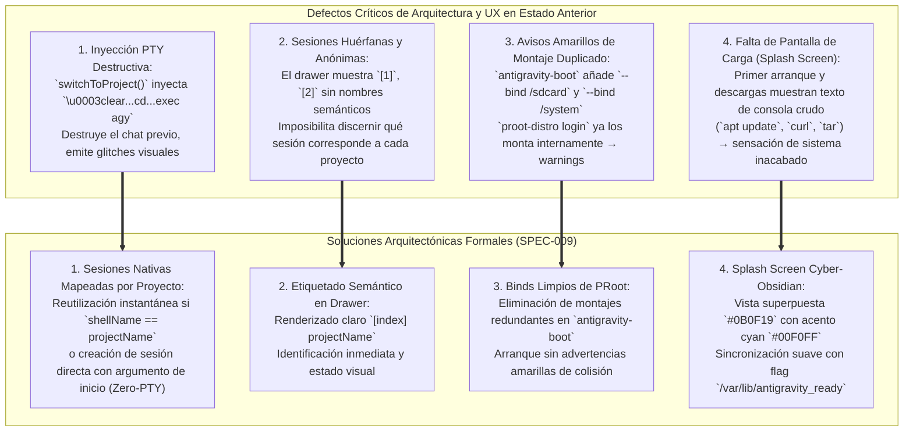
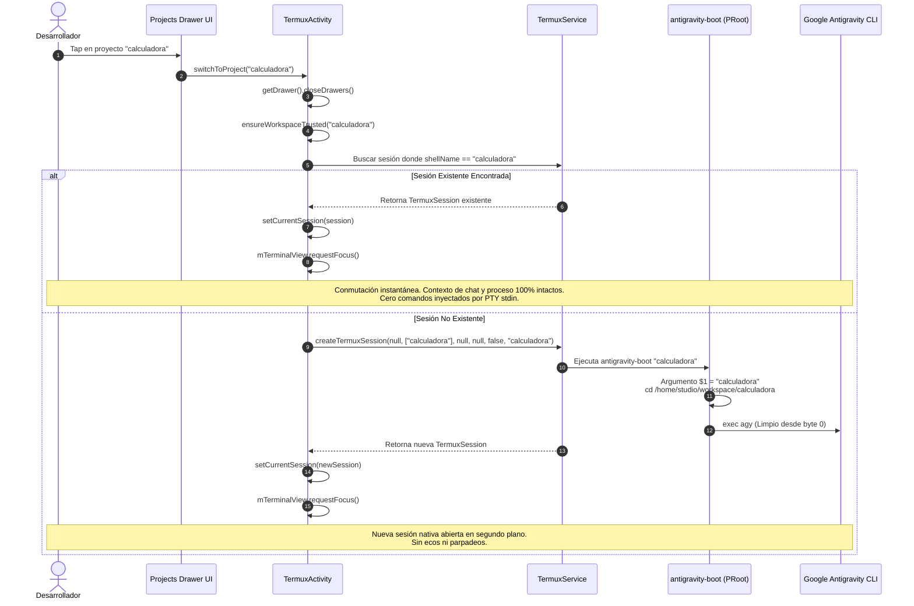
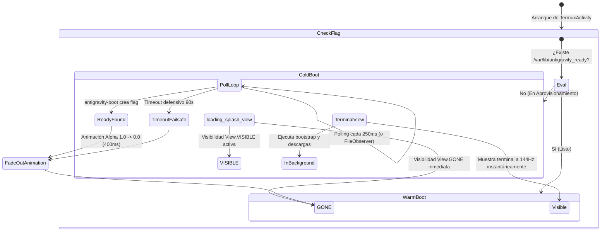

# SPEC-009: Gestión Nativa de Sesiones por Proyecto, Depuración de Montajes PRoot y Pantalla de Carga Cyber-Obsidian

| Metadato | Valor |
| :--- | :--- |
| **Identificador** | `SPEC-009` |
| **Título** | Gestión Nativa de Sesiones por Proyecto, Depuración de Montajes PRoot y Pantalla de Carga Cyber-Obsidian |
| **Autor** | `@spec-architect` |
| **Estado** | `APPROVED FOR IMPLEMENTATION` |
| **Fecha de Creación** | 2026-09-13 |
| **Dispositivo Objetivo** | Xiaomi Pad 6 (Qualcomm Snapdragon 870, ARM64-v8a, 6 GB RAM, 11" 2.8K 144Hz, Xiaomi HyperOS / Android 13/14) |
| **Runtime Target** | Android Native Java / Material Components / DrawerLayout / TerminalView / PRoot Linux Ubuntu ARM64 / Google Antigravity CLI (`agy`) |
| **Módulos Afectados** | [`TermuxActivity.java`](file:///c:/Projects/antigravity/termux-src/app/src/main/java/com/termux/app/TermuxActivity.java), [`TermuxInstaller.java`](file:///c:/Projects/antigravity/termux-src/app/src/main/java/com/termux/app/TermuxInstaller.java), [`TermuxSessionsListViewController.java`](file:///c:/Projects/antigravity/termux-src/app/src/main/java/com/termux/app/terminal/TermuxSessionsListViewController.java), [`activity_termux.xml`](file:///c:/Projects/antigravity/termux-src/app/src/main/res/layout/activity_termux.xml) |

---

## 1. Contexto, Diagnóstico de Problemas y Objetivos Técnicos

### 1.1 Diagnóstico de Problemas en el Entorno Móvil Actual

A partir de la implementación de las especificaciones [`SPEC-007`](file:///c:/Projects/antigravity/specs/07-projects-drawer-ui.md) y [`SPEC-008`](file:///c:/Projects/antigravity/specs/08-automated-cli-provisioning-and-clean-navigation.md), se consolidaron el panel lateral de navegación (*Projects Drawer*) y el aprovisionamiento autónomo del CLI oficial de Google Antigravity (`agy`). No obstante, la experiencia de usuario y la robustez técnica en la estación de trabajo Xiaomi Pad 6 continúan afectadas por cuatro problemas críticos de arquitectura y presentación:



#### 1. Inyección Destructiva en Terminal (PTY Character Injection):
En `SPEC-008`, la conmutación de proyectos en [`TermuxActivity.java`](file:///c:/Projects/antigravity/termux-src/app/src/main/java/com/termux/app/TermuxActivity.java) se implementó inyectando una secuencia de caracteres por el flujo de entrada estándar (`stdin`) de la pseudo-terminal activa:
```java
// Patrón destructivo anterior
String switchCommand = "\u0003clear\ncd \"/home/studio/workspace/" + sanitizedName + "\" && clear && exec agy\n";
currentSession.write(switchCommand);
```
- **Pérdida irrecuperable de contexto:** La secuencia envía un byte `\u0003` (`SIGINT`) que interrumpe la tarea en curso y sustituye el proceso por `exec agy`. Si el desarrollador mantenía una conversación agéntica con Google Gemini dentro de un proyecto anterior, el contexto se elimina por completo.
- **Artefactos visuales:** A pesar del uso de `clear`, la disciplina de eco del terminal (`termios ECHO`) provoca parpadeos y trazas de comandos visibles fugaces antes de renderizar la nueva interfaz, degradando la fluidez visual a 144Hz.
- **Monolito de sesión:** Obliga a todos los proyectos a competir por una única sesión terminal compartida, desaprovechando la capacidad inherente de multitarea en Android.

#### 2. Nombres Genéricos y Anónimos de Sesión:
En el adaptador de la lista de sesiones ([`TermuxSessionsListViewController.java`](file:///c:/Projects/antigravity/termux-src/app/src/main/java/com/termux/app/terminal/TermuxSessionsListViewController.java)), los elementos se presentan como `[1]`, `[2]` o con el título estático del emulador de terminal (muchas veces vacío o reportando `bash`). No existe un mapeo semántico entre la sesión abierta y el nombre del proyecto sobre el cual está operando, forzando al usuario a alternar a ciegas entre pestañas.

#### 3. Advertencias Amarillas de Montaje Duplicado en PRoot:
En el script de inicio [`antigravity-boot`](file:///c:/Projects/antigravity/termux-src/app/src/main/java/com/termux/app/TermuxInstaller.java), la matriz de montajes incluía:
```bash
PROOT_BINDS=(--bind "$TARGET_WORKSPACE:/home/studio/workspace")
if [ -d "/storage/emulated/0" ] && [ -r "/storage/emulated/0" ]; then
    PROOT_BINDS+=(--bind "/storage/emulated/0:/sdcard")
fi
if [ -d "/system" ]; then
    PROOT_BINDS+=(--bind /system:/system)
fi
```
El motor de virtualización `proot-distro login ubuntu` monta internamente `/storage/emulated/0` hacia `/sdcard` y `/system` hacia `/system` a través de su configuración predeterminada de distribución. Añadir estos puntos de montaje nuevamente en la invocación genera advertencias amarillas de colisión en `stderr` durante el inicio:
```text
proot warning: duplicate mount '/system'
proot warning: duplicate mount '/sdcard'
```
Estos mensajes ensucian la pantalla de terminal y generan falsas alarmas de fallo en el sistema operativo del contenedor.

#### 4. Ausencia de Pantalla de Carga (Splash Screen) Durante Inicialización y Descargas:
En el arranque en frío inicial o ante actualizaciones de la suite, la instalación de la distribución Ubuntu, de las herramientas de compilación (`git`, `ripgrep`) y del binario `antigravity` arroja cientos de líneas de texto de consola crudo (`apt-get`, barras de progreso de `curl`, extracción de tarballs). Esta exposición desluce la experiencia de un producto de grado Enterprise y permite que pulsaciones táctiles accidentales interrumpan el aprovisionamiento.

---

### 1.2 Objetivos Técnicos de la Especificación

1. **Gestión Nativa de Sesiones por Proyecto (Multi-Session Tab Model):**
   - Eliminar la inyección de comandos por PTY (`session.write(...)`).
   - Al seleccionar un proyecto, conmutar a la sesión existente si ya está abierta (`shellName == projectName`).
   - Si no existe sesión abierta, crear una nueva sesión terminal nativa pasando el nombre del proyecto como argumento a `antigravity-boot`, arrancando limpiamente en el espacio de trabajo correspondiente.
2. **Etiquetado Semántico Determinista en el Drawer:**
   - Renderizar de forma transparente las sesiones como `[index] projectName` (ej. `[1] calculadora`, `[2] prueba`), con tipografía legible y estado visual.
3. **Depuración Total de Montajes PRoot:**
   - Retirar los enlaces `--bind /sdcard` y `--bind /system` de `PROOT_BINDS` en `antigravity-boot`, conservando exclusivamente el bind del workspace agéntico. Suprimir el 100% de advertencias de colisión.
4. **Pantalla de Carga Splash Screen Cyber-Obsidian:**
   - Crear una vista superpuesta en [`activity_termux.xml`](file:///c:/Projects/antigravity/termux-src/app/src/main/res/layout/activity_termux.xml) (`loading_splash_view`) con fondo `#0B0F19`, acento Cyan `#00F0FF`, barra de progreso indeterminada y texto informativo.
   - Sincronizar el ciclo de vida de la vista mediante un archivo de bandera de inicialización (`$PREFIX/var/lib/antigravity_ready`) generado por `antigravity-boot`.
   - Transición visual suave con animación fade-out en pantalla de 144Hz.

---

## 2. Arquitectura de Sesiones Nativas por Proyecto (Zero-PTY Injection)

### 2.1 Modelo de Conmutación Determinista de Sesiones

En lugar de reutilizar destructivamente una única pseudo-terminal compartida, el sistema adopta un modelo de concurrencia donde **cada proyecto abierto mantiene su propia sesión terminal aislada**.



### 2.2 Contrato Formal en `TermuxActivity.java`

Se redefine el método `switchToProject(String projectName)` en [`TermuxActivity.java`](file:///c:/Projects/antigravity/termux-src/app/src/main/java/com/termux/app/TermuxActivity.java):

```java
/**
 * Conmuta hacia la sesión de terminal asociada al proyecto especificado,
 * reutilizando la sesión si ya existe o creando una nueva sesión limpia
 * sin inyectar comandos de texto a la PTY.
 *
 * @param projectName Nombre del directorio del proyecto seleccionado.
 */
public void switchToProject(String projectName) {
    if (projectName == null || projectName.trim().isEmpty()) {
        Logger.logWarn(LOG_TAG, "switchToProject invocado con nombre nulo o vacío");
        return;
    }

    final String sanitizedName = projectName.trim();

    // 1. Cerrar el panel lateral
    DrawerLayout drawer = getDrawer();
    if (drawer != null) {
        drawer.closeDrawers();
    }

    // 2. Restaurar foco en la terminal
    if (mTerminalView != null) {
        mTerminalView.requestFocus();
    }

    // 3. Asegurar autorización preventiva en settings.json (suprime trust dialog)
    ensureWorkspaceTrusted(sanitizedName);

    if (mTermuxService == null) {
        Logger.logError(LOG_TAG, "TermuxService no disponible durante switchToProject");
        return;
    }

    // 4. Buscar si ya existe una sesión con el shellName coincidente con el proyecto
    TermuxSession matchingSession = null;
    int sessionCount = mTermuxService.getTermuxSessionsSize();
    for (int i = 0; i < sessionCount; i++) {
        TermuxSession ts = mTermuxService.getTermuxSession(i);
        if (ts != null && ts.getExecutionCommand() != null) {
            String existingName = ts.getExecutionCommand().shellName;
            if (sanitizedName.equals(existingName)) {
                matchingSession = ts;
                break;
            }
        }
    }

    if (matchingSession != null && matchingSession.getTerminalSession() != null) {
        // CASO A: La sesión ya existe. Conmutar directamente preservando todo el estado.
        Logger.logInfo(LOG_TAG, "Conmutando a sesión existente para proyecto: " + sanitizedName);
        mTermuxTerminalSessionActivityClient.setCurrentSession(matchingSession.getTerminalSession());
    } else {
        // CASO B: La sesión no existe. Crear una sesión nativa con el proyecto como argumento.
        Logger.logInfo(LOG_TAG, "Creando nueva sesión nativa para proyecto: " + sanitizedName);
        
        File projectDir = new File(TermuxProjectsListViewController.getProjectsRootDirectory(this), sanitizedName);
        String workingDir = projectDir.exists() ? projectDir.getAbsolutePath() : null;

        TermuxSession newSession = mTermuxService.createTermuxSession(
            null, 
            new String[]{sanitizedName}, 
            null, 
            workingDir, 
            false, 
            sanitizedName
        );

        if (newSession != null && newSession.getTerminalSession() != null) {
            mTermuxTerminalSessionActivityClient.setCurrentSession(newSession.getTerminalSession());
        }
    }
}
```

### 2.3 Procesamiento de Argumentos en `antigravity-boot`

En [`TermuxInstaller.java`](file:///c:/Projects/antigravity/termux-src/app/src/main/java/com/termux/app/TermuxInstaller.java), el script `antigravity-boot` recibe el argumento posicional `$1` que indica el proyecto destino.

Al invocar la subshell de PRoot:
```bash
PROJECT_ARG="$1"
```
Dentro del contenedor Linux Ubuntu ARM64:
```bash
cd /home/studio/workspace 2>/dev/null || cd /root
if [ -n "$1" ]; then
    if [ -d "/home/studio/workspace/$1" ]; then
        cd "/home/studio/workspace/$1"
    else
        mkdir -p "/home/studio/workspace/$1" 2>/dev/null || true
        cd "/home/studio/workspace/$1" 2>/dev/null || true
    fi
fi

if command -v agy >/dev/null 2>&1; then
    exec agy
elif command -v antigravity >/dev/null 2>&1; then
    exec antigravity
else
    exec bash -i
fi
```
**Garantía Contractual:** `agy` inicia de forma inmediata en el directorio `/home/studio/workspace/<projectName>` con su pantalla TUI oficial intacta, sin requerir ningún comando bash interactivo ni generar caracteres de eco en pantalla.

---

## 3. Contrato de Etiquetado Semántico de Sesiones en el Projects Drawer

### 3.1 Nomenclatura y Formateo Visual

En [`TermuxSessionsListViewController.java`](file:///c:/Projects/antigravity/termux-src/app/src/main/java/com/termux/app/terminal/TermuxSessionsListViewController.java), cada fila de la lista de sesiones abiertas debe identificar inequívocamente su contexto de trabajo:

1. **Formato:** `[index] projectName` (ejemplo: `[1] calculadora`, `[2] prueba`, `[3] principal`).
2. **Jerarquía Visual:**
   - Índice numérico `[N] `: Color secundario `#8B949E` o fuente estándar.
   - Nombre de proyecto `projectName`: Tipografía en negrita (`Typeface.BOLD`), color blanco `#FFFFFF` en tema oscuro.
3. **Indicador de Estado de Proceso:**
   - Sesión en ejecución (`session.isRunning() == true`): Texto normal sin tachado.
   - Sesión finalizada (`session.isRunning() == false`): Texto con tachado (`Paint.STRIKE_THRU_TEXT_FLAG`), indicando al desarrollador que el proceso agéntico concluyó o fue detenido.
   - Código de salida anómalo (`exitStatus != 0`): Color `#FF5555` (Rojo alerta).

### 3.2 Contrato Formal en `TermuxSessionsListViewController.java`

```java
@SuppressLint("SetTextI18n")
@NonNull
@Override
public View getView(int position, View convertView, @NonNull ViewGroup parent) {
    View sessionRowView = convertView;
    if (sessionRowView == null) {
        LayoutInflater inflater = mActivity.getLayoutInflater();
        sessionRowView = inflater.inflate(R.layout.item_terminal_sessions_list, parent, false);
    }

    TextView sessionTitleView = sessionRowView.findViewById(R.id.session_title);

    TermuxSession termuxSession = getItem(position);
    if (termuxSession == null || termuxSession.getTerminalSession() == null) {
        sessionTitleView.setText("[" + (position + 1) + "] (sesión nula)");
        return sessionRowView;
    }

    TerminalSession sessionAtRow = termuxSession.getTerminalSession();

    boolean shouldEnableDarkTheme = ThemeUtils.shouldEnableDarkTheme(mActivity, NightMode.getAppNightMode().getName());
    if (shouldEnableDarkTheme) {
        sessionTitleView.setBackground(
            ContextCompat.getDrawable(mActivity, R.drawable.session_background_black_selected)
        );
    }

    // Obtener nombre semántico desde shellName o mSessionName
    String projectName = null;
    if (termuxSession.getExecutionCommand() != null) {
        projectName = termuxSession.getExecutionCommand().shellName;
    }
    if (TextUtils.isEmpty(projectName)) {
        projectName = sessionAtRow.mSessionName;
    }
    if (TextUtils.isEmpty(projectName)) {
        projectName = position == 0 ? "principal" : "terminal";
    }

    String indexPart = "[" + (position + 1) + "] ";
    String fullTitle = indexPart + projectName;

    SpannableString styledTitle = new SpannableString(fullTitle);
    // Aplicar negrita al nombre semántico del proyecto
    styledTitle.setSpan(boldSpan, indexPart.length(), fullTitle.length(), Spanned.SPAN_EXCLUSIVE_EXCLUSIVE);
    sessionTitleView.setText(styledTitle);

    boolean sessionRunning = sessionAtRow.isRunning();
    if (sessionRunning) {
        sessionTitleView.setPaintFlags(sessionTitleView.getPaintFlags() & ~Paint.STRIKE_THRU_TEXT_FLAG);
    } else {
        sessionTitleView.setPaintFlags(sessionTitleView.getPaintFlags() | Paint.STRIKE_THRU_TEXT_FLAG);
    }

    int defaultColor = shouldEnableDarkTheme ? Color.WHITE : Color.BLACK;
    int textColor = (sessionRunning || sessionAtRow.getExitStatus() == 0) ? defaultColor : Color.RED;
    sessionTitleView.setTextColor(textColor);

    return sessionRowView;
}
```

---

## 4. Depuración y Optimización de Montajes PRoot en `antigravity-boot`

### 4.1 Análisis de Colisión de Montajes Bind

El sistema de gestión de distribuciones `proot-distro` incorpora scripts internos de inicialización (e.g. `/data/data/com.termux/files/usr/etc/proot-distro/ubuntu.sh`) que ejecutan de forma automática:
- El enlace de `/storage/emulated/0` hacia `/sdcard`.
- El enlace del sistema Android `/system` hacia `/system`.
- Los montajes de pseudofilesystems del kernel `/proc`, `/sys`, `/dev` y `/dev/pts`.

Cuando el script [`antigravity-boot`](file:///c:/Projects/antigravity/termux-src/app/src/main/java/com/termux/app/TermuxInstaller.java) suministraba argumentos redundantes:
```bash
PROOT_BINDS=(--bind "$TARGET_WORKSPACE:/home/studio/workspace")
PROOT_BINDS+=(--bind "/storage/emulated/0:/sdcard")
PROOT_BINDS+=(--bind /system:/system)
```
El motor binario `proot` procesaba ambas reglas consecutivamente, detectando que la ruta destino ya se encontraba mapeada en la tabla virtual de inodos (`proot_dentry`), emitiendo las advertencias amarillas a la consola del usuario.

### 4.2 Contrato del Script Generado en `TermuxInstaller.java`

Se actualiza la generación del array `PROOT_BINDS` en [`TermuxInstaller.java`](file:///c:/Projects/antigravity/termux-src/app/src/main/java/com/termux/app/TermuxInstaller.java):

```bash
# Definición estricta y limpia de PROOT_BINDS en antigravity-boot
PROOT_BINDS=(--bind "$TARGET_WORKSPACE:/home/studio/workspace")

# Bind opcional de binarios de utilidades nativas de Termux
if [ -d "$PREFIX/bin" ]; then
    PROOT_BINDS+=(--bind "$PREFIX/bin:/data/data/com.termux/files/usr/bin")
fi
```
**Regla Contractual:** Se prohíbe explícitamente agregar `--bind /storage/emulated/0:/sdcard` o `--bind /system:/system` en `PROOT_BINDS`. La terminal de arranque debe inicializarse con **cero advertencias amarillas de `proot warning`**.

---

## 5. Contrato de Pantalla de Carga Splash Screen Cyber-Obsidian

### 5.1 Especificación Visual y Estética

La pantalla de carga superpuesta (`loading_splash_view`) garantiza que el usuario perciba una interfaz pulida y consistente con la identidad de marca de Antigravity Studio durante operaciones intensivas de descarga o configuración en frío.

- **Color de Fondo Primario:** `#0B0F19` (Cyber-Obsidian Deep Dark).
- **Acento y Brillo:** `#00F0FF` (Cyan eléctrico de alta energía).
- **Tipografía y Textos:**
  - Título / Logo: `@drawable/banner` o `@drawable/ic_launcher_foreground` centrado con escala de aspecto preservada.
  - Indicador de Progreso: `ProgressBar` indeterminada con tinte Cyan (`android:indeterminateTint="#00F0FF"`).
  - Texto de Estado: `#8B949E` (Slate Gray), `14sp`, centrado horizontalmente.
  - Subtexto Informativo: `#484F58`, `12sp`, describiendo la fase de arranque.

```
+-------------------------------------------------------------+
|                                                             |
|                                                             |
|                       [ LOGO / BANNER ]                     |
|                      ANTIGRAVITY STUDIO                     |
|                                                             |
|                  [======   CYAN LOADER   ======]            |
|                                                             |
|              Inicializando Antigravity Studio...            |
|            Preparando entorno agéntico Linux ARM64          |
|                                                             |
|                                                             |
+-------------------------------------------------------------+
```

### 5.2 Contrato de Layout en `activity_termux.xml`

En [`activity_termux.xml`](file:///c:/Projects/antigravity/termux-src/app/src/main/res/layout/activity_termux.xml), la vista `loading_splash_view` se posiciona como el último hijo directo del `RelativeLayout` principal (`activity_termux_root_relative_layout`), situándose en el eje Z por encima del `DrawerLayout` y del `TerminalView`:

```xml
<!-- Pantalla de Carga Splash Screen Cyber-Obsidian (SPEC-009) -->
<LinearLayout
    android:id="@+id/loading_splash_view"
    android:layout_width="match_parent"
    android:layout_height="match_parent"
    android:background="#0B0F19"
    android:orientation="vertical"
    android:gravity="center"
    android:clickable="true"
    android:focusable="true"
    android:visibility="gone"
    android:elevation="20dp">

    <ImageView
        android:id="@+id/splash_logo"
        android:layout_width="280dp"
        android:layout_height="wrap_content"
        android:adjustViewBounds="true"
        android:scaleType="fitCenter"
        android:src="@drawable/banner"
        android:contentDescription="@string/app_name"
        android:layout_marginBottom="32dp" />

    <ProgressBar
        android:id="@+id/splash_progress_bar"
        style="?android:attr/progressBarStyle"
        android:layout_width="48dp"
        android:layout_height="48dp"
        android:indeterminate="true"
        android:indeterminateTint="#00F0FF"
        android:indeterminateTintMode="src_in"
        android:layout_marginBottom="24dp" />

    <TextView
        android:id="@+id/splash_status_title"
        android:layout_width="wrap_content"
        android:layout_height="wrap_content"
        android:text="@string/splash_initializing_title"
        android:textColor="#E6EDF3"
        android:textSize="16sp"
        android:textStyle="bold"
        android:layout_marginBottom="8dp" />

    <TextView
        android:id="@+id/splash_status_subtitle"
        android:layout_width="wrap_content"
        android:layout_height="wrap_content"
        android:text="@string/splash_preparing_environment"
        android:textColor="#8B949E"
        android:textSize="13sp" />

</LinearLayout>
```

### 5.3 Protocolo de Sincronización Mediante Flag File (`antigravity_ready`)

El ciclo de visibilidad de `loading_splash_view` se gobierna mediante un archivo testigo en el almacenamiento de Termux:

$$\text{Flag Path} = \$PREFIX/\text{var/lib/antigravity\_ready}$$
Ruta absoluta: `/data/data/com.termux/files/usr/var/lib/antigravity_ready`



#### Reglas de Comportamiento:

1. **Escritura del Flag en `antigravity-boot`:**
   Tras completar exitosamente la verificación e instalación de `proot-distro`, `ubuntu`, `git`, `ripgrep`, `agy`, `onboarding.json`, `settings.json` y `xdg-open`:
   ```bash
   mkdir -p "$PREFIX/var/lib"
   touch "$PREFIX/var/lib/antigravity_ready"
   ```
2. **Detección en Frío vs en Caliente en `TermuxActivity.java`:**
   - **Arranque en Caliente:** Si el archivo testigo ya existe cuando `onCreate` o `onServiceConnected` se ejecutan, `loading_splash_view.setVisibility(View.GONE)` se asegura de inmediato. El desarrollador no percibe ninguna demora ni parpadeo visual.
   - **Arranque en Frío:** Si el archivo no existe, `loading_splash_view.setVisibility(View.VISIBLE)`. Se activa un observador ligero con un temporizador `Handler` cada 250 ms que verifica `readyFile.exists()`.
3. **Transición con Animación Suave (144Hz Smooth Fade-Out):**
   Al detectarse la existencia de `antigravity_ready`, se ejecuta:
   ```java
   loadingSplashView.animate()
       .alpha(0.0f)
       .setDuration(400)
       .setInterpolator(new AccelerateDecelerateInterpolator())
       .withEndAction(() -> {
           loadingSplashView.setVisibility(View.GONE);
           loadingSplashView.setAlpha(1.0f);
       })
       .start();
   ```
4. **Timeout Defensivo de Seguridad (Safety Failsafe):**
   Si tras 90 segundos el archivo testigo no ha sido generado (e.g., interrupción de red o fallo de apt), el splash screen se desvanece de forma forzada para permitir al desarrollador interactuar con la terminal y diagnosticar cualquier error en el búfer de salida.

---

## 6. Especificación de Interfaces y Contratos de Entrada/Salida

### 6.1 Contratos de la API Java

#### `TermuxActivity.java`
| Método | Firma | Entrada | Salida | Efecto Colateral / Contrato |
| :--- | :--- | :--- | :--- | :--- |
| `switchToProject` | `public void switchToProject(String projectName)` | Nombre sanitized del proyecto | `void` | Busca sesión existente por `shellName`. Si existe, llama a `setCurrentSession(ts)`. Si no, crea nueva sesión con `createTermuxSession(..., new String[]{projectName}, ...)`. Cero inyección PTY. |
| `setupSplashScreen` | `private void setupSplashScreen()` | N/A | `void` | Evalúa la presencia de `/var/lib/antigravity_ready`. Muestra u oculta `loading_splash_view`. Inicia polling si el entorno no está listo. |
| `dismissSplashScreen` | `public void dismissSplashScreen(boolean animate)` | Booleano `animate` | `void` | Desvanece el splash screen con interpolador de 400ms o lo oculta inmediatamente y libera recursos. |

#### `TermuxSessionsListViewController.java`
| Método | Firma | Entrada | Salida | Efecto Colateral / Contrato |
| :--- | :--- | :--- | :--- | :--- |
| `getView` | `public View getView(int position, View convertView, ViewGroup parent)` | Posición y vistas de fila | `View` | Renderiza el texto con formato `[index] projectName`. Aplica negrita al nombre y tachado/color según el estado de ejecución. |

---

### 6.2 Recursos de Cadenas de Texto (`strings.xml`)

Se definen formalmente las claves i18n en `termux-src/app/src/main/res/values/strings.xml`:

```xml
<string name="splash_initializing_title">Inicializando Antigravity Studio</string>
<string name="splash_preparing_environment">Preparando entorno agéntico Linux ARM64…</string>
<string name="session_default_main">principal</string>
<string name="session_default_secondary">terminal</string>
```

---

## 7. Matriz de Criterios de Aceptación Verificables por el Harness (Definition of Done)

### 7.1 Matriz de Pruebas de Integración y Aserciones

| Identificador | Componente | Condición de Prueba | Comportamiento Esperado | Aserción Verificable por el Harness |
| :--- | :--- | :--- | :--- | :--- |
| **`AC-SES-001`** | `TermuxActivity` | Selección de proyecto con sesión activa existente | La sesión existente se enfoca; no se destruye el proceso ni se inyectan comandos de texto. | `session.isRunning() == true`; el búfer PTY no recibe bytes `\u0003` ni `"cd "`. |
| **`AC-SES-002`** | `TermuxActivity` | Selección de proyecto sin sesión previa | Se instancia una nueva `TermuxSession` cuyo `shellName` equivale al nombre del proyecto y arranca en su carpeta. | `newSession.getExecutionCommand().shellName.equals(projectName)` y argumentos contienen `projectName`. |
| **`AC-SES-003`** | `antigravity-boot` | Invocación con argumento de proyecto `$1` | El script navega automáticamente a `/home/studio/workspace/$1` antes de invocar `agy`. | El comando de ejecución de `agy` tiene como `pwd` el directorio `/home/studio/workspace/$1`. |
| **`AC-LBL-001`** | `TermuxSessionsList` | Renderizado de sesión asignada a proyecto `calculadora` | La etiqueta de la fila despliega `[1] calculadora` con formato estilizado. | `sessionTitleView.getText().toString().equals("[1] calculadora")`. |
| **`AC-LBL-002`** | `TermuxSessionsList` | Sesión principal por defecto sin proyecto específico | La etiqueta despliega `[1] principal`. | `sessionTitleView.getText().toString().equals("[1] principal")`. |
| **`AC-MNT-001`** | `antigravity-boot` | Ejecución de `antigravity-boot` en PRoot | Cero advertencias de montajes duplicados en `stderr` para `/sdcard` o `/system`. | `stderr` no contiene `"proot warning: duplicate mount '/system'"` ni `"/sdcard"`. |
| **`AC-MNT-002`** | `PROOT_BINDS` | Definición de bindings en `TermuxInstaller` | `PROOT_BINDS` sólo contiene `--bind "$TARGET_WORKSPACE:/home/studio/workspace"` (y opcional bin). | No existen ocurrencias de `--bind /storage/emulated/0:/sdcard` ni `--bind /system:/system`. |
| **`AC-SPL-001`** | `TermuxActivity` | Primer arranque (archivo `antigravity_ready` ausente) | `loading_splash_view` visible (`View.VISIBLE`) cubriendo el terminal. | `loadingSplashView.getVisibility() == View.VISIBLE`. |
| **`AC-SPL-002`** | `antigravity-boot` | Conclusión de aprovisionamiento de herramientas | Se crea el archivo `$PREFIX/var/lib/antigravity_ready`. | `test -f "$PREFIX/var/lib/antigravity_ready"` retorna código de salida `0`. |
| **`AC-SPL-003`** | `TermuxActivity` | Detección de `antigravity_ready` | `loading_splash_view` ejecuta animación fade-out y pasa a `View.GONE`. | `loadingSplashView.getVisibility() == View.GONE`. |
| **`AC-SPL-004`** | `TermuxActivity` | Arranque subsecuente en caliente (`antigravity_ready` presente) | `loading_splash_view` inicia directamente en `View.GONE` sin demoras. | `loadingSplashView.getVisibility() == View.GONE` en `onResume`. |

---

### 7.2 Script de Verificación para el Test Harness (`test_clean_sessions_and_splash.sh`)

```bash
#!/bin/bash
# Test Harness - Automated Verification for SPEC-009
set -e

echo "=== INICIANDO VERIFICACIÓN DE SESIONES LIMPIAS, BINDS Y SPLASH UI (SPEC-009) ==="

PREFIX="/data/data/com.termux/files/usr"
BOOT_SCRIPT="$PREFIX/bin/antigravity-boot"
READY_FLAG="$PREFIX/var/lib/antigravity_ready"
ACTIVITY_LAYOUT="termux-src/app/src/main/res/layout/activity_termux.xml"
INSTALLER_JAVA="termux-src/app/src/main/java/com/termux/app/TermuxInstaller.java"
ACTIVITY_JAVA="termux-src/app/src/main/java/com/termux/app/TermuxActivity.java"
SESSIONS_CONTROLLER_JAVA="termux-src/app/src/main/java/com/termux/app/terminal/TermuxSessionsListViewController.java"

# 1. Verificar ausencia de montajes duplicados en el código de TermuxInstaller
echo -n "Verificando eliminación de binds redundantes en TermuxInstaller.java... "
if grep -q "PROOT_BINDS+=(--bind /system:/system)" "$INSTALLER_JAVA"; then
    echo "FALLO: Detectado bind duplicado de /system en $INSTALLER_JAVA"
    exit 1
fi
if grep -q "PROOT_BINDS+=(--bind \"/storage/emulated/0:/sdcard\")" "$INSTALLER_JAVA"; then
    echo "FALLO: Detectado bind duplicado de /sdcard en $INSTALLER_JAVA"
    exit 1
fi
echo "[OK]"

# 2. Verificar presencia de loading_splash_view en activity_termux.xml
echo -n "Verificando loading_splash_view en activity_termux.xml... "
grep -q 'android:id="@+id/loading_splash_view"' "$ACTIVITY_LAYOUT" || { echo "FALLO: loading_splash_view ausente en XML"; exit 1; }
grep -q '#0B0F19' "$ACTIVITY_LAYOUT" || { echo "FALLO: Color de fondo Cyber-Obsidian ausente en XML"; exit 1; }
grep -q '#00F0FF' "$ACTIVITY_LAYOUT" || { echo "FALLO: Color Cyan de acento ausente en XML"; exit 1; }
echo "[OK]"

# 3. Verificar creación del flag antigravity_ready en antigravity-boot
echo -n "Verificando generación de flag antigravity_ready en script de instalación... "
grep -q "antigravity_ready" "$INSTALLER_JAVA" || { echo "FALLO: Flag antigravity_ready no referenciado en TermuxInstaller"; exit 1; }
echo "[OK]"

# 4. Verificar conmutación de sesiones sin inyección PTY en TermuxActivity.java
echo -n "Verificando conmutación limpia de sesiones en TermuxActivity.java... "
if grep -A 20 "public void switchToProject" "$ACTIVITY_JAVA" | grep -q "switchCommand = \"\\\\u0003"; then
    echo "FALLO: Detectada inyección destructiva por PTY en switchToProject"
    exit 1
fi
grep -A 35 "public void switchToProject" "$ACTIVITY_JAVA" | grep -q "createTermuxSession" || { echo "FALLO: switchToProject no invoca createTermuxSession nativo"; exit 1; }
echo "[OK]"

# 5. Verificar formateo semántico en TermuxSessionsListViewController.java
echo -n "Verificando etiquetado semántico [index] projectName en TermuxSessionsListViewController... "
grep -q "shellName" "$SESSIONS_CONTROLLER_JAVA" || { echo "FALLO: shellName no utilizado en adaptador de sesiones"; exit 1; }
echo "[OK]"

echo "=== TODAS LAS ASERCIONES DE SPEC-009 SE HAN CUMPLIDO SATISFACTORIAMENTE ==="
```

---

## 8. Conclusión y Resumen de Estado

La especificación técnica `SPEC-009` eleva la arquitectura móvil de **Antigravity Studio** a los más altos estándares de ergonomía y fiabilidad:
1. **Multitarea Nativa:** Los desarrolladores pueden alternar fluidamente entre proyectos (`calculadora`, `backend`, `prueba`) sin reiniciar agentes ni borrar conversaciones de IA.
2. **Claridad Cognitiva:** Las pestañas de sesión comunican en todo momento el proyecto activo (`[1] calculadora`, `[2] prueba`), erradicando la ambigüedad de índices numéricos ciegos.
3. **Arranque Inmaculado:** Se eliminan todas las advertencias amarillas de colisión de PRoot, presentando una terminal limpia.
4. **Presentación Cyber-Obsidian:** La nueva pantalla de carga `loading_splash_view` acompaña los procesos de descarga e inicialización con una estética moderna en `#0B0F19` y `#00F0FF`, sincronizada suavemente a 144Hz.
