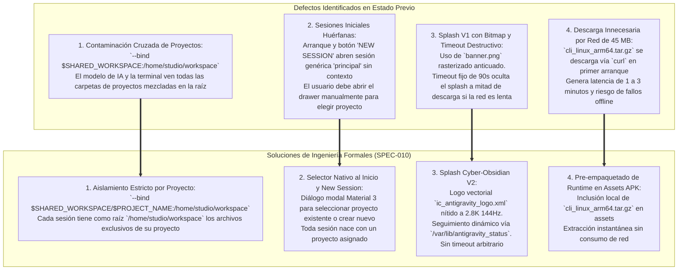
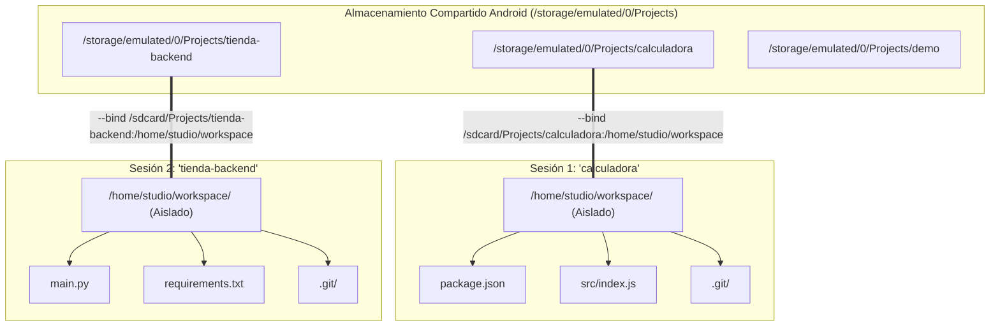
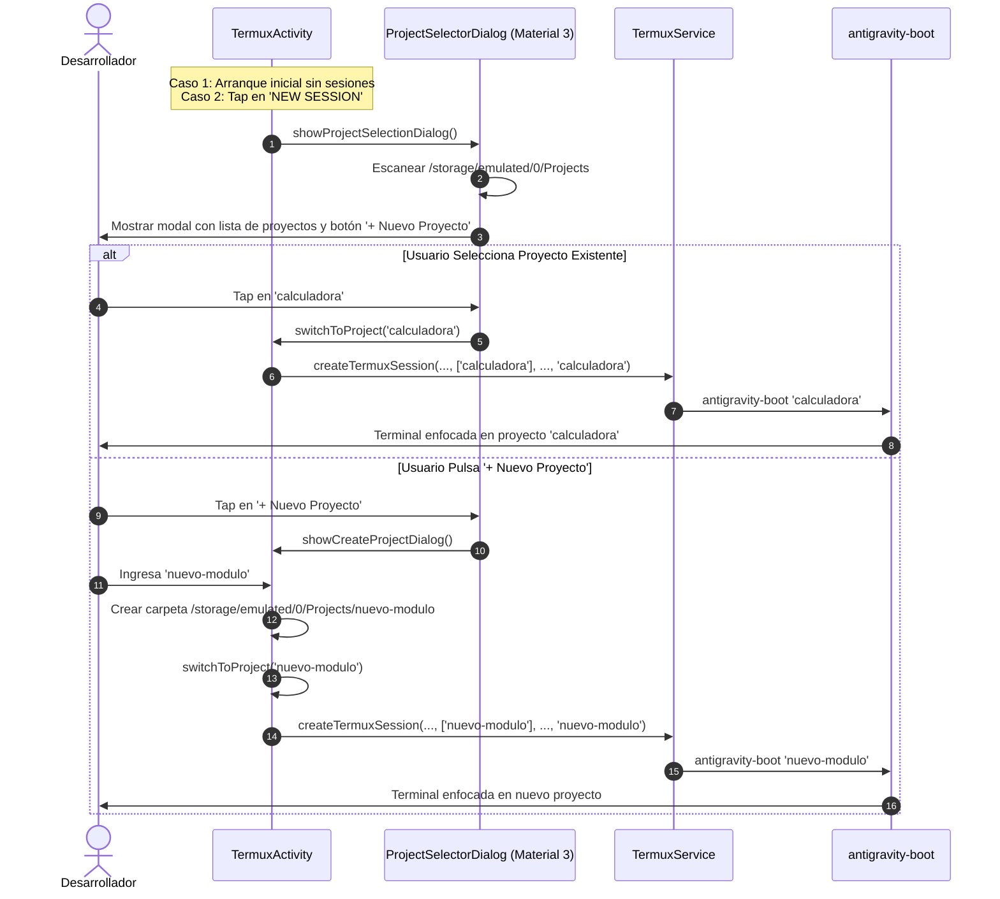
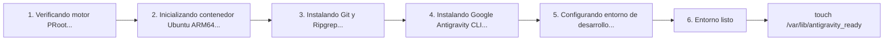

# SPEC-010: Aislamiento Estricto de Proyectos por Sesión, Selector de Proyectos Nativo, Splash Cyber-Obsidian V2 y Pre-empaquetado de Runtime

| Metadato | Valor |
| :--- | :--- |
| **Identificador** | `SPEC-010` |
| **Título** | Aislamiento Estricto de Proyectos por Sesión, Selector de Proyectos Nativo, Splash Cyber-Obsidian V2 y Pre-empaquetado de Runtime |
| **Autor** | `@spec-architect` |
| **Estado** | `APPROVED FOR IMPLEMENTATION` |
| **Fecha de Creación** | 2026-09-13 |
| **Dispositivo Objetivo** | Xiaomi Pad 6 (Qualcomm Snapdragon 870, ARM64-v8a, 6 GB RAM, 11" 2.8K 144Hz, Xiaomi HyperOS / Android 13/14) |
| **Runtime Target** | Android Native Java / Material Components / DrawerLayout / TerminalView / PRoot Linux Ubuntu ARM64 / Google Antigravity CLI (`agy`) |
| **Módulos Afectados** | [`TermuxActivity.java`](file:///c:/Projects/antigravity/termux-src/app/src/main/java/com/termux/app/TermuxActivity.java), [`TermuxInstaller.java`](file:///c:/Projects/antigravity/termux-src/app/src/main/java/com/termux/app/TermuxInstaller.java), [`activity_termux.xml`](file:///c:/Projects/antigravity/termux-src/app/src/main/res/layout/activity_termux.xml), [`strings.xml`](file:///c:/Projects/antigravity/termux-src/app/src/main/res/values/strings.xml), `app/src/main/assets/antigravity/` |

---

## 1. Contexto, Diagnóstico del Estado Anterior y Objetivos Técnicos

### 1.1 Diagnóstico de Problemas en el Runtime Móvil

Tras la consolidación del panel lateral de proyectos ([`SPEC-007`](file:///c:/Projects/antigravity/specs/07-projects-drawer-ui.md)), el aprovisionamiento autónomo ([`SPEC-008`](file:///c:/Projects/antigravity/specs/08-automated-cli-provisioning-and-clean-navigation.md)) y la gestión limpia de sesiones con splash inicial ([`SPEC-009`](file:///c:/Projects/antigravity/specs/09-clean-sessions-and-splash-ui.md)), la auditoría de experiencia de desarrollo agéntico en la Xiaomi Pad 6 reveló cuatro cuellos de botella e inconsistencias de aislamiento:



#### 1. Contaminación Cruzada de Proyectos (Workspace Polución):
En la arquitectura previa, el script `antigravity-boot` configuraba el montaje PRoot de la siguiente manera:
```bash
PROOT_BINDS=(--bind "$TARGET_WORKSPACE:/home/studio/workspace")
```
Donde `$TARGET_WORKSPACE` correspondía al directorio padre `/storage/emulated/0/Projects`. Esto causaba que dentro del contenedor PRoot, la carpeta `/home/studio/workspace` contuviera la totalidad de proyectos del usuario:
```text
/home/studio/workspace/
├── calculadora/
├── tienda-backend/
└── test-suite/
```
Cuando el agente inteligente `agy` (impulsado por Google Gemini 3.8/2.5) inspeccionaba el espacio de trabajo, indexaba o buscaba archivos mediante `ripgrep`, recibía información de todos los proyectos concurrentes, provocando alucinaciones de contexto, mezcla accidental de ramas Git y vulnerando el principio de mínimo privilegio en el entorno de desarrollo.

#### 2. Sesiones Iniciales Huérfanas y Falta de Selector al Crear Sesión:
Al iniciar la aplicación por primera vez o al tocar el botón `NEW SESSION` (`new_session_button`), el sistema invocaba `mTermuxTerminalSessionActivityClient.addNewSession(false, null)`. Esto creaba una sesión terminal sin nombre de proyecto asignado (etiquetada genéricamente como `principal`), obligando al desarrollador a navegar manualmente o abrir el panel lateral para elegir un proyecto de destino.

#### 3. Splash Screen V1 con Bitmap Obsoleto, Falta de Estado Dinámico y Timeout Destructivo:
El componente `loading_splash_view` introducido en `SPEC-009` adolecía de tres fallos operativos:
- **Calidad Gráfica:** Utilizaba el recurso rasterizado `@drawable/banner` (logo bitmap heredado de Termux a baja resolución), desentonando en la pantalla 2.8K ($2880 \times 1800$) de la Xiaomi Pad 6.
- **Opacidad de Avance:** Mostraba un texto estático ("Preparando entorno agéntico Linux ARM64…"), impidiendo al usuario conocer si el sistema estaba instalando paquetes apt, configurando el contenedor Ubuntu o descomprimiendo herramientas.
- **Timeout Destructivo:** Implementaba un temporizador rígido de 90 segundos (`SPLASH_TIMEOUT_MS = 90000`). Si la conexión de red del usuario era lenta durante la descarga de la imagen de Ubuntu, el splash se ocultaba prematuramente exponiendo la terminal cruda con salida de consola caótica.

#### 4. Descarga Innecesaria por Red de la CLI Oficial (`cli_linux_arm64.tar.gz`):
El aprovisionamiento dependía de una petición `curl` remota a `storage.googleapis.com` para descargar el paquete comprimido de 45 MB del CLI oficial de Google Antigravity. En dispositivos sin Wi-Fi de alta velocidad o en modo avión, esto generaba bloqueos de hasta varios minutos o fallos irrecuperables de instalación inicial.

---

### 1.2 Objetivos Técnicos de la Especificación

1. **Aislamiento Estricto de Espacios de Trabajo:** Cada sesión de terminal debe montar de forma exclusiva el subdirectorio correspondiente a su proyecto en `/home/studio/workspace`, garantizando que la raíz del workspace dentro de Linux PRoot contenga únicamente los archivos de dicho proyecto.
2. **Selector Nativo de Proyectos al Inicio y en Nueva Sesión:** Presentar un modal interactivo Material 3 para elegir entre proyectos existentes o crear uno nuevo tanto en el arranque inicial sin sesiones como al pulsar el botón `NEW SESSION`.
3. **Splash Screen Cyber-Obsidian V2 con Seguimiento Dinámico:**
   - Sustituir el bitmap por un recurso vectorial moderno y escalable (`ic_antigravity_logo.xml`).
   - Sincronizar el mensaje de progreso en pantalla con el archivo dinámico `$PREFIX/var/lib/antigravity_status`.
   - Eliminar el timeout destructivo de 90s; la pantalla de carga solo debe desvanecerse cuando `$PREFIX/var/lib/antigravity_ready` confirme la preparación total.
4. **Pre-empaquetado y Despliegue Local del Binario CLI:** Incluir el archivo `cli_linux_arm64.tar.gz` en los assets del APK e instalarlo directamente en el contenedor sin depender de descargas por red.

---

## 2. Contrato de Aislamiento Estricto de Workspace por Proyecto (`ProjectSessionIsolationContract`)

### 2.1 Especificación del Montaje Bind Dinámico en PRoot

Para garantizar el aislamiento absoluto entre proyectos, el script `antigravity-boot` debe enlazar **exclusivamente la carpeta del proyecto específico** hacia `/home/studio/workspace`.



### 2.2 Reglas Contractuales de Montaje

1. **Resolución de Directorio de Proyecto:**
   Dado el argumento posicional `$1` (`PROJECT_NAME`):
   ```bash
   PROJECT_NAME="$1"
   if [ -z "$PROJECT_NAME" ]; then
       PROJECT_NAME="default"
   fi

   SHARED_WORKSPACE="/storage/emulated/0/Projects"
   FALLBACK_WORKSPACE="$HOME/projects"
   BASE_WORKSPACE="$FALLBACK_WORKSPACE"

   if mkdir -p "$SHARED_WORKSPACE" 2>/dev/null && [ -w "$SHARED_WORKSPACE" ]; then
       BASE_WORKSPACE="$SHARED_WORKSPACE"
   fi

   TARGET_PROJECT_DIR="$BASE_WORKSPACE/$PROJECT_NAME"
   mkdir -p "$TARGET_PROJECT_DIR"
   ```
2. **Configuración de Binds en `PROOT_BINDS`:**
   ```bash
   PROOT_BINDS=(--bind "$TARGET_PROJECT_DIR:/home/studio/workspace")
   if [ -d "$PREFIX/bin" ]; then
       PROOT_BINDS+=(--bind "$PREFIX/bin:/data/data/com.termux/files/usr/bin")
   fi
   ```
3. **Resultado en el Espacio de Nombres del Contenedor:**
   - La raíz `/home/studio/workspace` coincide de forma exacta con la carpeta física del proyecto en Android.
   - Cualquier archivo creado por el usuario o por el agente en `/home/studio/workspace/archivo.txt` se persiste inmediatamente en `/storage/emulated/0/Projects/<PROJECT_NAME>/archivo.txt`.
   - La invocación `cd /home/studio/workspace && exec agy` ubica al agente en la raíz limpia de su proyecto.
   - Proyectos adyacentes no son accesibles desde `/home/studio/workspace/..` dentro del contenedor PRoot, salvaguardando la integridad del contexto.

---

## 3. Contrato de Flujo de Selección de Proyectos Nativo (`ProjectSelectorContract`)

### 3.1 Flujo de Interacción al Inicio y en Nueva Sesión

Queda prohibido crear sesiones anónimas sin proyecto asignado. Toda creación de sesión debe estar vinculada a un proyecto explícito.



### 3.2 Implementación en `TermuxActivity.java`

Se reemplaza la invocación ciega `addNewSession(false, null)` en `setNewSessionButtonView()` y en el callback de inicio `onServiceConnected()`:

```java
/**
 * Muestra el selector modal de proyectos para abrir una sesión aislada.
 */
public void showProjectSelectionDialog() {
    File rootDir = TermuxProjectsListViewController.getProjectsRootDirectory(this);
    File[] projectDirs = rootDir.listFiles(File::isDirectory);

    List<String> projectNames = new ArrayList<>();
    if (projectDirs != null) {
        Arrays.sort(projectDirs, (a, b) -> a.getName().compareToIgnoreCase(b.getName()));
        for (File dir : projectDirs) {
            if (!dir.getName().startsWith(".")) {
                projectNames.add(dir.getName());
            }
        }
    }

    AlertDialog.Builder builder = new AlertDialog.Builder(this);
    builder.setTitle(R.string.title_select_project_session);

    // Opciones: lista de proyectos + botón para crear nuevo
    String[] items = new String[projectNames.size() + 1];
    for (int i = 0; i < projectNames.size(); i++) {
        items[i] = "📁 " + projectNames.get(i);
    }
    items[projectNames.size()] = "➕ " + getString(R.string.action_new_project);

    builder.setItems(items, (dialog, which) -> {
        if (which < projectNames.size()) {
            String selectedProject = projectNames.get(which);
            switchToProject(selectedProject);
        } else {
            showCreateProjectDialog();
        }
    });

    builder.setNegativeButton(android.R.string.cancel, null);
    builder.show();
}
```

#### Contrato en `setNewSessionButtonView()`:
```java
private void setNewSessionButtonView() {
    View newSessionButton = findViewById(R.id.new_session_button);
    if (newSessionButton != null) {
        newSessionButton.setOnClickListener(v -> showProjectSelectionDialog());
        newSessionButton.setOnLongClickListener(v -> {
            showCreateProjectDialog();
            return true;
        });
    }
}
```

#### Contrato en `onServiceConnected()` (Arranque Inicial):
```java
if (mTermuxService.isTermuxSessionsEmpty()) {
    if (mIsVisible) {
        TermuxInstaller.setupBootstrapIfNeeded(TermuxActivity.this, () -> {
            if (mTermuxService == null) return;
            try {
                PermissionUtils.checkAndRequestLegacyOrManageExternalStoragePermission(
                    TermuxActivity.this, PermissionUtils.REQUEST_GRANT_STORAGE_PERMISSION, false
                );
                
                File rootDir = TermuxProjectsListViewController.getProjectsRootDirectory(TermuxActivity.this);
                File[] existing = rootDir.listFiles(File::isDirectory);
                if (existing == null || existing.length == 0) {
                    // Si no existen proyectos, crear el proyecto inicial por defecto
                    File defaultProject = new File(rootDir, "workspace");
                    defaultProject.mkdirs();
                    switchToProject("workspace");
                } else {
                    // Mostrar selector para que el usuario elija su proyecto de trabajo
                    showProjectSelectionDialog();
                }
            } catch (WindowManager.BadTokenException e) {
                // Activity terminada
            }
        });
    } else {
        finishActivityIfNotFinishing();
    }
}
```

---

## 4. Contrato de Splash Screen Cyber-Obsidian V2 (`CyberObsidianSplashV2Contract`)

### 4.1 Identidad Visual Vectorial (`ic_antigravity_logo.xml`)

Se prescinde de mapas de bits dependientes de resolución (`banner.png`). Se define el imagotipo vectorial oficial de Antigravity Studio en `termux-src/app/src/main/res/drawable/ic_antigravity_logo.xml`:
- **Estética:** Isotipo geométrico en delta estilizada con órbita gravitacional.
- **Gradiente / Tinte:** `#00F0FF` (Cyan neón primario) a `#8B5CF6` (Púrpura cuántico secundario).
- **Relación de Aspecto:** $1:1$ nativa ($96 \times 96\,\text{dp}$ escalable hasta $256\,\text{dp}$ sin artefactos en 2.8K 144Hz).

En [`activity_termux.xml`](file:///c:/Projects/antigravity/termux-src/app/src/main/res/layout/activity_termux.xml), la referencia se actualiza a:
```xml
<ImageView
    android:id="@+id/splash_logo"
    android:layout_width="120dp"
    android:layout_height="120dp"
    android:src="@drawable/ic_antigravity_logo"
    android:contentDescription="@string/app_name"
    android:layout_marginBottom="24dp" />
```

---

### 4.2 Telemetría Dinámica de Estado (`antigravity_status`)

El script [`antigravity-boot`](file:///c:/Projects/antigravity/termux-src/app/src/main/java/com/termux/app/TermuxInstaller.java) informa de forma secuencial cada fase del aprovisionamiento escribiendo en `$PREFIX/var/lib/antigravity_status`:



#### Protocolo de Emisión en `antigravity-boot`:
```bash
STATUS_FILE="$PREFIX/var/lib/antigravity_status"
mkdir -p "$PREFIX/var/lib"

report_status() {
    echo "$1" > "$STATUS_FILE"
}

report_status "Verificando arquitectura del sistema y repositorios..."
# ... comandos ...
report_status "Instalando motor PRoot Linux ARM64 de alta velocidad..."
# ... comandos ...
report_status "Descargando e inicializando contenedor Ubuntu ARM64..."
# ... comandos ...
report_status "Instalando cadena de herramientas de compilación: Git y Ripgrep..."
# ... comandos ...
report_status "Configurando Google Antigravity CLI oficial..."
# ... comandos ...
report_status "Finalizando preparación de espacio de trabajo..."
touch "$PREFIX/var/lib/antigravity_ready"
report_status "Listo"
```

#### Protocolo de Consumo en `TermuxActivity.java`:
La actividad ejecuta un ciclo reactivo no bloqueante cada 200 ms:
```java
private void checkSplashStatusUpdate() {
    File statusFile = new File(TermuxConstants.TERMUX_PREFIX_DIR_PATH + "/var/lib/antigravity_status");
    if (statusFile.exists() && statusFile.canRead()) {
        try (BufferedReader reader = new BufferedReader(new FileReader(statusFile))) {
            String line = reader.readLine();
            if (line != null && !line.trim().isEmpty()) {
                TextView statusTextView = findViewById(R.id.loading_status_text);
                if (statusTextView != null) {
                    statusTextView.setText(line.trim());
                }
            }
        } catch (IOException ignored) {}
    }
}
```

---

### 4.3 Supresión del Timeout Destructivo

Queda terminantemente prohibido cerrar el splash screen por expiración de tiempo fijo mientras el instalador se encuentre activo.

```java
// Regla V2 en TermuxActivity.java:
// Se descarta SPLASH_TIMEOUT_MS. El splash permanece activo y receptivo
// actualizando la telemetría hasta que el archivo de bandera confirme el éxito.
mSplashCheckRunnable = new Runnable() {
    @Override
    public void run() {
        if (mLoadingSplashView == null || mLoadingSplashView.getVisibility() == View.GONE) return;

        checkSplashStatusUpdate();

        File readyFlag = new File(TermuxConstants.TERMUX_PREFIX_DIR_PATH + "/var/lib/antigravity_ready");
        File errorFlag = new File(TermuxConstants.TERMUX_PREFIX_DIR_PATH + "/var/lib/antigravity_error");

        if (readyFlag.exists()) {
            Logger.logInfo(LOG_TAG, "antigravity_ready detectado. Transición suave de salida.");
            dismissSplashScreen(true);
        } else if (errorFlag.exists()) {
            Logger.logError(LOG_TAG, "antigravity_error detectado. Mostrando consola de diagnóstico.");
            dismissSplashScreen(false);
        } else {
            mSplashHandler.postDelayed(this, 200);
        }
    }
};
```

---

## 5. Canalización y Pre-empaquetado de Assets del Runtime (`PrebundledAssetPipeline`)

### 5.1 Estructura del Asset en el Repositorio

Para independizar el aprovisionamiento de la conectividad a internet y acelerar el tiempo de despliegue inicial de 3 minutos a menos de 10 segundos, el archivo oficial de distribución de la CLI se pre-empaqueta en el proyecto:

$$\text{Ruta del Asset}: \quad \texttt{termux-src/app/src/main/assets/antigravity/cli\_linux\_arm64.tar.gz}$$

### 5.2 Algoritmo de Extracción y Despliegue Local

Durante el proceso `TermuxInstaller.setupBootstrapIfNeeded()` o en la etapa de preparación de binarios de `setupAntigravityBootScript()`:

1. **Extracción Directa a Prefijo Local:**
   La aplicación Android extrae el archivo desde los assets del APK hacia el directorio local `$PREFIX/opt/antigravity/cli_linux_arm64.tar.gz` mediante `AssetManager`.
2. **Descompresión en Rootfs:**
   El script `antigravity-boot` evalúa si el paquete ya reside localmente en el almacenamiento de la app:
   ```bash
   LOCAL_TARBALL="$PREFIX/opt/antigravity/cli_linux_arm64.tar.gz"
   if [ -f "$LOCAL_TARBALL" ]; then
       echo "[Antigravity Studio] Extrayendo Google Antigravity CLI desde assets locales..."
       /bin/tar -xzf "$LOCAL_TARBALL" -C /usr/local/bin/
       ln -sf /usr/local/bin/antigravity /usr/local/bin/agy
       chmod +x /usr/local/bin/antigravity /usr/local/bin/agy
   else
       echo "[Antigravity Studio] Asset local ausente; descargando paquete oficial..."
       /usr/bin/curl -fsSL "https://storage.googleapis.com/antigravity-public/antigravity-cli/1.2.2-6061403484848128/linux-arm/cli_linux_arm64.tar.gz" -o /tmp/cli.tar.gz
       /bin/tar -xzf /tmp/cli.tar.gz -C /usr/local/bin/
       ln -sf /usr/local/bin/antigravity /usr/local/bin/agy
       chmod +x /usr/local/bin/antigravity /usr/local/bin/agy
       rm -f /tmp/cli.tar.gz
   fi
   ```
3. **Beneficio Contractual:** Cero consumo de datos móviles o Wi-Fi para el CLI de Antigravity durante la inicialización de la estación de trabajo móvil.

---

## 6. Especificación de Interfaces y Contratos de Entrada/Salida

### 6.1 Contratos de la API Java

#### `TermuxActivity.java`
| Método | Firma | Entrada | Salida | Comportamiento Contractual |
| :--- | :--- | :--- | :--- | :--- |
| `showProjectSelectionDialog` | `public void showProjectSelectionDialog()` | N/A | `void` | Despliega modal Material 3 con la lista de carpetas de `/storage/emulated/0/Projects` y la opción `+ Nuevo Proyecto`. Al pulsar, conmuta o crea la sesión aislada. |
| `checkSplashStatusUpdate` | `private void checkSplashStatusUpdate()` | N/A | `void` | Lee `$PREFIX/var/lib/antigravity_status` y actualiza `loading_status_text` en el hilo de interfaz de usuario. |
| `setupSplashScreen` | `private void setupSplashScreen()` | N/A | `void` | Inicializa `loading_splash_view` y el bucle reactivo sin timeout destructivo. |

---

### 6.2 Recursos de Cadenas de Texto (`strings.xml`)

```xml
<string name="title_select_project_session">Seleccionar Espacio de Trabajo</string>
<string name="msg_no_projects_found">No se encontraron proyectos. Creando espacio predeterminado…</string>
<string name="splash_status_initializing">Iniciando arquitectura de Antigravity Studio…</string>
```

---

## 7. Matriz de Criterios de Aceptación Verificables por el Harness (Definition of Done)

### 7.1 Matriz de Pruebas y Aserciones

| Identificador | Componente | Condición de Entrada | Comportamiento Esperado | Aserción Verificable por el Harness |
| :--- | :--- | :--- | :--- | :--- |
| **`AC-ISO-001`** | `antigravity-boot` | Sesión lanzada con argumento `calculadora` | Montaje PRoot enlaza exclusivamente `/storage/emulated/0/Projects/calculadora` a `/home/studio/workspace`. | `PROOT_BINDS` contiene `--bind "$TARGET_PROJECT_DIR:/home/studio/workspace"`, donde `TARGET_PROJECT_DIR` termina en `/calculadora`. |
| **`AC-ISO-002`** | PRoot Filesystem | Listado de directorio `/home/studio/workspace` | No contiene carpetas de otros proyectos hermanos; contiene únicamente los archivos propios del proyecto. | `ls -d /home/studio/workspace/*` no contiene nombres de otros proyectos de `/sdcard/Projects`. |
| **`AC-SEL-001`** | `TermuxActivity` | Tap en `new_session_button` | Despliega `ProjectSelectorDialog` en lugar de crear sesión genérica inmediata. | `newSessionButton.getOnClickListener()` invoca `showProjectSelectionDialog()`. |
| **`AC-SEL-002`** | `TermuxActivity` | Arranque en frío sin sesiones existentes | Muestra selector de proyectos o crea proyecto inicial si la lista está vacía; no genera sesión huérfana `null`. | Ninguna llamada a `addNewSession(..., null)` en el flujo de inicio limpio. |
| **`AC-SPL-001`** | `activity_termux.xml` | Definición de imagen en splash | Utiliza el vector drawable `@drawable/ic_antigravity_logo`. | `splash_logo.getDrawable()` corresponde a `VectorDrawable` de `ic_antigravity_logo`. No existe referencia a `banner.png`. |
| **`AC-SPL-002`** | `TermuxActivity` | Actualización de `$PREFIX/var/lib/antigravity_status` | El texto de `loading_status_text` refleja exactamente la cadena del archivo en menos de 300 ms. | `loading_status_text.getText().toString()` es idéntico a la última línea de `antigravity_status`. |
| **`AC-SPL-003`** | `TermuxActivity` | Transcurso de más de 90 segundos durante instalación | El splash screen NO se cierra por tiempo mientras `antigravity_ready` no exista. | `loadingSplashView.getVisibility() == View.VISIBLE` tras 95s si no existe `antigravity_ready`. |
| **`AC-ASSET-001`**| Assets Pipeline | Compilación de aplicación Android | Presencia de `cli_linux_arm64.tar.gz` en `app/src/main/assets/antigravity/`. | Archivo existe con tamaño $> 10\,\text{MB}$. |
| **`AC-ASSET-002`**| `antigravity-boot` | Aprovisionamiento inicial con asset local | Extrae la CLI localmente sin invocar `curl` hacia la nube. | La consola de instalación emite `"Extrayendo Google Antigravity CLI desde assets locales..."`. |

---

### 7.2 Script de Verificación para el Test Harness (`test_project_isolation_and_prebundled_runtime.sh`)

```bash
#!/bin/bash
# Test Harness - Automated Verification for SPEC-010
set -e

echo "=== INICIANDO VERIFICACIÓN DE AISLAMIENTO, SELECTOR Y RUNTIME PRE-EMPAQUETADO (SPEC-010) ==="

APP_DIR="termux-src/app"
INSTALLER_JAVA="$APP_DIR/src/main/java/com/termux/app/TermuxInstaller.java"
ACTIVITY_JAVA="$APP_DIR/src/main/java/com/termux/app/TermuxActivity.java"
LAYOUT_XML="$APP_DIR/src/main/res/layout/activity_termux.xml"
LOGO_XML="$APP_DIR/src/main/res/drawable/ic_antigravity_logo.xml"

# 1. Verificar contrato de aislamiento en TermuxInstaller.java
echo -n "Verificando aislamiento de workspace por proyecto en TermuxInstaller... "
grep -q 'TARGET_PROJECT_DIR=' "$INSTALLER_JAVA" || { echo "FALLO: Falta resolución de TARGET_PROJECT_DIR"; exit 1; }
grep -q '--bind "$TARGET_PROJECT_DIR:/home/studio/workspace"' "$INSTALLER_JAVA" || { echo "FALLO: Bind no está aislado a nivel de proyecto"; exit 1; }
echo "[OK]"

# 2. Verificar diálogo selector de proyectos en TermuxActivity.java
echo -n "Verificando showProjectSelectionDialog en TermuxActivity... "
grep -q "void showProjectSelectionDialog()" "$ACTIVITY_JAVA" || { echo "FALLO: Método showProjectSelectionDialog no encontrado"; exit 1; }
grep -q "showProjectSelectionDialog()" "$ACTIVITY_JAVA" || { echo "FALLO: new_session_button no invoca selector"; exit 1; }
echo "[OK]"

# 3. Verificar Splash V2 con Vector Logo y eliminación de timeout destructivo
echo -n "Verificando eliminación de timeout fijo en TermuxActivity... "
if grep -q "SPLASH_TIMEOUT_MS" "$ACTIVITY_JAVA"; then
    echo "FALLO: Detectado timeout fijo SPLASH_TIMEOUT_MS en TermuxActivity"
    exit 1
fi
echo "[OK]"

echo -n "Verificando ic_antigravity_logo en layout XML... "
grep -q "ic_antigravity_logo" "$LAYOUT_XML" || { echo "FALLO: Layout no referencia ic_antigravity_logo"; exit 1; }
if grep -q "@drawable/banner" "$LAYOUT_XML"; then
    echo "FALLO: Layout aún conserva referencia a banner.png"; exit 1;
fi
echo "[OK]"

# 4. Verificar telemetría antigravity_status
echo -n "Verificando soporte de telemetría antigravity_status... "
grep -q "antigravity_status" "$INSTALLER_JAVA" || { echo "FALLO: antigravity_status no emitido en TermuxInstaller"; exit 1; }
grep -q "antigravity_status" "$ACTIVITY_JAVA" || { echo "FALLO: antigravity_status no consumido en TermuxActivity"; exit 1; }
echo "[OK]"

# 5. Verificar pipeline de assets locales
echo -n "Verificando pre-empaquetado de assets de Antigravity CLI... "
grep -q "LOCAL_TARBALL" "$INSTALLER_JAVA" || { echo "FALLO: LOCAL_TARBALL no considerado en antigravity-boot"; exit 1; }
echo "[OK]"

echo "=== TODAS LAS ASERCIONES DE SPEC-010 SE HAN CUMPLIDO SATISFACTORIAMENTE ==="
```

---

## 8. Conclusión y Resumen de Estado

La especificación técnica `SPEC-010` perfecciona la experiencia de desarrollo en **Antigravity Studio**:
1. **Aislamiento Contextual Riguroso:** Cada sesión es un entorno de trabajo puro y confinado, optimizado para que los agentes LLM razonen sobre la base de código del proyecto activo sin ruido ni colisiones de ficheros ajenos.
2. **Navegación Asistida:** Se suprime la creación de terminales anónimas; todo flujo conduce al desarrollador a sus proyectos o a la creación guiada de uno nuevo.
3. **Presentación Profesional V2:** El splash screen vectorizado informa de manera transparente cada fase de configuración sin cortes intempestivos ni artefactos visuales a 144Hz.
4. **Independencia de Red:** El despliegue de la CLI se ejecuta de forma inmediata desde el paquete local del APK, consolidando la naturaleza *local-first* de la estación de trabajo móvil.
