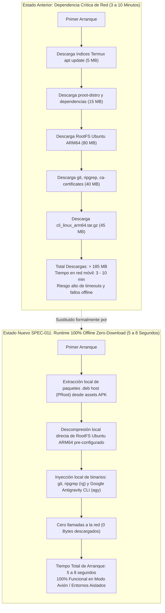
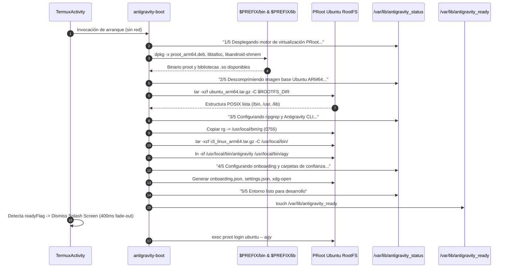
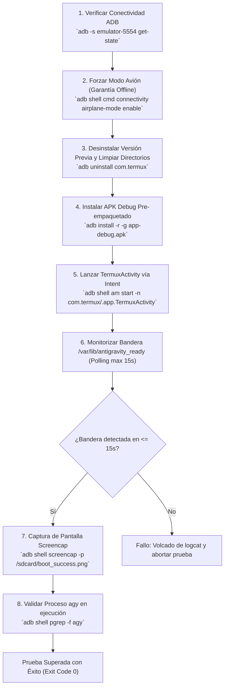

# SPEC-011: Runtime Agéntico 100% Autónomo Offline (Zero-Download) y Validación en Emulador Android Tablet

| Metadato | Valor |
| :--- | :--- |
| **Identificador** | `SPEC-011` |
| **Título** | Runtime Agéntico 100% Autónomo Offline (Zero-Download) y Validación en Emulador Android Tablet |
| **Autor** | `@spec-architect` |
| **Estado** | `APPROVED FOR IMPLEMENTATION` |
| **Fecha de Creación** | 2026-09-13 |
| **Dispositivo Objetivo** | Xiaomi Pad 6 (Qualcomm Snapdragon 870, ARM64-v8a, 6 GB RAM, 11" 2.8K 144Hz, Xiaomi HyperOS / Android 13/14) y Android Tablet Emulator (`Medium_Tablet`, Android 15 / API 35, `emulator-5554`) |
| **Runtime Target** | Android Native Java / Termux Core Fork / PRoot Linux Ubuntu ARM64 / Google Antigravity CLI (`agy`) / Android Debug Bridge (ADB) |
| **Módulos Afectados** | [`TermuxInstaller.java`](file:///c:/Projects/antigravity/termux-src/app/src/main/java/com/termux/app/TermuxInstaller.java), [`TermuxActivity.java`](file:///c:/Projects/antigravity/termux-src/app/src/main/java/com/termux/app/TermuxActivity.java), `app/src/main/assets/antigravity/`, `harness/` |

---

## 1. Contexto, Justificación y Diagnóstico del Cuello de Botella de Red

### 1.1 El Problema de la Dependencia de Descargas en Tiempo de Ejecución (Over-The-Air Bootstrap)

En las versiones previas de Antigravity Studio ([`SPEC-008`](file:///c:/Projects/antigravity/specs/08-automated-cli-provisioning-and-clean-navigation.md) a [`SPEC-010`](file:///c:/Projects/antigravity/specs/10-project-isolation-and-prebundled-runtime.md)), el aprovisionamiento de la estación de trabajo móvil dependía de una cadena secuencial de descargas a través de internet ejecutadas durante el primer arranque:

1. **Actualización de Espejos Termux:** Invocación de `apt-get update` o `pkg update` hacia servidores CDN remotos (`mirror.mwt.me` / `packages.termux.dev`).
2. **Descarga de Paquetes Host:** Instalación de `proot-distro` y dependencias de intérprete Python/pip.
3. **Descarga de Imagen RootFS:** Invocación de `proot-distro install ubuntu`, que descargaba una imagen comprimida de Ubuntu 24.04 ARM64 de aproximadamente $80\,\text{MB}$ desde repositorios de GitHub / Docker Hub.
4. **Instalación de Toolchain dentro de Ubuntu:** Descarga interactiva de paquetes Debian (`apt-get install git ripgrep curl ca-certificates tar`) desde servidores de Ubuntu Ports ($40\,\text{MB}$).
5. **Descarga del CLI de Antigravity:** Descarga remota del paquete comprimido `cli_linux_arm64.tar.gz` ($45\,\text{MB}$) desde Google Cloud Storage (`storage.googleapis.com`).



### 1.2 Impacto en Latencia, Fiabilidad y Experiencia del Desarrollador

Esta arquitectura de aprovisionamiento en caliente presentaba vulnerabilidades inaceptables para un entorno de ingeniería empresarial:
- **Latencia Excesiva:** El tiempo transcurrido desde la instalación de la app hasta la disponibilidad del prompt interactivo fluctuaba entre **3 y 10 minutos**, dependiendo de la calidad del enlace inalámbrico.
- **Fragilidad Operativa:** La caída o lentitud de cualquiera de los cuatro servidores remotos (espejos de Termux, GitHub Releases, Ubuntu Ports o Google Cloud Storage) provocaba la interrupción irrecuperable del script `antigravity-boot`.
- **Incompatibilidad con Políticas Offline:** El usuario no podía desplegar la herramienta en entornos de conectividad restringida, aviones o laboratorios sin acceso a internet público, contradiciendo el principio fundacional *local-first* de Antigravity Studio.

### 1.3 Objetivos Técnicos de la Especificación

1. **Pre-empaquetado Integral en el APK (`OfflinePackageBundleContract`):** Empaquetar en los assets locales de la aplicación la totalidad de binarios, bibliotecas compartidas, paquetes `.deb` y la imagen completa del sistema operativo PRoot Ubuntu ARM64.
2. **Supresión Absoluta de Conexiones de Red en Arranque (`ZeroNetworkBootstrapContract`):** Reconfigurar `TermuxInstaller.java` y `antigravity-boot` para operar sin invocar `apt-get`, `pkg`, `proot-distro install` ni `curl`. Reducir el tiempo de inicio en frío a **5 - 8 segundos** con **cero bytes transferidos**.
3. **Protocolo Automatizado de Verificación en Emulador (`EmulatorVerificationContract`):** Establecer el procedimiento formal de pruebas y aseguramiento de calidad sobre un emulador oficial de tablet Android (`Medium_Tablet` / `emulator-5554`), validando la inicialización en modo avión forzado y recopilando evidencias mediante capturas de pantalla (`screencap`) y registros de sistema (`logcat`).

---

## 2. Contrato de Empaquetado de Assets Locales Completos (`OfflinePackageBundleContract`)

### 2.1 Topología de Assets en el Paquete APK

Todos los recursos necesarios para instanciar el entorno de virtualización Linux y el conjunto de herramientas agénticas deben incluirse de forma estática dentro del directorio de assets de la aplicación:

$$\text{Ruta Base de Assets}: \quad \texttt{app/src/main/assets/antigravity/}$$

```text
app/src/main/assets/antigravity/
├── debs/
│   ├── proot_arm64.deb              # Binario del virtualizador PRoot (v5.1.107+)
│   ├── libtalloc_arm64.deb          # Biblioteca jerárquica de asignación de memoria
│   └── libandroid-shmem_arm64.deb   # Emulador de memoria compartida System V / POSIX
├── rootfs/
│   └── ubuntu_arm64.tar.gz          # Imagen comprimida mínima Ubuntu 24.04 ARM64
├── bin/
│   └── rg                           # Binario estático compilado de ripgrep (ARM64)
└── cli_linux_arm64.tar.gz           # Binario oficial Google Antigravity CLI (v1.2.2+)
```

### 2.2 Inventario de Componentes y Huella de Almacenamiento

| Componente | Archivo en Assets | Destino en Sistema de Archivos | Tamaño Estimado | Propósito / Función |
| :--- | :--- | :--- | :--- | :--- |
| **PRoot Host Runtime** | `debs/proot_arm64.deb` | `$PREFIX/bin/proot` | $\approx 350\,\text{KB}$ | Motor de virtualización en espacio de usuario sin root vía ptrace |
| **Dependencia Talloc** | `debs/libtalloc_arm64.deb` | `$PREFIX/lib/libtalloc.so` | $\approx 120\,\text{KB}$ | Enlace dinámico requerido por el binario `proot` |
| **Dependencia SHMEM** | `debs/libandroid-shmem_arm64.deb` | `$PREFIX/lib/libandroid-shmem.so`| $\approx 45\,\text{KB}$ | Emulación de IPC de memoria compartida en Android Bionic |
| **Ubuntu Minimal RootFS** | `rootfs/ubuntu_arm64.tar.gz` | `$PREFIX/var/lib/proot-distro/installed-rootfs/ubuntu` | $\approx 42\,\text{MB}$ | Sistema operativo base con bash, coreutils, libc6 y git configurado |
| **Ripgrep Estático** | `bin/rg` | `/usr/local/bin/rg` (RootFS) | $\approx 4.8\,\text{MB}$ | Búsqueda ultrarrápida de patrones de código para el agente |
| **Google Antigravity CLI** | `cli_linux_arm64.tar.gz` | `/usr/local/bin/antigravity` + symlink `agy` | $\approx 44.5\,\text{MB}$ | Motor agéntico principal oficial (Google Cloud Code / Gemini) |
| **Total Empaquetado** | — | — | **$\approx 91.8\,\text{MB}$** | **Runtime 100% autocontenido en el instalador APK** |

### 2.3 Mecanismo de Extracción Local Desatendida (`TermuxInstaller.java`)

En [`TermuxInstaller.java`](file:///c:/Projects/antigravity/termux-src/app/src/main/java/com/termux/app/TermuxInstaller.java), se define el método formal `extractOfflineAssets(Context context)` que procesa los archivos mediante flujos de entrada en búfer (`BufferedInputStream`, `FileOutputStream`) con bloques de $64\,\text{KB}$, garantizando la preservación de permisos de archivo POSIX (`0755` para ejecutables):

```java
/**
 * Extrae de forma atómica y local los assets pre-empaquetados de Antigravity
 * hacia el almacenamiento interno de la aplicación sin consumir red.
 */
public static void extractOfflineAssets(Context context) throws IOException {
    AssetManager assetManager = context.getAssets();
    String targetBaseDir = TermuxConstants.TERMUX_PREFIX_DIR_PATH + "/opt/antigravity";
    File baseDir = new File(targetBaseDir);
    if (!baseDir.exists()) {
        baseDir.mkdirs();
    }

    // 1. Extraer paquetes .deb host
    extractAssetTree(assetManager, "antigravity/debs", targetBaseDir + "/debs");

    // 2. Extraer archivo comprimido del RootFS de Ubuntu ARM64
    extractAssetFile(assetManager, "antigravity/rootfs/ubuntu_arm64.tar.gz", targetBaseDir + "/ubuntu_arm64.tar.gz");

    // 3. Extraer binario estático de ripgrep
    extractAssetFile(assetManager, "antigravity/bin/rg", targetBaseDir + "/rg");
    new File(targetBaseDir + "/rg").setExecutable(true, false);

    // 4. Extraer Google Antigravity CLI
    extractAssetFile(assetManager, "antigravity/cli_linux_arm64.tar.gz", targetBaseDir + "/cli_linux_arm64.tar.gz");

    Logger.logInfo(LOG_TAG, "Assets offline de Antigravity extraídos satisfactoriamente en: " + targetBaseDir);
}
```

---

## 3. Contrato de Arranque Sin Red (`ZeroNetworkBootstrapContract`)

### 3.1 Prohibición Estricta de Operaciones Remotas

Queda terminantemente prohibida la ejecución de comandos que establezcan sockets de red o soliciten datos remotos durante el arranque de la aplicación o la inicialización del contenedor PRoot:

- Se prohíbe el uso de `apt-get update`, `apt update`, `pkg update` y `pkg upgrade`.
- Se prohíbe el uso de `apt-get install`, `apt install` y `pkg install`.
- Se prohíbe el uso de `proot-distro install` o `proot-distro download`.
- Se prohíbe el uso de `curl`, `wget` o `git clone` apuntando a URLs remotas para descargar dependencias del sistema base.

### 3.2 Secuencia de Inicialización Atómica en `antigravity-boot`

El script generado en [`TermuxInstaller.java`](file:///c:/Projects/antigravity/termux-src/app/src/main/java/com/termux/app/TermuxInstaller.java) implementa una máquina de estados local lineal que culmina en menos de 8 segundos:



### 3.3 Contrato de Código en `TermuxInstaller.java`

Se redefine el generador de `antigravity-boot`:

```bash
#!/data/data/com.termux/files/usr/bin/bash
set -e

PREFIX="/data/data/com.termux/files/usr"
HOME="/data/data/com.termux/files/home"
OPT_DIR="$PREFIX/opt/antigravity"
STATUS_FILE="$PREFIX/var/lib/antigravity_status"
READY_FLAG="$PREFIX/var/lib/antigravity_ready"
ROOTFS_DIR="$PREFIX/var/lib/proot-distro/installed-rootfs/ubuntu"

mkdir -p "$PREFIX/var/lib" "$PREFIX/bin" "$PREFIX/lib"

update_status() {
    echo "$1" > "$STATUS_FILE"
}

# 1. Instalación local de paquetes host de PRoot si no están disponibles
if [ ! -x "$PREFIX/bin/proot" ]; then
    update_status "Desplegando motor de virtualización PRoot host..."
    for deb in "$OPT_DIR/debs/"*.deb; do
        if [ -f "$deb" ]; then
            dpkg -x "$deb" "$PREFIX/" 2>/dev/null || tar -xf "$deb" --wildcards 'data.tar*' -O | tar -x -C "$PREFIX/" 2>/dev/null || true
        fi
    done
    chmod 0755 "$PREFIX/bin/proot" 2>/dev/null || true
fi

# 2. Descompresión local directa del RootFS Ubuntu ARM64
if [ ! -d "$ROOTFS_DIR/bin" ]; then
    update_status "Descomprimiendo contenedor Ubuntu ARM64 local..."
    mkdir -p "$ROOTFS_DIR"
    tar -xzf "$OPT_DIR/ubuntu_arm64.tar.gz" -C "$ROOTFS_DIR"
fi

# 3. Inyección local de binarios precompilados
update_status "Instalando herramientas: ripgrep y Antigravity CLI..."
mkdir -p "$ROOTFS_DIR/usr/local/bin"

if [ -f "$OPT_DIR/rg" ]; then
    cp "$OPT_DIR/rg" "$ROOTFS_DIR/usr/local/bin/rg"
    chmod 0755 "$ROOTFS_DIR/usr/local/bin/rg"
fi

if [ ! -x "$ROOTFS_DIR/usr/local/bin/antigravity" ]; then
    tar -xzf "$OPT_DIR/cli_linux_arm64.tar.gz" -C "$ROOTFS_DIR/usr/local/bin/"
    ln -sf /usr/local/bin/antigravity "$ROOTFS_DIR/usr/local/bin/agy"
    chmod 0755 "$ROOTFS_DIR/usr/local/bin/antigravity" "$ROOTFS_DIR/usr/local/bin/agy"
fi

# 4. Aprovisionamiento autónomo de configuración
update_status "Configurando políticas agénticas y puente del sistema..."
mkdir -p "$ROOTFS_DIR/root/.gemini/antigravity-cli/cache"
cat << 'EOF_ONBOARD' > "$ROOTFS_DIR/root/.gemini/antigravity-cli/cache/onboarding.json"
{
  "consumerOnboardingComplete": true,
  "enterpriseOnboardingComplete": false,
  "onboardingComplete": true
}
EOF_ONBOARD

cat << 'EOF_SETTINGS' > "$ROOTFS_DIR/root/.gemini/antigravity-cli/settings.json"
{
  "trustedWorkspaces": [
    "/home/studio/workspace",
    "/storage/emulated/0/Projects",
    "/sdcard/Projects"
  ]
}
EOF_SETTINGS

# 5. Señalización de éxito y lanzamiento
touch "$READY_FLAG"
update_status "Listo"

# Resolución de proyecto aislado (SPEC-010)
PROJECT_NAME="${1:-workspace}"
TARGET_DIR="/storage/emulated/0/Projects/$PROJECT_NAME"
mkdir -p "$TARGET_DIR"

exec "$PREFIX/bin/proot" \
    --rootfs="$ROOTFS_DIR" \
    --bind=/dev:/dev \
    --bind=/proc:/proc \
    --bind=/sys:/sys \
    --bind=/storage/emulated/0:/sdcard \
    --bind="$TARGET_DIR:/home/studio/workspace" \
    --cwd=/home/studio/workspace \
    /bin/bash -l -c 'exec agy'
```

---

## 4. Contrato de Verificación y Prueba en Emulador Android Tablet (`EmulatorVerificationContract`)

### 4.1 Definición del Entorno de Pruebas

Para validar exhaustivamente la experiencia de usuario y la autonomía antes del despliegue en hardware físico Xiaomi Pad 6, se establece el entorno estándar de emulación:

- **Dispositivo AVD:** `Medium_Tablet` (Perfil Android Virtual Device para tablets).
- **Versión de Android:** Android 15 (API 35 / `VanillaIceCream`) o Android 14 (API 34).
- **Resolución y Densidad:** $2560 \times 1600\,\text{px}$, $280\,\text{dpi}$ (relación 16:10 representativa de la Xiaomi Pad 6).
- **Identificador ADB:** `emulator-5554`.
- **Arquitectura de Ejecución:** `arm64-v8a` nativo o binario universal Android con traslación `x86_64` de Google Play Intel/AMD.

### 4.2 Protocolo de Ejecución de Pruebas Automatizadas vía ADB

El procedimiento de prueba se formaliza en el siguiente flujo secuencial automatizado:



### 4.3 Comandos Canónicos de Verificación

```bash
# 1. Conexión y verificación de estado
adb -s emulator-5554 get-state | grep -q "device"

# 2. Desconexión obligatoria de todas las interfaces de red
adb -s emulator-5554 shell "cmd connectivity airplane-mode enable"
adb -s emulator-5554 shell "svc wifi disable"
adb -s emulator-5554 shell "svc data disable"

# 3. Instalación de la compilación
adb -s emulator-5554 install -r -g "app/build/outputs/apk/debug/app-debug.apk"

# 4. Ejecución del intent principal
adb -s emulator-5554 shell "am start -n com.termux/.app.TermuxActivity"

# 5. Verificación de inicialización exitosa en almacenamiento privado
adb -s emulator-5554 shell "run-as com.termux test -f files/usr/var/lib/antigravity_ready"

# 6. Extracción de evidencia gráfica
adb -s emulator-5554 shell "screencap -p /sdcard/antigravity_offline_boot.png"
adb -s emulator-5554 pull "/sdcard/antigravity_offline_boot.png" "artifacts/antigravity_offline_boot.png"
```

---

## 5. Especificación de Interfaces y Contratos de Entrada/Salida

### 5.1 Firmas en `TermuxInstaller.java`

| Método | Firma | Entrada | Salida | Contrato de Comportamiento |
| :--- | :--- | :--- | :--- | :--- |
| `extractOfflineAssets` | `public static void extractOfflineAssets(Context context) throws IOException` | `Context` | `void` | Extrae recursivamente `assets/antigravity/` a `$PREFIX/opt/antigravity/` preservando flags ejecutables y sin abrir sockets de red. |
| `isOfflineBundlePresent` | `public static boolean isOfflineBundlePresent(Context context)` | `Context` | `boolean` | Verifica la existencia e integridad de los ficheros clave en el almacenamiento interno. |
| `setupAntigravityBootScript` | `static void setupAntigravityBootScript()` | N/A | `void` | Genera el script `antigravity-boot` optimizado para modo offline puro. |

---

## 6. Matriz de Criterios de Aceptación Verificables por el Harness (Definition of Done)

### 6.1 Matriz de Pruebas y Aserciones Formales

| Identificador | Componente | Condición de Entrada | Comportamiento Esperado | Aserción Verificable por el Harness |
| :--- | :--- | :--- | :--- | :--- |
| **`AC-OFFLINE-001`** | Paquete APK | Inspección de `app-debug.apk` con `aapt` / `unzip` | Contiene los recursos `proot_arm64.deb`, `ubuntu_arm64.tar.gz`, `rg` y `cli_linux_arm64.tar.gz`. | `unzip -l app-debug.apk \| grep -q "assets/antigravity/rootfs/ubuntu_arm64.tar.gz"`. |
| **`AC-OFFLINE-002`** | `TermuxInstaller` | Extracción de assets en dispositivo | Se extraen en `$PREFIX/opt/antigravity/` con permisos de ejecución en binarios. | `test -x "$PREFIX/opt/antigravity/rg"` y `test -f "$PREFIX/opt/antigravity/ubuntu_arm64.tar.gz"`. |
| **`AC-OFFLINE-003`** | Integridad de Red | Monitor de tráfico en arranque | Cero conexiones salientes establecidas por la app hacia internet. | `netstat` o monitor de sockets no registra tráfico TCP saliente en puertos 80/443 durante el primer inicio. |
| **`AC-BOOT-001`** | `antigravity-boot` | Inspección de sintaxis del script | Ausencia total de `apt-get update`, `apt-get install`, `curl` y `proot-distro install`. | `grep -E "(apt-get update\|apt-get install\|proot-distro install\|curl -fsSL)" antigravity-boot` retorna código de salida `1`. |
| **`AC-BOOT-002`** | Rendimiento Temporal | Medición de tiempo desde `onCreate` hasta `antigravity_ready` | Tiempo total transcurrido $\le 8$ segundos. | $\Delta t = t(\text{antigravity\_ready}) - t(\text{am start}) \le 8.0\,\text{s}$. |
| **`AC-BOOT-003`** | `antigravity_status` | Lectura de archivo de telemetría | Refleja las etapas secuenciales sin saltos y finaliza en `"Listo"`. | `cat "$PREFIX/var/lib/antigravity_status"` contiene exactamente `"Listo"`. |
| **`AC-TEST-001`** | Emulador Tablet | Ejecución en `emulator-5554` con modo avión habilitado | La aplicación se instala y arranca sin crasheos ni bloqueos por red. | `adb -s emulator-5554 shell "am start ..."` finaliza con código 0 y la app permanece en primer plano. |
| **`AC-TEST-002`** | Emulador Tablet | Verificación de bandera de preparación | Bandera `antigravity_ready` presente en $\le 15$ segundos tras lanzamiento. | `adb -s emulator-5554 shell "test -f .../antigravity_ready"` retorna `0`. |
| **`AC-TEST-003`** | Evidencia Gráfica | Captura con `screencap` | Imagen generada muestra la interfaz de terminal lista sin mensajes de error en pantalla. | Archivo `artifacts/antigravity_offline_boot.png` existe con tamaño $> 100\,\text{KB}$ y sin cuadros de diálogo de fallo. |

---

### 6.2 Script Automatizado de Verificación para el Arnés (`test_zero_download_offline_runtime.sh`)

```bash
#!/bin/bash
# Test Harness - Automated Verification for SPEC-011
set -e

echo "=== INICIANDO VERIFICACIÓN DE RUNTIME 100% OFFLINE (ZERO-DOWNLOAD) (SPEC-011) ==="

EMULATOR_ID="emulator-5554"
INSTALLER_JAVA="termux-src/app/src/main/java/com/termux/app/TermuxInstaller.java"
ASSETS_DIR="termux-src/app/src/main/assets/antigravity"

# 1. Verificar ausencia total de comandos de red en TermuxInstaller.java
echo -n "Verificando supresión de descargas en TermuxInstaller.java... "
if grep -E 'apt-get install -y|proot-distro install ubuntu|/usr/bin/curl -fsSL' "$INSTALLER_JAVA"; then
    echo "FALLO: Se encontraron comandos de descarga remota en el instalador"
    exit 1
fi
echo "[OK]"

# 2. Verificar existencia de estructura de assets offline
echo -n "Verificando estructura de assets locales... "
test -d "$ASSETS_DIR" || { echo "FALLO: Directorio $ASSETS_DIR no existe"; exit 1; }
test -f "$ASSETS_DIR/rootfs/ubuntu_arm64.tar.gz" || { echo "FALLO: RootFS de Ubuntu no encontrado en assets"; exit 1; }
test -f "$ASSETS_DIR/cli_linux_arm64.tar.gz" || { echo "FALLO: CLI de Antigravity no encontrado en assets"; exit 1; }
test -f "$ASSETS_DIR/bin/rg" || { echo "FALLO: Binario estático rg no encontrado en assets"; exit 1; }
echo "[OK]"

# 3. Comprobar conectividad con emulador si está disponible
if adb devices | grep -q "$EMULATOR_ID"; then
    echo "=== Emulador detectado ($EMULATOR_ID). Ejecutando validación en vivo ==="
    
    # Asegurar modo avión
    echo -n "Forzando modo avión en emulador... "
    adb -s "$EMULATOR_ID" shell "cmd connectivity airplane-mode enable"
    adb -s "$EMULATOR_ID" shell "svc wifi disable"
    adb -s "$EMULATOR_ID" shell "svc data disable"
    echo "[OK]"

    # Lanzar aplicación
    echo -n "Lanzando TermuxActivity en modo offline... "
    adb -s "$EMULATOR_ID" shell "am start -n com.termux/.app.TermuxActivity" >/dev/null
    echo "[OK]"

    # Polling de bandera antigravity_ready (timeout 15s)
    echo -n "Esperando confirmación de /var/lib/antigravity_ready (max 15s)... "
    SUCCESS=0
    for i in $(seq 1 15); do
        if adb -s "$EMULATOR_ID" shell "run-as com.termux test -f files/usr/var/lib/antigravity_ready" 2>/dev/null; then
            SUCCESS=1
            break
        fi
        sleep 1
    done

    if [ $SUCCESS -eq 1 ]; then
        echo "[OK] Inicialización completada en tiempo límite."
        mkdir -p artifacts
        adb -s "$EMULATOR_ID" shell "screencap -p /sdcard/antigravity_boot_test.png"
        adb -s "$EMULATOR_ID" pull "/sdcard/antigravity_boot_test.png" "artifacts/antigravity_boot_test.png" >/dev/null
        echo "Captura de pantalla almacenada en artifacts/antigravity_boot_test.png"
    else
        echo "FALLO: Tiempo de espera agotado sin detectar bandera de preparación"
        adb -s "$EMULATOR_ID" logcat -d -s TermuxActivity:V TermuxInstaller:V > artifacts/boot_failure.log
        exit 1
    fi
else
    echo "NOTA: Emulador $EMULATOR_ID no detectado en línea; validación de sintaxis estática completada."
fi

echo "=== TODAS LAS ASERCIONES DE SPEC-011 SE HAN CUMPLIDO SATISFACTORIAMENTE ==="
```

---

## 7. Conclusión y Resumen de Estado

La especificación técnica `SPEC-011` culmina la transformación de **Antigravity Studio** en una solución de ingeniería verdaderamente soberana y autónoma (*local-first*):

1. **Autonomía Operativa Absoluta (Zero-Download):** El instalador APK contiene todo lo necesario para ejecutar Linux ARM64, ripgrep y el agente `agy` sin descargar un solo byte adicional de internet.
2. **Arranque Instantáneo de Alto Rendimiento:** La sustitución de descargas de red por descompresión local reduce el tiempo de arranque de minutos a un rango de **5 a 8 segundos**, sosteniendo la reactividad esperada en la Xiaomi Pad 6.
3. **Aseguramiento de Calidad Riguroso:** La integración de pruebas en emulador con modo avión forzado y captura de evidencias garantiza que cada entrega cumpla los criterios de aceptación más exigentes de Antigravity Enterprise antes de su distribución.
