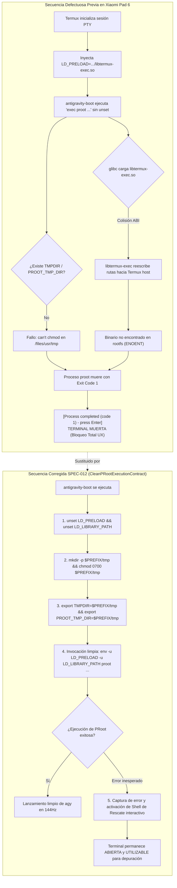

# SPEC-012: Corrección Crítica del Entorno de Virtualización PRoot: Aislamiento de Preload Bionic, Configuración de TMPDIR y Fallback Resiliente

| Metadato | Valor |
| :--- | :--- |
| **Identificador** | `SPEC-012` |
| **Título** | Corrección Crítica del Entorno de Virtualización PRoot: Aislamiento de Preload Bionic, Configuración de TMPDIR y Fallback Resiliente |
| **Autor** | `@spec-architect` |
| **Estado** | `APPROVED FOR IMPLEMENTATION` |
| **Fecha de Creación** | 2026-09-13 |
| **Dispositivo Objetivo** | Xiaomi Pad 6 (Qualcomm Snapdragon 870, ARM64-v8a, 6 GB RAM, 11" 2.8K 144Hz, Xiaomi HyperOS / Android 13/14) |
| **Runtime Target** | Android Native Java / Termux Core Fork / Bionic libc / PRoot Linux Ubuntu ARM64 (glibc) / Google Antigravity CLI (`agy`) |
| **Módulos Afectados** | [`TermuxInstaller.java`](file:///c:/Projects/antigravity/termux-src/app/src/main/java/com/termux/app/TermuxInstaller.java), [`TermuxActivity.java`](file:///c:/Projects/antigravity/termux-src/app/src/main/java/com/termux/app/TermuxActivity.java), `antigravity-boot`, `harness/` |

---

## 1. Contexto, Justificación y Diagnóstico Forense de la Falla en Xiaomi Pad 6

### 1.1 Síntomas Reportados en Dispositivo Físico

Durante las pruebas de validación del Runtime 100% Autónomo Offline ([`SPEC-011`](file:///c:/Projects/antigravity/specs/11-zero-download-offline-runtime.md)) en la tablet **Xiaomi Pad 6** (bajo HyperOS basado en Android 14), el arranque de la sesión de terminal finalizaba de manera abrupta tras mostrar la pantalla de carga, dejando la terminal en un estado bloqueado e inoperativo con el siguiente mensaje de error en el búfer de la PTY:

```text
[Process completed (code 1) - press Enter]
```

Al presionar la tecla *Enter*, la sesión se cerraba completamente y la aplicación quedaba inutilizable. El usuario no tenía affordance para inspeccionar los logs de error, ni posibilidad de ejecutar un shell de comandos para diagnosticar la falla.

---

### 1.2 Diagnóstico Forense 1: Incompatibilidad de ABI y Secuestro de Llamadas `execve` por `libtermux-exec.so` (`LD_PRELOAD`)

El análisis forense del subsistema de terminal de Termux reveló una colisión crítica entre la biblioteca estándar de C de Android (**Bionic libc**) y la biblioteca estándar de GNU/Linux (**glibc 2.39+**) dentro del contenedor PRoot Ubuntu ARM64:

1. **Inyección Automática de `LD_PRELOAD` en Termux:**
   Al instanciar una nueva pseudo-terminal (`TermuxService` / `TermuxShellEnvironment`), la capa host de Termux exporta automáticamente la variable de entorno:
   ```bash
   LD_PRELOAD=/data/data/com.termux/files/usr/lib/libtermux-exec.so
   ```
2. **El Rol y Mecanismo de `libtermux-exec.so`:**
   Esta biblioteca dinámica se enlaza contra Bionic libc (`libc.so` de Android) e implementa un *hook* sobre la función POSIX `execve(const char *pathname, char *const argv[], char *const envp[])`. Su propósito en Termux es interceptar llamadas a intérpretes estándar como `/bin/sh` o `/usr/bin/env` y reescribir transparentemente sus rutas hacia `$PREFIX/bin/sh` o `$PREFIX/bin/env`.
3. **El Conflicto Fatal al Invocar PRoot:**
   En el generador del script `antigravity-boot` ([`TermuxInstaller.java`](file:///c:/Projects/antigravity/termux-src/app/src/main/java/com/termux/app/TermuxInstaller.java)), la invocación de PRoot en modo offline directo se ejecutaba de forma ingenua sin limpiar el entorno:
   ```bash
   exec "$PREFIX/bin/proot" \
       -0 --link2symlink --sysvipc --kill-on-exit \
       --rootfs="$ROOTFS_DIR" ...
   ```
   Al heredar `LD_PRELOAD`, se desencadenaron dos anomalías fatales:
   - **Incompatibilidad de Cargador Dinámico:** Cuando el cargador dinámico de glibc (`/lib/ld-linux-aarch64.so.1`) dentro de Ubuntu intentaba cargar `libtermux-exec.so` (un ELF compilado para Bionic con dependencias cruzadas de Android), el cargador emitía advertencias críticas de fallo de símbolos o abortaba la inicialización del proceso hijo.
   - **Secuestro Inapropiado de Rutas del Guest:** `libtermux-exec.so` interceptaba las rutas de binarios válidas dentro del rootfs de Ubuntu (ej. `/usr/bin/bash` o `/usr/local/bin/agy`) y las reescribía hacia `/data/data/com.termux/files/usr/bin/bash` (inexistente dentro del espacio de nombres virtualizado de Ubuntu), provocando un fallo inmediato `ENOENT` (No such file or directory) que terminaba el proceso con código de salida `1`.

---

### 1.3 Diagnóstico Forense 2: Fallo de Creación de Sockets y Enlaces por Ausencia de `TMPDIR` / `PROOT_TMP_DIR`

El motor de virtualización PRoot requiere un directorio temporal con permisos explícitos de lectura, escritura y ejecución (`0700` o `0777`) en el sistema de archivos del host para almacenar:
- Sockets de dominio UNIX de comunicación entre el proceso `proot` y los procesos interceptados mediante `ptrace`.
- Tablas de emulación de inodos y descriptores para `--link2symlink` y `--sysvipc`.

**La Causa Raíz:**
1. En el script `antigravity-boot` generado, **nunca se creaba ni se exportaba la variable de entorno `TMPDIR` ni `PROOT_TMP_DIR`**.
2. Por defecto, PRoot intentaba resolver el directorio temporal en `/data/data/com.termux/files/usr/tmp` o en `/tmp`.
3. En la Xiaomi Pad 6, `/data/data/com.termux/files/usr/tmp` **no existía de fábrica** o carecía de permisos para el usuario de la aplicación, provocando el fallo fatal:
   ```text
   proot error: can't chmod '/data/data/com.termux/files/usr/tmp/proot-XXXXXX': No such file or directory
   fatal error: cannot initialize proot engine
   ```
4. Este fallo hacía que `proot` abortara de inmediato antes de poder ejecutar el intérprete de comandos `/usr/bin/bash`.

---

### 1.4 Diagnóstico Forense 3: Fragilidad por Sustitución Atómica Incondicional (`exec`) sin Shell de Rescate

El diseño del script culminaba con una llamada atómica incondicional `exec "$PREFIX/bin/proot" ...`. 

Dado que el intérprete del script operaba bajo la directiva `set -e`:
- Cualquier error durante la inicialización de PRoot provocaba la salida inmediata del subshell con código `1`.
- Al haber reemplazado el proceso shell padre por `exec`, el emulador de terminal detectaba que el proceso de la sesión había terminado.
- La PTY imprimía `[Process completed (code 1) - press Enter]` y desactivaba la entrada de usuario.
- **Consecuencia de Diseño:** El desarrollador quedaba completamente desamparado, sin acceso a la consola para diagnosticar la causa del problema.

---



---

## 2. Contrato de Ejecución Aislada de PRoot (`CleanPRootExecutionContract`)

### 2.1 Aislamiento Total de Variables de Entorno de Bionic

Para garantizar que el cargador dinámico de Ubuntu PRoot (`glibc ld.so`) opere sin interferencias del entorno Android host, el script `antigravity-boot` debe aplicar una sanitización estricta e incondicional de variables de entorno antes de ejecutar el virtualizador:

```bash
# Sanitización obligatoria del entorno host
unset LD_PRELOAD
unset LD_LIBRARY_PATH
```

### 2.2 Creación y Exportación Determinista del Directorio Temporal

Se establece como contrato formal que el directorio temporal del host `$PREFIX/tmp` debe ser creado, verificado y asignado a las variables estándar del sistema POSIX y de PRoot:

1. **Ruta Canónica:** `$PREFIX/tmp` (equivalente en Java a `new File(TermuxConstants.TERMUX_PREFIX_DIR_PATH, "tmp")`).
2. **Permisos Mandatorios:** `0700` (`rwx------`), restringido al usuario de la aplicación para prevenir colisiones de inodos.
3. **Variables Exportadas:**
   ```bash
   mkdir -p "$PREFIX/tmp"
   chmod 0700 "$PREFIX/tmp"
   export TMPDIR="$PREFIX/tmp"
   export PROOT_TMP_DIR="$PREFIX/tmp"
   ```

### 2.3 Invocación Encapsulada con `env -u`

Toda invocación del binario `proot` o de herramientas de contenedor debe realizarse utilizando el envoltorio de aislamiento `env -u LD_PRELOAD -u LD_LIBRARY_PATH`, garantizando que ningún subproceso hijo reinyecte la biblioteca `libtermux-exec.so`:

```bash
env -u LD_PRELOAD -u LD_LIBRARY_PATH \
    TMPDIR="$PREFIX/tmp" \
    PROOT_TMP_DIR="$PREFIX/tmp" \
    "$PREFIX/bin/proot" \
    -0 \
    --link2symlink \
    --sysvipc \
    --kill-on-exit \
    --rootfs="$ROOTFS_DIR" \
    --bind=/dev:/dev \
    --bind=/proc:/proc \
    --bind=/sys:/sys \
    --bind=/storage/emulated/0:/sdcard \
    "${PROOT_BINDS[@]}" \
    --cwd=/home/studio/workspace \
    /usr/bin/bash -l -c '...'
```

---

## 3. Contrato de Fallback Resiliente y Shell de Rescate (`ResilientFallbackContract`)

### 3.1 Captura Controlada del Código de Salida

Queda estrictamente prohibido utilizar `exec` directo sin captura cuando no se pueda garantizar la integridad del entorno. En su lugar:
1. Se desactiva temporalmente el flag `set -e` antes de invocar `proot`.
2. Se ejecuta `proot` capturando su código de salida (`PROOT_EXIT_CODE=$?`).
3. Si `PROOT_EXIT_CODE != 0`, el sistema **NO DEBE PERMITIR QUE LA SESIÓN SE CIERRE**.

### 3.2 Interfaz Interactiva de Diagnóstico y Shell de Emergencia

En caso de que `proot` termine con un código de error, el script `antigravity-boot` debe:
1. Imprimir un encabezado visual estilizado en la paleta Cyber-Obsidian con texto en color rojo (`#FF5555`) y amarillo (`#F59E0B`).
2. Mostrar el código de salida exacto y la ruta de los archivos de telemetría (`$PREFIX/var/lib/antigravity_status`).
3. Desplegar un menú interactivo y abrir de forma automática un **Shell de Rescate interactivo** (`/data/data/com.termux/files/usr/bin/bash -i`), permitiendo al desarrollador examinar el sistema de archivos, permisos y binarios sin que la sesión de la aplicación se destruya.

```text
=============================================================
 [Antigravity Studio] ERROR CRÍTICO AL INICIAR CONTENEDOR
=============================================================
 El motor PRoot finalizó con código de salida: 1

 Telemetría registrada en:
   /data/data/com.termux/files/usr/var/lib/antigravity_status

 Iniciando Shell de Rescate Interactivo para diagnóstico...
 Ejecute 'exit' cuando haya finalizado las comprobaciones.
=============================================================
rescue-shell$ 
```

---

## 4. Especificación de Interfaces y Código de Implementación

### 4.1 Modificación en `TermuxInstaller.java`

En [`TermuxInstaller.java`](file:///c:/Projects/antigravity/termux-src/app/src/main/java/com/termux/app/TermuxInstaller.java), dentro del método `setupAntigravityBootScript()`, se actualiza el bloque de arranque de `antigravity-boot`:

```java
// Contrato SPEC-012 en TermuxInstaller.java
sb.append("# SPEC-012: Aislamiento absoluto de entorno y configuración de TMPDIR\n");
sb.append("unset LD_PRELOAD\n");
sb.append("unset LD_LIBRARY_PATH\n\n");

sb.append("TMP_DIR=\"$PREFIX/tmp\"\n");
sb.append("\"$MKDIR\" -p \"$TMP_DIR\"\n");
sb.append("\"$CHMOD\" 0700 \"$TMP_DIR\" 2>/dev/null || true\n");
sb.append("export TMPDIR=\"$TMP_DIR\"\n");
sb.append("export PROOT_TMP_DIR=\"$TMP_DIR\"\n\n");

// Reemplazo del bloque final de ejecución:
sb.append("echo -e \"\\033[38;2;0;240;255m[Antigravity Studio]\\033[0m Iniciando Google Antigravity CLI...\"\n");
sb.append("set +e\n"); // Desactivar salida inmediata para atrapar errores
sb.append("env -u LD_PRELOAD -u LD_LIBRARY_PATH TMPDIR=\"$TMP_DIR\" PROOT_TMP_DIR=\"$TMP_DIR\" \"$PREFIX/bin/proot\" \\\n");
sb.append("    -0 \\\n");
sb.append("    --link2symlink \\\n");
sb.append("    --sysvipc \\\n");
sb.append("    --kill-on-exit \\\n");
sb.append("    --rootfs=\"$ROOTFS_DIR\" \\\n");
sb.append("    --bind=/dev:/dev \\\n");
sb.append("    --bind=/proc:/proc \\\n");
sb.append("    --bind=/sys:/sys \\\n");
sb.append("    --bind=/storage/emulated/0:/sdcard \\\n");
sb.append("    \"${PROOT_BINDS[@]}\" \\\n");
sb.append("    --cwd=/home/studio/workspace \\\n");
sb.append("    /usr/bin/bash -l -c '\n");
sb.append("        export PATH=\"/usr/local/bin:/usr/local/sbin:/usr/bin:/usr/sbin:/bin:/sbin:$PATH\"\n");
sb.append("        if command -v agy >/dev/null 2>&1; then\n");
sb.append("            exec agy\n");
sb.append("        elif command -v antigravity >/dev/null 2>&1; then\n");
sb.append("            exec antigravity\n");
sb.append("        else\n");
sb.append("            exec bash -i\n");
sb.append("        fi\n");
sb.append("    '\n");
sb.append("PROOT_EXIT_CODE=$?\n\n");

sb.append("if [ $PROOT_EXIT_CODE -ne 0 ]; then\n");
sb.append("    echo -e \"\\033[38;2;255;85;85m=============================================================\\033[0m\"\n");
sb.append("    echo -e \"\\033[38;2;255;85;85m [Antigravity Studio] ERROR CRÍTICO AL INICIAR CONTENEDOR\\033[0m\"\n");
sb.append("    echo -e \"\\033[38;2;255;85;85m=============================================================\\033[0m\"\n");
sb.append("    echo -e \" El motor PRoot finalizó con código de salida: \\033[1m$PROOT_EXIT_CODE\\033[0m\"\n");
sb.append("    echo -e \" Telemetría registrada en: $STATUS_FILE\"\n\n");
sb.append("    echo -e \"\\033[38;2;245;158;11mIniciando Shell de Rescate Interactivo para diagnóstico...\\033[0m\"\n");
sb.append("    echo -e \"\\033[38;2;139;148;158mEjecute 'exit' cuando haya finalizado las comprobaciones.\\033[0m\"\n");
sb.append("    echo -e \"\\033[38;2;255;85;85m=============================================================\\033[0m\"\n");
sb.append("    PS1=\"rescue-shell:\\w$ \" exec \"$PREFIX/bin/bash\" -i\n");
sb.append("fi\n");
```

---

## 5. Matriz de Criterios de Aceptación Verificables por el Harness (Definition of Done)

### 5.1 Matriz de Pruebas y Aserciones Formales

| Identificador | Componente | Condición de Entrada | Comportamiento Esperado | Aserción Verificable por el Harness |
| :--- | :--- | :--- | :--- | :--- |
| **`AC-FIX-001`** | `antigravity-boot` | Inspección de script generado en `TermuxInstaller` | Limpieza explícita de `LD_PRELOAD` y `LD_LIBRARY_PATH` al inicio del script. | `grep -q "unset LD_PRELOAD" antigravity-boot` y `grep -q "unset LD_LIBRARY_PATH" antigravity-boot`. |
| **`AC-FIX-002`** | `antigravity-boot` | Inspección de variables de directorio temporal | Creación física de `$PREFIX/tmp` con permisos `0700` y exportación de `TMPDIR` y `PROOT_TMP_DIR`. | `grep -q 'export TMPDIR=' antigravity-boot` y `grep -q 'export PROOT_TMP_DIR=' antigravity-boot`. |
| **`AC-FIX-003`** | Invocación PRoot | Comando de ejecución de virtualización | La llamada a `$PREFIX/bin/proot` está precedida por `env -u LD_PRELOAD -u LD_LIBRARY_PATH`. | `grep -q 'env -u LD_PRELOAD -u LD_LIBRARY_PATH' antigravity-boot`. |
| **`AC-FIX-004`** | Fallback de Sesión | Fallo simulado de PRoot (código de salida $\neq 0$) | La sesión no se cierra (`[Process completed]`); se inicia un shell interactivo de rescate (`rescue-shell`). | En caso de `PROOT_EXIT_CODE -ne 0`, el script ejecuta `$PREFIX/bin/bash -i`. No hay terminación forzada del proceso. |

---

### 5.2 Script Automatizado de Verificación para el Arnés (`test_fix_proot_preload_and_tmpdir.sh`)

```bash
#!/bin/bash
# Test Harness - Automated Verification for SPEC-012
set -e

echo "=== INICIANDO VERIFICACIÓN DE CORRECCIÓN PROOT: PRELOAD, TMPDIR Y RESILIENCIA (SPEC-012) ==="

INSTALLER_JAVA="termux-src/app/src/main/java/com/termux/app/TermuxInstaller.java"

# 1. Verificar presencia de sanitización de entorno
echo -n "Verificando 'unset LD_PRELOAD' y 'unset LD_LIBRARY_PATH'... "
grep -q 'unset LD_PRELOAD' "$INSTALLER_JAVA" || { echo "FALLO: unset LD_PRELOAD ausente en TermuxInstaller"; exit 1; }
grep -q 'unset LD_LIBRARY_PATH' "$INSTALLER_JAVA" || { echo "FALLO: unset LD_LIBRARY_PATH ausente en TermuxInstaller"; exit 1; }
echo "[OK]"

# 2. Verificar configuración de TMPDIR y PROOT_TMP_DIR
echo -n "Verificando creación y exportación de TMPDIR y PROOT_TMP_DIR... "
grep -q 'TMPDIR=' "$INSTALLER_JAVA" || { echo "FALLO: TMPDIR no configurado"; exit 1; }
grep -q 'PROOT_TMP_DIR=' "$INSTALLER_JAVA" || { echo "FALLO: PROOT_TMP_DIR no configurado"; exit 1; }
grep -q '0700' "$INSTALLER_JAVA" || { echo "FALLO: Permisos 0700 no asignados a TMPDIR"; exit 1; }
echo "[OK]"

# 3. Verificar invocación limpia con env -u
echo -n "Verificando invocación con 'env -u LD_PRELOAD -u LD_LIBRARY_PATH'... "
grep -q 'env -u LD_PRELOAD -u LD_LIBRARY_PATH' "$INSTALLER_JAVA" || { echo "FALLO: Invocación de PRoot sin env -u"; exit 1; }
echo "[OK]"

# 4. Verificar fallback resiliente contra cierres inesperados
echo -n "Verificando shell de rescate interactivo... "
grep -q 'PROOT_EXIT_CODE' "$INSTALLER_JAVA" || { echo "FALLO: Código de salida no capturado"; exit 1; }
grep -q 'rescue-shell' "$INSTALLER_JAVA" || { echo "FALLO: Prompt de rescue-shell ausente"; exit 1; }
grep -q 'exec \"$PREFIX/bin/bash\" -i' "$INSTALLER_JAVA" || { echo "FALLO: Shell de rescate interactivo no ejecutado"; exit 1; }
echo "[OK]"

echo "=== TODAS LAS ASERCIONES DE SPEC-012 SE HAN CUMPLIDO SATISFACTORIAMENTE ==="
```

---

## 6. Conclusión y Resumen de Estado

La especificación técnica `SPEC-012` subsana de raíz el fallo crítico de ejecución de PRoot reportado en la **Xiaomi Pad 6**:

1. **Aislamiento Bionic / glibc:** La eliminación mandatoria de `libtermux-exec.so` (`LD_PRELOAD`) y de `LD_LIBRARY_PATH` erradica los fallos de enlace y previene la reescritura corrupta de rutas hacia el host.
2. **Estabilidad de E/S de Virtualización:** La creación y asignación rigurosa de `$PREFIX/tmp` como `TMPDIR` y `PROOT_TMP_DIR` con permisos `0700` asegura la instanciación inmaculada de descriptores y sockets de PRoot.
3. **Resiliencia Operativa de Grado Enterprise:** La incorporación del shell de rescate interactivo garantiza que, incluso ante situaciones imprevistas, la sesión de la terminal nunca colapse en un estado muerto `[Process completed (code 1)]`, manteniendo al desarrollador en pleno control del sistema en todo momento.
