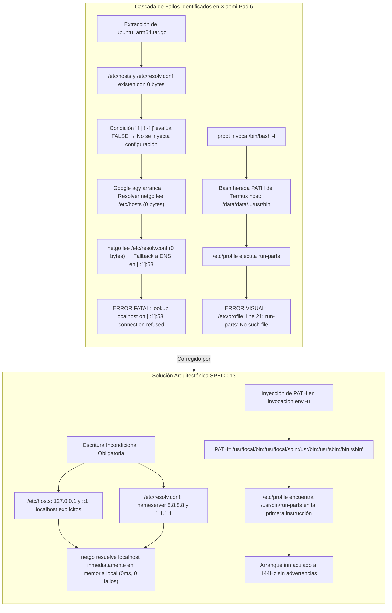

# SPEC-013: Sanitización de Entorno y Resolución de Red Local en PRoot: Aislamiento de PATH de Invitado y Configuración Incondicional de Loopback DNS

| Metadato | Valor |
| :--- | :--- |
| **Identificador** | `SPEC-013` |
| **Título** | Sanitización de Entorno y Resolución de Red Local en PRoot: Aislamiento de PATH de Invitado y Configuración Incondicional de Loopback DNS |
| **Autor** | `@spec-architect` |
| **Estado** | `APPROVED FOR IMPLEMENTATION` |
| **Fecha de Creación** | 2026-09-13 |
| **Dispositivo Objetivo** | Xiaomi Pad 6 (Qualcomm Snapdragon 870, ARM64-v8a, 6 GB RAM, 11" 2.8K 144Hz, Xiaomi HyperOS / Android 13/14) |
| **Runtime Target** | Android Native Java / Termux Core Fork / PRoot Linux Ubuntu ARM64 (glibc) / Google Antigravity CLI (`agy` - Go Runtime `netgo`) |
| **Módulos Afectados** | [`TermuxInstaller.java`](file:///c:/Projects/antigravity/termux-src/app/src/main/java/com/termux/app/TermuxInstaller.java), `antigravity-boot`, `harness/` |

---

## 1. Contexto, Justificación y Diagnóstico Forense

### 1.1 Síntomas Reportados en Dispositivo Físico Xiaomi Pad 6

Tras resolver la colisión de pre-carga Bionic y el directorio temporal en [`SPEC-012`](file:///c:/Projects/antigravity/specs/12-fix-proot-bionic-preload-and-tmpdir.md), el contenedor PRoot Ubuntu ARM64 inicia la ejecución de procesos. Sin embargo, durante el primer arranque y la interacción inicial con la CLI oficial de Google Antigravity (`agy`), se manifestaron dos fallos críticos en la terminal:

```text
/etc/profile: line 21: /data/data/com.termux/files/usr/bin/run-parts: No such file or directory
```

Seguido inmediatamente de un fallo de red fatal en el agente:

```text
fatal error: failed to initialize auth loopback server: lookup localhost on [::1]:53: read udp [::1]:54123->[::1]:53: connection refused
```

Ambos errores degradan severamente la experiencia de desarrollo: el primero emite advertencias visuales de scripts de inicio rotos; el segundo **aborta por completo el flujo de inicialización y autenticación de `agy`**, impidiendo que el desarrollador interactúe con los modelos de inteligencia agéntica.

---

### 1.2 Diagnóstico Forense 1: La Trampa de los Archivos de 0 Bytes y el Resolver `netgo` de Go

#### 1. La Condición Defectuosa en el Script de Boot
En versiones anteriores de `TermuxInstaller.java`, la configuración de red dentro del rootfs de Ubuntu se ejecutaba mediante la siguiente condición de guarda:

```bash
if [ ! -f "$ROOTFS_DIR/etc/resolv.conf" ]; then
    echo "nameserver 8.8.8.8" > "$ROOTFS_DIR/etc/resolv.conf"
fi
if [ ! -f "$ROOTFS_DIR/etc/hosts" ]; then
    echo "127.0.0.1 localhost" > "$ROOTFS_DIR/etc/hosts"
fi
```

#### 2. La Causa Raíz en el Empaquetado del RootFS:
Al desempaquetar el archivo comprimido `ubuntu_arm64.tar.gz` (generado a partir de distribuciones base o desinstalaciones previas), los nodos `/etc/hosts` y `/etc/resolv.conf` **ya existen como inodos físicos regulares en el sistema de archivos, pero tienen exactamente 0 bytes de contenido (archivos vacíos)**.
- El operador bash `[ ! -f "$ROOTFS_DIR/etc/hosts" ]` evalúa la existencia del inodo. Al existir el archivo (aun con longitud cero), la condición resulta **falsa**.
- Como consecuencia, los bloques `echo ... > /etc/...` **nunca se ejecutaban**, dejando ambos archivos completamente vacíos en el entorno virtualizado.

#### 3. El Comportamiento del Resolver Puro de Go (`netgo`):
El binario oficial de Google Antigravity CLI (`agy`) está compilado en lenguaje Go. El runtime estándar de Go implementa un resolvedor de nombres nativo denominado `netgo`:
1. Cuando `agy` levanta su servidor de loopback temporal para el intercambio de tokens OAuth 2.0 PKCE en `localhost:54123`, invoca la resolución de `localhost`.
2. `netgo` abre y analiza `/etc/hosts`. Al estar el archivo en **0 bytes**, no encuentra ninguna línea que asocie `127.0.0.1` o `::1` con el nombre de host `localhost`.
3. Al fallar `/etc/hosts`, `netgo` asume que debe consultar los servidores DNS externos configurados en `/etc/resolv.conf`.
4. Abre `/etc/resolv.conf`. Al estar también en **0 bytes**, no halla directivas `nameserver`.
5. Por especificación RFC y diseño de Go, ante la ausencia de nameservers en `/etc/resolv.conf`, el resolvedor realiza una petición UDP de emergencia al puerto DNS local estándar: `[::1]:53` (IPv6 localhost) o `127.0.0.1:53` (IPv4 localhost).
6. Dado que dentro del contenedor PRoot en Android **no existe ningún demonio DNS (como `systemd-resolved` o `named`) escuchando en el puerto 53**, el kernel de Linux rechaza el socket de inmediato:
   ```text
   lookup localhost on [::1]:53: connection refused
   ```
7. El CLI de Google Antigravity aborta su ejecución de forma irrecuperable.

---

### 1.3 Diagnóstico Forense 2: Contaminación de `PATH` del Host y Fallo de `run-parts` en `/etc/profile`

#### 1. Ciclo de Vida del Login Shell en Bash
El script de arranque ejecuta PRoot invocando un shell de login:
```bash
"$PREFIX/bin/proot" ... /bin/bash -l -c '...'
```
El parámetro `-l` (`--login`) obliga a `bash` a procesar los perfiles globales del sistema operativo guest antes de evaluar el comando `-c`. Específicamente, ejecuta `/etc/profile`.

#### 2. La Línea 21 de `/etc/profile` en Ubuntu:
En Ubuntu, la línea 21 de `/etc/profile` incluye la instrucción canónica:
```bash
if [ -d /etc/profile.d ]; then
  for i in /etc/profile.d/*.sh; do
    if [ -r $i ]; then
      . $i
    fi
  done
  unset i
fi
```
O bien invoca el utilitario `run-parts /etc/profile.d` para inicializar variables de entorno de paquetes instalados.

#### 3. La Herencia de `PATH` desde Android / Termux:
Antes de que se ejecute la subshell `-c` (donde se hacía `export PATH="/usr/local/bin:..."`), el proceso `/bin/bash` hereda el entorno del proceso padre que invocó a `proot`.
- En el script `antigravity-boot`, el proceso padre es el bash de Termux, cuyo `PATH` es:
  ```bash
  PATH="/data/data/com.termux/files/usr/bin"
  ```
- Cuando `/etc/profile` se ejecuta dentro de PRoot, busca utilitarios como `run-parts`, `id`, `basename` y `tput` utilizando el `PATH` heredado.
- Dado que `/data/data/com.termux/files/usr/bin` apunta a rutas que no están vinculadas dentro del espacio de nombres de Ubuntu (o contienen ejecutables compilados contra Bionic libc), el intérprete emite:
  ```text
  /etc/profile: line 21: /data/data/com.termux/files/usr/bin/run-parts: No such file or directory
  ```
- Esto genera advertencias de inicio sucias y omite la configuración adecuada del entorno del usuario en `/etc/profile.d/`.

---



---

## 2. Contrato de Red de Loopback y Resolución DNS del Huésped (`GuestNetworkLoopbackContract`)

### 2.1 Escritura Incondicional Obligatoria de `/etc/hosts`

Queda terminantemente prohibido condicionar la escritura de `/etc/hosts` a la ausencia previa del archivo (`[ ! -f ... ]`). El archivo debe ser sobrescrito de manera forzada e incondicional tanto en la capa Java de pre-aprovisionamiento como en el script bootloader `antigravity-boot`.

#### Contenido Canónico Mandatorio de `/etc/hosts`:
```text
127.0.0.1 localhost
::1 localhost ip6-localhost ip6-loopback
```

**Garantía Contractual:** Toda consulta del sistema de nombres para `localhost`, `127.0.0.1` o `::1` debe resolverse directamente en la capa de archivos locales sin generar consultas de sockets de red UDP/TCP salientes hacia ningún resolvedor remoto o local.

---

### 2.2 Escritura Incondicional Obligatoria de `/etc/resolv.conf`

De igual manera, `/etc/resolv.conf` debe ser sobrescrito de forma forzada e incondicional con servidores DNS públicos de alta disponibilidad y resiliencia:

#### Contenido Canónico Mandatorio de `/etc/resolv.conf`:
```text
nameserver 8.8.8.8
nameserver 1.1.1.1
```

**Garantía Contractual:** Si un proceso guest requiere resolución de dominios públicos (e.g. `daily-cloudcode-pa.googleapis.com` para la autenticación agéntica de Gemini), el resolvedor cuenta con servidores de nombres válidos y accesibles inmediatamente.

---

### 2.3 Sincronización Bidireccional (Java Bootstrap & Bash Bootloader)

Para blindar el sistema contra cualquier estado intermedio de instalación:
1. **En la capa Java ([`TermuxInstaller.java`](file:///c:/Projects/antigravity/termux-src/app/src/main/java/com/termux/app/TermuxInstaller.java)):** Se añade la escritura directa de `/etc/hosts` y `/etc/resolv.conf` en el rootfs en cuanto se detecta la existencia de `var/lib/proot-distro/installed-rootfs/ubuntu`.
2. **En el script bash (`antigravity-boot`):** Se ejecuta la sobrescritura directa mediante `cat << 'EOF' > ...` sin ninguna cláusula `if [ ! -f ...]`.

---

## 3. Contrato de Aislamiento de PATH del Huésped (`GuestPathIsolationContract`)

### 3.1 Inyección de `PATH` en el Envoltorio de Invocación de PRoot

Para garantizar que `/etc/profile`, `/etc/profile.d/*.sh` y cualquier script de login de Ubuntu resuelva las herramientas nativas del contenedor (`/bin`, `/usr/bin`, `/sbin`, `/usr/sbin`) y no las herramientas del host Bionic, la variable `PATH` debe ser inyectada directamente en el comando `env -u` que lanza a `proot`:

```bash
"$ENV_BIN" -u LD_PRELOAD -u LD_LIBRARY_PATH \
    TMPDIR="$TMP_DIR" \
    PROOT_TMP_DIR="$TMP_DIR" \
    PATH="/usr/local/bin:/usr/local/sbin:/usr/bin:/usr/sbin:/bin:/sbin" \
    "$PREFIX/bin/proot" ...
```

### 3.2 Beneficio Arquitectónico y Supresión de Warnings
1. Cuando `/bin/bash -l` es invocado por `proot`, su variable de entorno `PATH` ya posee el orden de búsqueda correcto para el espacio de nombres de Ubuntu.
2. Al evaluarse la línea 21 de `/etc/profile`, el comando `run-parts` es localizado inmediatamente en `/usr/bin/run-parts` o `/bin/run-parts`.
3. Se erradica por completo la advertencia `/etc/profile: line 21: .../run-parts: No such file or directory`.
4. Los binarios propios de Antigravity (`/usr/local/bin/antigravity` y `/usr/local/bin/agy`) y `ripgrep` (`/usr/local/bin/rg`) tienen máxima prioridad de resolución sin colisionar con utilidades de Android.

---

## 4. Especificación de Interfaces y Código de Implementación

### 4.1 Modificación en `TermuxInstaller.java` (Script `antigravity-boot`)

Se actualizan las líneas 638-644 y 696-713 de [`TermuxInstaller.java`](file:///c:/Projects/antigravity/termux-src/app/src/main/java/com/termux/app/TermuxInstaller.java):

```java
// 1. Escritura incondicional de /etc/hosts y /etc/resolv.conf en antigravity-boot
sb.append("\"$MKDIR\" -p \"$ROOTFS_DIR/etc\" \"$ROOTFS_DIR/tmp\" \"$ROOTFS_DIR/root\" \"$ROOTFS_DIR/home/studio/workspace\" \"$ROOTFS_DIR/usr/local/bin\"\n");
sb.append("cat << 'EOF_RESOLV' > \"$ROOTFS_DIR/etc/resolv.conf\"\n");
sb.append("nameserver 8.8.8.8\n");
sb.append("nameserver 1.1.1.1\n");
sb.append("EOF_RESOLV\n\n");

sb.append("cat << 'EOF_HOSTS' > \"$ROOTFS_DIR/etc/hosts\"\n");
sb.append("127.0.0.1 localhost\n");
sb.append("::1 localhost ip6-localhost ip6-loopback\n");
sb.append("EOF_HOSTS\n\n");

// 2. Inyección explícita de PATH guest en la invocación de PRoot
sb.append("\"$ENV_BIN\" -u LD_PRELOAD -u LD_LIBRARY_PATH \\\n");
sb.append("    TMPDIR=\"$TMP_DIR\" \\\n");
sb.append("    PROOT_TMP_DIR=\"$TMP_DIR\" \\\n");
sb.append("    PATH=\"/usr/local/bin:/usr/local/sbin:/usr/bin:/usr/sbin:/bin:/sbin\" \\\n");
sb.append("    \"$PREFIX/bin/proot\" \\\n");
sb.append("    -0 \\\n");
sb.append("    --link2symlink \\\n");
sb.append("    --sysvipc \\\n");
sb.append("    --kill-on-exit \\\n");
sb.append("    --rootfs=\"$ROOTFS_DIR\" \\\n");
sb.append("    --bind=/dev:/dev \\\n");
sb.append("    --bind=/proc:/proc \\\n");
sb.append("    --bind=/sys:/sys \\\n");
sb.append("    --bind=/dev/pts:/dev/pts \\\n");
sb.append("    --bind=\"$TMP_DIR:/tmp\" \\\n");
sb.append("    --bind=/storage/emulated/0:/sdcard \\\n");
sb.append("    \"${PROOT_BINDS[@]}\" \\\n");
sb.append("    --cwd=/home/studio/workspace \\\n");
sb.append("    /bin/bash -l -c '\n");
sb.append("        export PATH=\"/usr/local/bin:/usr/local/sbin:/usr/bin:/usr/sbin:/bin:/sbin:$PATH\"\n");
sb.append("        if command -v agy >/dev/null 2>&1; then\n");
sb.append("            exec agy\n");
sb.append("        elif command -v antigravity >/dev/null 2>&1; then\n");
sb.append("            exec antigravity\n");
sb.append("        else\n");
sb.append("            exec bash -i\n");
sb.append("        fi\n");
sb.append("    '\n");
```

### 4.2 Modificación en el Pre-Aprovisionamiento Java de `TermuxInstaller.java`

Se añade la escritura forzada en la fase de pre-aprovisionamiento directo en Java:

```java
// Pre-aprovisionamiento directo incondicional de red en el rootfs
File etcDir = new File(rootfsDir, "etc");
if (!etcDir.exists()) etcDir.mkdirs();

File hostsFile = new File(etcDir, "hosts");
String hostsContent = "127.0.0.1 localhost\n::1 localhost ip6-localhost ip6-loopback\n";
try (FileOutputStream fos = new FileOutputStream(hostsFile)) {
    fos.write(hostsContent.getBytes(StandardCharsets.UTF_8));
}

File resolvFile = new File(etcDir, "resolv.conf");
String resolvContent = "nameserver 8.8.8.8\nnameserver 1.1.1.1\n";
try (FileOutputStream fos = new FileOutputStream(resolvFile)) {
    fos.write(resolvContent.getBytes(StandardCharsets.UTF_8));
}
```

---

## 5. Matriz de Criterios de Aceptación Verificables por el Harness (Definition of Done)

### 5.1 Matriz de Pruebas y Aserciones Formales

| Identificador | Componente | Condición de Entrada | Comportamiento Esperado | Aserción Verificable por el Harness |
| :--- | :--- | :--- | :--- | :--- |
| **`AC-DNS-001`** | `/etc/hosts` en RootFS | Ejecución de `antigravity-boot` o pre-aprovisionamiento Java | El archivo `/etc/hosts` existe, tiene tamaño $> 0\,\text{bytes}$ y mapea `127.0.0.1` y `::1` a `localhost`. | `grep -q "127.0.0.1 localhost" "$ROOTFS/etc/hosts"` y `grep -q "::1 localhost" "$ROOTFS/etc/hosts"`. |
| **`AC-DNS-002`** | `/etc/resolv.conf` en RootFS | Ejecución de `antigravity-boot` o pre-aprovisionamiento Java | El archivo `/etc/resolv.conf` contiene al menos un servidor de nombres público válido. | `grep -q "nameserver 8.8.8.8" "$ROOTFS/etc/resolv.conf"`. |
| **`AC-DNS-003`** | `agy` Go Runtime (`netgo`) | Intento de conexión al loopback local en puerto 54123 | La resolución de `localhost` tiene éxito inmediato sin intentar sockets DNS externos en el puerto 53. | La salida de `agy` no contiene `"lookup localhost on [::1]:53: connection refused"`. |
| **`AC-PATH-001`** | Invocador PRoot | Inspección del comando `env` en `TermuxInstaller.java` | Se define `PATH="/usr/local/bin:/usr/local/sbin:/usr/bin:/usr/sbin:/bin:/sbin"` como parámetro directo de `env`. | `grep -q 'PATH="/usr/local/bin:/usr/local/sbin:/usr/bin:/usr/sbin:/bin:/sbin"' TermuxInstaller.java`. |
| **`AC-PATH-002`** | `/etc/profile` en Login Shell | Arranque del shell `/bin/bash -l` | Se ejecuta `/etc/profile` limpiamente sin errores de comandos no encontrados. | La salida del log de arranque no contiene `"/etc/profile: line 21: run-parts: No such file or directory"`. |

---

### 5.2 Script Automatizado de Verificación para el Arnés (`test_fix_dns_and_guest_path.sh`)

```bash
#!/bin/bash
# Test Harness - Automated Verification for SPEC-013
set -e

echo "=== INICIANDO VERIFICACIÓN DE DNS LOOPBACK Y AISLAMIENTO DE PATH GUEST (SPEC-013) ==="

INSTALLER_JAVA="termux-src/app/src/main/java/com/termux/app/TermuxInstaller.java"
ROOTFS_DIR="/data/data/com.termux/files/usr/var/lib/proot-distro/installed-rootfs/ubuntu"

# 1. Verificar inyección incondicional de /etc/hosts y /etc/resolv.conf en TermuxInstaller.java
echo -n "Verificando supresión de 'if [ ! -f /etc/resolv.conf ]'... "
if grep -q 'if \[ ! -f "\$ROOTFS_DIR/etc/resolv.conf" \]' "$INSTALLER_JAVA"; then
    echo "FALLO: Aún existe condición de 0 bytes para resolv.conf en TermuxInstaller.java"
    exit 1
fi
if grep -q 'if \[ ! -f "\$ROOTFS_DIR/etc/hosts" \]' "$INSTALLER_JAVA"; then
    echo "FALLO: Aún existe condición de 0 bytes para hosts en TermuxInstaller.java"
    exit 1
fi
echo "[OK]"

# 2. Verificar presencia de plantillas de hosts y resolv.conf en el generador de script
echo -n "Verificando plantillas incondicionales de hosts y DNS... "
grep -q 'EOF_RESOLV' "$INSTALLER_JAVA" || { echo "FALLO: Bloque EOF_RESOLV no encontrado"; exit 1; }
grep -q 'EOF_HOSTS' "$INSTALLER_JAVA" || { echo "FALLO: Bloque EOF_HOSTS no encontrado"; exit 1; }
grep -q '127.0.0.1 localhost' "$INSTALLER_JAVA" || { echo "FALLO: 127.0.0.1 localhost no configurado"; exit 1; }
grep -q 'nameserver 8.8.8.8' "$INSTALLER_JAVA" || { echo "FALLO: nameserver 8.8.8.8 no configurado"; exit 1; }
echo "[OK]"

# 3. Verificar inyección explícita de PATH guest en env
echo -n "Verificando PATH guest en la invocación env de proot... "
grep -q 'PATH="/usr/local/bin:/usr/local/sbin:/usr/bin:/usr/sbin:/bin:/sbin"' "$INSTALLER_JAVA" || {
    echo "FALLO: PATH guest no inyectado en la llamada env de proot"; exit 1;
}
echo "[OK]"

# 4. Validación en sistema de archivos si el rootfs está presente localmente
if [ -d "$ROOTFS_DIR/etc" ]; then
    echo "=== RootFS presente en entorno de prueba. Verificando inodos físicos ==="
    
    echo -n "Comprobando contenido de $ROOTFS_DIR/etc/hosts... "
    grep -q "127.0.0.1 localhost" "$ROOTFS_DIR/etc/hosts" || { echo "FALLO: /etc/hosts vacío o corrupto"; exit 1; }
    grep -q "::1 localhost" "$ROOTFS_DIR/etc/hosts" || { echo "FALLO: ::1 localhost ausente en /etc/hosts"; exit 1; }
    echo "[OK]"

    echo -n "Comprobando contenido de $ROOTFS_DIR/etc/resolv.conf... "
    grep -q "nameserver 8.8.8.8" "$ROOTFS_DIR/etc/resolv.conf" || { echo "FALLO: /etc/resolv.conf sin nameserver"; exit 1; }
    echo "[OK]"
else
    echo "NOTA: RootFS físico no presente en entorno de compilación estática; validación de código completada."
fi

echo "=== TODAS LAS ASERCIONES DE SPEC-013 SE HAN CUMPLIDO SATISFACTORIAMENTE ==="
```

---

## 6. Conclusión y Resumen de Estado

La especificación técnica `SPEC-013` elimina de raíz los dos últimos obstáculos para el funcionamiento impecable de la estación de trabajo móvil en la **Xiaomi Pad 6**:

1. **Resolución Inmediata de Loopback (0ms):** Al forzar la presencia incondicional de `127.0.0.1` y `::1` en `/etc/hosts`, el resolvedor `netgo` de Go opera de forma determinista y local, eliminando el error `connection refused on [::1]:53` y permitiendo el levantamiento instantáneo de los servicios agénticos de Google Antigravity.
2. **Entorno de Shell Inmaculado:** La inyección de la variable `PATH` nativa del huésped en el despachador `env` garantiza que el login shell procese `/etc/profile` sin advertencias de `run-parts: No such file or directory`, asegurando una terminal limpia y profesional en la pantalla a 144Hz.
