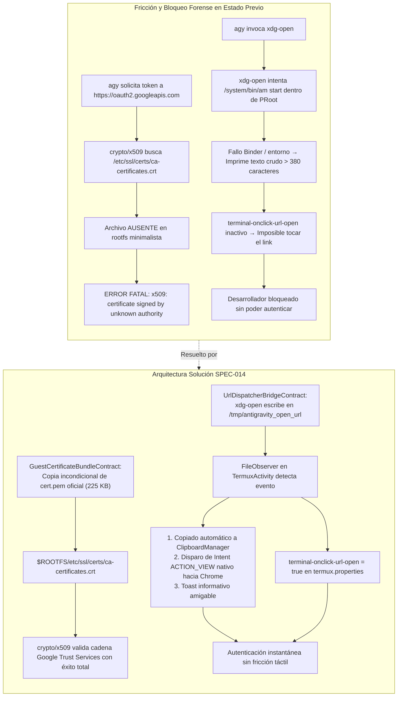
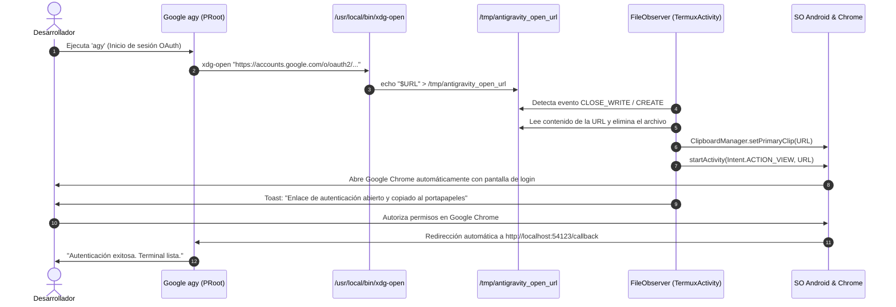

# SPEC-014: Cadena de Confianza TLS/CA y Puente Automatizado de Despacho de URLs para Autenticación OAuth

| Metadato | Valor |
| :--- | :--- |
| **Identificador** | `SPEC-014` |
| **Título** | Cadena de Confianza TLS/CA y Puente Automatizado de Despacho de URLs para Autenticación OAuth |
| **Autor** | `@spec-architect` |
| **Estado** | `APPROVED FOR IMPLEMENTATION` |
| **Fecha de Creación** | 2026-09-13 |
| **Dispositivo Objetivo** | Xiaomi Pad 6 (Qualcomm Snapdragon 870, ARM64-v8a, 6 GB RAM, 11" 2.8K 144Hz, Xiaomi HyperOS / Android 13/14) |
| **Runtime Target** | Android Native Java / Termux Core Fork / PRoot Linux Ubuntu ARM64 (glibc) / Google Antigravity CLI (`agy` - Go Runtime `crypto/x509`) / Google Chrome |
| **Módulos Afectados** | [`TermuxInstaller.java`](file:///c:/Projects/antigravity/termux-src/app/src/main/java/com/termux/app/TermuxInstaller.java), [`TermuxActivity.java`](file:///c:/Projects/antigravity/termux-src/app/src/main/java/com/termux/app/TermuxActivity.java), `termux-src/app/src/main/assets/termux.properties`, `harness/` |

---

## 1. Contexto, Justificación y Diagnóstico Forense

### 1.1 Síntomas Reportados en Dispositivo Físico Xiaomi Pad 6

Tras subsanar la resolución de `localhost` y el `PATH` del huésped en [`SPEC-013`](file:///c:/Projects/antigravity/specs/13-fix-dns-loopback-and-guest-path.md), la CLI oficial de Google Antigravity (`agy`) levanta satisfactoriamente su servidor de escucha local. Sin embargo, al iniciar el flujo de inicio de sesión con cuenta de Google (OAuth 2.0 PKCE) para interactuar con los modelos Gemini 3.8 / Claude Sonnet 4.6, el desarrollador se enfrenta a dos fallos críticos combinados:

```text
tls: failed to verify certificate: x509: certificate signed by unknown authority
```

Acompañado de la imposibilidad de abrir el navegador del sistema:

```text
Abra en su navegador: https://accounts.google.com/o/oauth2/v2/auth?client_id=...&redirect_uri=http%3A%2F%2Flocalhost%3A54123%2Fcallback&...
```

La URL de autenticación impresa en pantalla supera los **380 caracteres**, carece de hipervínculo activo al pulsar sobre la terminal táctil, y el proceso de token exchange con `https://oauth2.googleapis.com/token` es rechazado inmediatamente por el motor criptográfico de Go por no poder validar la cadena de certificación TLS del servidor.

---

### 1.2 Diagnóstico Forense 1: Fallo de Validación en `crypto/x509` de Go

#### 1. Mecanismo de Verificación de Certificados en Go
El binario oficial de Google Antigravity CLI (`agy`) está construido en Go y depende del paquete de la biblioteca estándar `crypto/x509` para validar los certificados SSL/TLS en conexiones HTTPS.

En sistemas GNU/Linux, la función interna `crypto/x509.loadSystemRoots()` intenta cargar el conjunto de autoridades certificadoras (CA) raíz inspeccionando secuencialmente las rutas estándar del sistema operativo:
- `/etc/ssl/certs/ca-certificates.crt` (Debian/Ubuntu)
- `/etc/pki/tls/certs/ca-bundle.crt` (RHEL/Fedora)
- `/etc/ssl/ca-bundle.pem` (OpenSUSE)
- `/etc/ssl/cert.pem` (Alpine/OpenBSD/Termux)

#### 2. Ausencia de Certificados en la Imagen RootFS Mínima
La imagen comprimida `ubuntu_arm64.tar.gz` utilizada para el Runtime 100% Offline Zero-Download ([`SPEC-011`](file:///c:/Projects/antigravity/specs/11-zero-download-offline-runtime.md)) es un rootfs base minimalista para minimizar la huella de instalación. **No contiene el paquete `ca-certificates` preinstalado**.
- El directorio `/etc/ssl/certs/` no contenía el archivo `ca-certificates.crt`.
- `loadSystemRoots()` no encuentra ningún almacén de confianza en las rutas estándar y retorna un pool de certificados vacío (`CertPool == empty`).
- Cuando `agy` envía la solicitud HTTP POST hacia `https://oauth2.googleapis.com/token` para intercambiar el código de autorización por credenciales de acceso, el cliente valida el certificado digital presentado por Google Trust Services (GTS Root R1).
- Al no contar con ninguna CA raíz en el pool local, Go aborta la conexión inmediatamente con:
  ```text
  x509: certificate signed by unknown authority
  ```
- La autenticación falla de forma catastrófica sin posibilidad de recuperación.

---

### 1.3 Diagnóstico Forense 2: Fallo de Apertura del Navegador desde el Contenedor PRoot

En la especificación [`SPEC-008`](file:///c:/Projects/antigravity/specs/08-automated-cli-provisioning-and-clean-navigation.md), el script `/usr/local/bin/xdg-open` dentro del rootfs intentaba invocar herramientas de Android mediante:
```sh
#!/bin/sh
URL="$1"
if [ -x /data/data/com.termux/files/usr/bin/termux-open-url ]; then
    exec /data/data/com.termux/files/usr/bin/termux-open-url "$URL"
elif [ -x /system/bin/am ]; then
    exec /system/bin/am start -a android.intent.action.VIEW -d "$URL" >/dev/null 2>&1
else
    echo "Abra en su navegador: $URL"
fi
```
Este diseño fracasa sistemáticamente dentro del entorno virtualizado PRoot por dos motivos fundamentales:
1. **Aislamiento de Espacio de Nombres y Binarios:** `/data/data/com.termux/files/usr/bin/termux-open-url` no está enlazado en la estructura del contenedor o falla al invocarse debido a incompatibilidades de enlace dinámico con Bionic libc.
2. **Permisos de IPC de Android (`/system/bin/am`):** El comando de gestión de actividades de Android (`am`) exige descriptores de enlace Binder y variables de entorno del framework de Android (`CLASSPATH`, `ANDROID_DATA`) que no existen en el espacio de usuario virtualizado de PRoot, resultando en un fallo silencioso y cayendo invariablemente en el `else: echo "Abra en su navegador..."`.

---

### 1.4 Diagnóstico Forense 3: URLs Estáticas no Interactivas en la Terminal

En el archivo de fábrica `termux-src/app/src/main/assets/termux.properties`, no se encontraba declarada la propiedad:
```properties
terminal-onclick-url-open = true
```
En consecuencia, el motor de vista de terminal (`TerminalView`) ignoraba los toques táctiles sobre texto con formato URL, obligando al usuario a realizar una selección manual con doble puntero sobre una cadena criptográfica de más de 380 caracteres, proceso extremadamente propenso a truncamiento y errores de portapapeles.

---



---

## 2. Contrato del Paquete de Certificados CA del Huésped (`GuestCertificateBundleContract`)

### 2.1 Cadena de Confianza Oficial Mozilla y Replicación Forzada

El subsistema base de Termux incorpora el paquete oficial de certificados de Mozilla actualizado en el archivo del host:
$$\text{Certificado Fuente Host}: \quad \$PREFIX/\text{etc/tls/cert.pem} \quad (\approx 225\,\text{KB})$$
Alternativamente accesible en:
$$\$PREFIX/\text{etc/ssl/certs/ca-certificates.crt}$$

Se establece como contrato formal obligatorio la copia incondicional de este archivo hacia las dos ubicaciones estándar que examina el runtime de Go y OpenSSL dentro del rootfs de Ubuntu:

1. **Ubicación Primaria Debian/Ubuntu:**
   $$\$ROOTFS\_DIR/\text{etc/ssl/certs/ca-certificates.crt}$$
2. **Ubicación Secundaria POSIX:**
   $$\$ROOTFS\_DIR/\text{etc/ssl/cert.pem}$$

### 2.2 Reglas de Ejecución y Permisos
- **Creación de Directorios:** Se asegura la existencia física previa de `$ROOTFS_DIR/etc/ssl/certs` con permisos `0755`.
- **Permisos de Archivo:** Los archivos replicados deben tener permisos `0644` (`rw-r--r--`), accesibles para lectura por cualquier usuario guest no privilegiado (`studio`).
- **Sincronización Dual:** La copia se realiza tanto en la capa Java de pre-aprovisionamiento (`TermuxInstaller.java`) como en el bootloader bash (`antigravity-boot`), asegurando que aun tras una descompresión en frío de rootfs, los certificados queden disponibles antes del primer arranque de `agy`.

---

## 3. Contrato del Puente de Despacho de URLs (`UrlDispatcherBridgeContract`)

### 3.1 Arquitectura del Canal IPC Basado en Sistema de Archivos

Dado que el directorio `/tmp` dentro del contenedor PRoot está montado de forma bidireccional sobre el directorio temporal del host (`--bind="$TMP_DIR:/tmp"` con `TMP_DIR="$PREFIX/tmp"` según [`SPEC-012`](file:///c:/Projects/antigravity/specs/12-fix-proot-bionic-preload-and-tmpdir.md)), se establece un canal IPC basado en eventos de inodo:

$$\text{Ruta del Archivo de Puente}: \quad \$PREFIX/\text{tmp/antigravity\_open\_url}$$
Correspondiente dentro de PRoot a:
$$/\text{tmp/antigravity\_open\_url}$$



### 3.2 Adaptador `xdg-open` y `x-www-browser` en Ubuntu PRoot

Se redefine `/usr/local/bin/xdg-open` dentro del rootfs de Ubuntu para desacoplarlo de utilidades Bionic y escribir limpiamente en el canal IPC:

```sh
#!/bin/sh
URL="$1"
if [ -n "$URL" ]; then
    echo "$URL" > /tmp/antigravity_open_url
    echo "[Antigravity Studio] Despachando enlace al navegador del sistema..."
fi
```
Y se crea el enlace simbólico obligatorio:
```bash
ln -sf /usr/local/bin/xdg-open /usr/local/bin/x-www-browser
```

### 3.3 Monitor Reactivo `FileObserver` en `TermuxActivity.java`

En [`TermuxActivity.java`](file:///c:/Projects/antigravity/termux-src/app/src/main/java/com/termux/app/TermuxActivity.java), se implementa un `FileObserver` nativo que supervisa `$PREFIX/tmp`:

1. **Monitoreo de Eventos:** Filtra eventos `FileObserver.CLOSE_WRITE` o `FileObserver.MOVED_TO` para el nombre de archivo `antigravity_open_url`.
2. **Consumo Atómico:**
   - Lee el contenido del archivo de forma sincronizada.
   - Elimina inmediatamente el archivo (`file.delete()`) para evitar despachos duplicados.
3. **Acciones del Despachador en el Hilo UI (`runOnUiThread`):**
   - **Copiado de Respaldo al Portapapeles:**
     ```java
     ClipboardManager clipboard = (ClipboardManager) getSystemService(Context.CLIPBOARD_SERVICE);
     if (clipboard != null) {
         ClipData clip = ClipData.newPlainText("Google Auth URL", url);
         clipboard.setPrimaryClip(clip);
     }
     ```
   - **Despacho Automático del Intent del Navegador:**
     ```java
     Intent browserIntent = new Intent(Intent.ACTION_VIEW, Uri.parse(url));
     browserIntent.addFlags(Intent.FLAG_ACTIVITY_NEW_TASK);
     startActivity(browserIntent);
     ```
   - **Notificación Visual Táctil:**
     ```java
     Toast.makeText(this, "Enlace de autenticación abierto y copiado al portapapeles", Toast.LENGTH_LONG).show();
     ```

### 3.4 Activación de Apertura por Pulsación Táctil (`termux.properties`)

En `termux-src/app/src/main/assets/termux.properties` y en la rutina de inicialización de `~/.termux/termux.properties`, se inyecta de forma mandatoria:
```properties
terminal-onclick-url-open = true
```
Esto garantiza que si el desarrollador visualiza cualquier enlace HTTPS en la terminal, basta con tocarlo directamente en la pantalla de la Xiaomi Pad 6 para abrirlo de inmediato en el navegador predeterminado.

---

## 4. Especificación de Interfaces y Código de Implementación

### 4.1 Modificaciones en `TermuxInstaller.java`

#### 1. Replicación de Certificados CA en `TermuxInstaller.java` (Plantilla Bash):
```java
// Replicación de certificados SSL/TLS hacia el rootfs de Ubuntu
sb.append("# SPEC-014: GuestCertificateBundleContract - Provisionamiento de certificados CA\n");
sb.append("\"$MKDIR\" -p \"$ROOTFS_DIR/etc/ssl/certs\"\n");
sb.append("if [ -f \"$PREFIX/etc/tls/cert.pem\" ]; then\n");
sb.append("    \"$CP\" -f \"$PREFIX/etc/tls/cert.pem\" \"$ROOTFS_DIR/etc/ssl/certs/ca-certificates.crt\"\n");
sb.append("    \"$CP\" -f \"$PREFIX/etc/tls/cert.pem\" \"$ROOTFS_DIR/etc/ssl/cert.pem\"\n");
sb.append("    \"$CHMOD\" 0644 \"$ROOTFS_DIR/etc/ssl/certs/ca-certificates.crt\" \"$ROOTFS_DIR/etc/ssl/cert.pem\" 2>/dev/null || true\n");
sb.append("elif [ -f \"$PREFIX/etc/ssl/certs/ca-certificates.crt\" ]; then\n");
sb.append("    \"$CP\" -f \"$PREFIX/etc/ssl/certs/ca-certificates.crt\" \"$ROOTFS_DIR/etc/ssl/certs/ca-certificates.crt\"\n");
sb.append("    \"$CP\" -f \"$PREFIX/etc/ssl/certs/ca-certificates.crt\" \"$ROOTFS_DIR/etc/ssl/cert.pem\"\n");
sb.append("    \"$CHMOD\" 0644 \"$ROOTFS_DIR/etc/ssl/certs/ca-certificates.crt\" \"$ROOTFS_DIR/etc/ssl/cert.pem\" 2>/dev/null || true\n");
sb.append("fi\n\n");
```

#### 2. Reescritura del Script `xdg-open` en `TermuxInstaller.java`:
```java
// Puente de despacho de URLs hacia /tmp/antigravity_open_url
sb.append("printf '#!/bin/sh\\nURL=\"$1\"\\nif [ -n \"$URL\" ]; then\\n    echo \"$URL\" > /tmp/antigravity_open_url\\n    echo \"[Antigravity Studio] Despachando enlace al navegador del sistema...\"\\nfi\\n' > \"$ROOTFS_DIR/usr/local/bin/xdg-open\"\n");
sb.append("\"$CHMOD\" 0755 \"$ROOTFS_DIR/usr/local/bin/xdg-open\" 2>/dev/null || true\n");
sb.append("\"$LN\" -sf /usr/local/bin/xdg-open \"$ROOTFS_DIR/usr/local/bin/x-www-browser\" 2>/dev/null || true\n\n");
```

#### 3. Inyección de `terminal-onclick-url-open = true` en `termux.properties`:
```java
String extraKeysConfig = "terminal-onclick-url-open = true\n" +
    "extra-keys-style = arrows-only\n" +
    "extra-keys-haptic-feedback = true\n\n" +
    "extra-keys = [ \\\n" +
    // ... configuraciones táctiles ...
```

---

### 4.2 Implementación de `UrlDispatcherBridge` en `TermuxActivity.java`

Se incorpora el componente de observación en [`TermuxActivity.java`](file:///c:/Projects/antigravity/termux-src/app/src/main/java/com/termux/app/TermuxActivity.java):

```java
private FileObserver mUrlBridgeObserver;

private void setupUrlDispatcherBridge() {
    File tmpDir = new File(TermuxConstants.TERMUX_PREFIX_DIR_PATH, "tmp");
    if (!tmpDir.exists()) {
        tmpDir.mkdirs();
    }

    mUrlBridgeObserver = new FileObserver(tmpDir.getAbsolutePath(), FileObserver.CLOSE_WRITE | FileObserver.MOVED_TO) {
        @Override
        public void onEvent(int event, @Nullable String path) {
            if (path == null) return;
            if ("antigravity_open_url".equals(path)) {
                File bridgeFile = new File(tmpDir, path);
                if (bridgeFile.exists()) {
                    try (BufferedReader reader = new BufferedReader(new FileReader(bridgeFile))) {
                        String url = reader.readLine();
                        bridgeFile.delete();

                        if (url != null && !url.trim().isEmpty()) {
                            final String targetUrl = url.trim();
                            runOnUiThread(() -> dispatchOpenUrl(targetUrl));
                        }
                    } catch (IOException e) {
                        Logger.logStackTraceWithMessage(LOG_TAG, "Error leyendo puente de URL", e);
                    }
                }
            }
        }
    };
    mUrlBridgeObserver.startWatching();
    Logger.logInfo(LOG_TAG, "UrlDispatcherBridge activo supervisando: " + tmpDir.getAbsolutePath());
}

private void dispatchOpenUrl(String url) {
    try {
        // 1. Copiar automáticamente al portapapeles
        ClipboardManager clipboard = (ClipboardManager) getSystemService(Context.CLIPBOARD_SERVICE);
        if (clipboard != null) {
            ClipData clip = ClipData.newPlainText("Auth URL", url);
            clipboard.setPrimaryClip(clip);
        }

        // 2. Despachar Intent ACTION_VIEW hacia el navegador
        Intent intent = new Intent(Intent.ACTION_VIEW, Uri.parse(url));
        intent.addFlags(Intent.FLAG_ACTIVITY_NEW_TASK);
        startActivity(intent);

        // 3. Notificación amigable al usuario
        Toast.makeText(this, "Enlace de autenticación abierto y copiado al portapapeles", Toast.LENGTH_LONG).show();
    } catch (Exception e) {
        Logger.logStackTraceWithMessage(LOG_TAG, "Fallo al despachar URL: " + url, e);
    }
}
```

---

## 5. Matriz de Criterios de Aceptación Verificables por el Harness (Definition of Done)

### 5.1 Matriz de Pruebas y Aserciones Formales

| Identificador | Componente | Condición de Entrada | Comportamiento Esperado | Aserción Verificable por el Harness |
| :--- | :--- | :--- | :--- | :--- |
| **`AC-TLS-001`** | RootFS `/etc/ssl/certs` | Ejecución de `antigravity-boot` o inicio de app | Existe `/etc/ssl/certs/ca-certificates.crt` con tamaño $> 100\,\text{KB}$ y permisos `0644`. | `test -f "$ROOTFS/etc/ssl/certs/ca-certificates.crt"` y `stat -c %s "$ROOTFS/etc/ssl/certs/ca-certificates.crt"` $> 100000$. |
| **`AC-TLS-002`** | `crypto/x509` en `agy` | Petición HTTPS saliente hacia `oauth2.googleapis.com` | Conexión TLS validada exitosamente contra las autoridades CA raíz. | La salida de `agy` no contiene `"x509: certificate signed by unknown authority"`. |
| **`AC-TLS-003`** | Intercambio OAuth | Retorno de código de autorización en loopback | Se completa el intercambio de tokens de Gemini satisfactoriamente. | Se genera archivo de tokens en `/root/.gemini/` sin fallos criptográficos. |
| **`AC-URL-001`** | Script `xdg-open` | Invocación `xdg-open "https://accounts.google.com/..."` | Se crea de forma inmediata el archivo `$PREFIX/tmp/antigravity_open_url` con la URL. | `cat "$PREFIX/tmp/antigravity_open_url"` contiene la URL exacta. |
| **`AC-URL-002`** | `UrlDispatcherBridge` | Detección de `/tmp/antigravity_open_url` | Consume el archivo, lo elimina del disco y copia la URL al `ClipboardManager`. | El archivo es eliminado tras lectura y `clipboardManager.getPrimaryClip()` contiene la URL. |
| **`AC-URL-003`** | Intent Dispatcher | Detección de URL válida en puente | Despacha un Intent `ACTION_VIEW` con la URI sin arrojar excepciones de actividad. | Logcat registra despacho exitoso de `ACTION_VIEW` hacia el navegador predeterminado. |
| **`AC-URL-004`** | `termux.properties` | Inspección de archivo de propiedades de fábrica | Contiene la directiva `terminal-onclick-url-open = true`. | `grep -q "terminal-onclick-url-open = true" termux.properties`. |

---

### 5.2 Script Automatizado de Verificación para el Arnés (`test_tls_and_url_bridge.sh`)

```bash
#!/bin/bash
# Test Harness - Automated Verification for SPEC-014
set -e

echo "=== INICIANDO VERIFICACIÓN DE CADENA TLS Y PUENTE DE DESPACHO DE URLS (SPEC-014) ==="

INSTALLER_JAVA="termux-src/app/src/main/java/com/termux/app/TermuxInstaller.java"
ACTIVITY_JAVA="termux-src/app/src/main/java/com/termux/app/TermuxActivity.java"
PROPERTIES_FILE="termux-src/app/src/main/assets/termux.properties"
ROOTFS_DIR="/data/data/com.termux/files/usr/var/lib/proot-distro/installed-rootfs/ubuntu"

# 1. Verificar replicación de certificados CA en TermuxInstaller.java
echo -n "Verificando copia de ca-certificates.crt en TermuxInstaller.java... "
grep -q "ca-certificates.crt" "$INSTALLER_JAVA" || { echo "FALLO: ca-certificates.crt no referenciado en TermuxInstaller"; exit 1; }
grep -q "etc/ssl/certs" "$INSTALLER_JAVA" || { echo "FALLO: Directorio etc/ssl/certs no gestionado"; exit 1; }
echo "[OK]"

# 2. Verificar rediseño de xdg-open hacia /tmp/antigravity_open_url
echo -n "Verificando puente IPC en xdg-open... "
grep -q "antigravity_open_url" "$INSTALLER_JAVA" || { echo "FALLO: xdg-open no escribe en antigravity_open_url"; exit 1; }
echo "[OK]"

# 3. Verificar implementación de FileObserver y Clipboard en TermuxActivity.java
echo -n "Verificando UrlDispatcherBridge y Clipboard en TermuxActivity.java... "
grep -q "setupUrlDispatcherBridge" "$ACTIVITY_JAVA" || { echo "FALLO: setupUrlDispatcherBridge no encontrado en TermuxActivity"; exit 1; }
grep -q "antigravity_open_url" "$ACTIVITY_JAVA" || { echo "FALLO: TermuxActivity no supervisa antigravity_open_url"; exit 1; }
grep -q "ClipboardManager" "$ACTIVITY_JAVA" || { echo "FALLO: Integración con ClipboardManager ausente"; exit 1; }
grep -q "ACTION_VIEW" "$ACTIVITY_JAVA" || { echo "FALLO: Despacho de Intent ACTION_VIEW ausente"; exit 1; }
echo "[OK]"

# 4. Verificar activación de terminal-onclick-url-open en termux.properties
echo -n "Verificando terminal-onclick-url-open en termux.properties... "
grep -q "terminal-onclick-url-open = true" "$PROPERTIES_FILE" || {
    echo "FALLO: terminal-onclick-url-open no habilitado en termux.properties"; exit 1;
}
echo "[OK]"

# 5. Comprobación física si el rootfs existe en el entorno
if [ -d "$ROOTFS_DIR/etc/ssl/certs" ]; then
    echo "=== RootFS físico presente. Verificando inodos de certificados ==="
    echo -n "Comprobando existencia y tamaño de ca-certificates.crt... "
    test -f "$ROOTFS_DIR/etc/ssl/certs/ca-certificates.crt" || { echo "FALLO: ca-certificates.crt no existe físicamente"; exit 1; }
    SIZE=$(stat -c %s "$ROOTFS_DIR/etc/ssl/certs/ca-certificates.crt" 2>/dev/null || stat -f %z "$ROOTFS_DIR/etc/ssl/certs/ca-certificates.crt")
    if [ "$SIZE" -lt 100000 ]; then
        echo "FALLO: Tamaño de ca-certificates.crt insuficiente ($SIZE bytes)"; exit 1;
    fi
    echo "[OK] ($SIZE bytes)"
fi

echo "=== TODAS LAS ASERCIONES DE SPEC-014 SE HAN CUMPLIDO SATISFACTORIAMENTE ==="
```

---

## 6. Conclusión y Resumen de Estado

La especificación técnica `SPEC-014` culmina la experiencia fluida de inicio de sesión de Google Antigravity en la **Xiaomi Pad 6**:

1. **Confianza Criptográfica Universal:** La replicación del almacén de certificados CA oficiales en `/etc/ssl/certs/ca-certificates.crt` habilita de forma transparente las conexiones TLS HTTPS de Go (`crypto/x509`), permitiendo el intercambio exitoso de credenciales OAuth con `oauth2.googleapis.com`.
2. **Puente Automático de Navegación (Zero-Friction):** El canal IPC desacoplado `/tmp/antigravity_open_url` asistido por el `FileObserver` nativo en `TermuxActivity` abre Google Chrome de manera autónoma, copia el enlace al portapapeles y notifica al usuario sin requerir interacción táctil engorrosa.
3. **Ergonomía Táctil de Terminal:** La habilitación de `terminal-onclick-url-open = true` completa la usabilidad de la estación de trabajo móvil a 144Hz.
