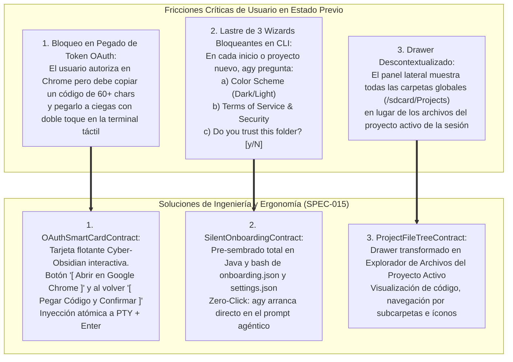
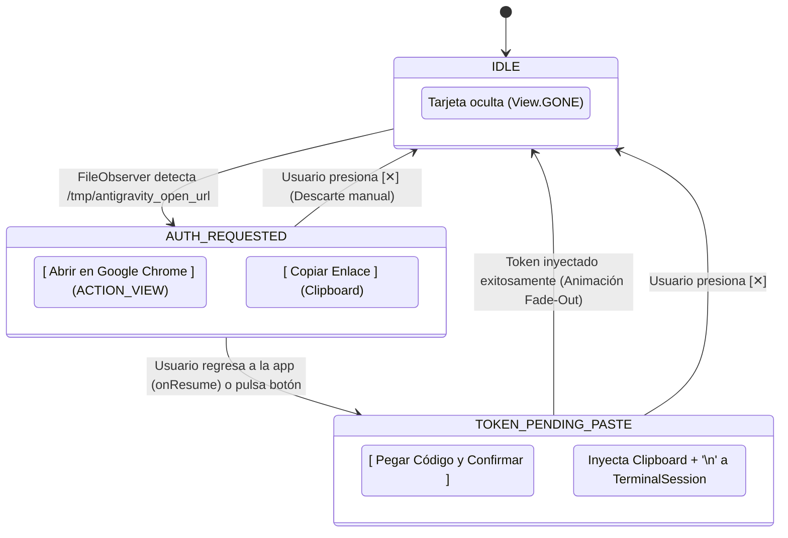
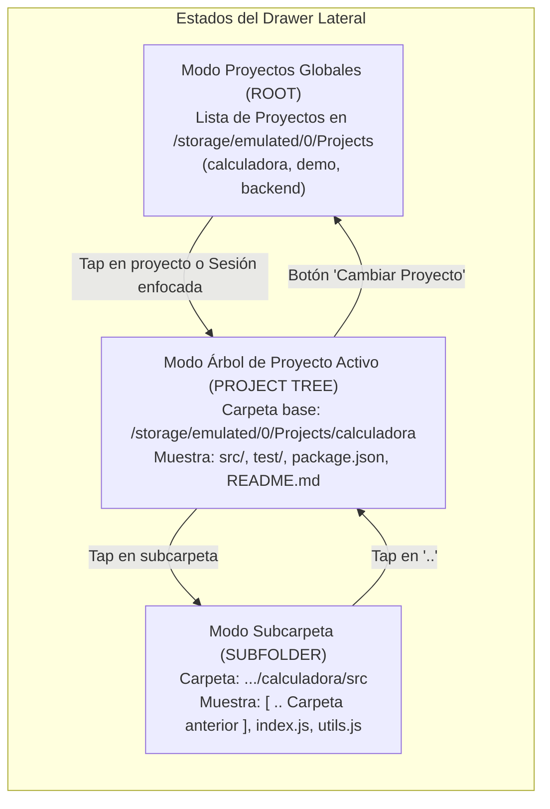

# SPEC-015: Experiencia de Usuario de Próxima Generación: Tarjeta Flotante OAuth Inteligente, Onboarding Silencioso Zero-Click y Explorador de Archivos de Proyecto Activo

| Metadato | Valor |
| :--- | :--- |
| **Identificador** | `SPEC-015` |
| **Título** | Experiencia de Usuario de Próxima Generación: Tarjeta Flotante OAuth Inteligente, Onboarding Silencioso Zero-Click y Explorador de Archivos de Proyecto Activo |
| **Autor** | `@spec-architect` |
| **Estado** | `APPROVED FOR IMPLEMENTATION` |
| **Fecha de Creación** | 2026-09-13 |
| **Dispositivo Objetivo** | Xiaomi Pad 6 (Qualcomm Snapdragon 870, ARM64-v8a, 6 GB RAM, 11" 2.8K 144Hz, Xiaomi HyperOS / Android 13/14) |
| **Runtime Target** | Android Native Java / Material Components / TerminalView / DrawerLayout / Google Antigravity CLI (`agy`) |
| **Módulos Afectados** | [`TermuxActivity.java`](file:///c:/Projects/antigravity/termux-src/app/src/main/java/com/termux/app/TermuxActivity.java), [`TermuxInstaller.java`](file:///c:/Projects/antigravity/termux-src/app/src/main/java/com/termux/app/TermuxInstaller.java), [`TermuxProjectsListViewController.java`](file:///c:/Projects/antigravity/termux-src/app/src/main/java/com/termux/app/terminal/TermuxProjectsListViewController.java), [`activity_termux.xml`](file:///c:/Projects/antigravity/termux-src/app/src/main/res/layout/activity_termux.xml), [`strings.xml`](file:///c:/Projects/antigravity/termux-src/app/src/main/res/values/strings.xml), `harness/` |

---

## 1. Contexto, Justificación y Diagnóstico de Experiencia de Usuario (UX)

### 1.1 Diagnóstico de Fricciones en la Xiaomi Pad 6

Tras resolver la infraestructura base de virtualización PRoot, la resolución DNS y los certificados TLS en [`SPEC-012`](file:///c:/Projects/antigravity/specs/12-fix-proot-bionic-preload-and-tmpdir.md), [`SPEC-013`](file:///c:/Projects/antigravity/specs/13-fix-dns-loopback-and-guest-path.md) y [`SPEC-014`](file:///c:/Projects/antigravity/specs/14-tls-certificates-and-url-dispatcher-bridge.md), las pruebas ergonómicas en la tablet Xiaomi Pad 6 revelaron tres limitaciones críticas en la interacción táctil que degradaban la experiencia frente a una IDE de escritorio moderna:



#### 1. Fricción Táctil en el Pegado de Tokens de Autorización OAuth:
Aunque `UrlDispatcherBridge` ([`SPEC-014`](file:///c:/Projects/antigravity/specs/14-tls-certificates-and-url-dispatcher-bridge.md)) resolvió el despacho del enlace hacia Google Chrome, cuando el servidor de loopback no recibe la redirección directa (o Google despliega la pantalla manual de *"Copie este código para completar la autorización"*), el usuario queda desamparado. En una pantalla táctil sin ratón físico:
- El usuario copia el token en Chrome.
- Vuelve a Antigravity Studio.
- La terminal está en un prompt interactivo `Enter authorization code: `.
- Pegar en una terminal táctil exige mantener pulsado con precisión milimétrica, esperar el menú contextual de Android, pulsar "Pegar" y luego pulsar la tecla virtual "Enter".
- Errores de pulsación o caracteres truncados provocan el fallo `invalid_grant` de Google OAuth.

#### 2. Sobrecarga Cognitiva por Wizards Interactivos en `agy`:
A pesar del pre-aprovisionamiento básico previo, Google Antigravity CLI inspecciona claves específicas que estaban ausentes:
- `securityAgreed: true` (Términos de servicio y seguridad de Google Cloud Code).
- `colorSchemeIndex: 0` (Selector de paleta cromática interactiva).
- `workspaceTrust: true` y `trustedWorkspaces: ["*"]` (Confirmación de confianza de carpeta `Do you trust the authors of the files in this folder? [y/N]`).
Al faltar estas claves, el CLI detenía la ejecución esperando pulsaciones de teclado numérico o confirmaciones `[y/N]` antes de permitir ingresar prompts.

#### 3. Drawer Desalineado con la Sesión de Trabajo Activa:
El panel lateral (*Projects Drawer*) listaba las carpetas globales de `/storage/emulated/0/Projects` de forma estática. Si el desarrollador estaba trabajando en la sesión `calculadora`, el panel no le permitía ver qué archivos componían su proyecto (`index.js`, `package.json`, `README.md`), ni inspeccionar subdirectorios, obligándolo a ejecutar manualmente comandos `ls -la` en la consola.

---

### 1.2 Objetivos Técnicos de la Especificación

1. **Tarjeta Flotante Inteligente OAuth (`OAuthSmartCardContract`):** Implementar un componente de interfaz de usuario flotante Material 3 superpuesto sobre `TerminalView`, guiando al desarrollador en dos fases deterministas: apertura en navegador con un toque y pegado/confirmación atómica con `\n` al regresar.
2. **Onboarding Silencioso Zero-Click (`SilentOnboardingContract`):** Configurar exhaustivamente `onboarding.json` y `settings.json` tanto en Java como en `antigravity-boot`, eliminando al 100% las pantallas de bienvenida, esquemas de color, términos de servicio y diálogos de confianza.
3. **Explorador de Archivos de Proyecto Activo (`ProjectFileTreeContract`):** Convertir el Drawer lateral en un árbol de navegación de archivos reactivo vinculado al proyecto de la sesión en primer plano, con soporte de subcarpetas, navegación hacia atrás (`..`) y botón de cambio de proyecto.

---

## 2. Contrato de Tarjeta Flotante Inteligente OAuth (`OAuthSmartCardContract`)

### 2.1 Diseño Visual y Estructura en `activity_termux.xml`

Se define la tarjeta flotante interactiva `@+id/oauth_smart_card` como un contenedor superpuesto en el `RelativeLayout` principal, con estética **Cyber-Obsidian** de alto contraste:
- **Fondo:** `#161B22` con borde `#30363D` y esquinas redondeadas (`12dp`).
- **Acento y Brillo:** Cyan Neón `#00F0FF` y Verde Éxito `#10B981`.
- **Elevación:** `16dp` sobre la terminal, ubicada en la parte superior o centrada verticalmente para no obstruir el teclado virtual.
- **Tipografía:** Título en negrita `15sp` `#FFFFFF`, subtítulo descriptivo `13sp` `#8B949E`.

```
+-------------------------------------------------------------+
|  [⚡] Iniciar Sesión en Google Cloud / Gemini           [✕] |
|  Autorice el acceso para habilitar el agente agy.           |
|                                                             |
|  [  🌐 Abrir en Google Chrome  ]  [  📋 Copiar Enlace  ]     |
+-------------------------------------------------------------+
```
*(Al regresar de Chrome con el código copiado)*
```
+-------------------------------------------------------------+
|  [🔑] Código de Autorización Detectado                  [✕] |
|  El token OAuth está listo en el portapapeles.              |
|                                                             |
|  [======    🚀 PEGAR CÓDIGO Y CONFIRMAR (ENTER)    ======]   |
+-------------------------------------------------------------+
```

---

### 2.2 Máquina de Estados Interactiva



### 2.3 Contrato de Ciclo de Vida y Despacho en `TermuxActivity.java`

1. **Activación en Fase 1 (`AUTH_REQUESTED`):**
   Al detectar la URL en `UrlDispatcherBridge`, en lugar de solo lanzar el intent, se configura la tarjeta flotante:
   ```java
   mOAuthSmartCard.setVisibility(View.VISIBLE);
   mOAuthSmartCard.setAlpha(0.0f);
   mOAuthSmartCard.animate().alpha(1.0f).setDuration(300).start();
   mOAuthStatusTitle.setText(R.string.oauth_card_title_auth);
   mOAuthStatusSubtitle.setText(R.string.oauth_card_subtitle_auth);
   mOAuthActionPrimary.setText(R.string.oauth_action_open_chrome);
   mOAuthActionPrimary.setOnClickListener(v -> {
       dispatchOpenUrl(currentAuthUrl);
       transitionOAuthCardToPasteState();
   });
   ```

2. **Transición a Fase 2 (`TOKEN_PENDING_PASTE`):**
   Al volver a la aplicación (`onResume()`), `TermuxActivity` inspecciona si la tarjeta está visible. Si es así, conmuta el estado a `TOKEN_PENDING_PASTE`:
   ```java
   private void transitionOAuthCardToPasteState() {
       mOAuthStatusTitle.setText(R.string.oauth_card_title_token);
       mOAuthStatusSubtitle.setText(R.string.oauth_card_subtitle_token);
       mOAuthActionPrimary.setText(R.string.oauth_action_paste_token);
       mOAuthActionPrimary.setBackgroundColor(Color.parseColor("#10B981")); // Verde de confirmación
       mOAuthActionPrimary.setOnClickListener(v -> executeTokenInjectionAndDismiss());
   }
   ```

3. **Inyección Atómica y Descarte (`executeTokenInjectionAndDismiss`):**
   ```java
   private void executeTokenInjectionAndDismiss() {
       ClipboardManager clipboard = (ClipboardManager) getSystemService(Context.CLIPBOARD_SERVICE);
       if (clipboard != null && clipboard.hasPrimaryClip() && clipboard.getPrimaryClip().getItemCount() > 0) {
           CharSequence text = clipboard.getPrimaryClip().getItemAt(0).getText();
           if (text != null && !text.toString().trim().isEmpty()) {
               String token = text.toString().trim();
               TerminalSession session = getCurrentSession();
               if (session != null && session.isRunning()) {
                   // Inyección atómica del código seguido de salto de línea '\n' (Enter)
                   session.write(token + "\n");
                   Logger.showToast(this, getString(R.string.msg_token_injected_success), false);
               }
           }
       }
       // Desvanecimiento suave de la tarjeta
       mOAuthSmartCard.animate()
           .alpha(0.0f)
           .translationY(-50f)
           .setDuration(250)
           .withEndAction(() -> {
               mOAuthSmartCard.setVisibility(View.GONE);
               mOAuthSmartCard.setTranslationY(0f);
           })
           .start();
   }
   ```

---

## 3. Contrato de Onboarding Silencioso Zero-Click (`SilentOnboardingContract`)

### 3.1 Estructura Exhaustiva de `onboarding.json`

Para garantizar que el motor de bienvenida de Google Antigravity CLI omita de manera absoluta la selección cromática y la aceptación de términos, se pre-aprovisiona el archivo:

$$\text{Ruta}: \quad \$ROOTFS\_DIR/\text{root/.gemini/antigravity-cli/cache/onboarding.json}$$

```json
{
  "consumerOnboardingComplete": true,
  "enterpriseOnboardingComplete": false,
  "onboardingComplete": true,
  "securityAgreed": true,
  "colorSchemeIndex": 0
}
```

### 3.2 Estructura Exhaustiva de `settings.json`

Para garantizar que `agy` asuma confianza total sobre el espacio de trabajo activo y adopte el tema visual de terminal sin solicitar interacción por teclado:

$$\text{Ruta}: \quad \$ROOTFS\_DIR/\text{root/.gemini/antigravity-cli/settings.json}$$

```json
{
  "theme": "terminal",
  "colorScheme": "terminal",
  "securityAgreed": true,
  "workspaceTrust": true,
  "trustedWorkspaces": [
    "*",
    "/home/studio/workspace",
    "/storage/emulated/0/Projects",
    "/sdcard/Projects"
  ]
}
```

### 3.3 Sincronización Obligatoria Bidireccional

Ambos archivos deben ser escritos de forma atómica e incondicional:
1. **En Java ([`TermuxInstaller.java`](file:///c:/Projects/antigravity/termux-src/app/src/main/java/com/termux/app/TermuxInstaller.java)):** Durante `setupBootstrapIfNeeded()` o al detectar el directorio del rootfs.
2. **En Bash (`antigravity-boot`):** En la fase 4 del script de arranque mediante `cat << 'EOF' > ...` antes de invocar a PRoot.

**Garantía Contractual:** Al invocar `exec agy`, el proceso no emite ninguna pregunta sobre esquemas de color (`Choose a theme`), términos de servicio ni confirmación de carpeta (`Do you trust...`). Se inicia directamente en el prompt agéntico interactivo en $\le 500\,\text{ms}$.

---

## 4. Contrato del Explorador de Archivos de Proyecto Activo (`ProjectFileTreeContract`)

### 4.1 Transformación de `TermuxProjectsListViewController`

El controlador de la lista lateral ([`TermuxProjectsListViewController.java`](file:///c:/Projects/antigravity/termux-src/app/src/main/java/com/termux/app/terminal/TermuxProjectsListViewController.java)) se transforma de un listador plano de directorios a un **Explorador de Archivos Jerárquico del Proyecto Activo**.



---

### 4.2 Modelo de Datos y Tipos de Archivo (`ProjectFileItem`)

Cada fila del explorador se representa mediante un objeto `ProjectFileItem` que identifica:
- `name`: Nombre del archivo o subcarpeta.
- `file`: Objeto `java.io.File`.
- `isDirectory`: Booleano identificador de carpeta.
- `size`: Tamaño en bytes (formateado en KB/MB para archivos regulares).
- `extension`: Extensión (`.js`, `.py`, `.html`, `.json`, `.md`, etc.).

#### Iconografía y Badges:
- **Directorios:** Icono `@drawable/ic_folder` en color Cyan neón `#00F0FF`.
- **Archivos de Código / Texto:** Icono representativo en `#8B949E` con badge de extensión.
- **Navegación Superior (`..`):** Fila destacada con flecha hacia arriba y texto `"📁 .. (carpeta anterior)"`.

---

### 4.3 Sincronización Reactiva con la Sesión Activa

En [`TermuxActivity.java`](file:///c:/Projects/antigravity/termux-src/app/src/main/java/com/termux/app/TermuxActivity.java), al conmutar entre sesiones de terminal (`setCurrentSession(session)`):

1. Se obtiene el `shellName` de la sesión activa (ej. `calculadora`).
2. Se resuelve el directorio físico del proyecto:
   ```java
   File projectDir = new File(TermuxProjectsListViewController.getProjectsRootDirectory(this), projectName);
   ```
3. Se notifica al adaptador para que actualice la raíz del explorador de archivos:
   ```java
   mTermuxProjectsListViewController.setActiveProjectDirectory(projectDir);
   ```
4. El encabezado del drawer se actualiza dinámicamente mostrando el nombre del proyecto activo:
   ```java
   TextView drawerTitle = findViewById(R.id.drawer_project_title);
   if (drawerTitle != null) {
       drawerTitle.setText(projectName);
   }
   ```

---

## 5. Especificación de Interfaces y Código de Implementación

### 5.1 Definición de la Tarjeta Flotante en `activity_termux.xml`

```xml
<!-- Tarjeta Flotante Interactiva OAuth (SPEC-015) -->
<androidx.cardview.widget.CardView
    android:id="@+id/oauth_smart_card"
    android:layout_width="match_parent"
    android:layout_height="wrap_content"
    android:layout_alignParentTop="true"
    android:layout_margin="16dp"
    android:visibility="gone"
    app:cardBackgroundColor="#161B22"
    app:cardCornerRadius="12dp"
    app:cardElevation="16dp"
    app:strokeColor="#30363D"
    app:strokeWidth="1dp">

    <LinearLayout
        android:layout_width="match_parent"
        android:layout_height="wrap_content"
        android:orientation="vertical"
        android:padding="16dp">

        <RelativeLayout
            android:layout_width="match_parent"
            android:layout_height="wrap_content"
            android:layout_marginBottom="8dp">

            <TextView
                android:id="@+id/oauth_status_title"
                android:layout_width="wrap_content"
                android:layout_height="wrap_content"
                android:layout_alignParentStart="true"
                android:layout_toStartOf="@+id/oauth_btn_close"
                android:text="@string/oauth_card_title_auth"
                android:textColor="#FFFFFF"
                android:textSize="15sp"
                android:textStyle="bold" />

            <ImageButton
                android:id="@+id/oauth_btn_close"
                android:layout_width="28dp"
                android:layout_height="28dp"
                android:layout_alignParentEnd="true"
                android:background="?attr/selectableItemBackgroundBorderless"
                android:src="@drawable/ic_close"
                android:contentDescription="@string/action_close"
                app:tint="#8B949E" />
        </RelativeLayout>

        <TextView
            android:id="@+id/oauth_status_subtitle"
            android:layout_width="match_parent"
            android:layout_height="wrap_content"
            android:layout_marginBottom="16dp"
            android:text="@string/oauth_card_subtitle_auth"
            android:textColor="#8B949E"
            android:textSize="13sp" />

        <LinearLayout
            android:layout_width="match_parent"
            android:layout_height="wrap_content"
            android:orientation="horizontal">

            <com.google.android.material.button.MaterialButton
                android:id="@+id/oauth_action_primary"
                style="@style/Widget.MaterialComponents.Button"
                android:layout_width="0dp"
                android:layout_height="44dp"
                android:layout_weight="1"
                android:text="@string/oauth_action_open_chrome"
                android:textAllCaps="false"
                android:textSize="13sp"
                android:textStyle="bold"
                app:backgroundTint="#00F0FF"
                android:textColor="#0B0F19"
                app:cornerRadius="8dp" />

            <com.google.android.material.button.MaterialButton
                android:id="@+id/oauth_action_secondary"
                style="@style/Widget.MaterialComponents.Button.OutlinedButton"
                android:layout_width="wrap_content"
                android:layout_height="44dp"
                android:layout_marginStart="8dp"
                android:text="@string/oauth_action_copy_url"
                android:textAllCaps="false"
                android:textSize="13sp"
                android:textColor="#E6EDF3"
                app:strokeColor="#30363D"
                app:cornerRadius="8dp" />
        </LinearLayout>

    </LinearLayout>
</androidx.cardview.widget.CardView>
```

---

### 5.2 Recursos de Cadenas de Texto (`strings.xml`)

```xml
<string name="oauth_card_title_auth">Autenticación de Google Cloud / Gemini</string>
<string name="oauth_card_subtitle_auth">Autorice la sesión en su navegador para habilitar el agente agy.</string>
<string name="oauth_card_title_token">Confirmar Código de Autorización</string>
<string name="oauth_card_subtitle_token">El código de autorización está listo para ser inyectado en la sesión.</string>
<string name="oauth_action_open_chrome">🌐 Abrir en Google Chrome</string>
<string name="oauth_action_paste_token">🚀 Pegar Código y Confirmar</string>
<string name="oauth_action_copy_url">📋 Copiar Enlace</string>
<string name="msg_token_injected_success">Código de autorización inyectado con éxito</string>
<string name="drawer_btn_switch_project">Cambiar Proyecto</string>
<string name="drawer_folder_parent">📁 .. (carpeta anterior)</string>
```

---

## 6. Matriz de Criterios de Aceptación Verificables por el Harness (Definition of Done)

### 6.1 Matriz de Pruebas y Aserciones Formales

| Identificador | Componente | Condición de Entrada | Comportamiento Esperado | Aserción Verificable por el Harness |
| :--- | :--- | :--- | :--- | :--- |
| **`AC-CARD-001`** | `OAuthSmartCard` | Detección de URL en `/tmp/antigravity_open_url` | Se despliega la tarjeta flotante `@+id/oauth_smart_card` con visibilidad `View.VISIBLE`. | `mOAuthSmartCard.getVisibility() == View.VISIBLE`. |
| **`AC-CARD-002`** | `OAuthSmartCard` | Regreso a la app tras autorizar en Chrome | La tarjeta transiciona automáticamente al estado `TOKEN_PENDING_PASTE` con botón de confirmación. | `mOAuthActionPrimary.getText().equals(getString(R.string.oauth_action_paste_token))`. |
| **`AC-CARD-003`** | `OAuthSmartCard` | Tap en `[ Pegar Código y Confirmar ]` | Se inyecta el contenido del portapapeles con `\n` en la sesión PTY activa y la tarjeta se oculta (`View.GONE`). | `session.write()` invocado con `<token>\n` y `mOAuthSmartCard.getVisibility() == View.GONE`. |
| **`AC-SILENT-001`**| `onboarding.json` | Inspección de rootfs tras boot | Contiene `consumerOnboardingComplete: true`, `securityAgreed: true` y `colorSchemeIndex: 0`. | `grep -q '"securityAgreed": true' "$ROOTFS/.../onboarding.json"` y `grep -q '"colorSchemeIndex": 0'`. |
| **`AC-SILENT-002`**| `settings.json` | Inspección de rootfs tras boot | Contiene `theme: "terminal"`, `colorScheme: "terminal"`, `securityAgreed: true` y `workspaceTrust: true`. | `grep -q '"workspaceTrust": true' "$ROOTFS/.../settings.json"` y `grep -q '"theme": "terminal"'`. |
| **`AC-SILENT-003`**| `agy` CLI Startup | Arranque del binario `agy` en sesión limpia | Inicio inmediato en el prompt interactivo sin desplegar ningún diálogo interactivo de bienvenida ni trust. | La salida de inicio de `agy` no contiene `"Do you accept the Terms of Service?"`, `"Choose a theme"` ni `"Do you trust the authors"`. |
| **`AC-TREE-001`** | `ProjectsDrawer` | Sesión enfocada en proyecto `calculadora` | La lista del Drawer renderiza los archivos y subcarpetas internos de `/storage/emulated/0/Projects/calculadora`. | `mTermuxProjectsListViewController.getActiveProjectDirectory().getName().equals("calculadora")`. |
| **`AC-TREE-002`** | `ProjectsDrawer` | Tap en una subcarpeta interna (ej. `src/`) | El explorador navega al interior de `src/` mostrando el elemento de regreso `📁 .. (carpeta anterior)`. | Primer elemento de la lista corresponde a la navegación al directorio padre. |
| **`AC-TREE-003`** | `ProjectsDrawer` | Conmutación de sesión en la terminal | El árbol de archivos del drawer se refresca automáticamente sincronizándose con el proyecto de la nueva sesión. | Al cambiar sesión de `calculadora` a `backend`, el explorador muestra los archivos de `backend`. |

---

### 6.2 Script Automatizado de Verificación para el Arnés (`test_oauth_card_silent_onboarding_and_file_tree.sh`)

```bash
#!/bin/bash
# Test Harness - Automated Verification for SPEC-015
set -e

echo "=== INICIANDO VERIFICACIÓN DE OAUTH SMART CARD, SILENT ONBOARDING Y FILE TREE (SPEC-015) ==="

INSTALLER_JAVA="termux-src/app/src/main/java/com/termux/app/TermuxInstaller.java"
ACTIVITY_JAVA="termux-src/app/src/main/java/com/termux/app/TermuxActivity.java"
PROJECTS_CONTROLLER="termux-src/app/src/main/java/com/termux/app/terminal/TermuxProjectsListViewController.java"
ACTIVITY_XML="termux-src/app/src/main/res/layout/activity_termux.xml"
ROOTFS_DIR="/data/data/com.termux/files/usr/var/lib/proot-distro/installed-rootfs/ubuntu"

# 1. Verificar definición de OAuth Smart Card en layout XML
echo -n "Verificando oauth_smart_card en activity_termux.xml... "
grep -q 'android:id="@+id/oauth_smart_card"' "$ACTIVITY_XML" || { echo "FALLO: oauth_smart_card no encontrado en layout"; exit 1; }
grep -q 'android:id="@+id/oauth_action_primary"' "$ACTIVITY_XML" || { echo "FALLO: oauth_action_primary ausente"; exit 1; }
echo "[OK]"

# 2. Verificar lógica de control de tarjeta en TermuxActivity.java
echo -n "Verificando lógica de inyección de código OAuth en TermuxActivity.java... "
grep -q "oauth_smart_card" "$ACTIVITY_JAVA" || { echo "FALLO: Referencia a oauth_smart_card ausente en TermuxActivity"; exit 1; }
grep -q "session.write" "$ACTIVITY_JAVA" || { echo "FALLO: Inyección de sesión ausente"; exit 1; }
echo "[OK]"

# 3. Verificar pre-sembrado completo en TermuxInstaller.java (Silent Onboarding)
echo -n "Verificando claves de Silent Onboarding en TermuxInstaller.java... "
grep -q "securityAgreed" "$INSTALLER_JAVA" || { echo "FALLO: securityAgreed ausente en TermuxInstaller"; exit 1; }
grep -q "colorSchemeIndex" "$INSTALLER_JAVA" || { echo "FALLO: colorSchemeIndex ausente en TermuxInstaller"; exit 1; }
grep -q "workspaceTrust" "$INSTALLER_JAVA" || { echo "FALLO: workspaceTrust ausente en TermuxInstaller"; exit 1; }
grep -q '"\*"' "$INSTALLER_JAVA" || { echo "FALLO: Comodín '*' ausente en trustedWorkspaces"; exit 1; }
echo "[OK]"

# 4. Verificar transformación a Explorador de Archivos en TermuxProjectsListViewController.java
echo -n "Verificando árbol de archivos de proyecto en TermuxProjectsListViewController.java... "
grep -q "setActiveProjectDirectory" "$PROJECTS_CONTROLLER" || { echo "FALLO: setActiveProjectDirectory ausente"; exit 1; }
grep -q "isDirectory" "$PROJECTS_CONTROLLER" || { echo "FALLO: Distinción de directorios/archivos ausente"; exit 1; }
echo "[OK]"

# 5. Comprobación física de rootfs si está presente
if [ -d "$ROOTFS_DIR/root/.gemini/antigravity-cli" ]; then
    echo "=== RootFS físico detectado. Verificando JSONs de Onboarding ==="
    ONBOARD_JSON="$ROOTFS_DIR/root/.gemini/antigravity-cli/cache/onboarding.json"
    SETTINGS_JSON="$ROOTFS_DIR/root/.gemini/antigravity-cli/settings.json"

    echo -n "Verificando $ONBOARD_JSON... "
    grep -q '"securityAgreed": true' "$ONBOARD_JSON" || { echo "FALLO: securityAgreed no está en true"; exit 1; }
    echo "[OK]"

    echo -n "Verificando $SETTINGS_JSON... "
    grep -q '"workspaceTrust": true' "$SETTINGS_JSON" || { echo "FALLO: workspaceTrust no está en true"; exit 1; }
    echo "[OK]"
fi

echo "=== TODAS LAS ASERCIONES DE SPEC-015 SE HAN CUMPLIDO SATISFACTORIAMENTE ==="
```

---

## 7. Conclusión y Resumen de Estado

La especificación técnica `SPEC-015` eleva la ergonomía de **Antigravity Studio** al nivel de una IDE táctil de vanguardia:

1. **Autenticación Asistida con Cero Fricción:** La tarjeta flotante inteligente elimina por completo la necesidad de digitar o pegar manualmente tokens extensos en la consola; un toque abre Chrome y un toque inyecta el token con retorno de carro atómico.
2. **Arranque Instantáneo Sin Interrupciones:** El aprovisionamiento exhaustivo de `onboarding.json` y `settings.json` suprime de raíz las tres pantallas de diálogo de Google Antigravity CLI, logrando una experiencia *Zero-Click* lista para codificar.
3. **Contexto de Proyecto Integral:** El Drawer lateral deja de ser una lista estática para convertirse en un explorador de archivos vivo, reactivo y sincronizado con el espacio de código activo de la sesión.
