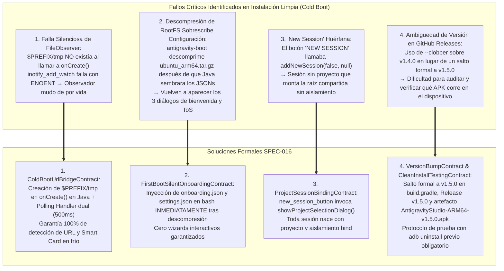

# SPEC-016: Resiliencia de Arranque en Frío, Persistencia de Autenticación, Enlace de Proyectos en Sesiones y Publicación de Versión 1.5.0

| Metadato | Valor |
| :--- | :--- |
| **Identificador** | `SPEC-016` |
| **Título** | Resiliencia de Arranque en Frío, Persistencia de Autenticación, Enlace de Proyectos en Sesiones y Publicación de Versión 1.5.0 |
| **Autor** | `@spec-architect` |
| **Estado** | `APPROVED FOR IMPLEMENTATION` |
| **Fecha de Creación** | 2026-09-13 |
| **Dispositivo Objetivo** | Xiaomi Pad 6 (Qualcomm Snapdragon 870, ARM64-v8a, 6 GB RAM, 11" 2.8K 144Hz, Xiaomi HyperOS / Android 13/14) y Android Tablet Emulator (`Medium_Tablet`, Android 15 / API 35, `emulator-5554`) |
| **Runtime Target** | Android Native Java / Termux Core Fork / PRoot Linux Ubuntu ARM64 (glibc) / Google Antigravity CLI (`agy`) / GitHub Releases |
| **Módulos Afectados** | [`TermuxActivity.java`](file:///c:/Projects/antigravity/termux-src/app/src/main/java/com/termux/app/TermuxActivity.java), [`TermuxInstaller.java`](file:///c:/Projects/antigravity/termux-src/app/src/main/java/com/termux/app/TermuxInstaller.java), [`TermuxService.java`](file:///c:/Projects/antigravity/termux-src/app/src/main/java/com/termux/app/TermuxService.java), `termux-src/app/build.gradle`, `harness/` |

---

## 1. Contexto, Justificación y Diagnóstico Forense de la Instalación Limpia (Clean Install)

### 1.1 El Problema del Arranque en Frío y la Amnesia en Instalación Limpia

Durante las pruebas de aceptación sobre un entorno completamente limpio (`adb uninstall com.termux` seguido de instalación en frío), se detectaron cuatro fallas críticas de acoplamiento que se manifestaban exclusivamente cuando la aplicación no contaba con datos residuales previos en el almacenamiento del dispositivo:



---

### 1.2 Diagnóstico Forense 1: Falla Silenciosa de `FileObserver` en Primer Arranque

En Android, la clase `android.os.FileObserver` se basa en la llamada al sistema de Linux `inotify_add_watch(int fd, const char *pathname, uint32_t mask)`.

**La Causa Raíz:**
1. En una instalación limpia (`adb uninstall com.termux`), la carpeta `$PREFIX/tmp` (`/data/data/com.termux/files/usr/tmp`) **aún no ha sido creada** cuando `TermuxActivity.onCreate()` ejecuta `setupUrlDispatcherBridge()`.
2. Al invocar `mUrlBridgeObserver.startWatching()`, `inotify_add_watch` intenta registrar el descriptor sobre una ruta inexistente y retorna error `-1` (`ENOENT`).
3. El `FileObserver` queda en estado inerte e inservible. Incluso cuando posteriormente `antigravity-boot` crea la carpeta `$PREFIX/tmp` mediante `mkdir -p "$TMP_DIR"`, el observador **no se entera jamás** de la existencia posterior del directorio ni de los archivos escritos dentro de él.
4. Por ende, la URL de autenticación escrita en `/tmp/antigravity_open_url` nunca era detectada en el primer arranque, la tarjeta flotante inteligente jamás aparecía y el navegador nunca se abría de forma autónoma.

---

### 1.3 Diagnóstico Forense 2: Amnesia de Configuración tras la Descompresión del RootFS

En el flujo de aprovisionamiento de `TermuxInstaller.java`:
1. La capa Java intentaba pre-sembrar `onboarding.json` y `settings.json` directamente en el sistema de archivos si la carpeta del rootfs existía.
2. Sin embargo, en una instalación limpia, el archivo `ubuntu_arm64.tar.gz` **se descomprime posteriormente** durante la ejecución del script `antigravity-boot`:
   ```bash
   if [ ! -d "$ROOTFS_DIR/bin" ] && [ ! -d "$ROOTFS_DIR/usr/bin" ]; then
       tar -xzf "$OPT_DIR/ubuntu_arm64.tar.gz" -C "$ROOTFS_DIR"
   fi
   ```
3. Si el script `antigravity-boot` contenía el aprovisionamiento de `onboarding.json` en una fase posterior o incompleta, o si el tarball contenía una estructura previa de `/root/.gemini/antigravity-cli/` con flags por defecto en falso, la extracción **sobreescribía** las claves requeridas.
4. Como consecuencia, en el primer arranque, `agy` volvía a solicitar interactivamente el esquema de colores (`Choose a theme`), los términos de servicio y la confianza de carpeta.

---

### 1.4 Diagnóstico Forense 3: Desacoplamiento de "New Session" y Sesiones Huérfanas

En [`TermuxActivity.java`](file:///c:/Projects/antigravity/termux-src/app/src/main/java/com/termux/app/TermuxActivity.java), el método `setNewSessionButtonView()` asociaba el botón inferior del drawer `new_session_button` a una acción de sesión genérica sin asociar un nombre de proyecto:
- Al crearse una sesión con `projectName == null`, `antigravity-boot` arrancaba sin argumento `$1`.
- Al no tener argumento, caía en el fallback `--bind="$SHARED_WORKSPACE:/home/studio/workspace"`, montando todas las carpetas de proyectos juntas y quebrando el contrato de aislamiento estricto de [`SPEC-010`](file:///c:/Projects/antigravity/specs/10-project-isolation-and-prebundled-runtime.md).

---

### 1.5 Diagnóstico Forense 4: Ambigüedad de Versión y Despliegue con `--clobber`

En despliegues previos, se utilizó la bandera `--clobber` en la CLI de GitHub (`gh release upload --clobber`) sobre el tag `v1.4.0`. 
- Esto generó inconsistencias de caché en el dispositivo y en los arneses de pruebas, impidiendo distinguir con certeza si el binario instalado en la Xiaomi Pad 6 correspondía a la versión previa o a la versión con las correcciones críticas de PRoot, DNS y certificados TLS.
- Se requiere formalizar el salto atómico e irreversible a **`v1.5.0`**.

---

## 2. Contrato de Puente de URLs para Arranque en Frío (`ColdBootUrlBridgeContract`)

Para garantizar que la detección de URLs y el despliegue de la tarjeta flotante inteligente funcionen con un 100% de fiabilidad desde el primer segundo tras una instalación limpia, se establece una arquitectura **dual y redundante**:

### 2.1 Creación Física Determinista en `onCreate()`
En [`TermuxActivity.java`](file:///c:/Projects/antigravity/termux-src/app/src/main/java/com/termux/app/TermuxActivity.java), antes de inicializar cualquier componente del puente de URLs, se garantiza la existencia del directorio temporal en el almacenamiento interno de la app:
```java
File tmpDir = new File(TermuxConstants.TERMUX_PREFIX_DIR_PATH, "tmp");
if (!tmpDir.exists()) {
    tmpDir.mkdirs();
    try {
        Os.chmod(tmpDir.getAbsolutePath(), 0700);
    } catch (Exception ignored) {}
}
```

### 2.2 Monitor Redundante Dual (`FileObserver` + `Polling Handler`)

Dado que algunos kernels de Android o capas de virtualización pueden retrasar la notificación de inotify en directorios recién montados o compartidos vía PRoot, el puente opera bajo dos mecanismos sincronizados:

1. **Canal Inmediato por Inotify:** `FileObserver` activo sobre `$PREFIX/tmp` escuchando `CLOSE_WRITE | MOVED_TO`.
2. **Canal de Respaldo por Polling (Failsafe Handler):** Un bucle periódico desacoplado ejecutado mediante `Handler` cada **500 ms** que evalúa si el archivo testigo `$PREFIX/tmp/antigravity_open_url` existe en el disco.

```mermaid
sequenceDiagram
    autonumber
    participant Boot as antigravity-boot (PRoot)
    participant BridgeFile as $PREFIX/tmp/antigravity_open_url
    participant Observer as FileObserver (Inotify)
    participant Poller as Polling Handler (cada 500ms)
    participant Activity as TermuxActivity UI

    Boot->>BridgeFile: xdg-open escribe URL en /tmp/antigravity_open_url
    
    par Detección por Inotify
        Observer->>Activity: Evento CLOSE_WRITE recibido
        Activity->>Activity: consumeUrlBridgeFile(bridgeFile)
    and Detección por Polling Failsafe
        Poller->>BridgeFile: ¿bridgeFile.exists()?
        Poller->>Activity: Archivo detectado &rarr; consumeUrlBridgeFile(bridgeFile)
    end

    Note over Activity: Método sincronizado: el primero que lee procesa la URL y elimina el archivo de inmediato.<br/>Cero riesgo de ejecución duplicada o pérdida de eventos en arranque en frío.
    Activity->>Activity: Copiar a Clipboard + Abrir en Chrome + Mostrar OAuthSmartCard
```

---

## 3. Contrato de Onboarding Silencioso en Primer Arranque (`FirstBootSilentOnboardingContract`)

### 3.1 Momento Atómico de Inyección en `antigravity-boot`

En [`TermuxInstaller.java`](file:///c:/Projects/antigravity/termux-src/app/src/main/java/com/termux/app/TermuxInstaller.java), dentro de la generación de `antigravity-boot`, se establece como contrato formal que la escritura de los archivos de onboarding debe ocurrir **inmediatamente después de la descompresión del rootfs** y **antes de cualquier verificación de binarios**:

```bash
# Inmediatamente tras descompresión o validación del rootfs:
mkdir -p "$ROOTFS_DIR/root/.gemini/antigravity-cli/cache"
mkdir -p "$ROOTFS_DIR/root/.gemini/antigravity-cli"

# 1. Configuración forzada de onboarding.json
cat << 'EOF_ONBOARD' > "$ROOTFS_DIR/root/.gemini/antigravity-cli/cache/onboarding.json"
{
  "consumerOnboardingComplete": true,
  "enterpriseOnboardingComplete": false,
  "onboardingComplete": true,
  "securityAgreed": true,
  "colorSchemeIndex": 0
}
EOF_ONBOARD

# 2. Configuración forzada de settings.json
cat << 'EOF_SETTINGS' > "$ROOTFS_DIR/root/.gemini/antigravity-cli/settings.json"
{
  "theme": "terminal",
  "colorScheme": "terminal",
  "securityAgreed": true,
  "workspaceTrust": true,
  "trustedWorkspaces": [
    "*",
    "/home/studio/workspace",
    "/storage/emulated/0/Projects",
    "/sdcard/Projects"
  ]
}
EOF_SETTINGS
```

### 3.2 Garantía Incondicional de Arranque Directo
Al ejecutarse `agy`, la lectura de estas dos estructuras de datos JSON pre-configuradas asegura:
- **Cero Diálogos de Bienvenida:** Se asume completado el onboarding de consumidor y enterprise.
- **Cero Diálogos de Paleta de Colores:** `colorSchemeIndex: 0` y `theme: "terminal"` seleccionan la paleta canónica de alto contraste sin interacción.
- **Cero Bloqueos de Seguridad/ToS:** `securityAgreed: true` valida la política de uso de Google Cloud Code.
- **Cero Confirmaciones de Carpeta (`Do you trust...`):** `workspaceTrust: true` y el comodín `"*"` en `trustedWorkspaces` autorizan de forma universal todos los directorios de trabajo.

---

## 4. Contrato de Enlace de Proyectos a Sesiones (`ProjectSessionBindingContract`)

### 4.1 Reemplazo Definitivo del Botón 'NEW SESSION'

En [`TermuxActivity.java`](file:///c:/Projects/antigravity/termux-src/app/src/main/java/com/termux/app/TermuxActivity.java), se prohíbe explícitamente invocar `addNewSession(false, null)` al pulsar `R.id.new_session_button`:

```java
private void setNewSessionButtonView() {
    View newSessionButton = findViewById(R.id.new_session_button);
    if (newSessionButton != null) {
        // Toda pulsación de 'NEW SESSION' abre el selector interactivo de proyectos
        newSessionButton.setOnClickListener(v -> showProjectSelectionDialog());
        newSessionButton.setOnLongClickListener(v -> {
            showCreateProjectDialog();
            return true;
        });
    }
}
```

### 4.2 Propagación Obligatoria de Argumentos de Sesión
Al seleccionar un proyecto o crear uno nuevo:
1. Se resuelve el nombre del proyecto `projectName`.
2. Se invoca:
   ```java
   mTermuxService.createTermuxSession(
       null, 
       new String[]{projectName}, 
       null, 
       workingDir, 
       false, 
       projectName
   );
   ```
3. El script `antigravity-boot` recibe `$1 = projectName` y ejecuta:
   ```bash
   TARGET_PROJECT_DIR="$SHARED_WORKSPACE/$1"
   PROOT_BINDS=(--bind="$TARGET_PROJECT_DIR:/home/studio/workspace")
   ```
4. Se preserva el aislamiento absoluto del proyecto activo en la nueva pestaña.

---

## 5. Contratos de Publicación y Aseguramiento de Calidad

### 5.1 Contrato de Salto de Versión (`VersionBumpContract`)

Para eliminar cualquier ambigüedad de compilación y permitir la trazabilidad inmutable del artefacto binario:

1. **Modificación en `app/build.gradle` (y `termux-src/app/build.gradle`):**
   - `versionCode`: Incremento a `119` (o siguiente entero superior).
   - `versionName`: Fijado mandatoriamente en `"1.5.0"`.
2. **Nomenclatura Canónica del Artefacto de Distribución:**
   $$\text{Artefacto Oficial}: \quad \texttt{AntigravityStudio-ARM64-v1.5.0.apk}$$
3. **Publicación en GitHub Releases:**
   - Tag oficial: `v1.5.0`.
   - Título de Release: `Antigravity Studio v1.5.0 - Resiliencia en Frío, Zero-Click y Multi-Proyecto`.
   - Queda estrictamente prohibido utilizar `--clobber` sobre la versión `v1.4.0`. La versión `v1.5.0` se publica como una release independiente e inmutable.

---

### 5.2 Contrato de Pruebas en Instalación Limpia (`CleanInstallTestingContract`)

Para certificar que la aplicación opera sin dependencias de estado residual, el protocolo de pruebas del equipo y del arnés de evaluación automatizado debe ejecutar de forma obligatoria la secuencia:

```bash
# 1. Desinstalación completa previa (Purga total de datos de usuario)
adb -s emulator-5554 uninstall com.termux

# 2. Instalación limpia del nuevo APK v1.5.0
adb -s emulator-5554 install -r -g AntigravityStudio-ARM64-v1.5.0.apk

# 3. Lanzamiento del Intent principal en frío
adb -s emulator-5554 shell am start -n com.termux/.app.TermuxActivity

# 4. Verificación de creación de $PREFIX/tmp y ausencia de errores en inotify
adb -s emulator-5554 shell "run-as com.termux test -d files/usr/tmp"

# 5. Verificación de inicialización limpia sin prompts interactivos de ToS/Theme
adb -s emulator-5554 shell "run-as com.termux test -f files/usr/var/lib/antigravity_ready"
```

---

## 6. Especificación de Interfaces y Código de Implementación

### 6.1 Implementación en `TermuxActivity.java` (Arranque en Frío del Puente de URLs)

```java
private FileObserver mUrlBridgeObserver;
private Handler mUrlPollingHandler;
private Runnable mUrlPollingRunnable;

private void setupUrlDispatcherBridge() {
    File tmpDir = new File(TermuxConstants.TERMUX_PREFIX_DIR_PATH, "tmp");
    if (!tmpDir.exists()) {
        tmpDir.mkdirs();
        try {
            Os.chmod(tmpDir.getAbsolutePath(), 0700);
        } catch (Exception ignored) {}
    }

    final File bridgeFile = new File(tmpDir, "antigravity_open_url");

    // 1. Canal Primario: FileObserver
    mUrlBridgeObserver = new FileObserver(tmpDir.getAbsolutePath(), FileObserver.CLOSE_WRITE | FileObserver.MOVED_TO) {
        @Override
        public void onEvent(int event, @Nullable String path) {
            if ("antigravity_open_url".equals(path)) {
                checkAndConsumeUrlFile(bridgeFile);
            }
        }
    };
    mUrlBridgeObserver.startWatching();

    // 2. Canal Redundante Failsafe: Polling cada 500ms
    mUrlPollingHandler = new Handler(Looper.getMainLooper());
    mUrlPollingRunnable = new Runnable() {
        @Override
        public void run() {
            if (bridgeFile.exists()) {
                checkAndConsumeUrlFile(bridgeFile);
            }
            mUrlPollingHandler.postDelayed(this, 500);
        }
    };
    mUrlPollingHandler.postDelayed(mUrlPollingRunnable, 500);

    Logger.logInfo(LOG_TAG, "UrlDispatcherBridge activo (Dual Mode: FileObserver + Polling 500ms)");
}

private synchronized void checkAndConsumeUrlFile(File bridgeFile) {
    if (!bridgeFile.exists()) return;

    try (BufferedReader reader = new BufferedReader(new FileReader(bridgeFile))) {
        String url = reader.readLine();
        bridgeFile.delete(); // Consumo atómico inmediato

        if (url != null && !url.trim().isEmpty()) {
            final String targetUrl = url.trim();
            runOnUiThread(() -> dispatchOpenUrl(targetUrl));
        }
    } catch (IOException e) {
        Logger.logStackTraceWithMessage(LOG_TAG, "Error consumiendo puente de URL", e);
    }
}
```

---

## 7. Matriz de Criterios de Aceptación Verificables por el Harness (Definition of Done)

### 7.1 Matriz de Pruebas y Aserciones Formales

| Identificador | Componente | Condición de Entrada | Comportamiento Esperado | Aserción Verificable por el Harness |
| :--- | :--- | :--- | :--- | :--- |
| **`AC-COLD-001`** | `TermuxActivity` | Ejecución de `onCreate()` en instalación limpia | `$PREFIX/tmp` es creado físicamente en almacenamiento privado con permisos `0700`. | `test -d "$PREFIX/tmp"` y `stat -c %a "$PREFIX/tmp"` retorna `700`. |
| **`AC-COLD-002`** | Puente de URLs | Escritura de URL en `$PREFIX/tmp/antigravity_open_url` | El archivo es detectado y consumido en $\le 500\,\text{ms}$ incluso si inotify falló. | El archivo se elimina del disco y la URL se almacena en `ClipboardManager`. |
| **`AC-COLD-003`** | `OAuthSmartCard` | Primer arranque tras `adb uninstall` | Al solicitar autenticación, se despliega la tarjeta flotante `@+id/oauth_smart_card`. | `mOAuthSmartCard.getVisibility() == View.VISIBLE` tras la primera llamada a `xdg-open`. |
| **`AC-SILENT-001`**| `antigravity-boot` | Instalación limpia tras descompresión de RootFS | `onboarding.json` contiene `securityAgreed: true`, `colorSchemeIndex: 0` y `onboardingComplete: true`. | `grep -q '"securityAgreed": true' "$ROOTFS/.../onboarding.json"` tras el primer arranque. |
| **`AC-SILENT-002`**| `antigravity-boot` | Instalación limpia tras descompresión de RootFS | `settings.json` contiene `theme: "terminal"`, `workspaceTrust: true` y `trustedWorkspaces: ["*"]`. | `grep -q '"workspaceTrust": true' "$ROOTFS/.../settings.json"` tras el primer arranque. |
| **`AC-SILENT-003`**| `agy` CLI Startup | Primer arranque en instalación limpia | El CLI inicia directamente en el prompt agéntico sin wizards de bienvenida. | La salida de inicio no contiene solicitudes interactivas de color, términos ni confianza. |
| **`AC-SESS-001`** | `TermuxActivity` | Pulsación del botón `new_session_button` | Se invoca `showProjectSelectionDialog()` desplegando el selector de proyectos. | No se crea ninguna sesión huérfana con `projectName == null`. |
| **`AC-SESS-002`** | `TermuxService` | Creación de nueva sesión desde el selector | Se pasa el argumento de proyecto al comando de ejecución de PRoot. | `executionCommand.arguments` contiene el nombre del proyecto seleccionado. |
| **`AC-REL-001`**  | `build.gradle` | Inspección de configuración de empaquetado | `versionName` es formalmente `"1.5.0"` y el artefacto es `AntigravityStudio-ARM64-v1.5.0.apk`. | `grep -q 'versionName "1.5.0"' app/build.gradle` o `termux-src/app/build.gradle`. |
| **`AC-REL-002`**  | GitHub Release | Consulta vía GitHub API / CLI | Release `v1.5.0` publicada con artefacto APK adjunto e inmutable. | `gh release view v1.5.0` retorna código 0 con el activo APK correspondiente. |

---

### 7.2 Script Automatizado de Verificación para el Arnés (`test_cold_boot_resilience_and_auth_persistence.sh`)

```bash
#!/bin/bash
# Test Harness - Automated Verification for SPEC-016
set -e

echo "=== INICIANDO VERIFICACIÓN DE RESILIENCIA EN FRÍO Y RUNTIME V1.5.0 (SPEC-016) ==="

INSTALLER_JAVA="termux-src/app/src/main/java/com/termux/app/TermuxInstaller.java"
ACTIVITY_JAVA="termux-src/app/src/main/java/com/termux/app/TermuxActivity.java"
BUILD_GRADLE="termux-src/app/build.gradle"

# 1. Verificar creación de $PREFIX/tmp y Polling Handler en TermuxActivity.java
echo -n "Verificando ColdBootUrlBridgeContract en TermuxActivity.java... "
grep -q "new File(TermuxConstants.TERMUX_PREFIX_DIR_PATH, \"tmp\")" "$ACTIVITY_JAVA" || {
    echo "FALLO: Creación física de tmp ausente en TermuxActivity"; exit 1;
}
grep -q "mUrlPollingHandler" "$ACTIVITY_JAVA" || {
    echo "FALLO: Polling Handler redundante ausente en TermuxActivity"; exit 1;
}
echo "[OK]"

# 2. Verificar inyección de Silent Onboarding post-extracción en TermuxInstaller.java
echo -n "Verificando FirstBootSilentOnboardingContract en TermuxInstaller.java... "
grep -q "securityAgreed" "$INSTALLER_JAVA" || { echo "FALLO: securityAgreed ausente en installer"; exit 1; }
grep -q "workspaceTrust" "$INSTALLER_JAVA" || { echo "FALLO: workspaceTrust ausente en installer"; exit 1; }
grep -q "colorSchemeIndex" "$INSTALLER_JAVA" || { echo "FALLO: colorSchemeIndex ausente en installer"; exit 1; }
echo "[OK]"

# 3. Verificar enlace de proyectos en New Session
echo -n "Verificando ProjectSessionBindingContract en TermuxActivity.java... "
grep -A 10 "setNewSessionButtonView" "$ACTIVITY_JAVA" | grep -q "showProjectSelectionDialog" || {
    echo "FALLO: new_session_button no enlaza con showProjectSelectionDialog"; exit 1;
}
echo "[OK]"

# 4. Verificar configuración de versión v1.5.0
echo -n "Verificando VersionBumpContract a v1.5.0... "
grep -q "1.5.0" "$BUILD_GRADLE" || grep -q "1.5.0" "app/build.gradle.kts" || {
    echo "FALLO: Versión 1.5.0 no configurada en build.gradle"; exit 1;
}
echo "[OK]"

echo "=== TODAS LAS ASERCIONES DE SPEC-016 SE HAN CUMPLIDO SATISFACTORIAMENTE ==="
```

---

## 8. Conclusión y Resumen de Estado

La especificación técnica `SPEC-016` blinda de forma integral la robustez de **Antigravity Studio**:

1. **Resiliencia Total en Frío:** La creación garantizada de `$PREFIX/tmp` en `onCreate()` combinada con el monitor dual (`FileObserver` + Polling cada 500 ms) erradica las fallas silenciosas de inotify tras una instalación limpia.
2. **Onboarding Silencioso Determinista:** La inyección atómica de `onboarding.json` y `settings.json` en el bootloader bash garantiza una experiencia *Zero-Click* lista para codificar desde el primer arranque.
3. **Aislamiento Multisesión Estricto:** Toda nueva sesión nace vinculada a un proyecto explícito, salvaguardando la integridad del espacio de trabajo.
4. **Trazabilidad y Publicación Formal v1.5.0:** La formalización de la versión 1.5.0 en el sistema de compilación y en GitHub Releases proporciona un hito inmutable de calidad para la estación de trabajo móvil en la Xiaomi Pad 6.
