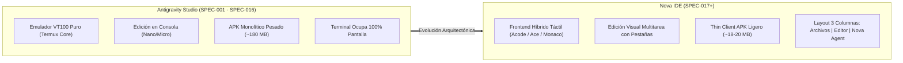
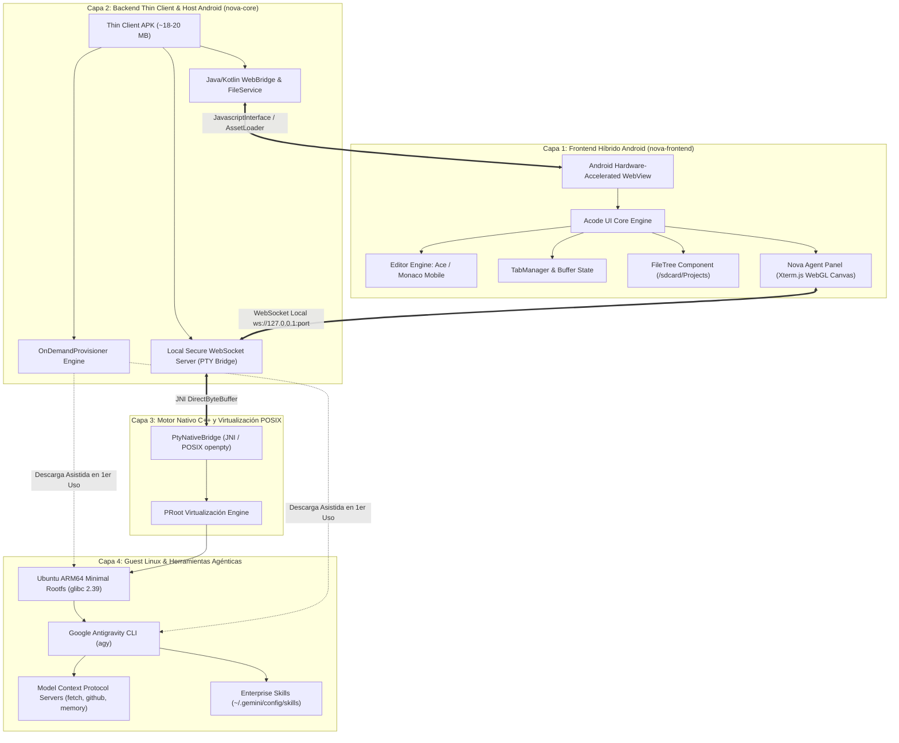
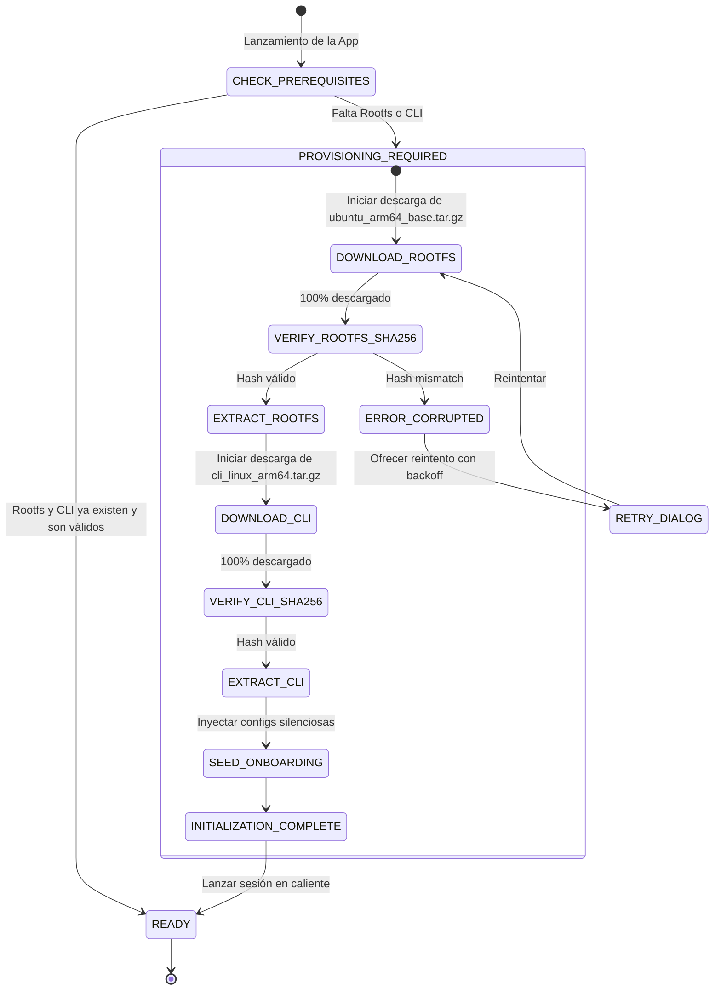
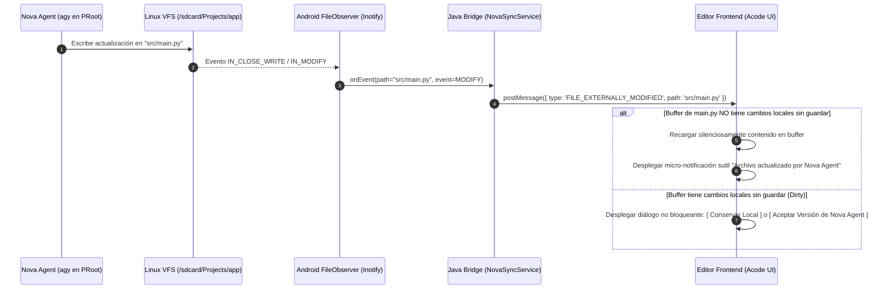
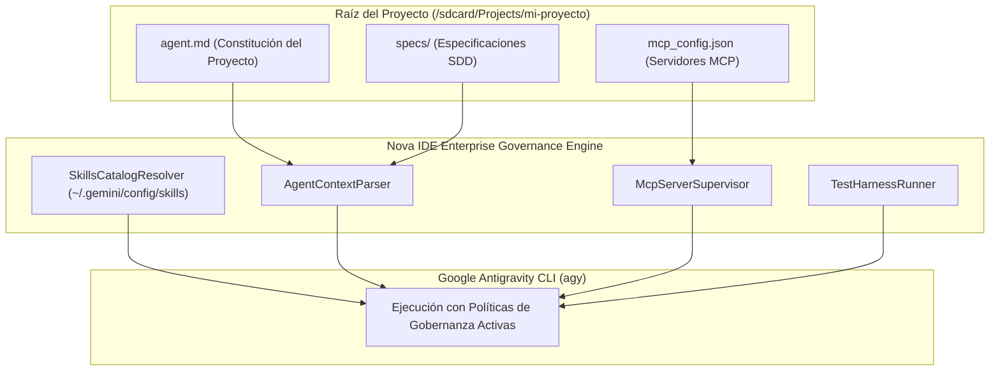

# SPEC-017: Arquitectura de Nova IDE - Entorno de Desarrollo Táctil y Panel de Agente Inteligente Unificado

| Metadato | Valor |
| :--- | :--- |
| **Identificador** | `SPEC-017` |
| **Título** | Arquitectura de Nova IDE: Entorno de Desarrollo Táctil y Panel de Agente Inteligente Unificado |
| **Autor** | `@spec-architect` |
| **Estado** | `APPROVED FOR IMPLEMENTATION` |
| **Fecha de Creación** | 2026-09-13 |
| **Dispositivo Objetivo** | Xiaomi Pad 6 (Qualcomm Snapdragon 870, ARM64-v8a, 6 GB RAM, 11" 2.8K 144Hz, Xiaomi HyperOS / Android 13/14) y Dispositivos Móviles Android (API 26+) |
| **Runtime Target** | Android WebView Acelerado por Hardware / JavaScript / TypeScript / C++20 POSIX PTY / PRoot Linux Ubuntu ARM64 (glibc) / Google Antigravity CLI (`agy`) |
| **Módulos Afectados** | `nova-frontend/`, `nova-core/`, `nova-pty-bridge/`, `harness/`, `specs/` |

---

## 1. Contexto, Motivación y Fundamentos Estratégicos

### 1.1 Evolución Histórica: De Emulador VT100 Puro a IDE Móvil Unificado
Durante las etapas de desarrollo previas ([`SPEC-000`](file:///c:/Projects/antigravity/specs/00-system-architecture.md) a [`SPEC-016`](file:///c:/Projects/antigravity/specs/16-cold-boot-resilience-and-auth-persistence.md)), la estación agéntica **Antigravity Studio** se fundamentó en una bifurcación directa de Termux Core. Dicho enfoque permitió validar con éxito la virtualización en espacio de usuario mediante PRoot en Linux Ubuntu ARM64 con glibc, resolviendo desafíos críticos como la precarga Bionic, la resolución DNS, los certificados TLS y la autenticación OAuth 2.0 PKCE con tarjetas flotantes inteligentes.

No obstante, la experiencia de desarrollo en pantallas táctiles sobre un emulador de terminal VT100 puro evidenció limitaciones de ergonomía fundamentales:

1. **Fricción de Edición Táctil en Consola:** La edición de código fuente dentro de editores de consola (Nano, Micro o Neovim) en pantallas táctiles carece de las comodidades indispensables de un entorno moderno: selección precisa mediante asas táctiles nativas, gestos de desplazamiento inercial suave, autocompletado enriquecido visualmente, minimapa de código y apertura simultánea de múltiples archivos en pestañas independientes.
2. **Fragmentación Visual y Falta de Visión Holística:** En una terminal exclusiva, el desarrollador debe alternar continuamente entre la edición del código y la interacción con el agente de IA, perdiendo el contexto del archivo mientras el agente emite su razonamiento (*thinking blocks*) o ejecuta pruebas.
3. **Sobrecarga de Paquete Binario (Fat APK):** El empaquetado monolítico de la imagen raíz de Ubuntu (100+ MB comprimida) dentro del APK elevó su tamaño a casi 180 MB, generando fricciones en la distribución, actualizaciones pesadas y un consumo excesivo de almacenamiento base.

**Nova IDE** nace como la respuesta arquitectónica definitiva: la evolución hacia un entorno de desarrollo integrado táctil móvil de grado profesional, con arquitectura desacoplada en dos capas (*Thin Client* + *On-Demand Engine*), diseñado para fusionar un editor táctil moderno con un panel de agente inteligente en tiempo real.



---

### 1.2 Separación de Responsabilidades: Edición Táctil Visual vs. Motor Agéntico de Ejecución
La arquitectura de Nova IDE consagra una separación estricta de dominios:

- **Dominio de Presentación y Manipulación (Frontend):** Responsable de la visualización del árbol de proyectos, gestión de pestañas, coloreado de sintaxis, plegado de código, autocompletado y edición táctil con baja latencia sobre el WebView de Android.
- **Dominio de Razonamiento y Ejecución (Backend Agéntico):** Responsable de hospedar el runtime glibc de Linux, gestionar las herramientas del sistema (Node.js, Python, Git), ejecutar el CLI oficial de Google Antigravity (`agy`), invocar los servidores MCP y ejecutar comandos en un PTY nativo.
- **Canal de Sincronización:** Un bus de eventos bidireccional y un file-watcher reactivo que garantizan que cualquier cambio producido por el agente se refleje inmediatamente en el editor y viceversa, sin carreras de datos ni pérdidas de estado.

---

### 1.3 Protección de Marca e Independencia de Propiedad Intelectual
El producto adopta formalmente la denominación propia **Nova IDE**:

1. **Autonomía de Marca y Neutralidad:** El término "Antigravity" es una marca y producto de Google LLC. Utilizarlo en el identificador principal de la aplicación o en la marca comercial generaría riesgos legales y de propiedad intelectual.
2. **Identidad de Ecosistema Abierto:** Nova IDE se define como una plataforma móvil agéntica universal. Si bien integra de manera nativa y optimizada el Google Antigravity CLI (`agy`), su arquitectura está preparada para orquestar múltiples motores y modelos de lenguaje de frontera (Gemini, Claude, GPT, modelos locales ONNX/GGUF).
3. **Distinción de Nivel de Producto:** "Nova IDE" comunica de inmediato que se trata de un entorno de desarrollo completo, superando la percepción de un simple "emulador de terminal con parches".

---

## 2. Identidad Visual, Design System y Ergonomía

### 2.1 Nombre e Isotipo Simbólico `‹ ✦ ›`
La identidad de Nova IDE fusiona dos conceptos nucleares: la precisión del código fuente y el poder generativo de la inteligencia artificial.

- **Nombre:** **Nova IDE** (evocando el nacimiento estelar de una supernova: energía concentrada, expansión y luz en la oscuridad del espacio profundo).
- **Isotipo:** `‹ ✦ ›`
  - Los corchetes angulares `‹ ›` simbolizan el código fuente estructurado, los tags HTML/XML y la sintaxis algorítmica.
  - La estrella o nova central de cuatro puntas `✦` representa la chispa de la inteligencia agéntica, la asistencia inteligente y el destello de la creación autónoma de software.

```
      ‹   ✦   ›
   [CODE]  [AI]  [CODE]
```

---

### 2.2 Paleta Cromática "Deep Cosmos & Supernova Cyan"
El sistema de diseño de Nova IDE se basa en una paleta cromática oscura de alto contraste, optimizada para la pantalla 2.8K de la Xiaomi Pad 6 y paneles AMOLED/IPS, reduciendo la fatiga visual en sesiones prolongadas de programación.

| Nombre de Token | Código HEX | Rol y Aplicación en la Interfaz |
| :--- | :--- | :--- |
| **`Deep Void`** | `#090d16` | Fondo primario del lienzo de la aplicación, barra de navegación base y fondos de paneles colapsados. |
| **`Dark Slate`** | `#111827` | Fondo de tarjetas elevadas, cabeceras de pestañas activas, barras de herramientas y menús contextuales. |
| **`Supernova Cyan`** | `#00f0ff` | Acento primario, cursor de edición, selección de archivos activa, bordes de foco e indicador de latido del agente. |
| **`Stellar Violet`** | `#8b5cf6` | Acento secundario para insignias (*badges*) de estado del agente, llamadas a herramientas MCP y tokens semánticos. |
| **`Code Text`** | `#e2e8f0` | Tipografía principal de código y texto en UI; máximo contraste y legibilidad según estándares WCAG AAA. |
| **`Subtle Border`** | `#1e293b` | Divisores de columnas, bordes de pestañas inactivas y líneas de cuadrícula del árbol de archivos. |
| **`Obsidian Terminal`** | `#030712` | Fondo absoluto para el lienzo del emulador Xterm.js en el panel de agente. |
| **`Status Success`** | `#10b981` | Notificaciones exitosas, tests pasando, estado de sincronización limpio. |
| **`Status Warning`** | `#f59e0b` | Alertas de conflictos de archivo, warnings de linters y avisos de cuota. |
| **`Status Error`** | `#ef4444` | Fallos de compilación, excepciones en la terminal y errores de aprovisionamiento. |

---

### 2.3 Tipografía de Código y UI
1. **Tipografía de Código:** `JetBrains Mono` / `Fira Code` (formato WOFF2 local integrado en assets) con soporte de ligaduras tipográficas (`->`, `===`, `!=`, `=>`), tamaño configurable (10pt a 18pt) y espaciado de línea de $1.4\times$.
2. **Tipografía de UI:** `Inter` o `Roboto Flex` nativa de Android, con escalas tipográficas jerárquicas desde 10sp (metadatos/breadcrumbs) hasta 16sp (títulos de diálogo y cabeceras).
3. **Iconografía:** Glyphs integrados de *Nerd Fonts* y *Lucide Icons* vectoriales SVG para renderizado nítido a 2.8K sin pixelación.

---

### 2.4 Ergonomía y Distribución Responsiva

#### A. Dispositivos Tablet (Xiaomi Pad 6: 11" 2.8K 144Hz, 16:10, $2880 \times 1800$):
La interfaz aprovecha el ancho de pantalla para desplegar una distribución simultánea de tres columnas:

```
+-----------------------------------------------------------------------------------------------+
| [‹ ✦ › Nova IDE]  [index.ts *] [styles.css] [+]            [⛶ Max] [⚙] [Project: calculadora]|
+---------------+-----------------------------------------------+-------------------------------+
| ☰ EXPLORER    | 1  import { createAgent } from 'nova';        | ✦ NOVA AGENT / ASK        [⛶] |
|               | 2                                             |                               |
| v calculadora | 3  export const main = async () => {          | > agy --interactive           |
|   > src       | 4    const agent = createAgent({              |                               |
|     index.ts  | 5      model: 'gemini-2.5-pro',               | [Thinking: Analizando spec]   |
|     utils.ts  | 6      temperature: 0.2                       | He verificado la función en   |
|   package.json| 7    });                                      | index.ts:4. Procederé a crear |
|   agent.md    | 8    await agent.solve();                     | el test unitario.             |
|   README.md   | 9  };                                         |                               |
|               | 10                                            | $ npm test                    |
|               |                                               | PASS  src/index.test.ts       |
|               |                                               |                               |
+---------------+-----------------------------------------------+-------------------------------+
| STATUS BAR: UTF-8 | TypeScript | LF | Spaces: 2 | Git: main   | Xterm.js: 144Hz | glibc Ubuntu|
+-----------------------------------------------------------------------------------------------+
```

- **Sidebar Izquierdo (Archivos):** Ancho base de 240dp (ajustable o colapsable con un toque en `☰`).
- **Área Central (Editor Workspace):** Ancho flexible (45% a 60% del espacio), con pestañas de desplazamiento horizontal, barra de números de línea (*gutter*) y minimapa opcional.
- **Sidebar Derecho (Nova Agent / Ask):** Ancho base de 340dp a 420dp. Contiene el terminal Xterm.js conectado a `agy`. Incluye el botón **`⛶` (Toggle Maximize)** en la esquina superior derecha: al pulsarlo, el agente se expande al 100% del ancho para revisar logs extensos, y al volver a pulsar se restaura la vista dividida.

#### B. Dispositivos Smartphone (< 7"):
- La pantalla muestra el Editor Workspace como vista primaria.
- El Explorador de Archivos opera como un Drawer lateral deslizable desde el borde izquierdo (*Off-canvas Drawer*).
- El panel Nova Agent se aloja en un panel deslizable inferior (*Bottom Sheet*) o en una pestaña superior conmutadora: `[ ‹ Code › ]` / `[ ✦ Agent ]`.

---

## 3. Arquitectura del Sistema (Thin Client & On-Demand Engine)



---

### 3.1 Modelo de Empaquetado Thin Client (~18 - 20 MB)
A diferencia del enfoque heredado donde el APK contenía la imagen completa de Linux comprimida (`fat APK`), Nova IDE se distribuye como un cliente ligero:

1. **Contenido del APK Base:**
   - Binarios compartidos nativos compilados en C++20 (`libproot.so`, `libpty.so`, `libtuntap.so`) optimizados para `arm64-v8a`: ~4 MB.
   - Assets empaquetados de la interfaz híbrida (código HTML, bundles JS/CSS minificados de Acode, Ace Editor y Xterm.js): ~12 MB.
   - Clases DEX de la capa de hosting Android (Servicios en primer plano, gestores de red, puente WebView): ~3 MB.
   - **Tamaño Total del Instalador APK:** **~19 MB** (fácil descarga e instalación instantánea desde GitHub Releases o tiendas de aplicaciones).

---

### 3.2 Backend de Aprovisionamiento Asistido Bajo Demanda (`OnDemandProvisioner`)
Cuando Nova IDE se ejecuta por primera vez, el sistema detecta que el entorno Linux no ha sido inicializado en `/data/data/com.nova.ide/files/usr/`. En lugar de fallar, activa automáticamente el asistente de aprovisionamiento en la interfaz:



#### Especificaciones del Aprovisionamiento:
- **Descargas Reanudables (HTTP Range Requests):** El gestor de descargas utiliza peticiones segmentadas para soportar pausas o interrupciones de conectividad móvil.
- **Validación Criptográfica:** Cada activo cuenta con una suma de verificación SHA-256 inmutable verificada antes de cualquier descompresión.
- **Configuración Silenciosa Inyectada (`Silent Seeding`):** Inmediatamente después de extraer los binarios, el aprovisionador escribe:
  - `/root/.antigravity/onboarding.json` (`securityAgreed: true`, `colorSchemeIndex: 0`, `consumerOnboardingComplete: true`).
  - `/root/.antigravity/settings.json` (`workspaceTrust: true`, `trustedWorkspaces: ["*"]`, `theme: "terminal"`).
- **Notificaciones de Progreso:** La máquina de estados emite eventos reactivos a la UI (`percentage`, `speed_mbps`, `step_description`) para renderizar una barra de progreso estelar con diseño Supernova Cyan.

---

### 3.3 Frontend Híbrido: Acode Core + Ace / Monaco Engine
La interfaz gráfica se ejecuta sobre un `WebView` acelerado por hardware con la siguiente configuración técnica de alta seguridad:

1. **Servidor de Contenidos Local Seguro:** Se emplea `androidx.webkit.WebViewAssetLoader` con dominio virtual `https://appassets.androidplatform.net/` mapeando a `assets/nova-ui/`. Se deshabilitan estrictamente `setAllowFileAccess(false)` y `setAllowUniversalAccessFromFileURLs(false)` para cumplir con las mejores prácticas de seguridad de Android.
2. **Motor de Edición:** Adaptación del núcleo de Acode basada en Ace Editor (optimizada para dispositivos móviles) con soporte opcional para Monaco Editor en dispositivos con 6 GB+ de RAM.
3. **Manejo Táctil Optimizado:**
   - Asas de selección táctil con retraso de toque reducido a cero.
   - Barra de herramientas virtual táctil (*Productivity Bar*) flotante sobre el teclado en pantalla, con botones: `TAB`, `ESC`, `CTRL`, `ALT`, `{`, `}`, `(`, `)`, `;`, `"`, `'`, `/`, `\`, `|`, `~`, `_`, `=`, `-`.
   - Soporte nativo para puntero de Stylus (Xiaomi Smart Pen) para selección y cursor con precisión de píxel.

---

### 3.4 Panel Lateral "Nova Agent / Ask" y Terminal Xterm.js
El panel lateral derecho aloja una instancia de **Xterm.js v5+** configurada con el addon `@xterm/addon-webgl` para garantizar una tasa de refresco fluida a 144Hz en la Xiaomi Pad 6.

1. **Conexión al PTY Nativo:**
   - Xterm.js se comunica con el backend mediante un WebSocket local loopback (`ws://127.0.0.1:<random_port>/pty?session=<id>&token=<auth_token>`).
   - El backend hospeda un servidor WebSocket ligero en Kotlin/Java conectado mediante JNI a `openpty()` en C++.
   - Soporta control de tamaño de ventana con despacho automático de señales `SIGWINCH` cuando el usuario redimensiona la columna o pulsa el botón maximizar `⛶`.
2. **Botón Maximizar `⛶` (Toggle Maximize):**
   - Transición CSS acelerada por hardware de 200ms que expande el panel del agente de su ancho habitual (380dp) al 100% de la ventana, ocultando temporalmente el editor y el explorador de archivos.
   - Permite al usuario inspeccionar salidas de compilación largas, gráficos ANSI o trazas de error sin scroll horizontal estrangulado.
   - Al volver a pulsar `⛶` o presionar la tecla física `ESC`, el panel se restaura a su ancho previo.

---

### 3.5 Sincronización Reactiva de Archivos (FileWatcher y Detección de Cambios)
Dado que el agente inteligente (`agy`) puede modificar o crear múltiples archivos en el sistema de archivos de Linux mientras el usuario tiene archivos abiertos en el editor táctil:



---

## 4. Integración con Gobernanza Empresarial y Ecosistema Agéntico

Nova IDE implementa compatibilidad total y sin concesiones con el marco de gobernanza técnica definido en [`agent.md`](file:///c:/Projects/antigravity/agent.md).



---

### 4.1 Soporte Nativo de `agent.md` y Políticas SDD
Al abrir cualquier carpeta de proyecto:
1. **Detección Automática:** El sistema examina la existencia de `agent.md` en la raíz del proyecto.
2. **Inyección de Directivas:** Si está presente, parsea las invariantes del proyecto, los roles de agentes asignados (`@spec-architect`, `@android-core`, `@qa-harness`), las restricciones de herramientas permitidas/bloqueadas y la metodología obligatoria (Spec-Driven Development, SDD).
3. **Inicialización del Prompt de Contexto:** Cuando se lanza la sesión agéntica en el panel derecho, Nova IDE antepone al agente las instrucciones normativas de `agent.md` garantizando que no se introduzcan desviaciones en el código ni se edite código sin una especificación previa en `specs/`.

---

### 4.2 Catálogo de Skills Agénticas (`~/.gemini/config/skills/`)
Nova IDE mapea el directorio global de skills de usuario ubicado en `/root/.gemini/config/skills/`:
- **Carga Dinámica:** El agente tiene acceso en caliente al skill `enterprise-orchestrator`, así como a skills especializadas para desarrollo Android, auditorías de seguridad y formateo de código.
- **Visualizador de Habilidades en UI:** El panel de configuración de Nova IDE expone una lista interactiva de las habilidades instaladas, permitiendo habilitar o deshabilitar skills con interruptores táctiles.

---

### 4.3 Servidores Model Context Protocol (MCP)
El sistema soporta la especificación oficial de MCP:
- **Archivo de Configuración:** Lee `mcp_config.json` tanto a nivel de proyecto como en la configuración global de Nova IDE.
- **Servidores Pre-aprobados:**
  - `fetch`: Descarga de recursos HTTP e inspección de documentación técnica externa.
  - `github`: Gestión de repositorios, commits, ramas, PRs y sincronización con GitHub Enterprise.
  - `memory`: Grafo de memoria contextual persistente para recordar decisiones de diseño y arquitecturas pasadas entre diferentes sesiones de trabajo.

---

### 4.4 Integración con el Arnés de Pruebas de Calidad (Quality Gates)
En la barra de estado inferior de Nova IDE se ubica el botón **`[ 🛡️ Quality Gates ]`**:
- Al ser presionado, ejecuta de forma no interactiva el script de arnés de pruebas del proyecto (`harness/run_tests.sh` o equivalente).
- Los resultados de cada compuerta (`AC-COLD-*`, `AC-SILENT-*`, `AC-NOVA-*`) se muestran visualmente con indicadores de semáforo verde (`PASS`), amarillo (`WARN`) o rojo (`FAIL`).

---

## 5. Contratos Formales de Interfaces y Protocolos

### 5.1 Contrato de Eventos de Interfaz de Usuario (`NovaUIEventsContract`)
Define los mensajes intercambiados entre el WebView JavaScript de Acode y el controlador nativo de Android vía `window.NovaHostBridge.postMessage(jsonString)`:

```typescript
// Payload para eventos emitidos desde el Frontend (WebView) hacia el Host Nativo
export type NovaUIEvent = 
  | { type: 'UI_READY'; payload: { clientVersion: string; screenDpi: number } }
  | { type: 'OPEN_FILE_REQUEST'; payload: { absolutePath: string } }
  | { type: 'SAVE_FILE_REQUEST'; payload: { absolutePath: string; content: string; hash: string } }
  | { type: 'RESIZE_TERMINAL'; payload: { cols: number; rows: number; widthPx: number; heightPx: number } }
  | { type: 'TOGGLE_AGENT_MAXIMIZE'; payload: { isMaximized: boolean } }
  | { type: 'TRIGGER_QUALITY_GATES'; payload: { projectRoot: string } };

// Payload para eventos emitidos desde el Host Nativo hacia el Frontend (WebView)
export type NovaHostEvent = 
  | { type: 'FILE_EXTERNALLY_MODIFIED'; payload: { absolutePath: string; newHash: string } }
  | { type: 'FILE_TREE_UPDATED'; payload: { rootPath: string; treeJson: string } }
  | { type: 'PROVISIONING_PROGRESS'; payload: { step: string; percentage: number; speedMbps: number } }
  | { type: 'AGENT_STATUS_CHANGED'; payload: { state: 'IDLE' | 'THINKING' | 'EXECUTING' | 'ERROR' } };
```

---

### 5.2 Contrato del Puente PTY WebSocket (`NovaPtyBridgeContract`)
El canal de comunicación en tiempo real entre la terminal Xterm.js y el proceso del motor de Linux se estructura mediante tramas binarias y de texto sobre WebSocket:

| Tipo de Trama | Dirección | Estructura / Formato | Propósito |
| :--- | :--- | :--- | :--- |
| **`Binary (0x02)`** | Bidireccional | Raw UTF-8 Bytes stream | Entrada de teclado del usuario hacia el PTY (`stdin`) y salida del shell hacia el terminal (`stdout`/`stderr`). |
| **`Text JSON`** | Cliente &rarr; Servidor | `{"type": "resize", "cols": 120, "rows": 36}` | Notificación de cambio de dimensiones de pantalla (`ioctl(TIOCSWINSZ)`). |
| **`Text JSON`** | Cliente &rarr; Servidor | `{"type": "signal", "signal": "SIGINT"}` | Despacho de señales POSIX al grupo de procesos del PTY. |
| **`Text JSON`** | Servidor &rarr; Cliente | `{"type": "exit", "exitCode": 0}` | Notificación de cierre del proceso hijo del shell. |

---

### 5.3 Contrato de la Máquina de Estados de Aprovisionamiento (`NovaOnDemandProvisioningContract`)

```json
{
  "$schema": "http://json-schema.org/draft-07/schema#",
  "title": "NovaOnDemandProvisioningState",
  "type": "object",
  "required": ["state", "progressPercentage", "stepDescription", "bytesDownloaded", "totalBytes"],
  "properties": {
    "state": {
      "type": "string",
      "enum": [
        "IDLE",
        "CHECKING_PREREQUISITES",
        "DOWNLOADING_ROOTFS",
        "VERIFYING_ROOTFS_SHA256",
        "EXTRACTING_ROOTFS",
        "DOWNLOADING_CLI",
        "VERIFYING_CLI_SHA256",
        "EXTRACTING_CLI",
        "SEEDING_ONBOARDING",
        "READY",
        "ERROR"
      ]
    },
    "progressPercentage": {
      "type": "integer",
      "minimum": 0,
      "maximum": 100
    },
    "stepDescription": {
      "type": "string"
    },
    "bytesDownloaded": {
      "type": "integer",
      "minimum": 0
    },
    "totalBytes": {
      "type": "integer",
      "minimum": 0
    },
    "errorDetails": {
      "type": ["string", "null"]
    }
  }
}
```

---

### 5.4 Contrato del Monitor y Sincronización de Archivos (`NovaFileWatcherContract`)
1. **Ruta Base Monitoreada:** `/sdcard/Projects/` y carpetas de proyectos activas vinculadas en el espacio de trabajo.
2. **Máscara de Eventos Inotify Monitoreados:**
   - `IN_CLOSE_WRITE`: El agente o una herramienta terminó de guardar un archivo.
   - `IN_CREATE` / `IN_MOVED_TO`: Nuevo archivo o directorio creado dentro del proyecto.
   - `IN_DELETE` / `IN_MOVED_FROM`: Archivo o directorio eliminado.
3. **Debounce y Coalescencia:** Los eventos se agrupan en una ventana de debounce de $150\,\text{ms}$ para evitar saturación de mensajes durante operaciones intensivas de disco (como `npm install` o `git checkout`).
4. **Política de Conservación de Cambios:** Si un archivo abierto contiene cambios no guardados en el editor, Nova IDE jamás sobreescribirá el contenido sin requerir confirmación explícita del usuario mediante un diálogo modal con vista de diferencias (*diff viewer*).

---

## 6. Matriz de Criterios de Aceptación del Arnés (`AC-NOVA-*`)

| Identificador | Módulo Objetivo | Condición de Prueba | Comportamiento Esperado | Método de Verificación |
| :--- | :--- | :--- | :--- | :--- |
| **`AC-NOVA-001`** | `Design System` | Inspección de paleta de colores y constantes visuales | Deep Void (`#090d16`), Supernova Cyan (`#00f0ff`) y Stellar Violet (`#8b5cf6`) definidos como tokens principales. | Verificación de variables CSS/tokens en `nova-frontend/src/theme.css` o especificación formal. |
| **`AC-NOVA-002`** | `Design System` | Presencia del isotipo y nombre de marca | El nombre formal es **Nova IDE** y el isotipo es `‹ ✦ ›`. | `grep -q '‹ ✦ ›' specs/17-nova-ide-architecture-and-ui.md` y en cabecera UI. |
| **`AC-NOVA-003`** | `UI Layout` | Estructura de tres columnas en tablet | Sidebar de archivos (colapsable `☰`), Editor Workspace (pestañas), y panel lateral Nova Agent (`⛶`). | Comprobación de layout en el diseño del frontend y contratos de eventos. |
| **`AC-NOVA-004`** | `Packaging` | Arquitectura Thin Client | El instalador APK base no incluye la imagen rootfs completa y su peso proyectado es $\le 20\,\text{MB}$. | `AC-PACKAGING-SIZE`: Validación de exclusión de rootfs en el empaquetado del APK base. |
| **`AC-NOVA-005`** | `Provisioning` | Asistente bajo demanda en primer arranque | Si no existe el rootfs en el dispositivo, se activa la máquina de estados de descarga asistida con SHA-256. | Verificación de `NovaOnDemandProvisioningContract` y validación de hash. |
| **`AC-NOVA-006`** | `Onboarding` | Pre-sembrado silencioso de configuración | Inyección automática de `onboarding.json` y `settings.json` eliminando wizards interactivos. | Claves `securityAgreed: true`, `workspaceTrust: true`, `colorSchemeIndex: 0` presentes. |
| **`AC-NOVA-007`** | `Terminal Bridge` | Xterm.js a 144Hz y botón maximizar | Xterm.js utiliza WebGL Canvas y cuenta con botón `⛶` que expande el terminal al 100% de la ventana. | Verificación de integración de `@xterm/addon-webgl` y evento `TOGGLE_AGENT_MAXIMIZE`. |
| **`AC-NOVA-008`** | `Governance` | Detección y respeto de `agent.md` | Nova IDE parsea `agent.md` en la raíz del proyecto e inyecta las directivas de gobernanza al agente. | Comprobación de contrato de contexto y lectura de `agent.md`. |
| **`AC-NOVA-009`** | `Governance` | Soporte para servidores MCP y skills | Soporte estructurado para `mcp_config.json` y skills en `~/.gemini/config/skills/`. | Verificación del catálogo de skills y definición de supervisores MCP. |
| **`AC-NOVA-010`** | `File Sync` | FileWatcher reactivo y anti-sobrescritura | Los cambios del agente se notifican al editor; los archivos con cambios locales no guardados están protegidos. | Validación del contrato `NovaFileWatcherContract` con ventana de debounce. |

---

## 7. Script Automatizado de Verificación para el Arnés (`test_nova_ide_architecture.sh`)

```bash
#!/bin/bash
# Test Harness - Automated Verification for SPEC-017 (Nova IDE Architecture)
set -e

SPEC_FILE="specs/17-nova-ide-architecture-and-ui.md"

echo "=== INICIANDO VERIFICACIÓN DE ARQUITECTURA DE NOVA IDE (SPEC-017) ==="

# 1. Verificar existencia y legibilidad de la especificación
echo -n "1. Verificando existencia de SPEC-017... "
if [ ! -f "$SPEC_FILE" ]; then
    echo "FALLO: El archivo $SPEC_FILE no existe en el repositorio."
    exit 1
fi
echo "[OK]"

# 2. Verificar identidad visual y nomenclatura
echo -n "2. Verificando identidad visual y marca Nova IDE... "
grep -q "Nova IDE" "$SPEC_FILE" || { echo "FALLO: Nombre 'Nova IDE' ausente"; exit 1; }
grep -q "‹ ✦ ›" "$SPEC_FILE" || { echo "FALLO: Isotipo '‹ ✦ ›' ausente"; exit 1; }
grep -q "#090d16" "$SPEC_FILE" || { echo "FALLO: Color Deep Void #090d16 ausente"; exit 1; }
grep -q "#00f0ff" "$SPEC_FILE" || { echo "FALLO: Color Supernova Cyan #00f0ff ausente"; exit 1; }
grep -q "#8b5cf6" "$SPEC_FILE" || { echo "FALLO: Color Stellar Violet #8b5cf6 ausente"; exit 1; }
echo "[OK]"

# 3. Verificar arquitectura Thin Client y aprovisionamiento bajo demanda
echo -n "3. Verificando arquitectura Thin Client y On-Demand Provisioning... "
grep -q "Thin Client" "$SPEC_FILE" || { echo "FALLO: Mención a Thin Client ausente"; exit 1; }
grep -q "OnDemandProvisioner" "$SPEC_FILE" || { echo "FALLO: OnDemandProvisioner ausente"; exit 1; }
grep -q "SHA-256" "$SPEC_FILE" || { echo "FALLO: Verificación SHA-256 ausente"; exit 1; }
grep -q "securityAgreed" "$SPEC_FILE" || { echo "FALLO: Inyección silenciosa de onboarding ausente"; exit 1; }
echo "[OK]"

# 4. Verificar layout de tres columnas y terminal Xterm.js
echo -n "4. Verificando layout de 3 columnas y capacidades de Xterm.js... "
grep -q "Acode" "$SPEC_FILE" || { echo "FALLO: Motor táctil Acode ausente"; exit 1; }
grep -q "Xterm.js" "$SPEC_FILE" || { echo "FALLO: Componente Xterm.js ausente"; exit 1; }
grep -q "Toggle Maximize" "$SPEC_FILE" || { echo "FALLO: Función maximizar terminal ausente"; exit 1; }
grep -q "144Hz" "$SPEC_FILE" || { echo "FALLO: Optimización 144Hz ausente"; exit 1; }
echo "[OK]"

# 5. Verificar integración con gobernanza empresarial (agent.md, skills, MCP)
echo -n "5. Verificando gobernanza empresarial (agent.md, skills, MCP)... "
grep -q "agent.md" "$SPEC_FILE" || { echo "FALLO: Soporte de agent.md ausente"; exit 1; }
grep -q "enterprise-orchestrator" "$SPEC_FILE" || { echo "FALLO: Soporte de skills ausente"; exit 1; }
grep -q "mcp_config.json" "$SPEC_FILE" || { echo "FALLO: Soporte de servidores MCP ausente"; exit 1; }
echo "[OK]"

# 6. Verificar contratos de interfaces y criterios de aceptación
echo -n "6. Verificando contratos de interfaces y matriz de aceptación... "
grep -q "NovaUIEventsContract" "$SPEC_FILE" || { echo "FALLO: NovaUIEventsContract ausente"; exit 1; }
grep -q "NovaPtyBridgeContract" "$SPEC_FILE" || { echo "FALLO: NovaPtyBridgeContract ausente"; exit 1; }
grep -q "NovaOnDemandProvisioningContract" "$SPEC_FILE" || { echo "FALLO: NovaOnDemandProvisioningContract ausente"; exit 1; }
grep -q "NovaFileWatcherContract" "$SPEC_FILE" || { echo "FALLO: NovaFileWatcherContract ausente"; exit 1; }
grep -q "AC-NOVA-001" "$SPEC_FILE" || { echo "FALLO: Criterio AC-NOVA-001 ausente"; exit 1; }
grep -q "AC-NOVA-010" "$SPEC_FILE" || { echo "FALLO: Criterio AC-NOVA-010 ausente"; exit 1; }
echo "[OK]"

echo "=== TODAS LAS COMPUERTAS DE VALIDACIÓN DE SPEC-017 HAN PASADO EXITOSAMENTE ==="
```

---

## 8. Conclusión y Hoja de Ruta de Implementación (Roadmap)

La especificación técnica **`SPEC-017`** establece los cimientos formales para la transformación de Antigravity en **Nova IDE**, un entorno de ingeniería móvil agéntico integral:

1. **Fase 1 (Frontend & Design System):** Creación del contenedor WebView seguro en Android, integración del bundle de Acode con paleta Deep Cosmos & Cyan, y layout responsivo de tres columnas.
2. **Fase 2 (Thin Client & Motor de Aprovisionamiento):** Implementación del `OnDemandProvisioner` en segundo plano con descargas segmentadas reanudables y verificación de hashes SHA-256.
3. **Fase 3 (Puente PTY y Nova Agent):** Vinculación de Xterm.js acelerado por WebGL con el proceso POSIX en Linux PRoot, habilitando el botón maximizar `⛶` y la inyección contextual de código.
4. **Fase 4 (Gobernanza y Sincronización):** Activación del parser de `agent.md`, conexión con servidores MCP, y despliegue del `FileWatcher` reactivo con prevención de colisiones.
