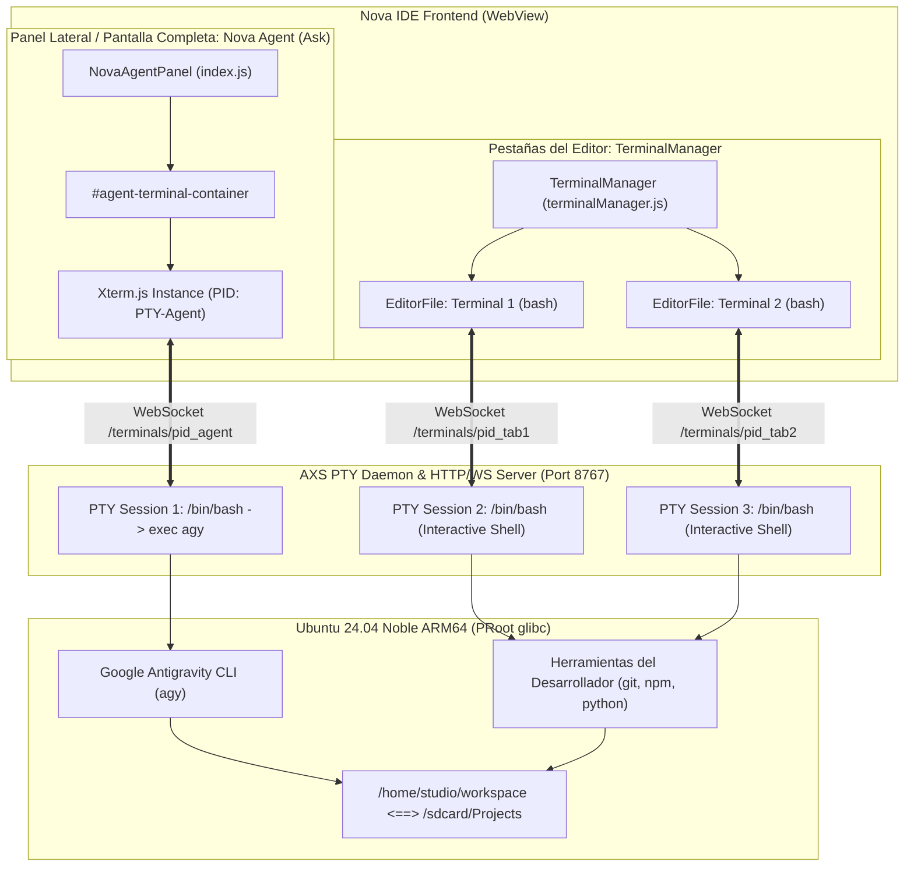
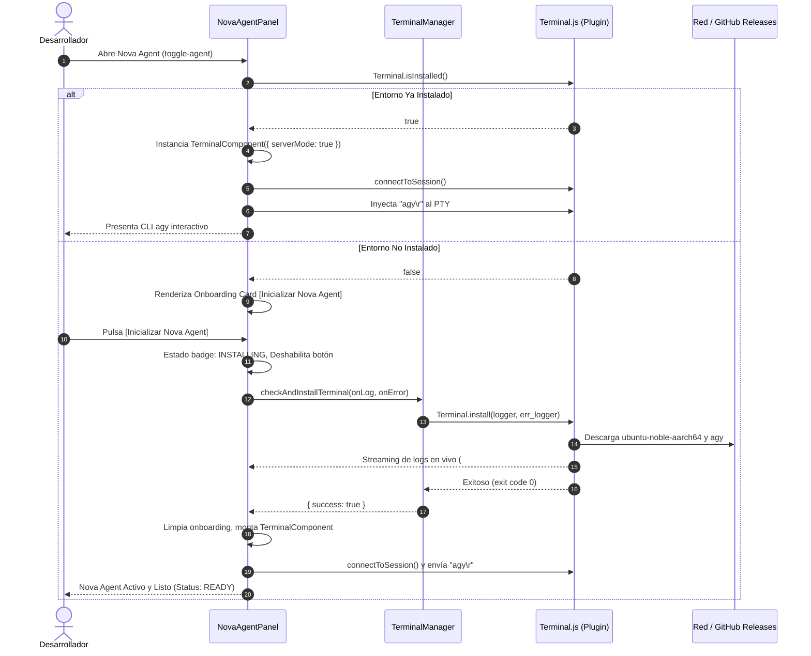

# SPEC-018: Arquitectura Dual-Terminal, Recuperación del Rootfs Ubuntu Noble y Onboarding Agéntico en Nova IDE

| Metadato | Valor |
| :--- | :--- |
| **Identificador** | `SPEC-018` |
| **Título** | Arquitectura Dual-Terminal, Recuperación del Rootfs Ubuntu Noble y Onboarding Agéntico en Nova IDE |
| **Autor** | `@android-core` / `@spec-architect` |
| **Estado** | `APPROVED FOR IMPLEMENTATION` |
| **Fecha de Creación** | 2026-09-13 |
| **Dispositivo Objetivo** | Dispositivos Android Móviles y Tablets (ARM64-v8a, API 26+), Xiaomi Pad 6 |
| **Runtime Target** | Android WebView / PRoot Linux Ubuntu 24.04 Noble ARM64 / Google Antigravity CLI (`agy`) / Xterm.js / AXS PTY Service |
| **Módulos Afectados** | `specs/`, `nova-src/src/plugins/terminal/`, `nova-src/src/components/agentPanel/`, `nova-src/src/components/terminal/`, `nova-src/src/pages/welcome/`, `nova-src/src/main.js` |

---

## 1. Contexto y Diagnóstico del Incidente

### 1.1 Diagnóstico de Causa Raíz del Error HTTP 404 en Descarga de Rootfs
Durante la prueba de aprovisionamiento bajo demanda en el runtime ARM64, la descarga del rootfs base de Ubuntu falló con error HTTP 404:
- **URL Errónea:** `https://github.com/termux/proot-distro/releases/download/v4.18.0/ubuntu-aarch64-pd-v4.18.0.tar.xz`
- **Causa Raíz:** A partir de la versión v4.18.0 del repositorio oficial `termux/proot-distro`, las imágenes de Ubuntu incorporan el nombre de la versión LTS de Ubuntu (`noble` - Ubuntu 24.04 LTS) en el nombre del archivo de release para la arquitectura aarch64.
- **URL Canónica Correcta:**
  `https://github.com/termux/proot-distro/releases/download/v4.18.0/ubuntu-noble-aarch64-pd-v4.18.0.tar.xz`

Al corregir este identificador, el cliente HTTP de Cordova descarga exitosamente la imagen raíz de Ubuntu Noble glibc sin interrupciones.

---

## 2. Arquitectura Dual-Terminal: Coexistencia Multiterminal en Nova IDE

Para resolver la tensión ergonómica entre la interacción continua con el agente de IA (`agy`) y la necesidad del desarrollador de ejecutar comandos manuales de prueba (`bash`, `git`, `python`, `npm`), Nova IDE establece el patrón formal **Dual-Terminal**:

### 2.1 Principios del Patrón Dual-Terminal
1. **Aislamiento de Sesiones PTY:**
   - La sesión del **Nova Agent** se ejecuta en un proceso PTY exclusivo dedicado. No comparte buffer de entrada ni stdout con las terminales abiertas en las pestañas del editor.
   - Las terminales del editor creadas mediante `new-terminal` (o menú rápido) siguen el ciclo de vida gestionado por `TerminalManager`, permitiendo al usuario abrir N pestañas simultáneas para compilar, inspeccionar procesos o correr linters sin interrumpir el flujo de razonamiento del agente.
2. **Ciclo de Vida Independiente:**
   - Cerrar u ocultar el panel del agente mediante `hide()` o `toggle-agent` no termina la sesión de `agy`, preservando el estado de la conversación agéntica y tareas en segundo plano.
   - Cerrar pestañas de terminal en el editor solo destruye el PTY asociado a esa pestaña.
3. **Ergonomía de Pantalla Completa (`⛶`):**
   - El panel de Nova Agent cuenta con un botón de alternancia (`#agent-maximize-btn`) que conmuta fluidamente entre panel lateral (380px en pantallas grandes o 100% en pantallas pequeñas) y modo pantalla completa (`width: 100vw; height: 100vh; z-index: 120`), adaptando dinámicamente las dimensiones de columnas y filas en el motor PTY vía `fitAndResizeTerminal(true)`.

---

## 3. Flujo de Onboarding Agéntico Integrado

Si el subsistema Linux Ubuntu ARM64 y el CLI `agy` aún no han sido aprovisionados en el dispositivo, `NovaAgentPanel` no presenta una pantalla rota ni un fallo silencioso. En su lugar, despliega un flujo de onboarding visual integrado:

---

## 4. Marca Soberana e Identidad del Sistema

### 4.1 Pantalla de Bienvenida (`welcome.js`)
- **Identidad Soberana:** Se actualiza el encabezado principal a:
  - Título: **"Welcome to Nova IDE"**
  - Subtítulo: **"Agentic AI IDE for Android Tablet & Mobile"**
- **Acceso Directo al Agente:** En la sección "GET STARTED", se agrega una fila de acción destacada con icono `wand-sparkles` y etiqueta `"Nova Agent (Google Antigravity)"`, vinculada a la ejecución inmediata del comando `acode.exec("toggle-agent")`.

### 4.2 Desactivación de Comprobaciones Foráneas (`main.js`)
- Se sustituye el endpoint de actualizaciones del proyecto legado de Acode (`Acode-Foundation/Acode`) por el repositorio soberano del ecosistema Antigravity:
  `https://api.github.com/repos/Yhoanes/antigravity-studio/releases/latest`
- Esto evita notificaciones emergentes erróneas de versiones incompatibles de Acode sobre la base de Nova IDE.

---

## 5. Criterios de Aceptación y Validación (Definition of Done)

| ID | Criterio | Método de Verificación |
|---|---|---|
| **AC-NOVA-001** | URL canónica de Ubuntu Noble ARM64 configurada en `Terminal.js`. | Inspección estática y prueba de descarga HTTP 200. |
| **AC-NOVA-002** | Detección automática de instalación en `NovaAgentPanel`. | Si no está instalado, renderiza tarjeta de bienvenida con botón de inicialización y visor de logs. |
| **AC-NOVA-003** | Lanzamiento automático de `agy` al conectar la sesión del agente. | Verificación de conexión WebSocket y emisión de comando `agy\r` a la sesión PTY. |
| **AC-NOVA-004** | Coexistencia no obstructiva de terminales estándar en pestañas del editor. | Ejecución de `acode.exec("new-terminal")` crea pestañas independientes con bash sin afectar a Nova Agent. |
| **AC-NOVA-005** | Pantalla de bienvenida con identidad "Welcome to Nova IDE" y fila de Nova Agent. | Inspección de DOM y prueba de interacción de clic. |
| **AC-NOVA-006** | Comprobación de actualizaciones apuntando a `Yhoanes/antigravity-studio`. | Verificación en `main.js`. |
| **AC-NOVA-007** | Compilación exitosa del paquete `NovaIDE-v1.0.1-ARM64.apk`. | Salida de Gradle `BUILD SUCCESSFUL` y archivo en la raíz del repo. |
| **AC-NOVA-008** | Instalación y verificación en emulador Android si está disponible. | `adb install -r` y captura de pantalla. |
