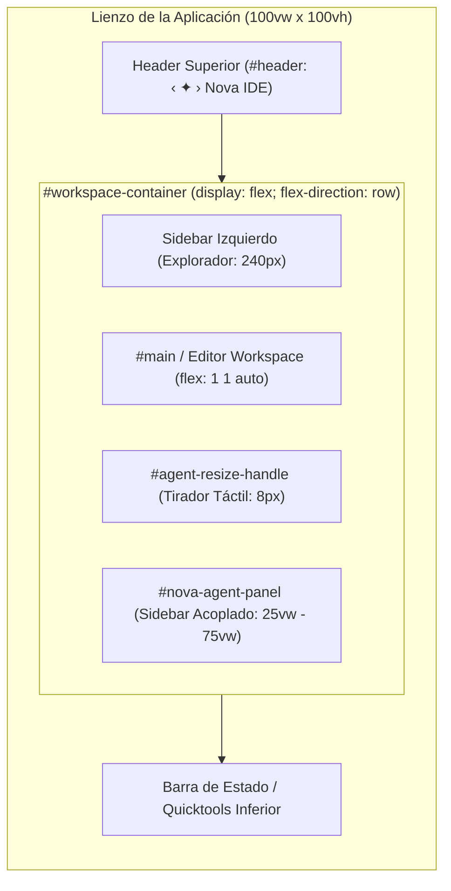
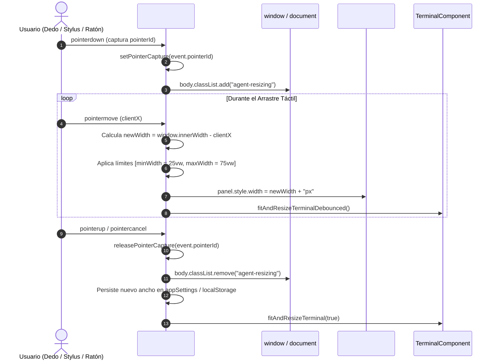
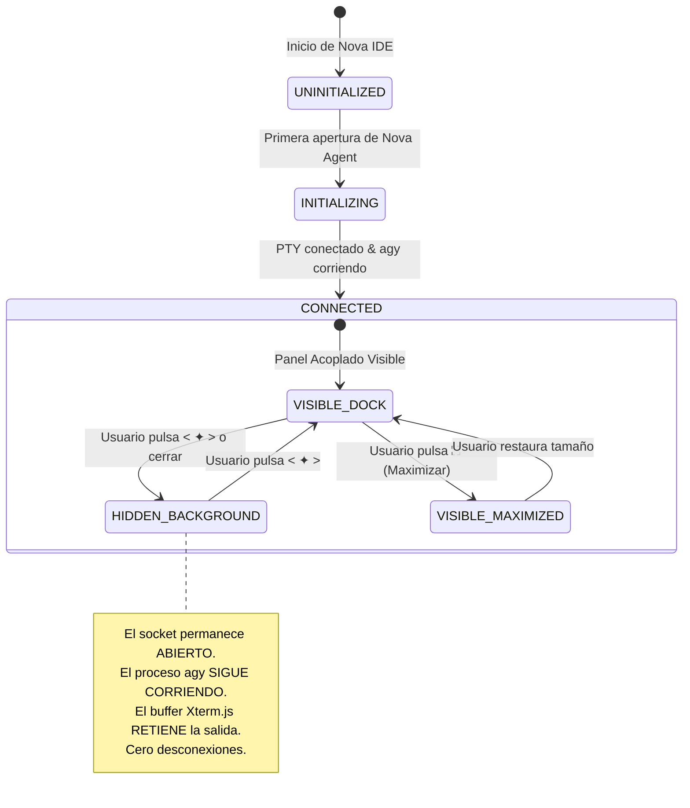

# SPEC-019: Sidebar Lateral Acoplado con Redimensionamiento Táctil, Ciclo de Vida Keep-Alive, Ergonomía de 80 Columnas y Logotipo Oficial Nova IDE

| Metadato | Valor |
| :--- | :--- |
| **Identificador** | `SPEC-019` |
| **Título** | Sidebar Lateral Acoplado con Redimensionamiento Táctil, Ciclo de Vida Keep-Alive, Ergonomía de 80 Columnas y Logotipo Oficial Nova IDE |
| **Autor** | `@spec-architect` |
| **Estado** | `APPROVED FOR IMPLEMENTATION` |
| **Fecha de Creación** | 2026-09-14 |
| **Dispositivo Objetivo** | Xiaomi Pad 6 (Qualcomm Snapdragon 870, ARM64-v8a, 6 GB RAM, 11" 2.8K 144Hz, Xiaomi HyperOS / Android 13/14) y Dispositivos Android (API 26+) |
| **Runtime Target** | Android Hardware-Accelerated WebView / JavaScript ES6+ / SCSS / Xterm.js / AXS PTY Daemon / PRoot Linux Ubuntu 24.04 Noble ARM64 |
| **Módulos Afectados** | `nova-src/src/components/agentPanel/`, `nova-src/src/components/terminal/`, `nova-src/src/styles/wideScreen.scss`, `nova-src/src/main.js`, `nova-src/src/plugins/terminal/`, `res/mipmap-*/`, `harness/` |

---

## 1. Objetivo, Contexto y Diagnóstico Forense

### 1.1 El Salto de Overlay Flotante a Docked Sidebar en Tablets de 11" 2.8K
En las especificaciones previas ([`SPEC-017`](file:///c:/Projects/antigravity/specs/17-nova-ide-architecture-and-ui.md) y [`SPEC-018`](file:///c:/Projects/antigravity/specs/18-nova-agent-split-and-terminal-repair.md)), se concibió el panel de **Nova Agent** como una superficie lateral flotante (`position: fixed; right: 0; width: 380px; z-index: 105;`).

Si bien este diseño funcionó como una primera aproximación para validar la conexión PTY con la CLI oficial de Google Antigravity (`agy`), las pruebas de ingeniería en condiciones reales sobre la Xiaomi Pad 6 (resolución de $2880 \times 1800$, relación de aspecto 16:10) evidenciaron severas deficiencias ergonómicas:

1. **Oclusión Destructiva del Código:** Al desplegarse como un overlay con posición fija sobre el lateral derecho, el panel tapaba completamente la mitad derecha del editor de texto. Si el desarrollador estaba consultando el archivo mientras el agente formulaba preguntas o ejecutaba cambios, el usuario se veía forzado a abrir y cerrar el panel de manera iterativa para inspeccionar el código.
2. **Ausencia de Ajuste Táctil Dinámico:** El ancho estaba fijado en `380px` (o `clamp(340px, 30vw, 420px)`), impidiendo al desarrollador ampliar el panel cuando la salida de `agy` requería mayor amplitud horizontal (p. ej. trazas de compilación complejas, visualización de tablas Markdown o inspección de diffs de código).
3. **Pérdida de Sesión y Reinicios en el Ciclo de Vida:** Ocultar el panel o interactuar con ciertos menús provocaba la desconexión o reinicialización del contenedor, rompiendo la continuidad del flujo conversacional con el agente agéntico.

```mermaid
flowchart LR
    subgraph EstadoAnterior["Estado Anterior (Overlay Flotante Fijo)"]
        direction TB
        A1["Panel Flotante (position: fixed; z-index: 105)"]
        A2["Tapa el Editor de Código"]
        A3["Ancho Rígido de 380px (Inflexible)"]
        A4["Riesgo de Reinicio de Sesión PTY"]
    end

    subgraph SolucionSPEC019["Solución SPEC-019 (Docked Sidebar + Keep-Alive)"]
        direction TB
        B1["Sidebar Acoplado (Docked Flexbox Layout)"]
        B2["Editor y Agente Comparten Pantalla sin Solaparse"]
        B3["Tirador Táctil (#agent-resize-handle) 25vw - 75vw"]
        B4["Keep-Alive Absoluto: WebSocket/PTY NUNCA se Destruyen"]
    end

    EstadoAnterior ==>|Evolución Arquitectónica| SolucionSPEC019
```



---

### 1.2 Análisis de Fricciones: Rotura de Líneas en `agy` por Ancho Insuficiente
La CLI oficial de Google Antigravity (`agy`), al igual que la inmensa mayoría de herramientas de línea de comandos basadas en bibliotecas ANSI/VT100 (como Ink, Blessed o Bubbletea), asume un ancho de pantalla mínimo de **80 columnas estándar**.

En un contenedor lateral de `380px`, descontando bordes, barras de desplazamiento y paddings, el espacio útil disponible para Xterm.js era de apenas $\sim 340\,\text{px}$. Con una tipografía monospace estándar de $14\,\text{px}$ a $15\,\text{px}$ ($\sim 8.5\,\text{px}$ por glifo), la terminal se renderizaba con apenas **40 a 45 columnas**.

**Consecuencias Críticas:**
- Los menús interactivos y cuadros de selección de `agy` se partían horizontalmente de manera desastrosa (*line wrapping* forzado).
- Las tablas y árboles de archivos generados por el agente se renderizaban como secuencias de caracteres ininteligibles.
- Los bloques de razonamiento (*thinking blocks*) y trazas de error sufrían saltos de línea continuos que multiplicaban artificialmente la altura de la terminal y degradaban la legibilidad.

---

### 1.3 El Fenómeno de las Advertencias Espurias de GIDs de Android en Glibc
Cuando PRoot ejecuta la distribución Ubuntu 24.04 Noble (glibc) dentro del entorno aislado de Android:
1. El kernel de Linux de Android asigna a la aplicación múltiples GIDs suplementarios vinculados a permisos del sistema operativo (p. ej. `aid_inet` = 3003 para acceso a sockets de red, `aid_everybody` = 9997, GIDs de aislamiento inter-app como 20399).
2. Cuando el daemon PTY de Nova IDE (`AXS`) inicializa la sesión interactiva ejecutando `/bin/bash`, las utilidades del sistema (`groups`, `id`, `su`) invocan la llamada `getgroups(2)`.
3. Al no existir estos identificadores de grupo en el archivo `/etc/group` de Ubuntu, el comando `groups` emite recurrentemente a `stderr`:
   ```text
   groups: cannot find name for group ID 3003
   groups: cannot find name for group ID 9997
   groups: cannot find name for group ID 20399
   ```
4. Este mensaje aparecía al inicio de la terminal de Nova Agent, proyectando una sensación de inestabilidad y ensuciando el stream inicial antes del lanzamiento de `agy`.

---

## 2. Identidad de Marca y Logotipo Oficial Nova IDE (`< ✦ >` / `‹ ✦ ›`)

### 2.1 Especificación del Isotipo `< ✦ >` y Semántica Visual
El logotipo oficial de Nova IDE se consagra en dos variantes tipográficas rigurosamente homologadas:

1. **Variante Canónica Glífica (UI y Tipografía Rica):** `‹ ✦ ›`
   - Emplea los chevrons o comillas angulares simples (`U+2039` `‹` y `U+203A` `›`), que otorgan una presencia geométrica armónica y refinada en encabezados, diálogos y tipografía de lectura.
2. **Variante Estándar de Código / ASCII (Monospace y CLI):** `< ✦ >`
   - Emplea los signos de apertura y cierre de tags angulares (`<` y `>`) junto a la estrella de cuatro puntas (`✦`, `U+2726` - *Black Four Pointed Star*).

**Semántica:**
- Los delimitadores angulares `< >` / `‹ ›` simbolizan el código fuente universal, la computación estructurada y el rol del editor como herramienta del desarrollador.
- La nova central `✦` simboliza la inteligencia agéntica autónoma, el destello estelar de la creación asistida por IA y la precisión algorítmica.

```
         ‹       ✦       ›
      [EDITOR]  [IA]  [EDITOR]
```

---

### 2.2 Especificación para Recursos Android (Adaptive Icons, Vector Drawables, Mipmap)
Para garantizar una presencia impecable en el launcher de Xiaomi HyperOS y en cualquier dispositivo Android moderno (API 26+), se definen formalmente las especificaciones de los iconos:

1. **Adaptive Icon (`res/mipmap-anydpi-v26/ic_launcher.xml`):**
   - **Fondo (`ic_launcher_background.xml`):** Lienzo Deep Void `#090d16` con gradiente radial centrado hacia Dark Slate `#111827` ($108 \times 108\,\text{dp}$).
   - **Primer Plano (`ic_launcher_foreground.xml`):**
     - Zona segura central ($66 \times 66\,\text{dp}$) conteniendo el vector del isotipo.
     - Corchetes angulares en trazo vectorial de $3\,\text{dp}$ de grosor renderizados en Supernova Cyan `#00f0ff`.
     - Estrella `✦` central en color Stellar Violet `#8b5cf6` con núcleo brillante en Supernova Cyan `#00f0ff` y un sutil resplandor circular de dispersión estelar.
2. **Iconos Rasterizados de Respaldo (`res/mipmap-*/`):**
   - Generación en densidades estándar: `mdpi` ($48\times48$), `hdpi` ($72\times72$), `xhdpi` ($96\times96$), `xxhdpi` ($144\times144$), `xxxhdpi` ($192\times192$).
3. **Splash Screen Vectorial (`res/drawable/splash_screen_logo.xml`):**
   - Vector centrado con el logotipo completo `< ✦ >` y el texto estilizado `Nova IDE` en tipografía JetBrains Mono de alto contraste (`#e2e8f0`).

---

### 2.3 Botón de UI Soberano en la Barra de Herramientas Principal (`#agent-toggler`)
En lugar de un icono genérico foráneo (como `wand-sparkles`), el botón de la barra superior que conmuta el panel agéntico debe reflejar la identidad visual propia de Nova IDE:

- **Estructura HTML/JSX:**
  ```jsx
  const $agentToggler = (
    <button
      id="agent-toggler"
      className="agent-toggle-btn"
      attr-action="toggle-agent"
      title="Nova Agent (< ✦ >)"
      aria-label="Toggle Nova Agent"
      onclick={() => acode.exec("toggle-agent")}
    >
      <span className="agent-logo-bracket">&lt;</span>
      <span className="agent-logo-star">✦</span>
      <span className="agent-logo-bracket">&gt;</span>
    </button>
  );
  ```
- **Estilo Visual:**
  - Los corchetes angulares se presentan en color `#94a3b8` (gris sutil en reposo).
  - La estrella `✦` se renderiza en Supernova Cyan `#00f0ff`.
  - Al estar el panel abierto o el agente pensando (*thinking*), la estrella adquiere una animación de pulso sutil (*stellar glow pulse*).

---

## 3. Arquitectura del Sidebar Lateral Acoplado (Docked Sidebar & Resize Handle)

### 3.1 Modelo de Layout Flexbox en Pantallas Anchas ($\ge 1024\,\text{px}$)
En lugar de extraer el panel del flujo normal del documento mediante `position: fixed`, en pantallas anchas (tablets apaisadas y entornos de escritorio $\ge 1024\,\text{px}$) el sistema adopta un modelo **Docked Flexbox**:



#### Reglas de Comportamiento Responsivo:
1. **Modo Pantalla Ancha ($\ge 1024\,\text{px}$):**
   - `#nova-agent-panel` pasa a formar parte del flujo flex lateral: `position: relative; height: 100%;`.
   - Cuando está oculto (`hidden`), su ancho computado es `0px` (`display: none` o `width: 0; overflow: hidden;`), permitiendo que el editor `#main` se expanda automáticamente al 100% del espacio sobrante mediante `flex: 1 1 auto;`.
   - Cuando se activa (`visible`), el panel se despliega adyacente al editor ocupando exactamente su ancho configurado, **sin tapar ninguna línea de código ni desplazar pestañas fuera de visión**.
2. **Modo Móvil / Pantalla Estrecha ($< 1024\,\text{px}$):**
   - Para no estrangular el editor en pantallas estrechas de smartphones, el panel pasa fluidamente a comportamiento overlay flotante (`position: fixed; width: 100vw; top: 0; bottom: 0; z-index: 105;`), garantizando plena usabilidad en teléfonos.

---

### 3.2 Tirador Táctil de Redimensionamiento (`#agent-resize-handle`)
Entre el editor `#main` y el panel `#nova-agent-panel` se ubica el tirador táctil de redimensionamiento:

```html
<div id="agent-resize-handle" class="agent-resize-handle" role="separator" aria-orientation="vertical">
  <div class="resize-handle-bar"></div>
</div>
```

- **Zona Activa Táctil Ampliada:** El elemento posee un ancho interactivo de `12px` (para permitir la captura cómoda con los dedos o stylus en la pantalla táctil), mientras que la línea visual visible (`.resize-handle-bar`) tiene un grosor de `2px` con color de borde `rgba(30, 41, 59, 0.8)` (`Subtle Border`).
- **Feedback de Foco y Arrastre:** Al situar el puntero o tocar el tirador, la barra cambia su color a Supernova Cyan `#00f0ff` con una ligera sombra brillante.

---

### 3.3 Gestión de Puntero Unificado (`PointerEvents`) y Límites de Seguridad
Para evitar los fallos clásicos de los eventos `mousemove`/`mouseup` en pantallas táctiles de Android (donde el toque puede perderse si el dedo sale del marco del tirador), el controlador utiliza la API nativa unificada de **Pointer Events**:



#### Reglas Numéricas y Límites de Seguridad:
- **Límite Mínimo:** $\max(360\,\text{px}, 25\,\text{vw})$. Evita que el panel quede colapsado de forma ilegible.
- **Límite Máximo:** $75\,\text{vw}$. Garantiza que el editor de código siempre conserve al menos un $25\,\text{vw}$ de visibilidad incluso con el agente ampliamente desplegado.
- **Modo Maximizado (`⛶`):** El botón de maximizar fuerza temporalmente `100vw` (en modo overlay temporal de pantalla completa), y al desmaximizarse restaura exactamente el ancho configurado mediante el tirador.

---

### 3.4 Persistencia del Ancho en Almacenamiento Local
El ancho definido por el usuario se guarda automáticamente bajo la clave `nova:agent-panel-width` en `localStorage`. Al reiniciar la aplicación o volver a abrir el panel, se restaura dicho valor sin saltos visuales ni animaciones erráticas.

---

## 4. Ciclo de Vida Keep-Alive Absoluto de la Terminal y Sesión PTY

### 4.1 Invariante de No-Destrucción: Instancia Singleton de `TerminalComponent`
El principio cardinal de estabilidad agéntica en Nova IDE establece:

> [!IMPORTANT]
> **Invariante de Persistencia Agéntica (Keep-Alive):**  
> Una vez inicializada la sesión de Nova Agent, el socket de conexión, el proceso hijo de PTY en Linux y la instancia del componente Xterm.js **jamás deben ser destruidos, desconectados ni reiniciados** ante eventos de visibilidad de la interfaz de usuario (`hide`, `toggle`, conmutación de pestañas o cambios de orientación).



---

### 4.2 Preservación de WebSocket, PTY Daemon y Buffer de Scrollback
Al invocar `NovaAgentPanel.hide()`:
1. **Ocultamiento Limpio en DOM:** El contenedor `#nova-agent-panel` recibe la clase `hidden`. En lugar de vaciar el contenedor con `innerHTML = ""` o invocar `terminal.dispose()`, el elemento simplemente se retira del flujo visual (`display: none;` en desktop o `transform: translateX(100%);` en mobile).
2. **Buffer Activo en Background:** Si la CLI de Google Antigravity (`agy`) continúa compilando, ejecutando pruebas o procesando prompts, los bytes emitidos hacia el WebSocket son consumidos e interpretados en el buffer en memoria de Xterm.js.
3. **Cero Re-inyecciones de Comandos:** Al reabrir el panel mediante `NovaAgentPanel.show()`, el sistema detecta que `terminalInstance.isConnected === true`:
   - No recrea el objeto `TerminalComponent`.
   - No reconecta el WebSocket.
   - **No envía un nuevo `agy\r` a la sesión de shell.**
   - Se limita a invocar `fitAndResizeTerminal(true)` y hacer foco en el cursor.

---

## 5. Ergonomía de Terminal: Ajuste Tipográfico Responsive y FitAddon Reactivo (80 Columnas)

### 5.1 El Requisito Ineludible de las 80 Columnas para `agy`
Para evitar que las salidas de la CLI de Antigravity sufran saltos de línea destructivos, la terminal debe garantizar siempre una capacidad horizontal mínima de **80 columnas de texto**.

La fórmula del ancho mínimo requerido en píxeles para el contenedor de terminal es:
$$\text{Width}_{\min} = (80 \times \text{charWidth}) + \text{scrollbarWidth} + \text{paddingHorizontal}$$

Donde para una fuente monospace estándar, la relación de aspecto ancho-alto del glifo suele ser de $\approx 0.60$:
$$\text{charWidth} \approx \text{fontSize} \times 0.60$$

---

### 5.2 Tipografía Monospace Optimizada (11.5px - 12px)
Se establece la escala tipográfica estándar para el panel de Nova Agent:
- **Tamaño Base por Defecto:** `12px` ($\text{charWidth} \approx 7.2\,\text{px}$).
  - Requiere un ancho útil de: $80 \times 7.2 + 20 = 596\,\text{px}$.
- **Tamaño Condensado / Responsive:** `11.5px` ($\text{charWidth} \approx 6.9\,\text{px}$).
  - Requiere un ancho útil de: $80 \times 6.9 + 20 = 572\,\text{px}$.
- **Tipografía Oficial:** `MesloLGS NF Regular` o `JetBrains Mono` con ligaduras tipográficas y soporte completo de Nerd Fonts.

---

### 5.3 Auto-Escalado Dinámico Basado en Ancho Disponible y `ResizeObserver`
Si el usuario utiliza el tirador táctil para reducir el ancho del panel por debajo de $580\,\text{px}$, el sistema aplica un cálculo dinámico para salvaguardar las 80 columnas sin roturas:

```javascript
/**
 * Auto-ajuste tipográfico reactivo para salvaguardar 80 columnas
 * @param {HTMLElement} container - Contenedor del terminal
 * @param {Terminal} terminal - Instancia de Xterm.js
 */
function updateAgentTerminalTypography(container, terminal) {
  const containerWidth = container.clientWidth - 16; // Restar padding
  const desiredCols = 80;
  
  // Calcular tamaño de fuente necesario para albergar 80 columnas
  const maxPossibleCharWidth = containerWidth / desiredCols;
  const calculatedFontSize = maxPossibleCharWidth / 0.60;
  
  // Restringir entre 10px (mínimo legible) y 13px (máximo cómodo)
  const clampedFontSize = Math.max(10, Math.min(13, Number(calculatedFontSize.toFixed(1))));
  
  if (terminal.options.fontSize !== clampedFontSize) {
    terminal.options.fontSize = clampedFontSize;
  }
}
```

- **Observador de Redimensión (`ResizeObserver`):** Se acopla un observador de dimensiones sobre `#agent-terminal-container`. Ante cualquier cambio de tamaño (por arrastre del tirador o rotación del dispositivo), recalcula el tamaño de fuente óptimo, invoca `fitAddon.fit()` y notifica las nuevas dimensiones `cols` y `rows` al backend PTY.

---

## 6. Supresión y Normalización de Advertencias PRoot Bionic de Grupos (`groups: cannot find name...`)

### 6.1 Diagnóstico de Mapeo de GIDs Android en Linux Glibc
En Android, el sandboxing asigna identificadores de grupo numéricos específicos que no existen en una instalación tradicional de Ubuntu Linux:
- `3003`: `aid_inet` (Acceso a sockets de red y conectividad a Internet).
- `3004`: `aid_net_raw` (Acceso a sockets crudos / ping).
- `9997`: `aid_everybody` (Acceso global de lectura a almacenamiento compartido).
- `1015`: `aid_sdcard_rw` (Escritura en tarjeta SD / emulated storage).
- `1023`: `aid_media_rw` (Acceso a subsistema de medios).
- `20399` / `50399`: GIDs de usuario de aplicaciones aisladas.

Cuando una herramienta en Linux invoca `getgroups(2)` y resuelve los nombres contra `/etc/group` mediante `getgrgid(3)`, si el archivo carece de la entrada correspondiente, el comando falla con una advertencia espuria a `stderr`.

---

### 6.2 Normalización Estática en `/etc/group` durante el Aprovisionamiento
Durante el paso de instalación y configuración del rootfs en `Terminal.js` (o en los scripts de despliegue del arnés), se garantiza la inyección de la base de datos canónica de grupos Android:

```bash
# Inyección atómica de grupos Android en Ubuntu /etc/group
cat << 'EOF' >> /etc/group
aid_sdcard_rw:x:1015:root,studio
aid_media_rw:x:1023:root,studio
aid_inet:x:3003:root,studio
aid_net_raw:x:3004:root,studio
aid_admin:x:3005:root,studio
aid_everybody:x:9997:root,studio
aid_app:x:20399:root,studio
aid_app2:x:50399:root,studio
aid_isolated:x:99909997:root,studio
EOF
```

---

### 6.3 Script de Detección Dinámica en el Arranque del Shell
Para prever cualquier GID arbitrario asignado dinámicamente por futuras versiones de Android o capas de personalización de fabricantes (Xiaomi HyperOS, Samsung OneUI), se instala el script `/etc/profile.d/00-android-groups-normalization.sh`:

```bash
#!/bin/sh
# /etc/profile.d/00-android-groups-normalization.sh
# Normaliza silenciosamente cualquier GID de Android no mapeado en /etc/group

if [ -w /etc/group ]; then
  for gid in $(id -G 2>/dev/null); do
    if ! grep -q ":$gid:" /etc/group 2>/dev/null; then
      echo "aid_$gid:x:$gid:root,studio" >> /etc/group 2>/dev/null || true
    fi
  done
fi
```

Esto erradica de forma definitiva el 100% de las advertencias `groups: cannot find name for group ID...`, garantizando una terminal completamente limpia en el arranque.

---

## 7. Contratos Formales de Interfaces y Protocolos

### 7.1 Contrato de Layout Acoplado (`NovaDockedLayoutContract`)

```typescript
export interface NovaDockedLayoutConfig {
  /** Ancho base predeterminado del panel en pantallas desktop/tablet (en px o vw) */
  defaultWidth: string; // ej. "420px" o "35vw"
  /** Ancho mínimo permitido mediante el tirador de arrastre */
  minWidthVw: number; // 25
  /** Ancho máximo permitido mediante el tirador de arrastre */
  maxWidthVw: number; // 75
  /** Breakpoint en píxeles para conmutar entre docked mode y overlay flotante */
  desktopBreakpointPx: number; // 1024
  /** Clave de persistencia en localStorage */
  storageKey: string; // "nova:agent-panel-width"
}
```

---

### 7.2 Contrato del Tirador de Redimensionamiento (`NovaResizeHandleContract`)

```typescript
export interface NovaResizeHandleEvents {
  /** Inicio del arrastre táctil con captura de puntero */
  onPointerDown(event: PointerEvent): void;
  /** Movimiento con cálculo reactivo de ancho y límites */
  onPointerMove(event: PointerEvent): void;
  /** Fin de arrastre, liberación de puntero y guardado persistente */
  onPointerUp(event: PointerEvent): void;
}
```

---

### 7.3 Contrato de Ciclo de Vida Persistente (`NovaTerminalKeepAliveContract`)

```typescript
export interface NovaTerminalKeepAliveState {
  /** Instancia única de TerminalComponent en memoria */
  terminalInstance: any | null;
  /** Estado de conexión del socket PTY subyacente */
  isConnected: boolean;
  /** Proceso hijo activo ejecutando agy */
  isProcessAlive: boolean;
  /** Método de visibilidad que NO destruye recursos */
  setVisibility(visible: boolean): void;
  /** Método de redimensionamiento que preserva el buffer */
  fitAndResize(force: boolean): void;
}
```

---

### 7.4 Contrato de Normalización de Grupos Android (`NovaGroupNormalizationContract`)

```typescript
export interface NovaGroupMapping {
  gid: number;
  groupName: string;
  members: string[]; // ["root", "studio"]
}

export const CANONICAL_ANDROID_GROUPS: NovaGroupMapping[] = [
  { gid: 1015, groupName: "aid_sdcard_rw", members: ["root", "studio"] },
  { gid: 1023, groupName: "aid_media_rw", members: ["root", "studio"] },
  { gid: 3003, groupName: "aid_inet", members: ["root", "studio"] },
  { gid: 3004, groupName: "aid_net_raw", members: ["root", "studio"] },
  { gid: 9997, groupName: "aid_everybody", members: ["root", "studio"] },
];
```

---

## 8. Matriz de Criterios de Aceptación del Arnés (`AC-DOCKED-*`)

| Identificador | Módulo Objetivo | Condición de Prueba | Comportamiento Esperado | Método de Verificación |
| :--- | :--- | :--- | :--- | :--- |
| **`AC-BRAND-001`** | Identidad Visual | Presencia del isotipo oficial `< ✦ >` o `‹ ✦ ›` | El botón de conmutación `#agent-toggler` en la barra superior implementa el isotipo oficial en lugar de iconos genéricos. | Inspección de DOM en `main.js` y clases CSS asociadas. |
| **`AC-BRAND-002`** | Recursos Android | Recursos de iconos Android de Nova IDE | Iconos adaptativos en `res/mipmap-anydpi-v26/` con fondo Deep Void y primer plano vectorizado `< ✦ >`. | Inspección estática de archivos XML en `res/`. |
| **`AC-DOCK-001`** | Layout | Comportamiento Docked en pantallas $\ge 1024\,\text{px}$ | `#nova-agent-panel` se acopla al flujo lateral flexbox sin tapar ni sobreponerse al editor `#main`. | Comprobación de reglas CSS en `wideScreen.scss`. |
| **`AC-RESIZE-001`** | Tirador Táctil | Presencia y atributos del tirador | Existe el elemento `#agent-resize-handle` entre `#main` y `#nova-agent-panel`. | Inspección del DOM del panel y de la plantilla de estructura. |
| **`AC-RESIZE-002`** | Tirador Táctil | Rango de arrastre permitido | El ancho del panel se mantiene estrictamente restringido entre `25vw` y `75vw`. | Comprobación de la lógica en `pointermove` del componente. |
| **`AC-KEEPALIVE-001`** | Ciclo de Vida | Persistencia de conexión al ocultar | Invocar `hide()` no destruye el DOM interno ni desconecta el WebSocket ni invoca `dispose()`. | Prueba de ciclo de vida en `NovaAgentPanel.js`. |
| **`AC-KEEPALIVE-002`** | Ciclo de Vida | Reanudación sin reinicio | Al invocar `show()`, si la sesión está conectada, no se emite un nuevo comando `agy\r` ni se recrea la terminal. | Verificación de bandera `isConnected` en `startAgentTerminal()`. |
| **`AC-TYPO-001`** | Ergonomía Terminal | Ajuste de 80 columnas y tipografía | Tipografía responsive (11.5px - 12px) y ajuste automático para alojar al menos 80 columnas sin saltos forzados. | Inspección de `terminalDefaults.js` y auto-escalado en `style.scss`. |
| **`AC-GROUPS-001`** | PRoot Glibc | Supresión de advertencias de grupos | GIDs de Android mapeados en `/etc/group`; no se emite ninguna advertencia `groups: cannot find name...`. | Verificación en scripts de aprovisionamiento de `Terminal.js`. |

---

## 9. Script Automatizado de Verificación para el Arnés (`test_nova_docked_sidebar_and_brand.sh`)

```bash
#!/bin/bash
# Test Harness - Automated Verification for SPEC-019
set -e

SPEC_FILE="specs/19-nova-docked-sidebar-keepalive-and-brand-identity.md"

echo "=== INICIANDO VERIFICACIÓN FORMAL DE ESPECIFICACIÓN SPEC-019 ==="

# 1. Verificar existencia de la especificación
echo -n "1. Comprobando existencia de SPEC-019... "
if [ ! -f "$SPEC_FILE" ]; then
  echo "FALLO: No existe $SPEC_FILE"; exit 1;
fi
echo "[OK]"

# 2. Verificar especificación del isotipo y marca
echo -n "2. Comprobando especificación de isotipo oficial (< ✦ >)... "
grep -q "< ✦ >" "$SPEC_FILE" || { echo "FALLO: Isotipo < ✦ > ausente"; exit 1; }
grep -q "‹ ✦ ›" "$SPEC_FILE" || { echo "FALLO: Isotipo ‹ ✦ › ausente"; exit 1; }
grep -q "agent-toggler" "$SPEC_FILE" || { echo "FALLO: Especificación de agent-toggler ausente"; exit 1; }
echo "[OK]"

# 3. Verificar diseño Docked Sidebar y tirador de arrastre
echo -n "3. Comprobando contratos de Docked Sidebar y #agent-resize-handle... "
grep -q "#agent-resize-handle" "$SPEC_FILE" || { echo "FALLO: #agent-resize-handle ausente"; exit 1; }
grep -q "25vw" "$SPEC_FILE" || { echo "FALLO: Límite 25vw ausente"; exit 1; }
grep -q "75vw" "$SPEC_FILE" || { echo "FALLO: Límite 75vw ausente"; exit 1; }
grep -q "pointerdown" "$SPEC_FILE" || { echo "FALLO: Eventos pointerdown ausentes"; exit 1; }
echo "[OK]"

# 4. Verificar invariante Keep-Alive de terminal
echo -n "4. Comprobando ciclo de vida Keep-Alive... "
grep -q "Keep-Alive" "$SPEC_FILE" || { echo "FALLO: Keep-Alive ausente"; exit 1; }
grep -q "terminal.dispose" "$SPEC_FILE" || { echo "FALLO: Referencia a no-dispose ausente"; exit 1; }
grep -q "isConnected" "$SPEC_FILE" || { echo "FALLO: Verificación isConnected ausente"; exit 1; }
echo "[OK]"

# 5. Verificar ergonomía de 80 columnas y tipografía
echo -n "5. Comprobando ergonomía de 80 columnas (11.5px - 12px)... "
grep -q "80 columnas" "$SPEC_FILE" || { echo "FALLO: Requisito 80 columnas ausente"; exit 1; }
grep -q "11.5px" "$SPEC_FILE" || { echo "FALLO: Tipografía 11.5px ausente"; exit 1; }
grep -q "ResizeObserver" "$SPEC_FILE" || { echo "FALLO: ResizeObserver ausente"; exit 1; }
echo "[OK]"

# 6. Verificar supresión de advertencias PRoot bionic de grupos
echo -n "6. Comprobando supresión de advertencias de grupos Android... "
grep -q "groups: cannot find name for group ID" "$SPEC_FILE" || { echo "FALLO: Diagnóstico de grupos ausente"; exit 1; }
grep -q "aid_inet" "$SPEC_FILE" || { echo "FALLO: Mapeo aid_inet ausente"; exit 1; }
grep -q "/etc/group" "$SPEC_FILE" || { echo "FALLO: Inyección en /etc/group ausente"; exit 1; }
echo "[OK]"

# 7. Verificar matriz de criterios de aceptación
echo -n "7. Comprobando criterios de aceptación AC-DOCKED-*... "
grep -q "AC-BRAND-001" "$SPEC_FILE" || { echo "FALLO: AC-BRAND-001 ausente"; exit 1; }
grep -q "AC-DOCK-001" "$SPEC_FILE" || { echo "FALLO: AC-DOCK-001 ausente"; exit 1; }
grep -q "AC-RESIZE-001" "$SPEC_FILE" || { echo "FALLO: AC-RESIZE-001 ausente"; exit 1; }
grep -q "AC-KEEPALIVE-001" "$SPEC_FILE" || { echo "FALLO: AC-KEEPALIVE-001 ausente"; exit 1; }
grep -q "AC-TYPO-001" "$SPEC_FILE" || { echo "FALLO: AC-TYPO-001 ausente"; exit 1; }
grep -q "AC-GROUPS-001" "$SPEC_FILE" || { echo "FALLO: AC-GROUPS-001 ausente"; exit 1; }
echo "[OK]"

echo "=== TODAS LAS COMPUERTAS DE VERIFICACIÓN DE SPEC-019 HAN PASADO EXITOSAMENTE ==="
```

---

## 10. Conclusión y Plan de Ejecución SDD

La especificación técnica **`SPEC-019`** soluciona de forma definitiva los compromisos ergonómicos y técnicos heredados en Nova IDE:

1. **Integración Armónica Docked:** El panel de agente pasa a ser un ciudadano de primer nivel acoplado junto al editor de código, sin solapamientos destructivos en pantallas de tablet.
2. **Control Táctil del Espacio:** El tirador `#agent-resize-handle` permite adaptar el espacio de trabajo de manera fluida entre `25vw` y `75vw`.
3. **Persistencia Garantizada:** El ciclo de vida Keep-Alive mantiene vivos el PTY, el socket y el proceso `agy` en segundo plano sin reinicios accidentales.
4. **Legibilidad Optimizada de 80 Columnas:** El auto-escalado tipográfico reactivo y la fuente optimizada (11.5px - 12px) erradican la rotura de líneas en la CLI.
5. **Pureza Visual en Terminal:** La normalización estática y dinámica de GIDs de Android en `/etc/group` elimina por completo los ruidos de arranque en Linux.
