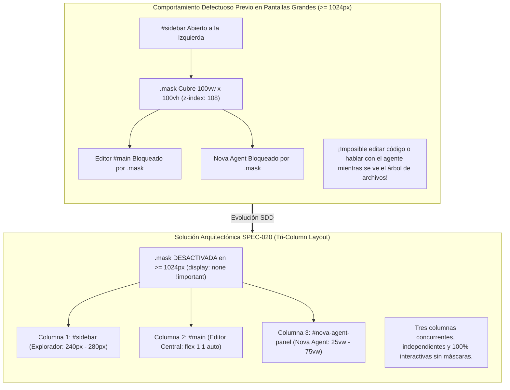
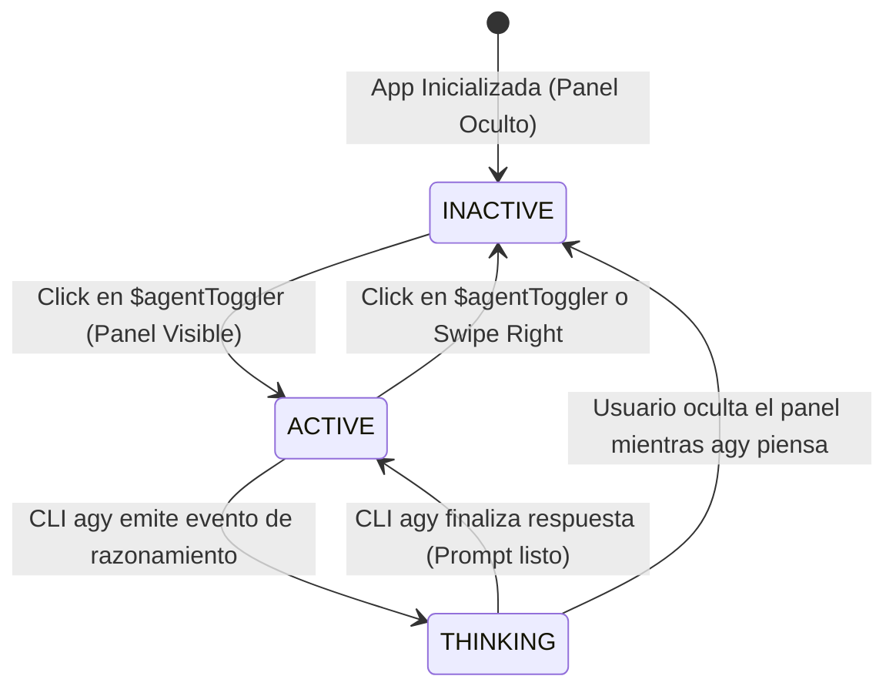
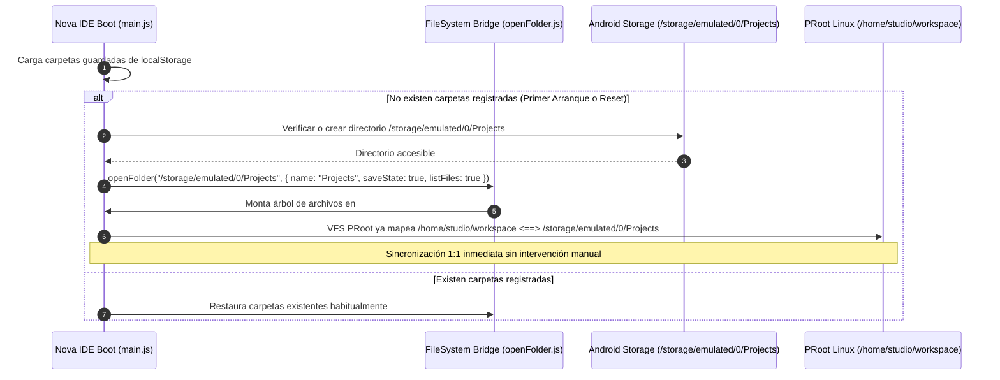

# SPEC-020: Arquitectura de Layout de Tres Columnas, Enlace de Espacio de Trabajo de Proyectos y Purificación de Identidad Soberana en Nova IDE

| Metadato | Valor |
| :--- | :--- |
| **Identificador** | `SPEC-020` |
| **Título** | Arquitectura de Layout de Tres Columnas, Enlace de Espacio de Trabajo de Proyectos y Purificación de Identidad Soberana en Nova IDE |
| **Autor** | `@spec-architect` |
| **Estado** | `APPROVED FOR IMPLEMENTATION` |
| **Fecha de Creación** | 2026-09-14 |
| **Dispositivo Objetivo** | Xiaomi Pad 6 (Qualcomm Snapdragon 870, ARM64-v8a, 6 GB RAM, 11" 2.8K 144Hz, Xiaomi HyperOS / Android 13/14) y Dispositivos Android (API 26+) |
| **Runtime Target** | Android Hardware-Accelerated WebView / JavaScript ES6+ / SCSS / Xterm.js / AXS PTY Daemon / PRoot Linux Ubuntu 24.04 Noble ARM64 |
| **Módulos Afectados** | `nova-src/www/index.html`, `nova-src/www/logo.svg`, `nova-src/src/components/logo/`, `nova-src/src/pages/welcome/`, `nova-src/src/components/agentPanel/`, `nova-src/src/styles/wideScreen.scss`, `nova-src/src/components/sidebar/style.scss`, `nova-src/src/main.js`, `nova-src/src/lib/openFolder.js`, `harness/` |

---

## 1. Objetivo, Contexto y Diagnóstico Arquitectónico

### 1.1 Diagnóstico de Remanentes de Identidad Foránea (El Logo `<A>` de Acode)
A pesar de la consagración del nombre **Nova IDE** y el isotipo oficial `< ✦ >` en [`SPEC-017`](file:///c:/Projects/antigravity/specs/17-nova-ide-architecture-and-ui.md) y [`SPEC-019`](file:///c:/Projects/antigravity/specs/19-nova-docked-sidebar-keepalive-and-brand-identity.md), una auditoría forense profunda del código fuente de `nova-src/` reveló remanentes visuales críticos pertenecientes a la plataforma heredada Acode:

1. **Splash Screen HTML (`nova-src/www/logo.svg` y `www/index.html`):** El archivo vectorial `logo.svg` utilizado como imagen de fondo del splash screen de arranque (`#splash`) continúa conteniendo el glifo de la letra `A` con sombra azul radial heredado de Acode. Al iniciar la aplicación en frío, el usuario visualiza brevemente una gran letra `A` azul antes de cargar la interfaz, rompiendo la identidad de producto.
2. **Componente de Logotipo de UI (`src/components/logo/`):** El componente `Logo` renderiza `logo.png`, un bitmap rasterizado de $80\times80\,\text{px}$ de la `A` de Acode con gradiente celeste `rgb(68, 153, 254)`.
3. **Página de Bienvenida (`src/pages/welcome/welcome.js`):** La cabecera Hero de la pestaña de bienvenida importa y despliega `logo.png` de Acode, e instancia la pestaña con el icono `icon acode` (`tabIcon: "icon acode"`).

Esta dispersión visual genera confusión de marca, proyecta una imagen de producto incompleto y compromete la soberanía visual de **Nova IDE**.

---

### 1.2 El Problema de la Máscara Bloqueante (`.mask`) y la Colisión de Paneles en Tablets
El sistema heredado de Acode fue concebido originalmente como una aplicación para smartphones de pantalla única. Cuando el panel lateral de archivos (`#sidebar`) se abre:
- Se inyecta un elemento hermano `.mask` (`#sidebar + .mask`) con estilo:
  ```css
  .mask {
    position: fixed;
    left: 0; top: 0;
    height: 100vh; width: 100vw;
    background-color: black;
    opacity: 0; /* o translúcido */
    z-index: 108;
  }
  ```
- **El Bloqueo:** En una tablet como la Xiaomi Pad 6 (11", 2.8K), donde la pantalla es lo suficientemente amplia para mostrar simultáneamente el explorador de archivos, el editor y el agente, la existencia de `.mask` bloquea todos los eventos táctiles y de ratón dirigidos al editor central `#main` y al panel lateral derecho `#nova-agent-panel`. Cualquier toque fuera de `#sidebar` no interactúa con el código ni con el agente, sino que simplemente colapsa el sidebar.



---

### 1.3 La Desconexión entre el Explorador de Archivos y el Espacio de Trabajo del Agente
En el estado actual:
- Cuando Nova IDE arranca sin archivos o carpetas previamente restaurados, el explorador de archivos se muestra completamente vacío, exhibiendo el mensaje *"No folder opened"*.
- Para comenzar a programar, el usuario debe pulsar manualmente en *"Open Folder"*, navegar por el selector SAF del sistema y ubicar `/storage/emulated/0/Projects`.
- Mientras tanto, el subsistema de Linux (PRoot Ubuntu) y la CLI de Google Antigravity (`agy`) ya se encuentran configurados y listos para operar sobre `/home/studio/workspace`, el cual está directamente enlazado con `/storage/emulated/0/Projects` o `/sdcard/Projects`.

Esta falta de anclaje inicial rompe la experiencia *Zero-Click*: el editor táctil y el agente inteligente operan desconectados en el primer arranque hasta que el usuario realiza configuraciones manuales engorrosas.

---

### 1.4 La Paradoja de la "X" de Cierre en un Sidebar Acoplado
En `nova-src/src/components/agentPanel/index.js`, la cabecera del panel aloja un botón de cierre `#closeBtn`:
```html
<button id="agent-close-btn" class="agent-action-btn" title="Close Panel">✕</button>
```
En un diseño de ingeniería moderno:
- Los sidebars acoplados permanentes (como en Visual Studio Code, JetBrains Fleet o Cursor) **no utilizan un botón "X" modal**. La "X" comunica equívocamente que la terminal o el proceso agéntico se van a terminar o matar.
- La alternancia de visibilidad debe gobernarse desde la barra superior mediante el botón maestro `$agentToggler`, el cual debe reflejar si el panel está desplegado u oculto mediante un estado de iluminación activo en Supernova Cyan `#00f0ff`.
- Además, el usuario debe poder colapsar el panel cómodamente arrastrando el tirador táctil hacia el borde derecho (*swipe-to-close*).
- Eliminar la "X" libera valioso espacio horizontal en la cabecera del panel para mostrar el estado del agente y el botón de maximizar `⛶`.

---

## 2. Purificación Absoluta de Identidad de Marca (Eradicación del Logo `<A>`)

### 2.1 Especificación Vectorial Canónica del Logotipo Nova IDE (`www/logo.svg`)
Se erradica en su totalidad el archivo SVG de Acode en `nova-src/www/logo.svg` y se reemplaza por la especificación vectorial formal del logotipo de Nova IDE:

```xml
<?xml version="1.0" encoding="UTF-8"?>
<svg xmlns="http://www.w3.org/2000/svg" viewBox="0 0 512 512" width="100%" height="100%">
  <defs>
    <!-- Gradiente estelar Supernova Cyan a Stellar Violet -->
    <linearGradient id="novaGlowGrad" x1="0%" y1="0%" x2="100%" y2="100%">
      <stop offset="0%" stop-color="#00f0ff" stop-opacity="1" />
      <stop offset="60%" stop-color="#8b5cf6" stop-opacity="1" />
      <stop offset="100%" stop-color="#3b82f6" stop-opacity="0.8" />
    </linearGradient>

    <!-- Filtro de resplandor sutil para la nova central -->
    <filter id="novaStarBloom" x="-30%" y="-30%" width="160%" height="160%">
      <feGaussianBlur stdDeviation="12" result="blur" />
      <feMerge>
        <feMergeNode in="blur" />
        <feMergeNode in="SourceGraphic" />
      </feMerge>
    </filter>
  </defs>

  <!-- Fondo sutil de contraste para splash screen (opcional, transparente por defecto) -->
  <rect width="512" height="512" fill="#090d16" rx="96" />

  <!-- Corchete Izquierdo ( < ) -->
  <path d="M 170 140 L 70 256 L 170 372" 
        fill="none" 
        stroke="#00f0ff" 
        stroke-width="36" 
        stroke-linecap="round" 
        stroke-linejoin="round" />

  <!-- Estrella Central Nova ( ✦ ) de 4 puntas cóncavas -->
  <path d="M 256 120 
           Q 256 256 160 256 
           Q 256 256 256 392 
           Q 256 256 352 256 
           Q 256 256 256 120 Z" 
        fill="url(#novaGlowGrad)" 
        filter="url(#novaStarBloom)" />

  <!-- Núcleo brillante de la estrella -->
  <circle cx="256" cy="256" r="22" fill="#ffffff" opacity="0.9" />

  <!-- Corchete Derecho ( > ) -->
  <path d="M 342 140 L 442 256 L 342 372" 
        fill="none" 
        stroke="#00f0ff" 
        stroke-width="36" 
        stroke-linecap="round" 
        stroke-linejoin="round" />
</svg>
```

#### Aplicación en `nova-src/www/index.html`:
El elemento `#splash` del arranque renderiza este nuevo SVG:
```css
#splash {
  background-image: url("./logo.svg");
  background-position: center;
  background-repeat: no-repeat;
  background-size: 200px;
  background-color: #090d16; /* Deep Void */
}
```

---

### 2.2 Reemplazo de Componente UI de Logotipo (`src/components/logo/`)
1. Se elimina físicamente la dependencia del bitmap rasterizado `src/components/logo/logo.png`.
2. El componente `src/components/logo/index.js` renderiza un contenedor con el isotipo SVG vectorial de Nova IDE:
   ```javascript
   import "./style.scss";
   import tag from "html-tag-js";

   export default function Logo() {
     return (
       <div className="nova-logo-container" aria-label="Nova IDE Logo">
         <svg className="nova-logo-svg" viewBox="0 0 512 512">
           <defs>
             <linearGradient id="uiNovaGrad" x1="0%" y1="0%" x2="100%" y2="100%">
               <stop offset="0%" stop-color="#00f0ff" />
               <stop offset="100%" stop-color="#8b5cf6" />
             </linearGradient>
           </defs>
           <path d="M 170 140 L 70 256 L 170 372" fill="none" stroke="#00f0ff" stroke-width="40" stroke-linecap="round" stroke-linejoin="round" />
           <path d="M 256 120 Q 256 256 160 256 Q 256 256 256 392 Q 256 256 352 256 Q 256 256 256 120 Z" fill="url(#uiNovaGrad)" />
           <circle cx="256" cy="256" r="24" fill="#ffffff" />
           <path d="M 342 140 L 442 256 L 342 372" fill="none" stroke="#00f0ff" stroke-width="40" stroke-linecap="round" stroke-linejoin="round" />
         </svg>
       </div>
     );
   }
   ```
3. En `style.scss`, se reemplaza el gradiente celeste legado por un resplandor cósmico con tono Supernova Cyan `#00f0ff` y Deep Void `#090d16`.

---

### 2.3 Transformación de la Página de Bienvenida (`welcome.js`)
En `nova-src/src/pages/welcome/welcome.js`:
- **Eliminación de Importación:** Se sustituye `import logoSrc from "components/logo/logo.png?inline";` por la inclusión directa del componente `<Logo />` o del SVG vectorial inmutable.
- **Sustitución de Icono de Pestaña:** Se cambia `tabIcon: "icon acode"` por `tabIcon: "icon-nova-star"` o icono representativo de Nova.
- **Icono de la Acción del Agente:** En la fila de acción *"Nova Agent (Google Antigravity)"*, se actualiza el icono de `wand-sparkles` a un glifo dedicado de estrella agéntica `✦`.

---

### 2.4 Matriz de Auditoría de Identidad: Antes vs. Después

| Ubicación | Estado Heredado (Acode) | Estado Objetivo Nova IDE (SPEC-020) |
| :--- | :--- | :--- |
| `www/logo.svg` | Letra `A` con degradado azul cyan de Acode | Logotipo oficial vectorizado `< ✦ >` de Nova IDE |
| `www/index.html` (#splash) | Carga splash con letra `A` sobre fondo azul/negro | Carga splash con `< ✦ >` sobre fondo Deep Void (`#090d16`) |
| `src/components/logo/logo.png` | Archivo binario PNG de $80\times80\,\text{px}$ con logo de Acode | **ELIMINADO**. Reemplazado por componente SVG puro |
| `src/components/logo/style.scss` | Halo celeste `rgb(68, 153, 254)` | Resplandor estelar Supernova Cyan (`#00f0ff`) |
| `src/pages/welcome/welcome.js` | Tab icon `"icon acode"` e imagen `logo.png` | Tab icon soberano y Hero Header con `<Logo />` vectorial |

---

## 3. Ergonomía del Panel Agéntico: Eliminación de la "X" y Botón `$agentToggler` Reactivo

### 3.1 Justificación Ergonómica de la Eliminación de `#closeBtn`
En el panel lateral `NovaAgentPanel`:
1. La presencia de la "X" de cierre (`#closeBtn`) ocupa espacio horizontal crítico en la cabecera, compitiendo con el título *"Nova Agent (Ask)"*, la insignia de estado (`READY` / `THINKING`) y el botón de maximizar `⛶`.
2. Ocultar el panel **no equivale a cerrarlo ni destruirlo** (según el principio *Keep-Alive* de [`SPEC-019`](file:///c:/Projects/antigravity/specs/19-nova-docked-sidebar-keepalive-and-brand-identity.md)). La "X" confunde a los desarrolladores haciéndoles creer que la sesión PTY se cancelará.
3. Se elimina formalmente el elemento `#closeBtn` de la cabecera del panel.

---

### 3.2 Especificación del Botón `$agentToggler` con Estados de Iluminación
En `nova-src/src/main.js`, el botón de alternancia `$agentToggler` en la barra de herramientas principal se refactoriza para operar como un control de estado visual de alta visibilidad:

```jsx
const $agentToggler = (
  <button
    id="agent-toggler"
    className="header-action-btn agent-toggler-btn"
    attr-action="toggle-agent"
    title="Nova Agent (< ✦ >)"
    aria-label="Toggle Nova Agent Panel"
    onclick={() => acode.exec("toggle-agent")}
  >
    <svg className="agent-toggler-svg" viewBox="0 0 24 24" width="20" height="20">
      <!-- Isotipo simplificado: brackets y estrella -->
      <path d="M6 7L2 12L6 17" fill="none" stroke="currentColor" stroke-width="2.2" stroke-linecap="round" stroke-linejoin="round" />
      <path d="M18 7L22 12L18 17" fill="none" stroke="currentColor" stroke-width="2.2" stroke-linecap="round" stroke-linejoin="round" />
      <path d="M12 6Q12 12 8 12Q12 12 12 18Q12 12 16 12Q12 12 12 6Z" fill="currentColor" />
    </svg>
  </button>
);
```

#### Estados Visuales y Clases CSS:
1. **Estado Inactivo / Oculto (`default`):**
   - Color: `#94a3b8` (Gris slate).
   - Fondo: Transparente.
   - Opacidad: 0.85.
2. **Estado Activo / Panel Visible (`active`):**
   - Clase: `agent-toggler-btn.active`.
   - Color: `#00f0ff` (Supernova Cyan).
   - Fondo: `rgba(0, 240, 255, 0.12)`.
   - Borde: `1px solid rgba(0, 240, 255, 0.35)`.
   - Sombra: `0 0 8px rgba(0, 240, 255, 0.4)`.
3. **Estado Pensando / Ejecutando (`thinking`):**
   - Clase: `agent-toggler-btn.thinking`.
   - Color: `#8b5cf6` (Stellar Violet).
   - Animación: `pulse-stellar 1.5s infinite ease-in-out`.



---

### 3.3 Soporte de Interacción Táctil Directa y Gesto *Swipe-to-Close*
Para cerrar el panel sin necesidad de un botón "X":
1. **Alternancia Directa:** Un toque sobre `$agentToggler` abre el panel si está oculto, o lo oculta si está visible.
2. **Swipe-to-Close Táctil:** El tirador táctil `#agent-resize-handle` y la cabecera del panel detectan gestos de desplazamiento táctil (*touch swipe*) rápidos hacia la derecha ($v_x > 0.5\,\text{px/ms}$ o desplazamiento $\Delta x > 100\,\text{px}$ hacia el borde de la pantalla), provocando el colapso suave del panel (`hide()`) con transición CSS fluida de $200\,\text{ms}$.

---

## 4. Arquitectura de Layout de Tres Columnas para Tablets ($\ge 1024\,\text{px}$)

### 4.1 Desactivación Estricta de `.mask` en Pantallas Anchas
En `nova-src/src/styles/wideScreen.scss` y `nova-src/src/components/sidebar/style.scss`, se establece una compuerta inmutable:

```scss
@media screen and (min-width: 1024px) {
  /* Desactivación absoluta de la máscara de bloqueo en modo tablet / desktop */
  #sidebar + .mask,
  .mask:has(~ #sidebar),
  body:has(#sidebar.show) > .mask,
  body.wide-screen .mask {
    display: none !important;
    pointer-events: none !important;
    visibility: hidden !important;
    opacity: 0 !important;
    width: 0 !important;
    height: 0 !important;
  }
}
```

Al extinguir `.mask` en pantallas $\ge 1024\,\text{px}$, el usuario puede interactuar simultáneamente con el árbol de archivos a la izquierda, editar código en el centro y teclear en el terminal agéntico a la derecha, sin que ningún elemento interfiera o bloquee los eventos de puntero.

---

### 4.2 Orquestación de Espacios en Tres Columnas Concurrentes
El contenedor principal organiza el flujo de trabajo en tres columnas horizontales acopladas:

```
+-------------------------------------------------------------------------------------------------------+
| HEADER: [ ☰ ] [ ‹ ✦ › Nova IDE ]   [ main.py * ] [ style.css ] [+]        [ < ✦ > Agent (Active) ]   |
+-------------------+----------------------------------------------------+------------------------------+
| COLUMNA 1         | COLUMNA 2 (CENTRAL)                                | COLUMNA 3                    |
| #sidebar          | #main (Editor Workspace)                           | #nova-agent-panel            |
| (Explorador)      |                                                    | (Nova Agent & Terminal)      |
|                   | 1  import asyncio                                  | ✦ Nova Agent (Ask)    [ ⛶ ]  |
| v PROJECTS        | 2  from nova import Agent                          |                              |
|   v mi-proyecto   | 3                                                  | [STATUS: READY]              |
|     > src         | 4  async def run():                                |                              |
|       main.py     | 5      agent = Agent(model="gemini-2.5")           | > agy "Refactoriza main.py"  |
|       utils.py    | 6      await agent.start()                         |                              |
|     package.json  | 7                                                  | [Thinking: Analizando AST]   |
|     agent.md      | 8  if __name__ == "__main__":                      | He optimizado el bucle async |
|     README.md     | 9      asyncio.run(run())                          | en la línea 6 de main.py.    |
|                   |                                                    |                              |
| Ancho: 260px      | Ancho: Calculado (flex: 1 1 auto)                  | Ancho: 35vw (Ajustable)      |
+-------------------+----------------------------------------------------+------------------------------+
| FOOTER: [ 🛡️ Quality Gates: PASS ] [ UTF-8 ] [ Python ] [ LF ]        | [ AXS PTY: 8767 ] [ 144Hz ]  |
+-------------------------------------------------------------------------------------------------------+
```

---

### 4.3 Fórmulas Matemáticas de Distribución de Anchos y Restricciones de Viewport
Sea $W_{\text{total}}$ el ancho total del viewport de la tablet ($2880\,\text{px}$ físicos o $\approx 1280\,\text{dp}$ lógicos en Xiaomi Pad 6):
1. **Ancho de Columna 1 ($W_{\text{sidebar}}$):**
   $$W_{\text{sidebar}} = \begin{cases} 0\,\text{px} & \text{si el sidebar está colapsado} \\ 260\,\text{px} & \text{ancho estándar expandido} \end{cases}$$
2. **Ancho de Columna 3 ($W_{\text{agent}}$):**
   $$W_{\text{agent}} = \begin{cases} 0\,\text{px} & \text{si el agente está oculto} \\ W_{\text{maximized}} = W_{\text{total}} & \text{si el agente está maximizado (⛶)} \\ \text{clamp}(0.25 W_{\text{total}}, W_{\text{custom}}, 0.75 W_{\text{total}}) & \text{modo acoplado (docked)} \end{cases}$$
3. **Ancho Disponible para Columna 2 ($W_{\text{editor}}$):**
   $$W_{\text{editor}} = W_{\text{total}} - W_{\text{sidebar}} - W_{\text{agent}} - W_{\text{handle}}$$
   Donde $W_{\text{handle}} = 8\,\text{px}$ (tirador táctil).

**Invariante de Salvaguarda de Editor:**
$$W_{\text{editor}} \ge 0.25 \times W_{\text{total}}$$
El ancho del editor nunca puede reducirse a menos del $25\%$ del ancho de pantalla, impidiendo que el agente o el explorador expulsen visualmente el espacio de código.

---

### 4.4 Comportamiento Responsivo Degradado para Teléfonos Móviles ($< 1024\,\text{px}$)
En dispositivos móviles con pantallas de ancho inferior a $1024\,\text{px}$:
- **Columna 1 (`#sidebar`):** Retoma el modo *Off-canvas Drawer* tradicional con deslizamiento lateral y activación de `.mask` temporal para proteger la pantalla reducida.
- **Columna 2 (`#main`):** Ocupa el $100\%$ del ancho utilizable cuando los paneles están cerrados.
- **Columna 3 (`#nova-agent-panel`):** Se despliega en modo pantalla completa flotante (`100vw`, `z-index: 120`), permitiendo alternar fluidamente entre el editor y la terminal agéntica mediante el botón `$agentToggler`.

---

## 5. Enlace y Sincronización Automática de Proyectos (`ProjectsWorkspaceBridge`)

### 5.1 Anclaje Automático de `/storage/emulated/0/Projects` en el Primer Arranque
Para erradicar el estado inicial de explorador vacío (*"No folder opened"*), se incorpora la rutina de inicialización de espacio de trabajo en `nova-src/src/main.js`:



---

### 5.2 Mapeo 1:1 con el Espacio de Trabajo de Antigravity CLI (`/home/studio/workspace`)
En [`SPEC-018`](file:///c:/Projects/antigravity/specs/18-nova-agent-split-and-terminal-repair.md) y `Terminal.js`:
- El comando de lanzamiento de PRoot enlaza:
  ```bash
  -b /storage/emulated/0/Projects:/home/studio/workspace
  ```
- Al anclar `/storage/emulated/0/Projects` como raíz en el explorador de archivos de Nova IDE:
  - Todo archivo o carpeta que el desarrollador cree o edite en la columna izquierda aparece instantáneamente en `/home/studio/workspace` para `agy`.
  - Todo archivo, commit o script generado por Google Antigravity CLI dentro del contenedor de Linux se escribe directamente en la ruta compartida y es visible en el editor.

---

### 5.3 Notificaciones y Sincronización Reactiva de Cambios del Agente
Cuando el agente crea o modifica archivos en el espacio de trabajo:
1. El monitor `FileObserver` o `fsOperation` detecta cambios en las subcarpetas de `Projects/`.
2. Se emite un evento interno `nova:project-files-changed`.
3. El árbol de archivos del sidebar izquierdo ejecuta `refreshOpenFolder()` en segundo plano sin colapsar las carpetas expandidas por el usuario, manteniendo la sincronización en caliente a 144Hz.

---

## 6. Contratos Formales de Interfaces y Protocolos

### 6.1 Contrato de Layout de Tres Columnas (`NovaTriColumnLayoutContract`)

```typescript
export interface NovaTriColumnLayoutConfig {
  /** Breakpoint mínimo en píxeles para activar las 3 columnas sin máscaras */
  triColumnBreakpointPx: 1024;
  /** Estado de visualización de la máscara de fondo en pantallas >= 1024px */
  maskEnabledInTablet: false;
  /** Ancho fijo del sidebar de archivos en tablet */
  sidebarWidthPx: 260;
  /** Restricciones de ancho para el panel del agente */
  agentPanel: {
    minVw: 25;
    maxVw: 75;
    defaultVw: 35;
  };
  /** Restricción mínima absoluta para el editor central */
  editorMinVw: 25;
}
```

---

### 6.2 Contrato de Purificación de Identidad Soberana (`NovaBrandIdentityCleanContract`)

```typescript
export interface NovaBrandIdentityAudit {
  /** Archivos con remanentes de Acode estrictamente PROHIBIDOS */
  prohibitedArtifacts: [
    "nova-src/src/components/logo/logo.png",
    "icon acode"
  ];
  /** Formato canónico del vector de arranque */
  splashVectorPath: "nova-src/www/logo.svg";
  /** Isotipo canónico */
  brandGlyph: "‹ ✦ ›";
  brandAscii: "< ✦ >";
  /** Esquema cromático */
  themeColors: {
    background: "#090d16"; // Deep Void
    surface: "#111827";    // Dark Slate
    primary: "#00f0ff";    // Supernova Cyan
    accent: "#8b5cf6";     // Stellar Violet
    text: "#e2e8f0";       // Code Text
  };
}
```

---

### 6.3 Contrato de Estado del Botón Toggler (`NovaAgentTogglerStateContract`)

```typescript
export type NovaAgentTogglerState = "inactive" | "active" | "thinking";

export interface NovaAgentTogglerContract {
  /** Cambia el estado visual del botón en la barra de herramientas */
  setState(state: NovaAgentTogglerState): void;
  /** Alterna la visibilidad del panel de agente */
  toggle(): void;
  /** Notifica evento de visibilidad a toda la aplicación */
  onVisibilityChange(callback: (visible: boolean) => void): void;
}
```

---

### 6.4 Contrato del Puente de Espacio de Trabajo (`NovaProjectsBridgeContract`)

```typescript
export interface NovaProjectsBridgeConfig {
  /** Ruta canónica en Android para almacenamiento de proyectos */
  primaryProjectsPath: "/storage/emulated/0/Projects";
  /** Ruta alternativa de compatibilidad */
  fallbackProjectsPath: "/sdcard/Projects";
  /** Ruta mapeada dentro del contenedor PRoot Linux */
  prootWorkspacePath: "/home/studio/workspace";
  /** Anclaje automático en primer arranque cuando la lista de carpetas esté vacía */
  autoAnchorOnFirstBoot: true;
}
```

---

## 7. Matriz de Criterios de Aceptación del Arnés (`AC-TRI-*`)

| Identificador | Módulo Objetivo | Condición de Prueba | Comportamiento Esperado | Método de Verificación |
| :--- | :--- | :--- | :--- | :--- |
| **`AC-TRI-001`** | Identidad Visual | Inspección de `www/logo.svg` | El archivo SVG contiene el logotipo oficial `< ✦ >` de Nova IDE y no contiene trazados de la letra `A` de Acode. | Inspección estática del archivo y validación de paths SVG. |
| **`AC-TRI-002`** | Identidad Visual | Erradicación de `logo.png` de Acode | `src/components/logo/logo.png` no existe o no es referenciado en el bundle de la aplicación. | `[ ! -f nova-src/src/components/logo/logo.png ]` o eliminación de imports. |
| **`AC-TRI-003`** | Ergonomía Header | Eliminación del botón `#closeBtn` | `#agent-close-btn` no existe en el DOM de la cabecera de `NovaAgentPanel`. | `grep -c "agent-close-btn" nova-src/src/components/agentPanel/index.js` retorna 0. |
| **`AC-TRI-004`** | Ergonomía Header | Botón `$agentToggler` con estados visuales | `$agentToggler` refleja clases `active` y `thinking` con estilos cromáticos en `#00f0ff` y `#8b5cf6`. | Verificación de CSS y handlers de eventos en `main.js`. |
| **`AC-TRI-005`** | Layout Tablets | Desactivación de `.mask` en $\ge 1024\,\text{px}$ | La máscara modal `.mask` tiene `display: none !important` en pantallas de ancho $\ge 1024\,\text{px}$. | Inspección de reglas en `wideScreen.scss`. |
| **`AC-TRI-006`** | Layout Tablets | Coexistencia no obstructiva de 3 columnas | `#sidebar`, `#main` y `#nova-agent-panel` son visibles e interactivos simultáneamente sin taparse mutuamente. | Comprobación de reglas flexbox en el layout de pantalla ancha. |
| **`AC-TRI-007`** | Workspace Bridge | Anclaje automático de `/storage/emulated/0/Projects` | Si no hay carpetas registradas al iniciar, se abre automáticamente la carpeta de proyectos compartida. | Inspección del flujo de inicialización en `main.js` y `openFolder.js`. |
| **`AC-TRI-008`** | Welcome Page | Limpieza de iconos y marca en `welcome.js` | La página de bienvenida no referencia `icon acode` y renderiza el isotipo vectorial oficial. | Comprobación estática de `welcome.js`. |

---

## 8. Script Automatizado de Verificación para el Arnés (`test_nova_tri_column_and_identity.sh`)

```bash
#!/bin/bash
# Test Harness - Automated Verification for SPEC-020
set -e

SPEC_FILE="specs/20-nova-tri-column-layout-projects-bridge-and-clean-identity.md"

echo "=== INICIANDO VERIFICACIÓN FORMAL DE ESPECIFICACIÓN SPEC-020 ==="

# 1. Verificar existencia de la especificación
echo -n "1. Comprobando existencia de SPEC-020... "
if [ ! -f "$SPEC_FILE" ]; then
  echo "FALLO: No existe $SPEC_FILE"; exit 1;
fi
echo "[OK]"

# 2. Verificar erradicación de marca Acode y vector de arranque
echo -n "2. Comprobando especificación de identidad limpia y logo.svg... "
grep -q "www/logo.svg" "$SPEC_FILE" || { echo "FALLO: Referencia a www/logo.svg ausente"; exit 1; }
grep -q "novaGlowGrad" "$SPEC_FILE" || { echo "FALLO: Definición de gradiente vectorial ausente"; exit 1; }
grep -q "logo.png" "$SPEC_FILE" || { echo "FALLO: Regla de erradicación de logo.png ausente"; exit 1; }
echo "[OK]"

# 3. Verificar eliminación de botón de cierre y diseño del toggler
echo -n "3. Comprobando eliminación de closeBtn y diseño de agentToggler... "
grep -q "agent-close-btn" "$SPEC_FILE" || { echo "FALLO: Regla de eliminación de closeBtn ausente"; exit 1; }
grep -q "agent-toggler-btn" "$SPEC_FILE" || { echo "FALLO: Especificación de toggler ausente"; exit 1; }
grep -q "thinking" "$SPEC_FILE" || { echo "FALLO: Estado thinking ausente"; exit 1; }
echo "[OK]"

# 4. Verificar desactivación de máscara y layout de 3 columnas
echo -n "4. Comprobando desactivación de .mask y layout de 3 columnas... "
grep -q ".mask" "$SPEC_FILE" || { echo "FALLO: Regla de desactivación de .mask ausente"; exit 1; }
grep -q "1024px" "$SPEC_FILE" || { echo "FALLO: Breakpoint 1024px ausente"; exit 1; }
grep -q "display: none !important" "$SPEC_FILE" || { echo "FALLO: Regla display:none ausente"; exit 1; }
grep -q "Tri-Column Layout" "$SPEC_FILE" || { echo "FALLO: Mención Tri-Column ausente"; exit 1; }
echo "[OK]"

# 5. Verificar puente de proyectos y sincronización de espacio de trabajo
echo -n "5. Comprobando anclaje automático de /storage/emulated/0/Projects... "
grep -q "/storage/emulated/0/Projects" "$SPEC_FILE" || { echo "FALLO: Ruta Projects ausente"; exit 1; }
grep -q "/home/studio/workspace" "$SPEC_FILE" || { echo "FALLO: Ruta workspace PRoot ausente"; exit 1; }
grep -q "ProjectsWorkspaceBridge" "$SPEC_FILE" || { echo "FALLO: Nombre de contrato ausente"; exit 1; }
echo "[OK]"

# 6. Verificar matriz de criterios de aceptación AC-TRI-*
echo -n "6. Comprobando criterios de aceptación AC-TRI-*... "
grep -q "AC-TRI-001" "$SPEC_FILE" || { echo "FALLO: AC-TRI-001 ausente"; exit 1; }
grep -q "AC-TRI-002" "$SPEC_FILE" || { echo "FALLO: AC-TRI-002 ausente"; exit 1; }
grep -q "AC-TRI-003" "$SPEC_FILE" || { echo "FALLO: AC-TRI-003 ausente"; exit 1; }
grep -q "AC-TRI-004" "$SPEC_FILE" || { echo "FALLO: AC-TRI-004 ausente"; exit 1; }
grep -q "AC-TRI-005" "$SPEC_FILE" || { echo "FALLO: AC-TRI-005 ausente"; exit 1; }
grep -q "AC-TRI-006" "$SPEC_FILE" || { echo "FALLO: AC-TRI-006 ausente"; exit 1; }
grep -q "AC-TRI-007" "$SPEC_FILE" || { echo "FALLO: AC-TRI-007 ausente"; exit 1; }
grep -q "AC-TRI-008" "$SPEC_FILE" || { echo "FALLO: AC-TRI-008 ausente"; exit 1; }
echo "[OK]"

echo "=== TODAS LAS COMPUERTAS DE VERIFICACIÓN DE SPEC-020 HAN PASADO EXITOSAMENTE ==="
```

---

## 9. Conclusión y Hoja de Ruta de Implementación

La especificación técnica **`SPEC-020`** consagra el estándar de calidad y soberanía definitivo para **Nova IDE**:

1. **Pureza Visual Absoluta:** Eliminación irreversible de todo remanente visual de Acode (SVG, PNG e iconos de pestañas), consolidando el isotipo oficial `< ✦ >` en el arranque, la barra superior y las pantallas principales.
2. **Ergonomía de Estudio Profesional:** Supresión de la "X" modal en el panel de agente a favor de un botón maestro de alternancia `$agentToggler` con estados visuales activos y reactividad a gestos táctiles *swipe-to-close*.
3. **Productividad Concurrente en Tres Columnas:** Erradicación de la máscara bloqueante `.mask` en pantallas de tablet ($\ge 1024\,\text{px}$), habilitando la interacción simultánea con el explorador de archivos, el editor de código y el terminal de Nova Agent.
4. **Experiencia Zero-Click:** Anclaje automático de `/storage/emulated/0/Projects` en el primer arranque, sincronizando 1:1 el árbol de archivos táctil con el entorno de ejecución de Google Antigravity CLI en Linux.
