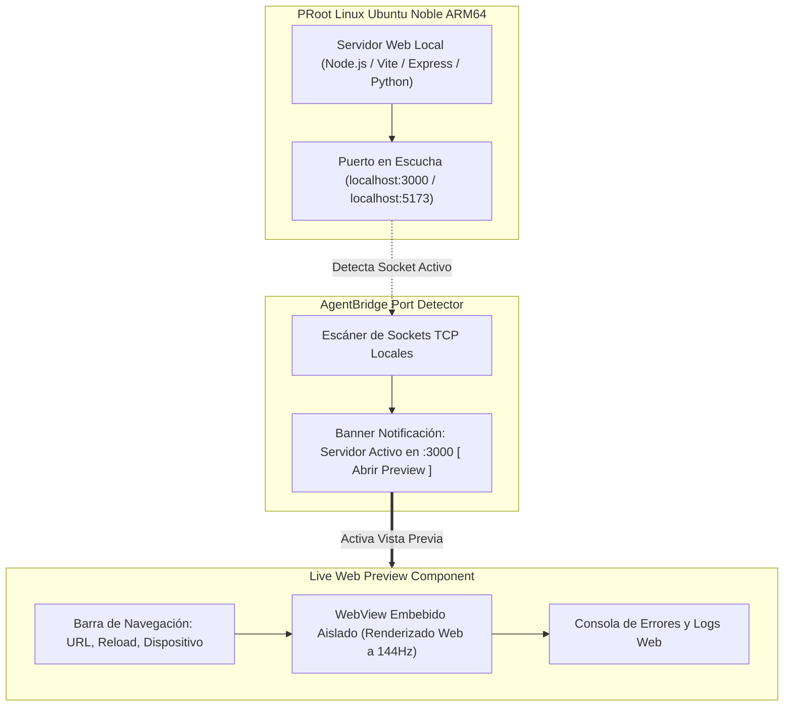
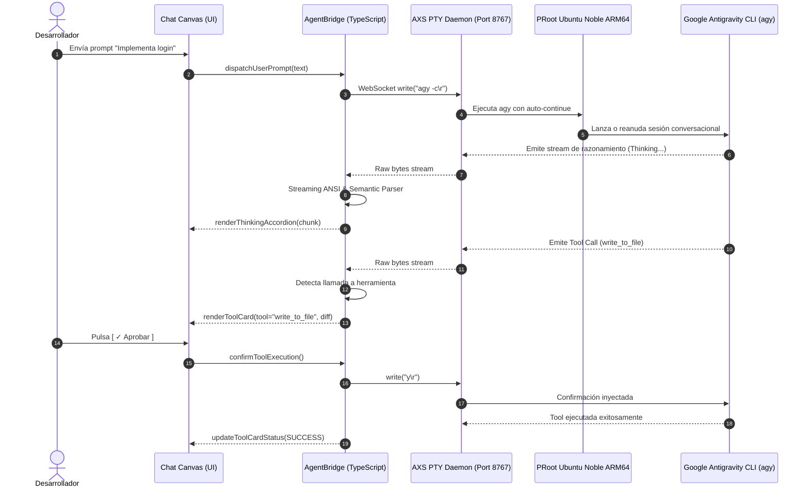

# SPEC-021: Arquitectura de Google Antigravity 2.0 Mobile: Entorno Agéntico Conversacional, Canvas Reactivo y Live Web Preview

| Metadato | Valor |
| :--- | :--- |
| **Identificador** | `SPEC-021` |
| **Título** | Arquitectura de Google Antigravity 2.0 Mobile: Entorno Agéntico Conversacional, Canvas Reactivo y Live Web Preview |
| **Autor** | `@spec-architect` |
| **Estado** | `APPROVED FOR IMPLEMENTATION` |
| **Fecha de Creación** | 2026-09-14 |
| **Dispositivo Objetivo** | Xiaomi Pad 6 (Qualcomm Snapdragon 870, ARM64-v8a, 6 GB RAM, 11" 2.8K 144Hz, Xiaomi HyperOS / Android 13/14) y Dispositivos Móviles Android (API 26+) |
| **Runtime Target** | Android Hardware-Accelerated WebView / TypeScript / Material 3 / PRoot Linux Ubuntu 24.04 Noble ARM64 / Google Antigravity CLI (`agy`) / AXS PTY Daemon |
| **Módulos Afectados** | `src/components/chatCanvas/`, `src/components/livePreview/`, `src/components/drawer/`, `src/services/agentBridge/`, `res/`, `harness/` |

---

## 1. Contexto, Motivación y el Pivot de Diseño hacia Google Antigravity 2.0 Mobile

### 1.1 El Fracaso de la Metáfora del Editor de Texto Tradicional en Dispositivos Móviles
Durante las fases anteriores ([`SPEC-000`](file:///c:/Projects/antigravity/specs/00-system-architecture.md) a [`SPEC-020`](file:///c:/Projects/antigravity/specs/20-nova-tri-column-layout-projects-bridge-and-clean-identity.md)), el proyecto exploró adaptar la metáfora convencional de los entornos de desarrollo integrados de escritorio (IDEs tipo VS Code o Acode) al ecosistema móvil: un árbol de archivos lateral, un editor de texto central con números de línea y pestañas múltiples, y una consola terminal subordinada en un panel derecho.

La experimentación exhaustiva sobre la **Xiaomi Pad 6** y teléfonos móviles reveló una verdad incontestable de usabilidad en la era de la inteligencia artificial de frontera:

1. **Escribir Código en Pantalla Táctil es una Fricción Antinatural:** La interacción táctil móvil carece de la velocidad y precisión táctil de un teclado mecánico de escritorio. Forzar al ingeniero a editar código línea por línea, seleccionar texto con asas táctiles imprecisas y lidiar con teclados virtuales que consumen el 50% de la pantalla es un enfoque anacrónico.
2. **Inversión de Roles: El Agente es el Constructor, el Ingeniero es el Arquitecto:** Con modelos de frontera como Google Gemini 2.5 Pro y Ultra, el desarrollador **no escribe el código carácter por carácter**. El desarrollador define requisitos, redacta especificaciones, evalúa planes de arquitectura, aprueba modificaciones en bloque (*diffs*) y valida el resultado en vivo.
3. **El Editor Tradicional Bloqueaba el Valor Fundamental:** Mantener un editor de texto como vista primaria desperdiciaba el 60% del espacio de pantalla en código estático, relegando el razonamiento del agente, las decisiones de arquitectura y la previsualización interactiva a ventanas secundarias estranguladas.

**Google Antigravity 2.0 Mobile** representa el pivot de diseño definitivo: **se elimina el editor de texto tradicional como vista principal**. La experiencia evoluciona hacia una **Estación Agéntica Conversacional Pura (*Agent-First Mobile Studio*)**, donde el centro neurálgico es un **Chat Canvas Reactivo**, asistido por un **Live Web Preview** interactivo y un **Drawer de Proyectos y Sesiones**.

```mermaid
flowchart LR
    subgraph ParadigmaObsoleto["Paradigma 1.0 (Editor Tradicional)"]
        direction TB
        P1["Editor de Texto Línea por Línea (Ace/Monaco)"]
        P2["El Usuario Escribe Código Manualmente"]
        P3["Terminal Agéntica Confinada a un Panel Lateral"]
        P4["Sin Previsualización en Vivo Integrada"]
    end

    subgraph ParadigmaAntigravity2["Paradigma 2.0 (Google Antigravity Mobile)"]
        direction TB
        A1["Chat Canvas Agéntico como Vista Central"]
        A2["El Agente Construye, el Usuario Guía y Aprueba"]
        A3["Tarjetas Interactivas de Herramientas y Diffs"]
        A4["Live Web Preview en Pantalla Dividida o Bottom Sheet"]
    end

    ParadigmaObsoleto ==>|Pivot de Arquitectura Agéntica| ParadigmaAntigravity2
```



---

### 1.2 Declaración de Visión del Producto
**Google Antigravity 2.0 Mobile** transforma cualquier tablet o smartphone Android ARM64 en una consola de mando agéntica de ingeniería de software autónoma:
- **Zero-Friction Prompting:** El desarrollador interactúa mediante lenguaje natural, audio o comandos rápidos.
- **Transparencia Total de Razonamiento:** Bloques de pensamiento (*Chain of Thought*) colapsables para auditar cómo y por qué el modelo toma decisiones.
- **Control Humano Determinista (*Human-in-the-Loop*):** Tarjetas de aprobación de planes arquitectónicos con un solo toque (`[ ✓ Aprobar Plan ]`) antes de que el agente ejecute cambios destructivos.
- **Prueba Inmediata:** Visualización instantánea de la aplicación web resultante en un navegador embebido conectado en tiempo real al servidor local de desarrollo.

---

## 2. Identidad Oficial de Marca y Sistema de Diseño

### 2.1 Nombre de Marca Oficial y Logotipo Prisma de 4 Colores Google
La aplicación asume formal y soberanamente la denominación **Google Antigravity** (versión `v2.0.0`):

- **Isotipo:** El **Prisma Gravitacional de Google**. Una figura geométrica de refracción estelar compuesta por los cuatro colores canónicos de la identidad corporativa de Google, simbolizando la convergencia de la IA multimodal, la ingeniería de software y la gravedad invertida:
  - **Google Blue:** `#4285f4` (Estructura, lógica, llamadas a herramientas y acciones primarias).
  - **Google Red:** `#ea4335` (Alertas críticas, eliminaciones en diffs y detención de procesos).
  - **Google Yellow:** `#fbbc04` (Advertencias, estado de pensamiento / razonamiento activo y advertencias de linter).
  - **Google Green:** `#34a853` (Aprobación de planes, adiciones en diffs y tests exitosos).

```
                 /\
                /  \  #ea4335 (Red)
   #4285f4     /    \
   (Blue)     /  ✦   \   #fbbc04 (Yellow)
             /________\
             #34a853 (Green)
```

---

### 2.2 Sistema de Diseño: Google Material 3 Dark Void
El sistema de diseño de Google Antigravity 2.0 Mobile está construido sobre los principios de **Material 3 (M3) Dark**, adaptado al tema ultra-oscuro de alto rendimiento **Dark Void**:

| Token Semántico | Valor HEX | Uso y Rol en la Interfaz |
| :--- | :--- | :--- |
| **`md.sys.color.background`** | `#090d16` | Fondo absoluto de la aplicación (Dark Void), diseñado para reducir el consumo energético en pantallas AMOLED/IPS de alta tasa de refresco (144Hz). |
| **`md.sys.color.surface`** | `#111827` | Fondo del Drawer lateral, barras de navegación superior e inferior y contenedores base. |
| **`md.sys.color.surface-container`**| `#1a2234` | Superficie de tarjetas de herramientas, acordeones de pensamiento y modales elevados. |
| **`md.sys.color.surface-variant`**  | `#232d42` | Bordes sutiles, divisores y fondos de bloques de código en línea. |
| **`md.sys.color.primary`**          | `#4285f4` | Acento primario, botones de acción principal, cursor activo y badges informativos. |
| **`md.sys.color.on-primary`**       | `#ffffff` | Texto y glifos sobre elementos con color primario. |
| **`md.sys.color.user-bubble`**      | `#1e293b` | Fondo de burbujas de mensajes enviadas por el desarrollador (borde sutil `#334155`). |
| **`md.sys.color.agent-bubble`**     | `#131b2e` | Fondo de respuestas emitidas por el agente (borde izquierdo con acento de gradiente Google). |
| **`md.sys.color.on-surface`**       | `#e2e8f0` | Tipografía principal para texto legible de alto contraste (WCAG AAA). |
| **`md.sys.color.on-surface-variant`**| `#94a3b8`| Tipografía secundaria, marcas de tiempo, nombres de archivos y metadatos. |

---

### 2.3 Tipografía
- **Tipografía de Interfaz (UI):** `Google Sans` / `Roboto Flex` para títulos, botones y etiquetas de navegación.
- **Tipografía de Código y Terminal:** `JetBrains Mono` / `Roboto Mono` con soporte de ligaduras tipográficas y caracteres de Nerd Fonts para bloques de código, comandos bash y diffs.

---

## 3. Contratos de Interfaz del Chat Canvas

El **Chat Canvas** es la superficie principal de trabajo. Sustituye la ventana de terminal cruda por una secuencia fluida de elementos interactivos de alto nivel:

```
+-----------------------------------------------------------------------------------------------+
| [ ☰ ] [ ✦ Google Antigravity ] [ Project: ecommerce-api ]                [ 🌐 Live Preview ]  |
+-----------------------------------------------------------------------------------------------+
|                                                                                               |
|  [Usuario: shadrick1212@gmail.com]                                                  14:20    |
|  ┌─────────────────────────────────────────────────────────────────────────────────────────┐  |
|  │ Crea el endpoint de autenticación JWT en src/auth.ts y configura el middleware de token │  |
|  └─────────────────────────────────────────────────────────────────────────────────────────┘  |
|                                                                                               |
|  [Google Antigravity - Gemini 2.5 Pro]                                              14:20    |
|  ┌─────────────────────────────────────────────────────────────────────────────────────────┐  |
|  │ ▾ Thinking... (Razonado durante 3.4s)                                                  │  |
|  │   - Analizando requerimientos de JWT (jsonwebtoken vs jose).                            │  |
|  │   - Inspeccionando package.json para verificar dependencias existentes.                 │  |
|  │   - Elaborando plan de dos fases: instalación de tipos y creación de middleware.        │  |
|  ├─────────────────────────────────────────────────────────────────────────────────────────┤  |
|  │ 📋 PLAN DE ARQUITECTURA PROPUESTO:                                                      │  |
|  │   [x] 1. Instalar jsonwebtoken y @types/jsonwebtoken                                    │  |
|  │   [ ] 2. Implementar generateToken() y verifyToken() en src/auth.ts                     │  |
|  │   [ ] 3. Crear middleware authenticateJWT en src/middleware/auth.ts                     │  |
|  │                                                                                         │  |
|  │   [ ✓ Aprobar y Ejecutar ]          [ ✎ Solicitar Ajustes ]                             │  |
|  └─────────────────────────────────────────────────────────────────────────────────────────┘  |
|                                                                                               |
|  ┌─────────────────────────────────────────────────────────────────────────────────────────┐  |
|  │ ⚙️ HERRAMIENTA: write_to_file (src/auth.ts)                             [ SUCCESS (12ms) ]│  |
|  │   + export const generateToken = (userId: string): string => {                          │  |
|  │   +   return jwt.sign({ sub: userId }, process.env.JWT_SECRET!, { expiresIn: '1h' });   │  |
|  │   + };                                                                                  │  |
|  └─────────────────────────────────────────────────────────────────────────────────────────┘  |
|                                                                                               |
+-----------------------------------------------------------------------------------------------+
| [ + ] [ Describe la tarea o problema a resolver...                          ] [ 🎤 ] [ ➤ ]   |
+-----------------------------------------------------------------------------------------------+
```

---

### 3.1 Acordeón de Razonamiento (*Thinking... ▾*)
Los modelos de razonamiento profundo emiten bloques de pensamiento interno (*Chain of Thought*) antes de actuar:

1. **Estado en Ejecución (*Thinking Active*):**
   - El encabezado muestra un spinner o pulso de cuatro colores y el texto dinámico: `Thinking... (4.2s)`.
   - Opcionalmente colapsado para no abrumar al usuario, con un botón desplegable `▾`.
2. **Estado Finalizado (*Thinking Complete*):**
   - Se transforma en un acordeón colapsado por defecto: `▾ Thinking Process (3.8s)`.
   - Al pulsar el acordeón, se expande suavemente revelando el razonamiento paso a paso en tipografía monospace `#94a3b8` sobre fondo `#0d121d`.

---

### 3.2 Tarjetas de Ejecución de Herramientas (*Tool Execution Cards*)
Cuando la CLI de Antigravity invoca herramientas del sistema, la interfaz renderiza componentes especializados:

1. **Herramienta `run_command`:**
   - Cabecera: Icono de consola terminal, comando ejecutado (p. ej. `npm install jsonwebtoken`), botón para copiar.
   - Cuerpo: Ventana de terminal embebida en color negro obsidiana con salida en streaming (`stdout` / `stderr`).
   - Insignia de estado: `RUNNING` (azul), `EXIT 0` (verde) o `FAILED (EXIT 1)` (rojo).
2. **Herramientas de Edición de Archivos (`write_to_file`, `replace_file_content`):**
   - Cabecera: Icono de archivo, ruta relativa (`src/auth.ts`), número de líneas añadidas (`+24`) y eliminadas (`-3`).
   - Cuerpo: Visor de diferencias (*Diff Viewer*) con sintaxis coloreada en verde para adiciones y rojo para eliminaciones.
   - Botón *"Ver Archivo Completo"* para inspeccionar el resultado consolidado.

---

### 3.3 Tarjeta de Aprobación de Plan (*Plan Approval Card*)
Cuando el agente opera en modo de planificación rigurosa (Spec-Driven Development):
1. **Contenido del Plan:** Resumen ejecutivo, lista de hitos con checkboxes interactivos y lista de archivos que sufrirán modificaciones.
2. **Botón Táctil Prominente `[ ✓ Aprobar y Ejecutar ]`:**
   - Color Google Green `#34a853` con tipografía blanca seminegrilla y tamaño mínimo de toque de $48\,\text{dp}$.
   - Al pulsar, envía inmediatamente la señal de confirmación (`y\r` o token de autorización) al puente PTY del CLI `agy`, desbloqueando la ejecución autónoma de las herramientas.
3. **Botón Secundario `[ ✎ Solicitar Ajustes ]`:**
   - Abre un campo de entrada contextual para indicar al agente qué aspectos del plan deben ser modificados antes de continuar.

---

## 4. Drawer Lateral Izquierdo (Hub de Sesiones y Espacio de Trabajo)

El panel lateral izquierdo se despliega al pulsar el botón hamburguesa `☰` o deslizar desde el borde izquierdo:

```
+------------------------------------------+
| GOOGLE ANTIGRAVITY                       |
| ---------------------------------------- |
| [ Avatar ] shadrick1212@gmail.com        |
|            Google AI Ultra (Gemini 2.5)  |
| ---------------------------------------- |
| [ + Nueva Conversación ]                 |
| ---------------------------------------- |
| PROYECTO ACTIVO                          |
|   📁 /sdcard/Projects/ecommerce-api  ▾   |
|   (3 proyectos disponibles)              |
| ---------------------------------------- |
| HISTORIAL DE CONVERSACIONES              |
|   Hoy                                    |
|   💬 Autenticación JWT y Middleware     |
|   💬 Refactorización de Base de Datos    |
|                                          |
|   Ayer                                   |
|   💬 Configuración Inicial con Docker   |
|   💬 Corrección de Tests en Jest        |
| ---------------------------------------- |
| [ ⚙️ Ajustes ]  [ 🛡️ Quality Gates: OK ] |
+------------------------------------------+
```

---

### 4.1 Perfil de Usuario y Cuota Google AI Ultra
- **Identidad Autenticada:** Muestra el avatar y correo electrónico del usuario autenticado vía Google OAuth 2.0 PKCE (`shadrick1212@gmail.com`).
- **Nivel de Suscripción:** Indicador de suscripción de frontera **Google AI Ultra**, garantizando acceso prioritario a los modelos Gemini 2.5 Pro y Ultra con contexto extendido de 1 millón de tokens.
- **Acceso a Configuración:** Botón para gestionar tokens de autenticación, cuotas de API y endpoints.

---

### 4.2 Historial de Conversaciones Recuperado Directamente de `agy`
A diferencia de interfaces efímeras que pierden los chats al cerrar la aplicación:
- La CLI oficial de Google Antigravity almacena el historial persistente de sesiones conversacionales en `/root/.gemini/antigravity-cli/chats/` (o estructura JSON/SQLite interna).
- El Drawer lateral lee y sincroniza este historial en tiempo real.
- Cada entrada muestra: título descriptivo sintetizado por el modelo, fecha/hora y número de mensajes intercambiados.
- Al tocar una conversación anterior, el sistema reanuda inmediatamente el contexto conversacional ejecutando `agy -c <chatId>`.

---

### 4.3 Selector de Proyectos en `/sdcard/Projects`
- Permite conmutar con un solo toque entre los diferentes proyectos alojados en el almacenamiento compartido `/storage/emulated/0/Projects` (o `/sdcard/Projects`).
- Al seleccionar un proyecto:
  1. El directorio de trabajo de la terminal de Linux cambia a `/home/studio/workspace/<nombre-proyecto>`.
  2. Se carga automáticamente el archivo `agent.md` correspondiente a ese proyecto para alimentar las directivas de gobernanza.
  3. El historial de chats se filtra para mostrar las sesiones vinculadas a dicho proyecto.

---

## 5. Panel de Live Web Preview

El **Live Web Preview** es la superficie de validación interactiva en tiempo real para aplicaciones web desarrolladas por el agente.



---

### 5.1 Distribución Adaptativa (Tablet vs. Smartphone)

#### A. Tablets en Modo Apaisado ($\ge 1024\,\text{px}$, Xiaomi Pad 6):
- **Distribución Split-View Simultánea:**
  - Columna Izquierda ($55\%$ del ancho): **Chat Canvas** para dialogar con el agente e instruir cambios.
  - Columna Derecha ($45\%$ del ancho): **Live Web Preview** mostrando la aplicación web en funcionamiento.
  - Divisor central interactivo con arrastre táctil para ampliar o reducir la vista previa.

#### B. Smartphones y Tablets en Modo Vertical ($< 1024\,\text{px}$):
- **Distribución Bottom Sheet Deslizable / Selector de Pestañas:**
  - El Live Web Preview opera como un panel deslizable inferior (*Bottom Sheet*) que puede expandirse hacia arriba con un gesto del dedo.
  - Alternativamente, una barra superior conmutadora permite alternar instantáneamente entre `[ ✦ Agente ]` y `[ 🌐 Vista Previa ]`.

---

### 5.2 Detección Automática de Servidores Locales
Cuando el agente ejecuta comandos como `npm run dev`, `vite`, `python -m http.server` o `node server.js`:
1. El backend detecta la apertura de puertos TCP locales habituales (`3000`, `5173`, `8080`, `8000`, `4321`).
2. En la parte superior del Chat Canvas se despliega un botón sutil animado:
   `[ 🌐 Servidor Activo en http://localhost:3000 - Abrir Vista Previa ]`.
3. Al pulsarlo, el Live Web Preview se abre automáticamente apuntando a la URL correspondiente.

---

### 5.3 Barra de Control de Vista Previa
- **Barra de Dirección:** Permite navegar por sub-rutas de la aplicación web (p. ej. `/login`, `/dashboard`).
- **Botón Recarga en Caliente (`↻`):** Fuerza la recarga del WebView sin reiniciar el servidor.
- **Selector de Viewport:** Permite emular resoluciones de Smartphone ($375\,\text{px}$), Tablet ($768\,\text{px}$) o Pantalla Completa ($100\%$).
- **Consola Embebida:** Inspección de errores JavaScript del frontend (`console.error`, `uncaught exceptions`) para compartirlos directamente con el agente con el botón *"Pedir al Agente que repare este error"*.

---

## 6. Puente AgentBridge con PRoot Ubuntu Noble ARM64 y `agy -c`

El componente **AgentBridge** orquesta la comunicación bidireccional entre la interfaz visual de Google Antigravity y el runtime oficial del CLI de Google Antigravity ejecutándose dentro de Linux PRoot.



---

### 6.1 Modo Auto-Continue (`agy -c`)
Para garantizar la continuidad total entre sesiones sin perder el historial de contexto ni obligar al usuario a reintroducir información:
1. El comando de lanzamiento del agente utiliza sistemáticamente la bandera de continuación:
   ```bash
   agy -c
   ```
   o cuando se selecciona una sesión específica del historial:
   ```bash
   agy -c --chat-id <uuid-de-sesion>
   ```
2. Esto indica a la CLI de Google Antigravity que recupere el estado mental, los resúmenes semánticos y el árbol de archivos previamente analizados.

---

### 6.2 Parser Streaming y Traductor Semántico
El `AgentBridge` incorpora un motor de análisis sintáctico reactivo que procesa el flujo de bytes de la terminal:
- **Detección de Secuencias de Escape:** Limpia y formatea códigos de color ANSI.
- **Extracción de Bloques de Razonamiento:** Identifica marcadores de inicio y fin de pensamiento para bifurcarlos hacia el componente `ThinkingAccordion`.
- **Extracción de Diffs y Herramientas:** Parsea la estructura de invocación de herramientas para generar las tarjetas interactivas `ToolCard` con resaltado de sintaxis nativo.

---

## 7. Contratos Formales de Interfaces y Protocolos

### 7.1 Contrato del Chat Canvas (`ChatCanvasContract`)

```typescript
export interface ChatMessage {
  id: string;
  sender: 'user' | 'agent';
  timestamp: number;
  content: string; // Markdown enriquecido
  thinkingProcess?: {
    durationSeconds: number;
    thoughts: string[];
    isComplete: boolean;
  };
  toolInvocations?: ToolInvocation[];
  planApproval?: PlanApprovalRequest;
}

export interface ToolInvocation {
  toolId: string;
  toolName: 'write_to_file' | 'replace_file_content' | 'run_command' | 'grep_search' | 'read_url';
  status: 'PENDING' | 'RUNNING' | 'SUCCESS' | 'ERROR';
  arguments: Record<string, any>;
  outputSummary?: string;
  diffContent?: string;
  durationMs?: number;
}

export interface PlanApprovalRequest {
  planId: string;
  title: string;
  steps: { id: string; description: string; completed: boolean }[];
  affectedFiles: string[];
  status: 'AWAITING_USER_APPROVAL' | 'APPROVED' | 'REJECTED';
}
```

---

### 7.2 Contrato del Live Web Preview (`LivePreviewContract`)

```typescript
export interface LivePreviewConfig {
  activeUrl: string; // ej. "http://localhost:3000"
  detectedPorts: number[]; // [3000, 5173, 8080]
  viewportMode: 'responsive' | 'mobile' | 'tablet' | 'desktop';
  isConsoleVisible: boolean;
  capturedLogs: {
    level: 'info' | 'warn' | 'error';
    message: string;
    timestamp: number;
  }[];
}
```

---

### 7.3 Contrato del Drawer de Sesiones y Proyectos (`SessionDrawerContract`)

```typescript
export interface UserProfile {
  email: 'shadrick1212@gmail.com';
  tier: 'Google AI Ultra';
  avatarUrl: string;
}

export interface ChatSessionMetadata {
  chatId: string;
  projectName: string;
  title: string;
  lastActiveTimestamp: number;
  messageCount: number;
}

export interface ProjectDirectory {
  name: string;
  absolutePath: string; // "/storage/emulated/0/Projects/mi-proyecto"
  hasAgentMd: boolean;
}
```

---

### 7.4 Contrato del Puente AgentBridge (`AgentBridgeContract`)

```typescript
export interface AgentBridgeOptions {
  websocketEndpoint: string; // "ws://127.0.0.1:8767/pty"
  autoContinueFlag: true;
  projectWorkspacePath: string; // "/home/studio/workspace"
  onThinkingChunk: (chunk: string) => void;
  onToolCallDetected: (tool: ToolInvocation) => void;
  onResponseComplete: () => void;
}
```

---

## 8. Matriz de Criterios de Aceptación del Arnés (`AC-AG2-*`)

| Identificador | Módulo Objetivo | Condición de Prueba | Comportamiento Esperado | Método de Verificación |
| :--- | :--- | :--- | :--- | :--- |
| **`AC-AG2-001`** | Identidad de Marca | Inspección de nombre y logotipo | Nombre oficial es **Google Antigravity** (v2.0.0) y el logo implementa el prisma de 4 colores Google. | Verificación estática de strings de marca y recursos visuales. |
| **`AC-AG2-002`** | Design System | Esquema de colores Material 3 Dark Void | Fondo base Deep Void (`#090d16`), tarjetas (`#1a2234`) y acentos de color Google (`#4285f4`, `#ea4335`, `#fbbc04`, `#34a853`). | Inspección de tokens CSS/SCSS en la configuración del tema. |
| **`AC-AG2-003`** | Chat Canvas | Acordeón de pensamiento (*Thinking... ▾*) | Renderiza el bloque de razonamiento colapsable con indicador de tiempo de ejecución y estilo monospace. | Prueba de renderizado con stream de razonamiento de prueba. |
| **`AC-AG2-004`** | Chat Canvas | Tarjetas de ejecución de herramientas | Llamadas a herramientas (`write_to_file`, `run_command`) se visualizan como tarjetas con diffs y logs formateados. | Verificación de estructura del componente `ToolCard`. |
| **`AC-AG2-005`** | Chat Canvas | Tarjeta de aprobación de plan con botón táctil | Despliega tarjeta de plan con botón táctil prominente `[ ✓ Aprobar y Ejecutar ]` que inyecta confirmación al PTY. | Prueba de interacción táctil y envío de señal de confirmación. |
| **`AC-AG2-006`** | Drawer Lateral | Perfil de usuario y sesión activa | Exhibe el perfil `shadrick1212@gmail.com` con nivel **Google AI Ultra** y botón `+ Nueva Conversación`. | Inspección del DOM del Drawer lateral izquierdo. |
| **`AC-AG2-007`** | Drawer Lateral | Historial de chats recuperado de `agy` | Lista cronológica de conversaciones leídas de la base de chats de Antigravity CLI. | Verificación de sincronización de archivos de chat en PRoot. |
| **`AC-AG2-008`** | Live Web Preview | Detección automática y Split-View en tablet | En tablets ($\ge 1024\,\text{px}$) muestra Split-View y detecta automáticamente servidores en puertos locales (`3000`). | Prueba de layout responsivo e inspección de sockets TCP. |
| **`AC-AG2-009`** | AgentBridge | Ejecución con bandera auto-continue (`agy -c`) | La invocación a la CLI utiliza sistemáticamente `agy -c` para preservar la continuidad conversacional. | Inspección de comandos de ejecución en el servicio de puente. |

---

## 9. Script Automatizado de Verificación para el Arnés (`test_antigravity_2_mobile.sh`)

```bash
#!/bin/bash
# Test Harness - Automated Verification for SPEC-021
set -e

SPEC_FILE="specs/21-antigravity-2-mobile-architecture.md"

echo "=== INICIANDO VERIFICACIÓN FORMAL DE ESPECIFICACIÓN GOOGLE ANTIGRAVITY 2.0 (SPEC-021) ==="

# 1. Verificar existencia de la especificación
echo -n "1. Comprobando existencia de SPEC-021... "
if [ ! -f "$SPEC_FILE" ]; then
  echo "FALLO: No existe $SPEC_FILE"; exit 1;
fi
echo "[OK]"

# 2. Verificar identidad oficial de marca y colores Google
echo -n "2. Comprobando identidad de marca Google Antigravity y paleta de 4 colores... "
grep -q "Google Antigravity" "$SPEC_FILE" || { echo "FALLO: Nombre 'Google Antigravity' ausente"; exit 1; }
grep -q "2.0.0" "$SPEC_FILE" || { echo "FALLO: Versión 2.0.0 ausente"; exit 1; }
grep -q "#4285f4" "$SPEC_FILE" || { echo "FALLO: Google Blue #4285f4 ausente"; exit 1; }
grep -q "#ea4335" "$SPEC_FILE" || { echo "FALLO: Google Red #ea4335 ausente"; exit 1; }
grep -q "#fbbc04" "$SPEC_FILE" || { echo "FALLO: Google Yellow #fbbc04 ausente"; exit 1; }
grep -q "#34a853" "$SPEC_FILE" || { echo "FALLO: Google Green #34a853 ausente"; exit 1; }
grep -q "Dark Void" "$SPEC_FILE" || { echo "FALLO: Tema Dark Void ausente"; exit 1; }
echo "[OK]"

# 3. Verificar contratos del Chat Canvas (Thinking, Tools, Plan Approval)
echo -n "3. Comprobando especificación de Chat Canvas (Thinking, Tools, Approval)... "
grep -q "Thinking..." "$SPEC_FILE" || { echo "FALLO: Acordeón Thinking ausente"; exit 1; }
grep -q "Tool Execution Cards" "$SPEC_FILE" || { echo "FALLO: Tool Execution Cards ausente"; exit 1; }
grep -q "Plan Approval Card" "$SPEC_FILE" || { echo "FALLO: Plan Approval Card ausente"; exit 1; }
grep -q "Aprobar y Ejecutar" "$SPEC_FILE" || { echo "FALLO: Botón de aprobación ausente"; exit 1; }
echo "[OK]"

# 4. Verificar Drawer Lateral (Perfil shadrick1212@gmail.com, Google AI Ultra, Chats)
echo -n "4. Comprobando Drawer Lateral (Perfil de usuario y chats)... "
grep -q "shadrick1212@gmail.com" "$SPEC_FILE" || { echo "FALLO: Perfil de usuario ausente"; exit 1; }
grep -q "Google AI Ultra" "$SPEC_FILE" || { echo "FALLO: Nivel Google AI Ultra ausente"; exit 1; }
grep -q "+ Nueva Conversación" "$SPEC_FILE" || { echo "FALLO: Botón Nueva Conversación ausente"; exit 1; }
grep -q "/sdcard/Projects" "$SPEC_FILE" || { echo "FALLO: Selector /sdcard/Projects ausente"; exit 1; }
echo "[OK]"

# 5. Verificar Live Web Preview y detección de servidores
echo -n "5. Comprobando especificación de Live Web Preview... "
grep -q "Live Web Preview" "$SPEC_FILE" || { echo "FALLO: Live Web Preview ausente"; exit 1; }
grep -q "Split-View" "$SPEC_FILE" || { echo "FALLO: Modo Split-View ausente"; exit 1; }
grep -q "Bottom Sheet" "$SPEC_FILE" || { echo "FALLO: Modo Bottom Sheet ausente"; exit 1; }
grep -q "localhost:3000" "$SPEC_FILE" || { echo "FALLO: Detección de puerto local ausente"; exit 1; }
echo "[OK]"

# 6. Verificar puente AgentBridge y auto-continue (agy -c)
echo -n "6. Comprobando AgentBridge y agy -c... "
grep -q "AgentBridge" "$SPEC_FILE" || { echo "FALLO: AgentBridge ausente"; exit 1; }
grep -q "agy -c" "$SPEC_FILE" || { echo "FALLO: Invocación agy -c ausente"; exit 1; }
echo "[OK]"

# 7. Verificar matriz de criterios de aceptación AC-AG2-*
echo -n "7. Comprobando criterios de aceptación AC-AG2-*... "
grep -q "AC-AG2-001" "$SPEC_FILE" || { echo "FALLO: AC-AG2-001 ausente"; exit 1; }
grep -q "AC-AG2-002" "$SPEC_FILE" || { echo "FALLO: AC-AG2-002 ausente"; exit 1; }
grep -q "AC-AG2-003" "$SPEC_FILE" || { echo "FALLO: AC-AG2-003 ausente"; exit 1; }
grep -q "AC-AG2-004" "$SPEC_FILE" || { echo "FALLO: AC-AG2-004 ausente"; exit 1; }
grep -q "AC-AG2-005" "$SPEC_FILE" || { echo "FALLO: AC-AG2-005 ausente"; exit 1; }
grep -q "AC-AG2-006" "$SPEC_FILE" || { echo "FALLO: AC-AG2-006 ausente"; exit 1; }
grep -q "AC-AG2-007" "$SPEC_FILE" || { echo "FALLO: AC-AG2-007 ausente"; exit 1; }
grep -q "AC-AG2-008" "$SPEC_FILE" || { echo "FALLO: AC-AG2-008 ausente"; exit 1; }
grep -q "AC-AG2-009" "$SPEC_FILE" || { echo "FALLO: AC-AG2-009 ausente"; exit 1; }
echo "[OK]"

echo "=== TODAS LAS COMPUERTAS DE VERIFICACIÓN DE SPEC-021 HAN PASADO EXITOSAMENTE ==="
```

---

## 10. Conclusión y Plan de Ejecución SDD

La especificación técnica **`SPEC-021`** marca el hito más transformador en la evolución del ecosistema móvil de Antigravity:

1. **Superación del Editor Tradicional:** La eliminación del editor de texto como vista primaria resuelve de raíz la incomodidad ergonómica de la entrada táctil en pantallas móviles y tablets.
2. **Centralidad Agéntica:** El **Chat Canvas** se erige como el espacio natural de colaboración humano-IA, estructurando el flujo de trabajo en diálogo estratégico, visualización transparente del razonamiento y aprobación determinista de planes de código.
3. **Validación en Vivo Inmediata:** El **Live Web Preview** acorta a cero la distancia entre la codificación del agente y la experimentación táctil interactiva por parte del desarrollador.
4. **Soberanía y Experiencia Google:** La identidad corporativa oficial de **Google Antigravity 2.0**, con el prisma de 4 colores y el tema Material 3 Dark Void, consolida un estándar de ingeniería móvil de clase mundial en la Xiaomi Pad 6.
