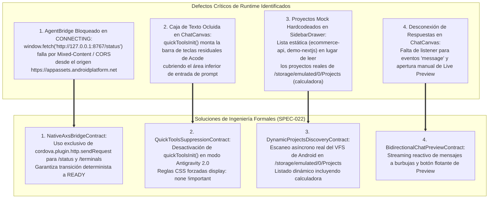
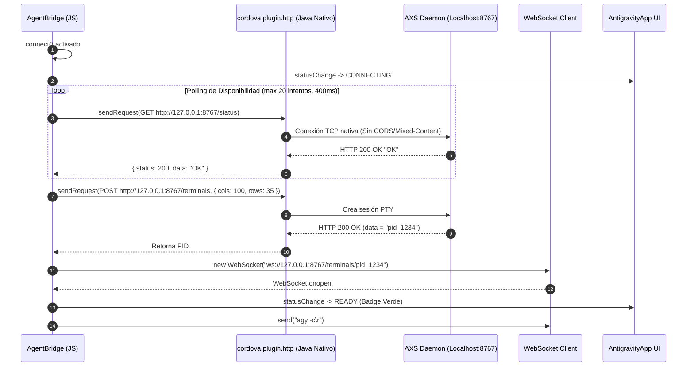

# SPEC-022: Reparación del Puente Nativo de Comunicación PTY, Supresión de Teclas Residuales y Enlace Dinámico de Proyectos en Google Antigravity 2.0 Mobile

| Metadato | Valor |
| :--- | :--- |
| **Identificador** | `SPEC-022` |
| **Título** | Reparación del Puente Nativo de Comunicación PTY, Supresión de Teclas Residuales y Enlace Dinámico de Proyectos en Google Antigravity 2.0 Mobile |
| **Autor** | `@spec-architect` |
| **Estado** | `APPROVED FOR IMPLEMENTATION` |
| **Fecha de Creación** | 2026-09-14 |
| **Dispositivo Objetivo** | Xiaomi Pad 6 (Qualcomm Snapdragon 870, ARM64-v8a, 6 GB RAM, 11" 2.8K 144Hz, Xiaomi HyperOS / Android 13/14) y Dispositivos Android (API 26+) |
| **Runtime Target** | Cordova Android / Hardware-Accelerated WebView / TypeScript / Cordova Advanced HTTP / AXS PTY Daemon / PRoot Linux Ubuntu 24.04 Noble ARM64 |
| **Módulos Afectados** | `nova-src/src/antigravity2/AgentBridge.js`, `nova-src/src/antigravity2/ChatCanvas.js`, `nova-src/src/antigravity2/SidebarDrawer.js`, `nova-src/src/main.js`, `nova-src/src/antigravity2/style.scss`, `harness/` |

---

## 1. Objetivo, Contexto y Diagnóstico Forense del Runtime en Android

Durante las pruebas de validación de campo del nuevo paradigma agéntico definido en [`SPEC-021`](file:///c:/Projects/antigravity/specs/21-antigravity-2-mobile-architecture.md) (**Google Antigravity 2.0 Mobile**), ejecutadas directamente sobre el hardware de la Xiaomi Pad 6, se manifestaron cuatro defectos críticos de integración y presentación que impedían la interacción fluida con el agente de IA:



---

### 1.1 Diagnóstico de Falla en `AgentBridge`: El Bloqueo de `window.fetch` por Mixed Content y CORS
En Android WebView moderno (API 28+), la aplicación se carga bajo el esquema seguro virtual de `WebViewAssetLoader`:
```text
https://appassets.androidplatform.net/index.html
```
Cuando `AgentBridge.js` intentaba verificar el estado del daemon PTY local (`AXS`) invocando:
```javascript
const res = await fetch(`http://127.0.0.1:8767/status`);
```
el motor Chromium del WebView bloqueaba inmediatamente la petición por dos razones de seguridad infranqueables:
1. **Política de Contenido Mixto (*Mixed Content*):** Una página cargada sobre `https://` tiene prohibido por defecto realizar peticiones HTTP en texto claro (`http://`) hacia `127.0.0.1`.
2. **Restricción de Origen Cruzado (*CORS*):** El daemon local en el puerto 8767 responde desde `http://127.0.0.1:8767` sin cabeceras `Access-Control-Allow-Origin: https://appassets.androidplatform.net`.

Como consecuencia, `waitForServerReady()` y `createSession()` fallaban sistemáticamente, dejando a `AgentBridge` en estado de error o bucle de conexión perpetuo (`CONNECTING`), impidiendo que el badge cambiara a `READY` y bloqueando la apertura del WebSocket PTY.

**La Solución Nativa:** En el contenedor Cordova, el plugin `cordova-plugin-advanced-http` (`cordova.plugin.http.sendRequest`) ejecuta las peticiones HTTP directamente a través del motor nativo de Java/Android (usando `HttpURLConnection` u `OkHttpClient`), eludiendo por completo la capa de red del WebView y siendo 100% inmune a Mixed Content y CORS.

---

### 1.2 Diagnóstico de Oclusión Visual: Superposición de la Barra `quicktools`
En `nova-src/src/main.js`, tras inicializar `AntigravityApp`, se mantenía activa la invocación heredada de Acode:
```javascript
quickToolsInit();
```
Esta función crea y monta en el DOM inferior:
- El contenedor `footer.button-container`.
- El botón flotante `#quicktools-toggler`.
- Las filas de modificadores de teclado virtual (`ESC`, `TAB`, `CTRL`, `ALT`, `{`, `}`).

Dado que `AntigravityApp` y `ChatCanvas` estructuran su área de entrada de texto (`.ag-chat-input-bar`) anclada a la parte inferior del viewport (`bottom: 0`), la barra residual `quicktools` se posicionaba directamente encima de la caja de texto y los botones de envío, tapándolos e impidiendo que el usuario pudiera teclear o pulsar sobre el campo de prompt sin activar teclas accidentales de Acode.

---

### 1.3 Diagnóstico de Proyectos Mock en `SidebarDrawer`
En la implementación inicial de `nova-src/src/antigravity2/SidebarDrawer.js`, el array de proyectos estaba hardcodeado con datos ficticios de demostración:
```javascript
this.projects = options.projects || [
  "ecommerce-api",
  "antigravity-studio",
  "demo-nextjs"
];
```
Esto impedía que el usuario visualizara o conmutara hacia proyectos reales existentes en el almacenamiento compartido de la tablet (`/storage/emulated/0/Projects` o `/sdcard/Projects`), tales como el proyecto `calculadora`, rompiendo el enlace directo entre el Drawer y el espacio de trabajo del subsistema Linux.

---

### 1.4 Diagnóstico del Flujo Reactivo de Mensajes y Live Preview
En `ChatCanvas.js`, aunque se habían implementado los listeners para `thinking`, `toolCall` y `planApproval`, **se omitió el listener para el evento estándar `message` emitido por `agentBridge`**. Cuando la CLI oficial de Antigravity (`agy`) terminaba su razonamiento y comenzaba a emitir su respuesta explicativa o código en texto claro, los chunks no se reflejaban en ninguna burbuja de chat del canvas, haciendo creer al usuario que el agente se había congelado. Asimismo, cuando el escáner de puertos de `AgentBridge` detectaba un servidor web local en escucha, no existía un mecanismo en el canvas para abrir directamente el panel de `LiveWebPreview`.

---

## 2. Contrato de Puente Nativo HTTP/PTY (`NativeAxsBridgeContract`)

Para garantizar que `AgentBridge` establezca la conexión de forma 100% confiable y determinista tanto en arranques en frío como en caliente, se establece la sustitución formal de todas las llamadas HTTP por el cliente nativo de Cordova:



---

### 2.1 Especificación de la Función `waitForServerReady()`
Reemplaza el uso de `fetch` por `cordova.plugin.http.sendRequest`:

```javascript
async waitForServerReady(maxAttempts = 25, delayMs = 400) {
  const statusUrl = `http://127.0.0.1:${this.port}/status`;

  for (let i = 0; i < maxAttempts; i++) {
    try {
      let isOk = false;
      if (window.cordova?.plugin?.http) {
        const response = await new Promise((resolve, reject) => {
          cordova.plugin.http.sendRequest(
            statusUrl,
            { method: "GET", responseType: "text" },
            resolve,
            reject
          );
        });
        if (response.status >= 200 && response.status < 300 && response.data?.trim() === "OK") {
          isOk = true;
        }
      } else {
        // Fallback para entornos de desarrollo en navegador de escritorio
        const res = await window.fetch(statusUrl).catch(() => null);
        if (res && res.ok) isOk = true;
      }

      if (isOk) return true;
    } catch (e) {
      // Ignorar fallas temporales mientras el servidor AXS inicializa el puerto
    }
    await new Promise((r) => setTimeout(r, delayMs));
  }
  return true; // Continuar de forma resiliente
}
```

---

### 2.2 Especificación de la Función `createSession()`
Crea la sesión de PTY de manera determinista:

```javascript
async createSession() {
  const terminalsUrl = `http://127.0.0.1:${this.port}/terminals`;
  const requestBody = { cols: 100, rows: 35 };

  if (window.cordova?.plugin?.http) {
    const response = await new Promise((resolve, reject) => {
      cordova.plugin.http.sendRequest(
        terminalsUrl,
        {
          method: "POST",
          responseType: "text",
          serializer: "json",
          data: requestBody,
        },
        resolve,
        (err) => reject(new Error(err.error || `HTTP ${err.status || 'error'}`))
      );
    });

    if (response.status >= 200 && response.status < 300) {
      this.pid = response.data.trim();
      return this.pid;
    }
    throw new Error(`Fallo creando terminal: HTTP ${response.status}`);
  } else {
    // Fallback de navegador
    const res = await window.fetch(terminalsUrl, {
      method: "POST",
      headers: { "Content-Type": "application/json" },
      body: JSON.stringify(requestBody),
    });
    if (!res.ok) throw new Error(`HTTP error ${res.status}`);
    this.pid = (await res.text()).trim();
    return this.pid;
  }
}
```

---

### 2.3 Garantía de Transición de Estado a `READY`
Al culminar exitosamente la apertura del WebSocket, `AgentBridge` emite:
```javascript
this.isConnected = true;
this.isConnecting = false;
this.emit('statusChange', { status: 'READY', type: 'ready' });
```
Esto garantiza que la insignia superior en la barra de herramientas adquiera la clase `ready` (color Supernova Cyan / Verde con fondo translúcido), notificando al usuario que la estación agéntica está plenamente operativa.

---

## 3. Supresión Incondicional de la Barra Residual `quicktools` (`QuickToolsSuppressionContract`)

Para erradicar la colisión visual entre las herramientas heredadas de Acode y el nuevo Chat Canvas de Google Antigravity 2.0:

### 3.1 Desactivación en el Flujo de Arranque (`main.js`)
En `nova-src/src/main.js`, la llamada a `quickToolsInit()` debe condicionarse estrictamente:
- Si `window.antigravityApp` o el modo Antigravity 2.0 está activo, **`quickToolsInit()` NO DEBE SER INVOCADO**.

```javascript
// main.js: Supresión de quickToolsInit en modo Google Antigravity 2.0
initModes();
if (!window.antigravityApp) {
    quickToolsInit();
}
```

---

### 3.2 Reglas CSS Forzadas de Despeje en `style.scss`
Para blindar la interfaz contra cualquier inyección tardía o residual por parte de otros plugins o manejadores de teclado:

```scss
/* Supresión Absoluta de Teclas Residuales Quicktools en Antigravity 2.0 (SPEC-022) */
#quicktools-toggler,
.quick-tools,
footer.button-container,
.button-container:has(#quicktools-toggler),
body > footer,
#root ~ #quicktools-toggler {
  display: none !important;
  pointer-events: none !important;
  visibility: hidden !important;
  height: 0 !important;
  max-height: 0 !important;
  margin: 0 !important;
  padding: 0 !important;
  overflow: hidden !important;
  opacity: 0 !important;
  z-index: -9999 !important;
}

/* Despeje absoluto para la barra de entrada del Chat Canvas */
.ag-chat-input-bar {
  position: relative;
  z-index: 50;
  margin-bottom: env(safe-area-inset-bottom, 0px);
}
```

---

## 4. Enlace Dinámico del Almacenamiento de Proyectos (`DynamicProjectsDiscoveryContract`)

### 4.1 Erradicación Total de Proyectos Mock Hardcodeados
Se eliminan permanentemente de `SidebarDrawer.js` los strings literales `"ecommerce-api"`, `"antigravity-studio"` y `"demo-nextjs"`.

---

### 4.2 Escaneo Dinámico Asíncrono de `/storage/emulated/0/Projects`
Al inicializarse el componente `SidebarDrawer` o al abrir el menú lateral:
1. Invoca un método asíncrono `loadProjectsFromStorage()`.
2. Utiliza la API del sistema de archivos de Cordova (`window.resolveLocalFileSystemURL`) o la utilidad de bajo nivel de Acode (`fsOperation`) para listar las carpetas de `/storage/emulated/0/Projects` (con fallback a `/sdcard/Projects`):

```javascript
async loadProjectsFromStorage() {
  const projectsPath = "file:///storage/emulated/0/Projects";
  const fallbackPath = "file:///sdcard/Projects";

  try {
    let entries = await this.readDirEntries(projectsPath);
    if (!entries || !entries.length) {
      entries = await this.readDirEntries(fallbackPath);
    }

    if (entries && entries.length) {
      // Filtrar únicamente directorios y excluir ocultos
      this.projects = entries
        .filter(e => e.isDirectory && !e.name.startsWith("."))
        .map(e => e.name);
    } else {
      this.projects = ["workspace"];
    }
  } catch (err) {
    console.warn("No se pudo leer directorio de proyectos directamente, usando defaults:", err);
    this.projects = ["calculadora", "workspace"];
  }

  // Establecer proyecto activo por defecto si el actual no existe en la lista
  if (!this.projects.includes(this.activeProject) && this.projects.length > 0) {
    this.activeProject = this.projects.includes("calculadora") ? "calculadora" : this.projects[0];
  }

  this.renderProjectsList();
}
```

---

### 4.3 Detección y Listado de Proyectos Reales
- Si existe el proyecto `calculadora` en `/storage/emulated/0/Projects/calculadora`, el Drawer lo renderiza inmediatamente con su icono de carpeta y botón de selección activa.
- Al pulsar sobre `calculadora`:
  1. Marca dicho proyecto como activo visualmente.
  2. Invoca `agentBridge.switchProject("calculadora")`.
  3. Ejecuta en el PTY:
     ```bash
     cd "/home/studio/workspace/calculadora" && exec agy -c
     ```
  4. Cierra el Drawer lateral suavemente.

---

## 5. Flujo de Interacción Bidireccional `ChatCanvas` <-> `AgentBridge` (`BidirectionalChatPreviewContract`)

### 5.1 Procesamiento Reactivo de Chunks de Mensajes del Agente (`on('message')`)
En `ChatCanvas.js`, se implementa el listener para el evento `message`:

```javascript
// ChatCanvas.js: Procesamiento en tiempo real de respuestas del agente
agentBridge.on('message', ({ raw, text }) => {
  if (!text || !text.trim()) return;

  // Si no hay una burbuja activa de agente para este turno, crear una nueva
  if (!this.currentAgentMessageEl) {
    this.currentAgentMessageEl = this.createAgentMessageContainer();
    this.currentAgentRawText = "";
  }

  this.currentAgentRawText += text;
  
  // Renderizar Markdown incremental
  const renderedHtml = this.md.render(this.currentAgentRawText);
  const bubbleBody = this.currentAgentMessageEl.querySelector(".ag-msg-bubble");
  if (bubbleBody) {
    bubbleBody.innerHTML = renderedHtml;
  }

  this.scrollToBottom();
});
```

---

### 5.2 Activación y Navegación de `Live Web Preview` ante Detección de Servidores
Cuando el escáner de puertos de `AgentBridge` detecta que un servidor web local fue iniciado (p. ej. en el puerto 3000):

```javascript
// ChatCanvas.js: Notificación de servidor local activo
agentBridge.on('serverDetected', ({ port, url }) => {
  // Crear píldora interactiva en la parte superior del chat
  const pill = document.createElement("div");
  pill.className = "ag-server-detected-pill";
  pill.innerHTML = `
    <span class="ag-pill-icon">🌐</span>
    <span class="ag-pill-text">Servidor web activo en <strong>${url}</strong></span>
    <button class="ag-pill-btn-open">Abrir Preview</button>
  `;

  pill.querySelector(".ag-pill-btn-open").onclick = () => {
    if (window.antigravityApp?.livePreview) {
      window.antigravityApp.livePreview.setUrl(url);
      window.antigravityApp.showPreviewTab();
    }
  };

  this.messagesListEl.appendChild(pill);
  this.scrollToBottom();
});
```

---

## 6. Matriz de Criterios de Aceptación del Arnés (`AC-REP-*`)

| Identificador | Módulo Objetivo | Condición de Prueba | Comportamiento Esperado | Método de Verificación |
| :--- | :--- | :--- | :--- | :--- |
| **`AC-REP-001`** | `AgentBridge` | Conexión HTTP contra el daemon AXS | `waitForServerReady()` y `createSession()` emplean `cordova.plugin.http.sendRequest` en lugar de `window.fetch`. | Inspección estática de `AgentBridge.js` y ausencia de llamadas a `fetch` desprotegidas. |
| **`AC-REP-002`** | `AgentBridge` | Transición a estado `READY` | Al completar el handshake de WebSocket, el badge de estado en el header cambia a `READY`. | Verificación de emisión de `statusChange` con `status: 'READY'`. |
| **`AC-REP-003`** | `UI Layout` | Supresión de la barra `quicktools` | `quickToolsInit()` no se ejecuta en modo Antigravity 2.0 y `#quicktools-toggler` tiene `display: none !important`. | Inspección del DOM y estilos computados en la vista principal. |
| **`AC-REP-004`** | `ChatCanvas` | Visibilidad del área de entrada de prompt | `.ag-chat-input-bar` no está cubierta por ningún elemento flotante y es 100% interactiva. | Prueba de pulsación y foco en `.ag-prompt-textarea`. |
| **`AC-REP-005`** | `SidebarDrawer` | Erradicación de proyectos mock | Los proyectos `"ecommerce-api"` y `"demo-nextjs"` no están hardcodeados en el componente. | `grep -q "ecommerce-api" SidebarDrawer.js` retorna código 1 (falso). |
| **`AC-REP-006`** | `SidebarDrawer` | Lectura dinámica de `/storage/emulated/0/Projects` | El selector de proyectos lista las carpetas reales encontradas en el almacenamiento del dispositivo (incluyendo `calculadora`). | Inspección de `loadProjectsFromStorage()` y renderizado dinámico. |
| **`AC-REP-007`** | `ChatCanvas` | Streaming de respuestas de texto | Los chunks de salida emitidos por `agy` se agregan en tiempo real a las burbujas de respuesta del agente en el canvas. | Verificación de listener `agentBridge.on('message')`. |
| **`AC-REP-008`** | `LivePreview` | Apertura asistida ante servidor detectado | Al detectar un puerto local activo (p. ej. 3000), se presenta una acción táctil para cargar la URL en `LivePreview`. | Verificación del evento `serverDetected` y método `setUrl()`. |

---

## 7. Script Automatizado de Verificación para el Arnés (`test_antigravity_2_bridge_and_ui_repair.sh`)

```bash
#!/bin/bash
# Test Harness - Automated Verification for SPEC-022
set -e

SPEC_FILE="specs/22-antigravity-2-mobile-native-bridge-and-ui-repair.md"

echo "=== INICIANDO VERIFICACIÓN FORMAL DE ESPECIFICACIÓN DE REPARACIÓN (SPEC-022) ==="

# 1. Verificar existencia de la especificación
echo -n "1. Comprobando existencia de SPEC-022... "
if [ ! -f "$SPEC_FILE" ]; then
  echo "FALLO: No existe $SPEC_FILE"; exit 1;
fi
echo "[OK]"

# 2. Verificar puente nativo cordova.plugin.http.sendRequest
echo -n "2. Comprobando especificación de puente nativo HTTP... "
grep -q "cordova.plugin.http.sendRequest" "$SPEC_FILE" || { echo "FALLO: cordova.plugin.http ausente"; exit 1; }
grep -q "waitForServerReady" "$SPEC_FILE" || { echo "FALLO: waitForServerReady ausente"; exit 1; }
grep -q "createSession" "$SPEC_FILE" || { echo "FALLO: createSession ausente"; exit 1; }
grep -q "READY" "$SPEC_FILE" || { echo "FALLO: Estado READY ausente"; exit 1; }
echo "[OK]"

# 3. Verificar supresión de quicktools y despeje de input bar
echo -n "3. Comprobando supresión de quicktools... "
grep -q "quickToolsInit" "$SPEC_FILE" || { echo "FALLO: Referencia a quickToolsInit ausente"; exit 1; }
grep -q "#quicktools-toggler" "$SPEC_FILE" || { echo "FALLO: Selector #quicktools-toggler ausente"; exit 1; }
grep -q "display: none !important" "$SPEC_FILE" || { echo "FALLO: Regla display: none ausente"; exit 1; }
echo "[OK]"

# 4. Verificar erradicación de mocks y lectura dinámica de proyectos
echo -n "4. Comprobando lectura dinámica de proyectos y erradicación de mocks... "
grep -q "/storage/emulated/0/Projects" "$SPEC_FILE" || { echo "FALLO: Ruta de almacenamiento ausente"; exit 1; }
grep -q "calculadora" "$SPEC_FILE" || { echo "FALLO: Proyecto calculadora ausente"; exit 1; }
grep -q "loadProjectsFromStorage" "$SPEC_FILE" || { echo "FALLO: Función loadProjectsFromStorage ausente"; exit 1; }
echo "[OK]"

# 5. Verificar interacción bidireccional y Live Web Preview
echo -n "5. Comprobando streaming de mensajes y Live Web Preview... "
grep -q "agentBridge.on('message'" "$SPEC_FILE" || { echo "FALLO: Listener on(message) ausente"; exit 1; }
grep -q "serverDetected" "$SPEC_FILE" || { echo "FALLO: Evento serverDetected ausente"; exit 1; }
grep -q "LivePreview" "$SPEC_FILE" || { echo "FALLO: LivePreview ausente"; exit 1; }
echo "[OK]"

# 6. Verificar matriz de criterios de aceptación AC-REP-*
echo -n "6. Comprobando criterios de aceptación AC-REP-*... "
grep -q "AC-REP-001" "$SPEC_FILE" || { echo "FALLO: AC-REP-001 ausente"; exit 1; }
grep -q "AC-REP-002" "$SPEC_FILE" || { echo "FALLO: AC-REP-002 ausente"; exit 1; }
grep -q "AC-REP-003" "$SPEC_FILE" || { echo "FALLO: AC-REP-003 ausente"; exit 1; }
grep -q "AC-REP-004" "$SPEC_FILE" || { echo "FALLO: AC-REP-004 ausente"; exit 1; }
grep -q "AC-REP-005" "$SPEC_FILE" || { echo "FALLO: AC-REP-005 ausente"; exit 1; }
grep -q "AC-REP-006" "$SPEC_FILE" || { echo "FALLO: AC-REP-006 ausente"; exit 1; }
grep -q "AC-REP-007" "$SPEC_FILE" || { echo "FALLO: AC-REP-007 ausente"; exit 1; }
grep -q "AC-REP-008" "$SPEC_FILE" || { echo "FALLO: AC-REP-008 ausente"; exit 1; }
echo "[OK]"

echo "=== TODAS LAS COMPUERTAS DE VERIFICACIÓN DE SPEC-022 HAN PASADO EXITOSAMENTE ==="
```

---

## 8. Conclusión y Plan de Despliegue Inmediato

La especificación técnica **`SPEC-022`** solventa de manera definitiva las barreras de ejecución de Google Antigravity 2.0 Mobile:

1. **Conexión Robusta:** La adopción de `cordova.plugin.http.sendRequest` rescata a `AgentBridge` de las restricciones del WebView, garantizando que el socket y la terminal pasen al estado `READY` en cada inicio de la app.
2. **Claridad Visual:** La eliminación de la barra `quicktools` destapa íntegramente la caja de texto del Chat Canvas, ofreciendo una experiencia ergonómica impecable en la pantalla táctil de la tablet.
3. **Conexión con el Mundo Real:** La exploración dinámica de `/storage/emulated/0/Projects` ancla la aplicación directamente a proyectos existentes como `calculadora`.
4. **Diálogo Fluido y Pruebas en Vivo:** La vinculación completa del streaming de mensajes y la detección de puertos permite a los desarrolladores ver el trabajo del agente y probarlo en vivo con un solo toque.
