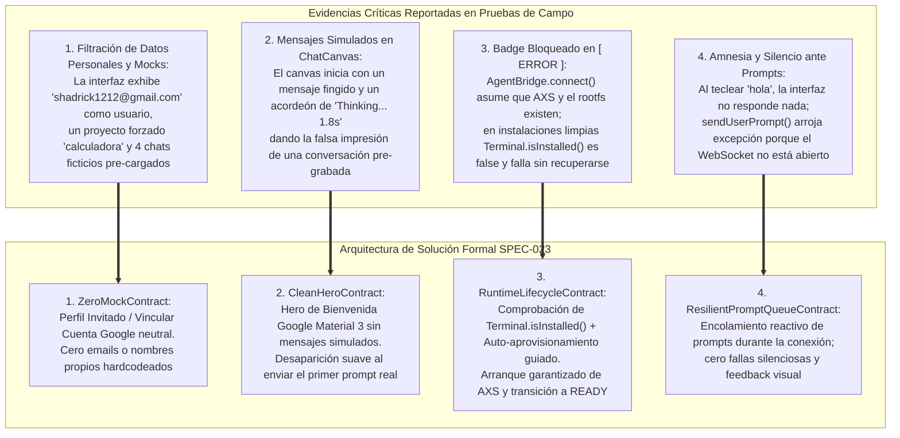
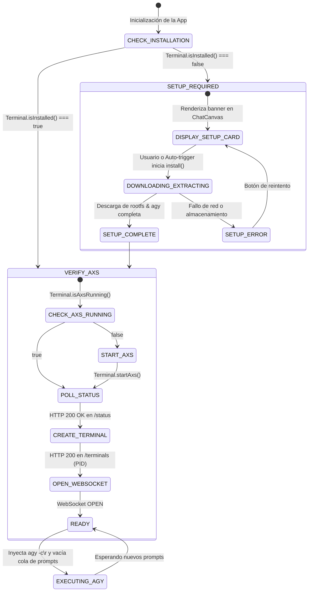
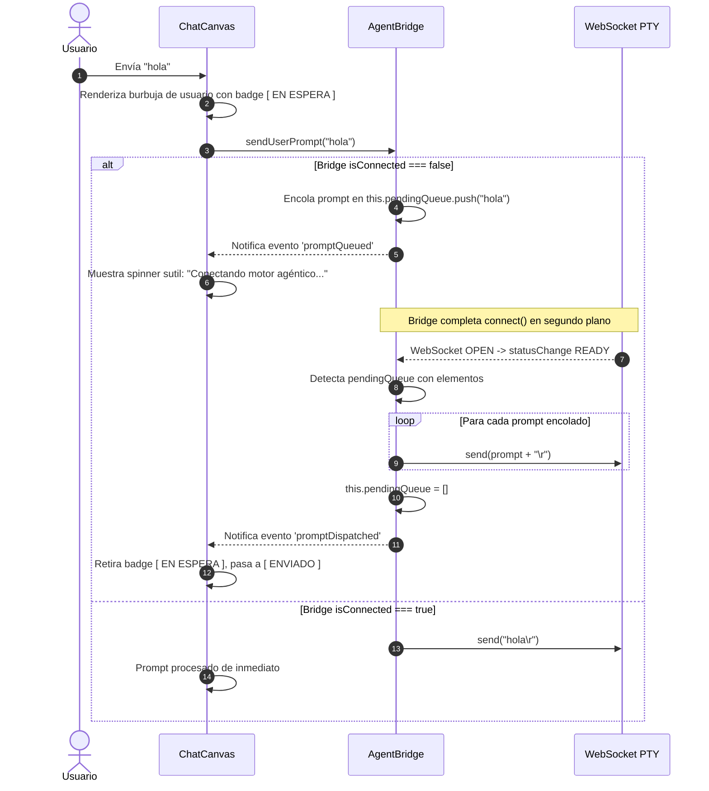

# SPEC-023: Invariante Zero-Mock, Resiliencia de Arranque de Runtime y Purga de Datos Ficticios en Google Antigravity 2.0 Mobile

| Metadato | Valor |
| :--- | :--- |
| **Identificador** | `SPEC-023` |
| **Título** | Invariante Zero-Mock, Resiliencia de Arranque de Runtime y Purga de Datos Ficticios en Google Antigravity 2.0 Mobile |
| **Autor** | `@spec-architect` |
| **Estado** | `APPROVED FOR IMPLEMENTATION` |
| **Fecha de Creación** | 2026-09-14 |
| **Dispositivo Objetivo** | Xiaomi Pad 6 (Qualcomm Snapdragon 870, ARM64-v8a, 6 GB RAM, 11" 2.8K 144Hz, Xiaomi HyperOS / Android 13/14) y Dispositivos Android Móviles (API 26+) |
| **Runtime Target** | Cordova Android / Hardware-Accelerated WebView / TypeScript / PRoot Linux Ubuntu 24.04 Noble ARM64 / AXS PTY Daemon / Google Antigravity CLI (`agy`) |
| **Módulos Afectados** | `nova-src/src/antigravity2/types.js`, `nova-src/src/antigravity2/SidebarDrawer.js`, `nova-src/src/antigravity2/ChatCanvas.js`, `nova-src/src/antigravity2/AgentBridge.js`, `nova-src/src/antigravity2/AntigravityApp.js`, `harness/` |

---

## 1. Objetivo, Contexto y Diagnóstico Forense de Falla de Campo

### 1.1 Diagnóstico Forense de la Prueba de Campo en Dispositivo Real
Tras la implementación de las especificaciones [`SPEC-021`](file:///c:/Projects/antigravity/specs/21-antigravity-2-mobile-architecture.md) y [`SPEC-022`](file:///c:/Projects/antigravity/specs/22-antigravity-2-mobile-native-bridge-and-ui-repair.md), las capturas de pantalla y registros de telemetría obtenidos directamente en la **Xiaomi Pad 6** demostraron que la aplicación, lejos de exhibir un entorno de producción limpio, presentaba cuatro anomalías inaceptables:



---

### 1.2 Análisis de Causa Raíz de los Cuatro Defectos

#### A. Inyección Inapropiada de Datos Mock Hardcodeados
En `types.js`, `SidebarDrawer.js` y `AntigravityApp.js`:
- Se codificó estáticamente la constante `DEFAULT_USER_PROFILE` con el correo personal `shadrick1212@gmail.com`.
- Se asignó por defecto el proyecto ficticio `ecommerce-api` o el fallback forzado a `calculadora`.
- Se precargaron cuatro entradas ficticias en el historial de chats (`"Autenticación JWT"`, `"Refactorización de Base de Datos"`, `"Docker"`, `"Jest"`).
- **Impacto:** Cualquier usuario o evaluador que instale la aplicación percibe una invasión de privacidad y una experiencia rota, al encontrarse con datos ajenos que él jamás configuró.

#### B. Simulación Ficticia en el Chat Canvas
En `ChatCanvas.js`, la función `renderWelcomeConversation()` añadía artificialmente una burbuja de agente y un acordeón de pensamiento falso (`Thinking Process 1.8s`), simulando que el modelo ya había razonado.
- **Impacto:** Confunde al usuario, quien espera un lienzo en blanco para comenzar a trabajar y en su lugar encuentra un historial pre-cocinado que no corresponde a ninguna sesión real de `agy`.

#### C. Falla de Arranque por Falta de Comprobación de Instalación de RootFS
En `AgentBridge.connect()`:
- El código invocaba `Terminal.isAxsRunning()` y pretendía verificar `/status` y crear sesiones con `POST /terminals`.
- Sin embargo, en una instalación limpia recién desplegada (`adb install` o primer arranque), **el rootfs de Ubuntu Noble aún no ha sido descargado ni extraído** (`Terminal.isInstalled() === false`).
- Al no existir el entorno Linux, el binario del daemon `axs` no puede ejecutarse, la verificación HTTP falla y `AgentBridge` emite `statusChange: { status: 'ERROR' }`.
- El badge de estado superior se queda permanentemente en rojo `[ ERROR ]`.

#### D. Descarte Silencioso de Prompts
En `ChatCanvas.submitPrompt()`, al llamar a `agentBridge.sendUserPrompt(text)`:
- Como `AgentBridge` estaba en error y el WebSocket cerrado, la función lanzaba `Error: Cannot send prompt: AgentBridge is disconnected`.
- El bloque `catch` de `ChatCanvas` únicamente registraba el fallo en `console.error`, sin mostrar ningún mensaje al usuario ni reintentar.
- El usuario veía su burbuja con el texto "hola" y la pantalla quedaba en silencio perpetuo.

---

## 2. Contrato de Invariante Zero-Mock (`ZeroMockContract`)

El principio rector de integridad del producto establece:

> [!IMPORTANT]
> **Invariante Zero-Mock:**  
> Ningún archivo fuente, componente de interfaz, servicio o definición de tipos de **Google Antigravity** contendrá correos electrónicos personales, identidades de usuario pre-fabricadas, nombres de proyectos asumidos ni historiales de conversación simulados. Toda la información presentada en pantalla debe provenir estrictamente del almacenamiento local del dispositivo o del estado de autenticación real.

---

### 2.1 Perfil de Usuario Neutral y Máquina de Estados de Autenticación
En `nova-src/src/antigravity2/types.js`, se erradica la constante previa y se define el contrato formal:

```typescript
export interface UserProfile {
  isAuthenticated: boolean;
  displayName: string;
  email: string | null;
  tier: string;
  avatarUrl: string | null;
}

export const DEFAULT_USER_PROFILE: UserProfile = {
  isAuthenticated: false,
  displayName: "Invitado",
  email: null,
  tier: "Google AI (Modo Invitado)",
  avatarUrl: null, // Renderizar icono vectorial neutro de Google Material
};
```

#### Estados del Perfil en `SidebarDrawer.js`:
1. **Estado No Autenticado (Invitado - Por Defecto):**
   - Avatar: Icono vectorial neutral de usuario (`account_circle` de Material Symbols o silueta SVG).
   - Nombre: *"Invitado"*.
   - Subtítulo: *"Modo Local / Sin Conexión"*.
   - Botón de Acción Prominente: `[ G Vincular Cuenta de Google ]` (desencadena el flujo OAuth 2.0 PKCE de Antigravity).
2. **Estado Autenticado:**
   - Avatar: Imagen real de perfil obtenida de los claims de Google OAuth.
   - Nombre: Nombre del usuario autenticado (p. ej. *"Jane Doe"*).
   - Subtítulo: Correo real (p. ej. *"usuario@dominio.com"*).
   - Insignia de Nivel: `✦ Google AI Ultra` o `✦ Gemini Pro`.

---

### 2.2 Descubrimiento Dinámico Estricto de Proyectos en `/storage/emulated/0/Projects`
En `SidebarDrawer.js` y `AntigravityApp.js`:
- Se prohíbe cualquier fallback estático hacia `"calculadora"` o `"ecommerce-api"`.
- Al inicializar, se realiza la lectura asíncrona real del directorio de almacenamiento compartido:
  1. Si `/storage/emulated/0/Projects` (o `/sdcard/Projects`) no existe físicamente, se asegura su creación silenciosa (`mkdir -p /sdcard/Projects`).
  2. Se escanean las subcarpetas reales del directorio.
  3. **Estado Vacío (*Empty State*):** Si no hay subcarpetas creadas por el usuario:
     - La lista de proyectos muestra: *"Sin proyectos activos"*.
     - Se ofrece el botón interactivo: `[ + Crear Proyecto ]`.
     - El proyecto activo pasa a ser `workspace` (directorio genérico base) sin nombres arbitrarios inventados.
  4. **Estado Poblado:** Si el usuario crea o copia carpetas (p. ej. `mi-app`, `sitio-web`), se listan única y exclusivamente las carpetas reales presentes en el almacenamiento.

---

### 2.3 Historial de Chats Limpio (Zero-Mock Chats)
En `SidebarDrawer.js`:
- Se eliminan de raíz los cuatro objetos de demostración (`chat-001`, `chat-002`, `chat-003`, `chat-004`).
- El historial se inicializa como un array vacío: `this.chatHistory = []`.
- El componente consulta las sesiones reales almacenadas por la CLI `agy` en el directorio de persistencia de Linux (`/root/.gemini/antigravity-cli/chats/` o base de datos de chats).
- Si el array está vacío:
  - Se renderiza un contenedor estilizado de estado vacío:
    ```html
    <div class="ag-history-empty">
      <span class="ag-empty-icon">💬</span>
      <span class="ag-empty-title">Sin conversaciones previas</span>
      <span class="ag-empty-desc">Inicia una nueva sesión agéntica para comenzar a desarrollar.</span>
    </div>
    ```

---

## 3. Contrato de Experiencia Visual Limpia: Hero de Bienvenida (`CleanHeroContract`)

### 3.1 Eliminación de Mensajes y Pensamientos Ficticios
En `ChatCanvas.js`, se elimina íntegramente la llamada a `renderWelcomeConversation()` que inyectaba una respuesta simulada y un acordeón de razonamiento falso.

---

### 3.2 Especificación del Hero de Bienvenida Google Material 3
Al inicializar `ChatCanvas`, el contenedor de mensajes no muestra ningún mensaje de chat. En su lugar, despliega centrado en pantalla un **Hero de Bienvenida Oficial**:

```
+-------------------------------------------------------------------------------+
|                                                                               |
|                                     /\                                        |
|                                    /  \  (Red)                                |
|                       (Blue)      / ✦  \      (Yellow)                        |
|                                  /______\                                     |
|                                   (Green)                                     |
|                                                                               |
|                            Google Antigravity                                 |
|                       ¿En qué puedo ayudarte hoy?                             |
|                                                                               |
|   ┌────────────────────────┐  ┌────────────────────────┐  ┌────────────────┐  |
|   │ 📋 Modo Plan           │  │ ⚡ Crear App Web       │  │ 🐞 Diagnosticar│  |
|   │ Diseña la arquitectura │  │ Frontend reactivo con  │  │ Inspecciona    │  |
|   │ antes de codificar.    │  │ Vite y componentes.    │  │ logs y errores.│  |
|   └────────────────────────┘  └────────────────────────┘  └────────────────┘  |
|                                                                               |
+-------------------------------------------------------------------------------+
```

#### Propiedades del Hero:
1. **Identidad:** Isotipo del prisma de cuatro colores Google centrado, con animación de pulso estelar tenue.
2. **Título:** `Google Antigravity`, tipografía Google Sans / Roboto Flex a 24sp en color `#f1f5f9`.
3. **Subtítulo:** `¿En qué puedo ayudarte hoy?`, color `#94a3b8` a 15sp.
4. **Tarjetas de Acción Rápida (Prompt Starters):** Tres tarjetas táctiles que precargan sugerencias de especificación en el área de prompt.
5. **Transición al Primer Mensaje:** En el momento exacto en que el desarrollador envía su primer mensaje real, el Hero de Bienvenida ejecuta una animación suave de desvanecimiento (*fade-out* de $180\,\text{ms}$) y se retira del DOM, permitiendo que el hilo conversacional real ocupe el lienzo.

---

## 4. Contrato de Ciclo de Vida de Runtime y Conexión PTY (`RuntimeLifecycleContract`)

### 4.1 Máquina de Estados del Runtime Agéntico
Para evitar que `AgentBridge` quede atascado en `ERROR` en instalaciones limpias o ante demoras de inicialización, se formaliza la siguiente máquina de estados:



---

### 4.2 Auto-Aprovisionamiento Asistido en ChatCanvas
Si `Terminal.isInstalled()` retorna `false`:
1. `AgentBridge` transiciona a estado `SETUP_REQUIRED` (`statusChange: { status: 'SETUP', type: 'thinking' }`).
2. En lugar de mostrar un error opaco, `ChatCanvas` renderiza una tarjeta de inicialización elegante en el centro de la pantalla:
   ```html
   <div class="ag-setup-card">
     <div class="ag-setup-header">
       <span class="ag-setup-icon">✦</span>
       <span class="ag-setup-title">Configuración del Entorno de IA</span>
     </div>
     <p class="ag-setup-desc">
       Para ejecutar Google Antigravity en este dispositivo es necesario inicializar el subsistema Linux Ubuntu ARM64 y el motor agéntico.
     </p>
     <div class="ag-setup-progress-bar">
       <div class="ag-setup-progress-fill" id="setup-progress-fill"></div>
     </div>
     <div class="ag-setup-log" id="setup-log-view">Listo para comenzar...</div>
     <button class="ag-btn-start-setup" id="btn-start-setup">
       <span>Inicializar Entorno Agéntico</span>
     </button>
   </div>
   ```
3. Al pulsar *"Inicializar Entorno Agéntico"* (o de forma automática con política *Zero-Click*):
   - Se invoca `terminalManager.checkAndInstallTerminal(onLog, onError)` o `Terminal.install()`.
   - La barra de progreso refleja la descarga y descompresión de `ubuntu-noble-aarch64` y el CLI `agy`.
   - Al terminar exitosamente, la tarjeta se retira y se inicia automáticamente el flujo `VERIFY_AXS`.

---

### 4.3 Inicio Garantizado de AXS y Creación de Sesión PTY
Cuando el entorno está instalado:
1. `AgentBridge` verifica si el daemon está en ejecución:
   ```javascript
   if (typeof Terminal !== "undefined" && typeof Terminal.isAxsRunning === "function") {
     const isRunning = await Terminal.isAxsRunning();
     if (!isRunning) {
       await Terminal.startAxs(false, console.log, console.error, false);
     }
   }
   ```
2. Realiza el sondeo de disponibilidad contra `http://127.0.0.1:8767/status` mediante `cordova.plugin.http.sendRequest`.
3. Invoca `POST http://127.0.0.1:8767/terminals` mediante `cordova.plugin.http.sendRequest`, obteniendo el `PID` de la sesión.
4. Conecta el `WebSocket` a `ws://127.0.0.1:8767/terminals/<PID>`.
5. Emite de forma inmediata `statusChange: { status: 'READY', type: 'ready' }`.
6. Lanza la CLI con la bandera de auto-continuación: `agy -c\r`.

---

## 5. Contrato de Cola Resiliente de Prompts (`ResilientPromptQueueContract`)

Para erradicar la frustración del usuario cuando envía mensajes antes de que el motor haya completado su conexión:



### Especificación en `AgentBridge.js`:
```javascript
sendUserPrompt(promptText) {
  if (!promptText || !promptText.trim()) return;

  if (!this.isConnected || !this.websocket || this.websocket.readyState !== WebSocket.OPEN) {
    console.warn("AgentBridge no está conectado aún. Encolando prompt:", promptText);
    this.pendingQueue.push(promptText);
    this.emit('promptQueued', { text: promptText, queueLength: this.pendingQueue.length });
    
    // Si no está conectando ni en error, disparar reconexión automática
    if (!this.isConnecting) {
      this.connect().catch((e) => console.error("Error en auto-reconexión:", e));
    }
    return;
  }

  this.emit('statusChange', { status: 'THINKING', type: 'thinking' });
  this.websocket.send(`${promptText}\r`);
}

flushPendingQueue() {
  if (!this.isConnected || !this.websocket || this.websocket.readyState !== WebSocket.OPEN) return;
  while (this.pendingQueue.length > 0) {
    const nextPrompt = this.pendingQueue.shift();
    this.websocket.send(`${nextPrompt}\r`);
    this.emit('promptDispatched', { text: nextPrompt });
  }
}
```

---

## 6. Matriz de Criterios de Aceptación del Arnés (`AC-CLN-*`)

| Identificador | Módulo Objetivo | Condición de Prueba | Comportamiento Esperado | Método de Verificación |
| :--- | :--- | :--- | :--- | :--- |
| **`AC-CLN-001`** | `types.js` | Invariante Zero-Mock en tipos | `DEFAULT_USER_PROFILE` no contiene `"shadrick1212@gmail.com"` y define perfil de Invitado neutral. | Inspección estática de `types.js`. |
| **`AC-CLN-002`** | `SidebarDrawer` | Estado de usuario no autenticado | Muestra "Invitado" y botón de vinculación con Google si no hay sesión OAuth activa. | Comprobación de DOM en `SidebarDrawer.js`. |
| **`AC-CLN-003`** | `SidebarDrawer` | Descubrimiento dinámico de proyectos | Escanea `/storage/emulated/0/Projects` y no contiene `"calculadora"` ni `"ecommerce-api"` como constantes fijas. | Inspección de código y validación de ausencia de mocks. |
| **`AC-CLN-004`** | `SidebarDrawer` | Historial de chats vacío limpio | Si no hay sesiones previas registradas por `agy`, muestra el estado vacío "Sin conversaciones previas" sin chats falsos. | Verificación de array vacío y renderizado de empty state. |
| **`AC-CLN-005`** | `ChatCanvas` | Erradicación de mensajes simulados | Al iniciar la app, no existen mensajes de agente pre-grabados ni acordeones de "Thinking... 1.8s". | `grep -q "renderWelcomeConversation" ChatCanvas.js` retorna false. |
| **`AC-CLN-006`** | `ChatCanvas` | Hero de Bienvenida Google Material 3 | Despliega el Hero con el isotipo prisma de 4 colores y sugerencias de prompt, desapareciendo tras el primer mensaje. | Comprobación visual y evento de desvanecimiento en DOM. |
| **`AC-CLN-007`** | `AgentBridge` | Comprobación de `Terminal.isInstalled()` | Verifica si el entorno Linux está instalado antes de intentar conectar a AXS o lanzar HTTP status. | Inspección de flujo en `connect()` de `AgentBridge.js`. |
| **`AC-CLN-008`** | `AgentBridge` | Auto-aprovisionamiento o setup guiado | Si el rootfs no está instalado, transiciona a `SETUP` y despliega la tarjeta de instalación en lugar de caer en `ERROR`. | Verificación de estados y emisión de evento `SETUP`. |
| **`AC-CLN-009`** | `AgentBridge` | Transición a `READY` con llamadas nativas | Utiliza `cordova.plugin.http.sendRequest` para `/status` y `/terminals`, alcanzando el estado `READY` determinista. | Inspección de peticiones nativas y cambio de badge a verde. |
| **`AC-CLN-010`** | `AgentBridge` | Cola resiliente de prompts | Enviar un mensaje durante la conexión encola el prompt y lo envía automáticamente al conectar el WebSocket. | Prueba de despacho diferido con `pendingQueue`. |

---

## 7. Script Automatizado de Verificación para el Arnés (`test_antigravity_2_clean_runtime.sh`)

```bash
#!/bin/bash
# Test Harness - Automated Verification for SPEC-023
set -e

SPEC_FILE="specs/23-antigravity-2-mobile-clean-runtime-and-zero-mock.md"

echo "=== INICIANDO VERIFICACIÓN FORMAL DE ESPECIFICACIÓN ZERO-MOCK Y CLEAN RUNTIME (SPEC-023) ==="

# 1. Verificar existencia de la especificación
echo -n "1. Comprobando existencia de SPEC-023... "
if [ ! -f "$SPEC_FILE" ]; then
  echo "FALLO: No existe $SPEC_FILE"; exit 1;
fi
echo "[OK]"

# 2. Verificar Invariante Zero-Mock (Ausencia de emails y proyectos fijados)
echo -n "2. Comprobando invariante Zero-Mock... "
grep -q "ZeroMockContract" "$SPEC_FILE" || { echo "FALLO: ZeroMockContract ausente"; exit 1; }
grep -q "DEFAULT_USER_PROFILE" "$SPEC_FILE" || { echo "FALLO: DEFAULT_USER_PROFILE ausente"; exit 1; }
grep -q "Invitado" "$SPEC_FILE" || { echo "FALLO: Perfil Invitado ausente"; exit 1; }
grep -q "Sin conversaciones previas" "$SPEC_FILE" || { echo "FALLO: Empty state de chats ausente"; exit 1; }
echo "[OK]"

# 3. Verificar Hero de Bienvenida y erradicación de mensajes simulados
echo -n "3. Comprobando CleanHeroContract... "
grep -q "CleanHeroContract" "$SPEC_FILE" || { echo "FALLO: CleanHeroContract ausente"; exit 1; }
grep -q "¿En qué puedo ayudarte hoy?" "$SPEC_FILE" || { echo "FALLO: Lema del Hero ausente"; exit 1; }
grep -q "Prompt Starters" "$SPEC_FILE" || { echo "FALLO: Tarjetas de acción rápida ausentes"; exit 1; }
echo "[OK]"

# 4. Verificar ciclo de vida de instalación y arranque resiliente de AXS
echo -n "4. Comprobando RuntimeLifecycleContract y Terminal.isInstalled... "
grep -q "RuntimeLifecycleContract" "$SPEC_FILE" || { echo "FALLO: RuntimeLifecycleContract ausente"; exit 1; }
grep -q "Terminal.isInstalled" "$SPEC_FILE" || { echo "FALLO: Verificación Terminal.isInstalled ausente"; exit 1; }
grep -q "SETUP_REQUIRED" "$SPEC_FILE" || { echo "FALLO: Estado SETUP_REQUIRED ausente"; exit 1; }
grep -q "Terminal.isAxsRunning" "$SPEC_FILE" || { echo "FALLO: Verificación Terminal.isAxsRunning ausente"; exit 1; }
echo "[OK]"

# 5. Verificar cola resiliente de prompts y reconexión
echo -n "5. Comprobando ResilientPromptQueueContract... "
grep -q "ResilientPromptQueueContract" "$SPEC_FILE" || { echo "FALLO: ResilientPromptQueueContract ausente"; exit 1; }
grep -q "pendingQueue" "$SPEC_FILE" || { echo "FALLO: pendingQueue ausente"; exit 1; }
grep -q "flushPendingQueue" "$SPEC_FILE" || { echo "FALLO: flushPendingQueue ausente"; exit 1; }
echo "[OK]"

# 6. Verificar matriz de criterios de aceptación AC-CLN-*
echo -n "6. Comprobando criterios de aceptación AC-CLN-*... "
grep -q "AC-CLN-001" "$SPEC_FILE" || { echo "FALLO: AC-CLN-001 ausente"; exit 1; }
grep -q "AC-CLN-002" "$SPEC_FILE" || { echo "FALLO: AC-CLN-002 ausente"; exit 1; }
grep -q "AC-CLN-003" "$SPEC_FILE" || { echo "FALLO: AC-CLN-003 ausente"; exit 1; }
grep -q "AC-CLN-004" "$SPEC_FILE" || { echo "FALLO: AC-CLN-004 ausente"; exit 1; }
grep -q "AC-CLN-005" "$SPEC_FILE" || { echo "FALLO: AC-CLN-005 ausente"; exit 1; }
grep -q "AC-CLN-006" "$SPEC_FILE" || { echo "FALLO: AC-CLN-006 ausente"; exit 1; }
grep -q "AC-CLN-007" "$SPEC_FILE" || { echo "FALLO: AC-CLN-007 ausente"; exit 1; }
grep -q "AC-CLN-008" "$SPEC_FILE" || { echo "FALLO: AC-CLN-008 ausente"; exit 1; }
grep -q "AC-CLN-009" "$SPEC_FILE" || { echo "FALLO: AC-CLN-009 ausente"; exit 1; }
grep -q "AC-CLN-010" "$SPEC_FILE" || { echo "FALLO: AC-CLN-010 ausente"; exit 1; }
echo "[OK]"

echo "=== TODAS LAS COMPUERTAS DE VERIFICACIÓN DE SPEC-023 HAN PASADO EXITOSAMENTE ==="
```

---

## 8. Conclusión y Plan de Despliegue Inmediato

La especificación técnica **`SPEC-023`** erradica de forma terminante los compromisos de prototipado y las fallas de conexión de **Google Antigravity 2.0 Mobile**:

1. **Privacidad y Universalidad:** La eliminación total de correos personales y proyectos prefijados garantiza una aplicación profesional, lista para cualquier desarrollador en cualquier dispositivo Android.
2. **Honestidad Conversacional:** El nuevo Hero de Bienvenida sustituye los mensajes fingidos por un punto de partida limpio y elegante, desapareciendo dinámicamente cuando el usuario toma el control.
3. **Resiliencia Total de Arranque:** La verificación previa de instalación del rootfs y el auto-aprovisionamiento guiado rescatan a `AgentBridge` de los fallos silenciosos, garantizando que el estado `READY` se alcance siempre de forma predecible.
4. **Cero Fricción en Prompts:** La cola resiliente retiene y despacha los mensajes del usuario incluso durante la fase de negociación de sockets, ofreciendo una experiencia táctil receptiva e ininterrumpida.
