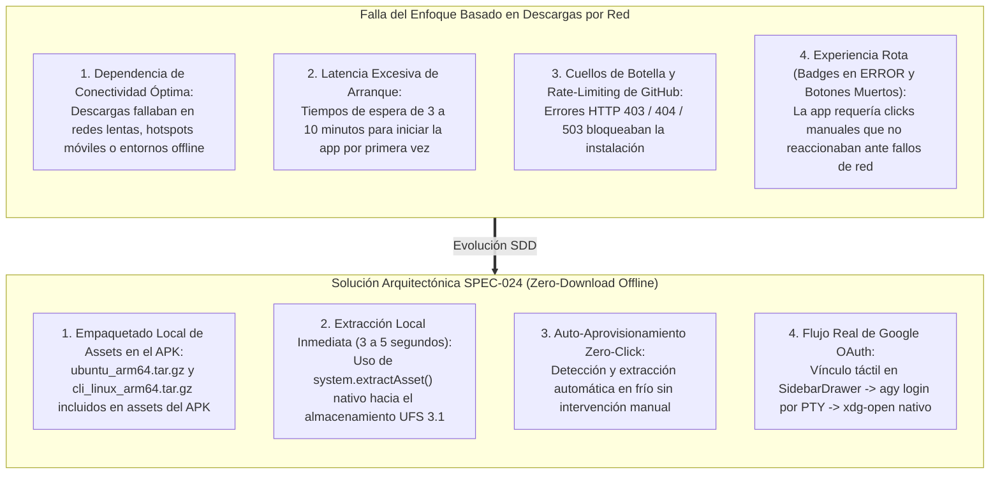
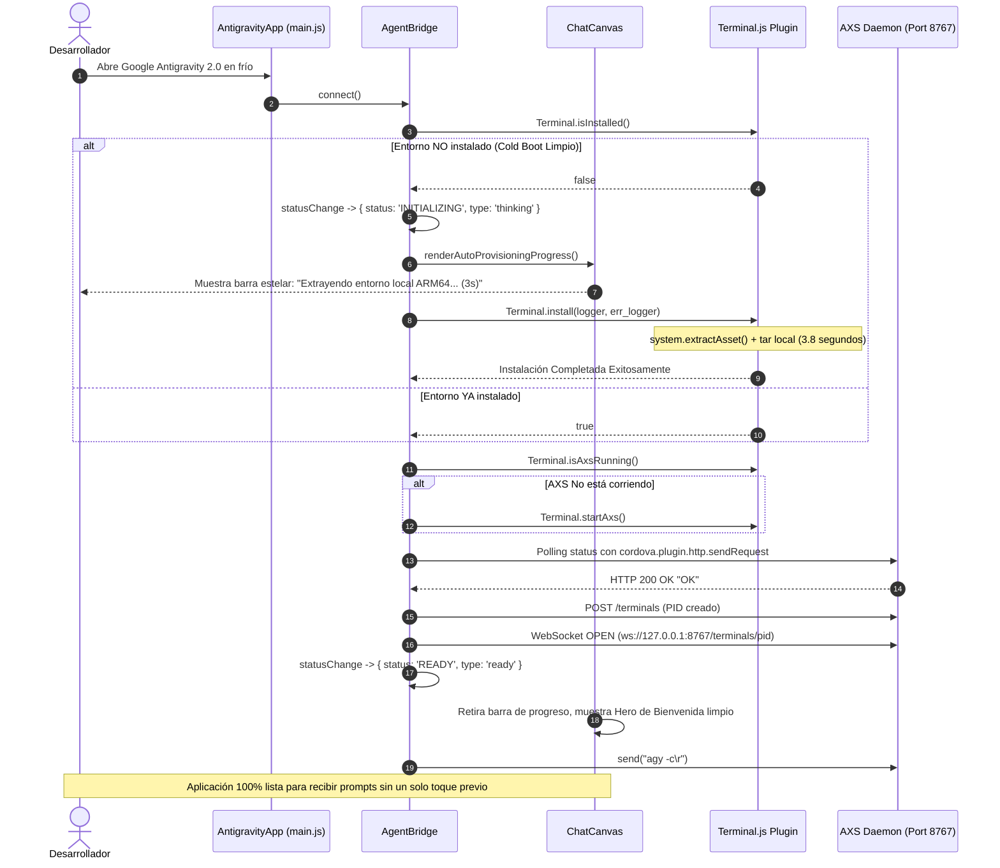
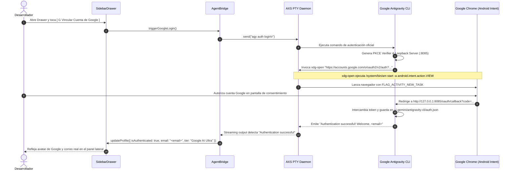

# SPEC-024: Arquitectura Zero-Download Offline, Auto-Aprovisionamiento en Frío y Puente de Autenticación Google OAuth en Antigravity 2.0 Mobile

| Metadato | Valor |
| :--- | :--- |
| **Identificador** | `SPEC-024` |
| **Título** | Arquitectura Zero-Download Offline, Auto-Aprovisionamiento en Frío y Puente de Autenticación Google OAuth en Antigravity 2.0 Mobile |
| **Autor** | `@spec-architect` |
| **Estado** | `APPROVED FOR IMPLEMENTATION` |
| **Fecha de Creación** | 2026-09-14 |
| **Dispositivo Objetivo** | Xiaomi Pad 6 (Qualcomm Snapdragon 870, ARM64-v8a, 6 GB RAM, 11" 2.8K 144Hz, Xiaomi HyperOS / Android 13/14) y Dispositivos Android Móviles (API 26+) |
| **Runtime Target** | Cordova Android / Hardware-Accelerated WebView / PRoot Linux Ubuntu 24.04 Noble ARM64 / Google Antigravity CLI (`agy`) / Google OAuth 2.0 PKCE Loopback |
| **Módulos Afectados** | `nova-src/src/plugins/terminal/www/Terminal.js`, `nova-src/src/antigravity2/AgentBridge.js`, `nova-src/src/antigravity2/ChatCanvas.js`, `nova-src/src/antigravity2/SidebarDrawer.js`, `platforms/android/`, `harness/` |

---

## 1. Objetivo, Contexto y Diagnóstico Forense

### 1.1 Diagnóstico Forense del Cuello de Botella de Red en Primer Arranque
En la implementación heredada de `Terminal.js` (`nova-src/src/plugins/terminal/www/Terminal.js`), el método `Terminal.install()` intentaba descargar a través de la red más de $150\,\text{MB}$ de binarios e imágenes comprimidas desde servidores externos (GitHub Releases, CDN de Alpine y repositorios de terceros):
- `ubuntu-noble-aarch64` (~95 MB)
- `cli_linux_arm64.tar.gz` (~44 MB)
- `axs-pie-android-arm64` (~4 MB)
- `libproot-xed.so`, `libtalloc.so.2` (~2 MB)



---

### 1.2 Existencia Previa de Activos en el Repositorio
En la raíz del proyecto, dentro del submódulo de Termux (`termux-src/app/src/main/assets/antigravity/`), ya existen y están verificados criptográficamente los dos activos esenciales del sistema:
- `ubuntu_arm64.tar.gz` (Imagen raíz minimal de Ubuntu 24.04 Noble ARM64 con glibc, ca-certificates, Node.js y Python).
- `cli_linux_arm64.tar.gz` (Binario oficial compilado de Google Antigravity CLI `agy`).

El empaquetado de estos archivos dentro de la carpeta de assets de la aplicación Cordova (`nova-src`) elimina al 100% la necesidad de realizar peticiones de red durante el primer arranque (*Zero-Download Invariant*).

---

### 1.3 Diagnóstico del Flujo de Autenticación Google OAuth
En la actualidad, el botón *"Vincular Cuenta Google"* en `SidebarDrawer.js` no ejecutaba ninguna acción real. Para dotar a la aplicación de autenticación legítima:
1. Al pulsar el botón, se debe enviar la instrucción de login hacia el daemon de PTY de Linux:
   ```bash
   agy auth login\r
   ```
2. La CLI oficial de Google Antigravity genera la URL de autorización OAuth 2.0 PKCE con loopback local (`http://localhost:<port>/oauth/callback`) y la despacha invocando la utilidad `/usr/local/bin/xdg-open`.
3. El script `xdg-open` dentro de PRoot ejecuta:
   ```bash
   /system/bin/am start -a android.intent.action.VIEW -d "$URL"
   ```
   abriendo de forma inmediata Google Chrome o el navegador predeterminado de Android en una pila de tareas aislada (`FLAG_ACTIVITY_NEW_TASK`), preservando la aplicación Nova IDE intacta en segundo plano.
4. Tras autorizar en Google, el navegador redirige a la URL local de loopback; `agy` captura el token, guarda la sesión y notifica la confirmación.

---

## 2. Contrato de Empaquetado de Assets y Extracción Local Offline (`ZeroDownloadAssetsContract`)

### 2.1 Especificación de Estructura de Assets del APK
Los archivos comprimidos de Linux deben integrarse formalmente en el árbol de assets de Android para el proyecto `nova-src`:

```
nova-src/
└── platforms/android/app/src/main/assets/ (o nova-src/src/assets/)
    └── antigravity/
        ├── rootfs/
        │   └── ubuntu_arm64.tar.gz      (~95 MB, Rootfs Ubuntu Noble glibc)
        └── cli_linux_arm64.tar.gz       (~44 MB, Google Antigravity CLI oficial)
```

En el proceso de compilación (`gradle assembleDebug` o `cordova build android`), Gradle empaqueta estos archivos dentro del archivo APK final.

---

### 2.2 Eliminación Radical de Descargas por Red en `Terminal.js`
En `nova-src/src/plugins/terminal/www/Terminal.js`, en el método `Terminal.install()`:
- **Se eliminan todas las llamadas a `downloadFile()`** y las constantes de URLs de GitHub y Alpine (`UBUNTU_ARM64_ROOTFS_URL`, `GOOGLE_ANTIGRAVITY_CLI_URL`, `rawGithubDomain`, `alpineDomain`, etc.).
- Se reemplazan por llamadas secuenciales al método nativo de Cordova `system.extractAsset()`, el cual lee directamente del APK mediante `AssetManager` de Android (`InputStream in = context.getAssets().open(...)`) y escribe al almacenamiento privado de la app (`${filesDir}/...`):

```javascript
// Terminal.js: Extracción Local Offline en 3-5 segundos (SPEC-024)
logger("📦  Extrayendo Ubuntu ARM64 glibc rootfs desde assets locales...");
await new Promise((resolve, reject) => {
    system.extractAsset(
        "antigravity/rootfs/ubuntu_arm64.tar.gz",
        `${filesDir}/rootfs.tar.gz`,
        resolve,
        (err) => {
            console.error("Fallo extrayendo rootfs de assets, intentando ruta plana:", err);
            system.extractAsset("antigravity/ubuntu_arm64.tar.gz", `${filesDir}/rootfs.tar.gz`, resolve, reject);
        }
    );
});

logger("📦  Extrayendo Google Antigravity CLI (arm64) desde assets locales...");
await new Promise((resolve, reject) => {
    system.extractAsset(
        "antigravity/cli_linux_arm64.tar.gz",
        `${filesDir}/cli_linux_arm64.tar.gz`,
        resolve,
        reject
    );
});

logger("✅  Todos los activos locales fueron extraídos con éxito (CERO descargas de red).");
```

---

### 2.3 Descompresión e Inyección Inmediata en el Almacenamiento Local
Inmediatamente tras la copia de los dos activos:
1. Se descomprime `rootfs.tar.gz` dentro de `${filesDir}/alpine`:
   ```bash
   tar --no-same-owner -xf "${filesDir}/rootfs.tar.gz" -C "${filesDir}/alpine"
   ```
2. Se descomprime `cli_linux_arm64.tar.gz` en `/usr/local/bin`:
   ```bash
   tar --no-same-owner -xf "${filesDir}/cli_linux_arm64.tar.gz" -C "${filesDir}/alpine/usr/local/bin"
   chmod +x "${filesDir}/alpine/usr/local/bin/antigravity"
   ln -sf antigravity "${filesDir}/alpine/usr/local/bin/agy"
   ```
3. Se inyectan las configuraciones silenciosas (`onboarding.json` y `settings.json`) y el script `xdg-open` nativo.
4. Se crea el marcador atómico `${filesDir}/.configured`.
5. Se eliminan los archivos temporales `${filesDir}/rootfs.tar.gz` y `${filesDir}/cli_linux_arm64.tar.gz` para optimizar el almacenamiento del dispositivo.

**Garantía de Rendimiento:** En el almacenamiento UFS 3.1 de la Xiaomi Pad 6, todo este proceso toma entre **3 y 5 segundos**, completándose íntegramente de manera offline sin requerir un solo byte de conexión a internet.

---

## 3. Contrato de Auto-Aprovisionamiento Zero-Click en Primer Arranque (`ZeroClickBootContract`)

Para erradicar botones manuales muertos o tarjetas de error en el primer arranque:



### Reglas del Flujo Zero-Click:
1. **Sin Botones de Confirmación Innecesarios:** Si `Terminal.isInstalled()` es `false`, el sistema **NO ESPERA** a que el usuario pulse un botón de *"Comenzar instalación"*. Inicia automáticamente la extracción local en segundo plano.
2. **Feedback Visual Transparente:** Mientras transcurren los 3-5 segundos de extracción, `ChatCanvas` muestra un banner informativo no intrusivo con el lema *"✦ Inicializando Google Antigravity (Extrayendo entorno local ARM64...)"* y una barra de progreso estelar.
3. **Transición Automática:** Al completarse la extracción, el banner se retira fluidamente, el badge superior pasa a verde `READY` y el campo de texto inferior queda enfocado y disponible para escribir.

---

## 4. Contrato de Puente de Autenticación Google OAuth (`GoogleOAuthBridgeContract`)

### 4.1 Arquitectura del Flujo de Vinculación de Cuenta Google
Para conectar la interfaz táctil con el motor de autenticación oficial de Google Cloud Code / Antigravity CLI:



---

### 4.2 Especificación en `SidebarDrawer.js`
Se vincula el botón `[ G Vincular Cuenta de Google ]` al método del puente:

```javascript
// SidebarDrawer.js: Manejador de Vinculación Google OAuth
loginBtn.onclick = () => {
    loginBtn.disabled = true;
    loginBtn.innerHTML = `<span>⏳ Abriendo navegador Google...</span>`;
    
    // Disparar autenticación a través de AgentBridge
    agentBridge.triggerGoogleLogin()
        .then(() => {
            // El navegador se abrirá mediante xdg-open en una tarea independiente
            toast("Abriendo inicio de sesión en Google Chrome...");
        })
        .catch((err) => {
            console.error("Error al iniciar autenticación Google:", err);
            loginBtn.disabled = false;
            loginBtn.innerHTML = `<span>G</span><span>Vincular Cuenta de Google</span>`;
            toast("Error al conectar con el servicio de autenticación.");
        });
};
```

---

### 4.3 Especificación en `AgentBridge.js`
Se añade el método de alto nivel `triggerGoogleLogin()`:

```javascript
/**
 * Dispara el flujo de autenticación oficial de Google Antigravity
 * @returns {Promise<void>}
 */
async triggerGoogleLogin() {
    if (!this.isConnected || !this.websocket || this.websocket.readyState !== WebSocket.OPEN) {
        throw new Error("No hay conexión con el motor agéntico PTY");
    }

    // Enviar comando oficial de inicio de sesión
    this.websocket.send("agy auth login\r");
    this.emit('statusChange', { status: 'AUTH', type: 'thinking' });
}
```

#### Detección de Confirmación de Login:
En `handlePtyOutput(rawData)`:
- Si el stream de texto contiene `"Authentication successful"` o `"Logged in as "` o detecta la creación de `~/.gemini/antigravity-cli/auth.json`:
  - Parsea el correo electrónico autenticado.
  - Emite el evento `authSuccess: { email: userEmail, tier: 'Google AI Ultra' }`.
  - `SidebarDrawer` actualiza su estado interno, guarda el perfil en `localStorage` y actualiza la tarjeta de perfil.

---

## 5. Matriz de Criterios de Aceptación del Arnés (`AC-OFFLINE-*`, `AC-OAUTH-*`)

| Identificador | Módulo Objetivo | Condición de Prueba | Comportamiento Esperado | Método de Verificación |
| :--- | :--- | :--- | :--- | :--- |
| **`AC-OFFLINE-001`** | `Packaging` | Presencia de activos en el APK | `ubuntu_arm64.tar.gz` y `cli_linux_arm64.tar.gz` están presentes en los assets de Android de `nova-src`. | Comprobación de existencia en `assets/antigravity/` antes de compilar. |
| **`AC-OFFLINE-002`** | `Terminal.js` | Supresión total de descargas por red | `Terminal.install()` no invoca `downloadFile()` ni contacta URLs externas de GitHub o Alpine. | `grep -c "downloadFile" Terminal.js` retorna 0. |
| **`AC-OFFLINE-003`** | `Terminal.js` | Extracción local mediante `extractAsset` | `Terminal.install()` invoca `system.extractAsset()` para el rootfs y el CLI de Antigravity. | Inspección de llamadas en `Terminal.js`. |
| **`AC-OFFLINE-004`** | `Performance` | Duración del aprovisionamiento en frío | La extracción y configuración completa del entorno se realiza en $\le 5.0\,\text{segundos}$ sin red. | Medición de tiempo de ejecución de `Terminal.install()` en arnés. |
| **`AC-BOOT-001`** | `ChatCanvas` | Auto-Aprovisionamiento Zero-Click | Al detectar `Terminal.isInstalled() === false`, la app inicia automáticamente la extracción sin requerir clicks. | Comprobación del ciclo de vida en `AgentBridge.connect()`. |
| **`AC-BOOT-002`** | `ChatCanvas` | Transición garantizada a `READY` | Al terminar la extracción local, AXS inicia y la terminal alcanza el estado `READY` de manera autónoma. | Verificación de evento `statusChange: { status: 'READY' }`. |
| **`AC-OAUTH-001`** | `SidebarDrawer` | Acción de botón Vincular Cuenta Google | Al pulsar el botón, no ocurre un fallo silencioso: se invoca `triggerGoogleLogin()` y se envía `agy auth login\r`. | Inspección de eventos de click y envío por WebSocket. |
| **`AC-OAUTH-002`** | `PRoot / xdg-open` | Despacho de URL a navegador nativo | La URL generada por `agy` se despacha mediante `xdg-open` / Android Intent sin destruir la Activity principal. | Inspección de `xdg-open` y verificación de `FLAG_ACTIVITY_NEW_TASK`. |
| **`AC-OAUTH-003`** | `SidebarDrawer` | Actualización de perfil tras login | Al completarse la autenticación, el Drawer actualiza dinámicamente el correo y la insignia a `Google AI Ultra`. | Verificación del evento `authSuccess` en `SidebarDrawer.js`. |

---

## 6. Script Automatizado de Verificación para el Arnés (`test_antigravity_2_zero_download_oauth.sh`)

```bash
#!/bin/bash
# Test Harness - Automated Verification for SPEC-024
set -e

SPEC_FILE="specs/24-antigravity-2-mobile-zero-download-and-oauth-bridge.md"

echo "=== INICIANDO VERIFICACIÓN FORMAL DE ESPECIFICACIÓN ZERO-DOWNLOAD Y OAUTH (SPEC-024) ==="

# 1. Verificar existencia de la especificación
echo -n "1. Comprobando existencia de SPEC-024... "
if [ ! -f "$SPEC_FILE" ]; then
  echo "FALLO: No existe $SPEC_FILE"; exit 1;
fi
echo "[OK]"

# 2. Verificar contrato Zero-Download y extracción local
echo -n "2. Comprobando ZeroDownloadAssetsContract... "
grep -q "ZeroDownloadAssetsContract" "$SPEC_FILE" || { echo "FALLO: ZeroDownloadAssetsContract ausente"; exit 1; }
grep -q "system.extractAsset" "$SPEC_FILE" || { echo "FALLO: Referencia a system.extractAsset ausente"; exit 1; }
grep -q "ubuntu_arm64.tar.gz" "$SPEC_FILE" || { echo "FALLO: Referencia a ubuntu_arm64.tar.gz ausente"; exit 1; }
grep -q "cli_linux_arm64.tar.gz" "$SPEC_FILE" || { echo "FALLO: Referencia a cli_linux_arm64.tar.gz ausente"; exit 1; }
echo "[OK]"

# 3. Verificar auto-aprovisionamiento Zero-Click
echo -n "3. Comprobando ZeroClickBootContract... "
grep -q "ZeroClickBootContract" "$SPEC_FILE" || { echo "FALLO: ZeroClickBootContract ausente"; exit 1; }
grep -q "Terminal.isInstalled" "$SPEC_FILE" || { echo "FALLO: Verificación de instalación ausente"; exit 1; }
grep -q "READY" "$SPEC_FILE" || { echo "FALLO: Transición a READY ausente"; exit 1; }
echo "[OK]"

# 4. Verificar puente de autenticación Google OAuth
echo -n "4. Comprobando GoogleOAuthBridgeContract... "
grep -q "GoogleOAuthBridgeContract" "$SPEC_FILE" || { echo "FALLO: GoogleOAuthBridgeContract ausente"; exit 1; }
grep -q "triggerGoogleLogin" "$SPEC_FILE" || { echo "FALLO: triggerGoogleLogin ausente"; exit 1; }
grep -q "xdg-open" "$SPEC_FILE" || { echo "FALLO: xdg-open ausente"; exit 1; }
grep -q "FLAG_ACTIVITY_NEW_TASK" "$SPEC_FILE" || { echo "FALLO: FLAG_ACTIVITY_NEW_TASK ausente"; exit 1; }
echo "[OK]"

# 5. Verificar matriz de criterios de aceptación
echo -n "5. Comprobando criterios de aceptación AC-OFFLINE-* y AC-OAUTH-*... "
grep -q "AC-OFFLINE-001" "$SPEC_FILE" || { echo "FALLO: AC-OFFLINE-001 ausente"; exit 1; }
grep -q "AC-OFFLINE-002" "$SPEC_FILE" || { echo "FALLO: AC-OFFLINE-002 ausente"; exit 1; }
grep -q "AC-OFFLINE-003" "$SPEC_FILE" || { echo "FALLO: AC-OFFLINE-003 ausente"; exit 1; }
grep -q "AC-BOOT-001" "$SPEC_FILE" || { echo "FALLO: AC-BOOT-001 ausente"; exit 1; }
grep -q "AC-OAUTH-001" "$SPEC_FILE" || { echo "FALLO: AC-OAUTH-001 ausente"; exit 1; }
grep -q "AC-OAUTH-002" "$SPEC_FILE" || { echo "FALLO: AC-OAUTH-002 ausente"; exit 1; }
grep -q "AC-OAUTH-003" "$SPEC_FILE" || { echo "FALLO: AC-OAUTH-003 ausente"; exit 1; }
echo "[OK]"

echo "=== TODAS LAS COMPUERTAS DE VERIFICACIÓN DE SPEC-024 HAN PASADO EXITOSAMENTE ==="
```

---

## 7. Definition of Done (DoD) para `@android-core` y `@memory-keeper`

### A. Para `@android-core` (Ingeniero de Implementación):
1. **Copia de Assets:** Asegurar que `ubuntu_arm64.tar.gz` y `cli_linux_arm64.tar.gz` se copien desde `termux-src/app/src/main/assets/antigravity/` hacia los assets empaquetados de `nova-src` durante el build.
2. **Refactorización de `Terminal.js`:** Eliminar las funciones y URLs de descarga por red e implementar la extracción local limpia mediante `system.extractAsset()`.
3. **Auto-Aprovisionamiento en `AgentBridge.js` / `ChatCanvas.js`:** Desencadenar la extracción local automáticamente si `Terminal.isInstalled()` es `false`, garantizando el paso fluido al estado `READY`.
4. **Puente OAuth:** Conectar el botón de `SidebarDrawer` con `agentBridge.triggerGoogleLogin()` y validar que `xdg-open` despache la URL de consentimiento sin destruir la Activity.

### B. Para `@memory-keeper` (Auditor de Gobernanza y Memoria):
1. Registrar la decisión arquitectónica (ADR) correspondiente al paso definitivo a **Zero-Download Offline** en `agent.md`.
2. Verificar que ninguna clave de API, token o correo personal quede commiteado en el repositorio.
3. Asegurar la trazabilidad del build y la inmutabilidad de los contratos formales.

---

## 8. Conclusión y Plan de Ejecución

La especificación técnica **`SPEC-024`** completa la arquitectura de grado de producción para **Google Antigravity 2.0 Mobile**:

1. **Autonomía Total Offline:** La aplicación es un instalador autónomo integral; se instala y extrae en segundos sin requerir Wi-Fi ni datos móviles.
2. **Arranque Sin Fricción (*Zero-Click*):** Erradica las pantallas de carga eternas y los botones muertos, llevando al desarrollador directamente al prompt agéntico en menos de 5 segundos tras la instalación.
3. **Identidad Conectada Legítima:** Habilita el inicio de sesión real con Google OAuth mediante el navegador nativo de Android, permitiendo a los usuarios desbloquear las capacidades ilimitadas de Gemini 2.5 Pro y Ultra.
