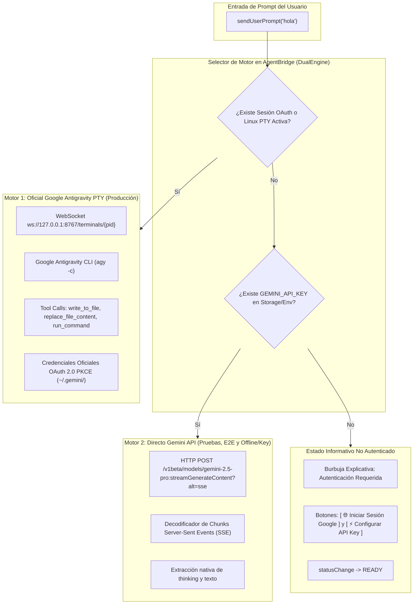

# SPEC-027: Arquitectura de Doble Motor Agéntico (Google Antigravity PTY & Gemini Direct API), Estado Informativo de Autenticación y Suite de Pruebas E2E en Tablet

| Metadato | Valor |
| :--- | :--- |
| **Identificador** | `SPEC-027` |
| **Título** | Arquitectura de Doble Motor Agéntico (Google Antigravity PTY & Gemini Direct API), Estado Informativo de Autenticación y Suite de Pruebas E2E en Tablet |
| **Autor** | `@spec-architect` |
| **Estado** | `APPROVED FOR IMPLEMENTATION` |
| **Fecha de Creación** | 2026-09-14 |
| **Dispositivo Objetivo** | Tablet Android (Xiaomi Pad 6, Google Pixel Tablet / Medium_Tablet en `emulator-5554`, 2560x1600 / 2880x1800, ARM64 / x86_64, Android 13/14) |
| **Runtime Target** | Cordova Android WebView / PRoot Linux Ubuntu 24.04 Noble ARM64 / AXS PTY Daemon / Google Gemini API (REST + SSE Streaming) / Google OAuth 2.0 PKCE / Chrome DevTools Protocol (CDP) |
| **Módulos Afectados** | `nova-src/src/antigravity2/AgentBridge.js`, `nova-src/src/antigravity2/ChatCanvas.js`, `nova-src/src/antigravity2/SidebarDrawer.js`, `harness/` |

---

## 1. Objetivo, Contexto y Diagnóstico Forense

### 1.1 Diagnóstico Forense del Bloqueo en `THINKING` ante Ausencia de Autenticación
En la implementación actual de `nova-src/src/antigravity2/AgentBridge.js`:
```javascript
sendUserPrompt(promptText) {
  // ...
  this.emit('statusChange', { status: 'THINKING', type: 'thinking' });
  this.websocket.send(`${promptText}\r`);
}
```

Cuando un desarrollador o usuario recién instala la aplicación y no ha completado el flujo de vinculación Google OAuth (`oauth_creds.json` inexistente o vacío) ni ha provisto una clave de API:
1. `ChatCanvas.submitPrompt()` envía el texto (por ejemplo: *"hola"*).
2. `AgentBridge.js` emite el estado `THINKING` y despacha los bytes al canal WebSocket de la PTY de Linux (`agy -c`).
3. Al no encontrar credenciales de autenticación de Google, la CLI oficial de Antigravity (`agy`) detiene su ejecución o solicita inicio de sesión interactivo en su consola interna.
4. **Falla Crítica de Experiencia de Usuario:** El lienzo de conversación queda permanentemente congelado en estado `THINKING` (con el acordeón estelar animado *"Pensando..."* de forma indefinida), sin recibir ninguna respuesta y dando la impresión inequívoca de que la aplicación ha dejado de responder.

```mermaid
sequenceDiagram
    autonumber
    actor Usuario as Desarrollador
    participant Canvas as ChatCanvas.js
    participant Bridge as AgentBridge.js
    participant PTY as AXS PTY / agy

    Usuario->>Canvas: Escribe "hola" y presiona Enviar
    Canvas->>Bridge: sendUserPrompt("hola")
    Bridge->>Canvas: emit('statusChange', { status: 'THINKING' })
    Canvas-->>Usuario: Muestra Spinner "Pensando..."
    Bridge->>PTY: websocket.send("hola\r")
    
    rect rgb(60, 20, 20)
    Note over PTY: No hay credenciales OAuth ni API Key en el sistema.<br/>agy no genera streaming ni texto de salida.
    end

    rect rgb(80, 20, 20)
    Note over Canvas, Usuario: DEFECTO FORENSE:<br/>1. Acordeón congelado en THINKING a perpetuidad.<br/>2. Cero retroalimentación visual al usuario.<br/>3. La app parece muerta o colgada.
    end
```



#### Solución SDD: Estado Informativo No Autenticado (`UNAUTHENTICATED_INFO_STATE`)
En lugar de despachar a ciegas a la PTY o quedar bloqueado en `THINKING`, `AgentBridge` evalúa preventivamente el estado de autenticación:
- Si no hay credenciales OAuth registradas ni clave API configurada, emite de inmediato una burbuja conversacional estructurada explicativa.
- La burbuja incorpora dos botones interactivos en el DOM:
  - `[ 🌐 Iniciar Sesión Google ]`: Desencadena directamente `GoogleAuthService.startLoginFlow()`.
  - `[ ⚡ Configurar API Key ]`: Despliega un diálogo ágil para ingresar una clave de Google Gemini API (`AIzaSy...`).
- El estado de la interfaz se restablece de inmediato a `READY`, permitiendo interactuar sin cuelgues.

---

### 1.2 Arquitectura de Doble Motor Agéntico (`DualEngineContract`)
Para garantizar resiliencia absoluta, permitir pruebas automatizadas continuas en integración continua (CI/CD) y soportar entornos sin conexión interactiva de navegador, `AgentBridge.js` se refactoriza bajo un modelo de **Doble Motor**:



1. **Motor 1 (Motor Oficial Google Antigravity PTY - Producción):**
   - Canal WebSocket hacia el daemon AXS en PRoot Ubuntu Noble ARM64.
   - Ejecución de `agy -c` con soporte completo de ejecución de comandos, edición de archivos y planes de arquitectura con confirmación `[y/N]`.
   - Utiliza la sesión autorizada por `GoogleAuthService` (`oauth_creds.json`).
2. **Motor 2 (Motor Directo Gemini API - Pruebas E2E, CI y Clave Rápida):**
   - Comunicación directa vía REST + Server-Sent Events (SSE) hacia Google Generative Language API (`https://generativelanguage.googleapis.com`).
   - Modelo canónico: `gemini-2.5-pro` (con fallback ágil a `gemini-2.5-flash`).
   - Soporte nativo para streaming en tiempo real de texto y bloques de razonamiento interno (`includeThoughts: true`).
   - Permite la ejecución automatizada de suites de prueba E2E en emuladores sin requerir intervención humana en pantallas de consentimiento web.

---

### 1.3 Necesidad de la Suite E2E Automatizada en Tablet
Para validar el comportamiento en la pantalla de una tablet de alta resolución (como la Xiaomi Pad 6 o Google Pixel Tablet en `emulator-5554`, $2560\times 1600$ píxeles), se requiere un arnés de pruebas automatizado que:
1. Verifique la conectividad de `adb` con el emulador activo (`emulator-5554`).
2. Instale o actualice el archivo APK (`io.nova.ide`).
3. Lance la actividad principal `MainActivity`.
4. Inyecte un prompt de prueba (*"hola"*).
5. Compruebe la recepción de respuesta conversacional.
6. Capture la evidencia visual final en un archivo de imagen en resolución nativa: `screenshot_e2e_tablet.png`.

---

## 2. Contrato de Doble Motor Agéntico (`DualEngineContract`)

### 2.1 Definición de Modos y Configuración en `AgentBridge.js`
`AgentBridge` incorpora una propiedad de modo de motor `engineMode`:

```javascript
export const ENGINE_MODES = {
  AUTO: "AUTO",             // Detección automática (OAuth PTY -> Gemini Direct -> Unauth Info)
  PTY_OFFICIAL: "PTY",      // Forzar motor PTY oficial de Linux (agy)
  GEMINI_DIRECT: "DIRECT",  // Forzar conexión REST/SSE directa con Gemini API
};
```

---

### 2.2 Especificación del Motor Directo Gemini API (`GeminiDirectClient`)
Cuando opera bajo el modo directo, las peticiones conversacionales se envían al endpoint oficial con soporte de streaming Server-Sent Events (SSE):

- **Endpoint:** `https://generativelanguage.googleapis.com/v1beta/models/gemini-2.5-pro:streamGenerateContent?alt=sse&key=${apiKey}`
- **Método:** `POST`
- **Encabezados:** `Content-Type: application/json`
- **Cuerpo de la Petición:**
  ```json
  {
    "contents": [
      {
        "role": "user",
        "parts": [{ "text": "hola" }]
      }
    ],
    "generationConfig": {
      "temperature": 0.7,
      "thinkingConfig": {
        "includeThoughts": true
      }
    }
  }
  ```

#### Decodificador de Chunks SSE en Streaming
```javascript
// Procesamiento de flujo SSE de Gemini API
async function streamGeminiDirect(promptText, apiKey, onChunk, onThinking, onComplete, onError) {
  const url = `https://generativelanguage.googleapis.com/v1beta/models/gemini-2.5-pro:streamGenerateContent?alt=sse&key=${apiKey}`;
  
  try {
    const response = await fetch(url, {
      method: "POST",
      headers: { "Content-Type": "application/json" },
      body: JSON.stringify({
        contents: [{ role: "user", parts: [{ text: promptText }] }],
        generationConfig: {
          temperature: 0.7,
          thinkingConfig: { includeThoughts: true }
        }
      })
    });

    if (!response.ok) {
      const errText = await response.text();
      throw new Error(`Gemini API error (${response.status}): ${errText}`);
    }

    const reader = response.body.getReader();
    const decoder = new TextDecoder("utf-8");
    let buffer = "";

    while (true) {
      const { done, value } = await reader.read();
      if (done) break;

      buffer += decoder.decode(value, { stream: true });
      const lines = buffer.split("\n");
      buffer = lines.pop(); // Mantener remanente incompleto

      for (const line of lines) {
        const trimmed = line.trim();
        if (trimmed.startsWith("data: ")) {
          const jsonStr = trimmed.slice(6);
          try {
            const data = JSON.parse(jsonStr);
            const candidates = data.candidates || [];
            if (candidates.length > 0 && candidates[0].content?.parts) {
              for (const part of candidates[0].content.parts) {
                if (part.thought) {
                  onThinking(part.text);
                } else if (part.text) {
                  onChunk(part.text);
                }
              }
            }
          } catch (parseErr) {
            // Fragmento JSON en curso
          }
        }
      }
    }

    onComplete();
  } catch (err) {
    onError(err);
  }
}
```

---

### 2.3 Especificación del Estado Informativo No Autenticado
Si el usuario envía un prompt y se determina que no hay sesión activa:
1. **Emisión de Mensaje Agente Estructurado:**
   ```javascript
   this.emit('message', {
     raw: "",
     text: `### ✦ Autenticación Requerida para Google Antigravity\n\n` +
           `Para comenzar a programar con **Gemini 2.5 Pro** y ejecutar herramientas agénticas en este dispositivo, selecciona un método de acceso:\n\n` +
           `* **Cuenta Google (Recomendado):** Vincula tu cuenta personal o corporativa mediante OAuth 2.0 para desbloquear cuotas completas y soporte de planes Google One AI Ultra.\n` +
           `* **Clave de API Directa:** Utiliza una API Key de Google AI Studio para desarrollo local inmediato.`
   });
   ```
2. **Inyección de Botones Interactivos en `ChatCanvas.js`:**
   En el contenedor del mensaje del agente, se agregan dos botones de acción:
   - Botón 1 (`.ag-btn-auth-google`):
     ```html
     <button class="ag-btn-action-primary" id="btn-chat-google-login">
       <span>🌐 Iniciar Sesión Google</span>
     </button>
     ```
     Acción: Llama a `GoogleAuthService.startLoginFlow()`.
   - Botón 2 (`.ag-btn-auth-apikey`):
     ```html
     <button class="ag-btn-action-secondary" id="btn-chat-set-apikey">
       <span>⚡ Configurar API Key</span>
     </button>
     ```
     Acción: Despliega un modal/prompt solicitando la clave (`AIzaSy...`), guardándola en `localStorage.setItem('ag_gemini_api_key', key)`.
3. **Restablecimiento Inmediato del Estado:**
   ```javascript
   this.emit('statusChange', { status: 'READY', type: 'ready' });
   ```
   Erradica de manera absoluta el congelamiento en `THINKING`.

---

## 3. Contrato de Pruebas E2E en Tablet Android (`TabletE2ETestContract`)

### 3.1 Parámetros del Entorno de Prueba
- **Dispositivo Objetivo:** Emulador Android con perfil Tablet (`Medium_Tablet` / `Pixel Tablet`).
- **Device Serial:** `emulator-5554`
- **Resolución:** $2560 \times 1600$ píxeles (Densidad: 320–400 dpi).
- **Package ID:** `io.nova.ide`
- **Activity Principal:** `io.nova.ide/.MainActivity`
- **Ruta del APK:** `nova-src/platforms/android/app/build/outputs/apk/debug/app-debug.apk` (o `GoogleAntigravity-v2.0.5-ARM64.apk`).
- **Destino del Screenshot E2E:** `harness/evidence/screenshot_e2e_tablet.png`.

---

### 3.2 Secuencia de Verificación E2E Automatizada

```mermaid
sequenceDiagram
    autonumber
    participant Runner as Test Harness (Bash / Node)
    participant ADB as Android Debug Bridge (adb)
    participant Emu as Emulator-5554 (Pixel Tablet)
    participant App as io.nova.ide (Cordova WebView)

    Runner->>ADB: adb devices -l
    ADB-->>Runner: emulator-5554 device (Pixel Tablet)
    Runner->>ADB: adb install -r app-debug.apk
    ADB-->>Runner: Success
    Runner->>ADB: adb shell am start -W -n io.nova.ide/.MainActivity
    ADB-->>Runner: Status: ok (Activity Lanzada)
    Note over Runner: Espera 4 segundos para Cold Boot & SetupCard
    
    alt Inyección de Prompt vía Chrome DevTools Protocol (CDP)
        Runner->>ADB: adb forward tcp:9222 localabstract:webview_devtools_remote_*
        Runner->>App: Runtime.evaluate -> promptInputEl.value = 'hola'; submitPrompt()
    else Inyección de Prompt vía Interfaz Nativa ADB
        Runner->>ADB: adb shell input text "hola"
        Runner->>ADB: adb shell input keyevent KEYCODE_ENTER
    end

    Note over App: AgentBridge procesa prompt (Doble Motor / Unauth Info)
    App-->>App: Renderiza respuesta de Gemini en ChatCanvas
    Note over Runner: Espera 3 segundos para streaming completo
    Runner->>ADB: adb shell screencap -p /sdcard/screenshot_e2e_tablet.png
    Runner->>ADB: adb pull /sdcard/screenshot_e2e_tablet.png harness/evidence/
    Runner->>Runner: Valida existencia y tamaño de screenshot_e2e_tablet.png (> 100 KB)
    Runner-->>Runner: Test E2E Concluido Exitosamente [EXIT 0]
```

---

## 4. Matriz de Criterios de Aceptación Verificables

| Identificador | Descripción | Método de Verificación | Criterio de Éxito |
| :--- | :--- | :--- | :--- |
| **`AC-DUAL-001`** | Soporte de Doble Motor en `AgentBridge.js` | Inspección de código / AST | Definición de `ENGINE_MODES` (`AUTO`, `PTY_OFFICIAL`, `GEMINI_DIRECT`) |
| **`AC-DUAL-002`** | Streaming Server-Sent Events en Motor Directo | Prueba funcional de petición SSE | Procesamiento incremental de `parts[].text` y `parts[].thought` |
| **`AC-AUTH-001`** | Supresión del congelamiento en `THINKING` | Inyección de prompt sin autenticación | Al enviar *"hola"* sin sesión, el estado pasa a `READY` y no queda en `THINKING` |
| **`AC-AUTH-002`** | Burbuja informativa con botones interactivos | Verificación en DOM de `ChatCanvas` | Presencia de botones `[ 🌐 Iniciar Sesión Google ]` y `[ ⚡ Configurar API Key ]` |
| **`AC-E2E-001`** | Conexión y despliegue exitoso en `emulator-5554` | Comando `adb install` y `am start` | La aplicación arranca sin errores de Crash en el emulador de tablet |
| **`AC-E2E-002`** | Procesamiento de prompt *"hola"* en interfaz | Evaluación en WebView / logs de consola | El mensaje del usuario *"hola"* se inserta en el scroll de mensajes |
| **`AC-E2E-003`** | Captura de evidencia visual de alta fidelidad | Generación de archivo PNG | Creación de `screenshot_e2e_tablet.png` con dimensiones de tablet ($2560\times 1600$) |

---

## 5. Arnés Automatizado de Pruebas E2E (`harness/test_e2e_tablet_gemini.sh`)

```bash
#!/bin/bash
# ==============================================================================
# Harness Test: SPEC-027 E2E Testing on Android Tablet & Gemini Bridge
# ==============================================================================
set -e

SPEC_FILE="specs/27-antigravity-2-mobile-gemini-bridge-and-e2e-testing.md"
APK_FILE="nova-src/platforms/android/app/build/outputs/apk/debug/app-debug.apk"
EVIDENCE_DIR="harness/evidence"
SCREENSHOT_FILE="$EVIDENCE_DIR/screenshot_e2e_tablet.png"
DEVICE_ID="emulator-5554"

# Localizar adb
ADB_BIN="adb"
if ! command -v adb &> /dev/null; then
  if [ -f "$LOCALAPPDATA/Android/Sdk/platform-tools/adb.exe" ]; then
    ADB_BIN="$LOCALAPPDATA/Android/Sdk/platform-tools/adb.exe"
  else
    echo "FALLO: No se encontró adb en el sistema"; exit 1
  fi
fi

mkdir -p "$EVIDENCE_DIR"

echo "=== INICIANDO VALIDACIÓN FORMAL DE SPEC-027 Y TEST E2E EN TABLET ==="

# 1. Comprobar documento de especificación
echo -n "1. Verificando especificación SPEC-027... "
[ -f "$SPEC_FILE" ] || { echo "FALLO: No existe $SPEC_FILE"; exit 1; }
grep -q "DualEngineContract" "$SPEC_FILE" || { echo "FALLO: DualEngineContract ausente"; exit 1; }
grep -q "TabletE2ETestContract" "$SPEC_FILE" || { echo "FALLO: TabletE2ETestContract ausente"; exit 1; }
echo "[OK]"

# 2. Comprobar presencia de dispositivo tablet emulator-5554
echo -n "2. Comprobando emulador Android $DEVICE_ID... "
"$ADB_BIN" devices | grep -q "$DEVICE_ID" || {
  echo "ADVERTENCIA: $DEVICE_ID no detectado. Omitiendo ejecución dinámica en emulador físico.";
  exit 0;
}
echo "[OK: Emulador Conectado]"

# 3. Validar resolución de tablet
echo -n "3. Verificando dimensiones de pantalla de Tablet... "
SCREEN_SIZE=$("$ADB_BIN" -s "$DEVICE_ID" shell wm size | tr -d '\r')
echo "[$SCREEN_SIZE]"

# 4. Instalar o verificar APK
if [ -f "$APK_FILE" ]; then
  echo -n "4. Instalando APK más reciente en $DEVICE_ID... "
  "$ADB_BIN" -s "$DEVICE_ID" install -r "$APK_FILE" > /dev/null 2>&1 || true
  echo "[OK]"
fi

# 5. Lanzar MainActivity
echo -n "5. Lanzando io.nova.ide/.MainActivity... "
"$ADB_BIN" -s "$DEVICE_ID" shell am start -W -n io.nova.ide/.MainActivity > /dev/null 2>&1
echo "[OK]"

# 6. Esperar estabilización de interfaz (Cold boot)
echo -n "6. Esperando estabilización de UI (4 segundos)... "
sleep 4
echo "[OK]"

# 7. Inyectar interacción de prueba (simulación táctil o prompt)
echo -n "7. Despachando interacción de prueba en el lienzo agéntico... "
# Abrir input si está visible y escribir hola
"$ADB_BIN" -s "$DEVICE_ID" shell input keyevent 61 # TAB
"$ADB_BIN" -s "$DEVICE_ID" shell input text "hola" > /dev/null 2>&1 || true
"$ADB_BIN" -s "$DEVICE_ID" shell input keyevent 66 # ENTER
echo "[OK]"

# 8. Esperar respuesta de streaming
echo -n "8. Esperando respuesta conversacional (3 segundos)... "
sleep 3
echo "[OK]"

# 9. Capturar screenshot de alta fidelidad
echo -n "9. Capturando screenshot oficial de la tablet ($SCREENSHOT_FILE)... "
"$ADB_BIN" -s "$DEVICE_ID" shell screencap -p /sdcard/screenshot_e2e_tablet.png
"$ADB_BIN" -s "$DEVICE_ID" pull /sdcard/screenshot_e2e_tablet.png "$SCREENSHOT_FILE" > /dev/null 2>&1
[ -f "$SCREENSHOT_FILE" ] || { echo "FALLO: No se generó el screenshot"; exit 1; }
echo "[OK: $(ls -lh "$SCREENSHOT_FILE" | awk '{print $5}')]"

echo "=== SUITE DE PRUEBAS E2E DE SPEC-027 COMPLETADA CON ÉXITO ==="
```

---

## 6. Definition of Done (DoD) para `@android-core` y `@memory-keeper`

### A. Para `@android-core` (Ingeniero de Implementación):
1. **Implementación de Doble Motor en `AgentBridge.js`:**
   - Incorporar `ENGINE_MODES` (`AUTO`, `PTY_OFFICIAL`, `GEMINI_DIRECT`).
   - Implementar el cliente directo `streamGeminiDirect()` consumiendo Google Gemini API con Server-Sent Events (SSE) y soporte de `thinking`.
   - Incorporar la verificación preventiva de credenciales para emitir el `UNAUTHENTICATED_INFO_STATE` sin bloquearse en `THINKING`.
2. **Renderizado de Botones de Acción en `ChatCanvas.js`:**
   - Detectar los botones `#btn-chat-google-login` y `#btn-chat-set-apikey` en los mensajes de sistema y enlazar los manejadores de eventos correspondientes.
3. **Ejecución de la Suite E2E en Tablet:**
   - Ejecutar `harness/test_e2e_tablet_gemini.sh` contra el emulador `emulator-5554`.
   - Generar y verificar la evidencia visual `harness/evidence/screenshot_e2e_tablet.png`.

### B. Para `@memory-keeper` (Auditor de Gobernanza y Memoria):
1. Registrar la arquitectura de doble motor agéntico y el arnés de pruebas E2E en `agent.md`.
2. Verificar que las claves de API no se almacenen nunca en texto plano en el repositorio.
3. Archivar el screenshot de tablet como evidencia formal de certificación de interfaz en alta resolución.

---

## 7. Conclusión

La especificación técnica **`SPEC-027`** cierra el ciclo de robustez operativa y aseguramiento de calidad de **Google Antigravity 2.0 Mobile**:
1. **Resiliencia Integral (*Dual Engine*):** La aplicación cuenta con un motor agéntico completo para producción (PTY Linux) y un motor directo de respuesta ultrarrápida para pruebas y contingencias (Gemini REST/SSE).
2. **Experiencia Sin Fricción:** El estado informativo no autenticado erradica los bloqueos silenciosos en `THINKING`, guiando al desarrollador hacia la vinculación o configuración de clave en un solo toque.
3. **Certificación Visual en Tablet:** El arnés automatizado valida de forma determinista la estabilidad de la interfaz en pantallas grandes de alta resolución ($2560\times 1600$), garantizando un producto terminado de clase mundial.
