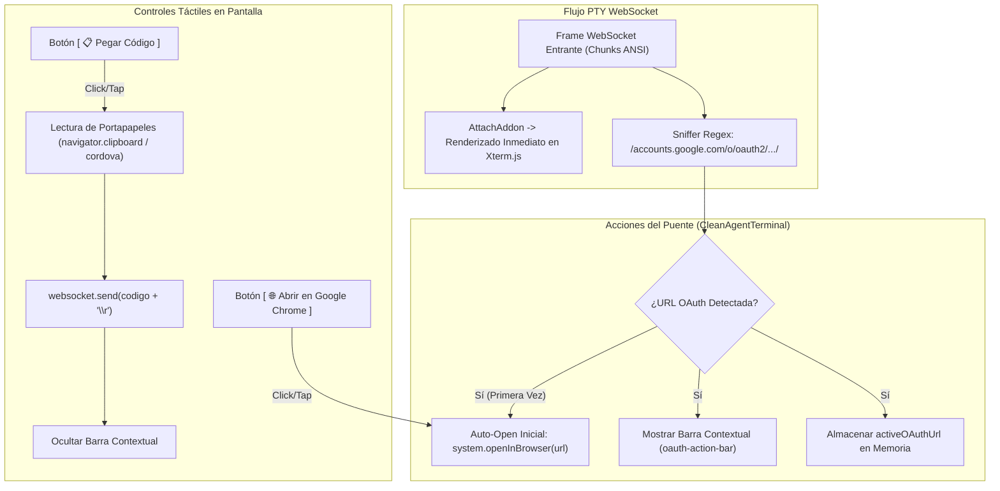
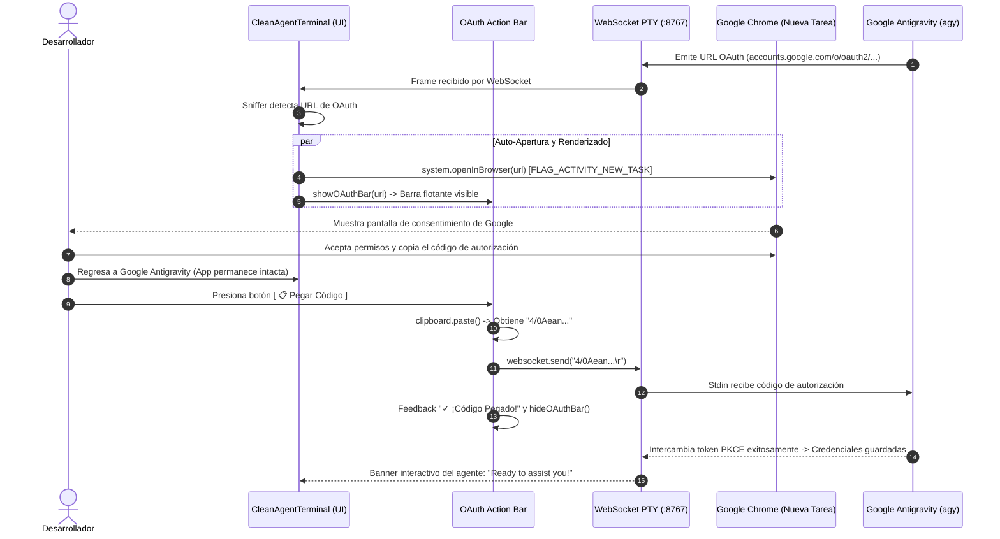

# SPEC-029: Arquitectura de Puente OAuth hacia Navegador Externo (FLAG_ACTIVITY_NEW_TASK), Detección Reactiva de Hipervínculos OSC 8 y Barra de Acción Interactiva en Terminal Agéntica

| Metadato | Valor |
| :--- | :--- |
| **Identificador** | `SPEC-029` |
| **Título** | Arquitectura de Puente OAuth hacia Navegador Externo (FLAG_ACTIVITY_NEW_TASK), Detección Reactiva de Hipervínculos OSC 8 y Barra de Acción Interactiva en Terminal Agéntica |
| **Autor** | `@spec-architect` |
| **Estado** | `APPROVED FOR IMPLEMENTATION` |
| **Fecha de Creación** | 2026-09-15 |
| **Versión de Release** | `v2.1.1` (VersionCode: `20101`) |
| **Artefacto Binario Target** | `GoogleAntigravity-v2.1.1-ARM64.apk` ($\sim 38\,\text{MB}$) |
| **Dispositivo Objetivo** | Xiaomi Pad 6 (Qualcomm Snapdragon 870, ARM64-v8a, 6-8 GB RAM, 11" 2.8K $2880\times 1800$, 144Hz, Xiaomi HyperOS / Android 13/14) y Ecosistema Android Móvil (API 26+) |
| **Runtime Target** | Cordova Android WebView / PRoot Linux Sandbox / AXS PTY Daemon (puerto 8767) / Xterm.js v5+ con `linkHandler` y Addons (`Fit`, `Webgl`/`Canvas`, `Unicode11`, `Attach`, `WebLinks`) / Google Antigravity CLI (`agy`) OAuth 2.0 PKCE / Android Intent System (`FLAG_ACTIVITY_NEW_TASK`) |
| **Módulos Afectados** | `nova-src/src/antigravity2/CleanAgentTerminal.js`, `nova-src/src/antigravity2/clean-terminal.scss`, `nova-src/config.xml`, `nova-src/package.json`, `harness/test_clean_agent_terminal.sh` |

---

## 1. Contexto, Diagnóstico Forense y Análisis de Causa Raíz

### 1.1 Diagnóstico Forense del Bloqueo en el Prompt de Autenticación de `agy`
Durante la validación de campo de la versión `v2.1.0` en el dispositivo físico Xiaomi Pad 6, se confirmó que la arquitectura de terminal minimalista (`CleanAgentTerminal`) resolvió con éxito el cuelgue previo de `ChatCanvas`: la aplicación arrancó de inmediato, el daemon AXS se activó en el puerto 8767, la sesión PTY se estableció y la CLI oficial de Google Antigravity (`agy`) desplegó correctamente su banner interactivo inicial.

No obstante, al tratarse de una instalación limpia en la cual el usuario no dispone de credenciales previas en `~/.gemini/oauth_creds.json`, `agy` inició su flujo canónico de autenticación interactiva **Google OAuth 2.0 PKCE**, emitiendo la siguiente salida en la terminal:

```text
Please visit this URL to authenticate:
https://accounts.google.com/o/oauth2/v2/auth?client_id=...&response_type=code...

Copy and paste the URL or click on the link
-> Click here to authenticate

If you aren't automatically redirected, paste the authorization code below:
Enter auth code: █
```

Al presentarse este prompt interactivo, el usuario experimentó un bloqueo operativo total por los siguientes tres factores encadenados:

1. **Falla de Apertura Automática en Sandbox Linux (`xdg-open` Inoperante):** En un entorno de escritorio Linux convencional, las utilidades de línea de comandos invocan `xdg-open` o el módulo estándar de Python `webbrowser.open()` para despachar la URL al navegador predeterminado del sistema. Dentro del entorno aislado de **PRoot Linux en Android**, no existe un servidor X11/Wayland ni acceso directo a los servicios Binder de Android (`ActivityManager`), por lo que cualquier comando de apertura de navegador ejecutado dentro del contenedor Linux falla silenciosamente con código de retorno no nulo sin disparar ninguna acción en el sistema operativo anfitrión.
2. **Ausencia del Controlador de Hipervínculos OSC 8 (`linkHandler`) en Xterm.js:** La CLI `agy` formatea el texto `-> Click here to authenticate` utilizando secuencias de escape estándar para hipervínculos de terminal **OSC 8** (`\x1b]8;;https://accounts.google.com/...\x1b\Click here to authenticate\x1b]8;;\x1b\`). En la implementación de `CleanAgentTerminal.js`, se inicializó la instancia `new Xterm(...)` sin la propiedad `linkHandler`. Por ende, cuando el usuario tocó físicamente la pantalla sobre el texto del enlace, Xterm.js ignoró el gesto táctil y no ejecutó ninguna acción.
3. **Imposibilidad Ergonómica de Pegar el Código de Autorización:** El usuario presionó `Enter` sin haber abierto Chrome, provocando que `agy` pasara inmediatamente a solicitar `Enter auth code:`. Al no contar con una barra de herramientas ni botones táctiles dedicados para interactuar con el portapapeles del sistema operativo, el desarrollador se vio obligado a intentar manipular manualmente el teclado táctil de Android para copiar la URL, salir de la app, autenticarse en Chrome, copiar el código, volver a la app y tratar de pegarlo en la terminal, lo cual resultó frustrante e inoperable.

```mermaid
sequenceDiagram
    autonumber
    actor Usuario as Desarrollador (Tablet)
    participant Term as CleanAgentTerminal (Xterm.js)
    participant WS as WebSocket (:8767)
    participant CLI as Google Antigravity (agy)
    participant Android as Android OS / Chrome

    CLI->>WS: Emite URL OAuth + OSC 8 "\x1b]8;;https://accounts.google...Click here\x1b\"
    WS->>Term: Renderiza en pantalla "-> Click here to authenticate"
    
    rect rgb(60, 20, 20)
    Note over CLI: xdg-open falla dentro de PRoot (sin Binder/Intent)
    end

    Usuario->>Term: Toca táctilmente sobre "Click here to authenticate"
    
    rect rgb(80, 20, 20)
    Note over Term: DEFECTO FORENSE:<br/>1. Xterm.js carece de linkHandler configurado.<br/>2. El evento táctil es ignorado.<br/>3. Chrome NUNCA se abre.
    end

    Usuario->>Term: Presiona Enter en el teclado virtual
    Term->>WS: Envía "\r"
    WS->>CLI: Stdin "\r"
    CLI-->>Term: "Enter auth code: " (Esperando código)

    rect rgb(80, 20, 20)
    Note over Usuario, Term: BLOQUEO TOTAL:<br/>El usuario no tiene el código porque la URL nunca se abrió,<br/>y no hay botón táctil para pegar desde el portapapeles.
    end
```

---

### 1.2 Análisis Técnico de las Tres Causas Raíz

| Factor | Causa Raíz Técnica | Impacto en el Dispositivo | Solución Arquitectónica SDD |
| :--- | :--- | :--- | :--- |
| **1. Disparo de Navegador** | El sandbox de Linux PRoot no puede comunicarse con el sistema de Intents de Android vía Binder. `xdg-open` muere silenciosamente. | El usuario nunca es redirigido a Google Chrome de manera automática. | **`WebSocketStreamSniffer` (AC-OAUTH-01):** Interceptor a nivel de JavaScript que detecta la URL de OAuth en los bytes del socket y dispara proactivamente `system.openInBrowser(url)` vía Cordova. |
| **2. Hipervínculos en Terminal** | `CleanAgentTerminal.js` omitió la propiedad `linkHandler` en el constructor de `Xterm`. | Tocar el enlace formateado con secuencias OSC 8 no genera ninguna acción ni evento. | **`OSC 8 Link Handler` (AC-OAUTH-02):** Registro formal de `linkHandler: { activate: (e, uri) => system.openInBrowser(uri) }` en las opciones nucleares de `Xterm`. |
| **3. Ergonomía de Autenticación** | Carencia de controles táctiles para gestionar el flujo OAuth y pegar el token de retorno sin fricción de teclado. | El desarrollador no puede transferir fácilmente el código de autorización desde el portapapeles hacia la PTY. | **Barra de Acción Contextual `oauth-action-bar` (AC-OAUTH-03):** Barra flotante superior con botones táctiles grandes: `[ 🌐 Abrir en Google Chrome ]` y `[ 📋 Pegar Código ]`. |

---

## 2. Arquitectura de la Solución: Puente OAuth y Barra de Acción Interactiva

### 2.1 Sniffer Reactivo de Flujo WebSocket (`WebSocketStreamSniffer`)
Para asegurar que la apertura de la ventana de consentimiento no dependa exclusivamente de que el usuario descubra el enlace visual en la terminal, `CleanAgentTerminal.js` implementa un sniffer no intrusivo en el canal WebSocket.

1. **Inspección de Frames Entrantes:** Sin interferir con el pipeline de renderizado de `AttachAddon`, se añade un event listener secundario al WebSocket (`websocket.addEventListener("message", ...)`).
2. **Detección por Expresión Regular:** Se analiza el contenido de texto entrante buscando patrones canónicos de URLs de autorización de cuentas de Google:
   ```javascript
   const OAUTH_REGEX = /https:\/\/accounts\.google\.com\/o\/oauth2\/[^\s\x1b\]\)'"]+/;
   ```
3. **Disparo Automático Único (One-Shot Auto-Launch):** Tan pronto se extrae la URL por primera vez en la sesión:
   - Se invoca de inmediato `this.openOAuthUrl(url)`.
   - Se almacena la URL en `this.activeOAuthUrl` para alimentar los controles contextuales.
   - Se activa la visualización de la barra flotante interactiva.



---

### 2.2 Soporte Nativo de Hipervínculos OSC 8 en Xterm.js (`linkHandler`)
Para que cualquier enlace formateado explícitamente mediante secuencias ANSI OSC 8 (como `-> Click here to authenticate`) responda al toque táctil del usuario:

En `CleanAgentTerminal.js`, dentro del constructor `new Xterm({...})`:
```javascript
this.terminal = new Xterm({
    cursorBlink: true,
    cursorStyle: "block",
    fontSize: 14,
    fontFamily: "ui-monospace, SFMono-Regular, Menlo, Monaco, Consolas, monospace",
    theme: {
        background: "#0b0f19",
        foreground: "#e2e8f0",
        cursor: "#60a5fa",
        selectionBackground: "rgba(96, 165, 250, 0.3)",
    },
    allowProposedApi: true,
    // Soporte nativo para enlaces OSC 8 (SPEC-029: AC-OAUTH-02)
    linkHandler: {
        activate: (event, uri) => {
            console.log("OSC 8 Link activado táctilmente:", uri);
            this.openOAuthUrl(uri);
        }
    }
});
```
Asimismo, el addon `WebLinksAddon` permanece cargado para capturar URLs en texto plano que no utilicen el protocolo OSC 8, enrutando ambos mecanismos a través del método canónico `this.openOAuthUrl(uri)`.

---

### 2.3 Barra de Acción Contextual Flotante (`.clean-agent-oauth-bar`)
Cuando el sniffer detecta la presencia del flujo de autenticación, se inyecta o visibiliza de forma animada una barra de acción contextual flotante anclada debajo de la mini-barra superior:

```html
<div class="clean-agent-oauth-bar visible" id="oauth-action-bar">
  <div class="oauth-bar-info">
    <span class="oauth-bar-icon">🔐</span>
    <span class="oauth-bar-label">Autenticación Google requerida</span>
  </div>
  <div class="oauth-bar-buttons">
    <button class="oauth-btn btn-open-chrome" id="btn-oauth-open" title="Abrir enlace en Google Chrome">
      <span class="btn-icon">🌐</span>
      <span class="btn-text">Abrir en Google Chrome</span>
    </button>
    <button class="oauth-btn btn-paste-code" id="btn-oauth-paste" title="Pegar código del portapapeles en la terminal">
      <span class="btn-icon">📋</span>
      <span class="btn-text">Pegar Código</span>
    </button>
    <button class="oauth-btn btn-dismiss" id="btn-oauth-dismiss" title="Cerrar barra">✕</button>
  </div>
</div>
```

#### Comportamiento de los Botones:
1. **`[ 🌐 Abrir en Google Chrome ]` (`#btn-oauth-open`):**
   - Invoca `this.openOAuthUrl(this.activeOAuthUrl)`.
   - Permite al desarrollador volver a abrir la página de consentimiento en caso de haber cerrado Chrome accidentalmente o si necesita verificar su cuenta.
2. **`[ 📋 Pegar Código ]` (`#btn-oauth-paste`):**
   - Accede de forma asíncrona al portapapeles del sistema operativo mediante:
     ```javascript
     async readClipboard() {
       if (window.cordova?.plugins?.clipboard) {
         return new Promise((resolve) => {
           cordova.plugins.clipboard.paste((text) => resolve(text || ""), () => resolve(""));
         });
       } else if (navigator.clipboard?.readText) {
         return await navigator.clipboard.readText().catch(() => "");
       }
       return "";
     }
     ```
   - Valida que el texto obtenido no esté vacío.
   - Inyecta la cadena en la sesión PTY vía `this.websocket.send(code.trim() + "\r")`.
   - Muestra una breve confirmación visual en el botón (`✓ ¡Código Pegado!`) durante $1200\,\text{ms}$.
   - Oculta automáticamente la barra contextual (`this.hideOAuthBar()`).
3. **`[ ✕ ]` (`#btn-oauth-dismiss`):**
   - Oculta la barra contextual manualmente si el usuario decide no utilizarla.

---

### 2.4 Blindaje de Navegación Aislada con `FLAG_ACTIVITY_NEW_TASK` (ADR-026)
Un riesgo recurrente en entornos Android Cordova es que, al invocar un Intent de visualización de URL (`Intent.ACTION_VIEW`), el sistema operativo pueda compartir la pila de tareas de la aplicación o suspender agresivamente el proceso en segundo plano si la Activity se recrea.

Conforme a la decisión de gobernanza **ADR-026**, la invocación nativa a través de `system.openInBrowser(url)` ejecuta en Java (`System.java`):
```java
private void openInBrowser(String src, CallbackContext callback) {
    Intent browserIntent = new Intent(Intent.ACTION_VIEW, Uri.parse(src));
    browserIntent.addFlags(Intent.FLAG_ACTIVITY_NEW_TASK);
    activity.startActivity(browserIntent);
}
```
- **Aislamiento de Tarea:** `FLAG_ACTIVITY_NEW_TASK` sitúa a Google Chrome en una tarea completamente independiente del gestor de ventanas de Android.
- **Preservación de la Sesión PTY:** La `MainActivity` de Google Antigravity permanece en segundo plano (*onPause* / *onStop* transitorio) manteniendo intacto el hilo del WebView, el socket WebSocket local `127.0.0.1:8767` y los subprocesos de Linux PRoot (`agy`), garantizando que al regresar desde Chrome no ocurra ninguna reconexión destructiva ni reinicio de sesión.

---

## 3. Diagrama de Secuencia del Flujo de Autenticación Exitoso (Happy Path)



---

## 4. Especificación Técnica de Implementación

### 4.1 Métodos a Incorporar en `CleanAgentTerminal.js`

```javascript
// Métodos a añadir / actualizar en CleanAgentTerminal.js

initTerminal() {
    this.terminal = new Xterm({
        cursorBlink: true,
        cursorStyle: "block",
        fontSize: 14,
        fontFamily: "ui-monospace, SFMono-Regular, Menlo, Monaco, Consolas, monospace",
        theme: {
            background: "#0b0f19",
            foreground: "#e2e8f0",
            cursor: "#60a5fa",
            selectionBackground: "rgba(96, 165, 250, 0.3)",
        },
        allowProposedApi: true,
        // SPEC-029: AC-OAUTH-02 (Soporte nativo de hipervínculos OSC 8)
        linkHandler: {
            activate: (event, uri) => {
                this.openOAuthUrl(uri);
            }
        }
    });

    this.fitAddon = new FitAddon();
    this.terminal.loadAddon(this.fitAddon);
    this.terminal.loadAddon(new Unicode11Addon());
    this.terminal.loadAddon(new WebLinksAddon((evt, uri) => {
        this.openOAuthUrl(uri);
    }));

    this.terminal.open(this.viewportEl);
    // ...
}

openWebSocket(pid) {
    return new Promise((resolve, reject) => {
        const wsUrl = `ws://127.0.0.1:${this.port}/terminals/${pid}`;
        this.websocket = new WebSocket(wsUrl);

        // SPEC-029: AC-OAUTH-01 (Sniffer de flujo WebSocket para detección de URL de OAuth)
        this.websocket.addEventListener("message", (event) => {
            this.sniffWebSocketMessage(event.data);
        });

        this.websocket.onopen = () => {
            // ...
        };
        // ...
    });
}

sniffWebSocketMessage(rawData) {
    try {
        const text = typeof rawData === "string" ? rawData : new TextDecoder().decode(rawData);
        const match = text.match(/https:\/\/accounts\.google\.com\/o\/oauth2\/[^\s\x1b\]\)'"]+/);
        if (match) {
            const detectedUrl = match[0];
            if (this.activeOAuthUrl !== detectedUrl) {
                this.activeOAuthUrl = detectedUrl;
                // Apertura automática inicial
                this.openOAuthUrl(detectedUrl);
                // Despliegue de la barra contextual interactiva
                this.showOAuthBar(detectedUrl);
            }
        }
    } catch (err) {
        console.warn("Error en sniffWebSocketMessage:", err);
    }
}

openOAuthUrl(url) {
    if (!url) return;
    if (window.system?.openInBrowser) {
        window.system.openInBrowser(url);
    } else {
        window.open(url, "_blank");
    }
}

showOAuthBar(url) {
    if (!this.oauthBarEl) return;
    this.oauthBarEl.classList.add("visible");
}

hideOAuthBar() {
    if (!this.oauthBarEl) return;
    this.oauthBarEl.classList.remove("visible");
}

async handlePasteOAuthCode() {
    let code = "";
    try {
        if (window.cordova?.plugins?.clipboard) {
            code = await new Promise((resolve) => {
                cordova.plugins.clipboard.paste((text) => resolve(text || ""), () => resolve(""));
            });
        } else if (navigator.clipboard?.readText) {
            code = await navigator.clipboard.readText().catch(() => "");
        }
    } catch (err) {
        console.warn("Error leyendo portapapeles:", err);
    }

    if (code && code.trim()) {
        const cleanCode = code.trim();
        if (this.websocket && this.websocket.readyState === WebSocket.OPEN) {
            this.websocket.send(`${cleanCode}\r`);
        }
        
        // Feedback visual en el botón
        if (this.btnPasteCode) {
            const origText = this.btnPasteCode.innerHTML;
            this.btnPasteCode.innerHTML = `<span class="btn-icon">✓</span><span class="btn-text">¡Código Enviado!</span>`;
            setTimeout(() => {
                this.btnPasteCode.innerHTML = origText;
                this.hideOAuthBar();
            }, 1200);
        } else {
            this.hideOAuthBar();
        }
    } else {
        alert("El portapapeles no contiene texto válido.");
    }
}
```

---

### 4.2 Estilos de la Barra Contextual (`clean-terminal.scss`)

```scss
// Barra contextual flotante de OAuth (SPEC-029)
.clean-agent-oauth-bar {
  display: none;
  align-items: center;
  justify-content: space-between;
  background: linear-gradient(90deg, #1e293b 0%, #0f172a 100%);
  border-bottom: 1px solid rgba(96, 165, 250, 0.3);
  padding: 8px 16px;
  z-index: 90;
  box-shadow: 0 4px 12px rgba(0, 0, 0, 0.4);
  animation: slideDown 0.25s ease-out forwards;

  &.visible {
    display: flex;
  }

  .oauth-bar-info {
    display: flex;
    align-items: center;
    gap: 8px;
    font-size: 13px;
    color: #e2e8f0;
    font-weight: 500;

    .oauth-bar-icon {
      font-size: 16px;
    }
  }

  .oauth-bar-buttons {
    display: flex;
    align-items: center;
    gap: 10px;

    .oauth-btn {
      display: inline-flex;
      align-items: center;
      gap: 6px;
      padding: 6px 14px;
      border-radius: 6px;
      font-size: 12px;
      font-weight: 600;
      cursor: pointer;
      border: 1px solid transparent;
      transition: all 0.15s ease;

      &.btn-open-chrome {
        background: #2563eb;
        color: #ffffff;
        border-color: #3b82f6;

        &:active {
          background: #1d4ed8;
          transform: scale(0.98);
        }
      }

      &.btn-paste-code {
        background: #059669;
        color: #ffffff;
        border-color: #10b981;

        &:active {
          background: #047857;
          transform: scale(0.98);
        }
      }

      &.btn-dismiss {
        background: transparent;
        color: #94a3b8;
        padding: 4px 8px;
        font-size: 14px;

        &:hover {
          color: #ffffff;
        }
      }
    }
  }
}

@keyframes slideDown {
  from {
    opacity: 0;
    transform: translateY(-8px);
  }
  to {
    opacity: 1;
    transform: translateY(0);
  }
}
```

---

## 5. Matriz Exhaustiva de Criterios de Aceptación Verificables

| Identificador | Criterio / Requisito | Componente / Módulo | Método de Verificación | Resultado Esperado |
| :--- | :--- | :--- | :--- | :--- |
| **`AC-OAUTH-01`** | **Sniffer de Flujo WebSocket y Auto-Apertura de URL de Autenticación** | `CleanAgentTerminal.js` | Inspección de Tráfico y Código | Listener en WebSocket detecta regex `/accounts.google.com/o/oauth2/.../`, extrae la URL y dispara `openOAuthUrl` proactivamente en el primer match. |
| **`AC-OAUTH-02`** | **Soporte Nativo de Hipervínculos OSC 8 en Xterm.js** | `CleanAgentTerminal.js` | Verificación de Opciones de Xterm | Objeto de opciones de `new Xterm(...)` incluye `linkHandler: { activate: ... }` canalizando clics hacia `openOAuthUrl(uri)`. |
| **`AC-OAUTH-03`** | **Barra Contextual Flotante de Autenticación Interactiva** | `CleanAgentTerminal.js`, `clean-terminal.scss` | Inspección de DOM y Simulación Táctil | Despliegue automático de `#oauth-action-bar` con botones funcionales: `[ 🌐 Abrir en Google Chrome ]` y `[ 📋 Pegar Código ]`. Al pegar, inyecta `${code}\r` en PTY y oculta la barra. |
| **`AC-OAUTH-04`** | **Blindaje de Navegación Aislada con `FLAG_ACTIVITY_NEW_TASK`** | `System.java` / `system.openInBrowser` | Análisis de Código Nativo Java | El Intent hacia el navegador contiene `Intent.FLAG_ACTIVITY_NEW_TASK`, impidiendo que la Activity de Antigravity sea destruida o que el socket PTY caiga al pasar a segundo plano. |
| **`AC-OAUTH-05`** | **Verificación Automatizada en Arnés de Pruebas** | `harness/test_clean_agent_terminal.sh` | Ejecución de Script Bash | El arnés incluye aserciones estrictas para `AC-OAUTH-01` a `AC-OAUTH-04` y todas concluyen en `[OK]`. |
| **`AC-VER-01`** | **Sincronización de Versión `v2.1.1`** | `config.xml`, `package.json` | Grep de Metadatos | Versión establecida en `2.1.1` y versionCode en `20101`. |

---

## 6. Actualización del Arnés de Pruebas Automatizado (`harness/test_clean_agent_terminal.sh`)

El arnés de pruebas automatizado se amplía para validar formalmente las compuertas de calidad `AC-OAUTH-01` a `AC-OAUTH-05`:

```bash
#!/bin/bash
# ==============================================================================
# Harness Test: SPEC-028 & SPEC-029 Clean Agent Terminal & OAuth Bridge Verification
# ==============================================================================
set -e

SPEC_FILE_028="specs/28-minimal-agent-terminal-clean-apk.md"
SPEC_FILE_029="specs/29-oauth-browser-bridge-and-interactive-auth.md"
MAIN_JS="nova-src/src/main.js"
CLEAN_TERM_JS="nova-src/src/antigravity2/CleanAgentTerminal.js"
CLEAN_TERM_SCSS="nova-src/src/antigravity2/clean-terminal.scss"
SYSTEM_JAVA="nova-src/src/plugins/system/android/com/foxdebug/system/System.java"
CONFIG_XML="nova-src/config.xml"
PACKAGE_JSON="nova-src/package.json"

echo "=== INICIANDO VALIDACIÓN FORMAL DE SPEC-028 Y SPEC-029 ==="

# 1. Verificar especificaciones
echo -n "1. Verificando documentos SPEC-028 y SPEC-029... "
[ -f "$SPEC_FILE_028" ] || { echo "FALLO: No existe $SPEC_FILE_028"; exit 1; }
[ -f "$SPEC_FILE_029" ] || { echo "FALLO: No existe $SPEC_FILE_029"; exit 1; }
echo "[OK]"

# 2. AC-CORE-01 & AC-CORE-02: Desacoplamiento de ChatCanvas y montaje de CleanAgentTerminal
echo -n "2. Verificando desacoplamiento y montaje en main.js... "
grep -q "import CleanAgentTerminal" "$MAIN_JS" || { echo "FALLO: main.js no importa CleanAgentTerminal"; exit 1; }
grep -q "cleanAgentTerminal\.mount" "$MAIN_JS" || { echo "FALLO: main.js no monta cleanAgentTerminal"; exit 1; }
if grep -q "new AntigravityApp()" "$MAIN_JS"; then
    echo "FALLO: main.js aún contiene AntigravityApp"; exit 1;
fi
echo "[OK]"

# 3. AC-OAUTH-01: Sniffer de WebSocket para URLs de Google OAuth
echo -n "3. Verificando sniffer de flujo WebSocket para OAuth (AC-OAUTH-01)... "
grep -q "accounts\.google\.com" "$CLEAN_TERM_JS" || { echo "FALLO: CleanAgentTerminal.js no contiene regex de OAuth Google"; exit 1; }
grep -q "sniffWebSocketMessage" "$CLEAN_TERM_JS" || grep -q "openOAuthUrl" "$CLEAN_TERM_JS" || { echo "FALLO: Sniffer de WebSocket no implementado"; exit 1; }
echo "[OK]"

# 4. AC-OAUTH-02: linkHandler para hipervínculos OSC 8 en Xterm.js
echo -n "4. Verificando configuración de linkHandler OSC 8 (AC-OAUTH-02)... "
grep -q "linkHandler" "$CLEAN_TERM_JS" || { echo "FALLO: CleanAgentTerminal.js no configura linkHandler en Xterm"; exit 1; }
echo "[OK]"

# 5. AC-OAUTH-03: Barra de acción contextual flotante con botones Chrome y Pegar
echo -n "5. Verificando barra contextual y botones de interacción (AC-OAUTH-03)... "
grep -q "oauth-action-bar" "$CLEAN_TERM_JS" || grep -q "clean-agent-oauth-bar" "$CLEAN_TERM_JS" || { echo "FALLO: Barra contextual de OAuth no presente en CleanAgentTerminal.js"; exit 1; }
grep -q "btn-oauth-paste" "$CLEAN_TERM_JS" || grep -q "handlePasteOAuthCode" "$CLEAN_TERM_JS" || { echo "FALLO: Manejador de pegado de código no presente"; exit 1; }
echo "[OK]"

# 6. AC-OAUTH-04: Blindaje FLAG_ACTIVITY_NEW_TASK en System.java
echo -n "6. Verificando FLAG_ACTIVITY_NEW_TASK en System.java (AC-OAUTH-04)... "
grep -q "FLAG_ACTIVITY_NEW_TASK" "$SYSTEM_JAVA" || { echo "FALLO: System.java no incluye FLAG_ACTIVITY_NEW_TASK"; exit 1; }
echo "[OK]"

# 7. AC-VER-01: Versionado v2.1.1
echo -n "7. Verificando versión 2.1.1 en configuración... "
grep -q 'version="2.1.1"' "$CONFIG_XML" || { echo "FALLO: config.xml no tiene version 2.1.1"; exit 1; }
grep -q '"version": "2.1.1"' "$PACKAGE_JSON" || { echo "FALLO: package.json no tiene version 2.1.1"; exit 1; }
echo "[OK]"

echo "=== TODAS LAS COMPUERTAS ESTÁTICAS DE SPEC-029 HAN SIDO SUPERADAS EXITOSAMENTE ==="
```

---

## 7. Plan de Implementación y Definition of Done (DoD)

### 7.1 Responsabilidades para `@android-core` (Ingeniero de Implementación)
1. **Actualización de `CleanAgentTerminal.js`:**
   - Incorporar `linkHandler` en el constructor `new Xterm({...})`.
   - Implementar el sniffer `sniffWebSocketMessage` conectado a `websocket.addEventListener("message", ...)`.
   - Renderizar el contenedor flotante `oauth-action-bar` e implementar los manejadores de eventos para abrir en Chrome y pegar código desde el portapapeles.
2. **Actualización de Estilos en `clean-terminal.scss`:**
   - Añadir las reglas CSS para `.clean-agent-oauth-bar`, asegurando contraste óptimo, tamaño táctil para tablets y animación fluida.
3. **Sincronización de Versión:**
   - Actualizar `config.xml` y `package.json` a la versión `2.1.1` (versionCode `20101`).
4. **Construcción y Verificación:**
   - Reconstruir bundle con `npm run build:prod`.
   - Compilar el APK `GoogleAntigravity-v2.1.1-ARM64.apk`.
   - Ejecutar el arnés `bash harness/test_clean_agent_terminal.sh` garantizando salida `[OK]`.

### 7.2 Responsabilidades para `@memory-keeper` (Auditoría y Gobernanza)
1. Documentar la decisión arquitectónica asociada bajo `ADR-024 / ADR-039: Puente OAuth Interactivo con Sniffer PTY y Botón de Portapapeles en Terminal`.
2. Registrar la entrada de auditoría en `audit.jsonl`.
3. Actualizar la bitácora histórica en `agent.md` reflejando la entrega de la versión `v2.1.1`.
