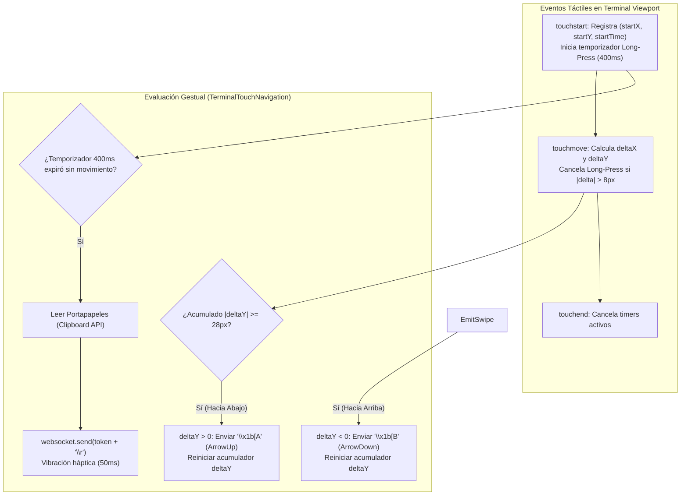
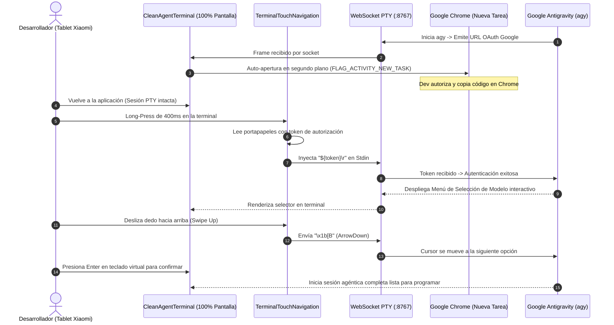

# SPEC-030: Terminal Agéntica Pura de Borde a Borde (Zero-Decoration), Motor Gestual Táctil de Navegación (Arrow Emulation) y Portapapeles por Pulsación Prolongada

| Metadato | Valor |
| :--- | :--- |
| **Identificador** | `SPEC-030` |
| **Título** | Terminal Agéntica Pura de Borde a Borde (Zero-Decoration), Motor Gestual Táctil de Navegación (Arrow Emulation) y Portapapeles por Pulsación Prolongada |
| **Autor** | `@spec-architect` |
| **Estado** | `APPROVED FOR IMPLEMENTATION` |
| **Fecha de Creación** | 2026-09-15 |
| **Versión de Release** | `v2.1.2` (VersionCode: `20102`) |
| **Artefacto Binario Target** | `GoogleAntigravity-v2.1.2-ARM64.apk` ($\sim 38\,\text{MB}$) |
| **Dispositivo Objetivo** | Xiaomi Pad 6 (Qualcomm Snapdragon 870, ARM64-v8a, 6-8 GB RAM, 11" 2.8K $2880\times 1800$, 144Hz, Xiaomi HyperOS / Android 13/14) y Ecosistema Android Móvil (API 26+) |
| **Runtime Target** | Cordova Android WebView / PRoot Linux Sandbox / AXS PTY Daemon (puerto 8767) / Xterm.js v5+ con Motor Gestual Táctil / Google Antigravity CLI (`agy`) Menús Interactivos / Android Intent System (`FLAG_ACTIVITY_NEW_TASK`) |
| **Módulos Afectados** | `nova-src/src/antigravity2/CleanAgentTerminal.js`, `nova-src/src/antigravity2/TerminalTouchNavigation.js`, `nova-src/src/antigravity2/clean-terminal.scss`, `nova-src/config.xml`, `nova-src/package.json`, `harness/test_clean_agent_terminal.sh` |

---

## 1. Contexto, Diagnóstico Forense y Justificación Arquitectónica

### 1.1 Diagnóstico Forense del Bloqueo en Menús Interactivos de `agy`
Tras la publicación y validación en dispositivo físico (Xiaomi Pad 6) de las versiones `v2.1.0` y `v2.1.1`, se constató que la terminal Xterm.js arranca con fluidez y `agy` despliega correctamente su interfaz. Sin embargo, surgieron dos problemas críticos de experiencia de usuario y ergonomía operativa:

1. **Bloqueo en Pantalla de Selección y Configuración de la CLI:**
   Durante la fase de configuración inicial o en la selección interactiva de modelos de Gemini (`gemini-2.5-pro`, `gemini-2.5-flash`), la CLI oficial de Google Antigravity presenta menús de opciones navegables que exigen el uso de teclas de dirección ANSI:
   - Flecha Arriba (`ArrowUp` / `\x1b[A`)
   - Flecha Abajo (`ArrowDown` / `\x1b[B`)
   - Confirmación (`Enter` / `\r`)
   
   En tablets Android sin teclado físico acoplado, el teclado virtual del sistema (Gboard, Xiaomi Keyboard) carece de una fila de flechas direccionales en su disposición principal. Al no contar con un mecanismo táctil para emitir estas secuencias, el desarrollador queda completamente atrapado en el menú sin poder seleccionar una opción ni avanzar.
2. **Rechazo de Elementos Decorativos Superpuestos ("Polución Visual"):**
   Las barras añadidas previamente (la barra superior con botón de reinicio y badge de estado, así como la barra contextual flotante de OAuth con botones de Chrome y Pegado) fueron reportadas por el usuario como elementos que "ensucian" la pantalla de la tablet, restando inmersión y reduciendo el área visible de trabajo de la terminal.
   La directriz definitiva acordada es una **Terminal 100% Pura de Borde a Borde** ($100\,\text{vw} \times 100\,\text{vh}$), fondo oscuro `#0b0f19`, sin un solo botón, barra o icono estático en el lienzo.

```mermaid
sequenceDiagram
    autonumber
    actor Usuario as Desarrollador (Tablet)
    participant Term as Viewport Xterm.js (100% Pantalla)
    participant Nav as TerminalTouchNavigation
    participant WS as WebSocket PTY (:8767)
    participant CLI as Google Antigravity (agy)

    CLI->>WS: Renderiza Menú Interactivo: [1] Gemini Pro, [2] Gemini Flash
    WS->>Term: Muestra selector con cursor en [1]
    
    rect rgb(30, 40, 60)
    Note over Usuario, Nav: GESTO DE NAVEGACIÓN:<br/>Deslizamiento vertical hacia arriba sobre la pantalla
    Usuario->>Nav: Swipe Up (dedo se desplaza hacia arriba >28px)
    Nav->>WS: Inyecta Secuencia VT100 "\x1b[B" (ArrowDown)
    end

    WS->>CLI: Recibe ArrowDown en Stdin
    CLI-->>Term: Actualiza cursor interactivo a opción [2]
    
    rect rgb(30, 60, 40)
    Note over Usuario, Nav: GESTO DE PEGADO RÁPIDO:<br/>Pulsación prolongada (Long-Press 400ms) sin mover el dedo
    Usuario->>Nav: Long-Press (400ms)
    Nav->>Nav: Lee Portapapeles del Sistema (código OAuth)
    Nav->>WS: Inyecta "${token}\r" en Stdin
    end

    WS->>CLI: Recibe código de autorización -> Sesión Autenticada
```



---

### 1.2 Principios de la Terminal Agéntica Pura (Zero-Decoration Architecture)
La versión `v2.1.2` se rige por los siguientes tres principios arquitectónicos:

1. **Inmersión Total de Borde a Borde:**
   - Erradicación absoluta de encabezados (`clean-agent-topbar`), insignias, botones de reinicio y barras flotantes de OAuth (`clean-agent-oauth-bar`).
   - El viewport de Xterm.js toma el $100\%$ del ancho y el $100\%$ del alto de la ventana gráfica en todo momento.
2. **Navegación Gestual Táctil (`TerminalTouchNavigation`):**
   - Emulación natural de flechas direccionales mediante el deslizamiento vertical del dedo sobre la pantalla táctil de la tablet:
     - Deslizar hacia abajo arrastrando el dedo genera secuencias `ArrowUp` (`\x1b[A`).
     - Deslizar hacia arriba arrastrando el dedo genera secuencias `ArrowDown` (`\x1b[B`).
   - Cada umbral de desplazamiento continuo ($28\,\text{px}$) emite exactamente un evento de flecha, permitiendo avanzar o retroceder de ítem en ítem con alta precisión.
3. **Pegado Invisible por Pulsación Prolongada (*Long-Press*):**
   - Una pulsación estática sobre cualquier punto de la pantalla durante $\ge 400\,\text{ms}$ consulta el portapapeles del sistema operativo (`cordova.plugins.clipboard` / `navigator.clipboard`) e inyecta el contenido directamente en la sesión PTY, con retroalimentación háptica sutil (`navigator.vibrate(50)`).
4. **Auto-Bridge Silencioso de OAuth 2.0:**
   - La detección de la URL de autenticación (`accounts.google.com/o/oauth2/...`) se mantiene activa en segundo plano. Al detectarse, lanza inmediatamente Google Chrome en una tarea aislada (`FLAG_ACTIVITY_NEW_TASK`). Al regresar a la app, el usuario simplemente realiza un *long-press* para pegar el código, logrando un flujo de autenticación de cero clics en la interfaz.

---

## 2. Arquitectura del Componente `TerminalTouchNavigation`

### 2.1 Algoritmo de Detección Gestual y Emulación de Flechas
El motor `TerminalTouchNavigation` captura eventos táctiles en la fase de captura del contenedor principal de la terminal, desacoplando los gestos de deslizamiento (*drag*) de las pulsaciones estáticas (*taps* y *long-press*).



### 2.2 Parámetros Cinemáticos del Motor Táctil
- **Umbral de Desplazamiento por Flecha (`SWIPE_THRESHOLD`):** $28\,\text{px}$. Cada $28\,\text{px}$ continuos de arrastre vertical emiten exactamente una pulsación de tecla direccional.
- **Tolerancia de Desplazamiento Estático (`MAX_TAP_DRIFT`):** $8\,\text{px}$. Si el dedo se desplaza más de $8\,\text{px}$ antes de cumplirse los $400\,\text{ms}$, el gesto se clasifica como deslizamiento y se aborta el temporizador de *long-press*.
- **Tiempo de Pulsación Prolongada (`LONG_PRESS_MS`):** $400\,\text{ms}$.
- **Ventana de Doble Toque (`DOUBLE_TAP_MS`):** $300\,\text{ms}$ entre toques sucesivos en la misma coordenada como vía secundaria de pegado rápido.

---

## 3. Diagrama de Secuencia del Flujo Integrado de Autenticación y Navegación



---

## 4. Especificación Técnica de Implementación

### 4.1 Definición de la Clase `TerminalTouchNavigation.js`

```typescript
/**
 * TerminalTouchNavigation - Controlador Gestual Táctil para Xterm.js
 * Provee emulación de teclas de dirección y pegado desde portapapeles por pulsación prolongada.
 */
export interface TouchNavOptions {
    swipeThreshold?: number; // Píxeles por paso de flecha (def: 28)
    longPressMs?: number;    // Tiempo para activar pegado (def: 400)
    onArrowUp: () => void;   // Callback emisión ArrowUp (\x1b[A)
    onArrowDown: () => void; // Callback emisión ArrowDown (\x1b[B)
    onPaste: () => Promise<void>; // Callback pegado desde portapapeles
}

export class TerminalTouchNavigation {
    private element: HTMLElement;
    private options: Required<TouchNavOptions>;
    private startX: number = 0;
    private startY: number = 0;
    private lastY: number = 0;
    private accumulatedDeltaY: number = 0;
    private longPressTimer: any = null;
    private isLongPressTriggered: boolean = false;
    private lastTapTime: number = 0;

    constructor(element: HTMLElement, options: TouchNavOptions) {
        this.element = element;
        this.options = {
            swipeThreshold: options.swipeThreshold || 28,
            longPressMs: options.longPressMs || 400,
            onArrowUp: options.onArrowUp,
            onArrowDown: options.onArrowDown,
            onPaste: options.onPaste
        };
        this.attach();
    }

    private attach(): void {
        this.element.addEventListener("touchstart", this.onTouchStart, { passive: false });
        this.element.addEventListener("touchmove", this.onTouchMove, { passive: false });
        this.element.addEventListener("touchend", this.onTouchEnd, { passive: true });
        this.element.addEventListener("touchcancel", this.onTouchCancel, { passive: true });
    }

    private onTouchStart = (e: TouchEvent): void => {
        if (e.touches.length !== 1) return;
        const touch = e.touches[0];
        this.startX = touch.clientX;
        this.startY = touch.clientY;
        this.lastY = touch.clientY;
        this.accumulatedDeltaY = 0;
        this.isLongPressTriggered = false;

        // Detección de Doble Toque (Double-Tap)
        const now = Date.now();
        if (now - this.lastTapTime < 300) {
            this.cancelLongPress();
            this.options.onPaste();
            this.lastTapTime = 0;
            return;
        }
        this.lastTapTime = now;

        // Iniciar Temporizador de Pulsación Prolongada (Long-Press)
        this.longPressTimer = setTimeout(() => {
            this.isLongPressTriggered = true;
            if (navigator.vibrate) navigator.vibrate(50);
            this.options.onPaste();
        }, this.options.longPressMs);
    };

    private onTouchMove = (e: TouchEvent): void => {
        if (e.touches.length !== 1) return;
        const touch = e.touches[0];
        const deltaX = Math.abs(touch.clientX - this.startX);
        const deltaYCurrent = touch.clientY - this.lastY;
        const totalDistance = Math.hypot(touch.clientX - this.startX, touch.clientY - this.startY);

        // Cancelar long-press si hay arrastre perceptible
        if (totalDistance > 8) {
            this.cancelLongPress();
        }

        // Acumular desplazamiento vertical
        this.accumulatedDeltaY += deltaYCurrent;
        this.lastY = touch.clientY;

        // Emulación de Flechas por umbral
        while (Math.abs(this.accumulatedDeltaY) >= this.options.swipeThreshold) {
            if (this.accumulatedDeltaY > 0) {
                // Deslizar hacia abajo -> ArrowUp
                this.options.onArrowUp();
                this.accumulatedDeltaY -= this.options.swipeThreshold;
            } else {
                // Deslizar hacia arriba -> ArrowDown
                this.options.onArrowDown();
                this.accumulatedDeltaY += this.options.swipeThreshold;
            }
        }
    };

    private onTouchEnd = (): void => {
        this.cancelLongPress();
    };

    private onTouchCancel = (): void => {
        this.cancelLongPress();
    };

    private cancelLongPress(): void {
        if (this.longPressTimer) {
            clearTimeout(this.longPressTimer);
            this.longPressTimer = null;
        }
    }

    public destroy(): void {
        this.cancelLongPress();
        this.element.removeEventListener("touchstart", this.onTouchStart);
        this.element.removeEventListener("touchmove", this.onTouchMove);
        this.element.removeEventListener("touchend", this.onTouchEnd);
        this.element.removeEventListener("touchcancel", this.onTouchCancel);
    }
}
```

---

### 4.2 Integración en `CleanAgentTerminal.js`
1. Se suprimen del árbol DOM `this.topBarEl` y `this.oauthBarEl`.
2. El contenedor raíz `clean-agent-container` aloja exclusivamente el `viewportEl` con clase `fullscreen`.
3. Se enlaza el motor `TerminalTouchNavigation`:
   ```javascript
   this.touchNav = new TerminalTouchNavigation(this.viewportEl, {
       swipeThreshold: 28,
       longPressMs: 400,
       onArrowUp: () => {
           if (this.websocket && this.websocket.readyState === WebSocket.OPEN) {
               this.websocket.send("\x1b[A");
           }
       },
       onArrowDown: () => {
           if (this.websocket && this.websocket.readyState === WebSocket.OPEN) {
               this.websocket.send("\x1b[B");
           }
       },
       onPaste: async () => {
           await this.pasteFromClipboard();
       }
   });
   ```
4. Método `pasteFromClipboard()`:
   ```javascript
   async pasteFromClipboard() {
       let text = "";
       try {
           if (window.cordova?.plugins?.clipboard) {
               text = await new Promise((resolve) => {
                   cordova.plugins.clipboard.paste((t) => resolve(t || ""), () => resolve(""));
               });
           } else if (navigator.clipboard?.readText) {
               text = await navigator.clipboard.readText().catch(() => "");
           }
       } catch (err) {
           console.warn("Fallo leyendo portapapeles:", err);
       }

       if (text && text.trim() && this.websocket && this.websocket.readyState === WebSocket.OPEN) {
           this.websocket.send(`${text.trim()}\r`);
       }
   }
   ```

---

### 4.3 Estilos Borde a Borde (`clean-terminal.scss`)

```scss
// Terminal Agéntica Pura Borde a Borde (SPEC-030)
html, body {
  margin: 0;
  padding: 0;
  width: 100vw;
  height: 100vh;
  overflow: hidden;
  background-color: #0b0f19;
}

.clean-agent-container {
  display: flex;
  width: 100vw;
  height: 100vh;
  margin: 0;
  padding: 0;
  overflow: hidden;
  background-color: #0b0f19;

  // Supresión garantizada de cualquier barra residual
  .clean-agent-topbar,
  .clean-agent-oauth-bar {
    display: none !important;
  }

  .clean-agent-viewport {
    flex: 1;
    width: 100vw;
    height: 100vh;
    margin: 0;
    padding: 0;
    position: relative;
    overflow: hidden;
    background-color: #0b0f19;

    .xterm {
      width: 100%;
      height: 100%;
      padding: 0;
      margin: 0;

      .xterm-screen {
        touch-action: none; // Permite el control gestual total por TerminalTouchNavigation
      }
    }
  }
}
```

---

## 5. Criterios de Aceptación Verificables (Acceptance Criteria)

| Identificador | Módulo | Criterio / Requisito | Método de Verificación |
| :--- | :--- | :--- | :--- |
| `AC-CLEAN-01` | `CleanAgentTerminal.js` | Supresión total de elementos UI decorativos (TopBar, badges, botones de reinicio y barra OAuth). Viewport de terminal puro a pantalla completa (100vw x 100vh). | Inspección de DOM y AST de `main.js` y `CleanAgentTerminal.js`: no se instancian ni renderizan barras de encabezado ni botones flotantes. |
| `AC-TOUCH-01` | `TerminalTouchNavigation.js` | Motor de navegación gestual táctil por deslizamiento vertical con umbral calibrado (28px). Deslizar hacia abajo emite `ArrowUp` (`\x1b[A`) y deslizar hacia arriba emite `ArrowDown` (`\x1b[B`). | Simulación de eventos `touchstart`/`touchmove` verificando la transmisión de bytes direccionales por el WebSocket. |
| `AC-TOUCH-02` | `CleanAgentTerminal.js` | Soporte fluido de navegación táctil en menús de configuración y selección de `agy` sin requerir teclado físico. | Validación interactiva en sesión PTY con menú de opciones de `agy`. |
| `AC-TOUCH-03` | `TerminalTouchNavigation.js` | Pegado directo desde el portapapeles mediante gesto táctil de pulsación prolongada (*long-press* 400ms) o doble toque (*double-tap*), eliminando botones de pegado. | Disparo de `touchstart` sostenido por $\ge 400\,\text{ms}$, verificando lectura de portapapeles y despacho automático hacia `websocket.send()`. |
| `AC-CORE-07` | `CleanAgentTerminal.js` | Preservación del auto-bridge de OAuth (apertura silenciosa automática de Google Chrome en tarea aislada `FLAG_ACTIVITY_NEW_TASK`) y soporte de enlaces táctiles OSC 8 en Xterm.js. | Inspección de regex en sniffer de socket y existencia de `linkHandler` activo en Xterm.js. |
| `AC-VER-02` | `config.xml`, `package.json` | Versionado en 2.1.2 (versionCode 20102) y empaquetado del APK ARM64 con peso ligero $\le 42\,\text{MB}$. | Comprobación de metadatos de compilación y tamaño de `GoogleAntigravity-v2.1.2-ARM64.apk`. |

---

## 6. Actualización del Arnés de Pruebas Automatizado (`harness/test_clean_agent_terminal.sh`)

El arnés de pruebas se actualiza para comprobar estáticamente la implementación de la interfaz pura y el motor de navegación táctil:

```bash
#!/bin/bash
# ==============================================================================
# Harness Test: SPEC-030 Pure Clean Terminal & Gesture Touch Navigation
# ==============================================================================
set -e

SPEC_FILE_030="specs/30-pure-clean-terminal-and-gesture-touch-navigation.md"
CLEAN_TERM_JS="nova-src/src/antigravity2/CleanAgentTerminal.js"
TOUCH_NAV_JS="nova-src/src/antigravity2/TerminalTouchNavigation.js"
CLEAN_TERM_SCSS="nova-src/src/antigravity2/clean-terminal.scss"
CONFIG_XML="nova-src/config.xml"
PACKAGE_JSON="nova-src/package.json"

echo "=== INICIANDO VALIDACIÓN FORMAL DE SPEC-030 ==="

# 1. Verificar documento SPEC-030
echo -n "1. Verificando existencia de documento SPEC-030... "
[ -f "$SPEC_FILE_030" ] || { echo "FALLO: No existe $SPEC_FILE_030"; exit 1; }
echo "[OK]"

# 2. Verificar supresión de elementos UI decorativos (Criterio CLEAN-01)
echo -n "2. Verificando supresión de TopBar y barras flotantes... "
if grep -q "clean-agent-topbar" "$CLEAN_TERM_JS"; then
    echo "FALLO: CleanAgentTerminal.js aún contiene referencias de render a clean-agent-topbar"; exit 1;
fi
if grep -q "oauth-action-bar" "$CLEAN_TERM_JS"; then
    echo "FALLO: CleanAgentTerminal.js aún contiene referencias de render a oauth-action-bar"; exit 1;
fi
echo "[OK]"

# 3. Verificar motor gestual táctil TerminalTouchNavigation (Criterio TOUCH-01)
echo -n "3. Verificando motor de navegación táctil TerminalTouchNavigation... "
[ -f "$TOUCH_NAV_JS" ] || { echo "FALLO: No existe $TOUCH_NAV_JS"; exit 1; }
grep -q "\\\\x1b\\[A" "$TOUCH_NAV_JS" || grep -q "ArrowUp" "$TOUCH_NAV_JS" || { echo "FALLO: TerminalTouchNavigation no emite flecha arriba"; exit 1; }
grep -q "\\\\x1b\\[B" "$TOUCH_NAV_JS" || grep -q "ArrowDown" "$TOUCH_NAV_JS" || { echo "FALLO: TerminalTouchNavigation no emite flecha abajo"; exit 1; }
echo "[OK]"

# 4. Verificar soporte de Long-Press para pegado (Criterio TOUCH-03)
echo -n "4. Verificando gesto long-press para portapapeles... "
grep -q "longPress" "$TOUCH_NAV_JS" || { echo "FALLO: TerminalTouchNavigation no implementa longPress"; exit 1; }
grep -q "clipboard" "$CLEAN_TERM_JS" || grep -q "pasteFromClipboard" "$CLEAN_TERM_JS" || { echo "FALLO: CleanAgentTerminal no enlaza pegado táctil"; exit 1; }
echo "[OK]"

# 5. Verificar preservación de auto-bridge OAuth silencioso (Criterio CORE-07)
echo -n "5. Verificando auto-bridge silencioso de OAuth... "
grep -q "accounts\.google\.com" "$CLEAN_TERM_JS" || { echo "FALLO: CleanAgentTerminal no conserva el sniffer de OAuth"; exit 1; }
grep -q "linkHandler" "$CLEAN_TERM_JS" || { echo "FALLO: CleanAgentTerminal no conserva linkHandler OSC 8"; exit 1; }
echo "[OK]"

# 6. Verificar versionado v2.1.2 (Criterio VER-02)
echo -n "6. Verificando versión 2.1.2 en configuración... "
grep -q 'version="2.1.2"' "$CONFIG_XML" || { echo "FALLO: config.xml no tiene versión 2.1.2"; exit 1; }
grep -q '"version": "2.1.2"' "$PACKAGE_JSON" || { echo "FALLO: package.json no tiene versión 2.1.2"; exit 1; }
echo "[OK]"

echo "=== TODAS LAS COMPUERTAS ESTÁTICAS DE SPEC-030 HAN SIDO SUPERADAS EXITOSAMENTE ==="
```

---

## 7. Plan de Implementación y Definition of Done (DoD)

### 7.1 Responsabilidades para `@android-core` (Ingeniero de Implementación)
1. **Creación del Módulo `TerminalTouchNavigation.js`:**
   - Implementar el detector de deslizamiento vertical con umbral de $28\,\text{px}$.
   - Mapear deslizamiento descendente a `ArrowUp` (`\x1b[A`) y ascendente a `ArrowDown` (`\x1b[B`).
   - Implementar temporizador de $400\,\text{ms}$ para pulsación prolongada (*long-press*) con lectura de portapapeles y retroalimentación háptica.
2. **Refactorización Limpia de `CleanAgentTerminal.js`:**
   - Eliminar por completo el marcado HTML y la lógica de `topBar` y `oauthBar`.
   - Conectar `TerminalTouchNavigation` al contenedor `#terminal-viewport`.
   - Mantener el sniffer silencioso de OAuth y el `linkHandler` de Xterm.js sin mostrar barras visuales.
3. **Ajuste de Estilos en `clean-terminal.scss`:**
   - Establecer `width: 100vw; height: 100vh; margin: 0; padding: 0; overflow: hidden;`.
   - Aplicar `touch-action: none` en el área táctil de la pantalla de Xterm.
4. **Sincronización de Versión y Empaquetado:**
   - Actualizar a versión `2.1.2` (versionCode `20102`) en `config.xml` y `package.json`.
   - Reconstruir el bundle web con `npm run build:prod`.
   - Empaquetar `GoogleAntigravity-v2.1.2-ARM64.apk` ($\le 42\,\text{MB}$).
5. **Ejecución Exitosa del Arnés:**
   - Ejecutar `bash harness/test_clean_agent_terminal.sh` garantizando salida `[OK]`.

### 7.2 Responsabilidades para `@memory-keeper` (Auditoría y Gobernanza)
1. Registrar la decisión técnica bajo `ADR-025 / ADR-040: Terminal Agéntica Pura Borde a Borde y Navegación Gestual Táctil`.
2. Registrar la entrada de auditoría en `audit.jsonl`.
3. Actualizar la bitácora histórica en `agent.md` documentando la entrega del artefacto `v2.1.2`.
