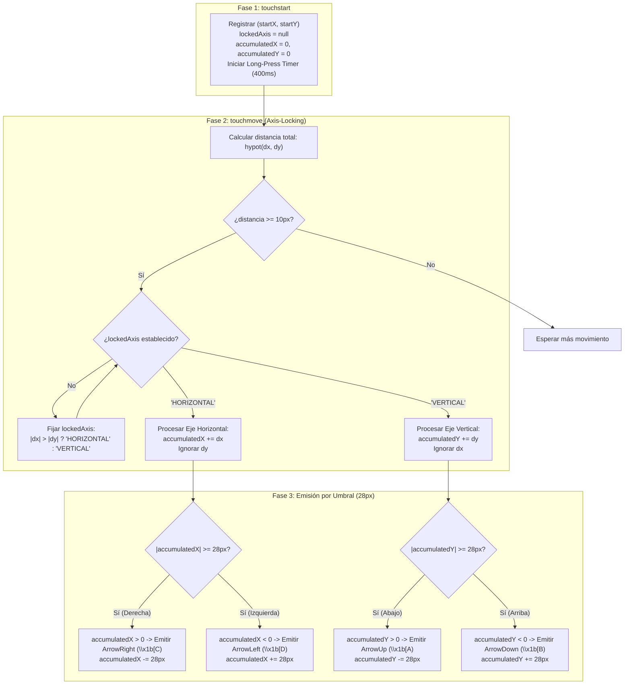

# SPEC-031: Navegación Gestual Táctil Cuadridireccional (4-Way D-Pad), Bloqueo Cinemático de Eje (Axis-Locking) y Supresión Definitiva de Paneles Laterales

| Metadato | Valor |
| :--- | :--- |
| **Identificador** | `SPEC-031` |
| **Título** | Navegación Gestual Táctil Cuadridireccional (4-Way D-Pad), Bloqueo Cinemático de Eje (Axis-Locking) y Supresión Definitiva de Paneles Laterales |
| **Autor** | `@spec-architect` |
| **Estado** | `APPROVED FOR IMPLEMENTATION` |
| **Fecha de Creación** | 2026-09-15 |
| **Versión de Release** | `v2.1.3` (VersionCode: `20103`) |
| **Artefacto Binario Target** | `GoogleAntigravity-v2.1.3-ARM64.apk` ($\sim 38\,\text{MB}$) |
| **Dispositivo Objetivo** | Xiaomi Pad 6 (Qualcomm Snapdragon 870, ARM64-v8a, 6-8 GB RAM, 11" 2.8K $2880\times 1800$, 144Hz, Xiaomi HyperOS / Android 13/14) y Ecosistema Android Móvil (API 26+) |
| **Runtime Target** | Cordova Android WebView / PRoot Linux Sandbox / AXS PTY Daemon (puerto 8767) / Xterm.js v5+ con Motor Gestual Cuadridireccional 4-Way D-Pad / Google Antigravity CLI (`agy`) Menús y Línea de Comandos / Android Intent System (`FLAG_ACTIVITY_NEW_TASK`) |
| **Módulos Afectados** | `nova-src/src/antigravity2/TerminalTouchNavigation.js`, `nova-src/src/antigravity2/CleanAgentTerminal.js`, `nova-src/src/antigravity2/clean-terminal.scss`, `nova-src/config.xml`, `nova-src/package.json`, `harness/test_clean_agent_terminal.sh` |

---

## 1. Contexto, Diagnóstico Forense y Necesidad Operativa

### 1.1 Diagnóstico de Navegación en Xiaomi Pad 6: Éxito Vertical y Necesidad Horizontal
Tras el despliegue y validación en la tablet física Xiaomi Pad 6 de la versión `v2.1.2`, el usuario confirmó el éxito operativo del motor gestual:
> *"perfecto hay un detalle funciona el táctil pero no se que gesto es para izquierda o derecha"*

El motor introducido en la especificación previa resolvió satisfactoriamente la navegación en menús verticales (listas de selección de modelos, confirmación de opciones con `ArrowUp` y `ArrowDown`). Sin embargo, en el trabajo interactivo real con la terminal y la CLI de Google Antigravity (`agy`), los desarrolladores se enfrentan frecuentemente a situaciones que requieren desplazamiento horizontal:
1. **Edición de Línea de Comandos (Readline / Prompt Cursor Movement):** Desplazar el cursor hacia la izquierda o hacia la derecha dentro de un comando largo para corregir un carácter, modificar parámetros o insertar banderas (`ArrowLeft` / `ArrowRight`).
2. **Selectores Horizontales de CLI:** Menús interactivos y cuadros de confirmación donde las opciones se disponen en columnas o pares horizontales (ej. `[ Yes ]  [ No ]`, `[ Cancelar ]  [ Continuar ]`, selección de permisos de herramientas o conmutación entre pestañas de herramientas).
3. **Exploración de Textos Anchos y Paginadores:** Navegación en utilidades de inspección de código (`less`, visores de diffs de git en columnas paralelas).

### 1.2 Problema de Paneles Laterales Residuales en Orientación Tablet
En la Xiaomi Pad 6 (pantalla de 11" 2.8K), tanto en orientación horizontal (*landscape*) como vertical (*portrait*), cualquier deslizamiento táctil horizontal iniciado cerca de los bordes corre el riesgo de invocar el panel lateral heredado de Acode (`#sidebar` / `sidebarApps`). Dicho panel ocluye la terminal, reduce el espacio disponible y genera fricción visual contraria al principio de Terminal Pura acordado. Es imperativo imponer una supresión definitiva y forzada a nivel de DOM y CSS para cualquier componente de barra lateral.

---

## 2. Arquitectura de la Solución: Sistema Táctil 4-Way D-Pad y Bloqueo de Eje (Axis-Locking)

### 2.1 Cinemática del Gesto Cuadridireccional (Mapeo VT100 / ANSI)
El módulo `TerminalTouchNavigation.js` se amplía de un sistema monodireccional vertical a un controlador gestual cuadridireccional completo (**4-Way D-Pad**):

| Gesto Físico del Usuario | Vector de Desplazamiento en Pantalla | Secuencia de Escape ANSI Emitida | Acción Resultante en PTY / CLI |
| :--- | :--- | :--- | :--- |
| **Deslizar a la DERECHA** | $\Delta X > 0$ (Arrastre hacia la derecha) | `\x1b[C` (`ArrowRight`) | Mover cursor a la derecha / opción siguiente en menú horizontal |
| **Deslizar a la IZQUIERDA** | $\Delta X < 0$ (Arrastre hacia la izquierda) | `\x1b[D` (`ArrowLeft`) | Mover cursor a la izquierda / opción previa en menú horizontal |
| **Deslizar hacia ABAJO** | $\Delta Y > 0$ (Arrastre descendente en cliente) | `\x1b[A` (`ArrowUp`) | Mover cursor arriba en menú vertical / historial previo |
| **Deslizar hacia ARRIBA** | $\Delta Y < 0$ (Arrastre ascendente en cliente) | `\x1b[B` (`ArrowDown`) | Mover cursor abajo en menú vertical / historial posterior |

### 2.2 Algoritmo de Bloqueo Cinemático de Eje (Axis-Locking)
En pantallas táctiles capacitivas de alta resolución como la Xiaomi Pad 6, el movimiento del dedo del usuario nunca es estrictamente ortogonal; siempre presenta una componente combinada $(\Delta X, \Delta Y)$. Si se procesaran ambos ejes simultáneamente sin discriminación, un deslizamiento vertical provocaría emisiones parásitas de flechas horizontales y viceversa, corrompiendo la posición del cursor en `agy`.

Para erradicar este problema, el motor incorpora un mecanismo de **Bloqueo Cinemático de Eje (*Axis-Locking*)**:
1. **Zona Muerta Inicial (`DEADZONE` = $10\,\text{px}$):** Durante los primeros $10\,\text{px}$ de desplazamiento acumulado desde el punto inicial `(startX, startY)`, no se emite ninguna tecla.
2. **Determinación del Eje Dominante:** En cuanto la distancia euclidiana supera la zona muerta ($\sqrt{\Delta X^2 + \Delta Y^2} \ge 10\,\text{px}$), se fija el eje dominante para el resto del trazo continuo:
   - Si $|\Delta X| > |\Delta Y|$, se bloquea en modo **`HORIZONTAL`**.
   - Si $|\Delta Y| \ge |\Delta X|$, se bloquea en modo **`VERTICAL`**.
3. **Filtrado Exclusivo:** Mientras el dedo permanezca en contacto con la pantalla (`touchmove`), únicamente se acumula y evalúa el desplazamiento sobre el eje bloqueado, ignorando por completo cualquier desviación ortogonal.
4. **Umbral Calibrado por Tecla (`SWIPE_THRESHOLD` = $28\,\text{px}$):** Cada $28\,\text{px}$ continuos de avance a lo largo del eje bloqueado emiten exactamente una pulsación de flecha.
5. **Liberación del Cerrojo:** Al levantarse el dedo (`touchend` o `touchcancel`), el cerrojo se restablece a `null`, dejando el motor listo para el siguiente trazo en cualquier dirección.



---

### 2.3 Supresión Definitiva de Paneles Laterales (`#sidebar`) y Gestos Heredados
Para garantizar que un deslizamiento horizontal desde el borde izquierdo de la pantalla no abra accidentalmente el panel lateral de Acode en la Xiaomi Pad 6:
1. **Reglas CSS Obligatorias en `clean-terminal.scss`:**
   ```scss
   #sidebar,
   .sidebar,
   #sidebar-toggler,
   [data-action="toggle-sidebar"],
   .sidebar-apps {
     display: none !important;
     width: 0 !important;
     max-width: 0 !important;
     visibility: hidden !important;
     pointer-events: none !important;
     opacity: 0 !important;
   }
   ```
2. **Aislamiento de Eventos Táctiles en `CleanAgentTerminal.js`:** El contenedor principal `.clean-agent-viewport` intercepta y previene la propagación de eventos táctiles horizontales que pudieran ser escuchados por controladores globales de Acode en `document.body`.

### 2.4 Preservación de Gestos de Pulsación Prolongada y Doble Toque
El algoritmo de bloqueo cinemático no altera la experiencia de portapapeles:
- Si el dedo permanece quieto en la coordenada inicial durante $400\,\text{ms}$ (desplazamiento total $\le 8\,\text{px}$), se ejecuta la lectura del portapapeles y el pegado automático con vibración háptica de $50\,\text{ms}$.
- Dos toques rápidos en el mismo punto ($< 300\,\text{ms}$) disparan igualmente el pegado rápido.

---

## 3. Diagramas de Secuencia y Flujo de Interacción

### 3.1 Diagrama de Secuencia: Navegación Cuadridireccional en Menú Horizontal y Vertical

```mermaid
sequenceDiagram
    autonumber
    actor Usuario as Desarrollador (Tablet)
    participant Nav as TerminalTouchNavigation
    participant WS as WebSocket PTY (:8767)
    participant CLI as Google Antigravity (agy)

    Note over CLI: Menú de Confirmación Horizontal: [ Cancelar ]  [ Continuar ]
    
    rect rgb(20, 30, 50)
    Note over Usuario, Nav: GESTO HORIZONTAL DERECHA:
    Usuario->>Nav: Desliza dedo hacia la derecha (dx > 28px)
    Nav->>Nav: Axis-Locking: HORIZONTAL
    Nav->>WS: Envía "\x1b[C" (ArrowRight)
    WS->>CLI: Stdin recibe ArrowRight
    CLI-->>Usuario: Foco cambia a [ Continuar ]
    end

    rect rgb(50, 30, 20)
    Note over Usuario, Nav: GESTO HORIZONTAL IZQUIERDA:
    Usuario->>Nav: Desliza dedo hacia la izquierda (dx < -28px)
    Nav->>Nav: Axis-Locking: HORIZONTAL
    Nav->>WS: Envía "\x1b[D" (ArrowLeft)
    WS->>CLI: Stdin recibe ArrowLeft
    CLI-->>Usuario: Foco cambia a [ Cancelar ]
    end

    rect rgb(20, 50, 30)
    Note over Usuario, Nav: GESTO VERTICAL PRESERVADO:
    Usuario->>Nav: Desliza dedo hacia arriba (dy < -28px)
    Nav->>Nav: Axis-Locking: VERTICAL
    Nav->>WS: Envía "\x1b[B" (ArrowDown)
    WS->>CLI: Stdin recibe ArrowDown
    end
```



---

## 4. Especificación Técnica de Implementación y Contratos

### 4.1 Contrato TypeScript de `TerminalTouchNavigation.js`

```typescript
/**
 * TerminalTouchNavigation - Controlador Gestual Cuadridireccional (4-Way D-Pad)
 * Conforme a SPEC-031: ArrowUp, ArrowDown, ArrowLeft, ArrowRight con Axis-Locking.
 */
export interface TouchNav4WayOptions {
    swipeThreshold?: number; // Desplazamiento en px por tecla emitida (def: 28)
    deadzone?: number;       // Zona muerta para determinar el eje dominante (def: 10)
    longPressMs?: number;    // Duración de pulsación para portapapeles (def: 400)
    onArrowUp: () => void;   // \x1b[A (Deslizar hacia abajo)
    onArrowDown: () => void; // \x1b[B (Deslizar hacia arriba)
    onArrowLeft: () => void; // \x1b[D (Deslizar hacia la izquierda)
    onArrowRight: () => void;// \x1b[C (Deslizar hacia la derecha)
    onPaste: () => Promise<void>; // Pegado de portapapeles
}

export class TerminalTouchNavigation {
    private element: HTMLElement;
    private options: Required<TouchNav4WayOptions>;
    private startX: number = 0;
    private startY: number = 0;
    private lastX: number = 0;
    private lastY: number = 0;
    private accumulatedDeltaX: number = 0;
    private accumulatedDeltaY: number = 0;
    private lockedAxis: "horizontal" | "vertical" | null = null;
    private longPressTimer: any = null;
    private isLongPressTriggered: boolean = false;
    private lastTapTime: number = 0;

    constructor(element: HTMLElement, options: TouchNav4WayOptions) {
        this.element = element;
        this.options = {
            swipeThreshold: options.swipeThreshold || 28,
            deadzone: options.deadzone || 10,
            longPressMs: options.longPressMs || 400,
            onArrowUp: options.onArrowUp || (() => {}),
            onArrowDown: options.onArrowDown || (() => {}),
            onArrowLeft: options.onArrowLeft || (() => {}),
            onArrowRight: options.onArrowRight || (() => {}),
            onPaste: options.onPaste || (() => Promise.resolve())
        };
        this.attach();
    }

    private attach(): void {
        this.element.addEventListener("touchstart", this.onTouchStart, { passive: false });
        this.element.addEventListener("touchmove", this.onTouchMove, { passive: false });
        this.element.addEventListener("touchend", this.onTouchEnd, { passive: true });
        this.element.addEventListener("touchcancel", this.onTouchCancel, { passive: true });
    }

    private onTouchStart = (e: TouchEvent): void => {
        if (e.touches.length !== 1) return;
        const touch = e.touches[0];
        this.startX = touch.clientX;
        this.startY = touch.clientY;
        this.lastX = touch.clientX;
        this.lastY = touch.clientY;
        this.accumulatedDeltaX = 0;
        this.accumulatedDeltaY = 0;
        this.lockedAxis = null;
        this.isLongPressTriggered = false;

        // Detección de doble toque (<300ms)
        const now = Date.now();
        if (now - this.lastTapTime < 300) {
            this.cancelLongPress();
            this.options.onPaste();
            this.lastTapTime = 0;
            return;
        }
        this.lastTapTime = now;

        // Temporizador de pulsación prolongada (400ms)
        this.longPressTimer = setTimeout(() => {
            this.isLongPressTriggered = true;
            if (navigator.vibrate) {
                try { navigator.vibrate(50); } catch (err) {}
            }
            this.options.onPaste();
        }, this.options.longPressMs);
    };

    private onTouchMove = (e: TouchEvent): void => {
        if (e.touches.length !== 1) return;
        const touch = e.touches[0];
        const currentX = touch.clientX;
        const currentY = touch.clientY;
        const totalDist = Math.hypot(currentX - this.startX, currentY - this.startY);

        // Cancelar long-press ante movimiento
        if (totalDist > 8) {
            this.cancelLongPress();
        }

        const deltaXCurrent = currentX - this.lastX;
        const deltaYCurrent = currentY - this.lastY;

        // Bloqueo cinemático de eje (Axis-Locking) tras superar la zona muerta
        if (!this.lockedAxis && totalDist >= this.options.deadzone) {
            const absDx = Math.abs(currentX - this.startX);
            const absDy = Math.abs(currentY - this.startY);
            this.lockedAxis = absDx > absDy ? "horizontal" : "vertical";
        }

        // Si aún no se supera la zona muerta, no acumular
        if (!this.lockedAxis) {
            this.lastX = currentX;
            this.lastY = currentY;
            return;
        }

        if (this.lockedAxis === "horizontal") {
            this.accumulatedDeltaX += deltaXCurrent;
            while (Math.abs(this.accumulatedDeltaX) >= this.options.swipeThreshold) {
                if (this.accumulatedDeltaX > 0) {
                    // Deslizar a la derecha -> ArrowRight
                    this.options.onArrowRight();
                    this.accumulatedDeltaX -= this.options.swipeThreshold;
                } else {
                    // Deslizar a la izquierda -> ArrowLeft
                    this.options.onArrowLeft();
                    this.accumulatedDeltaX += this.options.swipeThreshold;
                }
            }
        } else if (this.lockedAxis === "vertical") {
            this.accumulatedDeltaY += deltaYCurrent;
            while (Math.abs(this.accumulatedDeltaY) >= this.options.swipeThreshold) {
                if (this.accumulatedDeltaY > 0) {
                    // Deslizar hacia abajo -> ArrowUp
                    this.options.onArrowUp();
                    this.accumulatedDeltaY -= this.options.swipeThreshold;
                } else {
                    // Deslizar hacia arriba -> ArrowDown
                    this.options.onArrowDown();
                    this.accumulatedDeltaY += this.options.swipeThreshold;
                }
            }
        }

        this.lastX = currentX;
        this.lastY = currentY;
    };

    private onTouchEnd = (): void => {
        this.cancelLongPress();
        this.lockedAxis = null;
    };

    private onTouchCancel = (): void => {
        this.cancelLongPress();
        this.lockedAxis = null;
    };

    private cancelLongPress(): void {
        if (this.longPressTimer) {
            clearTimeout(this.longPressTimer);
            this.longPressTimer = null;
        }
    }

    public destroy(): void {
        this.cancelLongPress();
        this.element.removeEventListener("touchstart", this.onTouchStart);
        this.element.removeEventListener("touchmove", this.onTouchMove);
        this.element.removeEventListener("touchend", this.onTouchEnd);
        this.element.removeEventListener("touchcancel", this.onTouchCancel);
    }
}
```

---

### 4.2 Integración en `CleanAgentTerminal.js`

```javascript
// Configuración del motor cuadridireccional en CleanAgentTerminal.js
this.touchNav = new TerminalTouchNavigation(this.viewportEl, {
    swipeThreshold: 28,
    deadzone: 10,
    longPressMs: 400,
    onArrowUp: () => {
        if (this.websocket?.readyState === WebSocket.OPEN) {
            this.websocket.send("\x1b[A");
        }
    },
    onArrowDown: () => {
        if (this.websocket?.readyState === WebSocket.OPEN) {
            this.websocket.send("\x1b[B");
        }
    },
    onArrowLeft: () => {
        if (this.websocket?.readyState === WebSocket.OPEN) {
            this.websocket.send("\x1b[D");
        }
    },
    onArrowRight: () => {
        if (this.websocket?.readyState === WebSocket.OPEN) {
            this.websocket.send("\x1b[C");
        }
    },
    onPaste: async () => {
        await this.pasteFromClipboard();
    }
});
```

---

### 4.3 Estilos de Supresión de Barras Laterales (`clean-terminal.scss`)

```scss
// Supresión definitiva de barras laterales residuales en tablet (SPEC-031)
#sidebar,
.sidebar,
#sidebar-toggler,
[data-action="toggle-sidebar"],
.sidebar-apps {
  display: none !important;
  width: 0 !important;
  max-width: 0 !important;
  visibility: hidden !important;
  pointer-events: none !important;
  opacity: 0 !important;
}

.clean-agent-container {
  width: 100vw;
  height: 100vh;
  margin: 0;
  padding: 0;
  overflow: hidden;
  background-color: #0b0f19;

  .clean-agent-viewport {
    width: 100vw;
    height: 100vh;
    touch-action: none; // Control gestual nativo sin gestos de navegador
  }
}
```

---

## 5. Criterios de Aceptación Verificables (Acceptance Criteria)

| Identificador | Módulo | Criterio / Requisito | Método de Verificación |
| :--- | :--- | :--- | :--- |
| `AC-DPAD-01` | `TerminalTouchNavigation.js` | Emulación de tecla `ArrowLeft` (`\x1b[D`) al deslizar hacia la izquierda ($\Delta X < -28\,\text{px}$) sobre el eje horizontal bloqueado. | Simulación de eventos táctiles hacia la izquierda verificando la transmisión de `\x1b[D` en el socket PTY. |
| `AC-DPAD-02` | `TerminalTouchNavigation.js` | Emulación de tecla `ArrowRight` (`\x1b[C`) al deslizar hacia la derecha ($\Delta X > 28\,\text{px}$) sobre el eje horizontal bloqueado. | Simulación de eventos táctiles hacia la derecha verificando la transmisión de `\x1b[C` en el socket PTY. |
| `AC-DPAD-03` | `TerminalTouchNavigation.js` | Preservación de emulación vertical `ArrowUp` (`\x1b[A`) al deslizar hacia abajo y `ArrowDown` (`\x1b[B`) al deslizar hacia arriba. | Verificación de trazos verticales puros asegurando la correcta emisión de secuencias verticales. |
| `AC-DPAD-04` | `TerminalTouchNavigation.js` | Bloqueo cinemático de eje (*Axis-Locking*) tras superar la zona muerta ($10\,\text{px}$), impidiendo emisiones cruzadas de flechas no deseadas. | Desplazamiento diagonal simulado: verificar que sólo se emitan flechas del eje de mayor desplazamiento relativo inicial. |
| `AC-DPAD-05` | `clean-terminal.scss` | Ocultación absoluta y forzada de paneles laterales `#sidebar` y elementos residuales en todas las orientaciones de tablet. | Inspección de reglas CSS compiladas asegurando `display: none !important` y `pointer-events: none !important`. |
| `AC-DPAD-06` | `config.xml`, `package.json` | Versionado en 2.1.3 (versionCode 20103) y empaquetado del APK ARM64 con peso ligero $\le 42\,\text{MB}$. | Comprobación de metadatos de compilación y tamaño de `GoogleAntigravity-v2.1.3-ARM64.apk`. |

---

## 6. Actualización del Arnés de Pruebas Automatizado (`harness/test_clean_agent_terminal.sh`)

El arnés de pruebas se actualiza para comprobar estáticamente la implementación del D-Pad cuadridireccional:

```bash
#!/bin/bash
# ==============================================================================
# Harness Test: SPEC-031 4-Way D-Pad Gesture Navigation Verification
# ==============================================================================
set -e

SPEC_FILE_031="specs/31-horizontal-gesture-navigation-4-way-dpad.md"
TOUCH_NAV_JS="nova-src/src/antigravity2/TerminalTouchNavigation.js"
CLEAN_TERM_JS="nova-src/src/antigravity2/CleanAgentTerminal.js"
CLEAN_TERM_SCSS="nova-src/src/antigravity2/clean-terminal.scss"
CONFIG_XML="nova-src/config.xml"
PACKAGE_JSON="nova-src/package.json"

echo "=== INICIANDO VALIDACIÓN FORMAL DE SPEC-031 ==="

# 1. Verificar documento SPEC-031
echo -n "1. Verificando existencia de documento SPEC-031... "
[ -f "$SPEC_FILE_031" ] || { echo "FALLO: No existe $SPEC_FILE_031"; exit 1; }
echo "[OK]"

# 2. Verificar emulación horizontal ArrowLeft y ArrowRight (Criterios DPAD-01 y DPAD-02)
echo -n "2. Verificando emulación horizontal ArrowLeft y ArrowRight... "
grep -q "\\\\x1b\\[D" "$TOUCH_NAV_JS" || grep -q "ArrowLeft" "$TOUCH_NAV_JS" || { echo "FALLO: No se encuentra emisión de ArrowLeft"; exit 1; }
grep -q "\\\\x1b\\[C" "$TOUCH_NAV_JS" || grep -q "ArrowRight" "$TOUCH_NAV_JS" || { echo "FALLO: No se encuentra emisión de ArrowRight"; exit 1; }
echo "[OK]"

# 3. Verificar preservación de emulación vertical (Criterio DPAD-03)
echo -n "3. Verificando preservación de flechas verticales... "
grep -q "\\\\x1b\\[A" "$TOUCH_NAV_JS" || grep -q "ArrowUp" "$TOUCH_NAV_JS" || { echo "FALLO: No se encuentra emisión de ArrowUp"; exit 1; }
grep -q "\\\\x1b\\[B" "$TOUCH_NAV_JS" || grep -q "ArrowDown" "$TOUCH_NAV_JS" || { echo "FALLO: No se encuentra emisión de ArrowDown"; exit 1; }
echo "[OK]"

# 4. Verificar algoritmo de bloqueo de eje (Criterio DPAD-04)
echo -n "4. Verificando bloqueo cinemático de eje (Axis-Locking)... "
grep -q "lockedAxis" "$TOUCH_NAV_JS" || { echo "FALLO: TerminalTouchNavigation no implementa lockedAxis"; exit 1; }
echo "[OK]"

# 5. Verificar supresión forzada de sidebar (Criterio DPAD-05)
echo -n "5. Verificando reglas CSS de supresión de sidebar... "
grep -q "#sidebar" "$CLEAN_TERM_SCSS" || { echo "FALLO: clean-terminal.scss no suprime #sidebar"; exit 1; }
echo "[OK]"

# 6. Verificar versionado v2.1.3 (Criterio DPAD-06)
echo -n "6. Verificando versión 2.1.3 en configuración... "
grep -q 'version="2.1.3"' "$CONFIG_XML" || { echo "FALLO: config.xml no tiene versión 2.1.3"; exit 1; }
grep -q '"version": "2.1.3"' "$PACKAGE_JSON" || { echo "FALLO: package.json no tiene versión 2.1.3"; exit 1; }
echo "[OK]"

echo "=== TODAS LAS COMPUERTAS ESTÁTICAS DE SPEC-031 HAN SIDO SUPERADAS EXITOSAMENTE ==="
```

---

## 7. Plan de Implementación y Definition of Done (DoD)

### 7.1 Responsabilidades para `@android-core` (Ingeniero de Implementación)
1. **Actualización de `TerminalTouchNavigation.js`:**
   - Incorporar callbacks `onArrowLeft` y `onArrowRight`.
   - Implementar el estado `lockedAxis` con umbral de zona muerta de $10\,\text{px}$.
   - Mapear arrastre horizontal a `ArrowLeft` / `ArrowRight` cada $28\,\text{px}$.
2. **Conexión en `CleanAgentTerminal.js`:**
   - Proveer manejadores que envíen `\x1b[D` y `\x1b[C` al socket WebSocket PTY.
3. **Refuerzo de Estilos en `clean-terminal.scss`:**
   - Garantizar la ocultación total de `#sidebar` y elementos flotantes.
4. **Sincronización de Versión y Compilación:**
   - Elevar versión a `2.1.3` (versionCode `20103`) en `config.xml` y `package.json`.
   - Compilar `GoogleAntigravity-v2.1.3-ARM64.apk` ($\le 42\,\text{MB}$).
   - Ejecutar el arnés `bash harness/test_clean_agent_terminal.sh` garantizando pase total `[OK]`.

### 7.2 Responsabilidades para `@memory-keeper` (Auditoría y Gobernanza)
1. Registrar la decisión técnica bajo `ADR-026 / ADR-041: Motor Gestual Cuadridireccional 4-Way D-Pad y Bloqueo Cinemático de Eje`.
2. Registrar la entrada de auditoría en `audit.jsonl`.
3. Actualizar la bitácora histórica en `agent.md` con la versión `v2.1.3`.
