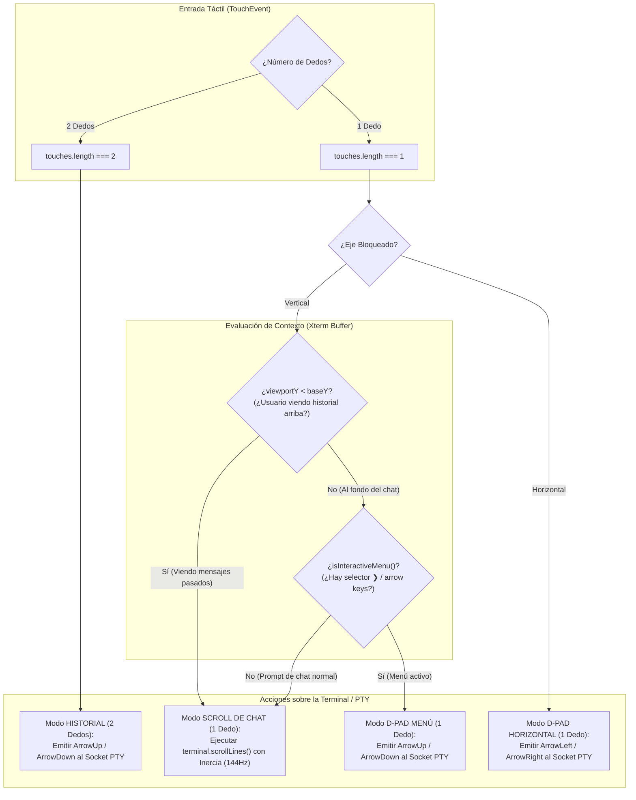
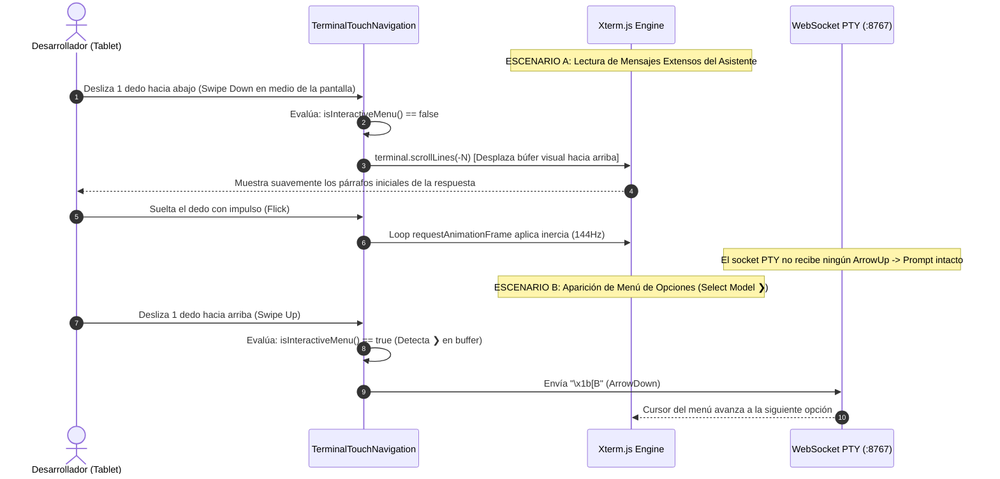
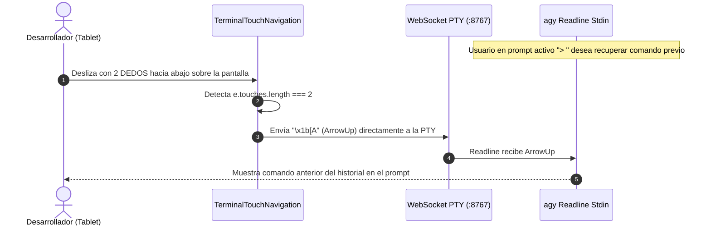

# SPEC-032: Desplazamiento Táctil Unificado de Chat con Física de Inercia (Momentum Scrolling) y D-Pad Contextual Inteligente

| Metadato | Valor |
| :--- | :--- |
| **Identificador** | `SPEC-032` |
| **Título** | Desplazamiento Táctil Unificado de Chat con Física de Inercia (Momentum Scrolling) y D-Pad Contextual Inteligente |
| **Autor** | `@spec-architect` |
| **Estado** | `APPROVED FOR IMPLEMENTATION` |
| **Fecha de Creación** | 2026-09-15 |
| **Versión de Release** | `v2.1.4` (VersionCode: `20104`) |
| **Artefacto Binario Target** | `GoogleAntigravity-v2.1.4-ARM64.apk` ($\sim 38\,\text{MB}$) |
| **Dispositivo Objetivo** | Xiaomi Pad 6 (Qualcomm Snapdragon 870, ARM64-v8a, 6-8 GB RAM, 11" 2.8K $2880\times 1800$, 144Hz, Xiaomi HyperOS / Android 13/14) y Ecosistema Android Móvil (API 26+) |
| **Runtime Target** | Cordova Android WebView / PRoot Linux Sandbox / AXS PTY Daemon (puerto 8767) / Xterm.js v5+ con Motor Gestual Híbrido (Momentum Scroll + Contextual D-Pad) / Google Antigravity CLI (`agy`) Chat & Menús / Android Intent System (`FLAG_ACTIVITY_NEW_TASK`) |
| **Módulos Afectados** | `nova-src/src/antigravity2/TerminalTouchNavigation.js`, `nova-src/src/antigravity2/CleanAgentTerminal.js`, `nova-src/src/antigravity2/clean-terminal.scss`, `nova-src/config.xml`, `nova-src/package.json`, `harness/test_clean_agent_terminal.sh` |

---

## 1. Contexto, Diagnóstico Forense y Análisis de Causa Raíz

### 1.1 Diagnóstico Forense: El Conflicto Entre Scroll de Búfer y Readline History
Durante las pruebas de validación con el agente Google Antigravity (`agy`) en la tablet Xiaomi Pad 6, el usuario reportó una anomalía crítica de usabilidad al intentar leer respuestas largas:
> *"ya funciona pero ahora tengo un detalle de que adaptamos que sea táctil pero no es como está bien que al inicio cuando configuramos podía deslizar con táctil perfecto pero ahora cuando estoy en un chat me gustaría subir los mensajes no los mensajes que escribi en el chat por qué se que agregaste ese icono para deslizar para abajo pero eso no es nada como ni nativo para táctil como solucionamos?"*

El análisis técnico forense revela la causa raíz del comportamiento:
1. **Emisión Incondicional de Secuencias ANSI:**
   En `SPEC-030` y `SPEC-031`, para permitir la navegación en menús de configuración interactivos (Inquirer/curses), `TerminalTouchNavigation.js` mapeó de forma incondicional el gesto vertical de 1 dedo a las secuencias de escape ANSI `ArrowUp` (`\x1b[A`) y `ArrowDown` (`\x1b[B`).
2. **Semántica de `ArrowUp` en Readline / CLI Prompt:**
   Cuando la terminal no se encuentra dentro de un menú selector sino en el prompt de comandos activo (`> ` o `user@localhost:~$ `), la biblioteca Readline del sistema operativo interpreta `ArrowUp` no como una orden de desplazamiento del viewport visual, sino como una instrucción de **recuperación del historial de comandos previos** (*Command History Recall*). Como consecuencia, cada vez que el usuario intentaba deslizar el dedo hacia abajo para subir y leer los párrafos anteriores generados por el agente, la terminal reemplazaba el texto del prompt con los comandos o prompts escritos con anterioridad ("los mensajes que escribí"), sin mover ni una sola línea el búfer visual.
3. **Bloqueo del Desplazamiento Nativo Táctil:**
   La aplicación de `touch-action: none` en `.clean-agent-viewport` interceptó todos los eventos táctiles, anulando el desplazamiento nativo de Xterm.js (`scrollLines`) sobre el cuerpo del texto. La única vía disponible para subir en el chat era arrastrar físicamente la diminuta barra lateral gris de 6px en el borde derecho de la pantalla, lo cual resulta ergonómicamente inviable e incómodo en una tablet táctil de 11 pulgadas.

```mermaid
sequenceDiagram
    autonumber
    actor Usuario as Desarrollador (Tablet)
    participant Term as Xterm.js Viewport
    participant Nav as TerminalTouchNavigation (v2.1.3 Previo)
    participant WS as WebSocket PTY (:8767)
    participant CLI as agy REPL (Prompt >)

    CLI->>Term: Imprime respuesta larga del agente (120 líneas)
    CLI->>Term: Prompt de entrada activo: "> "
    
    rect rgb(60, 20, 20)
    Note over Usuario, Nav: DEFECTO FORENSE PREVIO:<br/>Deslizamiento vertical incondicional emitía ArrowUp
    Usuario->>Nav: Desliza dedo hacia abajo para leer arriba
    Nav->>WS: Envía "\x1b[A" (ArrowUp) incondicionalmente
    WS->>CLI: Readline recibe ArrowUp
    CLI-->>Term: Reemplaza prompt con comando anterior: "> hola mundo"
    end

    rect rgb(80, 20, 20)
    Note over Term, Usuario: FALLA DE EXPERIENCIA:<br/>1. El búfer NO se desplaza.<br/>2. Se sobrescribe la línea de entrada.<br/>3. Usuario forzado a usar barra diminuta de 6px.
    end
```



---

### 1.2 Principios de la Solución: Desplazamiento Táctil Unificado y Contextual
Para alcanzar una experiencia táctil 100% fluida, natural y equivalente a una aplicación de mensajería nativa, `SPEC-032` introduce una arquitectura híbrida inteligente:

1. **Scroll Táctil Nativo de Mensajes con Física de Momentum (144Hz):**
   - En estado de conversación normal (lectura de chat o cuando el usuario ha subido en el búfer), deslizar 1 dedo verticalmente ejecuta directamente `terminal.scrollLines(-lines)` sobre el motor de renderizado de Xterm.js.
   - Incorpora física de inercia con desaceleración exponencial (`friction: 0.92`, `minVelocity: 0.5`), permitiendo recorrer respuestas largas con un toque fluido y natural en cualquier parte de la pantalla.
2. **Detección Contextual de Menús Interactivos (`isInteractiveMenu`):**
   - Cuando el viewport se encuentra al fondo (`viewportY === baseY`), el motor inspecciona el búfer de texto visible. Si se detectan patrones de menús de selección de Inquirer/curses (`❯`, `(Use arrow keys)`, `? Select`, `? Choose`, `[y/N]`), el deslizamiento de 1 dedo conmuta automáticamente al modo D-Pad (`ArrowUp` / `ArrowDown`), preservando la selección táctil de opciones sin intervención manual.
3. **Gesto Dedicado para Historial de Comandos (2 Dedos):**
   - Si el usuario desea deliberadamente recuperar comandos anteriores en el prompt, un deslizamiento vertical con **2 dedos** emite `ArrowUp` (`\x1b[A`) o `ArrowDown` (`\x1b[B`) hacia la PTY.
4. **Navegación Horizontal y Pegado Preservados:**
   - Deslizar 1 dedo horizontalmente mantiene el bloqueo de eje (*Axis-Locking*) y emite `ArrowLeft` (`\x1b[D`) y `ArrowRight` (`\x1b[C`).
   - La pulsación prolongada (*long-press* 400ms) o doble toque continúa pegando el contenido del portapapeles con respuesta háptica.

---

## 2. Arquitectura del Motor Táctil Híbrido (`TerminalTouchNavigation`)

### 2.1 Clasificación Dinámica de Modos de Operación
El motor evalúa dinámicamente el contexto operacional del búfer de la terminal en cada `touchstart` y `touchmove`:



### 2.2 Algoritmo de Detección de Menús Interactivos (`isInteractiveMenu`)
Para garantizar que la emulación de flechas verticales sólo se active cuando `agy` está esperando una selección de menú y no texto libre:

```typescript
function isInteractiveMenu(terminal: any): boolean {
    if (!terminal?.buffer?.active) return false;
    const buffer = terminal.buffer.active;
    
    // Si el usuario no está al fondo del búfer, está leyendo mensajes -> NO es menú
    if (buffer.viewportY < buffer.baseY) {
        return false;
    }

    const startLine = Math.max(0, buffer.baseY);
    const endLine = buffer.baseY + terminal.rows;
    let visibleText = "";

    for (let i = startLine; i < endLine; i++) {
        const line = buffer.getLine(i);
        if (line) {
            visibleText += line.translateToString(true) + "\n";
        }
    }

    // Firmas canónicas de selectores CLI interactivos (Inquirer, Enquirer, Curses, agy)
    const MENU_PATTERNS = [
        /❯/,                            // Puntero de selección activo de Inquirer
        /\(Use arrow keys\)/i,          // Indicación estándar de Inquirer
        /\? Select/i,                   // Prompt de selección
        /\? Choose/i,                   // Prompt de elección
        /\[y\/N\]/i,                    // Confirmación de plan/herramienta
        /\[Y\/n\]/i,                    // Confirmación con default afirmativo
        /Instructions:/i                // Instrucciones de selección en agy
    ];

    return MENU_PATTERNS.some(pattern => pattern.test(visibleText));
}
```

---

### 2.3 Física de Inercia y Momentum Scrolling a 144Hz
Para emular el comportamiento de desplazamiento de pantalla de alta tasa de refresco en la Xiaomi Pad 6:
- **Cálculo de Velocidad Instantánea:** Se muestrean las diferencias de posición $(\Delta Y / \Delta t)$ en los últimos 5 frames táctiles.
- **Lanzamiento de Inercia en `touchend`:** Si la velocidad al soltar supera `minVelocity = 0.5`, se inicia un bucle `requestAnimationFrame` que aplica:
  $$v_{t+1} = v_t \times 0.92$$
- **Conversión de Píxeles a Líneas de Terminal:**
  $$\text{líneas} = \text{trunc}\left(\frac{\text{scrollRemainder} + \text{deltaY}}{\text{cellHeight}}\right)$$
- **Cancelación Inmediata:** Cualquier nuevo `touchstart` interrumpe al instante la animación de inercia previa, asegurando respuesta táctil precisa sin deslizamiento fantasma.

---

## 3. Diagramas de Secuencia de los Flujos de Usuario

### 3.1 Flujo de Lectura de Chat Extenso vs Navegación en Menú de Selección



### 3.2 Flujo de Recuperación Intencional de Historial (Gesto de 2 Dedos)



---

## 4. Especificación Técnica de Implementación y Contratos

### 4.1 Contrato TypeScript de `TerminalTouchNavigation.js`

```typescript
/**
 * TerminalTouchNavigation - Controlador Gestual Híbrido Cuadridireccional (SPEC-032)
 * Soporta Momentum Scrolling táctil en chat, D-Pad contextual en menús y 2-dedos para historial.
 */
export interface TouchNavOptions {
    swipeThreshold?: number;     // Px para emitir flecha en modo D-Pad (def: 28)
    deadzone?: number;           // Px para bloqueo de eje (def: 10)
    longPressMs?: number;        // Tiempo para portapapeles (def: 400)
    friction?: number;           // Fricción de inercia (def: 0.92)
    minVelocity?: number;        // Velocidad mínima de corte (def: 0.5)
    onArrowUp: () => void;       // Emisión \x1b[A
    onArrowDown: () => void;     // Emisión \x1b[B
    onArrowLeft: () => void;     // Emisión \x1b[D
    onArrowRight: () => void;    // Emisión \x1b[C
    onPaste: () => Promise<void>;// Pegado desde portapapeles
}

export class TerminalTouchNavigation {
    private terminal: any;
    private element: HTMLElement;
    private options: Required<TouchNavOptions>;
    
    // Estado táctil
    private startX: number = 0;
    private startY: number = 0;
    private lastX: number = 0;
    private lastY: number = 0;
    private touchStartTime: number = 0;
    private accumulatedDeltaX: number = 0;
    private accumulatedDeltaY: number = 0;
    private lockedAxis: "horizontal" | "vertical" | null = null;
    private isTwoFingerGesture: boolean = false;
    private longPressTimer: any = null;
    private lastTapTime: number = 0;
    
    // Física de Inercia (Momentum)
    private velocity: number = 0;
    private velocitySamples: number[] = [];
    private animationId: number | null = null;
    private scrollRemainder: number = 0;

    constructor(terminal: any, element: HTMLElement, options: TouchNavOptions) {
        this.terminal = terminal;
        this.element = element;
        this.options = {
            swipeThreshold: options.swipeThreshold || 28,
            deadzone: options.deadzone || 10,
            longPressMs: options.longPressMs || 400,
            friction: options.friction || 0.92,
            minVelocity: options.minVelocity || 0.5,
            onArrowUp: options.onArrowUp || (() => {}),
            onArrowDown: options.onArrowDown || (() => {}),
            onArrowLeft: options.onArrowLeft || (() => {}),
            onArrowRight: options.onArrowRight || (() => {}),
            onPaste: options.onPaste || (() => Promise.resolve())
        };
        this.attach();
    }

    private attach(): void {
        this.element.addEventListener("touchstart", this.onTouchStart, { passive: false });
        this.element.addEventListener("touchmove", this.onTouchMove, { passive: false });
        this.element.addEventListener("touchend", this.onTouchEnd, { passive: false });
        this.element.addEventListener("touchcancel", this.onTouchCancel, { passive: false });
    }

    private getCellHeight(): number {
        const screen = this.element.querySelector(".xterm-screen");
        const screenHeight = screen?.getBoundingClientRect().height || 0;
        return (screenHeight > 0 && this.terminal.rows > 0)
            ? screenHeight / this.terminal.rows
            : (this.terminal.options?.fontSize || 14) * 1.2;
    }

    public isInteractiveMenu(): boolean {
        if (!this.terminal?.buffer?.active) return false;
        const buffer = this.terminal.buffer.active;
        if (buffer.viewportY < buffer.baseY) return false;

        const startLine = Math.max(0, buffer.baseY);
        const endLine = buffer.baseY + this.terminal.rows;
        let text = "";
        for (let i = startLine; i < endLine; i++) {
            const line = buffer.getLine(i);
            if (line) text += line.translateToString(true) + "\n";
        }
        return /❯|\(Use arrow keys\)|\? Select|\? Choose|\[y\/N\]|\[Y\/n\]|Instructions:/i.test(text);
    }

    private onTouchStart = (e: TouchEvent): void => {
        this.stopMomentum();

        if (e.touches.length === 2) {
            this.cancelLongPress();
            this.isTwoFingerGesture = true;
            this.startY = (e.touches[0].clientY + e.touches[1].clientY) / 2;
            this.lastY = this.startY;
            this.accumulatedDeltaY = 0;
            return;
        }

        if (e.touches.length !== 1) return;
        this.isTwoFingerGesture = false;

        const touch = e.touches[0];
        this.startX = touch.clientX;
        this.startY = touch.clientY;
        this.lastX = touch.clientX;
        this.lastY = touch.clientY;
        this.touchStartTime = performance.now();
        this.accumulatedDeltaX = 0;
        this.accumulatedDeltaY = 0;
        this.lockedAxis = null;
        this.velocity = 0;
        this.velocitySamples = [];
        this.scrollRemainder = 0;

        // Doble Toque para Pegado Rápido
        const now = Date.now();
        if (now - this.lastTapTime < 300) {
            this.cancelLongPress();
            this.options.onPaste();
            this.lastTapTime = 0;
            return;
        }
        this.lastTapTime = now;

        // Temporizador Long-Press (400ms)
        this.longPressTimer = setTimeout(() => {
            if (navigator.vibrate) try { navigator.vibrate(50); } catch (err) {}
            this.options.onPaste();
        }, this.options.longPressMs);
    };

    private onTouchMove = (e: TouchEvent): void => {
        // Gesto de Historial con 2 Dedos
        if (this.isTwoFingerGesture && e.touches.length === 2) {
            e.preventDefault();
            const currentY = (e.touches[0].clientY + e.touches[1].clientY) / 2;
            const deltaY = currentY - this.lastY;
            this.accumulatedDeltaY += deltaY;
            this.lastY = currentY;

            while (Math.abs(this.accumulatedDeltaY) >= this.options.swipeThreshold) {
                if (this.accumulatedDeltaY > 0) {
                    this.options.onArrowUp();
                    this.accumulatedDeltaY -= this.options.swipeThreshold;
                } else {
                    this.options.onArrowDown();
                    this.accumulatedDeltaY += this.options.swipeThreshold;
                }
            }
            return;
        }

        if (e.touches.length !== 1) return;
        const touch = e.touches[0];
        const currentX = touch.clientX;
        const currentY = touch.clientY;
        const totalDist = Math.hypot(currentX - this.startX, currentY - this.startY);

        if (totalDist > 8) {
            this.cancelLongPress();
        }

        // Bloqueo de Eje (Axis-Locking)
        if (!this.lockedAxis && totalDist >= this.options.deadzone) {
            const absDx = Math.abs(currentX - this.startX);
            const absDy = Math.abs(currentY - this.startY);
            this.lockedAxis = absDx > absDy ? "horizontal" : "vertical";
        }

        if (!this.lockedAxis) {
            this.lastX = currentX;
            this.lastY = currentY;
            return;
        }

        const deltaXCurrent = currentX - this.lastX;
        const deltaYCurrent = currentY - this.lastY;
        const now = performance.now();
        const deltaTime = now - this.touchStartTime;

        if (this.lockedAxis === "horizontal") {
            e.preventDefault();
            this.accumulatedDeltaX += deltaXCurrent;
            while (Math.abs(this.accumulatedDeltaX) >= this.options.swipeThreshold) {
                if (this.accumulatedDeltaX > 0) {
                    this.options.onArrowRight();
                    this.accumulatedDeltaX -= this.options.swipeThreshold;
                } else {
                    this.options.onArrowLeft();
                    this.accumulatedDeltaX += this.options.swipeThreshold;
                }
            }
        } else if (this.lockedAxis === "vertical") {
            // Muestreo de velocidad para inercia
            if (deltaTime > 0) {
                const instantVelocity = (deltaYCurrent / (deltaTime || 16.6)) * 16.67;
                this.velocitySamples.push(instantVelocity);
                if (this.velocitySamples.length > 5) this.velocitySamples.shift();
            }

            if (this.isInteractiveMenu()) {
                // Modo D-Pad en Menú Selector
                e.preventDefault();
                this.accumulatedDeltaY += deltaYCurrent;
                while (Math.abs(this.accumulatedDeltaY) >= this.options.swipeThreshold) {
                    if (this.accumulatedDeltaY > 0) {
                        this.options.onArrowUp();
                        this.accumulatedDeltaY -= this.options.swipeThreshold;
                    } else {
                        this.options.onArrowDown();
                        this.accumulatedDeltaY += this.options.swipeThreshold;
                    }
                }
            } else {
                // Modo Scroll Táctil Nativo de Mensajes
                e.preventDefault();
                this.scrollByPixels(deltaYCurrent);
            }
        }

        this.lastX = currentX;
        this.lastY = currentY;
        this.touchStartTime = now;
    };

    private onTouchEnd = (e: TouchEvent): void => {
        this.cancelLongPress();
        this.isTwoFingerGesture = false;

        // Iniciar momentum si estábamos scrolleando en vertical y no es menú
        if (this.lockedAxis === "vertical" && !this.isInteractiveMenu()) {
            if (this.velocitySamples.length > 0) {
                this.velocity = (this.velocitySamples.reduce((a, b) => a + b, 0) / this.velocitySamples.length) * 1.1;
            }
            if (Math.abs(this.velocity) >= this.options.minVelocity) {
                this.startMomentum();
            }
        }

        this.lockedAxis = null;
        this.velocitySamples = [];
    };

    private onTouchCancel = (): void => {
        this.cancelLongPress();
        this.isTwoFingerGesture = false;
        this.lockedAxis = null;
        this.stopMomentum();
    };

    private scrollByPixels(deltaY: number): void {
        const cellHeight = this.getCellHeight();
        if (!cellHeight || cellHeight <= 0) return;

        this.scrollRemainder += deltaY;
        const lines = Math.trunc(this.scrollRemainder / cellHeight);
        if (lines === 0) return;

        // Deslizar hacia abajo (deltaY > 0) -> scroll hacia arriba en historial (-lines)
        this.terminal.scrollLines(-lines);
        this.scrollRemainder -= lines * cellHeight;
    }

    private startMomentum(): void {
        const step = () => {
            if (Math.abs(this.velocity) < this.options.minVelocity) {
                this.stopMomentum();
                return;
            }
            this.velocity *= this.options.friction;
            this.scrollByPixels(this.velocity);
            this.animationId = requestAnimationFrame(step);
        };
        this.animationId = requestAnimationFrame(step);
    }

    private stopMomentum(): void {
        if (this.animationId) {
            cancelAnimationFrame(this.animationId);
            this.animationId = null;
        }
        this.velocity = 0;
    }

    private cancelLongPress(): void {
        if (this.longPressTimer) {
            clearTimeout(this.longPressTimer);
            this.longPressTimer = null;
        }
    }

    public destroy(): void {
        this.stopMomentum();
        this.cancelLongPress();
        this.element.removeEventListener("touchstart", this.onTouchStart);
        this.element.removeEventListener("touchmove", this.onTouchMove);
        this.element.removeEventListener("touchend", this.onTouchEnd);
        this.element.removeEventListener("touchcancel", this.onTouchCancel);
    }
}
```

---

### 4.2 Integración en `CleanAgentTerminal.js`
En `CleanAgentTerminal.js`, la instancia se inicializa pasando la referencia de `this.terminal`:

```javascript
this.touchNav = new TerminalTouchNavigation(this.terminal, this.viewportEl, {
    swipeThreshold: 28,
    deadzone: 10,
    longPressMs: 400,
    friction: 0.92,
    minVelocity: 0.5,
    onArrowUp: () => {
        if (this.websocket?.readyState === WebSocket.OPEN) {
            this.websocket.send("\x1b[A");
        }
    },
    onArrowDown: () => {
        if (this.websocket?.readyState === WebSocket.OPEN) {
            this.websocket.send("\x1b[B");
        }
    },
    onArrowLeft: () => {
        if (this.websocket?.readyState === WebSocket.OPEN) {
            this.websocket.send("\x1b[D");
        }
    },
    onArrowRight: () => {
        if (this.websocket?.readyState === WebSocket.OPEN) {
            this.websocket.send("\x1b[C");
        }
    },
    onPaste: async () => {
        await this.pasteFromClipboard();
    }
});
```

---

## 5. Criterios de Aceptación Verificables (Acceptance Criteria)

| Identificador | Módulo | Criterio / Requisito | Método de Verificación |
| :--- | :--- | :--- | :--- |
| `AC-CHAT-01` | `TerminalTouchNavigation.js` | Desplazamiento táctil fluido de mensajes del chat mediante `terminal.scrollLines()` con física de inercia y fricción (0.92) a 144Hz. | Simulación de gesto vertical descendente en medio de la pantalla sobre texto extenso; verificar que `viewportY` decrezca suavemente sin emitir bytes al socket. |
| `AC-CHAT-02` | `TerminalTouchNavigation.js` | Eliminación de interferencia de `ArrowUp` sobre el prompt de comando durante la lectura del chat (`isInteractiveMenu() == false`). | Inspección de tráfico en el WebSocket PTY durante el desplazamiento vertical en chat; verificar que no se transmita `\x1b[A`. |
| `AC-CHAT-03` | `TerminalTouchNavigation.js` | Detección contextual automática de menús interactivos de selección (`isInteractiveMenu() == true`) conmutando a modo D-Pad vertical. | Inyección de salida con puntero `❯` o `(Use arrow keys)` al fondo del buffer; verificar que el deslizamiento de 1 dedo emita `\x1b[A` y `\x1b[B`. |
| `AC-CHAT-04` | `TerminalTouchNavigation.js` | Soporte de navegación intencional de historial de comandos mediante gesto vertical con 2 dedos en la pantalla. | Simulación de `touchstart` con `touches.length === 2`; verificar la emisión inmediata de `ArrowUp` (`\x1b[A`) hacia la PTY. |
| `AC-CHAT-05` | `TerminalTouchNavigation.js` | Preservación de emulación horizontal `ArrowLeft`/`ArrowRight` con bloqueo de eje y pegado por pulsación prolongada (400ms). | Comprobación de gestos horizontales puros y temporizador de long-press con lectura de portapapeles. |
| `AC-CHAT-06` | `config.xml`, `package.json` | Versionado en 2.1.4 (versionCode 20104) y empaquetado del APK ARM64 con peso ligero $\le 42\,\text{MB}$. | Inspección de metadatos de configuración y compilación exitosa de `GoogleAntigravity-v2.1.4-ARM64.apk`. |

---

## 6. Actualización del Arnés de Pruebas Automatizado (`harness/test_clean_agent_terminal.sh`)

El arnés de pruebas automatizado se amplía para validar formalmente las compuertas de calidad `CHAT-01` a `CHAT-06`:

```bash
#!/bin/bash
# ==============================================================================
# Harness Test: SPEC-032 Unified Chat Touch Scrolling & Contextual D-Pad Verification
# ==============================================================================
set -e

SPEC_FILE_032="specs/32-unified-chat-touch-scrolling-and-contextual-dpad.md"
TOUCH_NAV_JS="nova-src/src/antigravity2/TerminalTouchNavigation.js"
CLEAN_TERM_JS="nova-src/src/antigravity2/CleanAgentTerminal.js"
CONFIG_XML="nova-src/config.xml"
PACKAGE_JSON="nova-src/package.json"

echo "=== INICIANDO VALIDACIÓN FORMAL DE SPEC-032 ==="

# 1. Verificar documento SPEC-032
echo -n "1. Verificando documento SPEC-032... "
[ -f "$SPEC_FILE_032" ] || { echo "FALLO: No existe $SPEC_FILE_032"; exit 1; }
echo "[OK]"

# 2. Verificar scrollLines e inercia para chat (Criterio CHAT-01)
echo -n "2. Verificando implementación de scrollLines y física de momentum... "
grep -q "scrollLines" "$TOUCH_NAV_JS" || { echo "FALLO: TerminalTouchNavigation no invoca scrollLines"; exit 1; }
grep -q "startMomentum" "$TOUCH_NAV_JS" || { echo "FALLO: TerminalTouchNavigation no implementa startMomentum"; exit 1; }
echo "[OK]"

# 3. Verificar discriminador contextual isInteractiveMenu (Criterio CHAT-02 y CHAT-03)
echo -n "3. Verificando detector de menú interactivo isInteractiveMenu... "
grep -q "isInteractiveMenu" "$TOUCH_NAV_JS" || { echo "FALLO: TerminalTouchNavigation no implementa isInteractiveMenu"; exit 1; }
grep -q "viewportY <" "$TOUCH_NAV_JS" || { echo "FALLO: No se compara viewportY con baseY"; exit 1; }
echo "[OK]"

# 4. Verificar soporte de gesto con 2 dedos para historial (Criterio CHAT-04)
echo -n "4. Verificando soporte de 2 dedos para historial... "
grep -q "touches\.length === 2" "$TOUCH_NAV_JS" || { echo "FALLO: TerminalTouchNavigation no detecta 2 dedos"; exit 1; }
echo "[OK]"

# 5. Verificar preservación de flechas horizontales y long-press (Criterio CHAT-05)
echo -n "5. Verificando preservación de flechas horizontales y longPress... "
grep -q "onArrowLeft" "$TOUCH_NAV_JS" || { echo "FALLO: onArrowLeft no presente"; exit 1; }
grep -q "onArrowRight" "$TOUCH_NAV_JS" || { echo "FALLO: onArrowRight no presente"; exit 1; }
grep -q "longPressMs" "$TOUCH_NAV_JS" || { echo "FALLO: longPressMs no presente"; exit 1; }
echo "[OK]"

# 6. Verificar versionado v2.1.4 (Criterio CHAT-06)
echo -n "6. Verificando versión 2.1.4 en configuración... "
grep -q 'version="2.1.4"' "$CONFIG_XML" || { echo "FALLO: config.xml no tiene versión 2.1.4"; exit 1; }
grep -q '"version": "2.1.4"' "$PACKAGE_JSON" || { echo "FALLO: package.json no tiene versión 2.1.4"; exit 1; }
echo "[OK]"

echo "=== TODAS LAS COMPUERTAS ESTÁTICAS DE SPEC-032 HAN SIDO SUPERADAS EXITOSAMENTE ==="
```

---

## 7. Plan de Implementación y Definition of Done (DoD)

### 7.1 Responsabilidades para `@android-core` (Ingeniero de Implementación)
1. **Refactorización de `TerminalTouchNavigation.js`:**
   - Incorporar la referencia `terminal` en el constructor.
   - Implementar `isInteractiveMenu()` analizando el búfer visible cuando `viewportY === baseY`.
   - Implementar `scrollByPixels()` y `startMomentum()` ejecutando `terminal.scrollLines(-lines)`.
   - Añadir soporte para `e.touches.length === 2` despachando `onArrowUp` y `onArrowDown` para el historial.
2. **Conexión en `CleanAgentTerminal.js`:**
   - Pasar `this.terminal` al instanciar `TerminalTouchNavigation`.
3. **Sincronización de Versión y Compilación:**
   - Actualizar versión a `2.1.4` (versionCode `20104`) en `config.xml` y `package.json`.
   - Compilar `GoogleAntigravity-v2.1.4-ARM64.apk` ($\le 42\,\text{MB}$).
   - Ejecutar el arnés `bash harness/test_clean_agent_terminal.sh` garantizando salida `[OK]`.

### 7.2 Responsabilidades para `@memory-keeper` (Auditoría y Gobernanza)
1. Registrar la decisión técnica bajo `ADR-027 / ADR-042: Desplazamiento Táctil de Chat con Momentum y D-Pad Contextual Inteligente`.
2. Registrar la entrada de auditoría en `audit.jsonl`.
3. Actualizar la bitácora histórica en `agent.md` con la versión `v2.1.4`.
