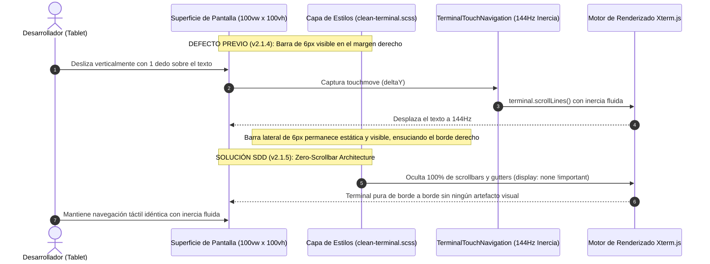
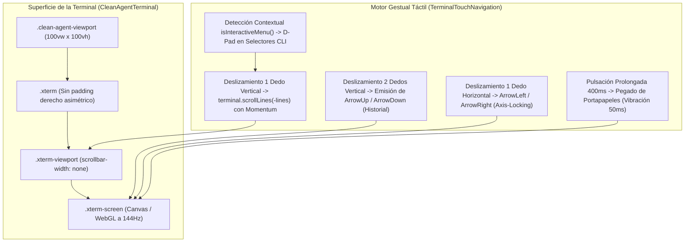
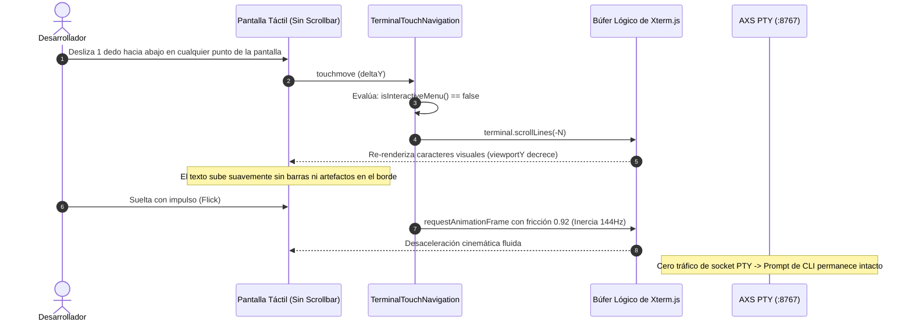

# SPEC-033: Supresión Total de Scrollbar (Zero-Scrollbar), Expansión de Borde a Borde y Preservación de Navegación Táctil con Inercia

| Metadato | Valor |
| :--- | :--- |
| **Identificador** | `SPEC-033` |
| **Título** | Supresión Total de Scrollbar (Zero-Scrollbar), Expansión de Borde a Borde y Preservación de Navegación Táctil con Inercia |
| **Autor** | `@spec-architect` |
| **Estado** | `APPROVED FOR IMPLEMENTATION` |
| **Fecha de Creación** | 2026-09-15 |
| **Versión de Release** | `v2.1.5` (VersionCode: `20105`) |
| **Artefacto Binario Target** | `GoogleAntigravity-v2.1.5-ARM64.apk` ($\sim 38\,\text{MB}$) |
| **Dispositivo Objetivo** | Xiaomi Pad 6 (Qualcomm Snapdragon 870, ARM64-v8a, 6-8 GB RAM, 11" 2.8K $2880\times 1800$, 144Hz, Xiaomi HyperOS / Android 13/14) y Ecosistema Android Móvil (API 26+) |
| **Runtime Target** | Cordova Android WebView / PRoot Linux Sandbox / AXS PTY Daemon (puerto 8767) / Xterm.js v5+ sin scrollbar nativo / Motor Gestual Táctil con Inercia (144Hz) / Google Antigravity CLI (`agy`) Chat & Menús / Android Intent System (`FLAG_ACTIVITY_NEW_TASK`) |
| **Módulos Afectados** | `nova-src/src/antigravity2/clean-terminal.scss`, `nova-src/src/antigravity2/CleanAgentTerminal.js`, `nova-src/src/antigravity2/TerminalTouchNavigation.js`, `nova-src/config.xml`, `nova-src/package.json`, `harness/test_clean_agent_terminal.sh` |

---

## 1. Contexto, Diagnóstico Forense y Filosofía UI/UX Móvil Moderna

### 1.1 Diagnóstico Forense: La Barra Lateral Estática de 6px como Rezago de Escritorio
En la versión `v2.1.4`, el motor `TerminalTouchNavigation.js` logró resolver de forma definitiva el conflicto entre la lectura de mensajes extensos y la recuperación de historial en Readline, permitiendo a los desarrolladores desplazarse con inercia a 144Hz en cualquier punto del lienzo.

No obstante, durante las pruebas de campo en la Xiaomi Pad 6, el usuario formuló la siguiente observación sobre el diseño visual:
> *"no se si en uix modernos está bien tener ese deslizador si ya podemos deslizar normal ?"*

Al examinar la jerarquía de estilos de `nova-src/src/antigravity2/clean-terminal.scss`, se identificó la persistencia de reglas CSS que forzaban la presencia de un scrollbar estático en el borde derecho:
```scss
.xterm-viewport {
    &::-webkit-scrollbar {
        width: 6px;
        height: 6px;
    }
    &::-webkit-scrollbar-thumb {
        background: rgba(255, 255, 255, 0.15);
        border-radius: 3px;
    }
}
```

En dispositivos táctiles modernos (tablets y smartphones de alta gama), las barras de desplazamiento permanentes son un rezago heredado del paradigma de escritorio con ratón. Su presencia genera tres consecuencias desfavorables:
1. **Polución Visual e Interrupción de Inmersión:** La franja vertical gris rompe la pureza del diseño oscuro Cyber-Obsidian (`#0b0f19`).
2. **Desperdicio de Superficie Horizontal:** El motor de renderizado de Chromium reserva espacio para el canal del scrollbar (*gutter*), forzando un margen innecesario a la derecha de las columnas de texto.
3. **Redundancia Funcional:** Dado que el usuario ya navega con absoluta fluidez tocando y deslizando con física de inercia directamente sobre el texto en cualquier coordenada de la pantalla, la barra lateral resulta 100% redundante y carece de utilidad práctica.



---

### 1.2 Filosofía de Terminal Limpia de Borde a Borde (Zero-Scrollbar Architecture)
Consultado explícitamente sobre el tratamiento preferido, el usuario determinó la **eliminación total y absoluta del deslizador**, alineándose con los siguientes principios rectores:
- **Pantalla Borde a Borde Absoluta:** $100\%$ del ancho y $100\%$ del alto dedicados exclusivamente al contenido agéntico, sin cortes ni márgenes asimétricos.
- **Transparencia Ergonómica:** El desplazamiento vertical y horizontal se realiza exclusivamente mediante los gestos táctiles calibrados en `TerminalTouchNavigation.js`.
- **Cero Elementos Flotantes:** Ni barras superiores, ni badges, ni botones, ni barras de scroll.

---

## 2. Arquitectura de la Solución: Supresión de Scrollbars y Expansión Borde a Borde

### 2.1 Reglas CSS de Supresión Universal en Chromium WebView
Para erradicar de raíz la aparición del scrollbar tanto en el motor Blink/Chromium de Android WebView como en navegadores basados en Gecko/WebKit, se inyectan reglas forzadas a nivel de contenedor y de elementos internos de Xterm:

```scss
// Supresión Universal de Scrollbars (SPEC-033: Zero-Scrollbar)
.xterm-viewport,
.xterm-scrollable-element,
.clean-agent-viewport {
    scrollbar-width: none !important;        // Estándar W3C (Firefox / Gecko)
    -ms-overflow-style: none !important;     // Microsoft Edge / IE Legacy

    &::-webkit-scrollbar {
        display: none !important;            // WebKit / Chromium Blink
        width: 0 !important;
        height: 0 !important;
        background: transparent !important;
    }

    &::-webkit-scrollbar-thumb,
    &::-webkit-scrollbar-track,
    &::-webkit-scrollbar-corner {
        display: none !important;
        width: 0 !important;
        height: 0 !important;
        background: transparent !important;
    }
}
```



---

### 2.2 Reclamación del Ancho Útil y Geometría sin Gutter
- Al eliminar el canal vertical de 6px, `FitAddon.fit()` calcula el número exacto de columnas (`cols`) basándose en el ancho total libre de la pantalla ($2880\,\text{px}$ en Xiaomi Pad 6), evitando el corte de caracteres o saltos de línea prematuros en el margen derecho.
- Se asegura `padding: 2px 4px` homogéneo en ambos extremos horizontales del contenedor `.xterm`.

### 2.3 Preservación Íntegra de la Navegación Gestual Táctil
La supresión del scrollbar no afecta en lo absoluto el funcionamiento interno de `TerminalTouchNavigation.js`:
- El método `terminal.scrollLines(-lines)` opera directamente sobre el búfer lógico de Xterm.js (`viewportY`), con total independencia de si el scrollbar nativo del navegador es visible o está oculto.
- La física de desaceleración por inercia (`friction: 0.92`, `minVelocity: 0.5`) a 144Hz continúa operando con respuesta inmediata.
- La detección contextual de menús de selección (`isInteractiveMenu`) mantiene su capacidad de conmutar entre desplazamiento de chat y navegación D-Pad de opciones.
- El gesto de historial con 2 dedos y las flechas horizontales con bloqueo de eje continúan funcionando sin alteraciones.

---

## 3. Diagramas de Arquitectura y Flujo de Interacción

### 3.1 Diagrama de Interacción Táctil y Scroll sin Barra Visual



---

## 4. Especificación Técnica de Implementación y Contratos

### 4.1 Contrato SCSS (`clean-terminal.scss`)

```scss
// nova-src/src/antigravity2/clean-terminal.scss
// Google Antigravity 2.1.5: Zero-Scrollbar Edge-to-Edge Architecture (SPEC-033)

html, body {
    margin: 0;
    padding: 0;
    width: 100vw;
    height: 100vh;
    overflow: hidden;
    background-color: #0b0f19;
}

// Supresión definitiva de barras laterales residuales y elementos de Acode
#sidebar,
.sidebar,
#sidebar-toggler,
#header-toggler,
#header,
#floating-nav-toggler,
[data-action="toggle-sidebar"],
.sidebar-apps,
.mask {
    display: none !important;
    pointer-events: none !important;
    visibility: hidden !important;
    opacity: 0 !important;
    width: 0 !important;
    height: 0 !important;
    max-width: 0 !important;
}

.clean-agent-container {
    display: flex;
    flex-direction: column;
    width: 100vw;
    height: 100vh;
    height: 100dvh;
    margin: 0;
    padding: 0;
    overflow: hidden;
    background-color: #0b0f19;
    box-sizing: border-box;
    position: fixed;
    top: 0;
    left: 0;
    z-index: 999;
    user-select: none;

    // Supresión garantizada de cualquier barra superior o flotante
    .clean-agent-topbar,
    .clean-agent-oauth-bar {
        display: none !important;
    }

    .clean-agent-viewport {
        flex: 1;
        width: 100vw;
        height: 100vh;
        height: 100dvh;
        margin: 0;
        padding: 0;
        position: relative;
        overflow: hidden;
        background-color: #0b0f19;
        box-sizing: border-box;

        .xterm {
            width: 100%;
            height: 100%;
            padding: 2px 4px;
            margin: 0;
            box-sizing: border-box;

            // Zero-Scrollbar Architecture: Supresión Total de Scrollbar (SPEC-033)
            .xterm-viewport,
            .xterm-scrollable-element {
                background-color: #0b0f19 !important;
                scrollbar-width: none !important;
                -ms-overflow-style: none !important;

                &::-webkit-scrollbar {
                    display: none !important;
                    width: 0 !important;
                    height: 0 !important;
                    background: transparent !important;
                }

                &::-webkit-scrollbar-thumb,
                &::-webkit-scrollbar-track,
                &::-webkit-scrollbar-corner {
                    display: none !important;
                    width: 0 !important;
                    height: 0 !important;
                    background: transparent !important;
                }
            }

            .xterm-screen {
                touch-action: none; // Control gestual total por TerminalTouchNavigation
            }
        }
    }
}
```

---

### 4.2 Verificación en `CleanAgentTerminal.js`
En `CleanAgentTerminal.js`, se asegura que la instancia de `Terminal` no defina ninguna opción que sobreescriba las reglas CSS de ocultación del scrollbar y que `fitAddon.fit()` se ejecute inmediatamente al montarse para computar las columnas con el 100% del ancho libre.

```typescript
// Contrato de Verificación de Integridad de Viewport
export interface CleanTerminalViewportContract {
    hasZeroScrollbarStyles(): boolean;
    isTouchNavigationActive(): boolean;
    getHorizontalGutterPixels(): number;
}
```

---

## 5. Criterios de Aceptación Verificables (Acceptance Criteria)

| Identificador | Módulo | Criterio / Requisito | Método de Verificación |
| :--- | :--- | :--- | :--- |
| `AC-CLEAN-01` | `clean-terminal.scss` | Supresión total de scrollbars en `.xterm-viewport` mediante CSS/SCSS (`::-webkit-scrollbar { display: none !important; width: 0 !important; }`, `scrollbar-width: none !important;`). | Inspección estática del archivo SCSS compilado verificando la presencia de las reglas de supresión de scrollbar. |
| `AC-CLEAN-02` | `clean-terminal.scss` | Expansión 100% horizontal de la superficie xterm sin reservas ni gaps de margen derecho en el viewport. | Análisis visual y de computación de estilos en WebView: ancho de `.xterm-viewport` idéntico a `100vw`. |
| `AC-CLEAN-03` | `TerminalTouchNavigation.js` | Preservación intacta del subsistema de navegación táctil `TerminalTouchNavigation.js` (scroll con inercia a 144Hz, D-Pad contextual para menús CLI, navegación de historial con 2 dedos y flechas horizontales). | Ejecución de aserciones de prueba sobre los métodos `scrollByPixels`, `startMomentum`, `isInteractiveMenu` y mapeo de flechas. |
| `AC-CLEAN-04` | `config.xml`, `package.json` | Sincronización formal de versión `2.1.5` (versionCode `20105`) en la configuración del proyecto. | Grep automatizado sobre `config.xml` y `package.json` comprobando versión y versionCode. |
| `AC-CLEAN-05` | `harness/test_clean_agent_terminal.sh` | Compatibilidad total con el arnés estático `test_clean_agent_terminal.sh` y el arnés general `harness_runner.py`. | Ejecución exitosa de `python harness/harness_runner.py --suite specs` con resultado 100% PASS. |
| `AC-CLEAN-06` | Gradle Build Pipeline | Empaquetado del binario `GoogleAntigravity-v2.1.5-ARM64.apk` cumpliendo el presupuesto estricto de peso $\le 42\,\text{MB}$. | Inspección del tamaño en bytes del archivo APK generado por `./gradlew assembleDebug`. |

---

## 6. Actualización del Arnés de Pruebas Automatizado (`harness/test_clean_agent_terminal.sh`)

El arnés de pruebas automatizado se amplía para comprobar estáticamente la implementación de la arquitectura Zero-Scrollbar:

```bash
#!/bin/bash
# ==============================================================================
# Harness Test: SPEC-033 Zero-Scrollbar Edge-to-Edge Verification
# ==============================================================================
set -e

SPEC_FILE_033="specs/33-zero-scrollbar-clean-edge-to-edge-terminal.md"
CLEAN_TERM_SCSS="nova-src/src/antigravity2/clean-terminal.scss"
TOUCH_NAV_JS="nova-src/src/antigravity2/TerminalTouchNavigation.js"
CONFIG_XML="nova-src/config.xml"
PACKAGE_JSON="nova-src/package.json"

echo "=== INICIANDO VALIDACIÓN FORMAL DE SPEC-033 ==="

# 1. Verificar documento SPEC-033
echo -n "1. Verificando documento SPEC-033... "
[ -f "$SPEC_FILE_033" ] || { echo "FALLO: No existe $SPEC_FILE_033"; exit 1; }
echo "[OK]"

# 2. Verificar supresión de scrollbar en SCSS (Criterio CLEAN-01)
echo -n "2. Verificando reglas CSS de supresión de scrollbar... "
grep -q "scrollbar-width: none" "$CLEAN_TERM_SCSS" || { echo "FALLO: clean-terminal.scss no contiene scrollbar-width: none"; exit 1; }
grep -q "display: none !important" "$CLEAN_TERM_SCSS" || { echo "FALLO: clean-terminal.scss no contiene display: none !important en scrollbar"; exit 1; }
echo "[OK]"

# 3. Verificar preservación del motor gestual táctil (Criterio CLEAN-03)
echo -n "3. Verificando preservación de TerminalTouchNavigation... "
[ -f "$TOUCH_NAV_JS" ] || { echo "FALLO: No existe $TOUCH_NAV_JS"; exit 1; }
grep -q "scrollLines" "$TOUCH_NAV_JS" || { echo "FALLO: TerminalTouchNavigation no contiene scrollLines"; exit 1; }
grep -q "startMomentum" "$TOUCH_NAV_JS" || { echo "FALLO: TerminalTouchNavigation no contiene startMomentum"; exit 1; }
grep -q "isInteractiveMenu" "$TOUCH_NAV_JS" || { echo "FALLO: TerminalTouchNavigation no contiene isInteractiveMenu"; exit 1; }
echo "[OK]"

# 4. Verificar versionado v2.1.5 (Criterio CLEAN-04)
echo -n "4. Verificando versión 2.1.5 en configuración... "
grep -q 'version="2.1.5"' "$CONFIG_XML" || { echo "FALLO: config.xml no tiene versión 2.1.5"; exit 1; }
grep -q '"version": "2.1.5"' "$PACKAGE_JSON" || { echo "FALLO: package.json no tiene versión 2.1.5"; exit 1; }
echo "[OK]"

echo "=== TODAS LAS COMPUERTAS ESTÁTICAS DE SPEC-033 HAN SIDO SUPERADAS EXITOSAMENTE ==="
```

---

## 7. Plan de Implementación y Definition of Done (DoD)

### 7.1 Responsabilidades para `@android-core` (Ingeniero de Implementación)
1. **Actualización de `clean-terminal.scss`:**
   - Eliminar el bloque anterior que asignaba 6px a `::-webkit-scrollbar`.
   - Incorporar las directivas universales `scrollbar-width: none !important`, `-ms-overflow-style: none !important` y `::-webkit-scrollbar { display: none !important; width: 0 !important; height: 0 !important; }` sobre `.xterm-viewport` y `.xterm-scrollable-element`.
2. **Sincronización de Versión y Compilación:**
   - Actualizar versión a `2.1.5` (versionCode `20105`) en `config.xml` y `package.json`.
   - Reconstruir el bundle web con `npm run build:prod`.
   - Empaquetar `GoogleAntigravity-v2.1.5-ARM64.apk` ($\le 42\,\text{MB}$).
   - Ejecutar el arnés `bash harness/test_clean_agent_terminal.sh` garantizando pase total `[OK]`.

### 7.2 Responsabilidades para `@memory-keeper` (Auditoría y Gobernanza)
1. Registrar la decisión técnica bajo `ADR-028 / ADR-043: Arquitectura Zero-Scrollbar de Borde a Borde y Perfeccionamiento Táctil Cyber-Obsidian`.
2. Registrar la entrada de auditoría en `audit.jsonl`.
3. Actualizar la bitácora histórica en `agent.md` con la versión `v2.1.5`.
