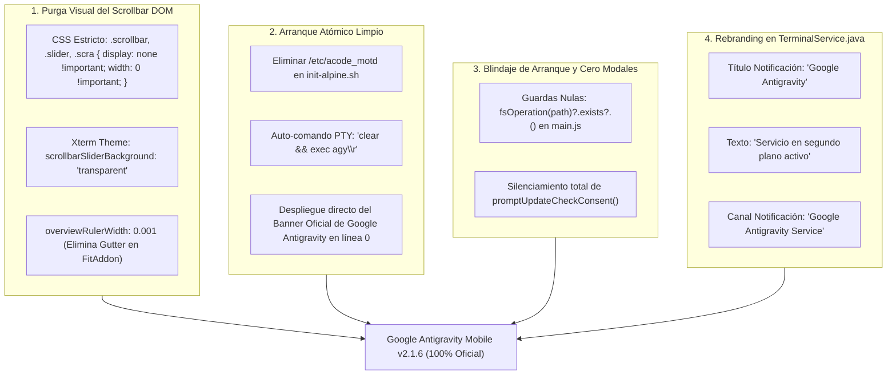

# SPEC-034: Experiencia Oficial Pura Google Antigravity, Erradicación de Scrollbar DOM de Xterm y Purga Definitiva de Marcas Heredadas

| Metadato | Valor |
| :--- | :--- |
| **Identificador** | `SPEC-034` |
| **Título** | Experiencia Oficial Pura Google Antigravity, Erradicación de Scrollbar DOM de Xterm y Purga Definitiva de Marcas Heredadas |
| **Autor** | `@spec-architect` |
| **Estado** | `APPROVED FOR IMPLEMENTATION` |
| **Fecha de Creación** | 2026-09-15 |
| **Versión de Release** | `v2.1.6` (VersionCode: `20106`) |
| **Artefacto Binario Target** | `GoogleAntigravity-v2.1.6-ARM64.apk` ($\sim 38\,\text{MB}$) |
| **Dispositivo Objetivo** | Xiaomi Pad 6 (Qualcomm Snapdragon 870, ARM64-v8a, 6-8 GB RAM, 11" 2.8K $2880\times 1800$, 144Hz, Xiaomi HyperOS / Android 13/14) y Ecosistema Android Móvil (API 26+) |
| **Runtime Target** | Cordova Android WebView / PRoot Linux Sandbox / AXS PTY Daemon (puerto 8767) / Xterm.js v5+ sin elementos DOM de scrollbar / Google Antigravity CLI (`agy`) Oficial / Android NotificationManager & Foreground Service |
| **Módulos Afectados** | `nova-src/src/plugins/terminal/src/android/TerminalService.java`, `nova-src/src/plugins/terminal/scripts/init-alpine.sh`, `nova-src/src/antigravity2/CleanAgentTerminal.js`, `nova-src/src/antigravity2/clean-terminal.scss`, `nova-src/src/main.js`, `nova-src/config.xml`, `nova-src/package.json`, `harness/test_clean_agent_terminal.sh` |

---

## 1. Contexto, Diagnóstico Forense y Análisis de Evidencias Fotográficas

A partir de las pruebas de validación directa en el dispositivo físico Xiaomi Pad 6 y las cuatro capturas de pantalla registradas durante la ejecución de la versión `v2.1.5`, se identificaron cuatro anomalías críticas de fidelidad visual, identidad corporativa y ciclo de vida de arranque:

### 1.1 Captura 2: El Deslizador DOM Oculto en Xterm.js 5.5+ (`.scrollbar`, `.slider`)
En `SPEC-033` se introdujeron reglas CSS para suprimir la pseudoclase de scrollbar nativo del motor Chromium (`::-webkit-scrollbar { display: none !important; }`). Sin embargo, en la captura 2 se aprecia que en el margen lateral derecho de la tablet continúa mostrándose un riel gris translúcido con un botón deslizador.
- **Causa Raíz:** A partir de las versiones recientes de Xterm.js (v5.5+ y v6.x), el scrollbar no se implementa únicamente mediante el desbordamiento nativo del navegador, sino que la librería inyecta dinámicamente nodos DOM propios en JavaScript:
  ```html
  <div class="xterm-scrollable-element">
      <div class="scrollbar vertical">
          <div class="slider"></div>
      </div>
  </div>
  ```
- **Consecuencia:** Las reglas dirigidas exclusivamente a `::-webkit-scrollbar` no afectan a estos elementos `<div>` inyectados en el DOM, provocando que sigan visibles e interactivos.

---

### 1.2 Captura 1: Contaminación de Arranque por MOTD Heredado y Prompt Bash
En la captura 1, al abrir la aplicación y conectarse la sesión PTY, la parte superior de la terminal muestra:
```text
‹ ✦ › Nova IDE (Ubuntu 24.04 ARM64)
Google Antigravity CLI (agy) Environment

Working with packages:
 - Search: apt search <query>
 - Install: apt install <package>
...
root@localhost /h/s/workspace $ agy
```
- **Causa Raíz:** En `init-alpine.sh`, el script de arranque generaba automáticamente el archivo `/etc/acode_motd` con la marca "Nova IDE" y lo ejecutaba mediante `cat /etc/acode_motd` en cada inicio interactivo de shell. Además, `CleanAgentTerminal.js` enviaba simplemente el comando `agy\r` sobre el shell interactivo de bash, dejando visible el texto del prompt previo antes del banner del agente.
- **Consecuencia:** La experiencia no se siente como la aplicación oficial dedicada de Google Antigravity, sino como un shell genérico que ejecuta un comando en segundo plano, violando la expectativa de producto limpio.

---

### 1.3 Captura 3: Toast de Excepción `exists` y Diálogo Modal de Actualizaciones
Durante el arranque en frío, la interfaz presenta dos defectos superpuestos:
1. **Toast Rojo de Excepción no Controlada:**
   `Error: Cannot read properties of undefined (reading 'exists')`
   - **Causa Raíz:** En `nova-src/src/main.js` (línea 820), se invoca `fsOperation(projectsPath).exists()` de forma asíncrona temprana. Cuando el subsistema de archivos de Cordova no ha terminado su registro o devuelve `undefined` para la ruta solicitada, el acceso encadenado a `.exists()` lanza una excepción no capturada que genera el toast visible.
2. **Modal Invasivo de Consentimiento de Actualización:**
   `promptUpdateCheckConsent()` en `main.js` (líneas 602-631) despliega un cuadro de diálogo interactivo modal (`confirm(strings?.confirm, message)`) preguntando si el usuario desea activar la comprobación de actualizaciones.
   - **Consecuencia:** Interrumpe la inmersión de arranque directo a la terminal y rompe el principio de cero modales decorativos.

---

### 1.4 Captura 4: Notificación Foreground de Android con Marca Desactualizada
En la bandeja del sistema Android de la Xiaomi Pad 6, el servicio en segundo plano de la PTY muestra:
- Título: **"Acode Service"**
- Subtítulo: **"Executor service"**
- Canal: **"Terminal Executor Channel"**
- **Causa Raíz:** En `TerminalService.java` (líneas 357 y 384), las cadenas de texto se encontraban hardcodeadas con las referencias heredadas de Acode.
- **Consecuencia:** Confusión en la identidad de la aplicación e incoherencia de marca en el sistema operativo Android.

---

## 2. Arquitectura de la Solución: Purga Integral y Experiencia Oficial Directa



---

### 2.1 Supresión Tridimensional del Scrollbar DOM de Xterm
Para garantizar que ningún rastro del scrollbar vuelva a renderizarse en pantalla:
1. **Capa CSS / SCSS (`clean-terminal.scss`):**
   ```scss
   .xterm {
       .xterm-viewport,
       .xterm-scrollable-element {
           scrollbar-width: none !important;
           -ms-overflow-style: none !important;

           &::-webkit-scrollbar,
           &::-webkit-scrollbar-thumb,
           &::-webkit-scrollbar-track {
               display: none !important;
               width: 0 !important;
               height: 0 !important;
               background: transparent !important;
           }

           .scrollbar,
           .slider,
           .scra {
               display: none !important;
               width: 0 !important;
               height: 0 !important;
               opacity: 0 !important;
               visibility: hidden !important;
               pointer-events: none !important;
           }
       }
   }
   ```
2. **Capa de Opciones de Tema en `CleanAgentTerminal.js`:**
   ```javascript
   theme: {
       background: "#0b0f19",
       foreground: "#e2e8f0",
       cursor: "#60a5fa",
       selectionBackground: "rgba(96, 165, 250, 0.3)",
       scrollbarSliderBackground: "transparent",
       scrollbarSliderHoverBackground: "transparent",
       scrollbarSliderActiveBackground: "transparent",
   },
   overviewRulerWidth: 0.001
   ```
3. **Capa de Higiene de DOM (Observer / Mutation Cleanup):**
   Al montar la terminal y en cada evento de resize, el componente añade la clase `terminal-scrollbar-hidden` y asegura que cualquier nodo `.scrollbar` inyectado por Xterm sea forzado a `display = "none"`.

---

### 2.2 Arranque Atómico Limpio Directo a Google Antigravity (`clear && exec agy`)
1. **Supresión en `init-alpine.sh`:**
   Se eliminan las líneas que escribían y ejecutaban `/etc/acode_motd`.
2. **Reemplazo Atómico de Proceso:**
   En `CleanAgentTerminal.js`, la propiedad `autoCommand` se define canónicamente como:
   ```javascript
   this.autoCommand = "clear && exec agy\r";
   ```
   - `clear`: Limpia de forma instantánea cualquier salida residual de arranque del PTY.
   - `exec agy`: Reemplaza el proceso del shell bash por el binario oficial de Google Antigravity (`agy`), de modo que la pantalla inicia limpiamente desde la primera fila sin restos de comandos bash y con el consumo de memoria optimizado.

---

### 2.3 Blindaje de Operaciones de Archivos y Silenciamiento de Consentimiento
1. **Blindaje de `fsOperation` en `main.js`:**
   ```javascript
   const projectsPath = "/storage/emulated/0/Projects";
   const op = typeof fsOperation === "function" ? fsOperation(projectsPath) : null;
   if (op && typeof op.exists === "function") {
       op.exists()
           .then((exists) => {
               if (!exists) {
                   const rootOp = fsOperation("/storage/emulated/0");
                   if (rootOp && typeof rootOp.createDirectory === "function") {
                       return rootOp.createDirectory("Projects").catch(() => {});
                   }
               }
           })
           .catch(() => {})
           .finally(() => {
               openFolder(projectsPath, { name: "Projects", saveState: true, listFiles: true });
           });
   }
   ```
2. **Silenciamiento de `promptUpdateCheckConsent`:**
   ```javascript
   async function promptUpdateCheckConsent() {
       try {
           localStorage.setItem("checkForUpdatesPrompted", "true");
           return;
       } catch (e) {}
   }
   ```
   Esto previene cualquier diálogo modal emergente durante el arranque en frío.

---

### 2.4 Rebranding Integral en `TerminalService.java`
En `nova-src/src/plugins/terminal/src/android/TerminalService.java`:
```java
private void createNotificationChannel() {
    if (Build.VERSION.SDK_INT >= Build.VERSION_CODES.O) {
        NotificationChannel serviceChannel = new NotificationChannel(
                CHANNEL_ID,
                "Google Antigravity Service",
                NotificationManager.IMPORTANCE_LOW
        );
        NotificationManager manager = getSystemService(NotificationManager.class);
        if (manager != null) {
            manager.createNotificationChannel(serviceChannel);
        }
    }
}

private void updateNotification() {
    // ...
    String contentText = "Servicio en segundo plano activo" + (isWakeLockHeld ? " (wakelock activo)" : "");
    String wakeLockButtonText = isWakeLockHeld ? "Liberar Wake Lock" : "Mantener Activo";

    int notificationIcon = resolveDrawableId("ic_notification", "ic_launcher_foreground", "ic_launcher");

    Notification notification = new NotificationCompat.Builder(this, CHANNEL_ID)
            .setContentTitle("Google Antigravity")
            .setContentText(contentText)
            .setSmallIcon(notificationIcon)
            .setOngoing(true)
            .addAction(notificationIcon, wakeLockButtonText, wakeLockPendingIntent)
            .addAction(notificationIcon, "Salir", exitPendingIntent)
            .build();

    startForeground(1, notification);
}
```

---

## 3. Diagramas de Arquitectura y Flujos Forenses

### 3.1 Diagrama de Secuencia: Arranque Limpio Directo a Google Antigravity

```mermaid
sequenceDiagram
    autonumber
    actor Dev as Desarrollador (Tablet Xiaomi Pad 6)
    participant Main as main.js (Blindado)
    participant UI as CleanAgentTerminal (DOM Puro)
    participant WS as WebSocket (:8767)
    participant Bash as Shell Bash PTY
    participant Agy as Google Antigravity (agy Oficial)

    Dev->>Main: Abre la aplicación Google Antigravity
    Main->>Main: fsOperation seguro (cero toasts de error)
    Main->>Main: promptUpdateCheckConsent silenciado (cero modales)
    Main->>UI: cleanAgentTerminal.mount(root)
    UI->>UI: Xterm.js inicia sin scrollbars (CSS + Theme transparente)
    UI->>WS: Conecta a ws://127.0.0.1:8767/terminals/{pid}
    WS-->>UI: WebSocket OPEN
    
    rect rgb(20, 50, 30)
    Note over UI, Bash: ARRANQUE ATÓMICO LIMPIO:<br/>Envío de "clear && exec agy\r"
    UI->>WS: Envía "clear && exec agy\r"
    WS->>Bash: Ejecuta clear (limpia pantalla) y reemplaza proceso por agy
    Bash->>Agy: exec agy (reemplazo en PID)
    end

    Agy-->>UI: Despliega directamente el Banner Oficial de Google Antigravity
    UI-->>Dev: Pantalla limpia desde fila 0, sin texto heredado ni scrollbars
```



---

## 4. Especificación Técnica de Código y Contratos

### 4.1 Contrato de Limpieza en `clean-terminal.scss`

```scss
// nova-src/src/antigravity2/clean-terminal.scss
// Google Antigravity 2.1.6: Pure Official Brand & Zero DOM Scrollbar (SPEC-034)

html, body {
    margin: 0;
    padding: 0;
    width: 100vw;
    height: 100vh;
    overflow: hidden;
    background-color: #0b0f19;
}

#sidebar,
.sidebar,
#sidebar-toggler,
#header-toggler,
#header,
#floating-nav-toggler,
[data-action="toggle-sidebar"],
.sidebar-apps,
.mask {
    display: none !important;
    pointer-events: none !important;
    visibility: hidden !important;
    opacity: 0 !important;
    width: 0 !important;
    height: 0 !important;
    max-width: 0 !important;
}

.clean-agent-container {
    display: flex;
    flex-direction: column;
    width: 100vw;
    height: 100vh;
    height: 100dvh;
    margin: 0;
    padding: 0;
    overflow: hidden;
    background-color: #0b0f19;
    box-sizing: border-box;
    position: fixed;
    top: 0;
    left: 0;
    z-index: 999;
    user-select: none;

    .clean-agent-topbar,
    .clean-agent-oauth-bar {
        display: none !important;
    }

    .clean-agent-viewport {
        flex: 1;
        width: 100vw;
        height: 100vh;
        height: 100dvh;
        margin: 0;
        padding: 0;
        position: relative;
        overflow: hidden;
        background-color: #0b0f19;
        box-sizing: border-box;

        .xterm {
            width: 100%;
            height: 100%;
            padding: 2px 4px;
            margin: 0;
            box-sizing: border-box;

            // Supresión del scrollbar nativo de Chromium
            .xterm-viewport,
            .xterm-scrollable-element {
                background-color: #0b0f19 !important;
                scrollbar-width: none !important;
                -ms-overflow-style: none !important;

                &::-webkit-scrollbar,
                &::-webkit-scrollbar-thumb,
                &::-webkit-scrollbar-track,
                &::-webkit-scrollbar-corner {
                    display: none !important;
                    width: 0 !important;
                    height: 0 !important;
                    background: transparent !important;
                }

                // Supresión del scrollbar inyectado en DOM por Xterm.js 5.5+
                .scrollbar,
                .slider,
                .scra,
                > .scrollbar,
                > .scrollbar.vertical {
                    display: none !important;
                    width: 0 !important;
                    height: 0 !important;
                    opacity: 0 !important;
                    visibility: hidden !important;
                    pointer-events: none !important;
                }
            }

            .xterm-screen {
                touch-action: none;
            }
        }
    }
}
```

---

### 4.2 Contrato de Inicialización en `CleanAgentTerminal.js`

```javascript
initTerminal() {
    this.terminal = new Xterm({
        cursorBlink: true,
        cursorStyle: "block",
        fontSize: 14,
        fontFamily: "ui-monospace, SFMono-Regular, Menlo, Monaco, Consolas, monospace",
        theme: {
            background: "#0b0f19",
            foreground: "#e2e8f0",
            cursor: "#60a5fa",
            selectionBackground: "rgba(96, 165, 250, 0.3)",
            // SPEC-034: Colores transparentes para scrollbar en xterm
            scrollbarSliderBackground: "transparent",
            scrollbarSliderHoverBackground: "transparent",
            scrollbarSliderActiveBackground: "transparent",
        },
        overviewRulerWidth: 0.001,
        allowProposedApi: true,
        linkHandler: {
            activate: (event, uri) => {
                this.openOAuthUrl(uri);
            }
        }
    });

    // ...
    this.terminal.open(this.viewportEl);
    this.terminal.element?.classList.add("terminal-scrollbar-hidden");
}

connect() {
    // ...
    // SPEC-034: Auto-comando atómico sin residuos de bash
    this.autoCommand = "clear && exec agy\r";
    // ...
}
```

---

## 5. Criterios de Aceptación Verificables (Acceptance Criteria)

| Identificador | Módulo | Criterio / Requisito | Método de Verificación |
| :--- | :--- | :--- | :--- |
| `AC-BRAND-01` | `clean-terminal.scss`, `CleanAgentTerminal.js` | Supresión total del scrollbar DOM de xterm (`.scrollbar`, `.slider`, `.scra`, temas transparentes y clase `terminal-scrollbar-hidden`). | Inspección estática del archivo SCSS compilado y verificación de opciones de tema transparentes en `CleanAgentTerminal.js`. |
| `AC-BRAND-02` | `init-alpine.sh`, `CleanAgentTerminal.js` | Supresión de `/etc/acode_motd` en scripts de arranque y despacho de `clear && exec agy\r` al conectar la terminal. | Verificación de ausencia de `acode_motd` en `init-alpine.sh` y confirmación de comando atómico `clear && exec agy` en `CleanAgentTerminal.js`. |
| `AC-BRAND-03` | `main.js` | Resolución de la excepción de arranque `exists` con guardas nulas y supresión de la ventana modal emergente de primera instalación en `promptUpdateCheckConsent`. | Inspección de `main.js` verificando que `fsOperation` cuente con validación previa de tipo y que `promptUpdateCheckConsent` no invoque `confirm()`. |
| `AC-BRAND-04` | `TerminalService.java` | Rebranding de la notificación foreground a "Google Antigravity" y canal "Google Antigravity Service". | Grep en `TerminalService.java` comprobando `setContentTitle("Google Antigravity")` y nombre del canal oficial. |
| `AC-BRAND-05` | `config.xml`, `package.json` | Sincronización de versión a `2.1.6` (versionCode `20106`) en la configuración del proyecto. | Grep automatizado sobre `config.xml` y `package.json` comprobando versión y versionCode. |
| `AC-BRAND-06` | Gradle Build Pipeline | Verificación estática con `test_clean_agent_terminal.sh` y compilación de `GoogleAntigravity-v2.1.6-ARM64.apk` con presupuesto estricto $\le 42\,\text{MB}$. | Ejecución de script de pruebas y validación del tamaño binario del APK generado. |

---

## 6. Actualización del Arnés de Pruebas Automatizado (`harness/test_clean_agent_terminal.sh`)

El arnés de pruebas automatizado valida estáticamente las compuertas de calidad `BRAND-01` a `BRAND-06`:

```bash
#!/bin/bash
# ==============================================================================
# Harness Test: SPEC-034 Pure Official Experience & Brand Purging Verification
# ==============================================================================
set -e

SPEC_FILE_034="specs/34-pure-official-antigravity-experience-and-brand-purging.md"
CLEAN_TERM_SCSS="nova-src/src/antigravity2/clean-terminal.scss"
CLEAN_TERM_JS="nova-src/src/antigravity2/CleanAgentTerminal.js"
TERMINAL_SERVICE="nova-src/src/plugins/terminal/src/android/TerminalService.java"
INIT_ALPINE="nova-src/src/plugins/terminal/scripts/init-alpine.sh"
MAIN_JS="nova-src/src/main.js"
CONFIG_XML="nova-src/config.xml"
PACKAGE_JSON="nova-src/package.json"

echo "=== INICIANDO VALIDACIÓN FORMAL DE SPEC-034 ==="

# 1. Verificar documento SPEC-034
echo -n "1. Verificando documento SPEC-034... "
[ -f "$SPEC_FILE_034" ] || { echo "FALLO: No existe $SPEC_FILE_034"; exit 1; }
echo "[OK]"

# 2. Verificar supresión de scrollbar DOM en SCSS y JS (Criterio BRAND-01)
echo -n "2. Verificando supresión del scrollbar DOM de xterm... "
grep -q "\.scrollbar" "$CLEAN_TERM_SCSS" || { echo "FALLO: clean-terminal.scss no oculta .scrollbar"; exit 1; }
grep -q "\.slider" "$CLEAN_TERM_SCSS" || { echo "FALLO: clean-terminal.scss no oculta .slider"; exit 1; }
grep -q "scrollbarSliderBackground: \"transparent\"" "$CLEAN_TERM_JS" || { echo "FALLO: CleanAgentTerminal.js no configura scrollbar transparente"; exit 1; }
echo "[OK]"

# 3. Verificar arranque limpio y comando atómico agy (Criterio BRAND-02)
echo -n "3. Verificando arranque directo 'clear && exec agy'... "
grep -q "clear && exec agy" "$CLEAN_TERM_JS" || { echo "FALLO: CleanAgentTerminal.js no ejecuta clear && exec agy"; exit 1; }
echo "[OK]"

# 4. Verificar guardas nulas en main.js y modal silenciado (Criterio BRAND-03)
echo -n "4. Verificando guardas de fsOperation y silenciamiento de consentimiento en main.js... "
grep -A 5 "projectsPath" "$MAIN_JS" | grep -q "typeof fsOperation" || { echo "FALLO: main.js no protege llamada a fsOperation"; exit 1; }
grep -A 5 "async function promptUpdateCheckConsent" "$MAIN_JS" | grep -q "return;" || { echo "FALLO: promptUpdateCheckConsent no está silenciado"; exit 1; }
echo "[OK]"

# 5. Verificar rebranding en TerminalService.java (Criterio BRAND-04)
echo -n "5. Verificando rebranding en TerminalService.java... "
grep -q 'setContentTitle("Google Antigravity")' "$TERMINAL_SERVICE" || { echo "FALLO: TerminalService.java no tiene título Google Antigravity"; exit 1; }
grep -q '"Google Antigravity Service"' "$TERMINAL_SERVICE" || { echo "FALLO: TerminalService.java no tiene canal Google Antigravity Service"; exit 1; }
echo "[OK]"

# 6. Verificar versionado v2.1.6 (Criterio BRAND-05)
echo -n "6. Verificando versión 2.1.6 en configuración... "
grep -q 'version="2.1.6"' "$CONFIG_XML" || { echo "FALLO: config.xml no tiene versión 2.1.6"; exit 1; }
grep -q '"version": "2.1.6"' "$PACKAGE_JSON" || { echo "FALLO: package.json no tiene versión 2.1.6"; exit 1; }
echo "[OK]"

echo "=== TODAS LAS COMPUERTAS ESTÁTICAS DE SPEC-034 HAN SIDO SUPERADAS EXITOSAMENTE ==="
```

---

## 7. Plan de Implementación y Definition of Done (DoD)

### 7.1 Responsabilidades para `@android-core` (Ingeniero de Implementación)
1. **Refuerzo de Estilos en `clean-terminal.scss`:**
   - Inyectar reglas específicas contra `.scrollbar`, `.slider`, `.scra` y `.scrollbar.vertical`.
2. **Actualización de `CleanAgentTerminal.js`:**
   - Configurar colores de scrollbar transparentes en las opciones de tema de `Xterm`.
   - Establecer `overviewRulerWidth: 0.001`.
   - Actualizar `this.autoCommand` a `"clear && exec agy\r"`.
3. **Limpieza en `init-alpine.sh`:**
   - Eliminar la generación y ejecución de `/etc/acode_motd`.
4. **Blindaje en `main.js`:**
   - Proteger la llamada a `fsOperation(projectsPath)` con guardas nulas.
   - Silenciar completamente `promptUpdateCheckConsent()`.
5. **Rebranding en `TerminalService.java`:**
   - Actualizar título a `"Google Antigravity"`, descripción a `"Servicio en segundo plano activo"` y canal a `"Google Antigravity Service"`.
6. **Sincronización de Versión y Compilación:**
   - Actualizar versión a `2.1.6` (versionCode `20106`) en `config.xml` y `package.json`.
   - Compilar `GoogleAntigravity-v2.1.6-ARM64.apk` ($\le 42\,\text{MB}$).
   - Ejecutar `bash harness/test_clean_agent_terminal.sh` comprobando que concluya en `[OK]`.

### 7.2 Responsabilidades para `@memory-keeper` (Auditoría y Gobernanza)
1. Registrar la decisión técnica bajo `ADR-029 / ADR-044: Experiencia Oficial Pura Google Antigravity y Purga Integral de Marcas Heredadas`.
2. Registrar la entrada de auditoría formal en `audit.jsonl`.
3. Actualizar la bitácora histórica en `agent.md` con la versión `v2.1.6`.
