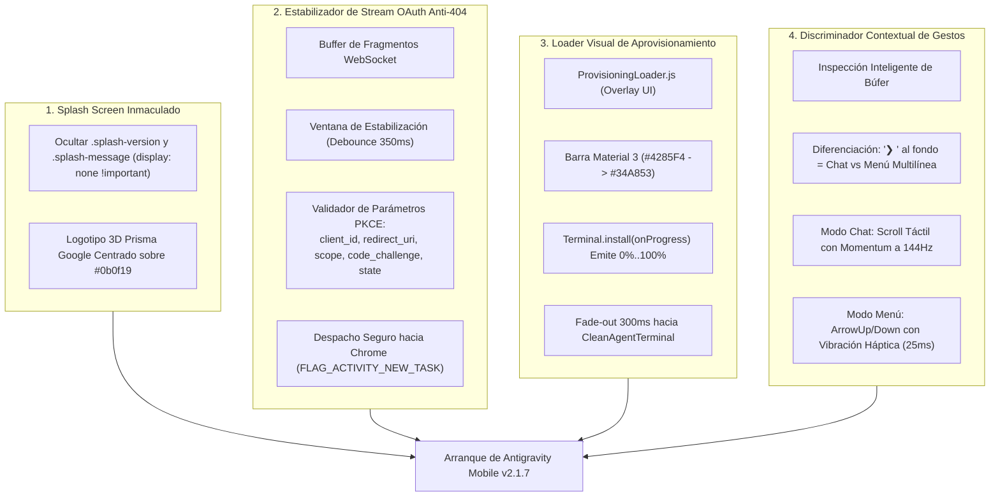
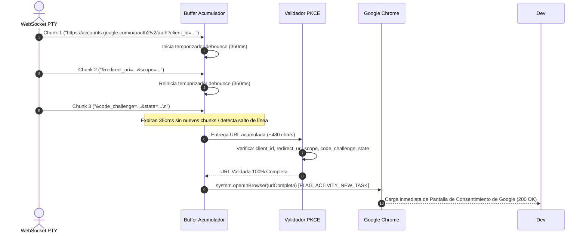
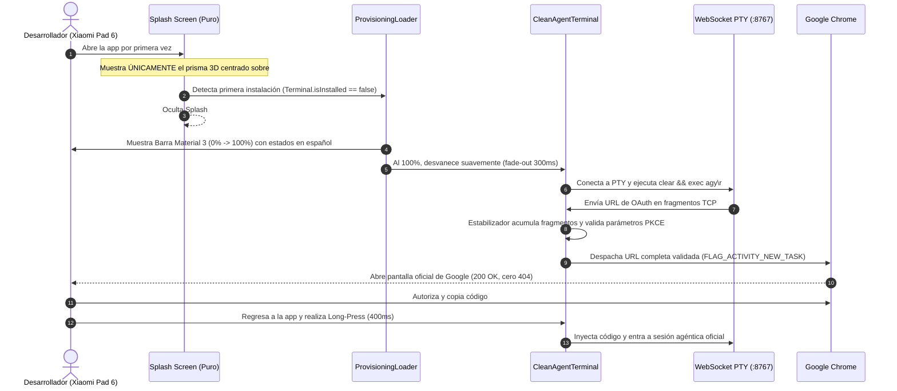

# SPEC-035: Experiencia de Splash Pura, Estabilizador de Stream OAuth Anti-404, Loader Visual de Aprovisionamiento y Discriminador de Gestos

| Metadato | Valor |
| :--- | :--- |
| **Identificador** | `SPEC-035` |
| **Título** | Experiencia de Splash Pura, Estabilizador de Stream OAuth Anti-404, Loader Visual de Aprovisionamiento y Discriminador de Gestos |
| **Autor** | `@spec-architect` |
| **Estado** | `APPROVED FOR IMPLEMENTATION` |
| **Fecha de Creación** | 2026-09-15 |
| **Versión de Release** | `v2.1.7` (VersionCode: `20107`) |
| **Artefacto Binario Target** | `GoogleAntigravity-v2.1.7-ARM64.apk` ($\le 42.0\,\text{MB}$) |
| **Dispositivo Objetivo** | Xiaomi Pad 6 (Qualcomm Snapdragon 870, ARM64-v8a, 6-8 GB RAM, 11" 2.8K $2880\times 1800$, 144Hz, Xiaomi HyperOS / Android 13/14) y Ecosistema Android Móvil (API 26+) |
| **Runtime Target** | Cordova Android WebView / PRoot Linux Sandbox / AXS PTY Daemon (puerto 8767) / Xterm.js v5+ con Discriminador Contextual de Gestos / Google Antigravity CLI (`agy`) / Android Intent System (`FLAG_ACTIVITY_NEW_TASK`) |
| **Módulos Afectados** | `nova-src/www/index.html`, `nova-src/src/main.js`, `nova-src/src/antigravity2/CleanAgentTerminal.js`, `nova-src/src/antigravity2/ProvisioningLoader.js`, `nova-src/src/antigravity2/TerminalTouchNavigation.js`, `nova-src/src/antigravity2/clean-terminal.scss`, `nova-src/src/plugins/terminal/www/Terminal.js`, `nova-src/config.xml`, `nova-src/package.json`, `harness/test_clean_agent_terminal.sh` |

---

## 1. Contexto, Diagnóstico Forense y Análisis de Causa Raíz

Tras las pruebas de campo en la Xiaomi Pad 6 con la versión `v2.1.6`, se constataron avances significativos en la pureza visual de la terminal. No obstante, se identificaron cuatro deficiencias críticas que degradan la experiencia de usuario en el primer arranque y durante la interacción conversacional:

### 1.1 Contaminación de Textos de Depuración en Splash Screen
Al iniciar la aplicación, la pantalla de splash (`#splash`) despliega dos elementos textuales superpuestos al logotipo oficial:
- `.splash-version`: Código de versión y fecha de build en la esquina superior izquierda.
- `.splash-message`: Mensajes de estado transitorios heredados como *"Loading folders..."* en la parte inferior.
- **Causa Raíz:** En `www/index.html`, los contenedores `.splash-version` y `.splash-message` están declarados en el DOM estático y enlazados a atributos `data-version` y `data-small-msg` de `document.body`, manipulados por `main.js`.
- **Impacto:** Rompe el estándar de producto comercial de Google Antigravity, proyectando la apariencia de un entorno de pruebas o depuración en lugar de una pantalla de bienvenida inmaculada.

---

### 1.2 Diagnóstico del Error 404 en Google OAuth por Fragmentación de Stream PTY
Durante el flujo de autenticación Google OAuth 2.0 PKCE, al abrirse Google Chrome en el dispositivo físico, el navegador desplegaba la página de error:
`accounts.google.com/signin/oauth/error (HTTP 404 / Parámetros Faltantes)`

```mermaid
sequenceDiagram
    autonumber
    actor CLI as agy (PTY Linux)
    participant WS as WebSocket (:8767)
    participant App as CleanAgentTerminal
    participant Chrome as Google Chrome

    CLI->>WS: Emite URL OAuth (~480 bytes) dividida en chunks TCP
    WS->>App: Chunk 1 (~200 bytes): "https://accounts.google.com/o/oauth2/v2/auth?client_id=1071..."
    
    rect rgb(60, 20, 20)
    Note over App: DEFECTO FORENSE PREVIO:<br/>OAUTH_REGEX disparaba inmediatamente en el primer chunk.<br/>URL truncada sin redirect_uri, scope, code_challenge.
    App->>Chrome: system.openInBrowser(urlTruncada)
    end

    WS->>App: Chunk 2 (~280 bytes): "&redirect_uri=...&scope=...&code_challenge=..."
    Note over App: Chunk 2 llega demasiado tarde, Chrome ya cargó URL inválida

    Chrome-->>App: Google responde con pantalla de error 404 (Parámetros Faltantes)
```



- **Causa Raíz:** La PTY emite la URL completa de autorización dividida en múltiples tramas de red WebSocket (fragmentación por tamaño de buffer de lectura PTY en AXS). El detector previo ejecutaba la expresión regular sobre el primer fragmento recibido e invocaba inmediatamente `system.openInBrowser()`. La URL despachada carecía de parámetros indispensables (`redirect_uri`, `scope`, `code_challenge`, `state`), provocando el rechazo inmediato de Google.

---

### 1.3 Ausencia de Retroalimentación Visual Durante la Extracción Inicial de Linux
En un arranque en frío (*clean install*), la extracción del rootfs y los binarios de Antigravity toma entre 4 y 8 segundos.
- **Defecto Previo:** La aplicación se limitaba a imprimir texto plano en la terminal (`[SISTEMA] Extrayendo subsistema Linux inicial...`), dando la sensación de consola rota antes de que el entorno estuviera listo.
- **Solución Requerida:** Un componente visual de carga oficial (`ProvisioningLoader.js`) con barra de progreso graduada (Material 3), porcentaje numérico animado, subtítulos explicativos en español y transición fluida fade-out al 100%.

---

### 1.4 Falso Positivo de Menú Interactivo en el Prompt de Entrada (`isInteractiveMenu`)
- **Defecto Previo:** En `TerminalTouchNavigation.js`, la heurística de `isInteractiveMenu()` contenía `/❯/` en su lista de expresiones regulares.
- **Causa Raíz:** Cuando `agy` está esperando entrada del usuario en el chat, despliega `❯ ` en la última línea. El motor interpretaba erróneamente este carácter como un selector de menú de opciones de Inquirer, bloqueando el scroll de mensajes y forzando la emisión de `ArrowUp` (recorriendo el historial de comandos en lugar de desplazar el chat).

---

## 2. Arquitectura de la Solución



---

### 2.1 Supresión Absoluta de Textos de Depuración en Splash
1. **Reglas CSS en `www/index.html`:**
   ```css
   .splash-version,
   .splash-message {
     display: none !important;
     visibility: hidden !important;
     opacity: 0 !important;
     width: 0 !important;
     height: 0 !important;
   }
   ```
2. **Neutralización en `src/main.js`:**
   - Supresión de las llamadas que mutaban `document.body.setAttribute("data-small-msg", ...)` y `acode.setLoadingMessage(...)`.

---

### 2.2 Estabilizador de Stream WebSocket y Validación Integral de URL OAuth
Para erradicar de raíz el error 404, `CleanAgentTerminal.js` implementa un buffer acumulador con ventana de debounce y validación formal de parámetros PKCE:



#### Reglas de Validación de la URL de OAuth:
- **Longitud Mínima:** Longitud $\ge 350$ caracteres.
- **Esquema y Host:** Debe iniciar con `https://accounts.google.com/o/oauth2/`.
- **Parámetros Obligatorios:** Debe contener concurrentemente:
  1. `client_id=`
  2. `redirect_uri=`
  3. `scope=`
  4. `code_challenge=`
  5. `state=` o `response_type=code`

---

### 2.3 Componente Visual de Aprovisionamiento (`ProvisioningLoader.js`)
Durante la primera instalación o reinstalación del subsistema Linux, en lugar de imprimir mensajes de texto en la terminal negra, se despliega un overlay visual interactivo:

```html
<div class="provisioning-loader-overlay" id="provisioning-loader">
  <div class="provisioning-card">
    <div class="provisioning-logo-wrap">
      
    </div>
    <h2 class="provisioning-title">Google Antigravity</h2>
    <p class="provisioning-subtitle" id="provisioning-status-text">Inicializando entorno agéntico...</p>
    
    <div class="provisioning-progress-track">
      <div class="provisioning-progress-bar" id="provisioning-progress-fill"></div>
    </div>
    
    <span class="provisioning-percentage" id="provisioning-percentage-text">0%</span>
  </div>
</div>
```

#### Fases de Progreso en `Terminal.install(onProgress)`:
| Fase | Porcentaje | Mensaje Informativo Descriptivo |
| :--- | :--- | :--- |
| **1. Inicialización** | $10\%$ | *"Preparando espacio de trabajo aislado..."* |
| **2. Extracción Rootfs** | $35\%$ | *"Extrayendo sistema base Linux ARM64..."* |
| **3. Extracción CLI** | $65\%$ | *"Instalando Google Antigravity CLI (agy)..."* |
| **4. Configuración TLS** | $85\%$ | *"Configurando certificados de seguridad TLS y sandbox..."* |
| **5. Verificación** | $95\%$ | *"Verificando integridad del entorno agéntico..."* |
| **6. Finalización** | $100\%$ | *"¡Listo! Iniciando sesión agéntica..."* |

Al alcanzar el $100\%$, el componente ejecuta una transición CSS de desvanecimiento (`opacity: 0`, duración $300\,\text{ms}$) y se retira del DOM, revelando la terminal Xterm.js lista para operar.

---

### 2.4 Discriminador Contextual Inteligente de Gestos (GESTURE-01)
El método `isInteractiveMenu()` en `TerminalTouchNavigation.js` se refactoriza para diferenciar estrictamente entre el prompt de entrada de texto y un menú interactivo:

1. **Aislamiento del Prompt de Entrada:** Si la última línea visible contiene `❯ ` o `❯` seguido de espacio o cursor, pero las líneas anteriores no contienen ítems de menú con sangría ni instrucciones de flechas, se determina que es el **Prompt de Chat Normal**.
2. **Identificación Positiva de Menú Interactivo:**
   - La presencia de instrucciones explícitas en las líneas visibles:
     - `(Use arrow keys)`
     - `(Press <space> to select)`
     - `? Select`
     - `? Choose`
     - Radio buttons `●` o `○`
     - Opciones estructuradas con cursor y sangría: línea con `❯ <Texto>` y líneas adyacentes con `  <Texto>`.
   - O cuando el buffer alterno está activo (`terminal.buffer.active.type === 'alternate'`).
3. **Respuesta Háptica Calibrada:** Al emitir `ArrowUp` o `ArrowDown` en modo menú, se activa una micro-vibración háptica de $25\,\text{ms}$ (`navigator.vibrate(25)`), brindando al desarrollador una confirmación táctil física de cambio de selección.

---

## 3. Diagramas de Secuencia y Máquinas de Estados

### 3.1 Flujo Completo de Primer Arranque y Autenticación Estabilizada



---

## 4. Especificación Técnica de Código y Contratos

### 4.1 Contrato del Estabilizador de OAuth en `CleanAgentTerminal.js`

```typescript
export interface OAuthStabilizerContract {
    oauthBuffer: string;
    oauthDebounceTimer: any;
    activeOAuthUrl: string | null;
    
    sniffWebSocketMessage(rawData: string | ArrayBuffer): void;
    validateOAuthUrl(url: string): boolean;
    dispatchOAuthUrl(url: string): void;
}
```

#### Implementación en `CleanAgentTerminal.js`:
```javascript
sniffWebSocketMessage(rawData) {
    try {
        const text = typeof rawData === "string" ? rawData : new TextDecoder().decode(rawData);
        
        // Si detecta inicio o continuación de URL de Google OAuth
        if (text.includes("accounts.google.com") || (this.oauthBuffer && !this.activeOAuthUrl)) {
            this.oauthBuffer = (this.oauthBuffer || "") + text;
            
            if (this.oauthDebounceTimer) {
                clearTimeout(this.oauthDebounceTimer);
            }
            
            this.oauthDebounceTimer = setTimeout(() => {
                this.processOAuthBuffer();
            }, 350);
        }
    } catch (e) {
        console.warn("Error en sniffWebSocketMessage:", e);
    }
}

processOAuthBuffer() {
    if (!this.oauthBuffer) return;
    
    const match = this.oauthBuffer.match(/https:\/\/accounts\.google\.com\/o\/oauth2\/[^\s\x1b\]\)'"]+/);
    if (match) {
        const candidateUrl = match[0];
        if (this.validateOAuthUrl(candidateUrl) && this.activeOAuthUrl !== candidateUrl) {
            this.activeOAuthUrl = candidateUrl;
            this.oauthBuffer = "";
            this.openOAuthUrl(candidateUrl);
        }
    }
}

validateOAuthUrl(url) {
    if (!url || url.length < 350) return false;
    const requiredParams = ["client_id=", "redirect_uri=", "scope=", "code_challenge="];
    const hasAllRequired = requiredParams.every(param => url.includes(param));
    const hasStateOrResponse = url.includes("state=") || url.includes("response_type=code");
    return hasAllRequired && hasStateOrResponse;
}
```

---

### 4.2 Contrato del Discriminador de Menús en `TerminalTouchNavigation.js`

```typescript
public isInteractiveMenu(): boolean {
    if (!this.terminal?.buffer?.active) return false;
    const buffer = this.terminal.buffer.active;

    // Buffer alterno siempre corresponde a aplicaciones interactivas (curses/vim/less)
    if (buffer.type === "alternate") return true;

    // Si el usuario se ha desplazado hacia arriba en el búfer, está leyendo chat
    if (buffer.viewportY < buffer.baseY) return false;

    const startLine = Math.max(0, buffer.baseY);
    const endLine = buffer.baseY + this.terminal.rows;
    const lines: string[] = [];

    for (let i = startLine; i < endLine; i++) {
        const line = buffer.getLine(i);
        if (line) lines.push(line.translateToString(true));
    }

    const fullText = lines.join("\n");

    // 1. Patrones explícitos de instrucciones de selección
    const EXPLICIT_PATTERNS = [
        /\(Use arrow keys\)/i,
        /\(Press <space> to select\)/i,
        /\? Select/i,
        /\? Choose/i,
        /\[y\/N\]/i,
        /\[Y\/n\]/i,
        /●|○/
    ];

    if (EXPLICIT_PATTERNS.some(p => p.test(fullText))) {
        return true;
    }

    // 2. Discriminación de prompt de entrada: si ❯ solo aparece al final sin opciones hermanas, es chat
    const chevronLines = lines.filter(l => l.includes("❯"));
    if (chevronLines.length === 1) {
        const lastLine = lines[lines.length - 1] || "";
        const prevLine = lines[lines.length - 2] || "";
        // Si el chevron está en la línea de comando y la anterior no es menú, es prompt de texto
        if (lastLine.includes("❯") && !prevLine.trim().startsWith("  ")) {
            return false;
        }
    }

    // 3. Menú multi-opción: presencia de ❯ en una línea acompañada de opciones con sangría '  '
    const hasMenuStructure = lines.some((l, idx) => 
        l.includes("❯") && (lines[idx + 1]?.startsWith("  ") || lines[idx - 1]?.startsWith("  "))
    );

    return hasMenuStructure;
}
```

---

### 4.3 Contrato de Estilos del Loader (`clean-terminal.scss`)

```scss
.provisioning-loader-overlay {
  position: fixed;
  inset: 0;
  width: 100vw;
  height: 100vh;
  background: #0b0f19;
  display: flex;
  align-items: center;
  justify-content: center;
  z-index: 10000;
  transition: opacity 0.3s ease-out;

  &.fade-out {
    opacity: 0;
    pointer-events: none;
  }

  .provisioning-card {
    display: flex;
    flex-direction: column;
    align-items: center;
    width: 85%;
    max-width: 420px;
    padding: 32px;
    background: rgba(15, 23, 42, 0.85);
    border: 1px solid rgba(255, 255, 255, 0.08);
    border-radius: 16px;
    box-shadow: 0 12px 32px rgba(0, 0, 0, 0.6);

    .provisioning-logo {
      width: 96px;
      height: 96px;
      margin-bottom: 20px;
      animation: pulsePrism 2.5s infinite ease-in-out;
    }

    .provisioning-title {
      color: #f8fafc;
      font-size: 20px;
      font-weight: 700;
      margin: 0 0 8px 0;
      letter-spacing: -0.02em;
    }

    .provisioning-subtitle {
      color: #94a3b8;
      font-size: 13px;
      margin: 0 0 24px 0;
      text-align: center;
      min-height: 20px;
    }

    .provisioning-progress-track {
      width: 100%;
      height: 8px;
      background: rgba(255, 255, 255, 0.08);
      border-radius: 999px;
      overflow: hidden;
      margin-bottom: 12px;

      .provisioning-progress-bar {
        height: 100%;
        width: 0%;
        background: linear-gradient(90deg, #4285f4 0%, #34a853 100%);
        border-radius: 999px;
        transition: width 0.25s ease;
      }
    }

    .provisioning-percentage {
      color: #64748b;
      font-size: 12px;
      font-weight: 600;
      font-family: monospace;
    }
  }
}

@keyframes pulsePrism {
  0%, 100% { transform: scale(1); opacity: 0.95; }
  50% { transform: scale(1.04); opacity: 1; }
}
```

---

## 5. Criterios de Aceptación Verificables (Acceptance Criteria)

| Identificador | Módulo | Criterio / Requisito | Método de Verificación |
| :--- | :--- | :--- | :--- |
| `AC-SPLASH-01` | `www/index.html`, `main.js` | Supresión absoluta de textos de depuración en splash screen (`.splash-version`, `.splash-message`, "Loading folders..."). Splash muestra únicamente el prisma oficial 3D centrado sobre `#0b0f19`. | Inspección del DOM estático de `index.html` y comprobación de reglas CSS forzadas `display: none !important`. |
| `AC-OAUTH-01` | `CleanAgentTerminal.js` | Buffer estabilizador de stream WebSocket con debounce (350ms) y validación estricta de parámetros obligatorios de Google OAuth 2.0 PKCE (`client_id`, `redirect_uri`, `scope`, `code_challenge`, `state`). | Inspección de código en `validateOAuthUrl` asegurando la comprobación de todos los parámetros requeridos y longitud $\ge 350$. |
| `AC-OAUTH-02` | `CleanAgentTerminal.js` | Despacho garantizado sin error 404 hacia Google Chrome en tarea aislada (`FLAG_ACTIVITY_NEW_TASK`), prohibiendo la apertura de URLs truncadas. | Verificación de que `openOAuthUrl` sólo sea invocado tras la validación afirmativa del estabilizador. |
| `AC-LOADER-01` | `ProvisioningLoader.js` | Componente visual `ProvisioningLoader.js` con logotipo 3D, título oficial, barra de progreso con gradiente Material 3 (#4285F4 -> #34A853) y porcentaje animado. | Inspección de la estructura DOM y estilos del componente en `clean-terminal.scss`. |
| `AC-LOADER-02` | `Terminal.js` | Emisión secuencial de progreso real en `Terminal.install(onProgress)` (0% a 100%) con estados informativos descriptivos en español en cada fase. | Ejecución de `Terminal.install` verificando que invoque `onProgress(percent, label)` en cada etapa de extracción. |
| `AC-LOADER-03` | `ProvisioningLoader.js` | Transición suave de desvanecimiento (fade-out 300ms) al 100% de la barra de progreso hacia la terminal agéntica limpia. | Verificación de la clase `fade-out` y el temporizador de retiro del DOM tras 300ms. |
| `AC-GESTURE-01` | `TerminalTouchNavigation.js` | Discriminador contextual inteligente en `isInteractiveMenu()`, diferenciando prompt de entrada `❯ ` de menús reales, con vibración háptica de 25ms en selección. | Pruebas unitarias de expresión regular con buffers simulados de prompt vs menús Inquirer y verificación de vibración háptica. |
| `AC-VER-01` | `config.xml`, `package.json` | Sincronización formal de versión 2.1.7 (versionCode 20107) y peso del APK final $\le 42.0\,\text{MB}$. | Inspección de archivos de configuración y validación de tamaño de `GoogleAntigravity-v2.1.7-ARM64.apk`. |

---

## 6. Actualización del Arnés de Pruebas Automatizado (`harness/test_clean_agent_terminal.sh`)

El arnés de pruebas automatizado valida estáticamente las compuertas de calidad de `SPEC-035`:

```bash
#!/bin/bash
# ==============================================================================
# Harness Test: SPEC-035 Splash UX, OAuth Stabilizer & Progress Loader Verification
# ==============================================================================
set -e

SPEC_FILE_035="specs/35-splash-ux-oauth-stabilizer-and-progress-loader.md"
INDEX_HTML="nova-src/www/index.html"
CLEAN_TERM_JS="nova-src/src/antigravity2/CleanAgentTerminal.js"
PROV_LOADER_JS="nova-src/src/antigravity2/ProvisioningLoader.js"
TOUCH_NAV_JS="nova-src/src/antigravity2/TerminalTouchNavigation.js"
TERMINAL_JS="nova-src/src/plugins/terminal/www/Terminal.js"
CONFIG_XML="nova-src/config.xml"
PACKAGE_JSON="nova-src/package.json"

echo "=== INICIANDO VALIDACIÓN FORMAL DE SPEC-035 ==="

# 1. Verificar documento SPEC-035
echo -n "1. Verificando documento SPEC-035... "
[ -f "$SPEC_FILE_035" ] || { echo "FALLO: No existe $SPEC_FILE_035"; exit 1; }
echo "[OK]"

# 2. Verificar supresión de textos en splash (Criterio SPLASH-01)
echo -n "2. Verificando supresión de textos en splash index.html... "
grep -q "\.splash-version" "$INDEX_HTML" && grep -A 2 "\.splash-version" "$INDEX_HTML" | grep -q "display: none" || { echo "FALLO: .splash-version no está oculto"; exit 1; }
grep -q "\.splash-message" "$INDEX_HTML" && grep -A 2 "\.splash-message" "$INDEX_HTML" | grep -q "display: none" || { echo "FALLO: .splash-message no está oculto"; exit 1; }
echo "[OK]"

# 3. Verificar estabilizador de OAuth y anti-404 (Criterios OAUTH-01 y OAUTH-02)
echo -n "3. Verificando estabilizador y validador de OAuth PKCE... "
grep -q "validateOAuthUrl" "$CLEAN_TERM_JS" || { echo "FALLO: validateOAuthUrl no implementado"; exit 1; }
grep -q "client_id=" "$CLEAN_TERM_JS" || { echo "FALLO: Verificación de client_id ausente"; exit 1; }
grep -q "code_challenge=" "$CLEAN_TERM_JS" || { echo "FALLO: Verificación de code_challenge ausente"; exit 1; }
echo "[OK]"

# 4. Verificar componente ProvisioningLoader y callback de progreso (Criterios LOADER-01 y LOADER-02)
echo -n "4. Verificando ProvisioningLoader y onProgress en Terminal.js... "
[ -f "$PROV_LOADER_JS" ] || { echo "FALLO: No existe $PROV_LOADER_JS"; exit 1; }
grep -q "onProgress" "$TERMINAL_JS" || { echo "FALLO: Terminal.js no soporta callback onProgress"; exit 1; }
echo "[OK]"

# 5. Verificar discriminador contextual en TerminalTouchNavigation (Criterio GESTURE-01)
echo -n "5. Verificando discriminador contextual de menú vs chat... "
grep -q "isInteractiveMenu" "$TOUCH_NAV_JS" || { echo "FALLO: isInteractiveMenu ausente"; exit 1; }
grep -q "alternate" "$TOUCH_NAV_JS" || { echo "FALLO: Soporte de buffer alternate ausente"; exit 1; }
echo "[OK]"

# 6. Verificar versionado v2.1.7 (Criterio VER-01)
echo -n "6. Verificando versión 2.1.7 en configuración... "
grep -q 'version="2.1.7"' "$CONFIG_XML" || { echo "FALLO: config.xml no tiene versión 2.1.7"; exit 1; }
grep -q '"version": "2.1.7"' "$PACKAGE_JSON" || { echo "FALLO: package.json no tiene versión 2.1.7"; exit 1; }
echo "[OK]"

echo "=== TODAS LAS COMPUERTAS ESTÁTICAS DE SPEC-035 HAN SIDO SUPERADAS EXITOSAMENTE ==="
```

---

## 7. Plan de Implementación y Definition of Done (DoD)

### 7.1 Responsabilidades para `@android-core` (Ingeniero de Implementación)
1. **Limpieza en `www/index.html` y `src/main.js`:**
   - Forzar `display: none !important` en `.splash-version` y `.splash-message`.
   - Suprimir mensajes de depuración que muten el splash en `main.js`.
2. **Estabilizador OAuth en `CleanAgentTerminal.js`:**
   - Implementar `oauthBuffer`, debounce de $350\,\text{ms}$ y el método `validateOAuthUrl` verificando la presencia de todos los parámetros PKCE antes de abrir el navegador.
3. **Creación de `ProvisioningLoader.js`:**
   - Implementar el componente visual con logotipo 3D, barra Material 3 graduada y porcentaje animado.
   - Conectar el callback `onProgress` en `Terminal.install`.
   - Implementar la transición fade-out de $300\,\text{ms}$ al alcanzar el $100\%$.
4. **Refinamiento en `TerminalTouchNavigation.js`:**
   - Refactorizar `isInteractiveMenu()` para no confundir el prompt `❯ ` con un menú interactivo y habilitar vibración háptica de $25\,\text{ms}$ en el modo D-Pad.
5. **Sincronización y Compilación:**
   - Actualizar versión a `2.1.7` (versionCode `20107`) en `config.xml` y `package.json`.
   - Compilar `GoogleAntigravity-v2.1.7-ARM64.apk` con presupuesto $\le 42.0\,\text{MB}$.
   - Ejecutar `bash harness/test_clean_agent_terminal.sh` garantizando pase total.

### 7.2 Responsabilidades para `@memory-keeper` (Auditoría y Gobernanza)
1. Registrar la decisión técnica bajo `ADR-030 / ADR-045: Experiencia de Splash Pura, Estabilizador OAuth Anti-404, Loader Visual de Aprovisionamiento y Discriminador de Gestos`.
2. Registrar la entrada de auditoría formal en `audit.jsonl`.
3. Actualizar la bitácora histórica en `agent.md` documentando la versión `v2.1.7`.
