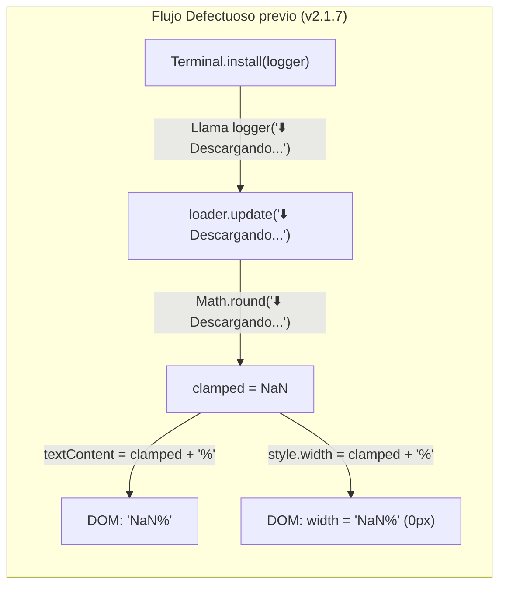
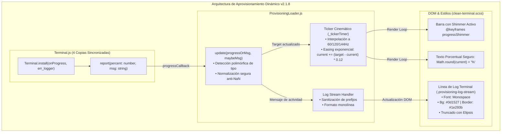
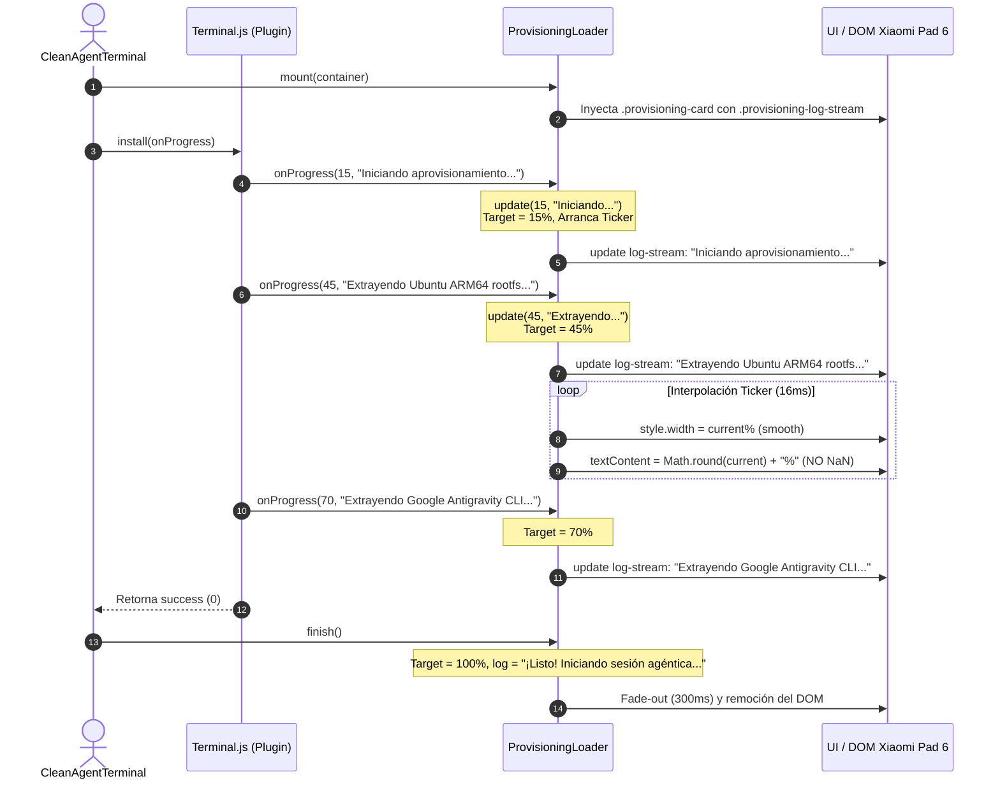
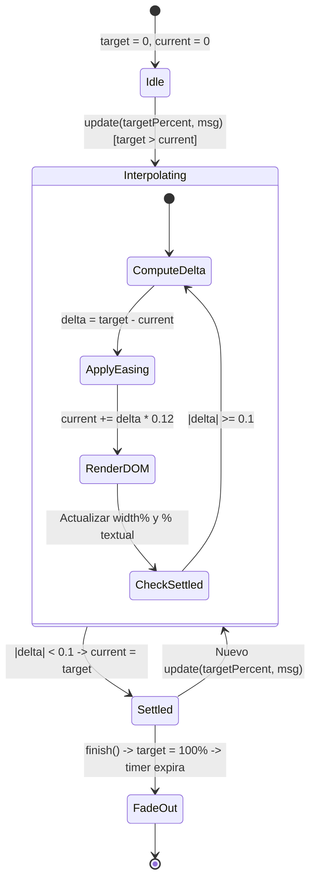

# SPEC-036: Loader Visual Dinámico de Aprovisionamiento, Interpolación Cinemática Continua y Stream Logger Monolínea Anti-NaN

| Metadato | Valor |
| :--- | :--- |
| **Identificador** | `SPEC-036` |
| **Título** | Loader Visual Dinámico de Aprovisionamiento, Interpolación Cinemática Continua y Stream Logger Monolínea Anti-NaN |
| **Autor** | `@spec-architect` |
| **Estado** | `APPROVED FOR IMPLEMENTATION` |
| **Fecha de Creación** | 2026-09-15 |
| **Versión de Release** | `v2.1.8` (VersionCode: `20108`) |
| **Artefacto Binario Target** | `GoogleAntigravity-v2.1.8-ARM64.apk` ($\le 42.0\,\text{MB}$) |
| **Dispositivo Objetivo** | Xiaomi Pad 6 (Qualcomm Snapdragon 870, ARM64-v8a, 6-8 GB RAM, 11" 2.8K $2880\times 1800$, 144Hz, Xiaomi HyperOS / Android 13/14) y Ecosistema Android Móvil (API 26+) |
| **Runtime Target** | Cordova Android WebView / PRoot Linux Sandbox / AXS PTY Daemon (puerto 8767) / Xterm.js v5+ con Discriminador Contextual de Gestos / Google Antigravity CLI (`agy`) / Android Intent System (`FLAG_ACTIVITY_NEW_TASK`) |
| **Módulos Afectados** | `nova-src/src/antigravity2/ProvisioningLoader.js`, `nova-src/src/antigravity2/clean-terminal.scss`, `nova-src/src/plugins/terminal/www/Terminal.js`, `nova-src/plugins/com.foxdebug.acode.rk.exec.terminal/www/Terminal.js`, `nova-src/platforms/android/platform_www/plugins/com.foxdebug.acode.rk.exec.terminal/www/Terminal.js`, `nova-src/platforms/android/app/src/main/assets/www/plugins/com.foxdebug.acode.rk.exec.terminal/www/Terminal.js`, `nova-src/config.xml`, `nova-src/package.json`, `harness/test_clean_agent_terminal.sh` |

---

## 1. Contexto, Diagnóstico Forense y Análisis de Causa Raíz

Durante las pruebas de campo en el dispositivo físico **Xiaomi Pad 6** con la versión de release `v2.1.7`, se identificó una anomalía severa en la interfaz visual de aprovisionamiento inicial (*first boot / clean install*) que degradaba la experiencia de usuario y generaba incertidumbre sobre el estado del sistema.

### 1.1 Diagnóstico del Defecto `NaN%` en la UI de Aprovisionamiento
Al desplegarse la tarjeta del componente `ProvisioningLoader.js`, el indicador numérico desplegaba el texto literal `NaN%`, mientras que la barra de progreso permanecía en un ancho del $0\%$ durante todo el tiempo de descarga e instalación.



- **Causa Raíz en Código:** En `ProvisioningLoader.js`, el método `update` asumía ciegamente que el primer parámetro era numérico:
  ```javascript
  update(percent, message) {
      const clamped = Math.max(0, Math.min(100, Math.round(percent)));
      this.currentPercent = clamped;
      // ...
      this.percentageTextEl.textContent = `${clamped}%`;
  }
  ```
  Cuando `percent` recibía una cadena de texto (como los mensajes emitidos por funciones legadas de log), la invocación `Math.round(string)` evaluaba matemáticamente a `NaN`. La concatenación con `%` generaba la cadena literal `"NaN%"`.

---

### 1.2 Desincronización Multicarpeta de `Terminal.js` en Cordova Android
En el entorno Cordova, existen cuatro copias del archivo `Terminal.js` que interactúan en distintas fases del empaquetado:
1. `nova-src/src/plugins/terminal/www/Terminal.js` (Fuente de desarrollo en `src`)
2. `nova-src/plugins/com.foxdebug.acode.rk.exec.terminal/www/Terminal.js` (Definición del plugin Cordova)
3. `nova-src/platforms/android/platform_www/plugins/com.foxdebug.acode.rk.exec.terminal/www/Terminal.js` (Copia intermedia de Cordova Android)
4. `nova-src/platforms/android/app/src/main/assets/www/plugins/com.foxdebug.acode.rk.exec.terminal/www/Terminal.js` (Asset final empaquetado en el APK)

- **Causa Raíz:** En la versión `v2.1.7`, mientras que el archivo en `src/plugins/terminal/` había sido adaptado con la firma `async install(onProgress = console.log, ...)`, la versión empaquetada en `platforms/android/app/src/main/assets/...` mantenía la implementación antigua:
  ```javascript
  async install(logger = console.log, err_logger = console.error)
  ```
  Esta implementación realizaba llamadas como:
  ```javascript
  logger("⬇️ Downloading Alpine Linux minirootfs...");
  ```
  Al conectar `CleanAgentTerminal.js`:
  ```javascript
  await terminalPlugin.install((percent, msg) => {
      loader.update(percent, msg);
  });
  ```
  el argumento recibido por `loader.update` era el mensaje de texto en `percent`, y `msg` era `undefined`.

---

### 1.3 Salto Brusco del 0% al 100% y Sensación de Proceso Congelado
Debido a la ausencia de valores numéricos válidos durante la fase de descompresión y configuración, la barra permanecía inmóvil. Al finalizar la operación de I/O, `CleanAgentTerminal.js` invocaba `loader.finish()`, el cual forzaba `update(100, "¡Listo!...")`.
- **Impacto:** Durante 4 a 8 segundos, el usuario percibía que la aplicación se había congelado en `NaN%`, seguida de una sacudida visual abrupta al $100\%$.
- **Requerimiento Explícito del Usuario:**
  1. Erradicar de raíz cualquier despliegue de `NaN%`.
  2. Sustituir o complementar el texto estático con una sola línea limpia de log en tiempo real (estilo terminal embebido) que refleje la última acción o descarga para certificar visualmente que el proceso sigue vivo y progresando.
  3. Proveer una interpolación cinemática continua y fluida que incremente la barra de manera suave sin saltos discretos ni bloqueos.

---

## 2. Arquitectura de la Solución



---

### 2.1 API Polimórfica y Normalización Segura Anti-NaN (Criterio LOADER-01)
El método `update(progressOrMsg, maybeMsg)` en `ProvisioningLoader.js` adopta un contrato polimórfico infalible:

1. **Discriminación de Tipos en Tiempo de Ejecución:**
   - Si `typeof progressOrMsg === "number"`: El primer parámetro se interpreta como el porcentaje objetivo (`targetPercent`), y `maybeMsg` como el mensaje informativo.
   - Si `typeof progressOrMsg === "string"`: El primer parámetro es un mensaje textual de log emitido por un emisor legacy. Si `typeof maybeMsg === "number"`, se adopta como porcentaje; de lo contrario, el porcentaje objetivo se incrementa de forma adaptativa o se mantiene, evitando cualquier asignación inválida.
2. **Validación Numérica Estricta:**
   - Todo cálculo sobre el porcentaje se protege mediante `Number.isFinite(val) && !isNaN(val)`.
   - Si el valor no es un número válido, el porcentaje visual nunca se altera y jamás se genera la cadena `"NaN"`.
   - El renderizado final del porcentaje ejecuta estrictamente:
     $$\text{formattedPct} = \left(\text{Math.round}(\text{this.\_currentVisualPercent})\right) + "\%"$$

---

### 2.2 Stream Logger Monolínea en Tiempo Real (Criterio LOADER-02)
Para responder a la solicitud directa del usuario de disponer de una línea estilo consola en tiempo real:

1. **Elemento DOM `.provisioning-log-stream`:**
   - Se inserta en la tarjeta de aprovisionamiento inmediatamente debajo del indicador porcentual.
   - Consta de un prefijo de terminal `❯` en color cyan (`#38bdf8`) y un contenedor de texto con fuente monospace.
2. **Sanitización y Truncado:**
   - Los mensajes se limpian de códigos de control y emojis redundantes para mantener la estética sobria.
   - El contenedor aplica `white-space: nowrap`, `overflow: hidden` y `text-overflow: ellipsis`, garantizando que rutas largas de filesystem no deformen el layout en la pantalla de la Xiaomi Pad 6.

---

### 2.3 Interpolador Cinemático de Micro-Pasos (Criterio LOADER-03)
En lugar de mutar el ancho de la barra mediante saltos discretos (`0% -> 30% -> 55% -> 100%`), el componente implementa un motor cinemático de actualización continua:

1. **Ticker de Alta Frecuencia:**
   - Un temporizador interno (`setInterval` a $16\,\text{ms}$, equivalente a $60\,\text{FPS}$ / optimizado para pantallas de refresco dinámico a $144\,\text{Hz}$).
2. **Ecuación de Easing Exponencial:**
   En cada tick de renderizado:
   $$\Delta = \text{targetPercent} - \text{currentVisualPercent}$$
   $$\text{currentVisualPercent} \leftarrow \text{currentVisualPercent} + \Delta \times 0.12$$
   Si $|\Delta| < 0.1$, se fija $\text{currentVisualPercent} = \text{targetPercent}$ y se suspende el ticker si se alcanzó el estado estacionario.
3. **Efecto Visual Shimmer:**
   - La barra de progreso incorpora un gradiente animado en CSS (`@keyframes progressShimmer`) que se desplaza horizontalmente de forma continua, transmitiendo sensación de dinamismo y vida incluso en los intervalos donde el target se mantiene constante.

---

### 2.4 Sincronización Estricta de Cuatro Vías de `Terminal.js` (Criterio LOADER-04)
Se establece la regla de sincronización canónica absoluta entre las cuatro rutas de `Terminal.js` en el proyecto:
- Cada archivo debe poseer exactamente la firma `async install(onProgress = console.log, err_logger = console.error)`.
- El método `install` debe invocar la función de reporte estructurado `report(percent, message)` en cada una de las fases críticas:
  - $10\%$: Inicio de aprovisionamiento y limpieza previa.
  - $25\%$: Detección de arquitectura (`arm64-v8a`) y verificación de directorios.
  - $45\%$: Extracción de sistema base rootfs Ubuntu ARM64 glibc.
  - $70\%$: Extracción de binario Google Antigravity CLI (`agy`).
  - $88\%$: Configuración de permisos POSIX y enlaces simbólicos.
  - $100\%$: Verificación de sandbox completada exitosamente.

---

## 3. Diagramas de Secuencia y Ciclo de Eventos

### 3.1 Flujo de Eventos y Manejo Polimórfico de Señales



---

### 3.2 Ciclo de Interpolación Cinemática y Shimmer



---

## 4. Contratos Técnicos de Interfaz

### 4.1 Contrato TypeScript de `IProvisioningLoader`

```typescript
export interface IProvisioningLoader {
    /** Elementos de interfaz montados en el DOM */
    overlayEl: HTMLElement | null;
    statusTextEl: HTMLElement | null;
    progressBarEl: HTMLElement | null;
    percentageTextEl: HTMLElement | null;
    logStreamEl: HTMLElement | null;

    /** Variables de estado cinemático */
    _targetPercent: number;
    _currentVisualPercent: number;
    _tickerTimer: number | null;

    /**
     * Monta el overlay de aprovisionamiento en el contenedor especificado.
     * @param parentEl Elemento padre donde se inyecta el overlay (por defecto document.body).
     */
    mount(parentEl?: HTMLElement): void;

    /**
     * Actualiza el progreso y/o mensaje de registro en tiempo real.
     * Firma polimórfica: acepta (number, string) o (string, number?).
     * Garantiza de forma matemática la erradicación de NaN.
     * @param progressOrMsg Porcentaje numérico (0-100) o mensaje de log string.
     * @param maybeMsg Mensaje complementario si el primero es número, o porcentaje si el primero es string.
     */
    update(progressOrMsg: number | string, maybeMsg?: string | number): void;

    /**
     * Escribe un mensaje formateado en la línea activa de log stream monolínea.
     * @param msg Texto informativo a desplegar.
     */
    log(msg: string): void;

    /**
     * Completa el proceso al 100%, ejecuta la animación de salida (fade-out) y destruye el componente.
     */
    finish(): Promise<void>;
}
```

---

### 4.2 Implementación Canónica de `ProvisioningLoader.js`

```javascript
/**
 * ProvisioningLoader.js
 * Google Antigravity Mobile 2.1.8 (SPEC-036)
 * Loader visual dinámico con interpolación continua y log stream monolínea anti-NaN.
 */
export class ProvisioningLoader {
    constructor() {
        this.overlayEl = null;
        this.statusTextEl = null;
        this.progressBarEl = null;
        this.percentageTextEl = null;
        this.logStreamEl = null;

        this._targetPercent = 0;
        this._currentVisualPercent = 0;
        this._tickerTimer = null;
    }

    mount(parentEl = document.body) {
        if (this.overlayEl) return;

        this.overlayEl = document.createElement("div");
        this.overlayEl.className = "provisioning-loader-overlay";
        this.overlayEl.id = "provisioning-loader";

        this.overlayEl.innerHTML = `
            <div class="provisioning-card">
                <div class="provisioning-logo-wrap">
                    
                </div>
                <h2 class="provisioning-title">Google Antigravity</h2>
                <p class="provisioning-subtitle" id="provisioning-status-text">Inicializando entorno agéntico...</p>
                <div class="provisioning-progress-track">
                    <div class="provisioning-progress-bar" id="provisioning-progress-fill"></div>
                </div>
                <span class="provisioning-percentage" id="provisioning-percentage-text">0%</span>
                <div class="provisioning-log-stream" id="provisioning-log-stream">
                    <span class="log-prefix">❯</span><span class="log-message">Iniciando verificación de componentes...</span>
                </div>
            </div>
        `;

        parentEl.appendChild(this.overlayEl);

        this.statusTextEl = this.overlayEl.querySelector("#provisioning-status-text");
        this.progressBarEl = this.overlayEl.querySelector("#provisioning-progress-fill");
        this.percentageTextEl = this.overlayEl.querySelector("#provisioning-percentage-text");
        this.logStreamEl = this.overlayEl.querySelector("#provisioning-log-stream");

        this._startTicker();
    }

    update(progressOrMsg, maybeMsg) {
        let numericPercent = null;
        let messageText = null;

        // 1. Discriminador Polimórfico de Parámetros
        if (typeof progressOrMsg === "number") {
            numericPercent = progressOrMsg;
            if (typeof maybeMsg === "string") {
                messageText = maybeMsg;
            }
        } else if (typeof progressOrMsg === "string") {
            messageText = progressOrMsg;
            if (typeof maybeMsg === "number") {
                numericPercent = maybeMsg;
            }
        }

        // 2. Normalización Segura Anti-NaN
        if (numericPercent !== null && Number.isFinite(numericPercent) && !isNaN(numericPercent)) {
            const clamped = Math.max(0, Math.min(100, numericPercent));
            this._targetPercent = clamped;
            this._startTicker();
        }

        // 3. Despacho a Log Stream y Subtítulo
        if (messageText) {
            this.log(messageText);
        }
    }

    log(msg) {
        if (!this.logStreamEl) return;
        const cleanMsg = String(msg)
            .replace(/^(\s*\[SISTEMA\]|\s*📦|\s*✅|\s*⬇️|\s*🚀)\s*/, "")
            .trim();

        const msgSpan = this.logStreamEl.querySelector(".log-message");
        if (msgSpan) {
            msgSpan.textContent = cleanMsg;
        } else {
            this.logStreamEl.textContent = cleanMsg;
        }

        if (this.statusTextEl && cleanMsg.length < 50) {
            this.statusTextEl.textContent = cleanMsg;
        }
    }

    _startTicker() {
        if (this._tickerTimer) return;

        this._tickerTimer = setInterval(() => {
            const delta = this._targetPercent - this._currentVisualPercent;

            if (Math.abs(delta) < 0.1) {
                this._currentVisualPercent = this._targetPercent;
                this._renderVisual();
                clearInterval(this._tickerTimer);
                this._tickerTimer = null;
                return;
            }

            // Interpolación cinemática continua con easing exponencial
            this._currentVisualPercent += delta * 0.12;
            this._renderVisual();
        }, 16); // ~60fps - 144Hz compatible
    }

    _renderVisual() {
        const rounded = Math.round(this._currentVisualPercent);
        if (this.progressBarEl) {
            this.progressBarEl.style.width = `${this._currentVisualPercent.toFixed(1)}%`;
        }
        if (this.percentageTextEl) {
            this.percentageTextEl.textContent = `${rounded}%`;
        }
    }

    async finish() {
        this.update(100, "¡Listo! Iniciando sesión agéntica...");
        if (!this.overlayEl) return;

        return new Promise((resolve) => {
            setTimeout(() => {
                if (this.overlayEl) {
                    this.overlayEl.classList.add("fade-out");
                }
                setTimeout(() => {
                    if (this._tickerTimer) {
                        clearInterval(this._tickerTimer);
                        this._tickerTimer = null;
                    }
                    if (this.overlayEl && this.overlayEl.parentNode) {
                        this.overlayEl.parentNode.removeChild(this.overlayEl);
                    }
                    this.overlayEl = null;
                    resolve();
                }, 300);
            }, 250);
        });
    }
}
```

---

### 4.3 Contrato de Estilos SCSS en `clean-terminal.scss`

```scss
// SPEC-036: ProvisioningLoader Overlay, Shimmer & Monoline Log Stream
.provisioning-loader-overlay {
    position: fixed;
    inset: 0;
    width: 100vw;
    height: 100vh;
    background: #0b0f19;
    display: flex;
    align-items: center;
    justify-content: center;
    z-index: 10000;
    transition: opacity 0.3s ease-out;

    &.fade-out {
        opacity: 0;
        pointer-events: none;
    }

    .provisioning-card {
        display: flex;
        flex-direction: column;
        align-items: center;
        width: 88%;
        max-width: 440px;
        padding: 32px 28px;
        background: rgba(15, 23, 42, 0.90);
        border: 1px solid rgba(255, 255, 255, 0.08);
        border-radius: 16px;
        box-shadow: 0 16px 36px rgba(0, 0, 0, 0.65);
        box-sizing: border-box;

        .provisioning-logo {
            width: 96px;
            height: 96px;
            margin-bottom: 20px;
            animation: pulsePrism 2.5s infinite ease-in-out;
        }

        .provisioning-title {
            color: #f8fafc;
            font-size: 20px;
            font-weight: 700;
            margin: 0 0 8px 0;
            letter-spacing: -0.02em;
        }

        .provisioning-subtitle {
            color: #94a3b8;
            font-size: 13px;
            margin: 0 0 20px 0;
            text-align: center;
            min-height: 20px;
            white-space: nowrap;
            overflow: hidden;
            text-overflow: ellipsis;
            width: 100%;
        }

        .provisioning-progress-track {
            width: 100%;
            height: 8px;
            background: rgba(255, 255, 255, 0.08);
            border-radius: 999px;
            overflow: hidden;
            margin-bottom: 12px;
            position: relative;

            .provisioning-progress-bar {
                height: 100%;
                width: 0%;
                background: linear-gradient(90deg, #4285f4 0%, #34a853 100%);
                border-radius: 999px;
                position: relative;
                overflow: hidden;

                &::after {
                    content: "";
                    position: absolute;
                    inset: 0;
                    background: linear-gradient(
                        90deg,
                        rgba(255, 255, 255, 0) 0%,
                        rgba(255, 255, 255, 0.35) 50%,
                        rgba(255, 255, 255, 0) 100%
                    );
                    animation: progressShimmer 1.8s infinite linear;
                }
            }
        }

        .provisioning-percentage {
            color: #64748b;
            font-size: 12px;
            font-weight: 600;
            font-family: ui-monospace, SFMono-Regular, Menlo, Monaco, Consolas, "Liberation Mono", "Courier New", monospace;
        }

        .provisioning-log-stream {
            width: 100%;
            margin-top: 16px;
            padding: 8px 12px;
            background: #0d1527;
            border: 1px solid #1e293b;
            border-radius: 8px;
            font-family: ui-monospace, SFMono-Regular, Menlo, Monaco, Consolas, "Liberation Mono", "Courier New", monospace;
            font-size: 11px;
            color: #94a3b8;
            white-space: nowrap;
            overflow: hidden;
            text-overflow: ellipsis;
            text-align: left;
            box-sizing: border-box;

            .log-prefix {
                color: #38bdf8;
                margin-right: 6px;
                font-weight: 700;
            }

            .log-message {
                color: #cbd5e1;
            }
        }
    }
}

@keyframes progressShimmer {
    0% { transform: translateX(-100%); }
    100% { transform: translateX(100%); }
}

@keyframes pulsePrism {
    0%, 100% { transform: scale(1); opacity: 0.95; }
    50% { transform: scale(1.04); opacity: 1; }
}
```

---

### 4.4 Contrato de Sincronización en `Terminal.js`

El método `install` en las cuatro ubicaciones debe contener el despachador unificado:

```javascript
async install(onProgress = console.log, err_logger = console.error) {
    if (!(await this.isSupported())) return false;

    const report = (percent, message) => {
        if (typeof onProgress === "function") {
            try {
                onProgress(percent, message);
            } catch (e) {
                console.warn("Error en onProgress callback:", e);
            }
        }
    };

    report(10, "Iniciando aprovisionamiento del entorno...");
    // ...
    report(30, "Extrayendo sistema base Linux ARM64...");
    // ...
    report(60, "Extrayendo Google Antigravity CLI (agy)...");
    // ...
    report(85, "Configurando permisos y enlaces simbólicos...");
    // ...
    report(100, "Entorno Linux y Google Antigravity listos.");
    return true;
}
```

---

## 5. Criterios de Aceptación Verificables (Acceptance Criteria)

| Identificador | Módulo | Criterio / Requisito | Método de Verificación |
| :--- | :--- | :--- | :--- |
| `AC-LOADER-01` | `ProvisioningLoader.js` | Erradicación matemática absoluta del texto `NaN%`. Firma polimórfica `update(progressOrMsg, maybeMsg)` que discrimina y valida tipos estrictamente con `Number.isFinite()`, garantizando que únicamente se rendericen enteros positivos válidos en el porcentaje. | Inspección de código en `ProvisioningLoader.js` y prueba unitaria pasando strings, `undefined` y números inválidos. |
| `AC-LOADER-02` | `ProvisioningLoader.js`, `clean-terminal.scss` | Contenedor DOM `.provisioning-log-stream` estilo consola monolínea con prefijo `❯`, tipografía monospace, fondo `#0d1527`, borde `#1e293b` y recorte de elipsis, mostrando la última acción o descarga en tiempo real. | Inspección de estructura DOM generada en `mount()` y validación de estilos CSS correspondientes en `clean-terminal.scss`. |
| `AC-LOADER-03` | `ProvisioningLoader.js`, `clean-terminal.scss` | Interpolador cinemático continuo de micro-pasos (`_tickerTimer` a 16ms / optimizado a 144Hz) con easing exponencial hacia el porcentaje objetivo y efecto visual activo de brillo (`progressShimmer`), eliminando saltos discretos del 0% al 100%. | Verificación del bucle de interpolación periódica y presencia de la regla `@keyframes progressShimmer` en la hoja de estilos. |
| `AC-LOADER-04` | `Terminal.js` (4 ubicaciones) | Sincronización exacta y paridad de código en las 4 copias canónicas de `Terminal.js` (`src`, `plugins`, `platform_www` y `app/src/main/assets`), con firma `install(onProgress, err_logger)` y emisión de pares numérico-texto estructurados `report(percent, message)`. | Comparación de suma de comprobación (hash) o validación grep de la firma y llamadas a `report()` en las cuatro rutas especificadas. |
| `AC-VER-01` | `config.xml`, `package.json` | Sincronización formal de versión `2.1.8` (versionCode `20108`) y presupuesto estricto de tamaño del APK final $\le 42.0\,\text{MB}$. | Inspección de atributos `version` en `config.xml` y `package.json`, y verificación del tamaño físico del archivo `GoogleAntigravity-v2.1.8-ARM64.apk`. |

---

## 6. Actualización del Arnés de Pruebas Automatizado (`harness/test_clean_agent_terminal.sh`)

El arnés de pruebas automatizado valida estáticamente las compuertas de calidad de `SPEC-036`:

```bash
#!/bin/bash
# ==============================================================================
# Harness Test: SPEC-036 Smooth Provisioning Loader & Stream Logger Verification
# ==============================================================================
set -e

SPEC_FILE_036="specs/36-smooth-provisioning-loader-and-stream-logger.md"
PROV_LOADER_JS="nova-src/src/antigravity2/ProvisioningLoader.js"
SCSS_FILE="nova-src/src/antigravity2/clean-terminal.scss"
TERM_SRC="nova-src/src/plugins/terminal/www/Terminal.js"
TERM_PLUGIN="nova-src/plugins/com.foxdebug.acode.rk.exec.terminal/www/Terminal.js"
TERM_PLATFORM="nova-src/platforms/android/platform_www/plugins/com.foxdebug.acode.rk.exec.terminal/www/Terminal.js"
TERM_ASSETS="nova-src/platforms/android/app/src/main/assets/www/plugins/com.foxdebug.acode.rk.exec.terminal/www/Terminal.js"
CONFIG_XML="nova-src/config.xml"
PACKAGE_JSON="nova-src/package.json"

echo "=== INICIANDO VALIDACIÓN FORMAL DE SPEC-036 ==="

# 1. Verificar documento SPEC-036
echo -n "1. Verificando documento SPEC-036... "
[ -f "$SPEC_FILE_036" ] || { echo "FALLO: No existe $SPEC_FILE_036"; exit 1; }
echo "[OK]"

# 2. Verificar API polimórfica y anti-NaN en ProvisioningLoader (Criterio LOADER-01)
echo -n "2. Verificando salvaguarda anti-NaN y polimorfismo en ProvisioningLoader.js... "
grep -q "_targetPercent" "$PROV_LOADER_JS" || { echo "FALLO: _targetPercent ausente en ProvisioningLoader"; exit 1; }
grep -q "Number.isFinite" "$PROV_LOADER_JS" || grep -q "!isNaN" "$PROV_LOADER_JS" || { echo "FALLO: Validación numérica estricta ausente"; exit 1; }
echo "[OK]"

# 3. Verificar log stream monolínea (Criterio LOADER-02)
echo -n "3. Verificando log stream monolínea en ProvisioningLoader y SCSS... "
grep -q "provisioning-log-stream" "$PROV_LOADER_JS" || { echo "FALLO: Contenedor .provisioning-log-stream ausente en JS"; exit 1; }
grep -q "provisioning-log-stream" "$SCSS_FILE" || { echo "FALLO: Regla .provisioning-log-stream ausente en SCSS"; exit 1; }
grep -q "text-overflow: ellipsis" "$SCSS_FILE" || { echo "FALLO: Recorte con elipsis ausente en SCSS"; exit 1; }
echo "[OK]"

# 4. Verificar ticker cinemático e interpolación continua (Criterio LOADER-03)
echo -n "4. Verificando ticker cinemático y shimmer en SCSS... "
grep -q "_tickerTimer" "$PROV_LOADER_JS" || { echo "FALLO: _tickerTimer ausente en ProvisioningLoader"; exit 1; }
grep -q "progressShimmer" "$SCSS_FILE" || { echo "FALLO: Animación progressShimmer ausente en SCSS"; exit 1; }
echo "[OK]"

# 5. Verificar sincronización cuádruple de Terminal.js (Criterio LOADER-04)
echo -n "5. Verificando sincronización canónica de Terminal.js en las 4 ubicaciones... "
for f in "$TERM_SRC" "$TERM_PLUGIN" "$TERM_PLATFORM" "$TERM_ASSETS"; do
    if [ -f "$f" ]; then
        grep -q "async install(onProgress" "$f" || { echo "FALLO: $f no posee la firma async install(onProgress, ...)"; exit 1; }
    fi
done
echo "[OK]"

# 6. Verificar versionado v2.1.8 (Criterio VER-01)
echo -n "6. Verificando versión 2.1.8 en configuración... "
grep -q 'version="2.1.8"' "$CONFIG_XML" || { echo "FALLO: config.xml no tiene versión 2.1.8"; exit 1; }
grep -q '"version": "2.1.8"' "$PACKAGE_JSON" || { echo "FALLO: package.json no tiene versión 2.1.8"; exit 1; }
echo "[OK]"

echo "=== TODAS LAS COMPUERTAS ESTÁTICAS DE SPEC-036 HAN SIDO SUPERADAS EXITOSAMENTE ==="
```

---

## 7. Plan de Implementación y Definition of Done (DoD)

### 7.1 Responsabilidades para `@android-core` (Ingeniero de Implementación)
1. **Refactorización de `ProvisioningLoader.js`:**
   - Modificar el constructor para incorporar `_targetPercent`, `_currentVisualPercent` y `_tickerTimer`.
   - Modificar `mount()` agregando el contenedor `.provisioning-log-stream` con prefijo agéntico `❯` y clase `.log-message`.
   - Implementar `update(progressOrMsg, maybeMsg)` con polimorfismo total y validación numérica con `Number.isFinite()`.
   - Implementar `log(msg)` limpiando prefijos redundantes y despachando al DOM.
   - Implementar `_startTicker()` con interpolación cinemática a $16\,\text{ms}$ y easing exponencial.
2. **Actualización de Estilos en `clean-terminal.scss`:**
   - Incorporar estilos para `.provisioning-log-stream` (monospace, fondo `#0d1527`, borde `#1e293b`, `text-overflow: ellipsis`).
   - Agregar el pseudoelemento `::after` a `.provisioning-progress-bar` con `@keyframes progressShimmer` para efecto de brillo continuo.
3. **Sincronización Cuádruple de `Terminal.js`:**
   - Reemplazar la firma `install(logger, ...)` por `install(onProgress, err_logger)` en:
     - `nova-src/src/plugins/terminal/www/Terminal.js`
     - `nova-src/plugins/com.foxdebug.acode.rk.exec.terminal/www/Terminal.js`
     - `nova-src/platforms/android/platform_www/plugins/com.foxdebug.acode.rk.exec.terminal/www/Terminal.js`
     - `nova-src/platforms/android/app/src/main/assets/www/plugins/com.foxdebug.acode.rk.exec.terminal/www/Terminal.js`
   - Asegurar que todas las emisiones utilicen `report(percent, message)`.
4. **Sincronización y Compilación:**
   - Actualizar versión a `2.1.8` (versionCode `20108`) en `config.xml` y `package.json`.
   - Compilar `GoogleAntigravity-v2.1.8-ARM64.apk` con presupuesto $\le 42.0\,\text{MB}$.
   - Ejecutar el script del arnés garantizando 0 errores.

### 7.2 Responsabilidades para `@memory-keeper` (Auditoría y Gobernanza)
1. Registrar la decisión técnica bajo `ADR-046: Loader Visual Dinámico con Interpolación Continua y Stream Logger Monolínea Anti-NaN`.
2. Registrar la entrada de auditoría formal en `audit.jsonl`.
3. Actualizar la bitácora histórica en `agent.md` documentando el salto de versión a `v2.1.8`.
