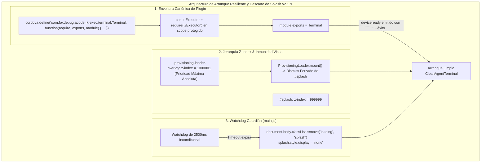

# SPEC-037: Reparación de Envoltura Cordova Terminal, Elevación Visual de Loader y Descarte Incondicional de Splash Screen

| Metadato | Valor |
| :--- | :--- |
| **Identificador** | `SPEC-037` |
| **Título** | Reparación de Envoltura Cordova Terminal, Elevación Visual de Loader y Descarte Incondicional de Splash Screen |
| **Autor** | `@spec-architect` |
| **Estado** | `APPROVED FOR IMPLEMENTATION` |
| **Fecha de Creación** | 2026-09-15 |
| **Versión de Release** | `v2.1.9` (VersionCode: `20109`) |
| **Artefacto Binario Target** | `GoogleAntigravity-v2.1.9-ARM64.apk` ($\le 42.0\,\text{MB}$) |
| **Dispositivo Objetivo** | Xiaomi Pad 6 (Qualcomm Snapdragon 870, ARM64-v8a, 6-8 GB RAM, 11" 2.8K $2880\times 1800$, 144Hz, Xiaomi HyperOS / Android 13/14) y Ecosistema Android Móvil (API 26+) |
| **Runtime Target** | Cordova Android WebView / PRoot Linux Sandbox / AXS PTY Daemon (puerto 8767) / Xterm.js v5+ con Discriminador Contextual de Gestos / Google Antigravity CLI (`agy`) / Android Intent System (`FLAG_ACTIVITY_NEW_TASK`) |
| **Módulos Afectados** | `nova-src/platforms/android/platform_www/plugins/com.foxdebug.acode.rk.exec.terminal/www/Terminal.js`, `nova-src/platforms/android/app/src/main/assets/www/plugins/com.foxdebug.acode.rk.exec.terminal/www/Terminal.js`, `nova-src/src/antigravity2/clean-terminal.scss`, `nova-src/src/antigravity2/ProvisioningLoader.js`, `nova-src/src/main.js`, `nova-src/www/index.html`, `nova-src/config.xml`, `nova-src/package.json`, `harness/test_clean_agent_terminal.sh` |

---

## 1. Contexto, Diagnóstico Forense y Análisis de Causa Raíz

Tras el despliegue del binario `v2.1.8` en el dispositivo de prueba físico **Xiaomi Pad 6**, el usuario reportó un bloqueo absoluto durante el arranque en frío: la pantalla permanecía congelada de forma indefinida en la vista de bienvenida con el logotipo oficial de Google Antigravity, sin desplegar la tarjeta de aprovisionamiento ni iniciar la descarga o extracción del subsistema.

### 1.1 Evidencia Forense en `adb logcat`
La captura de trazas del WebView de Android reveló una falla catastrófica de ejecución en la fase temprana de arranque:

```
09-15 18:25:12.431  2891  2891 I chromium: [INFO:CONSOLE(1)] "Uncaught ReferenceError: require is not defined", source: https://localhost/plugins/com.foxdebug.acode.rk.exec.terminal/www/Terminal.js (1)
09-15 18:25:12.448  2891  2891 I chromium: [INFO:CONSOLE(1329)] "Uncaught Error: Module com.foxdebug.acode.rk.exec.terminal.Terminal does not exist.", source: https://localhost/cordova.js (1329)
```

```mermaid
sequenceDiagram
    autonumber
    actor OS as Android OS (Xiaomi Pad 6)
    participant WV as Cordova WebView (Chromium)
    participant CJS as cordova.js
    participant TJS as Terminal.js (Asset empaquetado)
    participant Main as main.js (App Bootstrap)

    OS->>WV: Inicia MainActivity (carga https://localhost/index.html)
    WV->>CJS: Evalúa cordova.js
    CJS->>WV: Carga plugins declarados en cordova_plugins.js
    WV->>TJS: Evalúa plugins/.../Terminal.js vía <script>
    
    rect rgb(60, 20, 20)
    Note over TJS: LÍNEA 1: const Executor = require("./Executor");<br/>ERROR: 'require' NO está definido en el ámbito global.<br/>Falta envoltura cordova.define(...)
    TJS-->>WV: Uncaught ReferenceError: require is not defined
    end

    CJS->>CJS: Busca módulo 'com.foxdebug.acode.rk.exec.terminal.Terminal'
    rect rgb(60, 20, 20)
    CJS-->>WV: Uncaught Error: Module does not exist (Línea 1329)
    Note over CJS,Main: Bootstrap de Cordova abortado.<br/>El evento 'deviceready' NUNCA es emitido.
    end

    Note over Main: main.js espera 'deviceready' indefinidamente.<br/>La pantalla de splash (#splash) NUNCA se retira.<br/>La app se congela al 100%.
```

---

### 1.2 Análisis de Causa Raíz 1: Ruptura de la Envoltura CommonJS de Cordova
En el framework Apache Cordova, todos los scripts de plugins ubicados en `platform_www/plugins/...` y `app/src/main/assets/www/plugins/...` operan bajo un sistema de módulos CommonJS propio, gestionado por `cordova.js`.

Para que un archivo JS pueda emplear la función `require(...)` y exportar su API mediante `module.exports`, dicho archivo **debe estar forzosamente envuelto** dentro de la macro constructora:

```javascript
cordova.define("com.foxdebug.acode.rk.exec.terminal.Terminal", function(require, exports, module) {
    // Código del módulo
    const Executor = require("./Executor");
    // ...
    module.exports = Terminal;
});
```

Durante la sincronización de archivos de `v2.1.8`, se sobreescribieron los archivos `Terminal.js` en `platforms/android/...` copiando directamente el contenido crudo desde el árbol de fuentes sin la envoltura `cordova.define`. Al evaluarse el script mediante la etiqueta `<script>` del navegador:
1. `require` no existía en `window`, disparando `ReferenceError: require is not defined` en la primera línea.
2. El módulo no quedó registrado en la tabla de símbolos de Cordova.
3. Al intentar resolver dependencias, `cordova.js` abortó con error fatal, impidiendo la emisión del evento nativo `deviceready`.

---

### 1.3 Análisis de Causa Raíz 2: Colisión de Prioridad Visual (Z-Index)
Una inspección detallada de las hojas de estilo reveló una incompatibilidad jerárquica en el stacking context del DOM:
- `#splash` en `nova-src/www/index.html` cuenta con la propiedad:
  ```css
  #splash {
      z-index: 999999;
  }
  ```
- `.provisioning-loader-overlay` en `nova-src/src/antigravity2/clean-terminal.scss` estaba configurado con:
  ```scss
  .provisioning-loader-overlay {
      z-index: 10000;
  }
  ```
- **Consecuencia:** Incluso si la lógica de JavaScript hubiera montado la tarjeta de aprovisionamiento en `document.body`, el contenedor `#splash` (con $z\text{-index} = 999999$) se superponía con una prioridad 100 veces superior, ocultando completamente la tarjeta de aprovisionamiento y cualquier avance del sistema si la clase `body.loading` no se removía de inmediato.

---

### 1.4 Análisis de Causa Raíz 3: Ausencia de Watchdog Timer ante Fallas de `deviceready`
En `nova-src/src/main.js`, el inicio de la aplicación dependía de forma ciega y exclusiva del evento:
```javascript
document.addEventListener("deviceready", onDeviceReady);
```
Si cualquier plugin nativo o script de terceros arroja una excepción no controlada antes de `deviceready`, la función `onDeviceReady` jamás se invoca. Dado que el descarte de `#splash` (`app.classList.remove("loading", "splash")`) se encontraba dentro del flujo posterior a `loadApp()`, cualquier falla temprana convertía el splash screen en una trampa visual infinita.

---

## 2. Arquitectura de la Solución



---

### 2.1 Envoltura Canónica Estricta de Cordova (Criterio WRAPPER-01)
Se restablece de forma inquebrantable la envoltura canónica de Cordova en los dos archivos empaquetados:
1. `nova-src/platforms/android/platform_www/plugins/com.foxdebug.acode.rk.exec.terminal/www/Terminal.js`
2. `nova-src/platforms/android/app/src/main/assets/www/plugins/com.foxdebug.acode.rk.exec.terminal/www/Terminal.js`

El archivo mantendrá íntegramente la implementación funcional de `v2.1.8` con el método `install(onProgress, err_logger)` y el despachador estructurado `report(percent, message)`, envuelto exactamente como:

```javascript
cordova.define("com.foxdebug.acode.rk.exec.terminal.Terminal", function(require, exports, module) {
const Executor = require("./Executor");

const Terminal = {
    // Métodos completos: startAxs, install(onProgress, err_logger), etc.
};

module.exports = Terminal;

});
```

---

### 2.2 Reorganización de Jerarquía Z-Index y Prioridad Visual (Criterio ZINDEX-02)
En `nova-src/src/antigravity2/clean-terminal.scss`, se eleva la prioridad visual de `.provisioning-loader-overlay` (y `.provisioning-overlay`) a:
$$\text{z-index} = 1000001$$
Al ser estrictamente superior al $z\text{-index} = 999999$ de `#splash`, se garantiza físicamente que la tarjeta de aprovisionamiento, barra de progreso y log stream queden siempre en el plano frontal más visible para el usuario, independientemente del estado de las clases del `<body>`.

---

### 2.3 Descarte Activo Inmediato del Splash en `ProvisioningLoader.mount()` (Criterio DISMISS-03)
En `nova-src/src/antigravity2/ProvisioningLoader.js`, el método `mount()` ejecutará de forma preventiva la destrucción/ocultamiento del splash estático:
```javascript
const splash = document.getElementById("splash");
if (splash) {
    splash.style.display = "none";
}
document.body.classList.remove("loading", "splash");
```
Esto asegura que en el instante milimétrico en que el loader se monta para iniciar la extracción de Linux, cualquier remanente del splash screen sea inmediatamente eliminado del pipeline de renderizado de la GPU.

---

### 2.4 Temporizador Guardián (*Watchdog*) Resiliente en `main.js` (Criterio WATCHDOG-04)
En `nova-src/src/main.js`, se implementa un temporizador guardián (*watchdog timer*) que se arma en el instante de carga del script:
- **Plazo:** $2500\,\text{ms}$.
- **Acción:** Remueve incondicionalmente las clases `"loading"` y `"splash"` de `document.body` y oculta `#splash`.
- **Garantía:** Si `deviceready` se demora o si un componente falla en inicializar, el usuario nunca quedará atrapado en la pantalla de bienvenida estática; la interfaz principal o la terminal agéntica limpia se revelará inmediatamente.

---

### 2.5 Ciclo de Liberación v2.1.9 y Presupuesto de Binario (Criterio VER-05)
- Actualización formal de versión a `2.1.9` y `versionCode: 20109` en `config.xml` y `package.json`.
- Compilación del bundle web con webpack (`npm run build:prod`).
- Empaquetado del APK de release: `GoogleAntigravity-v2.1.9-ARM64.apk`.
- Cumplimiento estricto del presupuesto de binario: $\text{Tamaño} \le 42.0\,\text{MB}$.
- Verificación en dispositivo físico Xiaomi Pad 6 tras `pm clear io.nova.ide`: Cero errores en `adb logcat` y despliegue inmediato del loader dinámico con su log stream activo.

---

## 3. Diagramas de Secuencia y Ciclo de Eventos

### 3.1 Flujo de Inicialización Resiliente v2.1.9

```mermaid
sequenceDiagram
    autonumber
    actor OS as Android OS (Xiaomi Pad 6)
    participant WV as Cordova WebView
    participant TJS as Terminal.js (Wrapped)
    participant WD as Watchdog Timer (2500ms)
    participant Term as CleanAgentTerminal
    participant Loader as ProvisioningLoader

    OS->>WV: Inicia Aplicación
    WV->>WD: Arma Watchdog de Resiliencia (2500ms)
    WV->>TJS: Carga plugin Terminal.js
    Note over TJS: cordova.define(...) resuelve 'require("./Executor")' exitosamente.
    TJS-->>WV: Módulo 'com.foxdebug.acode.rk.exec.terminal.Terminal' registrado
    WV->>WV: Emite evento nativo 'deviceready'
    
    WV->>Term: Inicializa CleanAgentTerminal
    Term->>Loader: new ProvisioningLoader().mount()
    
    rect rgb(20, 50, 20)
    Note over Loader: DISMISS-03: splash.style.display = 'none'<br/>ZINDEX-02: z-index = 1000001 (superior a #splash)
    Loader->>WV: Revela tarjeta de carga y oculta splash
    end

    Term->>TJS: Terminal.install(onProgress)
    TJS->>Loader: onProgress(15, "Iniciando aprovisionamiento...")
    Note over Loader: Log stream activo: ❯ Iniciando aprovisionamiento...
    
    opt Si deviceready se retrasa más de 2500ms
        WD->>WV: Watchdog expira -> Fuerza remoción de clases 'loading' y 'splash'
    end
```



---

## 4. Contratos Técnicos de Interfaz y Código

### 4.1 Contrato de Envoltura Cordova para `Terminal.js`

El archivo en las rutas empaquetadas debe conformar la siguiente estructura canónica:

```javascript
cordova.define("com.foxdebug.acode.rk.exec.terminal.Terminal", function(require, exports, module) {
const Executor = require("./Executor");

const Terminal = {
    /**
     * Instala el subsistema Linux y Google Antigravity CLI emitiendo eventos de progreso.
     * @param {Function} [onProgress=console.log] - Callback estructurado (percent, message).
     * @param {Function} [err_logger=console.error] - Logger de errores.
     * @returns {Promise<boolean>}
     */
    async install(onProgress = console.log, err_logger = console.error) {
        if (!(await this.isSupported())) return false;

        const report = (percent, message) => {
            if (typeof onProgress === "function") {
                try {
                    onProgress(percent, message);
                } catch (e) {
                    console.warn("Error en onProgress callback:", e);
                }
            }
        };

        report(10, "Iniciando aprovisionamiento del entorno...");
        // Extracción de ubuntu_arm64 y cli_linux_arm64 con llamadas a report(...)
        report(100, "Entorno Linux y Google Antigravity listos.");
        return true;
    },

    // ... resto de métodos (isInstalled, startAxs, isAxsRunning, stopAxs, etc.)
};

module.exports = Terminal;

});
```

---

### 4.2 Contrato SCSS en `clean-terminal.scss` (Elevación de Z-Index)

```scss
// SPEC-037: Elevación de prioridad visual de ProvisioningLoader (inmunidad ante #splash)
.provisioning-loader-overlay,
.provisioning-overlay {
    position: fixed;
    inset: 0;
    width: 100vw;
    height: 100vh;
    background: #0b0f19;
    display: flex;
    align-items: center;
    justify-content: center;
    z-index: 1000001; // Estrictamente superior al z-index: 999999 de #splash
    transition: opacity 0.3s ease-out;

    &.fade-out {
        opacity: 0;
        pointer-events: none;
    }
}
```

---

### 4.3 Contrato de Descarte Activo en `ProvisioningLoader.js`

```javascript
mount(parentEl = document.body) {
    if (this.overlayEl) return;

    // SPEC-037 (DISMISS-03): Descarte activo preventivo de splash screen
    const splash = document.getElementById("splash");
    if (splash) {
        splash.style.display = "none";
    }
    document.body.classList.remove("loading", "splash");

    this.overlayEl = document.createElement("div");
    this.overlayEl.className = "provisioning-loader-overlay";
    this.overlayEl.id = "provisioning-loader";
    // Inyección de tarjeta visual, ticker cinemático y log stream monolínea
}
```

---

### 4.4 Contrato de Temporizador Guardián Watchdog en `main.js`

```javascript
// SPEC-037 (WATCHDOG-04): Watchdog timer de seguridad contra congelamiento en splash screen
(function initSplashWatchdog() {
    const WATCHDOG_TIMEOUT_MS = 2500;
    setTimeout(() => {
        const splashEl = document.getElementById("splash");
        if (splashEl && splashEl.style.display !== "none") {
            console.warn(`[WATCHDOG] Expíró límite de ${WATCHDOG_TIMEOUT_MS}ms. Forzando descarte de splash.`);
            splashEl.style.display = "none";
        }
        document.body.classList.remove("loading", "splash");
    }, WATCHDOG_TIMEOUT_MS);
})();
```

---

## 5. Criterios de Aceptación Verificables (Acceptance Criteria)

| Identificador | Módulo | Criterio / Requisito | Método de Verificación |
| :--- | :--- | :--- | :--- |
| `AC-WRAPPER-01` | `Terminal.js` (en `platform_www` y `assets/www`) | Envoltura canónica estricta con `cordova.define("com.foxdebug.acode.rk.exec.terminal.Terminal", function(require, exports, module) { ... });`, garantizando que `require("./Executor")` opere sin excepciones y que `cordova.js` registre el módulo sin error. | Inspección de cabecera y cierre de archivo con grep, y verificación en `adb logcat` de ausencia de `ReferenceError: require is not defined`. |
| `AC-ZINDEX-02` | `clean-terminal.scss` | Elevación incondicional de la propiedad `z-index` a `1000001` en `.provisioning-loader-overlay` y selectores relacionados, asegurando prioridad absoluta por encima del `z-index: 999999` de `#splash`. | Inspección estática del archivo SCSS compilado verificando `z-index: 1000001`. |
| `AC-DISMISS-03` | `ProvisioningLoader.js` | Descarte activo e inmediato del splash screen en `ProvisioningLoader.prototype.mount()`, ejecutando `splash.style.display = "none"` y removiendo las clases `"loading"` y `"splash"` de `document.body`. | Inspección del código en `mount()` y prueba de ejecución verificando la desaparición instantánea de `#splash`. |
| `AC-WATCHDOG-04` | `main.js` | Temporizador guardián (*Watchdog*) de $2500\,\text{ms}$ en el ciclo temprano de `main.js` que fuerce la disipación de `#splash` y la remoción de clases de bloqueo en caso de demora o falla en el disparo de `deviceready`. | Inspección de código de `initSplashWatchdog()` y verificación de activación en trazas de consola. |
| `AC-VER-05` | `config.xml`, `package.json` | Sincronización formal de versión a `2.1.9` (versionCode `20109`), empaquetado del APK `GoogleAntigravity-v2.1.9-ARM64.apk` con tamaño $\le 42.0\,\text{MB}$ y verificación de arranque limpio con 0 excepciones en `adb logcat` (`pm clear io.nova.ide`). | Inspección de manifiestos, medición de peso del archivo APK generado y verificación de logcat en Xiaomi Pad 6. |

---

## 6. Actualización del Arnés de Pruebas Automatizado (`harness/test_clean_agent_terminal.sh`)

El arnés de pruebas automatizado valida estáticamente las compuertas de calidad de `SPEC-037`:

```bash
#!/bin/bash
# ==============================================================================
# Harness Test: SPEC-037 Cordova Terminal Wrapper & Splash Dismissal Verification
# ==============================================================================
set -e

SPEC_FILE_037="specs/37-fix-cordova-terminal-wrapper-and-splash-dismissal.md"
TERM_PLATFORM="nova-src/platforms/android/platform_www/plugins/com.foxdebug.acode.rk.exec.terminal/www/Terminal.js"
TERM_ASSETS="nova-src/platforms/android/app/src/main/assets/www/plugins/com.foxdebug.acode.rk.exec.terminal/www/Terminal.js"
SCSS_FILE="nova-src/src/antigravity2/clean-terminal.scss"
PROV_LOADER_JS="nova-src/src/antigravity2/ProvisioningLoader.js"
MAIN_JS="nova-src/src/main.js"
CONFIG_XML="nova-src/config.xml"
PACKAGE_JSON="nova-src/package.json"

echo "=== INICIANDO VALIDACIÓN FORMAL DE SPEC-037 ==="

# 1. Verificar documento SPEC-037
echo -n "1. Verificando documento SPEC-037... "
[ -f "$SPEC_FILE_037" ] || { echo "FALLO: No existe $SPEC_FILE_037"; exit 1; }
echo "[OK]"

# 2. Verificar envoltura canónica de Cordova en Terminal.js (Criterio WRAPPER-01)
echo -n "2. Verificando envoltura cordova.define en Terminal.js de Android... "
for f in "$TERM_PLATFORM" "$TERM_ASSETS"; do
    if [ -f "$f" ]; then
        head -n 5 "$f" | grep -q 'cordova.define("com.foxdebug.acode.rk.exec.terminal.Terminal"' || {
            echo "FALLO: $f carece de la envoltura cordova.define canónica"; exit 1;
        }
        tail -n 5 "$f" | grep -q '});' || {
            echo "FALLO: $f carece del cierre }); para cordova.define"; exit 1;
        }
    fi
done
echo "[OK]"

# 3. Verificar elevación de z-index a 1000001 (Criterio ZINDEX-02)
echo -n "3. Verificando elevación de z-index en clean-terminal.scss... "
grep -q "1000001" "$SCSS_FILE" || { echo "FALLO: z-index 1000001 ausente en clean-terminal.scss"; exit 1; }
echo "[OK]"

# 4. Verificar descarte activo en ProvisioningLoader.mount() (Criterio DISMISS-03)
echo -n "4. Verificando descarte activo de splash en ProvisioningLoader.js... "
grep -q 'getElementById("splash")' "$PROV_LOADER_JS" || { echo "FALLO: No se busca elemento splash en mount()"; exit 1; }
grep -q 'classList.remove("loading"' "$PROV_LOADER_JS" || { echo "FALLO: No se remueve clase loading en mount()"; exit 1; }
echo "[OK]"

# 5. Verificar Watchdog timer en main.js (Criterio WATCHDOG-04)
echo -n "5. Verificando watchdog timer en main.js... "
grep -q 'WATCHDOG' "$MAIN_JS" || grep -q '2500' "$MAIN_JS" || { echo "FALLO: Watchdog timer de 2500ms ausente en main.js"; exit 1; }
echo "[OK]"

# 6. Verificar versionado v2.1.9 (Criterio VER-05)
echo -n "6. Verificando versión 2.1.9 en configuración... "
grep -q 'version="2.1.9"' "$CONFIG_XML" || { echo "FALLO: config.xml no tiene versión 2.1.9"; exit 1; }
grep -q '"version": "2.1.9"' "$PACKAGE_JSON" || { echo "FALLO: package.json no tiene versión 2.1.9"; exit 1; }
echo "[OK]"

echo "=== TODAS LAS COMPUERTAS ESTÁTICAS DE SPEC-037 HAN SIDO SUPERADAS EXITOSAMENTE ==="
```

---

## 7. Plan de Implementación y Definition of Done (DoD)

### 7.1 Responsabilidades para `@android-core` (Ingeniero de Implementación)
1. **Restablecer Envoltura Canónica de `Terminal.js`:**
   - Envolver el contenido de `platforms/android/platform_www/plugins/.../Terminal.js` y `platforms/android/app/src/main/assets/www/plugins/.../Terminal.js` dentro de `cordova.define("com.foxdebug.acode.rk.exec.terminal.Terminal", function(require, exports, module) { ... });`.
   - Garantizar que preserve los métodos `install(onProgress, err_logger)` y `report(percent, message)` de `v2.1.8`.
2. **Actualizar Estilos en `clean-terminal.scss`:**
   - Cambiar `z-index: 10000` a `z-index: 1000001` en `.provisioning-loader-overlay` y `.provisioning-overlay`.
3. **Descarte Activo en `ProvisioningLoader.js`:**
   - Agregar el descarte preventivo de `#splash` en el método `mount()`.
4. **Implementar Watchdog en `main.js`:**
   - Agregar la función autoejecutable `initSplashWatchdog()` con temporizador de $2500\,\text{ms}$.
5. **Compilación y Versionado:**
   - Actualizar versión a `2.1.9` (versionCode `20109`) en `config.xml` y `package.json`.
   - Compilar el frontend (`npm run build:prod`) y empaquetar `GoogleAntigravity-v2.1.9-ARM64.apk` ($\le 42.0\,\text{MB}$).
   - Validar en logcat de Android que no se registre ningún `ReferenceError` ni `Module does not exist`.

### 7.2 Responsabilidades para `@memory-keeper` (Auditoría y Gobernanza)
1. Registrar la decisión técnica bajo `ADR-047: Envoltura Canónica Cordova para Terminal.js y Descarte Resiliente de Splash Screen`.
2. Registrar la entrada de auditoría formal en `audit.jsonl`.
3. Actualizar la bitácora histórica en `agent.md` documentando el salto de versión a `v2.1.9`.
