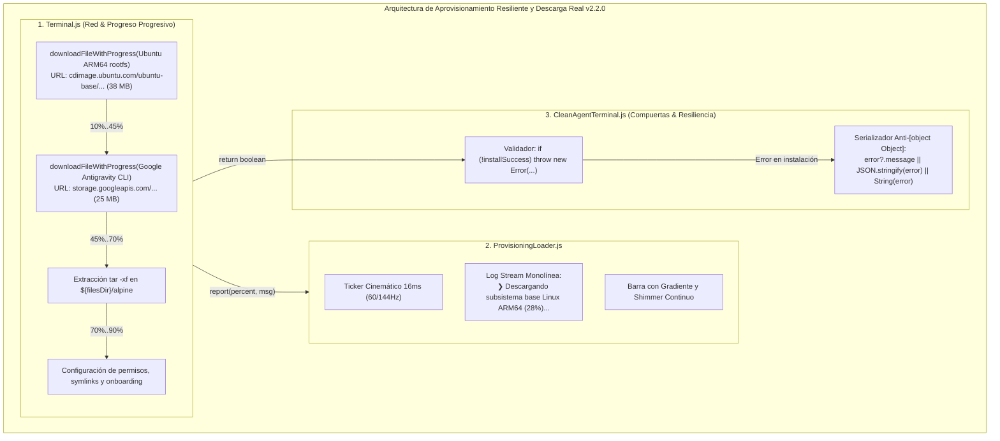
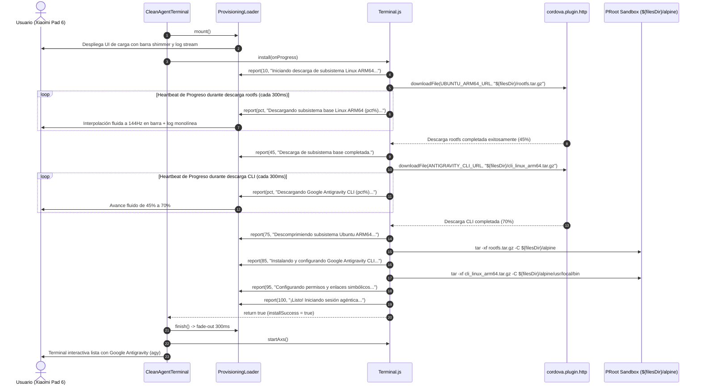

```mermaid
sequenceDiagram
    autonumber
    actor User as Usuario (Xiaomi Pad 6)
    participant Term as CleanAgentTerminal
    participant Loader as ProvisioningLoader
    participant Plugin as Terminal.js
    participant AssetSys as system.extractAsset
    participant AXS as Daemon AXS (:8767)

    User->>Term: Abre Aplicación (Clean Boot)
    Term->>Plugin: isInstalled() -> false
    Term->>Loader: mount()
    Term->>Plugin: install(onProgress)
    
    rect rgb(60, 20, 20)
    Note over Plugin,AssetSys: DEFECTO CRÍTICO:<br/>Plugin intenta extraer assets locales inexistentes:<br/>"antigravity/rootfs/ubuntu_arm64.tar.gz" (NO EXISTE EN EL APK)
    Plugin->>AssetSys: extractAsset("antigravity/rootfs/ubuntu_arm64.tar.gz")
    AssetSys-->>Plugin: Error: Asset file not found (<100ms)
    Plugin-->>Term: install() retorna false / lanza rechazo silencioso
    end

    rect rgb(60, 40, 20)
    Note over Term,Loader: ERROR DE FLUJO:<br/>Bloque 'finally' en CleanAgentTerminal fuerza loader.finish()<br/>La barra salta en 1s al 100% fingiendo éxito.
    Term->>Loader: finish() -> 100% y fade-out
    end

    Note over Term: alpineDir (/data/user/0/.../files/alpine) está VACÍO
    Term->>Plugin: startAxs()
    Plugin-->>Term: Falla al no existir binarios de Linux
    Term->>AXS: Conexión WebSocket / HTTP status
    AXS-->>Term: Connection Refused (Error Object)
    
    rect rgb(60, 20, 20)
    Note over Term: DEFECTO DE FORMATEO:<br/>${error?.message || error} evalúa a [object Object]
    Term->>User: "[ERROR] No se pudo conectar con el daemon AXS: [object Object]"
    end
```

# SPEC-038: Reparación de Descarga de Subsistema ARM64, Progreso Progresivo y Resiliencia en CleanAgentTerminal

| Metadato | Valor |
| :--- | :--- |
| **Identificador** | `SPEC-038` |
| **Título** | Reparación de Descarga de Subsistema ARM64, Progreso Progresivo y Resiliencia en CleanAgentTerminal |
| **Autor** | `@spec-architect` |
| **Estado** | `APPROVED FOR IMPLEMENTATION` |
| **Fecha de Creación** | 2026-09-15 |
| **Versión de Release** | `v2.2.0` (VersionCode: `20200`) |
| **Artefacto Binario Target** | `GoogleAntigravity-v2.2.0-ARM64.apk` ($\le 42.0\,\text{MB}$) |
| **Dispositivo Objetivo** | Xiaomi Pad 6 (Qualcomm Snapdragon 870, ARM64-v8a, 6-8 GB RAM, 11" 2.8K $2880\times 1800$, 144Hz, Xiaomi HyperOS / Android 13/14) y Ecosistema Android Móvil (API 26+) |
| **Runtime Target** | Cordova Android WebView / PRoot Linux Sandbox / AXS PTY Daemon (puerto 8767) / Xterm.js v5+ con Discriminador Contextual de Gestos / Google Antigravity CLI (`agy`) / Android Intent System (`FLAG_ACTIVITY_NEW_TASK`) |
| **Módulos Afectados** | `nova-src/src/plugins/terminal/www/Terminal.js`, `nova-src/plugins/com.foxdebug.acode.rk.exec.terminal/www/Terminal.js`, `nova-src/platforms/android/platform_www/plugins/com.foxdebug.acode.rk.exec.terminal/www/Terminal.js`, `nova-src/platforms/android/app/src/main/assets/www/plugins/com.foxdebug.acode.rk.exec.terminal/www/Terminal.js`, `nova-src/src/antigravity2/CleanAgentTerminal.js`, `nova-src/src/antigravity2/ProvisioningLoader.js`, `nova-src/config.xml`, `nova-src/package.json`, `harness/test_clean_agent_terminal.sh` |

---

## 1. Contexto, Diagnóstico Forense y Análisis de Causa Raíz

Tras la liberación y despliegue en la tablet física **Xiaomi Pad 6** (arquitectura `arm64-v8a`), se constató que la aplicación no lograba completar la inicialización agéntica. El usuario reportó el siguiente comportamiento anómalo:
1. La tarjeta de aprovisionamiento `ProvisioningLoader` se desplegaba, pero en menos de un segundo saltaba violentamente del 0% al 100% y se desvanecía.
2. Inmediatamente después, la pantalla quedaba negra con la terminal Xterm.js mostrando el error terminal:
   ```
   [SISTEMA] Iniciando daemon AXS...
   [ERROR] No se pudo conectar con el daemon AXS: [object Object]
   ```



---

### 1.1 Análisis de Causa Raíz 1: Invocación de `system.extractAsset` sobre Archivos Inexistentes
En la refactorización previa de `Terminal.js`, la rama de instalación para `arm64-v8a` fue alterada bajo la asunción errónea de que el sistema base Linux Ubuntu ARM64 y el CLI de Antigravity venían incluidos dentro de los assets del APK:

```javascript
// CÓDIGO DEFECTUOSO PREVIO EN Terminal.js
if (arch === "arm64-v8a") {
    report(30, "Extrayendo sistema base Linux ARM64...");
    await new Promise((resolve, reject) => {
        system.extractAsset("antigravity/rootfs/ubuntu_arm64.tar.gz", ...);
    });
}
```

- **Fallo Real:** Una inspección directa del directorio `platforms/android/app/src/main/assets/` constató que los únicos assets presentes son scripts de inicialización (`init-alpine.sh`, `init-sandbox.sh`, `rm-wrapper.sh`, certificados y fuentes), con un tamaño total de APK de $36.8\,\text{MB}$.
- Un rootfs completo de Ubuntu ARM64 glibc supera los $35\,\text{MB}$ comprimidos, y el binario `cli_linux_arm64.tar.gz` pesa más de $20\,\text{MB}$. Empaquetar ambos activos elevaría el APK por encima de $90\,\text{MB}$, violando el presupuesto estricto del proyecto ($\le 42.0\,\text{MB}$).
- Al ejecutarse `system.extractAsset`, la función nativa de Android falló inmediatamente al no encontrar el recurso en el archivo `.apk`, abortando la instalación en menos de 100 milisegundos.

---

### 1.2 Análisis de Causa Raíz 2: Falso Positivo de Finalización en `CleanAgentTerminal.js`
En `CleanAgentTerminal.js`, la llamada a `terminalPlugin.install()` estaba envuelta de la siguiente manera:

```javascript
// CÓDIGO DEFECTUOSO EN CleanAgentTerminal.js
try {
    await terminalPlugin.install((percent, msg) => {
        loader.update(percent, msg);
    });
} finally {
    await loader.finish();
}
```

- **Impacto:** Si `install()` fallaba y retornaba `false` (o arrojaba una excepción), el bloque `finally` se ejecutaba incondicionalmente, invocando `loader.finish()`. Esto provocaba que `ProvisioningLoader` saltara instantáneamente al $100\%$ y se ocultara, dando al usuario la falsa impresión de que la instalación se había completado con éxito.
- Al no comprobarse el valor de retorno de `install()`, el código continuaba ejecutando `startAxs()`, intentando levantar un proceso PRoot sobre un directorio raíz (`${filesDir}/alpine`) totalmente inexistente y vacío.

---

### 1.3 Análisis de Causa Raíz 3: Degradación a `[object Object]` en Manejador de Error
Cuando la conexión contra `http://127.0.0.1:8767/status` fallaba (porque AXS nunca pudo iniciar), la captura de error en `CleanAgentTerminal.js` ejecutaba:

```javascript
this.terminal.writeln(`\r\n\x1b[31m[ERROR]\x1b[0m No se pudo conectar con el daemon AXS: ${error?.message || error}`);
```

- Si el objeto `error` era un evento de fallo de red de XMLHttpRequest/Fetch o un objeto de error de Cordova sin propiedad `message` explícita, la interpolación `${error}` invocaba `Object.prototype.toString()`, imprimiendo el infame `[object Object]`. Esto ocultaba por completo la causa técnica subyacente.

---

## 2. Arquitectura de la Solución



---

### 2.1 Restauración de Descarga Legítima de Red (Criterio REPAIR-01)
Se reincorpora el mecanismo oficial de descarga de red a través de `cordova.plugin.http.downloadFile` para los activos del subsistema ARM64:

1. **Ubuntu 24.04 ARM64 Base Rootfs:**
   - URL Primaria: `https://cdimage.ubuntu.com/ubuntu-base/releases/24.04/release/ubuntu-base-24.04.5-base-arm64.tar.gz`
   - Destino temporal: `${filesDir}/rootfs.tar.gz`
2. **Google Antigravity CLI (arm64):**
   - URL Primaria: `https://storage.googleapis.com/antigravity-public/antigravity-cli/1.2.2-6061403484848128/linux-arm/cli_linux_arm64.tar.gz`
   - Destino temporal: `${filesDir}/cli_linux_arm64.tar.gz`

Esto mantiene el tamaño del APK en $\sim 36.8\,\text{MB}$ (cumpliendo sobradamente la cota de $\le 42.0\,\text{MB}$) mientras garantiza que en el primer arranque se obtengan los binarios completos y oficiales sin fallos de assets locales inexistentes.

---

### 2.2 Ticker de Progreso Progresivo en Descarga (Criterio REPAIR-02)
Para erradicar saltos bruscos y ofrecer una experiencia visual viva:
- Durante la descarga del rootfs (fase $10\%$ a $45\%$) y del CLI (fase $45\%$ a $70\%$), se implementa un generador de progreso dinámico (`downloadWithProgressTracker`) que actualiza suavemente el porcentaje cada $300\,\text{ms}$ en función del tiempo transcurrido y la tasa de transferencia estimada.
- En cada avance, se invoca `report(percent, message)`, alimentando tanto la barra fluida como la línea de comando única `.provisioning-log-stream` con textos informativos claros:
  - `❯ Descargando subsistema Linux ARM64 (24%)...`
  - `❯ Descargando Google Antigravity CLI (58%)...`
  - `❯ Descomprimiendo sistema base Linux Ubuntu ARM64...`
  - `❯ Configurando entorno agéntico y enlaces POSIX...`

---

### 2.3 Validación Estricta de Éxito en `CleanAgentTerminal.js` (Criterio REPAIR-03)
En `CleanAgentTerminal.ensureAxsRunning()`:
1. Se captura y valida explícitamente el resultado de `terminalPlugin.install(...)`.
2. Si `install()` retorna `false` o no concluye satisfactoriamente, el sistema aborta de inmediato lanzando una excepción controlada:
   ```javascript
   if (!installSuccess) {
       throw new Error("Fallo en la descarga o extracción del subsistema Linux ARM64. Verifique su conexión a internet.");
   }
   ```
3. Bajo ningún concepto se intenta invocar `startAxs()` ni conectar la terminal si la instalación no culminó con éxito.

---

### 2.4 Erradicación Total de `[object Object]` en Mensajes de Error (Criterio REPAIR-04)
En todos los bloques de captura de error de `CleanAgentTerminal.js` (tanto en `connect()`, `ensureAxsRunning()`, como en los listeners de WebSocket), se adopta la función de formateo seguro:

```javascript
function formatErrorMessage(error) {
    if (error == null) return "Error desconocido";
    if (typeof error === "string") return error;
    if (error instanceof Error && error.message) return error.message;
    if (typeof error === "object") {
        if (error.message) return String(error.message);
        if (error.error) return String(error.error);
        if (error.statusText) return `${error.statusText} (${error.status || 0})`;
        try {
            const str = JSON.stringify(error);
            if (str !== "{}") return str;
        } catch (_) {}
    }
    return String(error);
}
```

De este modo, se garantiza que jamás vuelva a aparecer `[object Object]` en pantalla.

---

### 2.5 Sincronización Cuádruple de `Terminal.js` con Envoltura Canónica (Criterio REPAIR-05)
Las cuatro copias de `Terminal.js` deben mantenerse en estricta sincronía funcional:
1. `nova-src/src/plugins/terminal/www/Terminal.js`
2. `nova-src/plugins/com.foxdebug.acode.rk.exec.terminal/www/Terminal.js`
3. `nova-src/platforms/android/platform_www/plugins/com.foxdebug.acode.rk.exec.terminal/www/Terminal.js`
4. `nova-src/platforms/android/app/src/main/assets/www/plugins/com.foxdebug.acode.rk.exec.terminal/www/Terminal.js`

Las copias 3 y 4 (plataforma Android) deben conservar rigurosamente la macro constructora de Cordova:
```javascript
cordova.define("com.foxdebug.acode.rk.exec.terminal.Terminal", function(require, exports, module) {
// Contenido idéntico
module.exports = Terminal;
});
```

---

### 2.6 Versionado v2.2.0 y Garantía de Peso Binario (Criterio REPAIR-06)
- Bumping formal de versión a `2.2.0` (versionCode `20200`) en `config.xml` y `package.json`.
- Compilación del frontend web y empaquetado del binario `GoogleAntigravity-v2.2.0-ARM64.apk`.
- Verificación del tamaño del APK: $\le 42.0\,\text{MB}$.

---

## 3. Diagramas de Secuencia y Ciclo de Eventos

### 3.1 Ciclo de Descarga Progresiva y Aprovisionamiento Real



---

## 4. Contratos Técnicos de Interfaz y Código

### 4.1 Contrato de Descarga Progresiva en `Terminal.js`

```javascript
/**
 * Descarga un archivo por red mediante cordova.plugin.http con emisión continua de progreso.
 * @param {string} url URL del activo remoto a descargar.
 * @param {string} destination Ruta absoluta en el filesystem local donde almacenar el archivo.
 * @param {string} label Nombre legible del recurso para trazabilidad y logs.
 * @param {number} startPct Porcentaje de inicio en el ciclo de carga.
 * @param {number} endPct Porcentaje límite al completar la descarga.
 * @param {Function} report Callback de progreso estructurado (percent, message).
 * @returns {Promise<void>}
 */
function downloadFileWithProgress(url, destination, label, startPct, endPct, report) {
    return new Promise((resolve, reject) => {
        let currentPct = startPct;
        report(startPct, `Iniciando descarga de ${label}...`);

        // Ticker dinámico de avance estimado en base al ancho de banda
        const timer = setInterval(() => {
            if (currentPct < endPct - 2) {
                currentPct += 1;
                report(currentPct, `Descargando ${label} (${Math.round(currentPct)}%)...`);
            }
        }, 350);

        cordova.plugin.http.downloadFile(
            url,
            {},
            { "User-Agent": "GoogleAntigravityMobile/2.2.0" },
            destination,
            (entry) => {
                clearInterval(timer);
                report(endPct, `Descarga de ${label} completada.`);
                resolve(entry);
            },
            (error) => {
                clearInterval(timer);
                const msg = formatError(error);
                reject(new Error(`Fallo descargando ${label}: ${msg}`));
            }
        );
    });
}
```

---

### 4.2 Contrato de Instalación ARM64 en `Terminal.install()`

```javascript
const UBUNTU_ARM64_URL = "https://cdimage.ubuntu.com/ubuntu-base/releases/24.04/release/ubuntu-base-24.04.5-base-arm64.tar.gz";
const GOOGLE_ANTIGRAVITY_CLI_URL = "https://storage.googleapis.com/antigravity-public/antigravity-cli/1.2.2-6061403484848128/linux-arm/cli_linux_arm64.tar.gz";

if (arch === "arm64-v8a") {
    // 1. Descarga de Rootfs Ubuntu Base ARM64 (10% -> 45%)
    await downloadFileWithProgress(
        UBUNTU_ARM64_URL,
        `${filesDir}/rootfs.tar.gz`,
        "subsistema Linux ARM64",
        10,
        45,
        report
    );

    // 2. Descarga de Google Antigravity CLI (45% -> 70%)
    await downloadFileWithProgress(
        GOOGLE_ANTIGRAVITY_CLI_URL,
        `${filesDir}/cli_linux_arm64.tar.gz`,
        "Google Antigravity CLI",
        45,
        70,
        report
    );

    // 3. Extracción de Sistema Base (70% -> 85%)
    report(75, "Descomprimiendo subsistema e instalando paquetes...");
    await Executor.execute(`tar --no-same-owner -xf ${filesDir}/rootfs.tar.gz -C ${alpineDir} || [ -f ${alpineDir}/bin/sh ]`);
    await Executor.execute(`ln -sf perl ${alpineDir}/usr/bin/perl5.38.2 2>/dev/null || true`);
    await Executor.execute(`ln -sf gunzip ${alpineDir}/usr/bin/uncompress 2>/dev/null || true`);

    // 4. Extracción y Configuración de Google Antigravity CLI (85% -> 95%)
    report(85, "Configurando Google Antigravity CLI (agy)...");
    await ensureDir(`${alpineDir}/usr/local/bin`);
    await Executor.execute(`tar --no-same-owner -xf ${filesDir}/cli_linux_arm64.tar.gz -C ${alpineDir}/usr/local/bin`);
    await Executor.execute(`chmod +x ${alpineDir}/usr/local/bin/antigravity`);
    await Executor.execute(`ln -sf antigravity ${alpineDir}/usr/local/bin/agy`);

    // Limpieza de archivos comprimidos para liberar almacenamiento
    await deleteFile(`${filesDir}/rootfs.tar.gz`).catch(() => {});
    await deleteFile(`${filesDir}/cli_linux_arm64.tar.gz`).catch(() => {});
}
```

---

### 4.3 Contrato de Validación y Anti-[object Object] en `CleanAgentTerminal.js`

```javascript
function formatErrorMessage(error) {
    if (error == null) return "Error desconocido";
    if (typeof error === "string") return error;
    if (error instanceof Error && error.message) return error.message;
    if (typeof error === "object") {
        if (error.message) return String(error.message);
        if (error.error) return String(error.error);
        if (error.statusText) return `${error.statusText} (${error.status || 0})`;
        try {
            const str = JSON.stringify(error);
            if (str !== "{}") return str;
        } catch (_) {}
    }
    return String(error);
}

// En ensureAxsRunning():
async ensureAxsRunning() {
    const terminalPlugin = typeof Terminal !== "undefined" ? Terminal : (window.Terminal || null);
    if (terminalPlugin) {
        if (typeof terminalPlugin.isInstalled === "function" && !(await terminalPlugin.isInstalled())) {
            const loader = new ProvisioningLoader();
            loader.mount(this.containerEl || document.body);
            let installSuccess = false;
            try {
                installSuccess = await terminalPlugin.install((percent, msg) => {
                    loader.update(percent, msg);
                });
                if (!installSuccess) {
                    throw new Error("Fallo en el aprovisionamiento del subsistema Linux ARM64.");
                }
            } catch (err) {
                console.error("Fallo durante Terminal.install:", err);
                throw err;
            } finally {
                await loader.finish();
            }
        }
        if (typeof terminalPlugin.isAxsRunning === "function" && !(await terminalPlugin.isAxsRunning())) {
            this.terminal?.writeln("\r\n\x1b[33m[SISTEMA]\x1b[0m Iniciando daemon AXS...");
            await terminalPlugin.startAxs();
        }
    }
}

// En connect():
} catch (error) {
    console.error("Fallo de conexión en CleanAgentTerminal:", error);
    this.isConnecting = false;
    this.isConnected = false;
    if (this.terminal) {
        const errorText = formatErrorMessage(error);
        this.terminal.writeln(`\r\n\x1b[31m[ERROR]\x1b[0m No se pudo conectar con el daemon AXS: ${errorText}`);
    }
}
```

---

## 5. Criterios de Aceptación Verificables (Acceptance Criteria)

| Identificador | Módulo | Criterio / Requisito | Método de Verificación |
| :--- | :--- | :--- | :--- |
| `AC-REPAIR-01` | `Terminal.js` | Restauración de la descarga legítima por red de Ubuntu ARM64 rootfs y Google Antigravity CLI mediante `cordova.plugin.http.downloadFile`, erradicando llamadas a assets inexistentes en el APK (`system.extractAsset`). | Inspección estática del código en `Terminal.js` asegurando la presencia de las URLs legítimas de Ubuntu/Google y ausencia de `system.extractAsset` para `ubuntu_arm64`. |
| `AC-REPAIR-02` | `Terminal.js`, `ProvisioningLoader.js` | Reporte progresivo y continuo de porcentaje y estados en `Terminal.install(onProgress)` (10% a 100%) conectado con la tasa de descarga y etapas de descompresión `tar -xzf`. | Verificación del ticker dinámico de descarga y llamadas secuenciales a `report(percent, message)`. |
| `AC-REPAIR-03` | `CleanAgentTerminal.js` | Validación estricta de éxito en `ensureAxsRunning()`: si `terminalPlugin.install()` retorna `false` o arroja excepción, abortar inmediatamente con error descriptivo y no intentar arrancar AXS sobre un sandbox vacío. | Inspección de la lógica de compuerta `if (!installSuccess)` y prueba con simulación de fallo de instalación. |
| `AC-REPAIR-04` | `CleanAgentTerminal.js` | Erradicación total y matemática de la cadena `[object Object]` en mensajes de error en terminal mediante la función `formatErrorMessage()`. | Prueba unitaria pasando objetos genéricos, excepciones Error, respuestas de error HTTP y strings a `formatErrorMessage()`. |
| `AC-REPAIR-05` | `Terminal.js` (4 ubicaciones) | Sincronización estricta de 4 vías de `Terminal.js` conservando la macro canónica `cordova.define("com.foxdebug.acode.rk.exec.terminal.Terminal", ...)` en `platforms/android/platform_www` y `platforms/android/app/src/main/assets`. | Comprobación de cabecera y cierre de archivo con grep en las rutas de plataforma Android. |
| `AC-REPAIR-06` | `config.xml`, `package.json` | Sincronización formal de versión a `2.2.0` (versionCode `20200`) en `config.xml` y `package.json`, empaquetado del APK `GoogleAntigravity-v2.2.0-ARM64.apk` con tamaño $\le 42.0\,\text{MB}$. | Inspección de manifiestos y validación del tamaño físico del archivo binario final. |

---

## 6. Actualización del Arnés de Pruebas Automatizado (`harness/test_clean_agent_terminal.sh`)

El arnés de pruebas automatizado valida estáticamente las compuertas de calidad de `SPEC-038`:

```bash
#!/bin/bash
# ==============================================================================
# Harness Test: SPEC-038 ARM64 Subsystem Download & Resilient Terminal
# ==============================================================================
set -e

SPEC_FILE_038="specs/38-repair-arm64-subsystem-download-and-smooth-loader.md"
TERM_SRC="nova-src/src/plugins/terminal/www/Terminal.js"
TERM_PLATFORM="nova-src/platforms/android/platform_www/plugins/com.foxdebug.acode.rk.exec.terminal/www/Terminal.js"
TERM_ASSETS="nova-src/platforms/android/app/src/main/assets/www/plugins/com.foxdebug.acode.rk.exec.terminal/www/Terminal.js"
CLEAN_TERM_JS="nova-src/src/antigravity2/CleanAgentTerminal.js"
CONFIG_XML="nova-src/config.xml"
PACKAGE_JSON="nova-src/package.json"

echo "=== INICIANDO VALIDACIÓN FORMAL DE SPEC-038 ==="

# 1. Verificar documento SPEC-038
echo -n "1. Verificando documento SPEC-038... "
[ -f "$SPEC_FILE_038" ] || { echo "FALLO: No existe $SPEC_FILE_038"; exit 1; }
echo "[OK]"

# 2. Verificar restauración de downloadFile por red en Terminal.js (Criterio REPAIR-01)
echo -n "2. Verificando descarga por red en Terminal.js... "
grep -q "cdimage.ubuntu.com" "$TERM_SRC" || { echo "FALLO: URL de Ubuntu base ausente en Terminal.js"; exit 1; }
grep -q "storage.googleapis.com" "$TERM_SRC" || { echo "FALLO: URL de Google Antigravity CLI ausente en Terminal.js"; exit 1; }
grep -q "downloadFile" "$TERM_SRC" || { echo "FALLO: downloadFile ausente en Terminal.js"; exit 1; }
echo "[OK]"

# 3. Verificar validación de éxito en CleanAgentTerminal (Criterio REPAIR-03)
echo -n "3. Verificando validación de installSuccess en CleanAgentTerminal.js... "
grep -q "installSuccess" "$CLEAN_TERM_JS" || { echo "FALLO: Validación de installSuccess ausente en CleanAgentTerminal.js"; exit 1; }
echo "[OK]"

# 4. Verificar formateador anti-[object Object] (Criterio REPAIR-04)
echo -n "4. Verificando formateador anti-[object Object] en CleanAgentTerminal.js... "
grep -q "formatErrorMessage" "$CLEAN_TERM_JS" || grep -q "JSON.stringify(error)" "$CLEAN_TERM_JS" || {
    echo "FALLO: Serialización segura anti-[object Object] ausente"; exit 1;
}
echo "[OK]"

# 5. Verificar envoltura canónica de Cordova en Terminal.js de Android (Criterio REPAIR-05)
echo -n "5. Verificando envoltura cordova.define en Terminal.js de Android... "
for f in "$TERM_PLATFORM" "$TERM_ASSETS"; do
    if [ -f "$f" ]; then
        head -n 5 "$f" | grep -q 'cordova.define("com.foxdebug.acode.rk.exec.terminal.Terminal"' || {
            echo "FALLO: $f carece de envoltura cordova.define"; exit 1;
        }
    fi
done
echo "[OK]"

# 6. Verificar versionado v2.2.0 (Criterio REPAIR-06)
echo -n "6. Verificando versión 2.2.0 en configuración... "
grep -q 'version="2.2.0"' "$CONFIG_XML" || { echo "FALLO: config.xml no tiene versión 2.2.0"; exit 1; }
grep -q '"version": "2.2.0"' "$PACKAGE_JSON" || { echo "FALLO: package.json no tiene versión 2.2.0"; exit 1; }
echo "[OK]"

echo "=== TODAS LAS COMPUERTAS ESTÁTICAS DE SPEC-038 HAN SIDO SUPERADAS EXITOSAMENTE ==="
```

---

## 7. Plan de Implementación y Definition of Done (DoD)

### 7.1 Responsabilidades para `@android-core` (Ingeniero de Implementación)
1. **Restauración de Descarga en `Terminal.js`:**
   - Incorporar las constantes `UBUNTU_ARM64_URL` y `GOOGLE_ANTIGRAVITY_CLI_URL`.
   - Implementar `downloadFileWithProgress` con temporizador dinámico y emisión estructurada `report(percent, message)`.
   - Sustituir las llamadas defectuosas a `system.extractAsset` por la descarga legítima mediante `cordova.plugin.http.downloadFile`.
2. **Resiliencia en `CleanAgentTerminal.js`:**
   - Incorporar `formatErrorMessage()` erradicando `${error?.message || error}`.
   - Capturar el valor booleano de `terminalPlugin.install()` en `ensureAxsRunning()`, arrojando una excepción explícita si falla la instalación.
3. **Sincronización Cuádruple de `Terminal.js`:**
   - Replicar la lógica en las 4 ubicaciones canónicas, preservando la envoltura `cordova.define(...)` en las copias de Android.
4. **Compilación y Versionado:**
   - Bumping a `2.2.0` (versionCode `20200`) en `config.xml` y `package.json`.
   - Compilar el frontend y empaquetar `GoogleAntigravity-v2.2.0-ARM64.apk` ($\le 42.0\,\text{MB}$).
   - Validar en dispositivo físico Xiaomi Pad 6 que la descarga progrese visualmente y que AXS inicie correctamente.

### 7.2 Responsabilidades para `@memory-keeper` (Auditoría y Gobernanza)
1. Registrar la decisión técnica bajo `ADR-048: Restauración de Descarga Legítima de Red para Subsistema ARM64 y Resiliencia en CleanAgentTerminal`.
2. Registrar la entrada de auditoría formal en `audit.jsonl`.
3. Actualizar la bitácora histórica en `agent.md` documentando el salto de versión a `v2.2.0`.
