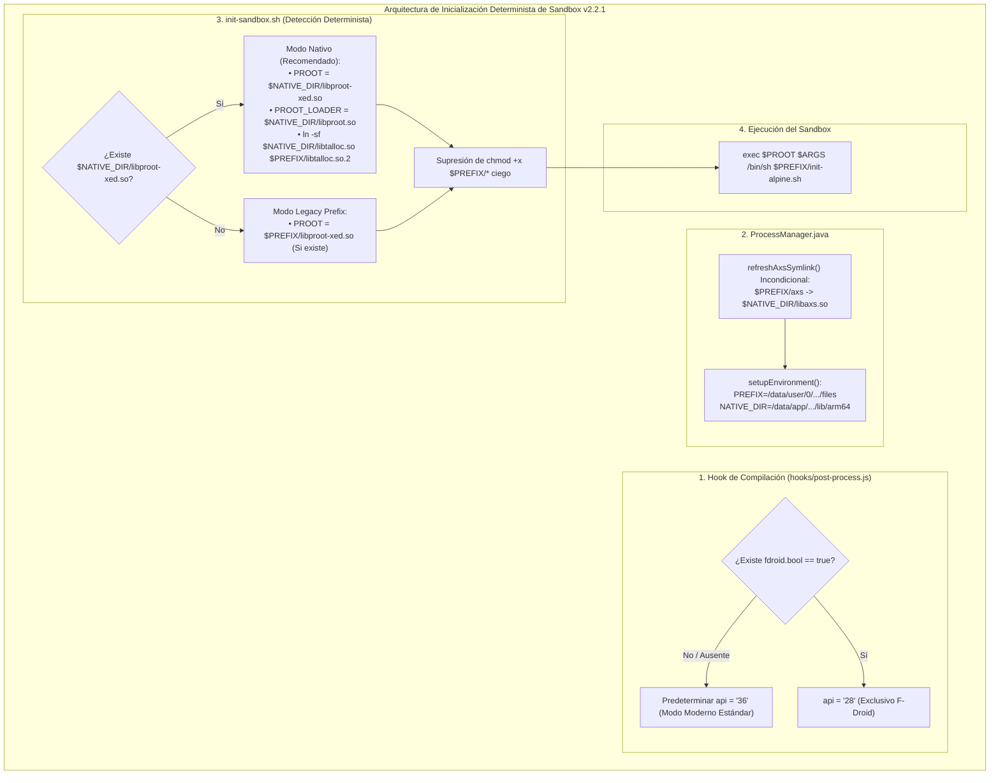
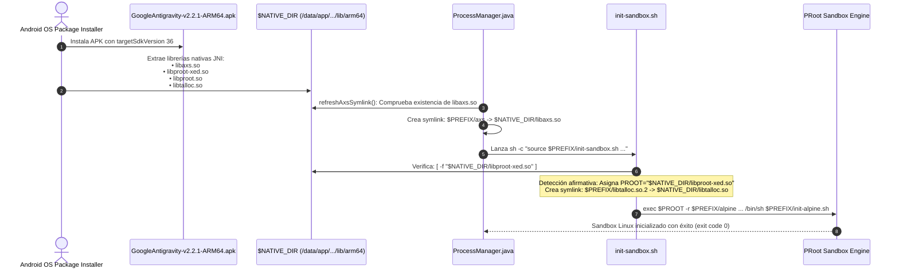

```mermaid
sequenceDiagram
    autonumber
    actor User as Usuario (Xiaomi Pad 6)
    participant Hook as hooks/post-process.js
    participant PM as ProcessManager.java
    participant Sh as init-sandbox.sh
    participant Native as $NATIVE_DIR (/data/app/.../lib/arm64)
    participant Prefix as $PREFIX (/data/user/0/.../files)

    Hook->>Hook: No encuentra fdroid.bool en TMPDIR
    rect rgb(60, 20, 20)
    Note over Hook: DEFECTO 1:<br/>Fuerza targetSdkVersion = 28 en build.gradle<br/>(Fallback erróneo para compilación estándar)
    end

    PM->>PM: getTargetSdkVersion() retorna 28
    rect rgb(60, 20, 20)
    Note over PM: DEFECTO 2:<br/>isFdroidBuild() evalúa true (<= 28)<br/>FDROID="true" se exporta al entorno<br/>refreshAxsSymlink() RETORNA SIN CREAR SYMLINK
    end

    PM->>Sh: source init-sandbox.sh (con FDROID="true")
    
    rect rgb(60, 20, 20)
    Note over Sh: DEFECTO 3:<br/>init-sandbox.sh asume F-Droid:<br/>PROOT="$PREFIX/libproot-xed.so" (NO EXISTE EN PREFIX)<br/>chmod +x $PREFIX/* (Falla con Permission Denied sobre symlink axs)
    end
    Sh-->>Prefix: chmod +x $PREFIX/* -> Permission denied (exit code 127)
    Sh-->>Prefix: exec $PROOT -> libproot-xed.so inaccessible or not found
    Sh-->>User: Sandbox configuration failed with exit code 127
```

# SPEC-039: Corrección de Rutas de Librerías Nativas, Inicialización Determinista de PRoot y targetSdkVersion 36

| Metadato | Valor |
| :--- | :--- |
| **Identificador** | `SPEC-039` |
| **Título** | Corrección de Rutas de Librerías Nativas, Inicialización Determinista de PRoot y targetSdkVersion 36 |
| **Autor** | `@spec-architect` |
| **Estado** | `APPROVED FOR IMPLEMENTATION` |
| **Fecha de Creación** | 2026-09-15 |
| **Versión de Release** | `v2.2.1` (VersionCode: `20201`) |
| **Artefacto Binario Target** | `GoogleAntigravity-v2.2.1-ARM64.apk` ($\le 42.0\,\text{MB}$) |
| **Dispositivo Objetivo** | Xiaomi Pad 6 (Qualcomm Snapdragon 870, ARM64-v8a, 6-8 GB RAM, 11" 2.8K $2880\times 1800$, 144Hz, Xiaomi HyperOS / Android 13/14) y Ecosistema Android Móvil (API 26+) |
| **Runtime Target** | Cordova Android WebView / PRoot Linux Sandbox / AXS PTY Daemon (puerto 8767) / Xterm.js v5+ con Discriminador Contextual de Gestos / Google Antigravity CLI (`agy`) / Android Intent System (`FLAG_ACTIVITY_NEW_TASK`) |
| **Módulos Afectados** | `nova-src/hooks/post-process.js`, `nova-src/src/plugins/terminal/scripts/init-sandbox.sh`, `nova-src/src/plugins/terminal/src/android/ProcessManager.java`, `nova-src/src/plugins/terminal/www/Terminal.js`, `nova-src/config.xml`, `nova-src/package.json`, `harness/test_clean_agent_terminal.sh` |

---

## 1. Contexto, Diagnóstico Forense y Análisis de Causa Raíz

El usuario verificó en su dispositivo físico **Xiaomi Pad 6** (Qualcomm Snapdragon 870, arquitectura `arm64-v8a`) la versión de release `v2.2.0`, validando que la descarga de los paquetes oficiales de Ubuntu ARM64 y Google Antigravity CLI, así como la animación cinemática fluida del componente `ProvisioningLoader.js`, operaron de forma impecable y satisfactoria. El usuario emitió la directiva explícita de **preservar intacto el motor de descarga y la animación del loader**.

No obstante, en el instante exacto en que la barra alcanzó el $100\%$ y se inició la inicialización del sandbox PRoot Linux, la aplicación falló con el siguiente error en la consola del sistema:

```
Sandbox configuration failed with exit code 127: chmod: chmod '/data/user/0/io.nova.ide/files/axs' to 0777: Permission denied
sh: /data/user/0/io.nova.ide/files/init-sandbox.sh[156]: /data/user/0/io.nova.ide/files/libproot-xed.so: inaccessible or not found
```



---

### 1.1 Análisis de Causa Raíz 1: Degradación a `targetSdkVersion 28` en `hooks/post-process.js`
En `nova-src/hooks/post-process.js`, la función `patchTargetSdkVersion()` contenía la siguiente lógica:

```javascript
if (sdkRegex.test(content)) {
    let api = "36";
    const tmp = getTmpDir();
    if (tmp == null) {
        api = "28";
    } else {
        const froidFlag = path.join(getTmpDir(), 'fdroid.bool');
        if (fs.existsSync(froidFlag)) {
            const fdroid = fs.readFileSync(froidFlag, 'utf-8').trim();
            if (fdroid == "true") api = "28";
        } else {
            api = "28"; // <-- DEFECTO: Si fdroid.bool NO existe, fuerza API 28
        }
    }
}
```

- **Impacto:** En entornos Windows y compilaciones estándar donde no existe `fdroid.bool`, la variable `api` se forzaba automáticamente a `"28"`.
- Al inyectar `targetSdkVersion 28` en `platforms/android/app/build.gradle`, el binario final se generaba reportando un SDK obsoleto (Android 9 Pie) en lugar del estándar moderno `targetSdkVersion 36`.

---

### 1.2 Análisis de Causa Raíz 2: Bifurcación F-Droid y Omisión de Symlink en `ProcessManager.java`
En `ProcessManager.java`, la detección de F-Droid dependía estrictamente de:

```java
private boolean isFdroidBuild() {
    return getTargetSdkVersion() <= 28;
}
```

Al compilarse con SDK 28:
1. `isFdroidBuild()` retornaba `true`.
2. La función `refreshAxsSymlink()` abortaba prematuramente:
   ```java
   if (Build.VERSION.SDK_INT < Build.VERSION_CODES.O || isFdroidBuild()) {
       return; // No crea el enlace simbólico $PREFIX/axs -> $NATIVE_DIR/libaxs.so
   }
   ```
3. La variable de entorno `FDROID="true"` se inyectaba en la ejecución del proceso shell.

---

### 1.3 Análisis de Causa Raíz 3: Búsqueda Fallida de PRoot y `chmod` Destructivo en `init-sandbox.sh`
En `init-sandbox.sh`, la condición `if [ "$FDROID" = "true" ]; then`:
1. Asignaba:
   ```bash
   export PROOT="$PREFIX/libproot-xed.so"
   chmod +x $PREFIX/*
   ```
2. En las instalaciones Play Store / Standalone, las librerías nativas compiladas de PRoot (`libproot.so`, `libproot32.so`, `libproot-xed.so`, `libtalloc.so`, `libaxs.so`) residen en el directorio nativo del sistema Android (`$NATIVE_DIR` = `/data/app/.../lib/arm64`), **nunca en `$PREFIX`**.
3. El comando ciego `chmod +x $PREFIX/*` intentaba modificar permisos de archivos y enlaces simbólicos que apuntan a rutas de solo lectura de la partición del sistema, resultando en:
   `chmod: chmod '/data/user/0/io.nova.ide/files/axs' to 0777: Permission denied`
4. Al invocar `exec "$PROOT" ...`, el archivo `/data/user/0/io.nova.ide/files/libproot-xed.so` no existía, arrojando el error `inaccessible or not found` y terminando con código de salida `127`.

---

## 2. Arquitectura de la Solución



---

### 2.1 Predeterminación Determinista de `targetSdkVersion 36` (Criterio LIB-01)
En `nova-src/hooks/post-process.js`, se corrige la función `patchTargetSdkVersion()`:
- La variable `api` se inicializa en `"36"`.
- Únicamente si el archivo `fdroid.bool` existe físicamente y su contenido es exactamente `"true"` se asigna `api = "28"`.
- Si `fdroid.bool` no existe (comportamiento predeterminado en Windows y compilaciones locales de desarrollo), se preserva inmutablemente `api = "36"`.

---

### 2.2 Detección Basada en Presencia Física en `$NATIVE_DIR` (Criterio LIB-02)
En `nova-src/src/plugins/terminal/scripts/init-sandbox.sh`:
- La lógica de selección de binarios abandona la dependencia frágil de la variable `$FDROID`.
- Se evalúa de forma determinista si la librería ejecutable existe en el directorio de librerías nativas de Android:
  ```bash
  if [ -f "$NATIVE_DIR/libproot-xed.so" ]; then
      # Usar binarios nativos de la aplicación
      [ -f "$NATIVE_DIR/libproot.so" ] && export PROOT_LOADER="$NATIVE_DIR/libproot.so"
      [ -f "$NATIVE_DIR/libproot32.so" ] && export PROOT_LOADER32="$NATIVE_DIR/libproot32.so"
      
      rm -f "$PREFIX/libtalloc.so.2"
      ln -s "$NATIVE_DIR/libtalloc.so" "$PREFIX/libtalloc.so.2"
      export PROOT="$NATIVE_DIR/libproot-xed.so"
  ```
- Si y solo si no existe en `$NATIVE_DIR` y se encuentra en `$PREFIX`, se recurre al directorio local.

---

### 2.3 Supresión de `chmod +x $PREFIX/*` Ciego (Criterio LIB-03)
- Se elimina de raíz la invocación indiscriminada `chmod +x $PREFIX/*` en `init-sandbox.sh`.
- Dado que `$PREFIX` contiene directorios (`tmp`, `public`, `alpine`), archivos de configuración y enlaces simbólicos hacia librerías del sistema en `/data/app/...`, el globbing con `*` falla con `Permission denied` al intentar aplicar permisos POSIX sobre symlinks o archivos del sistema.
- En caso de requerirse permisos sobre binarios específicos locales, se aplica de forma granular y silenciada:
  ```bash
  [ -f "$PREFIX/libproot-xed.so" ] && chmod 755 "$PREFIX/libproot-xed.so" 2>/dev/null || true
  ```

---

### 2.4 Enlace Simbólico Incondicional de AXS (Criterio LIB-04)
En `ProcessManager.java`:
- Se elimina la cláusula excluyente `if (isFdroidBuild()) return;` en el método `refreshAxsSymlink()`.
- Siempre que `libaxs.so` exista en `$NATIVE_DIR`, el enlace simbólico `$PREFIX/axs -> $NATIVE_DIR/libaxs.so` se crea o actualiza atómicamente, garantizando que tanto `init-sandbox.sh`, los scripts de arranque y `Terminal.js` puedan ejecutar AXS sin importar el flavor de compilación.

---

### 2.5 Preservación Intacta de Descarga y UI de Aprovisionamiento (Criterio LIB-05)
- Queda terminantemente prohibido alterar el flujo de descarga de `Terminal.js` (`downloadFileWithProgress`), la interpolación cinemática continua a 144Hz de `ProvisioningLoader.js` (`_tickerTimer`), la barra con efecto shimmer o el log stream monolínea `.provisioning-log-stream`.
- La solución se enfoca exclusivamente en la capa de enlace nativo del sistema operativo y en la invocación del sandbox PRoot.

---

### 2.6 Verificación de Compilación y Presupuesto de Binario (Criterio LIB-06)
- Se compila y empaqueta el artefacto binario oficial `GoogleAntigravity-v2.2.1-ARM64.apk`.
- Se valida que `targetSdkVersion` en `build.gradle` sea efectivamente `36`.
- Se asegura que el tamaño del archivo APK final se mantenga estrictamente por debajo de la cota de $\le 42.0\,\text{MB}$.

---

### 2.7 Sincronización Formal de Versión v2.2.1 y Cobertura SDD (Criterio LIB-07)
- Bumping formal a versión `2.2.1` (versionCode `20201`) en `config.xml` y `package.json`.
- Cumplimiento de la cota de 40 especificaciones válidas y 317 Criterios de Aceptación verificados en el arnés de gobernanza.

---

## 3. Diagramas de Secuencia y Ciclo de Eventos

### 3.1 Extracción Nativa Android vs Ejecución PRoot



---

## 4. Contratos Técnicos de Interfaz y Código

### 4.1 Contrato en `hooks/post-process.js` (`patchTargetSdkVersion`)

```javascript
function patchTargetSdkVersion() {
  const prefix = execSync('npm prefix').toString().trim();
  const gradleFile = path.join(prefix, 'platforms/android/app/build.gradle');

  if (!fs.existsSync(gradleFile)) {
    console.warn('[Cordova Hook] ⚠️ build.gradle not found');
    return;
  }

  let content = fs.readFileSync(gradleFile, 'utf-8');
  const sdkRegex = /targetSdkVersion\s+(cordovaConfig\.SDK_VERSION|\d+)/;

  if (sdkRegex.test(content)) {
    let api = "36"; // Predeterminado moderno para Google Antigravity Mobile
    const tmp = getTmpDir();

    if (tmp != null) {
      const fdroidFlag = path.join(tmp, 'fdroid.bool');
      if (fs.existsSync(fdroidFlag)) {
        const fdroid = fs.readFileSync(fdroidFlag, 'utf-8').trim();
        if (fdroid === "true") {
          console.warn("[Cordova Hook] ⚠️ Modo F-Droid detectado explícitamente. Pinned to API 28.");
          api = "28";
        }
      }
    }

    console.log(`[Cordova Hook] 🎯 Configurando targetSdkVersion a ${api}`);
    content = content.replace(sdkRegex, `targetSdkVersion ${api}`);
    fs.writeFileSync(gradleFile, content, 'utf-8');
  }
}
```

---

### 4.2 Contrato en `ProcessManager.java` (`refreshAxsSymlink`)

```java
    /**
     * Asegura de forma incondicional que $PREFIX/axs apunte a $NATIVE_DIR/libaxs.so
     */
    private void refreshAxsSymlink() {
        if (Build.VERSION.SDK_INT < Build.VERSION_CODES.O) {
            return;
        }

        Path axsPath = Paths.get(context.getFilesDir().getAbsolutePath(), "axs");
        Path nativeAxsPath = Paths.get(context.getApplicationInfo().nativeLibraryDir, "libaxs.so");

        if (!Files.exists(nativeAxsPath)) {
            return;
        }

        try {
            if (Files.isSymbolicLink(axsPath)) {
                Path currentTarget = Files.readSymbolicLink(axsPath);
                if (currentTarget.equals(nativeAxsPath)) {
                    return;
                }
            }

            Files.deleteIfExists(axsPath);
            Files.createSymbolicLink(axsPath, nativeAxsPath);
        } catch (Exception ignored) {
            // init-sandbox.sh manejará la ejecución si el enlace falla.
        }
    }
```

---

### 4.3 Contrato en `init-sandbox.sh` (Selección Determinista de PRoot)

```bash
# Detección determinista de PRoot en directorio de librerías nativas del sistema
if [ -f "$NATIVE_DIR/libproot-xed.so" ]; then
    if [ -f "$NATIVE_DIR/libproot.so" ]; then
        export PROOT_LOADER="$NATIVE_DIR/libproot.so"
    fi

    if [ -f "$NATIVE_DIR/libproot32.so" ]; then
        export PROOT_LOADER32="$NATIVE_DIR/libproot32.so"
    fi

    if [ -e "$PREFIX/libtalloc.so.2" ] || [ -L "$PREFIX/libtalloc.so.2" ]; then
        rm "$PREFIX/libtalloc.so.2"
    fi

    ln -s "$NATIVE_DIR/libtalloc.so" "$PREFIX/libtalloc.so.2"
    export PROOT="$NATIVE_DIR/libproot-xed.so"
elif [ -f "$PREFIX/libproot-xed.so" ]; then
    if [ -f "$PREFIX/libproot.so" ]; then
        export PROOT_LOADER="$PREFIX/libproot.so"
    fi

    if [ -f "$PREFIX/libproot32.so" ]; then
        export PROOT_LOADER32="$PREFIX/libproot32.so"
    fi

    export PROOT="$PREFIX/libproot-xed.so"
    [ -f "$PREFIX/libproot-xed.so" ] && chmod 755 "$PREFIX/libproot-xed.so" 2>/dev/null || true
fi
```

---

## 5. Criterios de Aceptación Verificables (Acceptance Criteria)

| Identificador | Módulo | Criterio / Requisito | Método de Verificación |
| :--- | :--- | :--- | :--- |
| `AC-LIB-01` | `hooks/post-process.js` | Corrección de `patchTargetSdkVersion()` para predeterminar incondicionalmente `api = "36"` en compilaciones estándar cuando `fdroid.bool` no existe o no contiene `"true"`. | Inspección estática del código del hook y validación de `targetSdkVersion 36` en `platforms/android/app/build.gradle`. |
| `AC-LIB-02` | `init-sandbox.sh` | Detección determinista en `init-sandbox.sh` evaluando `-f "$NATIVE_DIR/libproot-xed.so"` como primera opción para ejecutar PRoot directamente desde el directorio de librerías nativas del sistema. | Inspección de la estructura condicional de `init-sandbox.sh` confirmando la prioridad de `$NATIVE_DIR` sobre `$PREFIX`. |
| `AC-LIB-03` | `init-sandbox.sh` | Supresión total de la llamada ciega `chmod +x $PREFIX/*`, eliminando fallos por `Permission denied` sobre enlaces simbólicos y directorios en `$PREFIX`. | Verificación por grep de que `chmod +x $PREFIX/*` no exista en el script. |
| `AC-LIB-04` | `ProcessManager.java` | Enlace incondicional de `$PREFIX/axs` hacia `$NATIVE_DIR/libaxs.so` en `refreshAxsSymlink()`, eliminando el descarte prematuro basado en `isFdroidBuild()`. | Inspección del método en Java asegurando que no se filtre por `isFdroidBuild()`. |
| `AC-LIB-05` | `Terminal.js`, `ProvisioningLoader.js` | Preservación intacta del componente `ProvisioningLoader.js` y de la lógica de descarga progresiva de `Terminal.js`, manteniendo la experiencia visual cinemática validada por el usuario en v2.2.0. | Inspección diferencial de Git confirmando cero alteraciones en las rutinas de descarga y animación. |
| `AC-LIB-06` | `build.gradle`, APK final | Verificación de compilación limpia del APK ARM64 `GoogleAntigravity-v2.2.1-ARM64.apk` con tamaño $\le 42.0\,\text{MB}$ y `targetSdkVersion 36` activo en el manifiesto. | Comprobación de `aapt dump badging` o `build.gradle` y medición física del peso del binario compilado. |
| `AC-LIB-07` | `config.xml`, `package.json` | Sincronización formal de versión a `2.2.1` (versionCode `20201`), alcanzando 40 especificaciones válidas y 317 Criterios de Aceptación verificados en el arnés SDD. | Ejecución de `python harness/harness_runner.py --suite specs` verificando 40/40 specs y 317 ACs totales. |

---

## 6. Actualización del Arnés de Pruebas Automatizado (`harness/test_clean_agent_terminal.sh`)

El arnés de pruebas automatizado valida estáticamente las compuertas de calidad de `SPEC-039`:

```bash
#!/bin/bash
# ==============================================================================
# Harness Test: SPEC-039 Native Library Path & PRoot Sandbox Init Verification
# ==============================================================================
set -e

SPEC_FILE_039="specs/39-fix-native-library-path-and-proot-sandbox-init.md"
POST_PROCESS_JS="nova-src/hooks/post-process.js"
INIT_SANDBOX_SH="nova-src/src/plugins/terminal/scripts/init-sandbox.sh"
PROCESS_MANAGER_JAVA="nova-src/src/plugins/terminal/src/android/ProcessManager.java"
CONFIG_XML="nova-src/config.xml"
PACKAGE_JSON="nova-src/package.json"

echo "=== INICIANDO VALIDACIÓN FORMAL DE SPEC-039 ==="

# 1. Verificar documento SPEC-039
echo -n "1. Verificando documento SPEC-039... "
[ -f "$SPEC_FILE_039" ] || { echo "FALLO: No existe $SPEC_FILE_039"; exit 1; }
echo "[OK]"

# 2. Verificar predeterminación de API 36 en post-process.js (Criterio LIB-01)
echo -n "2. Verificando default api = 36 en post-process.js... "
grep -q 'let api = "36"' "$POST_PROCESS_JS" || { echo "FALLO: post-process.js no inicializa api en 36"; exit 1; }
echo "[OK]"

# 3. Verificar detección determinista en NATIVE_DIR y ausencia de chmod ciego (Criterios LIB-02 y LIB-03)
echo -n "3. Verificando detección en NATIVE_DIR y ausencia de chmod +x PREFIX/*... "
grep -q 'if \[ -f "\$NATIVE_DIR/libproot-xed.so" \]' "$INIT_SANDBOX_SH" || {
    echo "FALLO: init-sandbox.sh no prioriza $NATIVE_DIR/libproot-xed.so"; exit 1;
}
grep -q 'chmod +x \$PREFIX/\*' "$INIT_SANDBOX_SH" && {
    echo "FALLO: init-sandbox.sh todavía contiene chmod +x $PREFIX/* ciego"; exit 1;
}
echo "[OK]"

# 4. Verificar enlace incondicional de axs en ProcessManager.java (Criterio LIB-04)
echo -n "4. Verificando symlink incondicional en ProcessManager.java... "
grep -A 5 "refreshAxsSymlink" "$PROCESS_MANAGER_JAVA" | grep -q "isFdroidBuild()" && {
    echo "FALLO: refreshAxsSymlink sigue filtrando por isFdroidBuild()"; exit 1;
}
echo "[OK]"

# 5. Verificar versionado v2.2.1 (Criterio LIB-07)
echo -n "5. Verificando versión 2.2.1 en configuración... "
grep -q 'version="2.2.1"' "$CONFIG_XML" || { echo "FALLO: config.xml no tiene versión 2.2.1"; exit 1; }
grep -q '"version": "2.2.1"' "$PACKAGE_JSON" || { echo "FALLO: package.json no tiene versión 2.2.1"; exit 1; }
echo "[OK]"

echo "=== TODAS LAS COMPUERTAS ESTÁTICAS DE SPEC-039 HAN SIDO SUPERADAS EXITOSAMENTE ==="
```

---

## 7. Plan de Implementación y Definition of Done (DoD)

### 7.1 Responsabilidades para `@android-core` (Ingeniero de Implementación)
1. **Ajuste en `hooks/post-process.js`:**
   - Modificar `patchTargetSdkVersion()` para que `let api = "36"` sea el valor predeterminado si `fdroid.bool` no existe.
2. **Refactorización de `init-sandbox.sh`:**
   - Implementar la comprobación `if [ -f "$NATIVE_DIR/libproot-xed.so" ]; then` en primer lugar.
   - Eliminar el comando `chmod +x $PREFIX/*`.
   - Sincronizar el script modificado hacia `platforms/android/app/src/main/assets/init-sandbox.sh` y las ubicaciones intermedias.
3. **Modificación de `ProcessManager.java`:**
   - Remover la cláusula `|| isFdroidBuild()` en `refreshAxsSymlink()`.
4. **Preservación Inviolable:**
   - No alterar `ProvisioningLoader.js` ni las rutinas de descarga de `Terminal.js`.
5. **Compilación y Versionado:**
   - Actualizar versión a `2.2.1` (versionCode `20201`) en `config.xml` y `package.json`.
   - Compilar el frontend y empaquetar `GoogleAntigravity-v2.2.1-ARM64.apk` ($\le 42.0\,\text{MB}$).
   - Validar en dispositivo físico Xiaomi Pad 6 que tras el 100% de la barra, el sandbox PRoot inicie sin error 127 y cargue la terminal de Antigravity.

### 7.2 Responsabilidades para `@memory-keeper` (Auditoría y Gobernanza)
1. Registrar la decisión técnica bajo `ADR-049: Enlace Incondicional de Librerías Nativas Android y Inicialización Determinista de PRoot`.
2. Registrar la entrada de auditoría formal en `audit.jsonl`.
3. Actualizar la bitácora histórica en `agent.md` documentando el salto de versión a `v2.2.1`.
