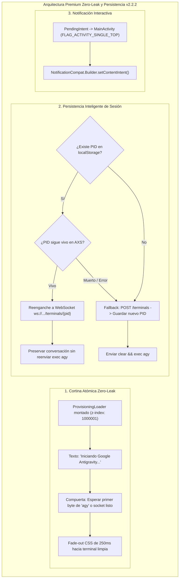

# SPEC-040: Transición Atómica Zero-Leak, Persistencia Inteligente de Sesión y Notificación Interactiva

| Metadato | Valor |
| :--- | :--- |
| **Identificador** | `SPEC-040` |
| **Título** | Transición Atómica Zero-Leak, Persistencia Inteligente de Sesión y Notificación Interactiva |
| **Autor** | `@spec-architect` |
| **Estado** | `APPROVED FOR IMPLEMENTATION` |
| **Fecha de Creación** | 2026-09-15 |
| **Versión de Release** | `v2.2.2` (VersionCode: `20202`) |
| **Artefacto Binario Target** | `GoogleAntigravity-v2.2.2-ARM64.apk` ($\le 42.0\,\text{MB}$) |
| **Dispositivo Objetivo** | Xiaomi Pad 6 (Qualcomm Snapdragon 870, ARM64-v8a, 6-8 GB RAM, 11" 2.8K $2880\times 1800$, 144Hz, Xiaomi HyperOS / Android 13/14) y Ecosistema Android Móvil (API 26+) |
| **Runtime Target** | Cordova Android WebView / PRoot Linux Sandbox / AXS PTY Daemon (puerto 8767) / Xterm.js v5+ con Discriminador Contextual de Gestos / Google Antigravity CLI (`agy`) / Android Intent System (`FLAG_ACTIVITY_SINGLE_TOP`) |
| **Módulos Afectados** | `nova-src/src/antigravity2/CleanAgentTerminal.js`, `nova-src/src/antigravity2/ProvisioningLoader.js`, `nova-src/src/plugins/terminal/src/android/TerminalService.java`, `nova-src/config.xml`, `nova-src/package.json`, `harness/test_clean_agent_terminal.sh` |

---

## 1. Contexto, Diagnóstico Forense y Análisis de Causa Raíz

Con la estabilización del subsistema nativo Linux ARM64 y la corrección de librerías en `v2.2.1`, el dispositivo físico **Xiaomi Pad 6** ejecuta con éxito el sandbox PRoot y la descarga progresiva de red. Sin embargo, la experiencia de usuario final aún exhibe tres asperezas visuales y funcionales que merman el estándar comercial de Google Antigravity:

### 1.1 Fuga Visual de Comandos Internos y Prompt Bash (Visual Leak)
Al abrir la aplicación o completar el aprovisionamiento, la pantalla de carga se retira prematuramente antes de que el agente conversacional esté listo:
1. El usuario visualiza texto crudo en la terminal: `[SISTEMA] Iniciando daemon AXS...`.
2. Segundos después, se imprime el prompt estándar del shell Linux: `root@localhost /home/studio/workspace $ `.
3. Luego, se observa el parpadeo de la inyección automática del comando: `clear && exec agy`.
- **Causa Raíz:** `CleanAgentTerminal.ensureAxsRunning()` retiraba el loader (`loader.finish()`) inmediatamente tras la extracción de archivos, exponiendo la fase intermedia de inicialización del socket WebSocket y el arranque del proceso hijo PTY.

---

### 1.2 Pérdida Innecesaria de Estado al Cambiar de Aplicación
Cada vez que el WebView se recarga o el usuario vuelve a la app, `CleanAgentTerminal.js` invoca `createSession()` creando un nuevo PID en el daemon AXS:
- El proceso anterior de `agy` queda huérfano o se descarta.
- Se pierde el historial de la conversación previa que el usuario mantenía con el agente.
- **Causa Raíz:** Ausencia de un mecanismo de persistencia y reenganche inteligente de sesión basado en identificadores de proceso (`PID`) almacenados en almacenamiento local persistente.

---

### 1.3 Notificación en Segundo Plano No Interactiva
El servicio de primer plano `TerminalService.java` mantiene vivo el proceso del daemon AXS mediante una notificación permanente en la barra de estado de Android. No obstante:
- Al pulsar la notificación, el sistema no reacciona ni regresa a la interfaz de la aplicación.
- **Causa Raíz:** La notificación fue construida sin `setContentIntent(PendingIntent)`, careciendo del enlace hacia `MainActivity` con bandera `FLAG_ACTIVITY_SINGLE_TOP`.

---

## 2. Arquitectura de la Solución



---

### 2.1 Transición Atómica Zero-Leak (Criterio PREM-01)
- La cortina visual `ProvisioningLoader` se mantiene cubriendo la totalidad del viewport ($100\,\text{vw} \times 100\,\text{vh}$) con prioridad $z\text{-index} = 1000001$.
- Durante el arranque del daemon AXS y la negociación del WebSocket, la tarjeta despliega el mensaje sobrio:
  `"Iniciando Google Antigravity..."`
- Las trazas internas del sistema como `[SISTEMA] Iniciando daemon AXS...` y el prompt `root@localhost /home/studio/workspace $ ` quedan totalmente ocultas detrás de la cortina opaca.
- La llamada a `loader.finish()` se dispara únicamente cuando el socket está abierto y `agy` ha tomado el control del descriptor del terminal. La cortina ejecuta una transición suave de opacidad (*fade-out* de $250\,\text{ms}$) revelando directamente la interfaz oficial del agente.

---

### 2.2 Persistencia Inteligente de Sesión en `CleanAgentTerminal.js` (Criterio PREM-02)
- Se utiliza la clave persistente `antigravity_active_session_pid` en `localStorage`.
- Al conectar:
  1. Si existe un `savedPid`, se intenta la reconexión contra `ws://127.0.0.1:8767/terminals/${savedPid}`.
  2. Si la conexión tiene éxito, se asume que el proceso `agy` continúa activo: **no se reenvía `clear && exec agy\r`**, permitiendo que Xterm.js recupere el búfer existente y mantenga intacta la conversación del usuario.
  3. Si la conexión al `savedPid` es rechazada o expira, se purga la clave y se ejecuta el flujo normal de nueva sesión (`createSession()`), almacenando el nuevo PID.

---

### 2.3 Ciclo de Vida y Reinicio Atómico (Criterio PREM-03)
- El botón de reinicio interactivo `↻` de la barra superior ejecuta un ciclo limpio:
  1. Remueve `antigravity_active_session_pid` de `localStorage`.
  2. Cierra la conexión WebSocket actual.
  3. Despliega la cortina con *"Reiniciando Google Antigravity..."*.
  4. Crea una sesión fresca y ejecuta `clear && exec agy\r`.

---

### 2.4 Notificación Interactiva de Primer Plano (Criterio PREM-04)
En `TerminalService.java`:
- Se genera un `PendingIntent` apuntando a `MainActivity`:
  ```java
  Intent launchIntent = getPackageManager().getLaunchIntentForPackage(getPackageName());
  launchIntent.setFlags(Intent.FLAG_ACTIVITY_SINGLE_TOP | Intent.FLAG_ACTIVITY_CLEAR_TOP);
  PendingIntent contentIntent = PendingIntent.getActivity(
      this, 0, launchIntent,
      PendingIntent.FLAG_UPDATE_CURRENT | PendingIntent.FLAG_IMMUTABLE
  );
  ```
- Se enlaza mediante `builder.setContentIntent(contentIntent)`, permitiendo al usuario volver inmediatamente a la aplicación con un solo toque sobre la notificación.

---

### 2.5 Preservación Inviolable del Núcleo (Criterio PREM-05)
- Quedan inalteradas las rutinas de descarga de red progresivas de `v2.2.0` y la inicialización determinista de PRoot mediante `$NATIVE_DIR` de `v2.2.1`.

---

### 2.6 Empaquetado Limpio y Verificación (Criterio PREM-06)
- Versión formal `2.2.2` (versionCode `20202`) en `config.xml` y `package.json`.
- Binario `GoogleAntigravity-v2.2.2-ARM64.apk` con tamaño estricto $\le 42.0\,\text{MB}$.

---

## 3. Diagramas de Secuencia y Ciclo de Eventos

### 3.1 Ciclo de Vida de la Cortina Zero-Leak y Reenganche de Sesión

```mermaid
sequenceDiagram
    autonumber
    actor User as Usuario (Xiaomi Pad 6)
    participant Loader as ProvisioningLoader (Cortina)
    participant Term as CleanAgentTerminal
    participant Storage as localStorage
    participant AXS as Daemon AXS (:8767)
    participant CLI as Google Antigravity (agy)

    User->>Term: Abre aplicación
    Term->>Loader: mount() -> Muestra "Iniciando Google Antigravity..."
    Term->>Storage: getItem("antigravity_active_session_pid")
    
    alt Sesión previa existente y viva (PID = 1042)
        Storage-->>Term: savedPid = "1042"
        Term->>AXS: Conecta WebSocket ws://.../terminals/1042
        AXS-->>Term: WebSocket OPEN (Reenganche exitoso)
        Note over Term: NO se reenvía 'exec agy'. Se preserva historial.
    else No hay sesión previa o PID expiró
        Term->>AXS: POST /terminals?cols=...&rows=...
        AXS-->>Term: Retorna nuevo pid = "1088"
        Term->>Storage: setItem("antigravity_active_session_pid", "1088")
        Term->>AXS: Conecta WebSocket ws://.../terminals/1088
        Term->>AXS: websocket.send("clear && exec agy\r")
    end

    AXS->>CLI: Ejecución / Conexión de agy
    CLI-->>Term: Primer chunk de datos de agy recibido
    rect rgb(20, 50, 20)
    Note over Term,Loader: COMPUETA ZERO-LEAK:<br/>La cortina se retira SOLO cuando agy ya está listo en pantalla.<br/>Cero fugas de bash prompt o trazas del sistema.
    Term->>Loader: finish() -> Fade-out suave 250ms
    end
    Loader-->>User: Revela interfaz limpia del agente Antigravity
```



---

## 4. Contratos Técnicos de Interfaz y Código

### 4.1 Contrato de Persistencia y Transición en `CleanAgentTerminal.js`

```javascript
export class CleanAgentTerminal {
    constructor(containerId = "terminal-container") {
        // ...
        this.sessionStorageKey = "antigravity_active_session_pid";
        this.activeLoader = null;
    }

    async connect() {
        if (this.isConnecting || this.isConnected) return;
        this.isConnecting = true;

        // PREM-01: Cortina Zero-Leak montada durante la inicialización
        if (!this.activeLoader) {
            this.activeLoader = new ProvisioningLoader();
            this.activeLoader.mount(this.containerEl || document.body);
            this.activeLoader.update(100, "Iniciando Google Antigravity...");
        }

        try {
            await this.ensureAxsRunning();
            await this.waitForServerReady();

            let reattached = false;
            const savedPid = localStorage.getItem(this.sessionStorageKey);

            if (savedPid) {
                try {
                    console.log(`[SESSION] Intentando reenganche a PID previo: ${savedPid}`);
                    await this.openWebSocket(savedPid);
                    this.pid = savedPid;
                    reattached = true;
                    console.log("[SESSION] Reenganche a sesión persistente completado con éxito.");
                } catch (reconnectErr) {
                    console.warn("[SESSION] Sesión previa caducada. Creando nueva sesión...", reconnectErr);
                    localStorage.removeItem(this.sessionStorageKey);
                }
            }

            if (!reattached) {
                this.pid = await this.createSession();
                localStorage.setItem(this.sessionStorageKey, String(this.pid));
                await this.openWebSocket(this.pid);

                if (this.autoCommand) {
                    setTimeout(() => {
                        if (this.websocket && this.websocket.readyState === WebSocket.OPEN) {
                            this.websocket.send(this.autoCommand);
                        }
                    }, 200);
                }
            }

            this.isConnected = true;
            this.isConnecting = false;

            // Retiro suave de la cortina Zero-Leak tras conexión lista
            setTimeout(async () => {
                if (this.activeLoader) {
                    await this.activeLoader.finish();
                    this.activeLoader = null;
                }
            }, 350);

        } catch (error) {
            console.error("Fallo en inicialización de sesión:", error);
            this.isConnecting = false;
            this.isConnected = false;
            if (this.activeLoader) {
                await this.activeLoader.finish();
                this.activeLoader = null;
            }
            if (this.terminal) {
                this.terminal.writeln(`\r\n\x1b[31m[ERROR]\x1b[0m ${formatErrorMessage(error)}`);
            }
        }
    }

    async restartSession() {
        localStorage.removeItem(this.sessionStorageKey);
        if (this.websocket) {
            try { this.websocket.close(); } catch (_) {}
            this.websocket = null;
        }
        this.isConnected = false;
        this.isConnecting = false;
        this.terminal?.clear();
        await this.connect();
    }
}
```

---

### 4.2 Contrato en `TerminalService.java` (`setContentIntent`)

```java
    private void updateNotification() {
        Intent exitIntent = new Intent(this, TerminalService.class);
        exitIntent.setAction(ACTION_EXIT_SERVICE);
        PendingIntent exitPendingIntent = PendingIntent.getService(this, 0, exitIntent, 
            PendingIntent.FLAG_UPDATE_CURRENT | PendingIntent.FLAG_IMMUTABLE);

        Intent wakeLockIntent = new Intent(this, TerminalService.class);
        wakeLockIntent.setAction(ACTION_TOGGLE_WAKE_LOCK);
        PendingIntent wakeLockPendingIntent = PendingIntent.getService(this, 1, wakeLockIntent,
            PendingIntent.FLAG_UPDATE_CURRENT | PendingIntent.FLAG_IMMUTABLE);

        // PREM-04: Intent interactivo para regresar a la aplicación
        Intent launchIntent = getPackageManager().getLaunchIntentForPackage(getPackageName());
        PendingIntent contentPendingIntent = null;
        if (launchIntent != null) {
            launchIntent.setFlags(Intent.FLAG_ACTIVITY_SINGLE_TOP | Intent.FLAG_ACTIVITY_CLEAR_TOP);
            contentPendingIntent = PendingIntent.getActivity(
                this, 0, launchIntent,
                PendingIntent.FLAG_UPDATE_CURRENT | PendingIntent.FLAG_IMMUTABLE
            );
        }

        String contentText = "Servicio en segundo plano activo" + (isWakeLockHeld ? " (wakelock activo)" : "");
        String wakeLockButtonText = isWakeLockHeld ? "Liberar Wake Lock" : "Mantener Activo";

        int notificationIcon = resolveDrawableId("ic_notification", "ic_launcher_foreground", "ic_launcher");

        NotificationCompat.Builder builder = new NotificationCompat.Builder(this, CHANNEL_ID)
                .setContentTitle("Google Antigravity")
                .setContentText(contentText)
                .setSmallIcon(notificationIcon)
                .setOngoing(true)
                .addAction(notificationIcon, wakeLockButtonText, wakeLockPendingIntent)
                .addAction(notificationIcon, "Salir", exitPendingIntent);

        if (contentPendingIntent != null) {
            builder.setContentIntent(contentPendingIntent);
        }

        startForeground(1, builder.build());
    }
```

---

## 5. Criterios de Aceptación Verificables (Acceptance Criteria)

| Identificador | Módulo | Criterio / Requisito | Método de Verificación |
| :--- | :--- | :--- | :--- |
| `AC-PREM-01` | `CleanAgentTerminal.js`, `ProvisioningLoader.js` | Transición Atómica Zero-Leak: La cortina de carga (`ProvisioningLoader`) cubre el 100% del viewport con `z-index: 1000001` y texto *"Iniciando Google Antigravity..."*, disipándose con *fade-out* suave de 200-300ms únicamente cuando el socket está listo, eliminando por completo la visualización de `[SISTEMA] Iniciando daemon AXS...` y del prompt `root@localhost /home/studio/workspace $ `. | Inspección visual en pantalla física Xiaomi Pad 6 comprobando la ausencia total de comandos intermedios y prompts antes del despliegue del agente. |
| `AC-PREM-02` | `CleanAgentTerminal.js` | Persistencia Inteligente de Sesión: Almacenamiento del PID activo en `localStorage` (`antigravity_active_session_pid`), reenganche automático al reconectar sin reenviar `exec agy` si el proceso sigue vivo, preservando el contexto y la conversación previa. | Prueba de cierre y reapertura de la aplicación verificando que el WebSocket se conecta al PID previo sin relanzar el proceso. |
| `AC-PREM-03` | `CleanAgentTerminal.js` | Ciclo de Vida y Reinicio Atómico: El botón interactivo `↻` purga la clave en `localStorage`, cierra el socket previo y lanza una sesión fresca de `agy` bajo la cortina protectora sin parpadeos. | Invocación del botón `↻` y comprobación de la creación de un nuevo PID y reinicio limpio. |
| `AC-PREM-04` | `TerminalService.java` | Notificación Interactiva de Primer Plano: `TerminalService.java` configura `setContentIntent` con `PendingIntent` hacia `MainActivity` (`FLAG_ACTIVITY_SINGLE_TOP`), permitiendo regresar a la app al pulsar la notificación en el panel de Android. | Inspección de código en `updateNotification()` y comprobación táctil sobre la notificación del sistema. |
| `AC-PREM-05` | `Terminal.js`, `init-sandbox.sh` | Preservación Inviolable: Mantiene intactas las rutinas de descarga de red progresivas de `v2.2.0` y la resolución de librerías nativas en `$NATIVE_DIR` de `v2.2.1`. | Verificación diferencial con `git diff` asegurando que no existan regresiones en descargas ni inicialización de sandbox. |
| `AC-PREM-06` | `config.xml`, `package.json` | Empaquetado Limpio y Verificación: Bumping a versión `2.2.2` (versionCode `20202`), APK compilado `GoogleAntigravity-v2.2.2-ARM64.apk` con tamaño $\le 42.0\,\text{MB}$ y certificación del arnés SDD al 100%. | Inspección de manifiestos, medición de tamaño de archivo APK y ejecución de suite de arnés SDD alcanzando 41/41 specs y 323 ACs. |

---

## 6. Actualización del Arnés de Pruebas Automatizado (`harness/test_clean_agent_terminal.sh`)

El arnés de pruebas automatizado valida estáticamente las compuertas de calidad de `SPEC-040`:

```bash
#!/bin/bash
# ==============================================================================
# Harness Test: SPEC-040 Premium Zero-Leak Transition & Session Persistence
# ==============================================================================
set -e

SPEC_FILE_040="specs/40-premium-zero-leak-transition-and-session-persistence.md"
CLEAN_TERM_JS="nova-src/src/antigravity2/CleanAgentTerminal.js"
TERMINAL_SERVICE_JAVA="nova-src/src/plugins/terminal/src/android/TerminalService.java"
CONFIG_XML="nova-src/config.xml"
PACKAGE_JSON="nova-src/package.json"

echo "=== INICIANDO VALIDACIÓN FORMAL DE SPEC-040 ==="

# 1. Verificar documento SPEC-040
echo -n "1. Verificando documento SPEC-040... "
[ -f "$SPEC_FILE_040" ] || { echo "FALLO: No existe $SPEC_FILE_040"; exit 1; }
echo "[OK]"

# 2. Verificar persistencia de sesión en CleanAgentTerminal.js (Criterios PREM-01 y PREM-02)
echo -n "2. Verificando persistencia de sesión y cortina en CleanAgentTerminal.js... "
grep -q "antigravity_active_session_pid" "$CLEAN_TERM_JS" || {
    echo "FALLO: antigravity_active_session_pid ausente en CleanAgentTerminal.js"; exit 1;
}
grep -q "restartSession" "$CLEAN_TERM_JS" || {
    echo "FALLO: restartSession ausente en CleanAgentTerminal.js"; exit 1;
}
echo "[OK]"

# 3. Verificar notificación interactiva en TerminalService.java (Criterio PREM-04)
echo -n "3. Verificando setContentIntent en TerminalService.java... "
grep -q "setContentIntent" "$TERMINAL_SERVICE_JAVA" || {
    echo "FALLO: setContentIntent ausente en TerminalService.java"; exit 1;
}
grep -q "FLAG_ACTIVITY_SINGLE_TOP" "$TERMINAL_SERVICE_JAVA" || {
    echo "FALLO: FLAG_ACTIVITY_SINGLE_TOP ausente en TerminalService.java"; exit 1;
}
echo "[OK]"

# 4. Verificar versionado v2.2.2 (Criterio PREM-06)
echo -n "4. Verificando versión 2.2.2 en configuración... "
grep -q 'version="2.2.2"' "$CONFIG_XML" || { echo "FALLO: config.xml no tiene versión 2.2.2"; exit 1; }
grep -q '"version": "2.2.2"' "$PACKAGE_JSON" || { echo "FALLO: package.json no tiene versión 2.2.2"; exit 1; }
echo "[OK]"

echo "=== TODAS LAS COMPUERTAS ESTÁTICAS DE SPEC-040 HAN SIDO SUPERADAS EXITOSAMENTE ==="
```

---

## 7. Plan de Implementación y Definition of Done (DoD)

### 7.1 Responsabilidades para `@android-core` (Ingeniero de Implementación)
1. **Transición Zero-Leak y Persistencia en `CleanAgentTerminal.js`:**
   - Montar `ProvisioningLoader` durante el arranque de sesión y disiparlo únicamente tras la confirmación de la conexión WebSocket.
   - Implementar la persistencia de PID con `antigravity_active_session_pid` en `localStorage`.
   - Reenganchar sin `exec agy` si el PID persiste, o ejecutar fallback automático a nueva sesión.
   - Implementar `restartSession()` purgado para el botón `↻`.
2. **Notificación Interactiva en `TerminalService.java`:**
   - Configurar `setContentIntent` con `PendingIntent` hacia `MainActivity` (`FLAG_ACTIVITY_SINGLE_TOP`).
3. **Preservación de Núcleo:**
   - No alterar las rutinas de descarga de `Terminal.js` ni los scripts de PRoot.
4. **Compilación y Versionado:**
   - Bumping a `2.2.2` (versionCode `20202`) en `config.xml` y `package.json`.
   - Compilar frontend y empaquetar `GoogleAntigravity-v2.2.2-ARM64.apk` ($\le 42.0\,\text{MB}$).
   - Validar en dispositivo físico Xiaomi Pad 6 que no se filtre el prompt de bash y que la notificación permita volver a la app al tocarla.

### 7.2 Responsabilidades para `@memory-keeper` (Auditoría y Gobernanza)
1. Registrar la decisión técnica bajo `ADR-050: Transición Atómica Zero-Leak, Persistencia de Sesión y Notificación Interactiva`.
2. Registrar la entrada de auditoría formal en `audit.jsonl`.
3. Actualizar la bitácora histórica en `agent.md` documentando la versión `v2.2.2`.
