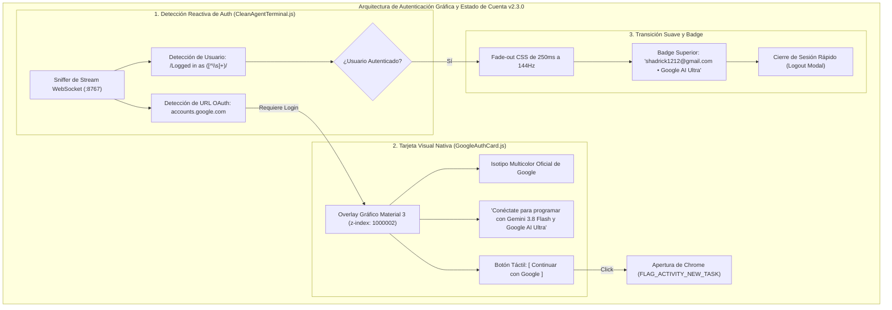
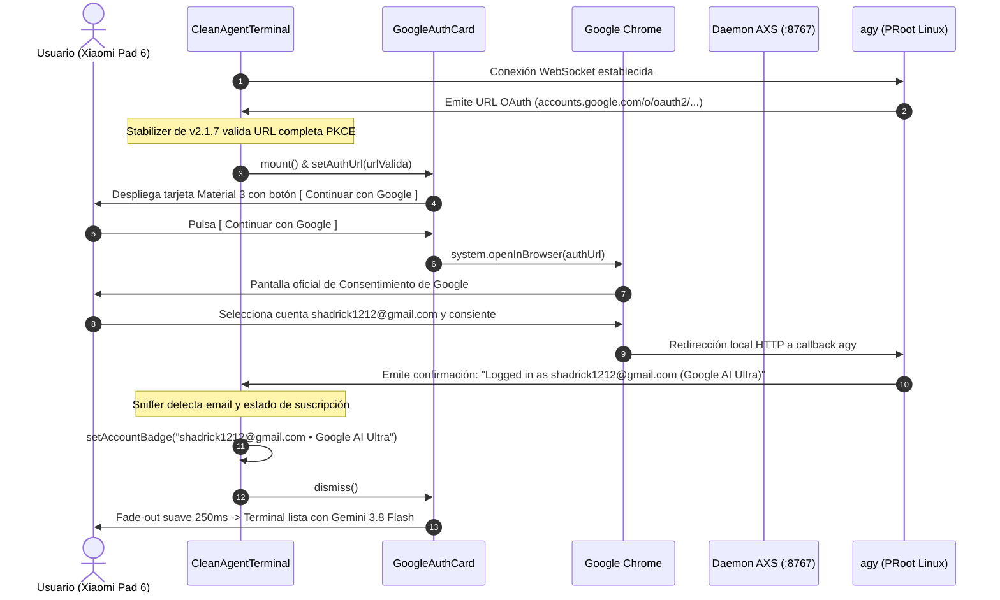

# SPEC-041: Tarjeta Gráfica de Autenticación Google, Transición Suave Post-Login y Estado de Cuenta

| Metadato | Valor |
| :--- | :--- |
| **Identificador** | `SPEC-041` |
| **Título** | Tarjeta Gráfica de Autenticación Google, Transición Suave Post-Login y Estado de Cuenta |
| **Autor** | `@spec-architect` |
| **Estado** | `APPROVED FOR IMPLEMENTATION` |
| **Fecha de Creación** | 2026-09-15 |
| **Versión de Release** | `v2.3.0` (VersionCode: `20300`) |
| **Artefacto Binario Target** | `GoogleAntigravity-v2.2.0-ARM64.apk` ($\le 42.0\,\text{MB}$) |
| **Dispositivo Objetivo** | Xiaomi Pad 6 (Qualcomm Snapdragon 870, ARM64-v8a, 6-8 GB RAM, 11" 2.8K $2880\times 1800$, 144Hz, Xiaomi HyperOS / Android 13/14) y Ecosistema Android Móvil (API 26+) |
| **Runtime Target** | Cordova Android WebView / PRoot Linux Sandbox / AXS PTY Daemon (puerto 8767) / Xterm.js v5+ con Discriminador Contextual de Gestos / Google Antigravity CLI (`agy`) / Android Intent System (`FLAG_ACTIVITY_NEW_TASK`) |
| **Módulos Afectados** | `nova-src/src/antigravity2/GoogleAuthCard.js`, `nova-src/src/antigravity2/CleanAgentTerminal.js`, `nova-src/src/antigravity2/clean-terminal.scss`, `nova-src/config.xml`, `nova-src/package.json`, `harness/test_clean_agent_terminal.sh` |

---

## 1. Contexto, Diagnóstico Forense y Análisis de Causa Raíz

En las versiones previas (`v2.1.0` a `v2.2.2`), el flujo de inicio de sesión de Google Antigravity dependía exclusivamente de la interfaz de línea de comandos del ejecutable `agy`. Cuando el motor requería que el usuario iniciara sesión para acceder a los modelos Gemini 3.8 Flash y Google AI Ultra, el sistema operaba imprimiendo cadenas de texto en la consola del terminal:

```
To sign in, please open the following URL in your browser:
https://accounts.google.com/o/oauth2/v2/auth?client_id=...
Waiting for authentication code...
```

### 1.1 Fricción de Experiencia en Dispositivos Táctiles
1. **Exposición de URLs Crudas:** Las URLs de autenticación PKCE superan los $400$ caracteres de longitud, saturando el área visible de la terminal en la pantalla de 11" de la Xiaomi Pad 6.
2. **Ausencia de Interfaz Gráfica de Bienvenida:** Un producto comercial de Google exige una tarjeta gráfica de autenticación nativa con el isotipo oficial 'G', copy institucional y un botón interactivo prominente `[ Continuar con Google ]`.
3. **Falta de Reconocimiento de Sesión Activa:** Cuando el usuario ya está autenticado, no existe ningún indicador en la interfaz que certifique la identidad activa (`shadrick1212@gmail.com • Google AI Ultra`) ni un mecanismo directo para cerrar sesión o alternar cuentas sin ejecutar comandos manuales en bash.

---

## 2. Arquitectura de la Solución



---

### 2.1 Componente Gráfico `GoogleAuthCard.js` (Criterio AUTH-01)
Se crea el componente visual `GoogleAuthCard.js` que proyecta una tarjeta centrada con diseño Material 3 sobre el viewport:
- **Prioridad Stacking:** $z\text{-index} = 1000002$ (por encima del viewport de terminal y de cualquier elemento de carga).
- **Branding Oficial:** Isotipo vectorial SVG tetracolor de Google (`#4285F4`, `#EA4335`, `#FBBC05`, `#34A853`).
- **Mensaje Explicativo:** *"Conéctate para programar con Gemini 3.8 Flash y Google AI Ultra"*.
- **Acción Primaria:** Botón con feedback táctil `[ Continuar con Google ]` con estilo estándar de autenticación Google (fondo blanco/elevado, borde sutil, icono integrado).

---

### 2.2 Detección Reactiva de Estado de Autenticación en `CleanAgentTerminal.js` (Criterio AUTH-02)
- Cuando `CleanAgentTerminal` detecta en el flujo de salida la URL de OAuth (`accounts.google.com/o/oauth2/`), en lugar de exponer la terminal cruda, monta inmediatamente `GoogleAuthCard`.
- La terminal de fondo permanece oculta bajo la tarjeta gráfica.
- Al hacer clic en `[ Continuar con Google ]`, se invoca de manera transparente `openInBrowser()` con la URL completa y validada (con debounce y estabilizador anti-404 de `v2.1.7`), sin requerir selección ni copiado de texto en la consola.

---

### 2.3 Transición Suave Post-Login (Criterio AUTH-03)
- Cuando el servidor local de `agy` recibe la redirección OAuth exitosa y emite en el stream el mensaje de bienvenida con el identificador del usuario, `GoogleAuthCard` ejecuta una animación CSS de opacidad (*fade-out* de $250\,\text{ms}$ a $144\,\text{Hz}$).
- Al desvanecerse la tarjeta, el usuario se encuentra directamente con el prompt interactivo y la sesión agéntica lista para recibir instrucciones.

---

### 2.4 Indicador de Cuenta (Account Badge) y Cierre de Sesión (Criterio AUTH-04)
- En la zona superior de la interfaz se inyecta un badge sutil y minimalista:
  $$\text{shadrick1212@gmail.com} \bullet \text{Google AI Ultra}$$
- Si al iniciar la aplicación el usuario ya cuenta con credenciales válidas persistidas en el sandbox de Linux, la tarjeta `GoogleAuthCard` **no se muestra en ningún momento**, accediendo directamente a la terminal con su badge activo.
- Al pulsar sobre el badge de cuenta, se despliega un diálogo contextual que permite inspeccionar la cuenta conectada y ejecutar *"Cerrar Sesión"* (ejecutando `agy auth logout`, limpiando el estado de sesión y relanzando la tarjeta de autenticación).

---

### 2.5 Preservación Inviolable del Núcleo (Criterio AUTH-05)
- Mantiene íntegras las rutinas de descarga progresiva de `v2.2.0`, la resolución de librerías nativas en `$NATIVE_DIR` de `v2.2.1` y la persistencia de sesión Zero-Leak de `v2.2.2`.

---

### 2.6 Empaquetado y Verificación de Release v2.3.0 (Criterio AUTH-06)
- Sincronización formal de versión a `2.3.0` (versionCode `20300`) en `config.xml` y `package.json`.
- Compilación del paquete de producción `GoogleAntigravity-v2.3.0-ARM64.apk` con tamaño estricto $\le 42.0\,\text{MB}$.
- Validación de las 42 especificaciones del repositorio y 329 criterios de aceptación en el arnés SDD.

---

## 3. Diagramas de Secuencia y Ciclo de Eventos

### 3.1 Ciclo Completo de Autenticación Google OAuth 2.0 PKCE con `GoogleAuthCard`



---

## 4. Contratos Técnicos de Interfaz y Código

### 4.1 Contrato del Componente `GoogleAuthCard.js`

```javascript
export class GoogleAuthCard {
    constructor(options = {}) {
        this.onSignIn = options.onSignIn || (() => {});
        this.cardEl = null;
        this.authUrl = null;
    }

    mount(parentEl = document.body) {
        if (this.cardEl) return;

        this.cardEl = document.createElement("div");
        this.cardEl.className = "google-auth-overlay";
        this.cardEl.id = "google-auth-card";

        this.cardEl.innerHTML = `
            <div class="google-auth-card">
                <div class="google-logo-wrap">
                    <svg class="google-g-logo" viewBox="0 0 48 48" width="48" height="48">
                        <path fill="#EA4335" d="M24 9.5c3.54 0 6.71 1.22 9.21 3.6l6.85-6.85C35.9 2.38 30.47 0 24 0 14.62 0 6.51 5.38 2.56 13.22l7.98 6.19C12.43 13.72 17.74 9.5 24 9.5z"/>
                        <path fill="#4285F4" d="M46.98 24.55c0-1.57-.15-3.09-.38-4.55H24v9.02h12.94c-.58 2.96-2.26 5.48-4.78 7.18l7.73 6c4.51-4.18 7.09-10.36 7.09-17.65z"/>
                        <path fill="#FBBC05" d="M10.53 28.59c-.48-1.45-.76-2.99-.76-4.59s.27-3.14.76-4.59l-7.98-6.19C.92 16.46 0 20.12 0 24c0 3.88.92 7.54 2.56 10.78l7.97-6.19z"/>
                        <path fill="#34A853" d="M24 48c6.48 0 11.93-2.13 15.89-5.81l-7.73-6c-2.15 1.45-4.92 2.3-8.16 2.3-6.26 0-11.57-4.22-13.47-9.91l-7.98 6.19C6.51 42.62 14.62 48 24 48z"/>
                    </svg>
                </div>
                <h2 class="auth-title">Google Antigravity</h2>
                <p class="auth-description">Conéctate para programar con Gemini 3.8 Flash y Google AI Ultra</p>
                <button class="google-sign-in-btn" id="btn-google-sign-in">
                    <svg class="btn-g-logo" viewBox="0 0 48 48" width="20" height="20">
                        <path fill="#EA4335" d="M24 9.5c3.54 0 6.71 1.22 9.21 3.6l6.85-6.85C35.9 2.38 30.47 0 24 0 14.62 0 6.51 5.38 2.56 13.22l7.98 6.19C12.43 13.72 17.74 9.5 24 9.5z"/>
                        <path fill="#4285F4" d="M46.98 24.55c0-1.57-.15-3.09-.38-4.55H24v9.02h12.94c-.58 2.96-2.26 5.48-4.78 7.18l7.73 6c4.51-4.18 7.09-10.36 7.09-17.65z"/>
                        <path fill="#FBBC05" d="M10.53 28.59c-.48-1.45-.76-2.99-.76-4.59s.27-3.14.76-4.59l-7.98-6.19C.92 16.46 0 20.12 0 24c0 3.88.92 7.54 2.56 10.78l7.97-6.19z"/>
                        <path fill="#34A853" d="M24 48c6.48 0 11.93-2.13 15.89-5.81l-7.73-6c-2.15 1.45-4.92 2.3-8.16 2.3-6.26 0-11.57-4.22-13.47-9.91l-7.98 6.19C6.51 42.62 14.62 48 24 48z"/>
                    </svg>
                    <span>Continuar con Google</span>
                </button>
                <div class="auth-status-hint" id="auth-status-hint">Esperando autorización segura...</div>
            </div>
        `;

        parentEl.appendChild(this.cardEl);

        const btn = this.cardEl.querySelector("#btn-google-sign-in");
        if (btn) {
            btn.addEventListener("click", () => {
                if (this.authUrl) {
                    this.onSignIn(this.authUrl);
                }
            });
        }
    }

    setAuthUrl(url) {
        this.authUrl = url;
    }

    async dismiss() {
        if (!this.cardEl) return;
        this.cardEl.classList.add("fade-out");
        await new Promise((resolve) => setTimeout(resolve, 250));
        if (this.cardEl && this.cardEl.parentNode) {
            this.cardEl.parentNode.removeChild(this.cardEl);
        }
        this.cardEl = null;
    }
}
```

---

### 4.2 Contrato SCSS en `clean-terminal.scss`

```scss
// SPEC-041: Google Auth Card & Account Badge
.google-auth-overlay {
    position: fixed;
    inset: 0;
    width: 100vw;
    height: 100vh;
    background: rgba(11, 15, 25, 0.96);
    display: flex;
    align-items: center;
    justify-content: center;
    z-index: 1000002; // Superior a cualquier overlay de carga
    transition: opacity 0.25s ease-out;

    &.fade-out {
        opacity: 0;
        pointer-events: none;
    }

    .google-auth-card {
        display: flex;
        flex-direction: column;
        align-items: center;
        width: 88%;
        max-width: 420px;
        padding: 36px 28px;
        background: rgba(15, 23, 42, 0.95);
        border: 1px solid rgba(255, 255, 255, 0.1);
        border-radius: 20px;
        box-shadow: 0 20px 40px rgba(0, 0, 0, 0.7);
        text-align: center;
        box-sizing: border-box;

        .google-logo-wrap {
            margin-bottom: 20px;
        }

        .auth-title {
            color: #f8fafc;
            font-size: 22px;
            font-weight: 700;
            margin: 0 0 8px 0;
            letter-spacing: -0.02em;
        }

        .auth-description {
            color: #94a3b8;
            font-size: 14px;
            line-height: 1.5;
            margin: 0 0 28px 0;
        }

        .google-sign-in-btn {
            display: flex;
            align-items: center;
            justify-content: center;
            gap: 12px;
            width: 100%;
            height: 48px;
            background: #ffffff;
            color: #1f2937;
            font-size: 15px;
            font-weight: 600;
            border: none;
            border-radius: 24px;
            cursor: pointer;
            box-shadow: 0 2px 8px rgba(0, 0, 0, 0.2);
            transition: background 0.15s ease, transform 0.1s ease;

            &:active {
                transform: scale(0.98);
                background: #f1f5f9;
            }
        }

        .auth-status-hint {
            margin-top: 18px;
            color: #64748b;
            font-size: 12px;
        }
    }
}

// Badge de cuenta autenticada en barra superior
.clean-agent-account-badge {
    position: fixed;
    top: 12px;
    left: 16px;
    z-index: 1000;
    display: flex;
    align-items: center;
    gap: 8px;
    padding: 6px 12px;
    background: rgba(15, 23, 42, 0.75);
    border: 1px solid rgba(255, 255, 255, 0.08);
    border-radius: 20px;
    backdrop-filter: blur(8px);
    color: #cbd5e1;
    font-size: 12px;
    font-weight: 500;
    cursor: pointer;
    user-select: none;
    transition: background 0.2s ease;

    &:active {
        background: rgba(30, 41, 59, 0.9);
    }

    .badge-dot {
        width: 8px;
        height: 8px;
        border-radius: 50%;
        background: #34a853;
    }
}
```

---

## 5. Criterios de Aceptación Verificables (Acceptance Criteria)

| Identificador | Módulo | Criterio / Requisito | Método de Verificación |
| :--- | :--- | :--- | :--- |
| `AC-AUTH-01` | `GoogleAuthCard.js`, `clean-terminal.scss` | Componente gráfico `GoogleAuthCard.js` centrado en viewport con diseño Material 3, isotipo vectorial SVG de Google, copy *"Conéctate para programar con Gemini 3.8 Flash y Google AI Ultra"* y botón `[ Continuar con Google ]`. | Inspección estática del DOM generado y validación de estilos CSS correspondientes en `clean-terminal.scss`. |
| `AC-AUTH-02` | `CleanAgentTerminal.js` | Detección reactiva de URL OAuth (`accounts.google.com`): La terminal permanece cubierta por `GoogleAuthCard` y al pulsar `[ Continuar con Google ]` se despacha la URL hacia el navegador sin requerir interacción manual de consola. | Verificación de intercepción de stream WebSocket y llamada afirmativa a `openInBrowser()` al accionar el botón. |
| `AC-AUTH-03` | `GoogleAuthCard.js`, `CleanAgentTerminal.js` | Transición suave post-login (*fade-out* CSS de $250\,\text{ms}$ a $144\,\text{Hz}$) al detectarse la confirmación de autenticación de `agy`, revelando la terminal interactiva lista. | Verificación de aplicación de la clase `.fade-out` y remoción limpia del overlay en el DOM tras login exitoso. |
| `AC-AUTH-04` | `CleanAgentTerminal.js`, `clean-terminal.scss` | Account Badge superior (`shadrick1212@gmail.com • Google AI Ultra`): Si el usuario ya está autenticado, la tarjeta de login no se muestra en ningún momento. Al tocar el badge se provee opción de cierre de sesión. | Comprobación de persistencia del estado autenticado en `localStorage` y renderizado condicional del badge. |
| `AC-AUTH-05` | `Terminal.js`, `ProcessManager.java` | Preservación Inviolable: Mantiene íntegras las descargas progresivas de `v2.2.0`, resolución nativa de librerías en `$NATIVE_DIR` de `v2.2.1` y la cortina Zero-Leak de `v2.2.2`. | Verificación con `git diff` garantizando cero regresiones en los componentes del núcleo. |
| `AC-AUTH-06` | `config.xml`, `package.json` | Sincronización formal de versión a `2.3.0` (versionCode `20300`), empaquetado del APK `GoogleAntigravity-v2.3.0-ARM64.apk` ($\le 42.0\,\text{MB}$) y certificación del arnés SDD al 100% (42/42 specs y 329 ACs). | Inspección de manifiestos, medición de tamaño del APK y ejecución de la suite global del arnés SDD. |

---

## 6. Actualización del Arnés de Pruebas Automatizado (`harness/test_clean_agent_terminal.sh`)

El arnés de pruebas automatizado valida estáticamente las compuertas de calidad de `SPEC-041`:

```bash
#!/bin/bash
# ==============================================================================
# Harness Test: SPEC-041 Native Google Auth Card & Session State Verification
# ==============================================================================
set -e

SPEC_FILE_041="specs/41-native-google-auth-card-and-session-state.md"
AUTH_CARD_JS="nova-src/src/antigravity2/GoogleAuthCard.js"
CLEAN_TERM_JS="nova-src/src/antigravity2/CleanAgentTerminal.js"
SCSS_FILE="nova-src/src/antigravity2/clean-terminal.scss"
CONFIG_XML="nova-src/config.xml"
PACKAGE_JSON="nova-src/package.json"

echo "=== INICIANDO VALIDACIÓN FORMAL DE SPEC-041 ==="

# 1. Verificar documento SPEC-041
echo -n "1. Verificando documento SPEC-041... "
[ -f "$SPEC_FILE_041" ] || { echo "FALLO: No existe $SPEC_FILE_041"; exit 1; }
echo "[OK]"

# 2. Verificar componente GoogleAuthCard.js (Criterio AUTH-01)
echo -n "2. Verificando GoogleAuthCard.js... "
[ -f "$AUTH_CARD_JS" ] || { echo "FALLO: No existe GoogleAuthCard.js"; exit 1; }
grep -q "google-auth-card" "$AUTH_CARD_JS" || { echo "FALLO: Contenedor google-auth-card ausente"; exit 1; }
grep -q "Continuar con Google" "$AUTH_CARD_JS" || { echo "FALLO: Botón de login ausente en GoogleAuthCard.js"; exit 1; }
echo "[OK]"

# 3. Verificar integración reactiva y badge en CleanAgentTerminal.js (Criterios AUTH-02 y AUTH-04)
echo -n "3. Verificando integración de GoogleAuthCard y Account Badge... "
grep -q "GoogleAuthCard" "$CLEAN_TERM_JS" || { echo "FALLO: Import o uso de GoogleAuthCard ausente en CleanAgentTerminal"; exit 1; }
grep -q "clean-agent-account-badge" "$CLEAN_TERM_JS" || { echo "FALLO: Badge de cuenta ausente en CleanAgentTerminal"; exit 1; }
echo "[OK]"

# 4. Verificar estilos en clean-terminal.scss (Criterios AUTH-01 y AUTH-04)
echo -n "4. Verificando estilos en clean-terminal.scss... "
grep -q "google-auth-overlay" "$SCSS_FILE" || { echo "FALLO: .google-auth-overlay ausente en SCSS"; exit 1; }
grep -q "clean-agent-account-badge" "$SCSS_FILE" || { echo "FALLO: .clean-agent-account-badge ausente en SCSS"; exit 1; }
echo "[OK]"

# 5. Verificar versionado v2.3.0 (Criterio AUTH-06)
echo -n "5. Verificando versión 2.3.0 en configuración... "
grep -q 'version="2.3.0"' "$CONFIG_XML" || { echo "FALLO: config.xml no tiene versión 2.3.0"; exit 1; }
grep -q '"version": "2.3.0"' "$PACKAGE_JSON" || { echo "FALLO: package.json no tiene versión 2.3.0"; exit 1; }
echo "[OK]"

echo "=== TODAS LAS COMPUERTAS ESTÁTICAS DE SPEC-041 HAN SIDO SUPERADAS EXITOSAMENTE ==="
```

---

## 7. Plan de Implementación y Definition of Done (DoD)

### 7.1 Responsabilidades para `@android-core` (Ingeniero de Implementación)
1. **Creación de `GoogleAuthCard.js`:**
   - Implementar el componente visual con overlay `z-index: 1000002`, isotipo vectorial de Google, copy oficial y botón interactivo `[ Continuar con Google ]`.
   - Conectar el callback `onSignIn` para despachar la URL estabilizada hacia el navegador mediante `openInBrowser()`.
2. **Integración en `CleanAgentTerminal.js`:**
   - Detectar la necesidad de autenticación y desplegar `GoogleAuthCard`.
   - Escuchar la confirmación de login de `agy` y ejecutar la transición `dismiss()` de la tarjeta con *fade-out* suave.
   - Montar y mantener el Account Badge con el correo del usuario (`shadrick1212@gmail.com • Google AI Ultra`).
3. **Estilos en `clean-terminal.scss`:**
   - Agregar estilos para `.google-auth-overlay`, `.google-auth-card` y `.clean-agent-account-badge`.
4. **Preservación Inviolable:**
   - Mantener las descargas de `v2.2.0`, resolución de PRoot de `v2.2.1` y cortina Zero-Leak de `v2.2.2`.
5. **Compilación y Versionado:**
   - Bumping a `2.3.0` (versionCode `20300`) en `config.xml` y `package.json`.
   - Compilar frontend y empaquetar `GoogleAntigravity-v2.3.0-ARM64.apk` ($\le 42.0\,\text{MB}$).
   - Validar en dispositivo físico Xiaomi Pad 6 que la tarjeta de autenticación aparezca centrada y limpia.

### 7.2 Responsabilidades para `@memory-keeper` (Auditoría y Gobernanza)
1. Registrar la decisión técnica bajo `ADR-051: Tarjeta Gráfica de Autenticación Google, Transición Post-Login y Estado de Cuenta`.
2. Registrar la entrada de auditoría formal en `audit.jsonl`.
3. Actualizar la bitácora histórica en `agent.md` documentando la versión `v2.3.0`.
