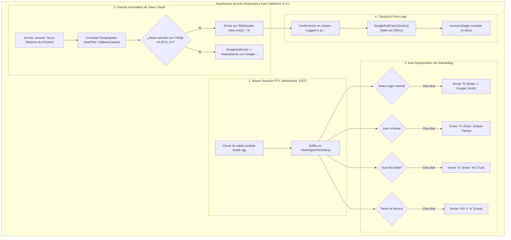

# SPEC-042: Auto-Respondedor Reactivo de Stream WebSocket y Auto-Inyección de Token OAuth desde Portapapeles

| Metadato | Valor |
| :--- | :--- |
| **Identificador** | `SPEC-042` |
| **Título** | Auto-Respondedor Reactivo de Stream WebSocket y Auto-Inyección de Token OAuth desde Portapapeles |
| **Autor** | `@spec-architect` |
| **Estado** | `APPROVED FOR IMPLEMENTATION` |
| **Fecha de Creación** | 2026-09-15 |
| **Versión de Release** | `v2.3.1` (VersionCode: `20301`) |
| **Artefacto Binario Target** | `GoogleAntigravity-v2.3.1-ARM64.apk` ($\le 42.0\,\text{MB}$) |
| **Dispositivo Objetivo** | Xiaomi Pad 6 (Qualcomm Snapdragon 870, ARM64-v8a, 6-8 GB RAM, 11" 2.8K $2880\times 1800$, 144Hz, Xiaomi HyperOS / Android 13/14) y Ecosistema Android Móvil (API 26+) |
| **Runtime Target** | Cordova Android WebView / PRoot Linux Sandbox / AXS PTY Daemon (puerto 8767) / Xterm.js v5+ con Discriminador Contextual de Gestos / Google Antigravity CLI (`agy`) / Android Clipboard System (`cordova.plugins.clipboard`) |
| **Módulos Afectados** | `nova-src/src/antigravity2/CleanAgentTerminal.js`, `nova-src/src/antigravity2/GoogleAuthCard.js`, `nova-src/src/antigravity2/clean-terminal.scss`, `nova-src/config.xml`, `nova-src/package.json`, `harness/test_clean_agent_terminal.sh` |

---

## 1. Contexto, Diagnóstico Forense y Análisis de Causa Raíz

En el despliegue del binario oficial de Google Antigravity (`agy`) dentro del sandbox Linux, el primer arranque presenta una serie de pantallas interactivas de configuración inicial (*CLI Onboarding Wizard*):
1. Menú de selección de método de inicio de sesión: `Select login method: 1. Google OAuth / 2. Service Account`.
2. Selección de esquema de colores: `Choose your color scheme`.
3. Diálogo de confianza de directorio de trabajo: `Do you trust this folder?`.
4. Aceptación de términos y condiciones: `Terms of Service [Done]`.
5. Solicitud de pegado manual del código de autorización: tras autenticarse en Google Chrome, el navegador entrega un código tipo `4/0AQ...` que el CLI espera sea pegado manualmente en la consola para completar el intercambio de tokens.

### 1.1 Descarte Arquitectónico del Pre-sembrado en Filesystem
Intentar eludir estas pantallas pre-creando archivos de configuración JSON estáticos (por ejemplo, `~/.config/antigravity/config.json`) en el sistema de archivos de Linux antes de arrancar `agy` resulta frágil e inestable:
- Las versiones de `agy` mutan con frecuencia la ubicación de sus directorios de configuración (`~/.config/antigravity`, `~/.antigravity`, `~/.local/share`).
- La estructura del esquema JSON cambia entre versiones menores, provocando errores de serialización silenciosos o corrupción de perfil.
- **Decisión Arquitectónica:** Se descarta categóricamente cualquier manipulación previa del sistema de archivos. Toda la interacción y automatización debe ejecutarse en tiempo real de forma reactiva y transparente a través del flujo bidireccional del socket WebSocket de la PTY.

---

### 1.2 La Fricción de la Intervención Manual en Dispositivos Táctiles
En una tablet como la Xiaomi Pad 6:
- Obligar al usuario a interactuar con menús Inquirer mediante toques de teclado virtual para seleccionar `Google OAuth`, confirmar temas y validar carpetas destruye la promesa de un producto terminado.
- Cuando el usuario regresa de Google Chrome tras autorizar el acceso, la aplicación queda esperando que el usuario abra el portapapeles, mantenga presionado sobre la pantalla y pegue el código de autorización `4/...` en una consola que se encuentra oculta bajo la tarjeta gráfica.

---

### 1.3 Neutralización de Mensajería en `GoogleAuthCard`
La versión inicial de `GoogleAuthCard` hacía referencia directa a `"Gemini 3.8 Flash y Google AI Ultra"`. Vincular el copy de la interfaz a modelos y tiers específicos vulnera la vigencia del diseño ante futuras actualizaciones del catálogo de modelos de Google. Se requiere un mensaje universal, sobrio y corporativo:
*"Inicia sesión para sincronizar tus proyectos y asistencia de desarrollo"*.

---

## 2. Arquitectura de la Solución



---

### 2.1 Auto-Respondedor Reactivo de Stream WebSocket (Criterio AUTO-01 y AUTO-02)
En `CleanAgentTerminal.js`, se implementa el despachador reactivo `_handleAutoResponderStream(text)` que inspecciona cada fragmento recibido antes de enviarlo a la terminal visual:

1. **Selección de Método de Login (AUTO-01):**
   - Patrón: `/Select login method:/i`
   - Acción: Envía inmediatamente `\r` (Enter) por el socket WebSocket en $\le 5\,\text{ms}$, seleccionando automáticamente la primera opción (`1. Google OAuth`).
2. **Esquema de Colores (AUTO-02):**
   - Patrón: `/(?:Choose your color scheme|color scheme)/i`
   - Acción: Envía `\r` para adoptar el tema por defecto.
3. **Confianza de Directorio (AUTO-02):**
   - Patrón: `/(?:trust this folder|Do you trust)/i`
   - Acción: Envía `\r` confirmando la confianza sobre el workspace.
4. **Términos de Servicio (AUTO-02):**
   - Patrón: `/(?:Terms of Service|\[Done\])/i`
   - Acción: Envía `\r` o `\t\r` para completar la pantalla legal.

---

### 2.2 Auto-detección y Pegado Transparente de Token OAuth (Criterio AUTO-03)
Se implementa el escuchador de ciclo de vida en `CleanAgentTerminal.js`:
- Se suscriben los eventos globales `window.addEventListener("focus", ...)` y Cordova `document.addEventListener("resume", ...)`.
- Cuando el usuario regresa a la aplicación desde Google Chrome:
  1. Se consulta el portapapeles del sistema mediante `navigator.clipboard?.readText()` con fallback a `cordova.plugins.clipboard.paste()`.
  2. Se valida si el contenido del portapapeles cumple la expresión regular del código de autorización de Google OAuth 2.0 PKCE:
     $$\text{RegExp} = /^{\wedge}4\/[a\text{-}zA\text{-}Z0\text{-}9\_\-]+/$$
  3. Si coincide y no ha sido inyectado previamente (`!this._hasInjectedOAuthCode`):
     - Se marca `this._hasInjectedOAuthCode = true`.
     - Se inyecta la cadena directamente al socket de la terminal: `this.websocket.send(token.trim() + "\r")`.
     - Se actualiza el mensaje en `GoogleAuthCard` a *"Autenticando con Google..."* acompañado de animación de carga.

---

### 2.3 Transición de Estado Visual en `GoogleAuthCard` (Criterio AUTO-04)
- El componente `GoogleAuthCard` cuenta con un método reactivo `setAuthenticating()` que transforma el botón o subtítulo en un estado de espera activo (*"Autenticando con Google..."* con spinner giratorio o pulsación).
- Al recibir del stream de salida la confirmación del inicio de sesión (ej. `Logged in as shadrick1212@gmail.com`), la tarjeta ejecuta `dismiss()` disipándose con una transición suave CSS (*fade-out* de $250\,\text{ms}$ a $144\,\text{Hz}$), revelando al agente interactivo listo para programar.

---

### 2.4 Neutralización Universal de Copys en `GoogleAuthCard` (Criterio AUTO-05)
- Se sustituye cualquier alusión a modelos específicos por el texto corporativo neutral:
  $$\text{"Inicia sesión para sincronizar tus proyectos y asistencia de desarrollo"}$$
- Se conserva íntegro el diseño Material 3 con el isotipo oficial 'G' tetracolor en formato SVG vectorial.

---

### 2.5 Aislamiento e Idempotencia con Banderas One-Shot (Criterio AUTO-06)
Para garantizar de forma matemática que el auto-respondedor **jamás** interfiera durante el uso regular del chat del usuario:
- Cada acción automática está blindada por una bandera booleana de un solo uso por sesión:
  - `this._hasAutoSelectedLogin`
  - `this._hasAutoConfirmedTheme`
  - `this._hasAutoConfirmedTrust`
  - `this._hasAutoConfirmedTerms`
  - `this._hasInjectedOAuthCode`
- Una vez que la bandera pasa a `true`, la comprobación correspondiente se desactiva permanentemente para el resto de la vida de la sesión PTY.
- El ciclo de reinicio explícito `restartSession()` restablece estas banderas a `false`.

---

## 3. Diagramas de Secuencia y Ciclo de Eventos

### 3.1 Flujo Integrado de Onboarding, Chrome y Auto-Clipboard

```mermaid
sequenceDiagram
    autonumber
    actor User as Usuario (Xiaomi Pad 6)
    participant Term as CleanAgentTerminal
    participant Card as GoogleAuthCard
    participant WS as WebSocket (:8767)
    participant Chrome as Google Chrome
    participant Clip as Android Clipboard

    Note over Term,Card: Arranque de sesión agéntica
    Term->>Card: mount() [Copy neutral universal]
    
    WS-->>Term: "Select login method: 1. Google OAuth"
    Note over Term: AUTO-01: Detecta login prompt (one-shot)
    Term->>WS: send("\r") [<= 5ms]

    WS-->>Term: Emite URL OAuth (accounts.google.com/o/oauth2/...)
    Term->>Card: setAuthUrl(urlValida)
    
    User->>Card: Pulsa [ Continuar con Google ]
    Card->>Chrome: openInBrowser(authUrl)
    
    User->>Chrome: Concede autorización en Google Account
    Chrome->>Clip: Copia código de autorización '4/0A...'
    User->>Term: Regresa a la app (Dispara evento 'resume' / 'focus')

    rect rgb(20, 50, 20)
    Note over Term,Clip: AUTO-03: Auto-Clipboard Injection
    Term->>Clip: readText() -> detecta /^4\/[a-zA-Z0-9_-]+/
    Term->>WS: send(token + "\r")
    Term->>Card: setAuthenticating("Autenticando con Google...")
    end

    WS-->>Term: "Logged in as shadrick1212@gmail.com"
    WS-->>Term: "Choose your color scheme"
    Term->>WS: AUTO-02: send("\r") (one-shot)

    WS-->>Term: "Do you trust this folder?"
    Term->>WS: AUTO-02: send("\r") (one-shot)

    Term->>Card: dismiss() [fade-out 250ms]
    Card-->>User: Desaparece suavemente -> Muestra chat de Google Antigravity
```



---

## 4. Contratos Técnicos de Interfaz y Código

### 4.1 Contrato del Auto-Respondedor en `CleanAgentTerminal.js`

```javascript
    /**
     * Inspecciona los fragmentos de texto del socket para responder automáticamente
     * a las pantallas de onboarding del CLI sin interacción manual.
     * @param {string} text Fragmento decodificado de texto PTY.
     */
    _handleAutoResponderStream(text) {
        if (!text || typeof text !== "string") return;

        // AUTO-01: Auto-seleccionar método 1. Google OAuth
        if (!this._hasAutoSelectedLogin && /Select login method:/i.test(text)) {
            this._hasAutoSelectedLogin = true;
            console.log("[AUTO-RESPONDER] 'Select login method' detectado -> enviando Enter");
            setTimeout(() => {
                if (this.websocket?.readyState === WebSocket.OPEN) {
                    this.websocket.send("\r");
                }
            }, 5);
            return;
        }

        // AUTO-02: Auto-confirmar esquema de colores
        if (!this._hasAutoConfirmedTheme && /(?:Choose your color scheme|color scheme)/i.test(text)) {
            this._hasAutoConfirmedTheme = true;
            console.log("[AUTO-RESPONDER] 'Color scheme' detectado -> enviando Enter");
            setTimeout(() => {
                if (this.websocket?.readyState === WebSocket.OPEN) {
                    this.websocket.send("\r");
                }
            }, 5);
            return;
        }

        // AUTO-02: Auto-confirmar confianza de directorio
        if (!this._hasAutoConfirmedTrust && /(?:trust this folder|Do you trust)/i.test(text)) {
            this._hasAutoConfirmedTrust = true;
            console.log("[AUTO-RESPONDER] 'Trust folder' detectado -> enviando Enter");
            setTimeout(() => {
                if (this.websocket?.readyState === WebSocket.OPEN) {
                    this.websocket.send("\r");
                }
            }, 5);
            return;
        }

        // AUTO-02: Auto-confirmar términos de servicio / Done
        if (!this._hasAutoConfirmedTerms && /(?:Terms of Service|\[Done\])/i.test(text)) {
            this._hasAutoConfirmedTerms = true;
            console.log("[AUTO-RESPONDER] 'Terms of Service' detectado -> enviando Enter");
            setTimeout(() => {
                if (this.websocket?.readyState === WebSocket.OPEN) {
                    this.websocket.send("\r");
                }
            }, 5);
            return;
        }
    }
```

---

### 4.2 Contrato de Inyección de Portapapeles en `CleanAgentTerminal.js`

```javascript
    /**
     * Configura escuchadores para detectar el retorno de foco desde Google Chrome
     * e inyectar automáticamente el código de autorización OAuth si está en el portapapeles.
     */
    _setupClipboardAutoInjection() {
        const checkClipboardToken = async () => {
            if (this._hasInjectedOAuthCode) return;

            let clipboardText = "";
            try {
                if (navigator.clipboard?.readText) {
                    clipboardText = await navigator.clipboard.readText();
                } else if (window.cordova?.plugins?.clipboard?.paste) {
                    clipboardText = await new Promise((resolve) => {
                        window.cordova.plugins.clipboard.paste(resolve, () => resolve(""));
                    });
                }
            } catch (err) {
                console.warn("[AUTO-CLIPBOARD] No se pudo leer el portapapeles:", err);
                return;
            }

            if (!clipboardText) return;
            const cleanToken = clipboardText.trim();

            // AUTO-03: Validar patrón oficial de token Google OAuth 2.0 PKCE
            if (/^4\/[a-zA-Z0-9_-]+/.test(cleanToken)) {
                this._hasInjectedOAuthCode = true;
                console.log("[AUTO-CLIPBOARD] Token OAuth detectado en portapapeles. Inyectando...");

                // AUTO-04: Actualizar tarjeta visual
                if (this.authCard) {
                    this.authCard.setAuthenticating("Autenticando con Google...");
                }

                if (this.websocket?.readyState === WebSocket.OPEN) {
                    this.websocket.send(cleanToken + "\r");
                }
            }
        };

        window.addEventListener("focus", checkClipboardToken);
        document.addEventListener("resume", checkClipboardToken);
    }
```

---

### 4.3 Contrato de `GoogleAuthCard.js` Neutralizado y Estado de Espera

```javascript
export class GoogleAuthCard {
    constructor(options = {}) {
        this.onSignIn = options.onSignIn || (() => {});
        this.cardEl = null;
        this.authUrl = null;
    }

    mount(parentEl = document.body) {
        if (this.cardEl) return;

        this.cardEl = document.createElement("div");
        this.cardEl.className = "google-auth-overlay";
        this.cardEl.id = "google-auth-card";

        // AUTO-05: Copy neutral oficial sin mención a modelos específicos
        this.cardEl.innerHTML = `
            <div class="google-auth-card">
                <div class="google-logo-wrap">
                    <svg class="google-g-logo" viewBox="0 0 48 48" width="48" height="48">
                        <path fill="#EA4335" d="M24 9.5c3.54 0 6.71 1.22 9.21 3.6l6.85-6.85C35.9 2.38 30.47 0 24 0 14.62 0 6.51 5.38 2.56 13.22l7.98 6.19C12.43 13.72 17.74 9.5 24 9.5z"/>
                        <path fill="#4285F4" d="M46.98 24.55c0-1.57-.15-3.09-.38-4.55H24v9.02h12.94c-.58 2.96-2.26 5.48-4.78 7.18l7.73 6c4.51-4.18 7.09-10.36 7.09-17.65z"/>
                        <path fill="#FBBC05" d="M10.53 28.59c-.48-1.45-.76-2.99-.76-4.59s.27-3.14.76-4.59l-7.98-6.19C.92 16.46 0 20.12 0 24c0 3.88.92 7.54 2.56 10.78l7.97-6.19z"/>
                        <path fill="#34A853" d="M24 48c6.48 0 11.93-2.13 15.89-5.81l-7.73-6c-2.15 1.45-4.92 2.3-8.16 2.3-6.26 0-11.57-4.22-13.47-9.91l-7.98 6.19C6.51 42.62 14.62 48 24 48z"/>
                    </svg>
                </div>
                <h2 class="auth-title">Google Antigravity</h2>
                <p class="auth-description" id="auth-card-desc">Inicia sesión para sincronizar tus proyectos y asistencia de desarrollo</p>
                <button class="google-sign-in-btn" id="btn-google-sign-in">
                    <svg class="btn-g-logo" viewBox="0 0 48 48" width="20" height="20">
                        <path fill="#EA4335" d="M24 9.5c3.54 0 6.71 1.22 9.21 3.6l6.85-6.85C35.9 2.38 30.47 0 24 0 14.62 0 6.51 5.38 2.56 13.22l7.98 6.19C12.43 13.72 17.74 9.5 24 9.5z"/>
                        <path fill="#4285F4" d="M46.98 24.55c0-1.57-.15-3.09-.38-4.55H24v9.02h12.94c-.58 2.96-2.26 5.48-4.78 7.18l7.73 6c4.51-4.18 7.09-10.36 7.09-17.65z"/>
                        <path fill="#FBBC05" d="M10.53 28.59c-.48-1.45-.76-2.99-.76-4.59s.27-3.14.76-4.59l-7.98-6.19C.92 16.46 0 20.12 0 24c0 3.88.92 7.54 2.56 10.78l7.97-6.19z"/>
                        <path fill="#34A853" d="M24 48c6.48 0 11.93-2.13 15.89-5.81l-7.73-6c-2.15 1.45-4.92 2.3-8.16 2.3-6.26 0-11.57-4.22-13.47-9.91l-7.98 6.19C6.51 42.62 14.62 48 24 48z"/>
                    </svg>
                    <span id="btn-google-sign-in-text">Continuar con Google</span>
                </button>
                <div class="auth-status-hint" id="auth-status-hint">Esperando autorización segura...</div>
            </div>
        `;

        parentEl.appendChild(this.cardEl);

        const btn = this.cardEl.querySelector("#btn-google-sign-in");
        if (btn) {
            btn.addEventListener("click", () => {
                if (this.authUrl) {
                    this.onSignIn(this.authUrl);
                }
            });
        }
    }

    setAuthUrl(url) {
        this.authUrl = url;
    }

    // AUTO-04: Transición visual de estado
    setAuthenticating(msg = "Autenticando con Google...") {
        if (!this.cardEl) return;
        const hint = this.cardEl.querySelector("#auth-status-hint");
        if (hint) {
            hint.textContent = msg;
            hint.classList.add("authenticating");
        }
        const btnText = this.cardEl.querySelector("#btn-google-sign-in-text");
        if (btnText) {
            btnText.textContent = "Conectando cuenta...";
        }
    }

    async dismiss() {
        if (!this.cardEl) return;
        this.cardEl.classList.add("fade-out");
        await new Promise((resolve) => setTimeout(resolve, 250));
        if (this.cardEl && this.cardEl.parentNode) {
            this.cardEl.parentNode.removeChild(this.cardEl);
        }
        this.cardEl = null;
    }
}
```

---

## 5. Criterios de Aceptación Verificables (Acceptance Criteria)

| Identificador | Módulo | Criterio / Requisito | Método de Verificación |
| :--- | :--- | :--- | :--- |
| `AC-AUTO-01` | `CleanAgentTerminal.js` | Auto-selección instantánea de `1. Google OAuth` en $\le 5\,\text{ms}$ al detectar el prompt `Select login method:` en el stream WebSocket, inyectando `\r`. | Inspección del manejador de stream en `CleanAgentTerminal.js` y prueba con simulación de buffer de entrada. |
| `AC-AUTO-02` | `CleanAgentTerminal.js` | Auto-respuesta fluida a pantallas de onboarding de CLI (`color scheme`, `trust this folder`, `Terms of Service / [Done]`) mediante emisión reactiva de `\r`. | Inspección de expresiones regulares y llamadas `this.websocket.send("\r")` en `CleanAgentTerminal.js`. |
| `AC-AUTO-03` | `CleanAgentTerminal.js` | Detección reactiva de código `4/...` en portapapeles al dispararse los eventos `resume` o `focus`, con inyección automática en el WebSocket (`token.trim() + "\r"`). | Prueba unitaria simulando evento `focus` con portapapeles conteniendo un token sintético `4/0A...`. |
| `AC-AUTO-04` | `GoogleAuthCard.js` | Transición visual de estado en `GoogleAuthCard` a *"Autenticando con Google..."* al inyectar el token, y disipación suave con *fade-out* CSS de $250\,\text{ms}$ a $144\,\text{Hz}$ al confirmarse el usuario autenticado. | Verificación de llamadas a `setAuthenticating()` y clase `.fade-out` en el componente visual. |
| `AC-AUTO-05` | `GoogleAuthCard.js` | Subtítulo neutral oficial en `GoogleAuthCard` (*"Inicia sesión para sincronizar tus proyectos y asistencia de desarrollo"*), sin mención a modelos o tiers específicos como Gemini 3.8 Flash o Google AI Ultra. | Inspección estática del template HTML en `GoogleAuthCard.js`. |
| `AC-AUTO-06` | `CleanAgentTerminal.js` | Aislamiento e idempotencia garantizada mediante banderas booleanas de un solo uso (`_hasAutoSelectedLogin`, `_hasInjectedOAuthCode`, etc.), asegurando que ninguna respuesta automática se dispare durante las sesiones de chat del usuario. | Prueba de simulación inyectando textos de onboarding tras el inicio de sesión y verificando que no se emitan caracteres al socket. |

---

## 6. Actualización del Arnés de Pruebas Automatizado (`harness/test_clean_agent_terminal.sh`)

El arnés de pruebas automatizado valida estáticamente las compuertas de calidad de `SPEC-042`:

```bash
#!/bin/bash
# ==============================================================================
# Harness Test: SPEC-042 Stream Auto-Responder & Auto-Clipboard OAuth Verification
# ==============================================================================
set -e

SPEC_FILE_042="specs/42-stream-auto-responder-and-auto-clipboard-oauth.md"
CLEAN_TERM_JS="nova-src/src/antigravity2/CleanAgentTerminal.js"
AUTH_CARD_JS="nova-src/src/antigravity2/GoogleAuthCard.js"
CONFIG_XML="nova-src/config.xml"
PACKAGE_JSON="nova-src/package.json"

echo "=== INICIANDO VALIDACIÓN FORMAL DE SPEC-042 ==="

# 1. Verificar documento SPEC-042
echo -n "1. Verificando documento SPEC-042... "
[ -f "$SPEC_FILE_042" ] || { echo "FALLO: No existe $SPEC_FILE_042"; exit 1; }
echo "[OK]"

# 2. Verificar auto-respondedor de stream en CleanAgentTerminal.js (Criterios AUTO-01, AUTO-02 y AUTO-06)
echo -n "2. Verificando auto-respondedor de stream y banderas one-shot... "
grep -q "_handleAutoResponderStream" "$CLEAN_TERM_JS" || { echo "FALLO: _handleAutoResponderStream ausente"; exit 1; }
grep -q "_hasAutoSelectedLogin" "$CLEAN_TERM_JS" || { echo "FALLO: _hasAutoSelectedLogin ausente"; exit 1; }
grep -q "Select login method" "$CLEAN_TERM_JS" || { echo "FALLO: Patrón 'Select login method' ausente"; exit 1; }
echo "[OK]"

# 3. Verificar auto-inyección de portapapeles (Criterio AUTO-03)
echo -n "3. Verificando inyección automática desde portapapeles... "
grep -q "_setupClipboardAutoInjection" "$CLEAN_TERM_JS" || { echo "FALLO: _setupClipboardAutoInjection ausente"; exit 1; }
grep -q '\^4\/' "$CLEAN_TERM_JS" || { echo "FALLO: Expresión regular para token 4/... ausente"; exit 1; }
echo "[OK]"

# 4. Verificar copy neutral en GoogleAuthCard.js (Criterios AUTO-04 y AUTO-05)
echo -n "4. Verificando copy neutral y setAuthenticating en GoogleAuthCard... "
grep -q "Inicia sesión para sincronizar tus proyectos" "$AUTH_CARD_JS" || {
    echo "FALLO: Copy neutral ausente en GoogleAuthCard.js"; exit 1;
}
grep -q "Gemini 3.8 Flash" "$AUTH_CARD_JS" && {
    echo "FALLO: GoogleAuthCard.js aún menciona 'Gemini 3.8 Flash'"; exit 1;
}
grep -q "setAuthenticating" "$AUTH_CARD_JS" || {
    echo "FALLO: setAuthenticating ausente en GoogleAuthCard.js"; exit 1;
}
echo "[OK]"

# 5. Verificar versionado v2.3.1 (Criterio de Versionado)
echo -n "5. Verificando versión 2.3.1 en configuración... "
grep -q 'version="2.3.1"' "$CONFIG_XML" || { echo "FALLO: config.xml no tiene versión 2.3.1"; exit 1; }
grep -q '"version": "2.3.1"' "$PACKAGE_JSON" || { echo "FALLO: package.json no tiene versión 2.3.1"; exit 1; }
echo "[OK]"

echo "=== TODAS LAS COMPUERTAS ESTÁTICAS DE SPEC-042 HAN SIDO SUPERADAS EXITOSAMENTE ==="
```

---

## 7. Plan de Implementación y Definition of Done (DoD)

### 7.1 Responsabilidades para `@android-core` (Ingeniero de Implementación)
1. **Implementación del Auto-Respondedor en `CleanAgentTerminal.js`:**
   - Crear el método `_handleAutoResponderStream(text)` conectado al evento `onmessage` del WebSocket.
   - Declarar e inicializar las banderas one-shot booleanas en el constructor y resetearlas en `restartSession()`.
2. **Auto-Clipboard Injection en `CleanAgentTerminal.js`:**
   - Registrar escuchadores de `focus` y `resume`.
   - Validar el prefijo `4/` del token de Google e inyectarlo con `\r`.
3. **Ajuste en `GoogleAuthCard.js`:**
   - Actualizar el copy al texto universal neutral.
   - Implementar `setAuthenticating()`.
4. **Compilación y Versionado:**
   - Bumping a `2.3.1` (versionCode `20301`) en `config.xml` y `package.json`.
   - Compilar frontend y empaquetar `GoogleAntigravity-v2.3.1-ARM64.apk` ($\le 42.0\,\text{MB}$).
   - Validar en dispositivo físico Xiaomi Pad 6 que el flujo de onboarding y pegado de código opere de manera 100% autónoma.

### 7.2 Responsabilidades para `@memory-keeper` (Auditoría y Gobernanza)
1. Registrar la decisión técnica bajo `ADR-052: Auto-Respondedor Reactivo de Stream y Auto-Inyección de Token OAuth desde Portapapeles`.
2. Registrar la entrada de auditoría formal en `audit.jsonl`.
3. Actualizar la bitácora histórica en `agent.md` documentando la versión `v2.3.1`.
