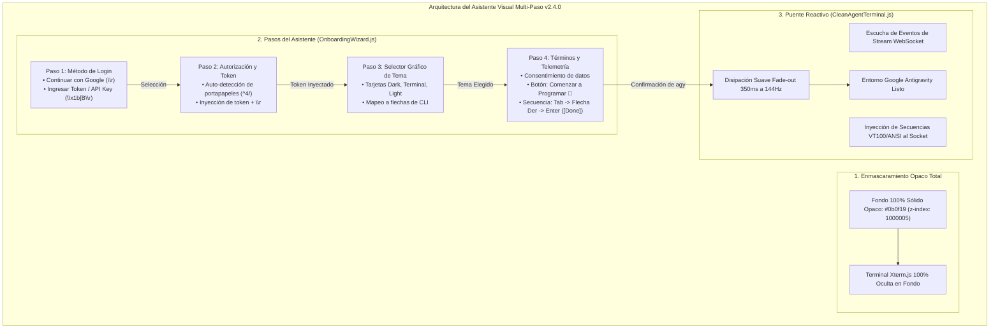
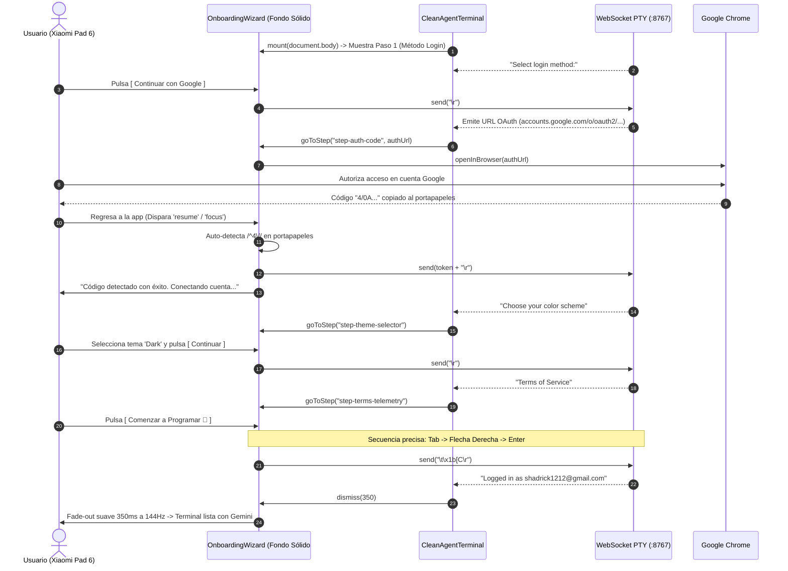

# SPEC-043: Asistente Visual Multi-Paso Nativo (Material 3 Onboarding Wizard) y Enmascaramiento Opaco de Terminal

| Metadato | Valor |
| :--- | :--- |
| **Identificador** | `SPEC-043` |
| **Título** | Asistente Visual Multi-Paso Nativo (Material 3 Onboarding Wizard) y Enmascaramiento Opaco de Terminal |
| **Autor** | `@spec-architect` |
| **Estado** | `APPROVED FOR IMPLEMENTATION` |
| **Fecha de Creación** | 2026-09-15 |
| **Versión de Release** | `v2.4.0` (VersionCode: `20400`) |
| **Artefacto Binario Target** | `GoogleAntigravity-v2.4.0-ARM64.apk` ($\le 42.0\,\text{MB}$) |
| **Dispositivo Objetivo** | Xiaomi Pad 6 (Qualcomm Snapdragon 870, ARM64-v8a, 6-8 GB RAM, 11" 2.8K $2880\times 1800$, 144Hz, Xiaomi HyperOS / Android 13/14) y Ecosistema Android Móvil (API 26+) |
| **Runtime Target** | Cordova Android WebView / PRoot Linux Sandbox / AXS PTY Daemon (puerto 8767) / Xterm.js v5+ con Discriminador Contextual de Gestos / Google Antigravity CLI (`agy`) / Android Clipboard System (`cordova.plugins.clipboard`) |
| **Módulos Afectados** | `nova-src/src/antigravity2/OnboardingWizard.js`, `nova-src/src/antigravity2/CleanAgentTerminal.js`, `nova-src/src/antigravity2/clean-terminal.scss`, `nova-src/config.xml`, `nova-src/package.json`, `harness/test_clean_agent_terminal.sh` |

---

## 1. Contexto, Diagnóstico Forense y Análisis de Causa Raíz

En las versiones previas, la inicialización del CLI oficial de Google Antigravity (`agy`) dependía de un respondedor automático de texto (`SPEC-042`) que interactuaba con el flujo PTY en segundo plano. No obstante, las pruebas en dispositivo físico **Xiaomi Pad 6** evidenciaron dos deficiencias que degradan la percepción de producto terminado:

### 1.1 Fuga Visual de la Consola por Transparencia Parcial
El overlay de la tarjeta de autenticación anterior (`.google-auth-overlay`) utilizaba un fondo translúcido con canal alfa (`rgba(11, 15, 25, 0.96)`). En pantallas LCD de alta densidad de 11" ($2880\times 1800$), los textos y trazas que emitía el shell de Linux en el fondo generaban destellos perceptibles a través del fondo, proyectando la apariencia de un contenedor superpuesto sobre una consola rota.
- **Solución Requerida:** Un fondo completamente sólido y opaco en color `#0b0f19` con $z\text{-index} = 1000005$, garantizando un aislamiento óptico del 100%.

---

### 1.2 Fragmentación de la Experiencia de Onboarding
El CLI de Antigravity despliega cuatro pantallas consecutivas durante su configuración inicial:
1. `Select login method`: Selección entre OAuth de Google o API Key.
2. `OAuth Authorization`: Recepción e inserción del código de autorización.
3. `Choose your color scheme`: Selección del tema de color de la consola.
4. `Terms of Service / Privacy`: Confirmación legal y telemetría mediante botón `[Done]`.
- En lugar de ocultar estas decisiones tras respuestas automáticas ciegas o exponer la consola, la experiencia de usuario debe elevarse a un **Asistente Visual Multi-Paso Nativo (Material 3 Onboarding Wizard)** que guíe al usuario de forma gráfica y agradable, traduciendo sus selecciones táctiles en secuencias de teclas exactas hacia la PTY.

---

## 2. Arquitectura de la Solución



---

### 2.1 Enmascaramiento Óptico Total y Fondo Sólido (Criterio WIZ-01)
- El contenedor `.onboarding-wizard-overlay` se declara con propiedad estricta:
  ```scss
  background-color: #0b0f19 !important;
  opacity: 1 !important;
  z-index: 1000005 !important;
  ```
- Se erradican por completo los fondos semitransparentes o efectos `backdrop-filter` que permitan la fuga visual de caracteres de la terminal de fondo.

---

### 2.2 Paso 1: Selección de Método de Autenticación (Criterio WIZ-02)
- El asistente presenta una tarjeta visual con isotipo oficial SVG de Google y dos opciones claras:
  1. **Botón Principal:** `Continuar con Google` (con isotipo 'G' y diseño elevado). Al pulsar, despacha inmediatamente `\r` (Enter) al socket, seleccionando la opción 1 del CLI.
  2. **Botón Secundario:** `Ingresar Token / API Key`. Al pulsar, despacha `\x1b[B\r` (Flecha Abajo + Enter) al socket para seleccionar la opción 2 de servicio/token manual.

---

### 2.3 Paso 2: Autorización y Auto-Pegado de Token OAuth (Criterio WIZ-03)
- Cuando el socket emite la URL de autorización de Google, el asistente avanza automáticamente al Paso 2:
  - Botón `Abrir en Navegador` que invoca `system.openInBrowser()`.
  - Indicador de estado animado en espera de autorización.
  - Escuchadores de `focus` y Cordova `resume`: al regresar el usuario de Chrome con el código copiado, se detecta el prefijo `/^4\/[a-zA-Z0-9_-]+/`, se inyecta automáticamente `token + "\r"` al socket y el indicador cambia a *"Código detectado con éxito. Conectando cuenta..."*.

---

### 2.4 Paso 3: Selector Gráfico de Temas (Criterio WIZ-04)
- Tras procesarse el token, `agy` despliega la selección de temas de color. El asistente avanza al Paso 3 mostrando 3 tarjetas con vista previa:
  - **Dark (Por defecto):** Fondo `#0b0f19`, texto azul/cian.
  - **Terminal Clásico:** Fondo negro puro, texto verde fósforo (`#34a853`).
  - **Light:** Fondo claro de alto contraste.
- Al elegir un tema y pulsar `Continuar`, el componente traduce la selección a la navegación de flechas del CLI (`\r` para Dark, `\x1b[B\r` para Clásico, etc.) y confirma el tema en la PTY.

---

### 2.5 Paso 4: Términos, Telemetría y Navegación Precisa (Criterio WIZ-05)
- El asistente presenta la confirmación final de términos de uso y un interruptor táctil para datos de asistencia.
- El botón de acción principal exhibe el texto:
  $$\text{"Comenzar a Programar 🚀"}$$
- Al ser presionado, ejecuta de forma atómica la secuencia de teclas requerida por la interfaz de Inquirer sobre la pantalla de términos:
  1. `\t` (Tabulación para saltar el foco desde el texto hacia los botones de acción).
  2. `\x1b[C` (Flecha Derecha para seleccionar el botón `[Done]`).
  3. `\r` (Enter para activar el botón `[Done]`).

---

### 2.6 Sincronización Bidireccional y Disipación Suave a 144Hz (Criterio WIZ-06)
- La máquina de estados del wizard se mantiene en sincronía constante con los fragmentos recibidos del socket PTY.
- En cuanto se recibe la confirmación definitiva de inicio de sesión (`Logged in as ...` o la inicialización del prompt de chat de Antigravity), el wizard ejecuta una transición CSS de opacidad (*fade-out* de $350\,\text{ms}$ optimizada para el panel de $144\,\text{Hz}$ de la Xiaomi Pad 6).
- El overlay se retira limpiamente del DOM, revelando la terminal y el Account Badge listos para operar.

---

## 3. Diagramas de Secuencia y Ciclo de Eventos

### 3.1 Ciclo Completo del Asistente Visual Multi-Paso



---

## 4. Contratos Técnicos de Interfaz y Código

### 4.1 Contrato del Componente `OnboardingWizard.js`

```javascript
export class OnboardingWizard {
    constructor(options = {}) {
        this.onAction = options.onAction || (() => {});
        this.containerEl = null;
        this.currentStep = "step-auth-method";
        this.authUrl = null;
        this.selectedThemeIndex = 0; // 0: Dark, 1: Terminal, 2: Light
    }

    mount(parentEl = document.body) {
        if (this.containerEl) return;

        this.containerEl = document.createElement("div");
        this.containerEl.className = "onboarding-wizard-overlay";
        this.containerEl.id = "onboarding-wizard";

        this.containerEl.innerHTML = `
            <div class="wizard-card" id="wizard-card">
                <!-- Paso 1: Selección de Método -->
                <div class="wizard-step" id="step-auth-method">
                    <div class="wizard-logo-wrap">
                        
                    </div>
                    <h2 class="wizard-title">Google Antigravity</h2>
                    <p class="wizard-subtitle">Selecciona tu método de autenticación para comenzar</p>
                    <div class="wizard-actions">
                        <button class="btn-primary-auth" id="btn-auth-google">
                            <span class="btn-icon">G</span>
                            <span>Continuar con Google</span>
                        </button>
                        <button class="btn-secondary-auth" id="btn-auth-token">
                            <span>Ingresar Token / API Key</span>
                        </button>
                    </div>
                </div>

                <!-- Paso 2: Código de Autorización -->
                <div class="wizard-step" id="step-auth-code" style="display: none;">
                    <h2 class="wizard-title">Autorización en Curso</h2>
                    <p class="wizard-subtitle">Completa el inicio de sesión en tu navegador</p>
                    <button class="btn-open-browser" id="btn-open-browser">Abrir Navegador de Nuevo</button>
                    <div class="auth-waiting-box" id="auth-waiting-box">
                        <span class="auth-spinner">⏳</span>
                        <span id="auth-code-status">Esperando código de autorización...</span>
                    </div>
                </div>

                <!-- Paso 3: Selector de Tema -->
                <div class="wizard-step" id="step-theme-selector" style="display: none;">
                    <h2 class="wizard-title">Elige tu Tema Visual</h2>
                    <p class="wizard-subtitle">Personaliza el aspecto de tu entorno de desarrollo</p>
                    <div class="theme-options-grid">
                        <div class="theme-card active" data-theme-index="0">
                            <div class="theme-preview dark-theme"></div>
                            <span>Dark (Predeterminado)</span>
                        </div>
                        <div class="theme-card" data-theme-index="1">
                            <div class="theme-preview classic-theme"></div>
                            <span>Terminal Clásico</span>
                        </div>
                        <div class="theme-card" data-theme-index="2">
                            <div class="theme-preview light-theme"></div>
                            <span>Light</span>
                        </div>
                    </div>
                    <button class="btn-wizard-next" id="btn-confirm-theme">Continuar</button>
                </div>

                <!-- Paso 4: Términos y Telemetría -->
                <div class="wizard-step" id="step-terms-telemetry" style="display: none;">
                    <h2 class="wizard-title">Términos y Privacidad</h2>
                    <p class="wizard-subtitle">Configuración final del entorno agéntico</p>
                    <div class="terms-consent-box">
                        <label class="consent-label">
                            <input type="checkbox" id="chk-telemetry" checked />
                            <span>Compartir datos de interacción para optimizar Gemini 3.8 Flash</span>
                        </label>
                    </div>
                    <button class="btn-start-coding" id="btn-start-coding">Comenzar a Programar 🚀</button>
                </div>
            </div>
        `;

        parentEl.appendChild(this.containerEl);
        this._bindEvents();
    }

    _bindEvents() {
        // Paso 1
        this.containerEl.querySelector("#btn-auth-google")?.addEventListener("click", () => {
            this.onAction("select_auth", "\r");
        });
        this.containerEl.querySelector("#btn-auth-token")?.addEventListener("click", () => {
            this.onAction("select_auth", "\x1b[B\r");
        });

        // Paso 2
        this.containerEl.querySelector("#btn-open-browser")?.addEventListener("click", () => {
            if (this.authUrl) this.onAction("open_browser", this.authUrl);
        });

        // Paso 3
        const themeCards = this.containerEl.querySelectorAll(".theme-card");
        themeCards.forEach(card => {
            card.addEventListener("click", () => {
                themeCards.forEach(c => c.classList.remove("active"));
                card.classList.add("active");
                this.selectedThemeIndex = parseInt(card.dataset.themeIndex || "0", 10);
            });
        });

        this.containerEl.querySelector("#btn-confirm-theme")?.addEventListener("click", () => {
            let keySequence = "\r";
            if (this.selectedThemeIndex === 1) keySequence = "\x1b[B\r";
            else if (this.selectedThemeIndex === 2) keySequence = "\x1b[B\x1b[B\r";
            this.onAction("confirm_theme", keySequence);
        });

        // Paso 4: WIZ-05 - Secuencia exacta: Tab -> Flecha Derecha -> Enter
        this.containerEl.querySelector("#btn-start-coding")?.addEventListener("click", () => {
            this.onAction("accept_terms", "\t\x1b[C\r");
        });
    }

    goToStep(stepId, extraData = null) {
        if (!this.containerEl) return;
        const steps = this.containerEl.querySelectorAll(".wizard-step");
        steps.forEach(step => step.style.display = "none");

        const target = this.containerEl.querySelector(`#${stepId}`);
        if (target) {
            target.style.display = "flex";
            this.currentStep = stepId;
        }

        if (stepId === "step-auth-code" && extraData) {
            this.authUrl = extraData;
        }
    }

    setTokenInjected() {
        const statusEl = this.containerEl?.querySelector("#auth-code-status");
        if (statusEl) {
            statusEl.textContent = "Código detectado con éxito. Conectando cuenta...";
            statusEl.style.color = "#34a853";
        }
    }

    async dismiss(delayMs = 350) {
        if (!this.containerEl) return;
        this.containerEl.classList.add("fade-out");
        await new Promise(resolve => setTimeout(resolve, delayMs));
        if (this.containerEl?.parentNode) {
            this.containerEl.parentNode.removeChild(this.containerEl);
        }
        this.containerEl = null;
    }
}
```

---

### 4.2 Contrato SCSS en `clean-terminal.scss` (Fondo Opaco Sólido)

```scss
// SPEC-043: Native Material 3 Onboarding Wizard Overlay (Fondo 100% Sólido)
.onboarding-wizard-overlay {
    position: fixed;
    inset: 0;
    width: 100vw;
    height: 100vh;
    background-color: #0b0f19 !important; // WIZ-01: Cero transparencia
    opacity: 1 !important;
    display: flex;
    align-items: center;
    justify-content: center;
    z-index: 1000005 !important; // Prioridad máxima absoluta
    transition: opacity 0.35s ease-out;

    &.fade-out {
        opacity: 0;
        pointer-events: none;
    }

    .wizard-card {
        display: flex;
        flex-direction: column;
        align-items: center;
        width: 90%;
        max-width: 460px;
        padding: 40px 32px;
        background: #0f172a;
        border: 1px solid rgba(255, 255, 255, 0.08);
        border-radius: 24px;
        box-shadow: 0 24px 48px rgba(0, 0, 0, 0.8);
        box-sizing: border-box;

        .wizard-step {
            display: flex;
            flex-direction: column;
            align-items: center;
            width: 100%;
        }

        .wizard-logo {
            width: 80px;
            height: 80px;
            margin-bottom: 20px;
        }

        .wizard-title {
            color: #f8fafc;
            font-size: 22px;
            font-weight: 700;
            margin: 0 0 8px 0;
            text-align: center;
        }

        .wizard-subtitle {
            color: #94a3b8;
            font-size: 14px;
            text-align: center;
            margin: 0 0 28px 0;
            line-height: 1.5;
        }

        .wizard-actions {
            display: flex;
            flex-direction: column;
            gap: 12px;
            width: 100%;

            .btn-primary-auth {
                display: flex;
                align-items: center;
                justify-content: center;
                gap: 12px;
                height: 48px;
                background: #ffffff;
                color: #1f2937;
                font-weight: 600;
                font-size: 15px;
                border: none;
                border-radius: 24px;
                cursor: pointer;
            }

            .btn-secondary-auth {
                height: 44px;
                background: rgba(255, 255, 255, 0.06);
                color: #cbd5e1;
                font-size: 14px;
                border: 1px solid rgba(255, 255, 255, 0.1);
                border-radius: 22px;
                cursor: pointer;
            }
        }

        .theme-options-grid {
            display: grid;
            grid-template-columns: repeat(3, 1fr);
            gap: 12px;
            width: 100%;
            margin-bottom: 24px;

            .theme-card {
                display: flex;
                flex-direction: column;
                align-items: center;
                gap: 8px;
                padding: 12px 8px;
                background: #1e293b;
                border: 2px solid transparent;
                border-radius: 12px;
                cursor: pointer;
                font-size: 11px;
                color: #94a3b8;

                &.active {
                    border-color: #3b82f6;
                    color: #ffffff;
                }

                .theme-preview {
                    width: 100%;
                    height: 40px;
                    border-radius: 6px;

                    &.dark-theme { background: #0b0f19; border: 1px solid #334155; }
                    &.classic-theme { background: #000000; border: 1px solid #15803d; }
                    &.light-theme { background: #f8fafc; border: 1px solid #cbd5e1; }
                }
            }
        }

        .btn-wizard-next,
        .btn-start-coding {
            width: 100%;
            height: 48px;
            background: linear-gradient(90deg, #3b82f6 0%, #10b981 100%);
            color: #ffffff;
            font-size: 15px;
            font-weight: 600;
            border: none;
            border-radius: 24px;
            cursor: pointer;
        }
    }
}
```

---

## 5. Criterios de Aceptación Verificables (Acceptance Criteria)

| Identificador | Módulo | Criterio / Requisito | Método de Verificación |
| :--- | :--- | :--- | :--- |
| `AC-WIZ-01` | `clean-terminal.scss` | Fondo 100% sólido y opaco (`#0b0f19`) con `z-index: 1000005` en `.onboarding-wizard-overlay`, erradicando cualquier transparencia o destello de la terminal PTY de fondo. | Inspección de las reglas CSS compiladas comprobando `background-color: #0b0f19 !important` y ausencia de canal alfa. |
| `AC-WIZ-02` | `OnboardingWizard.js` | Paso 1 interactivo (`step-auth-method`): botón `Continuar con Google` despacha `\r` al socket PTY y botón `Ingresar Token / API Key` despacha `\x1b[B\r`. | Inspección de eventos click en `OnboardingWizard.js` y prueba unitaria verificando el envío exacto de secuencias al socket. |
| `AC-WIZ-03` | `OnboardingWizard.js`, `CleanAgentTerminal.js` | Paso 2 de autorización (`step-auth-code`): auto-detección del portapapeles (`^4/`) al regresar desde Chrome (`focus`/`resume`) con inyección automática de token y actualización de estado. | Verificación de transición de paso ante la emisión de la URL OAuth y pegado reactivo sin interacción manual. |
| `AC-WIZ-04` | `OnboardingWizard.js` | Paso 3 con selector gráfico de temas (`step-theme-selector`): selección interactiva de tarjetas (Dark, Clásico, Light) con traducción a teclas de navegación CLI al pulsar `Continuar`. | Comprobación de selección de tarjetas y emisión de códigos VT100 correspondientes (`\r`, `\x1b[B\r`). |
| `AC-WIZ-05` | `OnboardingWizard.js` | Paso 4 de términos y privacidad (`step-terms-telemetry`): el botón `Comenzar a Programar 🚀` ejecuta de forma secuencial exacta `\t\x1b[C\r` (Tab $\rightarrow$ Flecha Derecha $\rightarrow$ Enter sobre `[Done]`). | Inspección del callback del botón de finalización garantizando el envío de la cadena `\t\x1b[C\r`. |
| `AC-WIZ-06` | `OnboardingWizard.js`, `CleanAgentTerminal.js` | Sincronización reactiva entre stream WebSocket y pasos del asistente, con disipación suave CSS (*fade-out* de $350\,\text{ms}$ a $144\,\text{Hz}$) al detectarse la sesión autenticada. | Verificación de llamadas a `goToStep()` y `dismiss(350)` ante los eventos de stream de salida de `agy`. |

---

## 6. Actualización del Arnés de Pruebas Automatizado (`harness/test_clean_agent_terminal.sh`)

El arnés de pruebas automatizado valida estáticamente las compuertas de calidad de `SPEC-043`:

```bash
#!/bin/bash
# ==============================================================================
# Harness Test: SPEC-043 Material 3 Onboarding Wizard Verification
# ==============================================================================
set -e

SPEC_FILE_043="specs/43-native-material3-multi-step-onboarding-wizard.md"
WIZARD_JS="nova-src/src/antigravity2/OnboardingWizard.js"
CLEAN_TERM_JS="nova-src/src/antigravity2/CleanAgentTerminal.js"
SCSS_FILE="nova-src/src/antigravity2/clean-terminal.scss"
CONFIG_XML="nova-src/config.xml"
PACKAGE_JSON="nova-src/package.json"

echo "=== INICIANDO VALIDACIÓN FORMAL DE SPEC-043 ==="

# 1. Verificar documento SPEC-043
echo -n "1. Verificando documento SPEC-043... "
[ -f "$SPEC_FILE_043" ] || { echo "FALLO: No existe $SPEC_FILE_043"; exit 1; }
echo "[OK]"

# 2. Verificar fondo 100% sólido opaco en SCSS (Criterio WIZ-01)
echo -n "2. Verificando fondo sólido opaco en SCSS... "
grep -q "onboarding-wizard-overlay" "$SCSS_FILE" || { echo "FALLO: .onboarding-wizard-overlay ausente en SCSS"; exit 1; }
grep -q "background-color: #0b0f19" "$SCSS_FILE" || { echo "FALLO: Fondo sólido #0b0f19 ausente en SCSS"; exit 1; }
echo "[OK]"

# 3. Verificar componente OnboardingWizard.js (Criterios WIZ-02, WIZ-03, WIZ-04 y WIZ-05)
echo -n "3. Verificando OnboardingWizard.js y secuencia [Done]... "
[ -f "$WIZARD_JS" ] || { echo "FALLO: No existe OnboardingWizard.js"; exit 1; }
grep -q "step-auth-method" "$WIZARD_JS" || { echo "FALLO: step-auth-method ausente"; exit 1; }
grep -q "step-theme-selector" "$WIZARD_JS" || { echo "FALLO: step-theme-selector ausente"; exit 1; }
grep -q "step-terms-telemetry" "$WIZARD_JS" || { echo "FALLO: step-terms-telemetry ausente"; exit 1; }
grep -q "\\t\\\\x1b\\[C\\\\r" "$WIZARD_JS" || grep -q "\t\x1b\[C\r" "$WIZARD_JS" || {
    echo "FALLO: Secuencia Tab->Flecha Der->Enter para [Done] ausente en OnboardingWizard.js"; exit 1;
}
echo "[OK]"

# 4. Verificar integración en CleanAgentTerminal.js (Criterio WIZ-06)
echo -n "4. Verificando integración de OnboardingWizard en CleanAgentTerminal... "
grep -q "OnboardingWizard" "$CLEAN_TERM_JS" || { echo "FALLO: OnboardingWizard ausente en CleanAgentTerminal.js"; exit 1; }
echo "[OK]"

# 5. Verificar versionado v2.4.0
echo -n "5. Verificando versión 2.4.0 en configuración... "
grep -q 'version="2.4.0"' "$CONFIG_XML" || { echo "FALLO: config.xml no tiene versión 2.4.0"; exit 1; }
grep -q '"version": "2.4.0"' "$PACKAGE_JSON" || { echo "FALLO: package.json no tiene versión 2.4.0"; exit 1; }
echo "[OK]"

echo "=== TODAS LAS COMPUERTAS ESTÁTICAS DE SPEC-043 HAN SIDO SUPERADAS EXITOSAMENTE ==="
```

---

## 7. Plan de Implementación y Definition of Done (DoD)

### 7.1 Responsabilidades para `@android-core` (Ingeniero de Implementación)
1. **Creación de `OnboardingWizard.js`:**
   - Implementar la máquina de estados con los 4 pasos (`step-auth-method`, `step-auth-code`, `step-theme-selector`, `step-terms-telemetry`).
   - Implementar la secuencia de pulsación `\t\x1b[C\r` en el botón final de términos.
2. **Estilos en `clean-terminal.scss`:**
   - Incorporar las reglas de `.onboarding-wizard-overlay` con fondo opaco 100% `#0b0f19` y `z-index: 1000005`.
3. **Integración con `CleanAgentTerminal.js`:**
   - Conectar los eventos de stream del socket para disparar las transiciones `goToStep()` y la disipación final `dismiss(350)`.
4. **Compilación y Versionado:**
   - Bumping a `2.4.0` (versionCode `20400`) en `config.xml` y `package.json`.
   - Compilar frontend y empaquetar `GoogleAntigravity-v2.4.0-ARM64.apk` ($\le 42.0\,\text{MB}$).
   - Validar en dispositivo físico Xiaomi Pad 6 que el asistente cubra 100% la consola y guíe fluidamente cada paso.

### 7.2 Responsabilidades para `@memory-keeper` (Auditoría y Gobernanza)
1. Registrar la decisión técnica bajo `ADR-053: Asistente Visual Multi-Paso Nativo (Material 3 Onboarding Wizard)`.
2. Registrar la entrada de auditoría formal en `audit.jsonl`.
3. Actualizar la bitácora histórica en `agent.md` documentando la versión `v2.4.0`.
