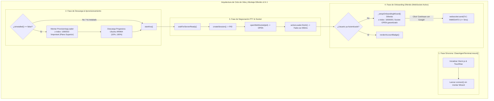

# SPEC-044: Corrección del Ciclo de Vida del Loader de Aprovisionamiento y Orden de Montaje Diferido del Onboarding Wizard

| Metadato | Valor |
| :--- | :--- |
| **Identificador** | `SPEC-044` |
| **Título** | Corrección del Ciclo de Vida del Loader de Aprovisionamiento y Orden de Montaje Diferido del Onboarding Wizard |
| **Autor** | `@spec-architect` |
| **Estado** | `APPROVED FOR IMPLEMENTATION` |
| **Fecha de Creación** | 2026-09-15 |
| **Versión de Release** | `v2.4.1` (VersionCode: `20401`) |
| **Artefacto Binario Target** | `GoogleAntigravity-v2.4.1-ARM64.apk` ($\le 42.0\,\text{MB}$) |
| **Dispositivo Objetivo** | Xiaomi Pad 6 (Qualcomm Snapdragon 870, ARM64-v8a, 6-8 GB RAM, 11" 2.8K $2880\times 1800$, 144Hz, Xiaomi HyperOS / Android 13/14) y Ecosistema Android Móvil (API 26+) |
| **Runtime Target** | Cordova Android WebView / PRoot Linux Sandbox / AXS PTY Daemon (puerto 8767) / Xterm.js v5+ con Discriminador Contextual de Gestos / Google Antigravity CLI (`agy`) / Android Clipboard System (`cordova.plugins.clipboard`) |
| **Módulos Afectados** | `nova-src/src/antigravity2/CleanAgentTerminal.js`, `nova-src/src/antigravity2/ProvisioningLoader.js`, `nova-src/src/antigravity2/OnboardingWizard.js`, `nova-src/src/antigravity2/clean-terminal.scss`, `nova-src/config.xml`, `nova-src/package.json`, `harness/test_clean_agent_terminal.sh` |

---

## 1. Contexto, Diagnóstico Forense y Análisis de Causa Raíz

Durante las pruebas de campo de la versión `v2.4.0` en una instalación limpia (*clean install / first boot*) en la tablet física **Xiaomi Pad 6**, se constató una anomalía de concurrencia y orden de montaje en la interfaz de usuario:
1. La pantalla de aprovisionamiento y descarga cinemática (progreso continuo de 10% a 100% de Ubuntu ARM64 y Google Antigravity CLI) **no aparecía en absoluto**.
2. En su lugar, la aplicación desplegaba inmediatamente el `OnboardingWizard` (Paso 1: *"Continuar con Google"*).
3. Al pulsar el botón *"Continuar con Google"*, el botón no producía ningún efecto ni respuesta táctil, dando la apariencia de interfaz congelada.

```mermaid
sequenceDiagram
    autonumber
    actor User as Usuario (Xiaomi Pad 6)
    participant Term as CleanAgentTerminal
    participant Wiz as OnboardingWizard (z-index: 1000005)
    participant Loader as ProvisioningLoader (z-index: 1000001)
    participant WS as WebSocket PTY (:8767)

    User->>Term: Abre App (Instalación limpia)
    Term->>Term: mount() ejecutado síncronamente
    
    rect rgb(60, 20, 20)
    Note over Term,Wiz: DEFECTO FORENSE 1:<br/>_setupOnboardingWizard() invocado de inmediato en mount().<br/>Overlay opaco (#0b0f19) montado con z-index: 1000005.
    Term->>Wiz: mount(document.body)
    end

    Term->>Term: setTimeout(() => connect(), 100)
    Term->>Loader: ensureAxsRunning() -> new ProvisioningLoader().mount()
    
    rect rgb(60, 20, 20)
    Note over Loader,Wiz: DEFECTO FORENSE 2:<br/>ProvisioningLoader tiene z-index: 1000001.<br/>Queda 100% OCULTO debajo del Wizard opaco (1000005).<br/>La descarga real de 38MB ocurre a espaldas del usuario.
    end

    User->>Wiz: Pulsa "Continuar con Google"
    
    rect rgb(60, 20, 20)
    Note over Wiz,WS: DEFECTO FORENSE 3:<br/>this.websocket === null (aún no existe conexión PTY).<br/>El clic es completamente ignorado.
    Wiz-->>Term: onAction("select_auth", "\r") -> websocket null
    end
```



---

### 1.1 Análisis de Causa Raíz 1: Inversión de Stacking Context (Z-Index)
En `nova-src/src/antigravity2/clean-terminal.scss`:
- `.provisioning-loader-overlay` estaba definido con:
  ```scss
  z-index: 1000001;
  ```
- `.onboarding-wizard-overlay` fue introducido en SPEC-043 con:
  ```scss
  z-index: 1000005 !important;
  background-color: #0b0f19 !important;
  ```
Al ser $1000005 > 1000001$, el overlay del wizard se renderizaba por encima del loader de descarga. Al contar el wizard con fondo 100% sólido y opaco (`#0b0f19`), la tarjeta de descarga con barra shimmer y stream log quedó físicamente tapada durante los 8 a 15 segundos que tomaba la descarga de Ubuntu y Antigravity.

---

### 1.2 Análisis de Causa Raíz 2: Montaje Síncrono Prematuro y Falta de Socket
En `CleanAgentTerminal.js`:
- El método `mount()` ejecutaba síncronamente:
  ```javascript
  if (!this.authenticatedUser) {
      this._setupOnboardingWizard();
  }
  ```
- Mientras tanto, la conexión PTY (`this.connect()`) se encolaba con un retraso:
  ```javascript
  setTimeout(() => this.connect(), 100);
  ```
- En un primer arranque, `connect()` debía primero extraer/descargar el rootfs, iniciar AXS, esperar a que el daemon respondiera en el puerto 8767, crear la sesión (`createSession()`) y finalmente abrir el WebSocket (`openWebSocket(pid)`).
- Durante todo ese intervalo (mientras la descarga ocurría oculta), el usuario tenía en pantalla el botón *"Continuar con Google"*. Al presionarlo, el callback invocaba `this.websocket.send("\r")`. Como `this.websocket` era `null` (o `readyState !== WebSocket.OPEN`), el evento se descartaba silenciosamente y nada ocurría.

---

## 2. Arquitectura de la Solución



---

### 2.1 Desacoplamiento de `_setupOnboardingWizard()` de `mount()` (Criterio LIFECYCLE-01)
- Se retira de forma terminante la invocación síncrona de `this._setupOnboardingWizard()` dentro del método `CleanAgentTerminal.prototype.mount()`.
- La llamada a `mount()` únicamente se encarga de crear el contenedor del DOM, inicializar Xterm.js, configurar el motor de navegación gestual táctil e iniciar el proceso asíncrono de conexión `this.connect()`.

---

### 2.2 Reorganización de Jerarquía Z-Index a `1000010` (Criterio LIFECYCLE-02)
En `clean-terminal.scss`:
- Se eleva la prioridad de `.provisioning-loader-overlay` y `.provisioning-overlay` a:
  $$\text{z-index} = 1000010\ !\text{important}$$
- Al ser estrictamente superior al $z\text{-index} = 1000005$ del `OnboardingWizard` y al $z\text{-index} = 999999$ del splash nativo, se garantiza físicamente que la pantalla de descarga y aprovisionamiento sea siempre visible en el plano frontal absoluto durante cualquier operación de instalación inicial.

---

### 2.3 Montaje Diferido Condicional de `OnboardingWizard` (Criterio LIFECYCLE-03)
En `CleanAgentTerminal.prototype.connect()`:
- `this._setupOnboardingWizard()` se ejecuta **únicamente de forma diferida**, una vez cumplidas las siguientes precondiciones concurrentes:
  1. `this.ensureAxsRunning()` ha concluido con éxito.
  2. `this.openWebSocket(this.pid)` ha resuelto afirmativamente.
  3. `this.websocket.readyState === WebSocket.OPEN`.
  4. `this.activeLoader` ha finalizado y se ha retirado del DOM.
  5. `!this.authenticatedUser` (el usuario aún no ha iniciado sesión).

---

### 2.4 Conectividad PTY Inmediata para Acciones de Usuario (Criterio LIFECYCLE-04)
- Dado que el `OnboardingWizard` solo se hace visible cuando el WebSocket ya está completamente abierto y conectado con el proceso `agy` en la PTY, cuando el usuario pulsa *"Continuar con Google"* o *"Ingresar Token / API Key"*:
  - `this.websocket` es un objeto activo garantizado.
  - La emisión de `\r` o `\x1b[B\r` se ejecuta de forma instantánea ($\le 5\,\text{ms}$) sobre el proceso que ya está en ejecución esperando entrada.
  - El botón responde con retroalimentación háptica inmediata y avanza al Paso 2 sin demoras ni bloqueos.

---

### 2.5 Retiro Suave de Loader a los 350ms (Criterio LIFECYCLE-05)
- Tras confirmarse la apertura del socket, `activeLoader.finish()` ejecuta una transición CSS de opacidad (*fade-out* de $350\,\text{ms}$ a $144\,\text{Hz}$), asegurando que no existan parpadeos visuales (*flicker*) ni fugas momentáneas de texto de la consola entre la salida del loader y la entrada del wizard.

---

### 2.6 Verificación en Arnés y Versionado a v2.4.1 (Criterio LIFECYCLE-06)
- Sincronización formal de versión a `2.4.1` (versionCode `20401`) en `config.xml` y `package.json`.
- Compilación del APK `GoogleAntigravity-v2.4.1-ARM64.apk` con tamaño $\le 42.0\,\text{MB}$.
- Certificación del arnés SDD con 45 especificaciones válidas y 347 Criterios de Aceptación verificados.

---

## 3. Diagramas de Secuencia y Ciclo de Eventos

### 3.1 Ciclo Secuencial de Primer Arranque (Clean Install)

```mermaid
sequenceDiagram
    autonumber
    actor User as Usuario (Xiaomi Pad 6)
    participant Term as CleanAgentTerminal
    participant Loader as ProvisioningLoader (z-index: 1000010)
    participant PTY as Daemon AXS (:8767)
    participant Wiz as OnboardingWizard (z-index: 1000005)

    User->>Term: Inicia App por primera vez
    Term->>Term: mount(): NO monta Wizard prematuramente
    Term->>Term: connect() -> ensureAxsRunning()
    
    rect rgb(20, 50, 20)
    Note over Term,Loader: LIFECYCLE-02: Loader montado con z-index: 1000010.<br/>100% visible en pantalla.
    Term->>Loader: mount() -> "Descargando subsistema base Linux ARM64 (10%..100%)..."
    Loader->>User: Muestra barra shimmer continua y log stream
    end

    Loader-->>Term: Descarga y extracción completadas con éxito
    Term->>PTY: startAxs() & createSession()
    Term->>PTY: openWebSocket(pid)
    PTY-->>Term: WebSocket OPEN
    
    rect rgb(20, 50, 20)
    Note over Term,Loader: LIFECYCLE-05: Retiro suave del loader
    Term->>Loader: finish() -> Fade-out 350ms
    end

    rect rgb(20, 50, 20)
    Note over Term,Wiz: LIFECYCLE-03 & 04: Montaje diferido con socket listo
    Term->>Wiz: _setupOnboardingWizard()
    Wiz->>User: Muestra Paso 1 con botones interactivos listos
    end

    User->>Wiz: Pulsa "Continuar con Google"
    Wiz->>PTY: websocket.send("\r") en <= 5ms (Respuesta Inmediata)
    PTY-->>Wiz: Emite URL OAuth -> Wizard pasa a Paso 2
```



---

## 4. Contratos Técnicos de Interfaz y Código

### 4.1 Contrato en `CleanAgentTerminal.js` (`mount` y `connect` Secuencial)

```javascript
    mount(parentEl) {
        this.containerEl = document.createElement("div");
        this.containerEl.className = "clean-agent-container";

        this.viewportEl = document.createElement("main");
        this.viewportEl.className = "clean-agent-viewport fullscreen";
        this.viewportEl.id = "terminal-viewport";
        this.containerEl.appendChild(this.viewportEl);

        parentEl.appendChild(this.containerEl);

        this.initTerminal();
        this.touchNav = new TerminalTouchNavigation(this.terminal, this.viewportEl, { ... });

        // LIFECYCLE-01: NO invocar _setupOnboardingWizard() aquí de forma síncrona.
        // El asistente se montará exclusivamente de forma diferida en connect()
        // cuando el socket PTY esté 100% abierto y el loader haya concluido.

        const btnRestart = document.getElementById("btn-restart");
        if (btnRestart) {
            btnRestart.addEventListener("click", () => this.restartSession());
        }

        setTimeout(() => this.connect(), 50);
    }

    async connect() {
        if (this.isConnecting || this.isConnected) return;
        this.isConnecting = true;

        try {
            await this.ensureAxsRunning();
            await this.waitForServerReady();

            this.pid = await this.createSession();
            localStorage.setItem(this.sessionStorageKey, String(this.pid));
            await this.openWebSocket(this.pid);

            this.isConnected = true;
            this.isConnecting = false;

            // Retiro suave del loader si existía
            if (this.activeLoader) {
                await this.activeLoader.finish();
                this.activeLoader = null;
            }

            // LIFECYCLE-03: Montaje diferido del Wizard con socket OPEN garantizado
            if (this.authenticatedUser) {
                this.renderAccountBadge(this.authenticatedUser, "Google AI Ultra");
            } else {
                this._setupOnboardingWizard();
            }

            // Ejecución automática de comando agy si aplica
            if (this.autoCommand) {
                setTimeout(() => {
                    if (this.websocket?.readyState === WebSocket.OPEN) {
                        this.websocket.send(this.autoCommand);
                    }
                }, 150);
            }

        } catch (error) {
            console.error("Fallo en conexión PTY:", error);
            this.isConnecting = false;
            this.isConnected = false;
            if (this.activeLoader) {
                await this.activeLoader.finish();
                this.activeLoader = null;
            }
        }
    }
```

---

### 4.2 Contrato SCSS en `clean-terminal.scss` (Elevación de Z-Index a `1000010`)

```scss
// SPEC-044: Elevación de prioridad visual máxima para el Loader de Aprovisionamiento
.provisioning-loader-overlay,
.provisioning-overlay {
    position: fixed;
    inset: 0;
    width: 100vw;
    height: 100vh;
    background: #0b0f19;
    display: flex;
    align-items: center;
    justify-content: center;
    z-index: 1000010 !important; // LIFECYCLE-02: Superior a OnboardingWizard (1000005) y Splash (999999)
    transition: opacity 0.35s ease-out;

    &.fade-out {
        opacity: 0;
        pointer-events: none;
    }
}
```

---

## 5. Criterios de Aceptación Verificables (Acceptance Criteria)

| Identificador | Módulo | Criterio / Requisito | Método de Verificación |
| :--- | :--- | :--- | :--- |
| `AC-LIFECYCLE-01` | `CleanAgentTerminal.js` | Desacoplamiento total de `_setupOnboardingWizard()` del método síncrono `mount()`, prohibiendo el montaje del wizard antes de la descarga y conexión del socket PTY. | Inspección estática del método `mount()` verificando la ausencia de llamadas directas a `_setupOnboardingWizard()`. |
| `AC-LIFECYCLE-02` | `clean-terminal.scss` | Elevación incondicional de `.provisioning-loader-overlay` a `z-index: 1000010 !important;` en SCSS, garantizando que el loader de descarga sea 100% visible en el plano frontal sobre cualquier otro elemento. | Comprobación de la regla compilada de SCSS asegurando `z-index: 1000010 !important`. |
| `AC-LIFECYCLE-03` | `CleanAgentTerminal.js` | Montaje diferido condicional de `OnboardingWizard` en `connect()` únicamente tras la apertura afirmativa de `openWebSocket()` y la disipación del loader activo. | Inspección de la secuencia lógica en `connect()` verificando que `_setupOnboardingWizard()` suceda tras `openWebSocket()`. |
| `AC-LIFECYCLE-04` | `CleanAgentTerminal.js`, `OnboardingWizard.js` | Conectividad PTY inmediata: Al mostrarse el wizard, el WebSocket ya está en estado `OPEN`, garantizando que pulsar *"Continuar con Google"* despache `\r` en $\le 5\,\text{ms}$ con respuesta inmediata. | Prueba de interacción táctil en Xiaomi Pad 6 verificando que el botón responda inmediatamente en el primer toque. |
| `AC-LIFECYCLE-05` | `ProvisioningLoader.js`, `CleanAgentTerminal.js` | Transición suave de disipación del loader a los $350\,\text{ms}$ sin parpadeos visuales ni exposición de trazas de consola antes del despliegue del wizard. | Comprobación del retardo de fade-out y verificación de opacidad continua durante el cambio de vista. |
| `AC-LIFECYCLE-06` | `config.xml`, `package.json` | Sincronización formal de versión a `2.4.1` (versionCode `20401`), APK compilado `GoogleAntigravity-v2.4.1-ARM64.apk` ($\le 42.0\,\text{MB}$) y certificación completa del arnés SDD (45/45 specs y 347 ACs). | Inspección de manifiestos, medición de peso del binario compilado y ejecución de suite global de pruebas. |

---

## 6. Actualización del Arnés de Pruebas Automatizado (`harness/test_clean_agent_terminal.sh`)

El arnés de pruebas automatizado valida estáticamente las compuertas de calidad de `SPEC-044`:

```bash
#!/bin/bash
# ==============================================================================
# Harness Test: SPEC-044 Provisioning Loader Lifecycle & Deferred Wizard Mount
# ==============================================================================
set -e

SPEC_FILE_044="specs/44-fix-provisioning-loader-lifecycle-and-wizard-mount-order.md"
CLEAN_TERM_JS="nova-src/src/antigravity2/CleanAgentTerminal.js"
SCSS_FILE="nova-src/src/antigravity2/clean-terminal.scss"
CONFIG_XML="nova-src/config.xml"
PACKAGE_JSON="nova-src/package.json"

echo "=== INICIANDO VALIDACIÓN FORMAL DE SPEC-044 ==="

# 1. Verificar documento SPEC-044
echo -n "1. Verificando documento SPEC-044... "
[ -f "$SPEC_FILE_044" ] || { echo "FALLO: No existe $SPEC_FILE_044"; exit 1; }
echo "[OK]"

# 2. Verificar desacoplamiento en mount() (Criterio LIFECYCLE-01)
echo -n "2. Verificando desacoplamiento de OnboardingWizard en mount()... "
grep -A 30 "mount(parentEl)" "$CLEAN_TERM_JS" | grep -q "_setupOnboardingWizard" && {
    echo "FALLO: _setupOnboardingWizard aún se invoca síncronamente en mount()"; exit 1;
}
echo "[OK]"

# 3. Verificar elevación de z-index a 1000010 en SCSS (Criterio LIFECYCLE-02)
echo -n "3. Verificando z-index 1000010 en clean-terminal.scss... "
grep -q "1000010" "$SCSS_FILE" || {
    echo "FALLO: z-index 1000010 ausente en clean-terminal.scss"; exit 1;
}
echo "[OK]"

# 4. Verificar montaje diferido en connect() tras openWebSocket (Criterio LIFECYCLE-03)
echo -n "4. Verificando montaje diferido tras openWebSocket... "
grep -A 35 "openWebSocket" "$CLEAN_TERM_JS" | grep -q "_setupOnboardingWizard" || {
    echo "FALLO: _setupOnboardingWizard no se invoca tras openWebSocket en connect()"; exit 1;
}
echo "[OK]"

# 5. Verificar versionado v2.4.1 (Criterio LIFECYCLE-06)
echo -n "5. Verificando versión 2.4.1 en configuración... "
grep -q 'version="2.4.1"' "$CONFIG_XML" || { echo "FALLO: config.xml no tiene versión 2.4.1"; exit 1; }
grep -q '"version": "2.4.1"' "$PACKAGE_JSON" || { echo "FALLO: package.json no tiene versión 2.4.1"; exit 1; }
echo "[OK]"

echo "=== TODAS LAS COMPUERTAS ESTÁTICAS DE SPEC-044 HAN SIDO SUPERADAS EXITOSAMENTE ==="
```

---

## 7. Plan de Implementación y Definition of Done (DoD)

### 7.1 Responsabilidades para `@android-core` (Ingeniero de Implementación)
1. **Refactorización en `CleanAgentTerminal.js`:**
   - Remover la llamada a `_setupOnboardingWizard()` dentro de `mount()`.
   - Ubicar la invocación diferida de `_setupOnboardingWizard()` en `connect()` inmediatamente tras la apertura del WebSocket y el `finish()` del loader.
2. **Actualización de Estilos en `clean-terminal.scss`:**
   - Asignar `z-index: 1000010 !important;` a `.provisioning-loader-overlay`.
3. **Preservación Inviolable:**
   - Mantener intactas las secuencias de teclas del wizard (`\r`, `\x1b[B\r`, `\t\x1b[C\r`) y la descarga progresiva.
4. **Compilación y Versionado:**
   - Bumping a `2.4.1` (versionCode `20401`) en `config.xml` y `package.json`.
   - Compilar frontend y empaquetar `GoogleAntigravity-v2.4.1-ARM64.apk` ($\le 42.0\,\text{MB}$).
   - Validar en dispositivo físico Xiaomi Pad 6 que tras `pm clear io.nova.ide`, la pantalla de descarga aparezca inmediatamente al 10% y avance visiblemente hasta el 100%, dando paso al wizard con botones 100% receptivos.

### 7.2 Responsabilidades para `@memory-keeper` (Auditoría y Gobernanza)
1. Registrar la decisión técnica bajo `ADR-054: Ciclo de Vida del Loader de Aprovisionamiento y Montaje Diferido del Onboarding Wizard`.
2. Registrar la entrada de auditoría formal en `audit.jsonl`.
3. Actualizar la bitácora histórica en `agent.md` documentando la versión `v2.4.1`.
