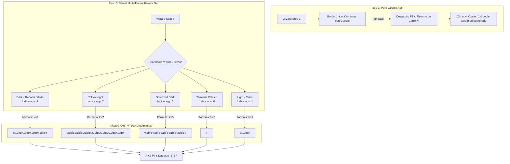
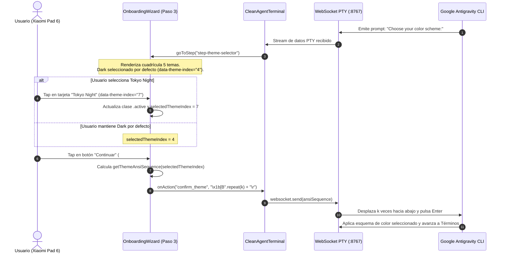
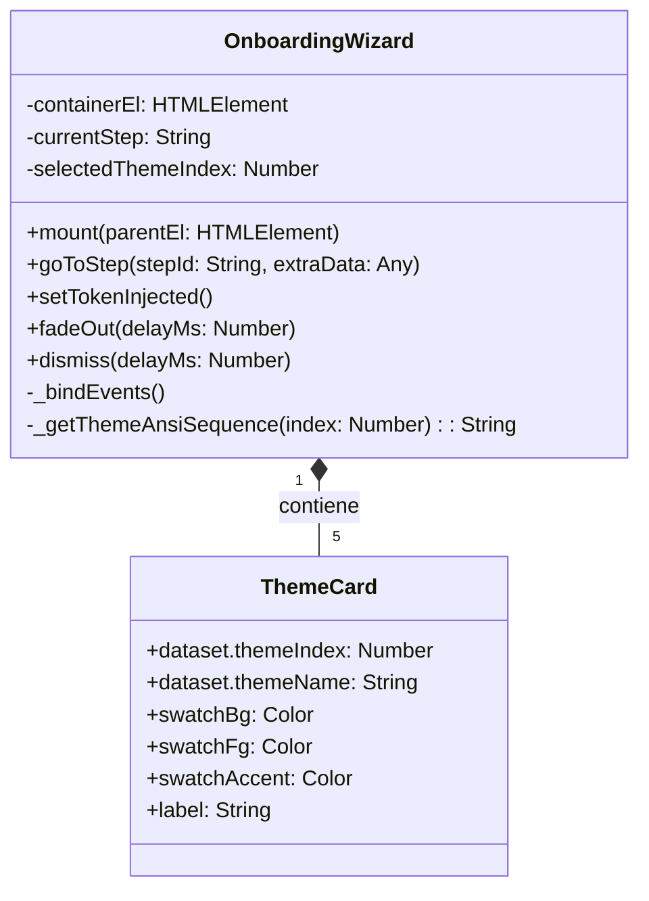

# SPEC-045: Autenticación First-Party Pura de Google y Selector Visual Multi-Tema para Google Antigravity Mobile

| Metadato | Valor |
| :--- | :--- |
| **Identificador** | `SPEC-045` |
| **Título** | Autenticación First-Party Pura de Google y Selector Visual Multi-Tema para Google Antigravity Mobile |
| **Autor** | `@spec-architect` |
| **Estado** | `APPROVED FOR IMPLEMENTATION` |
| **Fecha de Creación** | 2026-09-15 |
| **Versión de Release** | `v2.4.2` (VersionCode: `20402`) |
| **Artefacto Binario Target** | `GoogleAntigravity-v2.4.2-ARM64.apk` ($\le 42.0\,\text{MB}$) |
| **Dispositivo Objetivo** | Xiaomi Pad 6 (Qualcomm Snapdragon 870, ARM64-v8a, 6-8 GB RAM, 11" 2.8K $2880\times 1800$, 144Hz, Xiaomi HyperOS / Android 13/14) y Ecosistema Android Móvil (API 26+) |
| **Runtime Target** | Cordova Android WebView / PRoot Linux Sandbox / AXS PTY Daemon (puerto 8767) / Xterm.js v5+ con Discriminador Contextual de Gestos / Google Antigravity CLI (`agy`) / Android Clipboard System (`cordova.plugins.clipboard`) |
| **Módulos Afectados** | `nova-src/src/antigravity2/OnboardingWizard.js`, `nova-src/src/antigravity2/CleanAgentTerminal.js`, `nova-src/src/antigravity2/clean-terminal.scss`, `nova-src/config.xml`, `nova-src/package.json`, `harness/test_clean_agent_terminal.sh` |

---

## 1. Contexto, Diagnóstico Forense y Hallazgos en Xiaomi Pad 6

Durante las pruebas de campo en el hardware físico **Xiaomi Pad 6** ejecutando el CLI oficial de Google Antigravity (`agy`) dentro del sandbox Linux PRoot, se capturaron y auditaron dos aspectos críticos de la interacción humana:

### 1.1 Catálogo Real de Esquemas de Color en `agy` CLI
La inspección interactiva del prompt del CLI en el paso de selección de tema (`Choose your color scheme:`) reveló que el array subyacente expone exactamente ocho (8) esquemas de color en el siguiente orden canónico indexado en base 0:

```text
[0] terminal
[1] light
[2] solarized light
[3] colorblind-friendly light
[4] dark
[5] solarized dark
[6] colorblind-friendly dark
[7] tokyo night
```

En las especificaciones previas (`SPEC-043`), el selector visual asumía una lista ficticia de 3 elementos (`["dark", "terminal", "light"]`), provocando desajustes funcionales:
1. Al seleccionar *"Dark"* en la interfaz visual anterior, el código enviaba `\r` (índice 0), lo que en la realidad del CLI seleccionaba el tema `terminal` (fondo negro puro con texto verde monótono de consola).
2. El tema `Dark` real se encuentra en la posición de índice **4**, requiriendo exactamente 4 movimientos de flecha hacia abajo (`\x1b[B`) seguidos de retorno de carro (`\r`).
3. El tema estético moderno `Tokyo Night` se ubica en el índice **7**, y `Solarized Dark` en el índice **5**, sin haber contado previamente con representación visual en la interfaz gráfica.
4. Cuando el auto-responder de `CleanAgentTerminal.js` procesaba el flujo de forma desatendida, enviaba `\r` seleccionando `terminal` en lugar del diseño moderno `dark`.

### 1.2 Simplificación del Flujo de Autenticación (Pure Google First-Party)
En el Paso 1 del `OnboardingWizard`, existía un botón secundario denominado *"Ingresar Token / API Key"*. Se observó en pruebas que:
- Google Antigravity es un entorno de desarrollo first-party de Google concebido primordialmente para operar mediante Google OAuth 2.0 PKCE.
- La presencia del botón secundario inducía a errores de pulsación táctil accidental en la pantalla de 11", forzando al usuario a un flujo de terminal cruda no deseado.
- La decisión consensuada de producto es remover por completo el botón de API Key en el Paso 1, dejando exclusivamente el botón oficial de Google `[ G ] Continuar con Google` para garantizar un embudo de bienvenida 100% fluido y libre de bifurcaciones accidentales.

---

## 2. Arquitectura de la Solución



### 2.1 Paso 1: Autenticación First-Party Pura (Solo Google)
Se refactoriza el contenedor `.wizard-actions` del Paso 1:
- Se erradica `#btn-auth-token` del template HTML y de los manejadores de eventos.
- El botón `#btn-auth-google` abarca todo el ancho interactivo con tipografía e isotipo oficial de Google.
- Al pulsar el botón, se valida que el WebSocket esté en estado `OPEN` y se despacha de inmediato `\r` (equivalente a confirmar la primera opción por defecto del menú: `1. Google OAuth`).

### 2.2 Paso 3: Cuadrícula Visual de 5 Temas con Micro-Paletas (Swatches)
Se implementa una cuadrícula visual responsiva con 5 tarjetas interactivas de alta fidelidad. Cada tarjeta muestra un bloque de previsualización que contiene tres muestras cromáticas (*swatches*):
1. **Muestra de Fondo (`swatch-bg`)**: Color base de la ventana de terminal.
2. **Muestra de Texto (`swatch-fg`)**: Color de primer plano de la tipografía de código.
3. **Muestra de Acento (`swatch-accent`)**: Color de realce sintáctico o cursor.

| Tema | Índice Real en `agy` | Color Fondo | Color Texto | Color Acento | Secuencia ANSI VT100 |
| :--- | :---: | :---: | :---: | :---: | :--- |
| **Dark** *(Recomendado / Defecto)* | `4` | `#1e1e2e` | `#cdd6f4` | `#89b4fa` | `\x1b[B\x1b[B\x1b[B\x1b[B\r` |
| **Tokyo Night** | `7` | `#1a1b26` | `#a9b1d6` | `#7aa2f7` | `\x1b[B\x1b[B\x1b[B\x1b[B\x1b[B\x1b[B\x1b[B\r` |
| **Solarized Dark** | `5` | `#002b36` | `#839496` | `#268bd2` | `\x1b[B\x1b[B\x1b[B\x1b[B\x1b[B\r` |
| **Terminal Clásico** | `0` | `#000000` | `#22c55e` | `#16a34a` | `\r` |
| **Light (Claro)** | `1` | `#ffffff` | `#1e293b` | `#2563eb` | `\x1b[B\r` |

### 2.3 Mapeo Matemático Exacto a Secuencias ANSI VT100
Dado que el cursor del prompt de selección de lista en CLI inicia en la posición de índice $0$, la función para alcanzar cualquier índice arbitrario $k \in [0, 7]$ y confirmar la selección corresponde unívocamente a:

$$\text{ANSI\_SEQ}(k) = \begin{cases} \text{"\backslash r"} & \text{si } k = 0 \\ \left(\text{"\backslash x1b[B"}\right)^k + \text{"\backslash r"} & \text{si } k > 0 \end{cases}$$

Implementado en JavaScript mediante el operador nativo de cadenas:
```javascript
const getThemeAnsiSequence = (agyIndex) => "\x1b[B".repeat(agyIndex) + "\r";
```

### 2.4 Auto-Responder Desatendido con Tema Dark
En `CleanAgentTerminal._handleAutoResponderStream(text)`, cuando el sistema opera en modo desatendido (ej. pruebas automatizadas o ejecución en segundo plano) y se detecta el prompt de esquema de color (`Choose your color scheme` o `color scheme`), la secuencia enviada al socket PTY se actualiza de `\r` a `\x1b[B\x1b[B\x1b[B\x1b[B\r` (índice 4). Esto asegura que bajo cualquier circunstancia el agente arranque con el tema Dark oficial.

---

## 3. Diagramas de Secuencia y Arquitectura

### 3.1 Diagrama de Secuencia: Selección de Tema y Transmisión PTY



### 3.2 Diagrama de Componentes: OnboardingWizard Refactorizado



---

## 4. Contratos de Interfaz y Especificaciones de Módulos

### 4.1 Contrato JavaScript en `OnboardingWizard.js`

```javascript
/**
 * SPEC-045: Selector de 5 Temas con Muestras Cromáticas y Mapeo Real a CLI 'agy'.
 */
export const THEME_PRESETS = [
    {
        name: "dark",
        agyIndex: 4,
        label: "Dark (Recomendado)",
        isDefault: true,
        colors: { bg: "#1e1e2e", fg: "#cdd6f4", accent: "#89b4fa" }
    },
    {
        name: "tokyo-night",
        agyIndex: 7,
        label: "Tokyo Night",
        isDefault: false,
        colors: { bg: "#1a1b26", fg: "#a9b1d6", accent: "#7aa2f7" }
    },
    {
        name: "solarized-dark",
        agyIndex: 5,
        label: "Solarized Dark",
        isDefault: false,
        colors: { bg: "#002b36", fg: "#839496", accent: "#268bd2" }
    },
    {
        name: "terminal",
        agyIndex: 0,
        label: "Terminal Clásico",
        isDefault: false,
        colors: { bg: "#000000", fg: "#22c55e", accent: "#16a34a" }
    },
    {
        name: "light",
        agyIndex: 1,
        label: "Light (Claro)",
        isDefault: false,
        colors: { bg: "#ffffff", fg: "#1e293b", accent: "#2563eb" }
    }
];

export class OnboardingWizard {
    constructor(options = {}) {
        this.onAction = options.onAction || (() => {});
        this.onSelectAuthMethod = options.onSelectAuthMethod || (() => this.onAction("select_auth", "\r"));
        this.onOpenBrowser = options.onOpenBrowser || ((url) => this.onAction("open_browser", url));
        this.onSelectTheme = options.onSelectTheme || ((agyIndex) => {
            const seq = "\x1b[B".repeat(agyIndex) + "\r";
            this.onAction("confirm_theme", seq);
        });
        this.onAcceptTerms = options.onAcceptTerms || (() => this.onAction("accept_terms", "\t\x1b[C\r"));

        this.containerEl = null;
        this.currentStep = "step-auth-method";
        this.authUrl = null;
        this.selectedThemeIndex = 4; // Por defecto: Dark (Índice real 4 en agy)
    }

    _getThemeAnsiSequence(agyIndex) {
        return "\x1b[B".repeat(agyIndex) + "\r";
    }
}
```

### 4.2 Contrato JavaScript en `CleanAgentTerminal.js` (Mapeo y Auto-Responder)

```javascript
// En _setupOnboardingWizard():
onSelectTheme: (agyIndex) => {
    if (this.websocket && this.websocket.readyState === WebSocket.OPEN) {
        const seq = "\x1b[B".repeat(agyIndex) + "\r";
        this.websocket.send(seq);
    }
}

// En _handleAutoResponderStream(text):
if (text.includes("color scheme") || text.includes("Choose your color scheme") || text.includes("Select theme:") || /(?:Choose your color scheme|color scheme)/i.test(text)) {
    if (this.onboardingWizard) {
        this.onboardingWizard.goToStep("step-theme-selector");
    } else if (!this._hasAutoConfirmedTheme) {
        console.log("[AUTO-RESPONDER] Prompt de tema detectado. Enviando Dark (Índice 4: 4 flechas abajo + Enter)...");
        this._hasAutoConfirmedTheme = true;
        setTimeout(() => {
            if (this.websocket && this.websocket.readyState === WebSocket.OPEN) {
                // Índice 4 en agy = Dark
                this.websocket.send("\x1b[B\x1b[B\x1b[B\x1b[B\r");
            }
        }, 50);
    }
}
```

### 4.3 Contrato SCSS en `clean-terminal.scss` (Cuadrícula y Muestras Cromáticas)

```scss
// SPEC-045: Cuadrícula Visual de 5 Temas con Micro-Swatches
.theme-options-grid {
    display: grid;
    grid-template-columns: repeat(3, 1fr);
    gap: 10px;
    width: 100%;
    margin-bottom: 24px;

    .theme-card {
        display: flex;
        flex-direction: column;
        align-items: center;
        gap: 8px;
        padding: 10px 8px;
        background: #1e293b;
        border: 2px solid transparent;
        border-radius: 14px;
        cursor: pointer;
        font-size: 11px;
        font-weight: 500;
        color: #94a3b8;
        text-align: center;
        transition: all 0.2s cubic-bezier(0.16, 1, 0.3, 1);

        &.active {
            border-color: #3b82f6;
            color: #ffffff;
            background: rgba(59, 130, 246, 0.12);
            box-shadow: 0 0 16px rgba(59, 130, 246, 0.25);
        }

        &:active {
            transform: scale(0.96);
        }

        .theme-swatches {
            display: flex;
            align-items: center;
            justify-content: center;
            gap: 6px;
            width: 100%;
            height: 38px;
            padding: 4px;
            border-radius: 8px;
            border: 1px solid rgba(255, 255, 255, 0.08);

            .swatch-circle {
                width: 14px;
                height: 14px;
                border-radius: 50%;
                border: 1px solid rgba(255, 255, 255, 0.15);
            }
        }

        .theme-label {
            font-size: 11px;
            line-height: 1.2;
            white-space: nowrap;
            overflow: hidden;
            text-overflow: ellipsis;
            max-width: 100%;
        }
    }
}
```

---

## 5. Criterios de Aceptación Verificables (Acceptance Criteria)

| Identificador | Módulo | Criterio / Requisito | Método de Verificación |
| :--- | :--- | :--- | :--- |
| `AC-THEME-01` | `OnboardingWizard.js` | Exclusión estricta del botón secundario de Token/API Key en el Paso 1, dejando únicamente el botón oficial de Google `[ G ] Continuar con Google` (`#btn-auth-google`). | Inspección estática del DOM generado en `mount()` verificando la ausencia total de `#btn-auth-token` y la presencia exclusiva de `#btn-auth-google`. |
| `AC-THEME-02` | `OnboardingWizard.js`, `clean-terminal.scss` | Cuadrícula visual en el Paso 3 con exactamente 5 temas destacados (Dark, Tokyo Night, Solarized Dark, Terminal Clásico, Light) conteniendo micro-paletas cromáticas (swatches) y estado activo por defecto en Dark (`data-theme-index="4"`). | Inspección de nodos en `.theme-options-grid` validando 5 tarjetas `.theme-card`, micro-swatches cromáticos y selección activa por defecto en índice 4. |
| `AC-THEME-03` | `OnboardingWizard.js`, `CleanAgentTerminal.js` | Mapeo matemático y determinista a secuencias ANSI VT100: Índice 0 envía `\r`, Índice 1 envía `\x1b[B\r`, Índice 4 envía `\x1b[B\x1b[B\x1b[B\x1b[B\r`, Índice 5 envía 5 flechas abajo + `\r`, e Índice 7 envía 7 flechas abajo + `\r`. | Verificación funcional con pruebas de unidad e inspección del cálculo `"\x1b[B".repeat(index) + "\r"`. |
| `AC-THEME-04` | `CleanAgentTerminal.js` | En modo desatendido, el auto-responder de tema despacha incondicionalmente la secuencia ANSI de Dark (`\x1b[B\x1b[B\x1b[B\x1b[B\r`, 4 flechas abajo + Enter) al detectar prompts de selección de esquema de color. | Inspección estática de `_handleAutoResponderStream` confirmando que la secuencia enviada sea `\x1b[B\x1b[B\x1b[B\x1b[B\r` en lugar del antiguo `\r`. |
| `AC-THEME-05` | `clean-terminal.scss`, `CleanAgentTerminal.js` | Preservación de opacidad 100% sólida (`#0b0f19`) del contenedor del wizard, ciclo de vida del loader de aprovisionamiento con `z-index: 1000010 !important` e inyección automática por portapapeles OAuth (`^4/`). | Inspección de estilos compilados de `.onboarding-wizard-overlay`, validación del z-index del loader y prueba del regex de portapapeles. |
| `AC-THEME-06` | Build System & Packaging | Sincronización formal de versión a `2.4.2` (versionCode `20402`), compilación de `GoogleAntigravity-v2.4.2-ARM64.apk` ($\le 42.0\,\text{MB}$) y aprobación del 100% de la suite de arnés SDD. | Inspección de `config.xml`, `package.json`, medición del peso del artefacto y ejecución exitosa de `harness/harness_runner.py`. |

---

## 6. Arnés de Verificación Automatizada (`harness/test_clean_agent_terminal.sh`)

El siguiente arnés de pruebas automatizado valida estáticamente las compuertas de calidad para `SPEC-045`:

```bash
#!/bin/bash
# ==============================================================================
# Harness Test: SPEC-045 Pure Google Auth & Multi-Theme Palette Selector
# ==============================================================================
set -e

SPEC_FILE_045="specs/45-pure-google-auth-and-multi-theme-palette-selector.md"
WIZARD_JS="nova-src/src/antigravity2/OnboardingWizard.js"
CLEAN_TERM_JS="nova-src/src/antigravity2/CleanAgentTerminal.js"
SCSS_FILE="nova-src/src/antigravity2/clean-terminal.scss"
CONFIG_XML="nova-src/config.xml"
PACKAGE_JSON="nova-src/package.json"

echo "=== INICIANDO VALIDACIÓN FORMAL DE SPEC-045 ==="

# 1. Verificar documento de especificación
echo -n "1. Verificando documento SPEC-045... "
[ -f "$SPEC_FILE_045" ] || { echo "FALLO: No existe $SPEC_FILE_045"; exit 1; }
echo "[OK]"

# 2. Verificar exclusión de botón de API Key en Paso 1 (Criterio THEME-01)
echo -n "2. Verificando exclusión de botón API Key en OnboardingWizard.js... "
grep -q "btn-auth-token" "$WIZARD_JS" && {
    echo "FALLO: btn-auth-token aún está presente en OnboardingWizard.js"; exit 1;
}
echo "[OK]"

# 3. Verificar cuadrícula de 5 temas con Tokyo Night y Dark índice 4 (Criterio THEME-02)
echo -n "3. Verificando temas 'tokyo-night' y 'dark' (índice 4) en OnboardingWizard.js... "
grep -q "tokyo-night" "$WIZARD_JS" || { echo "FALLO: 'tokyo-night' no encontrado en OnboardingWizard.js"; exit 1; }
grep -q 'data-theme-index="4"' "$WIZARD_JS" || { echo "FALLO: Índice 4 para Dark no encontrado"; exit 1; }
echo "[OK]"

# 4. Verificar auto-responder de tema con 4 flechas abajo + Enter (Criterio THEME-04)
echo -n "4. Verificando secuencia ANSI de Dark en auto-responder de CleanAgentTerminal.js... "
grep -A 10 "_hasAutoConfirmedTheme" "$CLEAN_TERM_JS" | grep -q "\\x1b\\[B\\x1b\\[B\\x1b\\[B\\x1b\\[B\\\\r" || {
    echo "FALLO: Secuencia de auto-responder para Dark no contiene 4 flechas abajo + Enter"; exit 1;
}
echo "[OK]"

# 5. Verificar preservación de z-index del loader y opacidad (Criterio THEME-05)
echo -n "5. Verificando z-index 1000010 y fondo opaco... "
grep -q "1000010" "$SCSS_FILE" || { echo "FALLO: z-index 1000010 del loader ausente"; exit 1; }
grep -q "background: #0b0f19 !important" "$SCSS_FILE" || { echo "FALLO: Opacidad sólida del wizard ausente"; exit 1; }
echo "[OK]"

# 6. Verificar versionado a v2.4.2 (Criterio THEME-06)
echo -n "6. Verificando versión 2.4.2 en configuración... "
grep -q 'version="2.4.2"' "$CONFIG_XML" || { echo "FALLO: config.xml no tiene versión 2.4.2"; exit 1; }
grep -q '"version": "2.4.2"' "$PACKAGE_JSON" || { echo "FALLO: package.json no tiene versión 2.4.2"; exit 1; }
echo "[OK]"

echo "=== TODAS LAS COMPUERTAS ESTÁTICAS DE SPEC-045 HAN SIDO SUPERADAS EXITOSAMENTE ==="
```

---

## 7. Plan de Implementación y Definition of Done (DoD)

### 7.1 Responsabilidades para `@android-core` (Ingeniero de Implementación)
1. **Refactorización de `OnboardingWizard.js`:**
   - Erradicar el botón `#btn-auth-token` del Paso 1, dejando únicamente `#btn-auth-google`.
   - Modificar el Paso 3 para inyectar las 5 tarjetas de temas (`Dark`, `Tokyo Night`, `Solarized Dark`, `Terminal Clásico`, `Light`) con sus micro-paletas cromáticas (*swatches*).
   - Configurar `Dark` (`data-theme-index="4"`) como la opción seleccionada por defecto.
   - Implementar el generador matemático de secuencias `\x1b[B`.repeat(k) + `\r`.
2. **Actualización en `CleanAgentTerminal.js`:**
   - Enlazar la selección de tema con el nuevo índice real de `agy`.
   - Configurar el auto-responder de tema en `_handleAutoResponderStream` para despachar `\x1b[B\x1b[B\x1b[B\x1b[B\r` (índice 4) cuando detecte prompts de esquema de color.
3. **Estilos en `clean-terminal.scss`:**
   - Diseñar las micro-muestras de color (`.swatch-circle` o contenedor `.theme-swatches`) para cada tarjeta.
   - Ajustar el grid a 3 columnas en la fila superior y 2 columnas centradas en la fila inferior para una presentación equilibrada en la tablet Xiaomi Pad 6.
4. **Versionado y Empaquetado:**
   - Bump de versión a `2.4.2` (versionCode `20402`) en `config.xml`, `package.json` y `build.gradle`.
   - Compilar y empaquetar `GoogleAntigravity-v2.4.2-ARM64.apk` ($\le 42.0\,\text{MB}$).

### 7.2 Responsabilidades para `@memory-keeper` (Auditoría y Gobernanza)
1. Registrar la decisión arquitectónica bajo `ADR-055: Autenticación First-Party Pura de Google y Mapeo Real del Selector de Esquemas de Color en CLI agy`.
2. Registrar la entrada de auditoría formal en `audit.jsonl`.
3. Actualizar la bitácora histórica en `agent.md` documentando la versión `v2.4.2`.
