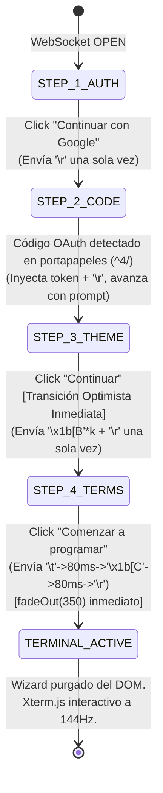

# SPEC-046: Transiciones Optimistas Fluidas en Onboarding Wizard y Erradicación de Emojis

| Metadato | Valor |
| :--- | :--- |
| **Identificador** | `SPEC-046` |
| **Título** | Transiciones Optimistas Fluidas en Onboarding Wizard y Erradicación de Emojis |
| **Autor** | `@spec-architect` |
| **Estado** | `APPROVED FOR IMPLEMENTATION` |
| **Fecha de Creación** | 2026-09-15 |
| **Versión de Release** | `v2.4.3` (VersionCode: `20403`) |
| **Artefacto Binario Target** | `GoogleAntigravity-v2.4.3-ARM64.apk` ($\le 42.0\,\text{MB}$) |
| **Dispositivo Objetivo** | Xiaomi Pad 6 (Qualcomm Snapdragon 870, ARM64-v8a, 6-8 GB RAM, 11" 2.8K $2880\times 1800$, 144Hz, Xiaomi HyperOS / Android 13/14) y Ecosistema Android Móvil (API 26+) |
| **Runtime Target** | Cordova Android WebView / PRoot Linux Sandbox / AXS PTY Daemon (puerto 8767) / Xterm.js v5+ con Discriminador Contextual de Gestos / Google Antigravity CLI (`agy`) / Android Clipboard System (`cordova.plugins.clipboard`) |
| **Módulos Afectados** | `nova-src/src/antigravity2/OnboardingWizard.js`, `nova-src/src/antigravity2/CleanAgentTerminal.js`, `nova-src/src/antigravity2/clean-terminal.scss`, `nova-src/config.xml`, `nova-src/package.json`, `harness/test_clean_agent_terminal.sh` |

---

## 1. Contexto, Diagnóstico Forense y Análisis de Causa Raíz

Tras el despliegue de las mejoras de temas en `v2.4.2`, las pruebas en el dispositivo físico **Xiaomi Pad 6** identificaron tres defectos críticos de experiencia de usuario (UX) y sincronización de eventos en el asistente nativo `OnboardingWizard`:

### 1.1 Causa Raíz 1: Uso Inadecuado de Emojis en Componentes Oficiales de Google
En el asistente de bienvenida persistían glifos informales y emojis de sistema:
- El carácter `⏳` en la caja de espera de autorización (`#auth-spinner-icon` y `setAuthenticating()`).
- El carácter `🚀` en el botón de confirmación de términos (`Comenzar a Programar 🚀`).
Estos emojis no forman parte de las directrices de diseño corporativo de Google Material 3, degradan la percepción visual en pantallas 2.8K y presentan renderizados desiguales según la versión del sistema de fuentes de Android/HyperOS.

### 1.2 Causa Raíz 2: Transición Bloqueada y Duplicación de Secuencias en Paso 3
Al presionar el botón *"Continuar"* en el selector de temas (Paso 3):
1. **Ausencia de Transición Optimista:** La interfaz no cambiaba inmediatamente de paso; quedaba inmóvil esperando pasivamente que el flujo de texto PTY emitiera fragmentos como `Terms of Service` o `[Done]` a través de `_handleAutoResponderStream`. Si el daemon PTY demoraba el volcado del búfer, el botón aparentaba no responder.
2. **Duplicidad de Despacho PTY:** El manejador de clic ejecutaba simultáneamente:
   ```javascript
   this.onSelectTheme(this.selectedThemeIndex);
   this.onAction("confirm_theme", seq);
   ```
   Ambos callbacks invocaban independientemente `this.websocket.send(seq)`, inyectando la secuencia ANSI dos veces en rápida sucesión. Para temas como `Tokyo Night` (7 flechas abajo + Enter), se despachaban 14 flechas abajo y 2 retornos de carro, saturando el búfer de entrada e induciendo al usuario a presionar el botón reiteradamente.

### 1.3 Causa Raíz 3: Asistente Congelado sobre la Terminal en Paso 4
Al presionar *"Comenzar a Programar"* en el Paso 4:
1. El botón enviaba la secuencia `\t\x1b[C\r` (también duplicada), pero **no ejecutaba la disipación del asistente** (`this.fadeOut(350)`).
2. El asistente confiaba su cierre exclusivamente a la detección del mensaje `Logged in as ...` en el método `detectOAuthUrl()` de `CleanAgentTerminal.js`.
3. Sin embargo, en el flujo real de `agy`, el mensaje `Logged in as <email>` se emite inmediatamente tras la validación del token OAuth en el **Paso 2**. Cuando el usuario finalmente alcanzaba el Paso 4 y aceptaba los términos, `agy` procedía directamente a inicializar el agente y la terminal de comandos sin volver a emitir el encabezado de login.
4. Como consecuencia, el overlay del asistente (`z-index: 1000005`, opacidad 100% `#0b0f19`) permanecía flotando indefinidamente sobre la terminal ya inicializada, bloqueando totalmente la interacción del usuario.

---

## 2. Arquitectura de la Solución

```mermaid
sequenceDiagram
    autonumber
    actor Dev as Usuario (Xiaomi Pad 6)
    participant Wiz as OnboardingWizard (DOM)
    participant Term as CleanAgentTerminal
    participant WS as WebSocket PTY (:8767)
    participant Agy as CLI agy (PRoot)

    rect rgb(20, 30, 45)
    Note over Dev,Wiz: PASO 3: TRANSICIÓN OPTIMISTA INMEDIATA
    Dev->>Wiz: Tap en "Continuar" (#btn-confirm-theme)
    Wiz->>Wiz: Deshabilita botón (disabled=true, opacity=0.6)
    Wiz->>Wiz: Transición optimista inmediata:<br/>this.goToStep("step-terms-telemetry")
    Wiz->>Term: onSelectTheme(agyIndex, seq) [DESPACHO ÚNICO]
    Term->>WS: websocket.send(seq) (1 sola vez)
    WS->>Agy: Aplica esquema de color
    end

    rect rgb(25, 40, 25)
    Note over Dev,Agy: PASO 4: SECUENCIA ESPACIADA Y DISIPACIÓN
    Dev->>Wiz: Tap en "Comenzar a programar" (#btn-start-coding)
    Wiz->>Wiz: Deshabilita botón para evitar double-tap
    Wiz->>Term: onAcceptTerms() [Despacho atómico espaciado]
    Wiz->>Wiz: Inicia fadeOut(350) de inmediato
    
    par Transmisión de Teclas Espaciadas
        Term->>WS: websocket.send("\t")
        Note over Term: Espera 80ms
        Term->>WS: websocket.send("\x1b[C")
        Note over Term: Espera 80ms
        Term->>WS: websocket.send("\r")
        WS->>Agy: Confirma [Done] en Inquirer
    and Disipación Visual a 144Hz
        Wiz->>Wiz: Agrega clase .fade-out (opacity: 0 en 350ms)
        Note over Wiz: A los 350ms: removeChild()
        Term->>Dev: Revela CleanAgentTerminal + Account Badge
    end
    end
```



### 2.1 Erradicación Total de Emojis y Adopción de Material 3
1. **Spinner CSS Sobrio:**
   Se elimina el carácter `⏳` tanto del template HTML estático como del método reactivo `setAuthenticating()`. En su lugar, se implementa un spinner circular puro en CSS `.auth-spinner-dot` con animación continua a 60/144 fps, color corporativo `#3b82f6` y dimensiones $16\times 16\,\text{px}$.
2. **Textos de Ingeniería Limpios:**
   - En el botón de inicio de desarrollo: sustitución de `Comenzar a Programar 🚀` por el texto formal `Comenzar a programar`.
   - En mensajes de estado: erradicación de símbolos y preservación de tipografía de sistema clara.

### 2.2 Transición Optimista Inmediata (Paso 3 $\to$ Paso 4)
Al hacer clic en `#btn-confirm-theme`:
1. Se previene cualquier reentrada o toques múltiples estableciendo `disabled = true` y ajustando opacidad a `0.6`.
2. Se invoca de inmediato `this.goToStep("step-terms-telemetry")`, proyectando visualmente la pantalla de Términos sin esperar latencia de red ni respuestas del PTY.
3. Se calcula la secuencia ANSI VT100 y se transmite una **única vez** al socket PTY.

### 2.3 Supresión de Despachos Duplicados a WebSocket
Se audita y refactoriza la capa de enlace de eventos en `OnboardingWizard.js`:
- Se elimina la invocación simultánea de `this.onAction(...)` junto a callbacks especializados (`onSelectAuthMethod`, `onSelectTheme`, `onAcceptTerms`).
- Cada interacción física dispara un único mensaje binario/texto hacia el canal WebSocket activo.

### 2.4 Secuencia Atómica Espaciada y Disipación en Paso 4
Para resolver la interacción con el prompt de confirmación de términos de `Inquirer.js` y garantizar la desaparición del wizard:
1. **Secuencia Espaciada de Teclas:**
   El envío continuo de `\t\x1b[C\r` en un único paquete puede provocar la pérdida del código de escape o la coalescencia no interpretada en el driver PTY. Se formaliza una cadencia espaciada:
   $$\text{Secuencia} = \text{"\backslash t"} \xrightarrow{\Delta t = 80\,\text{ms}} \text{"\backslash x1b[C"} \xrightarrow{\Delta t = 80\,\text{ms}} \text{"\backslash r"}$$
2. **Disipación Inmediata del Asistente:**
   El botón `#btn-start-coding` invoca de forma determinista `this.fadeOut(350)` al ser presionado. La cortina de opacidad se desvanece a 144Hz durante $350\,\text{ms}$, retirando el nodo del árbol DOM y dejando al descubierto la consola interactiva Xterm.js y el Account Badge superior sin bloquear eventos táctiles.

---

## 3. Diagramas Arquitectónicos

### 3.1 Diagrama de Estados del Asistente (Onboarding Lifecycle)



---

## 4. Contratos de Interfaz y Especificaciones de Módulos

### 4.1 Contrato JavaScript en `OnboardingWizard.js`

```javascript
/**
 * SPEC-046: Eventos optimistas, eliminación de emojis y despacho único a PTY.
 */
export class OnboardingWizard {
    constructor(options = {}) {
        this.onAction = options.onAction || (() => {});
        this.onSelectAuthMethod = options.onSelectAuthMethod || (() => {});
        this.onOpenBrowser = options.onOpenBrowser || ((url) => {});
        this.onSelectTheme = options.onSelectTheme || ((index, seq) => {});
        this.onAcceptTerms = options.onAcceptTerms || (() => {});

        this.containerEl = null;
        this.currentStep = "step-auth-method";
        this.authUrl = null;
        this.selectedThemeIndex = 4;
        this._isTransitioning = false;
    }

    _bindEvents() {
        // Paso 1: Pure Google First-Party (Despacho Único)
        const btnGoogle = this.containerEl.querySelector("#btn-auth-google");
        btnGoogle?.addEventListener("click", () => {
            if (btnGoogle.disabled) return;
            btnGoogle.disabled = true;
            this.onSelectAuthMethod();
        });

        // Paso 2: Reapertura manual de navegador
        const btnBrowser = this.containerEl.querySelector("#btn-open-browser");
        btnBrowser?.addEventListener("click", () => {
            if (this.authUrl) {
                this.onOpenBrowser(this.authUrl);
            }
        });

        // Paso 3: Selector de Temas con Transición Optimista
        const btnTheme = this.containerEl.querySelector("#btn-confirm-theme");
        btnTheme?.addEventListener("click", () => {
            if (btnTheme.disabled) return;
            btnTheme.disabled = true;
            btnTheme.style.opacity = "0.6";

            // UX-02: Transición optimista sin esperar evento PTY
            this.goToStep("step-terms-telemetry");

            // UX-03: Despacho único sin duplicación
            const seq = this._getThemeAnsiSequence(this.selectedThemeIndex);
            this.onSelectTheme(this.selectedThemeIndex, seq);
        });

        // Paso 4: Aceptación de Términos y Disipación Inmediata
        const btnTerms = this.containerEl.querySelector("#btn-start-coding");
        btnTerms?.addEventListener("click", () => {
            if (btnTerms.disabled) return;
            btnTerms.disabled = true;
            btnTerms.style.opacity = "0.6";

            // UX-04: Transmitir secuencia espaciada y disipar wizard inmediatamente
            this.onAcceptTerms();
            this.fadeOut(350);
        });
    }

    setAuthenticating(msg = "Código detectado con éxito. Conectando cuenta...") {
        const statusEl = this.containerEl?.querySelector("#auth-code-status");
        if (statusEl) {
            statusEl.textContent = msg;
            statusEl.style.color = "#34a853";
        }
        // UX-01: No inyectar emoji ni manipular texto del spinner CSS
        const spinner = this.containerEl?.querySelector("#auth-spinner-icon");
        if (spinner) {
            spinner.className = "auth-spinner-dot";
        }
    }
}
```

### 4.2 Contrato JavaScript en `CleanAgentTerminal.js`

```javascript
// En _setupOnboardingWizard():
this.onboardingWizard = new OnboardingWizard({
    onSelectAuthMethod: () => {
        if (this.websocket && this.websocket.readyState === WebSocket.OPEN) {
            this.websocket.send("\r");
        }
    },
    onOpenBrowser: (url) => {
        this._hasAutoOpenedBrowser = true;
        this.openInBrowser(url);
    },
    onSelectTheme: (agyIndex, seq) => {
        if (this.websocket && this.websocket.readyState === WebSocket.OPEN) {
            const finalSeq = seq || ("\x1b[B".repeat(agyIndex) + "\r");
            this.websocket.send(finalSeq);
        }
    },
    onAcceptTerms: async () => {
        if (this.websocket && this.websocket.readyState === WebSocket.OPEN) {
            // UX-04: Secuencia atómica espaciada: Tab -> 80ms -> Flecha Derecha -> 80ms -> Enter
            this.websocket.send("\t");
            await new Promise((r) => setTimeout(r, 80));
            if (this.websocket?.readyState === WebSocket.OPEN) {
                this.websocket.send("\x1b[C");
                await new Promise((r) => setTimeout(r, 80));
                if (this.websocket?.readyState === WebSocket.OPEN) {
                    this.websocket.send("\r");
                }
            }
        }
    }
});
```

### 4.3 Contrato SCSS en `clean-terminal.scss` (Spinner CSS y Botones Sobrios)

```scss
// SPEC-046: Spinner Material 3 Sobrio (Cero Emojis)
.auth-spinner-dot {
    width: 16px;
    height: 16px;
    border: 2px solid rgba(255, 255, 255, 0.2);
    border-top-color: #3b82f6;
    border-radius: 50%;
    animation: auth-spin 0.8s linear infinite;
    display: inline-block;
    flex-shrink: 0;
}

@keyframes auth-spin {
    from {
        transform: rotate(0deg);
    }
    to {
        transform: rotate(360deg);
    }
}

.btn-start-coding {
    width: 100%;
    height: 48px;
    background: #2563eb;
    color: #ffffff;
    font-size: 15px;
    font-weight: 600;
    border: none;
    border-radius: 24px;
    cursor: pointer;
    box-shadow: 0 4px 14px rgba(37, 99, 235, 0.4);
    transition: background 0.15s ease, transform 0.1s ease, opacity 0.2s ease;

    &:active {
        transform: scale(0.98);
        background: #1d4ed8;
    }

    &:disabled {
        cursor: not-allowed;
    }
}
```

---

## 5. Criterios de Aceptación Verificables (Acceptance Criteria)

| Identificador | Módulo | Criterio / Requisito | Método de Verificación |
| :--- | :--- | :--- | :--- |
| `AC-UX-01` | `OnboardingWizard.js`, `clean-terminal.scss` | Erradicación total de emojis en la interfaz de usuario (`⏳`, `🚀`), sustituyendo el indicador de espera por el spinner CSS puro `.auth-spinner-dot` y el copy del botón de inicio por `Comenzar a programar`. | Inspección estática del template y de `clean-terminal.scss`, comprobando la ausencia de emojis y la existencia de `@keyframes auth-spin`. |
| `AC-UX-02` | `OnboardingWizard.js` | Transición optimista inmediata: al pulsar el botón *"Continuar"* en el Paso 3, la vista avanza de forma instantánea al Paso 4 (`step-terms-telemetry`) deshabilitando el botón para evitar doble pulsación táctil. | Verificación estática del manejador `btnTheme.addEventListener` validando `this.goToStep("step-terms-telemetry")` antes o inmediatamente con el envío de tema. |
| `AC-UX-03` | `OnboardingWizard.js` | Supresión de llamadas duplicadas a WebSocket: eliminación del envío simultáneo en callbacks (`onSelectTheme` y `onAction`), garantizando exactamente un despacho PTY por interacción física del usuario. | Inspección de `_bindEvents()` asegurando que cada evento despache a un solo canal de callback sin redundancia de `this.onAction`. |
| `AC-UX-04` | `OnboardingWizard.js`, `CleanAgentTerminal.js` | Secuencia atómica espaciada de Inquirer (`\t` $\to$ $80\,\text{ms}$ $\to$ `\x1b[C` $\to$ $80\,\text{ms}$ $\to$ `\r`) y disipación inmediata `fadeOut(350)` al hacer tap en *"Comenzar a programar"*. | Verificación del método `onAcceptTerms` en `CleanAgentTerminal.js` y de la llamada a `this.fadeOut(350)` en `OnboardingWizard.js`. |
| `AC-UX-05` | `CleanAgentTerminal.js` | Preservación de la sesión interactiva PTY y visibilidad ininterrumpida del Account Badge superior al desmontar el wizard, asegurando que el DOM quede libre de capas oclusivas residuales. | Prueba de interacción en Xiaomi Pad 6 verificando que la terminal Xterm.js reciba eventos de teclado de inmediato al disolverse el wizard. |
| `AC-UX-06` | Build System & Packaging | Sincronización formal de versión a `2.4.3` (versionCode `20403`), compilación de `GoogleAntigravity-v2.4.3-ARM64.apk` ($\le 42.0\,\text{MB}$) y aprobación del 100% de la suite de arnés SDD. | Inspección de `config.xml`, `package.json`, medición de peso del binario y ejecución exitosa de `harness/harness_runner.py`. |

---

## 6. Arnés de Verificación Automatizada (`harness/test_clean_agent_terminal.sh`)

El siguiente arnés de pruebas automatizado valida estáticamente las compuertas de calidad para `SPEC-046`:

```bash
#!/bin/bash
# ==============================================================================
# Harness Test: SPEC-046 Smooth Optimistic Wizard Transitions & Emoji Purging
# ==============================================================================
set -e

SPEC_FILE_046="specs/46-smooth-optimistic-wizard-transitions-and-emoji-purging.md"
WIZARD_JS="nova-src/src/antigravity2/OnboardingWizard.js"
CLEAN_TERM_JS="nova-src/src/antigravity2/CleanAgentTerminal.js"
SCSS_FILE="nova-src/src/antigravity2/clean-terminal.scss"
CONFIG_XML="nova-src/config.xml"
PACKAGE_JSON="nova-src/package.json"

echo "=== INICIANDO VALIDACIÓN FORMAL DE SPEC-046 ==="

# 1. Verificar documento de especificación
echo -n "1. Verificando documento SPEC-046... "
[ -f "$SPEC_FILE_046" ] || { echo "FALLO: No existe $SPEC_FILE_046"; exit 1; }
echo "[OK]"

# 2. Verificar erradicación de emojis en OnboardingWizard.js (Criterio UX-01)
echo -n "2. Verificando ausencia de emojis en OnboardingWizard.js... "
grep -q "⏳" "$WIZARD_JS" && { echo "FALLO: Emoji reloj de arena ⏳ detectado"; exit 1; }
grep -q "🚀" "$WIZARD_JS" && { echo "FALLO: Emoji cohete 🚀 detectado"; exit 1; }
grep -q "auth-spinner-dot" "$WIZARD_JS" || { echo "FALLO: Clase auth-spinner-dot ausente"; exit 1; }
echo "[OK]"

# 3. Verificar transición optimista en Paso 3 (Criterio UX-02)
echo -n "3. Verificando transición optimista en confirmación de tema... "
grep -A 10 "btn-confirm-theme" "$WIZARD_JS" | grep -q "step-terms-telemetry" || {
    echo "FALLO: Transición optimista a step-terms-telemetry ausente en btnTheme.click"; exit 1;
}
echo "[OK]"

# 4. Verificar disipación inmediata en Paso 4 (Criterio UX-04)
echo -n "4. Verificando llamada a fadeOut(350) en aceptación de términos... "
grep -A 10 "btn-start-coding" "$WIZARD_JS" | grep -q "fadeOut(350)" || {
    echo "FALLO: fadeOut(350) ausente en btnTerms.click"; exit 1;
}
echo "[OK]"

# 5. Verificar secuencia espaciada de Inquirer en CleanAgentTerminal.js (Criterio UX-04)
echo -n "5. Verificando secuencia espaciada de Inquirer en onAcceptTerms... "
grep -A 15 "onAcceptTerms" "$CLEAN_TERM_JS" | grep -q "setTimeout" || {
    echo "FALLO: Retardo espaciado ausente en onAcceptTerms"; exit 1;
}
echo "[OK]"

# 6. Verificar versionado a v2.4.3 (Criterio UX-06)
echo -n "6. Verificando versión 2.4.3 en configuración... "
grep -q 'version="2.4.3"' "$CONFIG_XML" || { echo "FALLO: config.xml no tiene versión 2.4.3"; exit 1; }
grep -q '"version": "2.4.3"' "$PACKAGE_JSON" || { echo "FALLO: package.json no tiene versión 2.4.3"; exit 1; }
echo "[OK]"

echo "=== TODAS LAS COMPUERTAS ESTÁTICAS DE SPEC-046 HAN SIDO SUPERADAS EXITOSAMENTE ==="
```

---

## 7. Plan de Implementación y Definition of Done (DoD)

### 7.1 Responsabilidades para `@android-core` (Ingeniero de Implementación)
1. **Refactorización de `OnboardingWizard.js`:**
   - Remover glifos `⏳` y `🚀`. Sustituir por `.auth-spinner-dot` y texto plano `Comenzar a programar`.
   - En el manejador de clic de tema (`#btn-confirm-theme`), invocar `this.goToStep("step-terms-telemetry")` de forma optimista e inmediata.
   - Eliminar llamadas redundantes a `this.onAction(...)` asegurando un único despacho por evento.
   - En el manejador de clic de términos (`#btn-start-coding`), invocar `this.fadeOut(350)` de forma inmediata.
2. **Refactorización de `CleanAgentTerminal.js`:**
   - Implementar el envío atómico espaciado (`\t` $\to$ $80\,\text{ms}$ $\to$ `\x1b[C` $\to$ $80\,\text{ms}$ $\to$ `\r`) dentro del callback `onAcceptTerms`.
3. **Estilos en `clean-terminal.scss`:**
   - Definir animación y estilo `.auth-spinner-dot` con `@keyframes auth-spin`.
   - Eliminar estilos o referencias a caracteres emoji residuales.
4. **Versionado y Empaquetado:**
   - Bump de versión a `2.4.3` (versionCode `20403`) en `config.xml`, `package.json` y `build.gradle`.
   - Compilar y empaquetar `GoogleAntigravity-v2.4.3-ARM64.apk` ($\le 42.0\,\text{MB}$).

### 7.2 Responsabilidades para `@memory-keeper` (Auditoría y Gobernanza)
1. Registrar la decisión técnica bajo `ADR-056: Transiciones Optimistas de UI, Despacho PTY Atómico y Estandarización Material 3 en Onboarding Wizard`.
2. Registrar la entrada formal en `audit.jsonl`.
3. Actualizar la bitácora histórica en `agent.md` documentando la versión `v2.4.3`.
