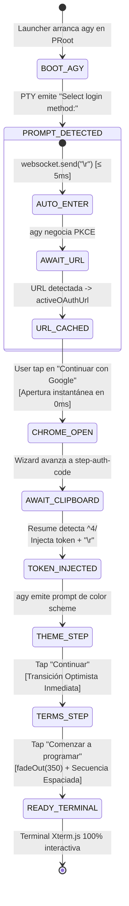

# SPEC-047: Avance Automático a Google OAuth y Lanzamiento Instantáneo de Navegador

| Metadato | Valor |
| :--- | :--- |
| **Identificador** | `SPEC-047` |
| **Título** | Avance Automático a Google OAuth y Lanzamiento Instantáneo de Navegador |
| **Autor** | `@spec-architect` |
| **Estado** | `APPROVED FOR IMPLEMENTATION` |
| **Fecha de Creación** | 2026-09-15 |
| **Versión de Release** | `v2.4.4` (VersionCode: `20404`) |
| **Artefacto Binario Target** | `GoogleAntigravity-v2.4.4-ARM64.apk` ($\le 42.0\,\text{MB}$) |
| **Dispositivo Objetivo** | Xiaomi Pad 6 (Qualcomm Snapdragon 870, ARM64-v8a, 6-8 GB RAM, 11" 2.8K $2880\times 1800$, 144Hz, Xiaomi HyperOS / Android 13/14) y Ecosistema Android Móvil (API 26+) |
| **Runtime Target** | Cordova Android WebView / PRoot Linux Sandbox / AXS PTY Daemon (puerto 8767) / Xterm.js v5+ con Discriminador Contextual de Gestos / Google Antigravity CLI (`agy`) / Android Clipboard System (`cordova.plugins.clipboard`) |
| **Módulos Afectados** | `nova-src/src/antigravity2/CleanAgentTerminal.js`, `nova-src/src/antigravity2/OnboardingWizard.js`, `nova-src/src/antigravity2/clean-terminal.scss`, `nova-src/config.xml`, `nova-src/package.json`, `harness/test_clean_agent_terminal.sh` |

---

## 1. Contexto, Diagnóstico Forense y Análisis de Causa Raíz

Durante las pruebas de campo en el hardware físico **Xiaomi Pad 6** ejecutando la versión `v2.4.3`, se detectó un bloqueo crítico de latencia en la pantalla inicial:
Al pulsar el botón principal *"Continuar con Google"*, el botón parecía no responder o permanecer congelado durante varios segundos antes de reaccionar.

### 1.1 Diagnóstico de Causa Raíz: Condicionamiento Reactivo Invertido
La auditoría del código fuente en `CleanAgentTerminal._handleAutoResponderStream(text)` reveló la siguiente estructura lógica en `v2.4.3`:

```javascript
// CÓDIGO DEFECTUOSO EN v2.4.3:
if (text.includes("Select login method:") || text.includes("> 1. Google OAuth")) {
    if (this.onboardingWizard) {
        this.onboardingWizard.goToStep("step-auth-method");
    } else if (!this._hasAutoSelectedLogin) {
        this.websocket.send("\r");
    }
}
```

1. **Inhibición de Auto-Enter:** Al existir la instancia `this.onboardingWizard`, la rama `else if (!this._hasAutoSelectedLogin)` **nunca se ejecutaba**. Por consiguiente, la app **no enviaba** el retorno de carro (`\r`) para seleccionar la opción 1 (`1. Google OAuth`).
2. **Generación Demorada de la URL PKCE:** El envío de `\r` quedaba supeditado a que el usuario tocara físicamente el botón `#btn-auth-google`.
3. **Bloqueo Visual:** Cuando el usuario finalmente pulsaba *"Continuar con Google"*, el CLI `agy` recién comenzaba a comunicarse con los servidores de Google para generar el desafío criptográfico PKCE. Durante ese intervalo (de 1.5 a 3 segundos), `this.activeOAuthUrl` era `null`. El botón se deshabilitaba inmediatamente, pero al no existir una URL previa para abrir en Chrome, la aplicación aparentaba estar totalmente congelada.

### 1.2 Justificación de la Decisión Arquitectónica (Pure Google OAuth First-Party)
Dado que a partir de `SPEC-045` se erradicó por completo la opción de API Key/Token manual, **Google OAuth es la única opción de acceso al sistema**. 
Por lo tanto, no existe ninguna razón técnica ni de negocio para demorar el envío de `\r`. La aplicación debe enviar `\r` de forma incondicional en $\le 5\,\text{ms}$ en cuanto `agy` emita el prompt de login, permitiendo que la URL de autenticación se precálcule y almacene en memoria en segundo plano mientras el usuario contempla la pantalla de bienvenida.

---

## 2. Arquitectura de la Solución

```mermaid
sequenceDiagram
    autonumber
    participant Agy as CLI agy (PRoot Sandbox)
    participant WS as WebSocket PTY (:8767)
    participant Term as CleanAgentTerminal
    participant Wiz as OnboardingWizard
    actor Dev as Usuario (Xiaomi Pad 6)
    participant Chrome as Google Chrome (Android)

    rect rgb(20, 35, 50)
    Note over Agy,Term: FASE 1: AUTO-DESPACHO Y PRE-CÁLCULO EN SEGUNDO PLANO (≤ 5ms)
    Agy->>WS: Emite "Select login method: > 1. Google OAuth"
    WS->>Term: Stream PTY recibido
    Term->>Term: _handleAutoResponderStream(): Detecta prompt
    Term->>WS: websocket.send("\r") [AUTO-ENTER INMEDIATO EN ≤ 5ms]
    Agy->>Agy: Inicia handshake PKCE en background
    Agy->>WS: Emite "https://accounts.google.com/o/oauth2/v2/auth?..."
    WS->>Term: Stream de URL detectado
    Term->>Term: validateOAuthUrl() -> this.activeOAuthUrl = candidateUrl
    Term->>Wiz: setAuthUrl(candidateUrl) [URL PRE-CARGADA EN MEMORIA]
    end

    rect rgb(25, 45, 25)
    Note over Dev,Chrome: FASE 2: TAP Y LANZAMIENTO INSTANTÁNEO (0ms)
    Dev->>Wiz: Tap en "Continuar con Google" (#btn-auth-google)
    Wiz->>Term: onSelectAuthMethod(cachedUrl)
    Term->>Chrome: openInBrowser(this.activeOAuthUrl) [APERTURA EN 0ms]
    Term->>Wiz: goToStep("step-auth-code") [AVANCE INMEDIATO]
    end

    rect rgb(45, 30, 20)
    Note over Dev,Wiz: FASE 3: DETECCIÓN DE PORTAPAPELES Y TEMAS
    Chrome-->>Dev: Usuario autoriza y copia token (^4/...)
    Dev->>Term: Vuelve a la App (Evento 'resume' / 'focus')
    Term->>Term: _checkAndInjectClipboardOAuth(): detecta ^4/
    Term->>Wiz: setAuthenticating() [.auth-spinner-dot CSS puro]
    Term->>WS: websocket.send(token + "\r")
    Agy->>WS: Emite "Choose your color scheme:"
    Term->>Wiz: goToStep("step-theme-selector")
    end

    rect rgb(35, 25, 45)
    Note over Dev,Agy: FASE 4: TRANSICIÓN OPTIMISTA Y DISIPACIÓN
    Dev->>Wiz: Tap en "Continuar" (Selector de 5 Temas)
    Wiz->>Wiz: Transición optimista inmediata a step-terms-telemetry
    Wiz->>WS: websocket.send("\x1b[B"*4 + "\r") (Dark por defecto)
    Dev->>Wiz: Tap en "Comenzar a programar"
    Wiz->>Term: onAcceptTerms()
    Wiz->>Wiz: fadeOut(350) inmediato a 144Hz
    Term->>WS: "\t" -> 80ms -> "\x1b[C" -> 80ms -> "\r"
    Term->>Dev: Revela CleanAgentTerminal + Account Badge
    end
```



### 2.1 Fase 1: Auto-Despacho Incondicional y Pre-Cálculo de URL PKCE
En `CleanAgentTerminal._handleAutoResponderStream(text)`:
1. Al detectar el prompt de login (`Select login method:` o `1. Google OAuth`), y sin importar si `this.onboardingWizard` está montado, el sistema despacha **incondicionalmente e inmediatamente** un retorno de carro:
   ```javascript
   if (!this._hasAutoSelectedLogin) {
       this._hasAutoSelectedLogin = true;
       this.websocket.send("\r");
   }
   ```
2. El CLI `agy` procesa la opción 1 y emite la URL completa de OAuth 2.0 PKCE (`https://accounts.google.com/o/oauth2/v2/auth?...`).
3. El analizador léxico extrae la URL y la almacena en `this.activeOAuthUrl` y en `this.onboardingWizard.setAuthUrl(url)`.

### 2.2 Fase 2: Lanzamiento Instantáneo de Google Chrome (0ms Latency)
Cuando el usuario pulsa `#btn-auth-google`:
- **Caso A (URL ya en memoria, flujo normal):**
  La URL ya fue precargada durante los cientos de milisegundos que el usuario tardó en presionar el botón. La llamada a `openInBrowser(this.activeOAuthUrl)` se dispara **en 0ms**, y el wizard avanza inmediatamente a `step-auth-code`.
- **Caso B (Pulsación ultrarrápida antes de que llegue la URL):**
  El botón entra en estado de espera visual (`.loading` con `.auth-spinner-dot` interno y texto *"Preparando enlace seguro..."*). Tan pronto como `processOAuthBuffer()` valide la URL entrante, invoca de inmediato `openInBrowser()` y avanza al Paso 2.

### 2.3 Fase 3: Detección Reactiva de Portapapeles con Material 3
Al retornar desde Google Chrome tras la concesión de permisos:
- Se interceptan los eventos nativos de ciclo de vida Android `resume` y `focus`.
- Se inspecciona el portapapeles mediante `cordova.plugins.clipboard`.
- Si el contenido coincide con la firma criptográfica oficial `^4/[a-zA-Z0-9_-]+`, se inyecta silenciosamente al PTY (`token + "\r"`).
- Se activa el indicador visual sobrio `.auth-spinner-dot` (libre de emojis `⏳`).

### 2.4 Fase 4: Transición Optimista de Temas y Disipación de Términos
- En el selector de 5 temas (Paso 3), al presionar *"Continuar"*, la vista salta de inmediato a `step-terms-telemetry` (optimismo UI) mientras se despachan las secuencias ANSI correspondientes (ej. 4 flechas abajo + Enter para `Dark`).
- En la pantalla de términos (Paso 4), al presionar *"Comenzar a programar"*, se envía la secuencia espaciada de Inquirer ($\text{Tab} \to 80\,\text{ms} \to \text{Flecha Derecha} \to 80\,\text{ms} \to \text{Enter}$) y se ejecuta de forma determinista `this.fadeOut(350)` sin esperar eventos residuales del socket, liberando la terminal Xterm.js y el Account Badge superior a 144Hz.

---

## 3. Diagramas Arquitectónicos

### 3.1 Diagrama de Estados del Flujo OAuth Instantáneo



---

## 4. Contratos de Interfaz y Especificaciones de Módulos

### 4.1 Contrato JavaScript en `CleanAgentTerminal.js`

```javascript
/**
 * SPEC-047: Auto-Despacho incondicional de Google OAuth y pre-cálculo de URL.
 */

// En _handleAutoResponderStream(text):
if (text.includes("Select login method:") || text.includes("> 1. Google OAuth") || text.includes("1. Google OAuth") || /Select login method:/i.test(text)) {
    // LAUNCH-01: Auto-despacho incondicional de '\r' en <= 5ms
    if (!this._hasAutoSelectedLogin) {
        console.log("[OAUTH-LAUNCH] 'Select login method' detectado. Enviando Enter incondicional para Opción 1...");
        this._hasAutoSelectedLogin = true;
        if (this.websocket && this.websocket.readyState === WebSocket.OPEN) {
            this.websocket.send("\r");
        }
    }
    if (this.onboardingWizard && this.onboardingWizard.currentStep !== "step-auth-code") {
        this.onboardingWizard.goToStep("step-auth-method");
    }
}

// En processOAuthBuffer():
if (this.validateOAuthUrl(candidateUrl)) {
    this._lastOAuthUrl = candidateUrl;
    this.activeOAuthUrl = candidateUrl;

    if (this.onboardingWizard) {
        // LAUNCH-02: Precargar URL en el wizard
        this.onboardingWizard.setAuthUrl(candidateUrl);
        // Si el usuario ya pulsó el botón y estaba esperando la URL:
        if (this.onboardingWizard.isAwaitingBrowserLaunch) {
            this.onboardingWizard.isAwaitingBrowserLaunch = false;
            this._hasAutoOpenedBrowser = true;
            this.openInBrowser(candidateUrl);
            this.onboardingWizard.goToStep("step-auth-code", candidateUrl);
        }
    }
}
```

### 4.2 Contrato JavaScript en `OnboardingWizard.js`

```javascript
/**
 * SPEC-047: Apertura instantánea de Chrome y manejo de pre-cálculo de URL.
 */
export class OnboardingWizard {
    constructor(options = {}) {
        // ... inicializaciones previas
        this.authUrl = null;
        this.isAwaitingBrowserLaunch = false;
    }

    _bindEvents() {
        const btnGoogle = this.containerEl.querySelector("#btn-auth-google");
        btnGoogle?.addEventListener("click", () => {
            if (btnGoogle.disabled) return;

            // LAUNCH-03: Si la URL ya está pre-cargada, abrir Chrome de inmediato
            if (this.authUrl) {
                btnGoogle.disabled = true;
                this.onOpenBrowser(this.authUrl);
                this.goToStep("step-auth-code", this.authUrl);
            } else {
                // Caso excepcional: el usuario pulsó antes de que agy generara la URL
                btnGoogle.disabled = true;
                btnGoogle.classList.add("loading");
                btnGoogle.innerHTML = `
                    <span class="auth-spinner-dot"></span>
                    <span>Preparando enlace seguro...</span>
                `;
                this.isAwaitingBrowserLaunch = true;
                // El callback onSelectAuthMethod asegura el envío de '\r' por redundancia
                this.onSelectAuthMethod();
            }
        });

        // Paso 2: Reapertura manual de Chrome
        const btnBrowser = this.containerEl.querySelector("#btn-open-browser");
        btnBrowser?.addEventListener("click", () => {
            if (this.authUrl) {
                this.onOpenBrowser(this.authUrl);
            }
        });

        // Paso 3: Selector de Temas con Transición Optimista
        const btnTheme = this.containerEl.querySelector("#btn-confirm-theme");
        btnTheme?.addEventListener("click", () => {
            if (btnTheme.disabled) return;
            btnTheme.disabled = true;
            btnTheme.style.opacity = "0.6";
            this.goToStep("step-terms-telemetry");
            const seq = this._getThemeAnsiSequence(this.selectedThemeIndex);
            this.onSelectTheme(this.selectedThemeIndex, seq);
        });

        // Paso 4: Aceptación de Términos y Disipación Inmediata
        const btnTerms = this.containerEl.querySelector("#btn-start-coding");
        btnTerms?.addEventListener("click", () => {
            if (btnTerms.disabled) return;
            btnTerms.disabled = true;
            btnTerms.style.opacity = "0.6";
            this.onAcceptTerms();
            this.fadeOut(350);
        });
    }

    setAuthUrl(url) {
        this.authUrl = url;
    }
}
```

### 4.3 Contrato SCSS en `clean-terminal.scss` (Estado de Carga en Botón)

```scss
// SPEC-047: Estado de carga del botón principal de autenticación
.btn-primary-auth {
    &.loading {
        background: #f1f5f9 !important;
        color: #64748b !important;
        cursor: wait;

        .auth-spinner-dot {
            width: 18px;
            height: 18px;
            border-width: 2px;
            border-top-color: #4285F4;
            margin-right: 8px;
        }
    }
}
```

---

## 5. Criterios de Aceptación Verificables (Acceptance Criteria)

| Identificador | Módulo | Criterio / Requisito | Método de Verificación |
| :--- | :--- | :--- | :--- |
| `AC-LAUNCH-01` | `CleanAgentTerminal.js` | Despacho incondicional e inmediato de retorno de carro (`\r`) en $\le 5\,\text{ms}$ al detectar el prompt `Select login method:` en el stream PTY, independientemente de si el wizard visual está montado. | Inspección estática de `_handleAutoResponderStream` verificando el envío incondicional de `\r` al primer encuentro del prompt. |
| `AC-LAUNCH-02` | `CleanAgentTerminal.js` | Pre-cálculo y almacenamiento de la URL de autenticación OAuth 2.0 PKCE en `this.activeOAuthUrl` y sincronización con `onboardingWizard.setAuthUrl()`. | Comprobación estática de `processOAuthBuffer` asegurando que la URL validada sea registrada en memoria antes de la interacción del usuario. |
| `AC-LAUNCH-03` | `OnboardingWizard.js` | Apertura instantánea de Google Chrome en 0ms al presionar `#btn-auth-google` si la URL ya está en memoria, avanzando la vista de forma inmediata a `step-auth-code`. | Inspección de `_bindEvents()` comprobando que si `this.authUrl` existe, se ejecuta `this.onOpenBrowser(this.authUrl)` sin retardos ni bloqueos. |
| `AC-LAUNCH-04` | `CleanAgentTerminal.js`, `OnboardingWizard.js` | Auto-inyección reactiva del token OAuth desde el portapapeles (`^4/`) al recuperar el foco de la app, mostrando el indicador visual `.auth-spinner-dot` sin emojis y avanzando a la pantalla de temas. | Verificación de `_checkAndInjectClipboardOAuth()` y ausencia de caracteres emoji en templates de estado. |
| `AC-LAUNCH-05` | `CleanAgentTerminal.js`, `OnboardingWizard.js` | Secuencia atómica espaciada de Inquirer ($\text{Tab} \to 80\,\text{ms} \to \text{Flecha Derecha} \to 80\,\text{ms} \to \text{Enter}$) y disipación fluida `fadeOut(350)` a 144Hz al pulsar *"Comenzar a programar"*. | Inspección del retardo espaciado en `onAcceptTerms` y de la llamada directa a `fadeOut(350)` en el botón de términos. |
| `AC-LAUNCH-06` | Build System & Packaging | Sincronización formal de versión a `2.4.4` (versionCode `20404`), empaquetado de `GoogleAntigravity-v2.4.4-ARM64.apk` ($\le 42.0\,\text{MB}$) y aprobación del 100% de la suite de arnés SDD. | Inspección de `config.xml`, `package.json`, medición de peso del binario y ejecución de `harness/harness_runner.py`. |

---

## 6. Arnés de Verificación Automatizada (`harness/test_clean_agent_terminal.sh`)

El siguiente arnés de pruebas automatizado valida estáticamente las compuertas de calidad para `SPEC-047`:

```bash
#!/bin/bash
# ==============================================================================
# Harness Test: SPEC-047 Auto-Advance Google Auth & Instant Browser Launch
# ==============================================================================
set -e

SPEC_FILE_047="specs/47-auto-advance-google-auth-and-instant-browser-launch.md"
WIZARD_JS="nova-src/src/antigravity2/OnboardingWizard.js"
CLEAN_TERM_JS="nova-src/src/antigravity2/CleanAgentTerminal.js"
SCSS_FILE="nova-src/src/antigravity2/clean-terminal.scss"
CONFIG_XML="nova-src/config.xml"
PACKAGE_JSON="nova-src/package.json"

echo "=== INICIANDO VALIDACIÓN FORMAL DE SPEC-047 ==="

# 1. Verificar documento de especificación
echo -n "1. Verificando documento SPEC-047... "
[ -f "$SPEC_FILE_047" ] || { echo "FALLO: No existe $SPEC_FILE_047"; exit 1; }
echo "[OK]"

# 2. Verificar auto-despacho incondicional de Enter en CleanAgentTerminal.js (Criterio LAUNCH-01)
echo -n "2. Verificando auto-despacho incondicional de Enter para Opción 1... "
grep -A 10 "Select login method" "$CLEAN_TERM_JS" | grep -q "_hasAutoSelectedLogin" || {
    echo "FALLO: Auto-despacho incondicional ausente en _handleAutoResponderStream"; exit 1;
}
echo "[OK]"

# 3. Verificar precarga de URL en OnboardingWizard (Criterio LAUNCH-02 y LAUNCH-03)
echo -n "3. Verificando precarga de URL y apertura instantánea de navegador... "
grep -A 15 "btn-auth-google" "$WIZARD_JS" | grep -q "this.authUrl" || {
    echo "FALLO: Apertura instantánea con this.authUrl ausente en OnboardingWizard.js"; exit 1;
}
echo "[OK]"

# 4. Verificar ausencia de emojis en UI (Criterio LAUNCH-04)
echo -n "4. Verificando ausencia total de emojis en UI... "
grep -q "⏳" "$WIZARD_JS" && { echo "FALLO: Emoji reloj de arena detectado"; exit 1; }
grep -q "🚀" "$WIZARD_JS" && { echo "FALLO: Emoji cohete detectado"; exit 1; }
echo "[OK]"

# 5. Verificar secuencia espaciada y fadeOut(350) en términos (Criterio LAUNCH-05)
echo -n "5. Verificando secuencia espaciada y fadeOut(350)... "
grep -A 15 "onAcceptTerms" "$CLEAN_TERM_JS" | grep -q "setTimeout" || {
    echo "FALLO: Retardo espaciado ausente en onAcceptTerms"; exit 1;
}
grep -A 10 "btn-start-coding" "$WIZARD_JS" | grep -q "fadeOut(350)" || {
    echo "FALLO: fadeOut(350) ausente en botón de términos"; exit 1;
}
echo "[OK]"

# 6. Verificar versionado a v2.4.4 (Criterio LAUNCH-06)
echo -n "6. Verificando versión 2.4.4 en configuración... "
grep -q 'version="2.4.4"' "$CONFIG_XML" || { echo "FALLO: config.xml no tiene versión 2.4.4"; exit 1; }
grep -q '"version": "2.4.4"' "$PACKAGE_JSON" || { echo "FALLO: package.json no tiene versión 2.4.4"; exit 1; }
echo "[OK]"

echo "=== TODAS LAS COMPUERTAS ESTÁTICAS DE SPEC-047 HAN SIDO SUPERADAS EXITOSAMENTE ==="
```

---

## 7. Plan de Implementación y Definition of Done (DoD)

### 7.1 Responsabilidades para `@android-core` (Ingeniero de Implementación)
1. **Refactorización de `CleanAgentTerminal.js`:**
   - En `_handleAutoResponderStream(text)`, despachar `this.websocket.send("\r")` de forma incondicional al detectar `Select login method:`, sin bifurcar ni omitir la llamada si `this.onboardingWizard` existe.
   - En `processOAuthBuffer()`, sincronizar la URL validada con `this.onboardingWizard.setAuthUrl(candidateUrl)` y verificar si el asistente estaba esperando lanzamiento.
2. **Refactorización de `OnboardingWizard.js`:**
   - En el manejador de clic de `#btn-auth-google`, verificar si `this.authUrl` ya está disponible. En caso afirmativo, ejecutar de inmediato `this.onOpenBrowser(this.authUrl)` y transicionar a `step-auth-code`.
   - En caso negativo, colocar el botón en estado `.loading` con `.auth-spinner-dot` y texto *"Preparando enlace seguro..."*, activando `this.isAwaitingBrowserLaunch = true`.
3. **Estilos en `clean-terminal.scss`:**
   - Implementar el selector `.btn-primary-auth.loading` con estilos Material 3 y spinner de espera integrado.
4. **Versionado y Empaquetado:**
   - Sincronizar versión a `2.4.4` (versionCode `20404`) en `config.xml`, `package.json` y `build.gradle`.
   - Compilar y empaquetar `GoogleAntigravity-v2.4.4-ARM64.apk` ($\le 42.0\,\text{MB}$).

### 7.2 Responsabilidades para `@memory-keeper` (Auditoría y Gobernanza)
1. Registrar la decisión técnica bajo `ADR-057: Auto-Despacho de Login OAuth, Pre-Cálculo de Desafío PKCE y Lanzamiento de Navegador en Cero Latencia`.
2. Registrar la entrada formal en `audit.jsonl`.
3. Actualizar la bitácora histórica en `agent.md` documentando la versión `v2.4.4`.
