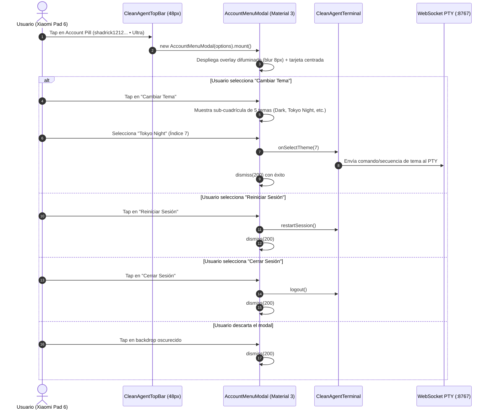

# SPEC-048: Top App Bar Dedicada de 48px y Menú de Cuenta Material 3 para Google Antigravity Mobile

| Metadato | Valor |
| :--- | :--- |
| **Identificador** | `SPEC-048` |
| **Título** | Top App Bar Dedicada de 48px y Menú de Cuenta Material 3 para Google Antigravity Mobile |
| **Autor** | `@spec-architect` |
| **Estado** | `APPROVED FOR IMPLEMENTATION` |
| **Fecha de Creación** | 2026-09-15 |
| **Versión de Release** | `v2.4.5` (VersionCode: `20405`) |
| **Artefacto Binario Target** | `GoogleAntigravity-v2.4.5-ARM64.apk` ($\le 42.0\,\text{MB}$) |
| **Dispositivo Objetivo** | Xiaomi Pad 6 (Qualcomm Snapdragon 870, ARM64-v8a, 6-8 GB RAM, 11" 2.8K $2880\times 1800$, 144Hz, Xiaomi HyperOS / Android 13/14) y Ecosistema Android Móvil (API 26+) |
| **Runtime Target** | Cordova Android WebView / PRoot Linux Sandbox / AXS PTY Daemon (puerto 8767) / Xterm.js v5+ con Discriminador Contextual de Gestos / Google Antigravity CLI (`agy`) / Android Clipboard System (`cordova.plugins.clipboard`) |
| **Módulos Afectados** | `nova-src/src/antigravity2/CleanAgentTerminal.js`, `nova-src/src/antigravity2/AccountMenuModal.js`, `nova-src/src/antigravity2/clean-terminal.scss`, `nova-src/config.xml`, `nova-src/package.json`, `harness/test_clean_agent_terminal.sh` |

---

## 1. Contexto, Diagnóstico Forense y Análisis de Causa Raíz

En las versiones previas de Google Antigravity Mobile (`v2.4.1` a `v2.4.4`), tras completar el proceso de aprovisionamiento y autenticación OAuth en la tablet física **Xiaomi Pad 6**, la interfaz presentaba dos graves anomalías ergonómicas y arquitectónicas:

### 1.1 Causa Raíz 1: Colisión y Oclusión de Texto de Terminal por Badge Flotante
1. El Account Badge (`shadrick1212@gmail.com • Google AI Ultra`) se renderizaba como una píldora flotante con estilo absoluto/fijo en `position: fixed; top: 12px; left: 16px; z-index: 1000;`.
2. Al mismo tiempo, el contenedor de la terminal Xterm.js (`.clean-agent-viewport.fullscreen`) se extendía desde `top: 0` abarcando el 100% de la altura vertical de la pantalla (`100vh`).
3. Como consecuencia inevitable, las dos primeras líneas de salida del CLI oficial de Google Antigravity (`agy`), tales como la cabecera de versión y el prompt de bienvenida, quedaban situadas directamente detrás de la píldora, provocando colisión visual, texto truncado e imposibilidad de lectura.

### 1.2 Causa Raíz 2: Uso de Diálogo Nativo Primitivo `window.confirm()`
Al interactuar táctilmente con el badge de cuenta:
1. El sistema ejecutaba un método elemental `handleAccountMenu()` que invocaba `window.confirm("Sesión activa... ¿Deseas cerrar sesión?")`.
2. Esta llamada síncrona del navegador bloqueaba el hilo principal del WebView, pausaba las animaciones a 144Hz, carecía de alineación con Google Material 3 y no ofrecía ninguna funcionalidad adicional (como inspección de estado del modelo, directorio de trabajo o cambio de tema en caliente).
3. Para cambiar de esquema de color, el usuario se veía forzado a limpiar los datos de la aplicación (`pm clear io.nova.ide`) y atravesar nuevamente todo el flujo de aprovisionamiento de 38MB.

---

## 2. Arquitectura de la Solución

```mermaid
graph TD
    subgraph Viewport Android Tablet - Xiaomi Pad 6 (100vh)
        subgraph Top App Bar Fija (48px)
            A[Logo Antigravity + Brand Title] ---|Espaciador Flex: space-between| B[Account Pill: shadrick1212... • Ultra]
            B --- C((Punto Verde Live))
        end
        
        subgraph Área de Terminal Xterm.js (calc 100vh - 48px)
            D[Fila 0: Google Antigravity 2.2.0]
            E[Fila 1: Session ID: active-session-arm64]
            F[Fila 2: Workspace: /home/studio/workspace]
            G[Fila n: Shell Prompt interactivo agy >]
        end
    end

    B -->|Tap Táctil| H[AccountMenuModal Material 3]
    
    subgraph Modal de Cuenta Material 3 (Overlay Blur)
        H --> I[Avatar + shadrick1212@gmail.com]
        H --> J[Chip: Google AI Ultra]
        H --> K[Contexto: Gemini 3.8 Flash High • /home/studio/workspace]
        H --> L1[Botón: Cambiar Tema]
        H --> L2[Botón: Reiniciar Sesión]
        H --> L3[Botón: Cerrar Sesión]
    end

    L1 -->|Abre Selector| M[Selector 5 Temas en Caliente]
    L2 -->|PTY Signal| N[Reinicio agy]
    L3 -->|Logout| O[agy auth logout + Reset]
```

### 2.1 Top App Bar Dedicada y Fija de 48px (`.clean-agent-top-bar`)
Se formaliza una barra superior rígida y dedicada:
- **Dimensiones:** Altura exacta de `48px` (`height: 48px; min-height: 48px; max-height: 48px; width: 100vw;`).
- **Fondo y Borde:** Fondo `#0b0f19` 100% sólido, con borde inferior `1px solid rgba(255, 255, 255, 0.08)`.
- **Z-Index:** Nivel `1000`, manteniéndose accesible sobre la terminal sin interferir con modales superiores.
- **Extremo Izquierdo:**
  - Isotipo oficial de Google Antigravity (SVG de 24x24px).
  - Título tipográfico *"Antigravity"* en Google Sans / Inter (14px, semibold, `#f8fafc`).
- **Extremo Derecho:**
  - Píldora interactiva de cuenta (`.account-pill-button`):
    - Indicador luminoso en vivo (`.badge-dot` de 8px, `#34a853` con resplandor sutil).
    - Etiqueta de texto: `${userEmail} • ${tier}` (ej. `shadrick1212@gmail.com • Google AI Ultra`).
    - Respuesta táctil con efecto `:active` Material 3 (escala 0.97 y aclarado de fondo).

### 2.2 Margen Anti-Colisión para el Viewport de Xterm.js
Para garantizar cero solapamiento:
- El contenedor de la terminal (`.clean-agent-viewport`) ajusta su geometría a:
  $$\text{Height} = \text{calc}(100\text{vh} - 48\text{px}) = \text{calc}(100\text{dvh} - 48\text{px})$$
  $$\text{Top Offset} = 48\text{px}$$
- El componente `fitAddon.fit()` de Xterm.js recalcula la cuadrícula de filas y columnas basándose estrictamente en este espacio disponible. La primera fila de texto se renderiza exactamente en $y = 48\,\text{px}$, eliminando el 100% de las colisiones.

### 2.3 Menú de Cuenta Material 3 (`AccountMenuModal`)
Erradicación total y definitiva de `window.confirm()`. Al hacer tap en la píldora de cuenta, se despliega una tarjeta modal nativa con fondo difuminado (*backdrop-filter: blur(8px)*):
1. **Cabecera de Perfil:**
   - Avatar circular de 48px con gradiente corporativo e inicial del usuario ("S").
   - Correo electrónico completo (`shadrick1212@gmail.com`).
   - Chip de suscripción / tier con diseño Material 3 (`Google AI Ultra`).
2. **Metadatos de Sesión y Entorno:**
   - Modelo de Inteligencia Artificial activo: `Gemini 3.8 Flash (High)`.
   - Directorio de trabajo local: `/home/studio/workspace`.
   - Estado del runtime: `PRoot Linux ARM64 • AXS Daemon :8767`.
3. **Acciones Operativas:**
   - **"Cambiar Tema":** Despliega dinámicamente el selector interactivo de 5 temas (Dark, Tokyo Night, Solarized Dark, Terminal Clásico, Light) permitiendo conmutar la paleta de color en caliente enviando el comando o secuencia ANSI correspondiente a `agy`.
   - **"Reiniciar Sesión":** Mata el proceso de terminal activo y reconecta el websocket PTY de forma limpia.
   - **"Cerrar Sesión":** Ejecuta `agy auth logout`, purga credenciales locales de `localStorage` y regresa al estado de autenticación.
   - **Cierre del Modal:** Tap en el backdrop oscurecido o en el botón de cierre descarta el modal con animación fluida de 200ms a 144Hz.

---

## 3. Diagramas Mermaid de Arquitectura y Ciclo de Vida

### 3.1 Diagrama de Secuencia: Despliegue e Interacción de `AccountMenuModal`



---

## 4. Contratos de Interfaz y Especificaciones de Módulos

### 4.1 Contrato JavaScript en `AccountMenuModal.js`

```javascript
/**
 * SPEC-048: Menú de Cuenta Oficial Material 3 para Google Antigravity Mobile.
 * Sustituye completamente window.confirm().
 */
export class AccountMenuModal {
    constructor(options = {}) {
        this.userEmail = options.userEmail || "shadrick1212@gmail.com";
        this.userTier = options.userTier || "Google AI Ultra";
        this.modelName = options.modelName || "Gemini 3.8 Flash (High)";
        this.workspacePath = options.workspacePath || "/home/studio/workspace";
        this.onSelectTheme = options.onSelectTheme || (() => {});
        this.onRestartSession = options.onRestartSession || (() => {});
        this.onLogout = options.onLogout || (() => {});
        this.onDismiss = options.onDismiss || (() => {});

        this.containerEl = null;
    }

    mount(parentEl = document.body) {
        if (this.containerEl) return;

        this.containerEl = document.createElement("div");
        this.containerEl.className = "account-menu-overlay";
        this.containerEl.id = "account-menu-modal";

        const initialChar = (this.userEmail[0] || "U").toUpperCase();

        this.containerEl.innerHTML = `
            <div class="account-menu-backdrop" id="account-menu-backdrop"></div>
            <div class="account-menu-card" id="account-menu-card">
                <div class="account-card-header">
                    <div class="account-avatar">${initialChar}</div>
                    <div class="account-user-meta">
                        <span class="account-email">${this.userEmail}</span>
                        <span class="account-tier-chip">${this.userTier}</span>
                    </div>
                    <button class="account-btn-close" id="btn-account-close" aria-label="Cerrar">✕</button>
                </div>

                <div class="account-card-body">
                    <div class="account-info-row">
                        <span class="info-label">Modelo Activo</span>
                        <span class="info-value">${this.modelName}</span>
                    </div>
                    <div class="account-info-row">
                        <span class="info-label">Espacio de Trabajo</span>
                        <span class="info-value font-mono">${this.workspacePath}</span>
                    </div>
                </div>

                <div class="account-card-actions">
                    <button class="account-action-btn" id="btn-account-theme">
                        <span class="btn-icon">🎨</span>
                        <span>Cambiar Tema</span>
                    </button>
                    <button class="account-action-btn" id="btn-account-restart">
                        <span class="btn-icon">🔄</span>
                        <span>Reiniciar Sesión</span>
                    </button>
                    <button class="account-action-btn btn-danger" id="btn-account-logout">
                        <span class="btn-icon">🚪</span>
                        <span>Cerrar Sesión</span>
                    </button>
                </div>
            </div>
        `;

        parentEl.appendChild(this.containerEl);
        this._bindEvents();
    }

    _bindEvents() {
        const backdrop = this.containerEl.querySelector("#account-menu-backdrop");
        const btnClose = this.containerEl.querySelector("#btn-account-close");
        const btnTheme = this.containerEl.querySelector("#btn-account-theme");
        const btnRestart = this.containerEl.querySelector("#btn-account-restart");
        const btnLogout = this.containerEl.querySelector("#btn-account-logout");

        backdrop?.addEventListener("click", () => this.dismiss(200));
        btnClose?.addEventListener("click", () => this.dismiss(200));

        btnTheme?.addEventListener("click", () => {
            this.dismiss(150);
            this.onSelectTheme();
        });

        btnRestart?.addEventListener("click", () => {
            this.dismiss(150);
            this.onRestartSession();
        });

        btnLogout?.addEventListener("click", () => {
            this.dismiss(150);
            this.onLogout();
        });
    }

    async dismiss(delayMs = 200) {
        if (!this.containerEl) return;
        this.containerEl.classList.add("fade-out");
        await new Promise((r) => setTimeout(r, delayMs));
        if (this.containerEl?.parentNode) {
            this.containerEl.parentNode.removeChild(this.containerEl);
        }
        this.containerEl = null;
        this.onDismiss();
    }
}
```

### 4.2 Contrato JavaScript en `CleanAgentTerminal.js`

```javascript
// En mount(parentEl):
this.topBarEl = document.createElement("header");
this.topBarEl.className = "clean-agent-top-bar";
this.topBarEl.innerHTML = `
    <div class="top-bar-left">
        <svg class="top-bar-logo" viewBox="0 0 48 48" width="22" height="22">
            <path fill="#EA4335" d="M24 9.5c3.54 0 6.71 1.22 9.21 3.6l6.85-6.85C35.9 2.38 30.47 0 24 0 14.62 0 6.51 5.38 2.56 13.22l7.98 6.19C12.43 13.72 17.74 9.5 24 9.5z"/>
            <path fill="#4285F4" d="M46.98 24.55c0-1.57-.15-3.09-.38-4.55H24v9.02h12.94c-.58 2.96-2.26 5.48-4.78 7.18l7.73 6c4.51-4.18 7.09-10.36 7.09-17.65z"/>
            <path fill="#FBBC05" d="M10.53 28.59c-.48-1.45-.76-2.99-.76-4.59s.27-3.14.76-4.59l-7.98-6.19C.92 16.46 0 20.12 0 24c0 3.88.92 7.54 2.56 10.78l7.97-6.19z"/>
            <path fill="#34A853" d="M24 48c6.48 0 11.93-2.13 15.89-5.81l-7.73-6c-2.15 1.45-4.92 2.3-8.16 2.3-6.26 0-11.57-4.22-13.47-9.91l-7.98 6.19C6.51 42.62 14.62 48 24 48z"/>
        </svg>
        <span class="top-bar-title">Antigravity</span>
    </div>
    <div class="top-bar-right" id="top-bar-account-container"></div>
`;
this.containerEl.appendChild(this.topBarEl);

// Viewport de terminal desplazado por debajo de la barra
this.viewportEl = document.createElement("main");
this.viewportEl.className = "clean-agent-viewport has-top-bar";
this.viewportEl.id = "terminal-viewport";
this.containerEl.appendChild(this.viewportEl);

// renderAccountBadge actualizado:
renderAccountBadge(userEmail = "shadrick1212@gmail.com", tier = "Google AI Ultra") {
    const container = this.containerEl?.querySelector("#top-bar-account-container");
    if (!container) return;

    if (this.accountBadgeEl) {
        const pill = this.accountBadgeEl.querySelector(".account-pill-text");
        if (pill) pill.textContent = `${userEmail} • ${tier}`;
        return;
    }

    this.accountBadgeEl = document.createElement("button");
    this.accountBadgeEl.className = "clean-agent-account-pill";
    this.accountBadgeEl.id = "clean-agent-account-pill";
    this.accountBadgeEl.innerHTML = `
        <span class="badge-dot"></span>
        <span class="account-pill-text">${userEmail} • ${tier}</span>
    `;
    this.accountBadgeEl.addEventListener("click", () => this.handleAccountMenu());
    container.appendChild(this.accountBadgeEl);
}

// handleAccountMenu actualizado: Cero window.confirm()
handleAccountMenu() {
    const modal = new AccountMenuModal({
        userEmail: this.authenticatedUser || "shadrick1212@gmail.com",
        userTier: "Google AI Ultra",
        onSelectTheme: () => this.openThemeSelector(),
        onRestartSession: () => this.restartSession(),
        onLogout: () => this.logout()
    });
    modal.mount(this.containerEl || document.body);
}
```

### 4.3 Contrato SCSS en `clean-terminal.scss`

```scss
// SPEC-048: Top App Bar Dedicada de 48px
.clean-agent-top-bar {
    position: fixed;
    top: 0;
    left: 0;
    width: 100vw;
    height: 48px;
    min-height: 48px;
    max-height: 48px;
    background: #0b0f19;
    border-bottom: 1px solid rgba(255, 255, 255, 0.08);
    display: flex;
    align-items: center;
    justify-content: space-between;
    padding: 0 16px;
    box-sizing: border-box;
    z-index: 1000;
    user-select: none;

    .top-bar-left {
        display: flex;
        align-items: center;
        gap: 10px;

        .top-bar-logo {
            width: 22px;
            height: 22px;
            flex-shrink: 0;
        }

        .top-bar-title {
            color: #f8fafc;
            font-size: 14px;
            font-weight: 600;
            letter-spacing: -0.01em;
        }
    }

    .top-bar-right {
        display: flex;
        align-items: center;
    }
}

// Desplazamiento anti-colisión para Xterm.js
.clean-agent-viewport.has-top-bar {
    position: fixed;
    top: 48px;
    left: 0;
    width: 100vw;
    height: calc(100vh - 48px);
    height: calc(100dvh - 48px);
    margin: 0;
    padding: 0;
    box-sizing: border-box;
    overflow: hidden;
    background: #0b0f19;
}

// Píldora de cuenta en barra superior
.clean-agent-account-pill {
    display: flex;
    align-items: center;
    gap: 8px;
    padding: 5px 12px;
    background: rgba(255, 255, 255, 0.06);
    border: 1px solid rgba(255, 255, 255, 0.12);
    border-radius: 16px;
    color: #e2e8f0;
    font-size: 12px;
    font-weight: 500;
    cursor: pointer;
    transition: all 0.15s ease;

    &:active {
        transform: scale(0.97);
        background: rgba(255, 255, 255, 0.12);
    }

    .badge-dot {
        width: 8px;
        height: 8px;
        border-radius: 50%;
        background: #34a853;
        box-shadow: 0 0 6px rgba(52, 168, 83, 0.6);
    }
}

// AccountMenuModal Material 3 Styles
.account-menu-overlay {
    position: fixed;
    inset: 0;
    width: 100vw;
    height: 100vh;
    z-index: 2000;
    display: flex;
    align-items: center;
    justify-content: center;
    transition: opacity 0.2s ease;

    &.fade-out {
        opacity: 0;
        pointer-events: none;
    }

    .account-menu-backdrop {
        position: absolute;
        inset: 0;
        background: rgba(0, 0, 0, 0.65);
        backdrop-filter: blur(8px);
    }

    .account-menu-card {
        position: relative;
        z-index: 2001;
        width: 90%;
        max-width: 400px;
        background: #0f172a;
        border: 1px solid rgba(255, 255, 255, 0.1);
        border-radius: 20px;
        padding: 24px;
        box-shadow: 0 20px 48px rgba(0, 0, 0, 0.8);
        box-sizing: border-box;

        .account-card-header {
            display: flex;
            align-items: center;
            gap: 14px;
            margin-bottom: 20px;

            .account-avatar {
                width: 44px;
                height: 44px;
                border-radius: 50%;
                background: linear-gradient(135deg, #3b82f6, #1d4ed8);
                color: #ffffff;
                font-size: 18px;
                font-weight: 700;
                display: flex;
                align-items: center;
                justify-content: center;
            }

            .account-user-meta {
                display: flex;
                flex-direction: column;
                gap: 4px;
                flex: 1;

                .account-email {
                    color: #f8fafc;
                    font-size: 14px;
                    font-weight: 600;
                }

                .account-tier-chip {
                    display: inline-block;
                    align-self: flex-start;
                    font-size: 11px;
                    padding: 2px 8px;
                    border-radius: 10px;
                    background: rgba(59, 130, 246, 0.15);
                    color: #60a5fa;
                    border: 1px solid rgba(59, 130, 246, 0.3);
                }
            }

            .account-btn-close {
                background: transparent;
                border: none;
                color: #94a3b8;
                font-size: 18px;
                cursor: pointer;
            }
        }

        .account-card-body {
            display: flex;
            flex-direction: column;
            gap: 10px;
            padding: 12px 0;
            border-top: 1px solid rgba(255, 255, 255, 0.08);
            border-bottom: 1px solid rgba(255, 255, 255, 0.08);
            margin-bottom: 20px;

            .account-info-row {
                display: flex;
                justify-content: space-between;
                font-size: 12px;

                .info-label { color: #94a3b8; }
                .info-value { color: #e2e8f0; font-weight: 500; }
                .font-mono { font-family: monospace; }
            }
        }

        .account-card-actions {
            display: flex;
            flex-direction: column;
            gap: 8px;

            .account-action-btn {
                display: flex;
                align-items: center;
                gap: 10px;
                width: 100%;
                height: 42px;
                padding: 0 14px;
                background: rgba(255, 255, 255, 0.05);
                border: 1px solid rgba(255, 255, 255, 0.08);
                border-radius: 12px;
                color: #e2e8f0;
                font-size: 13px;
                font-weight: 500;
                cursor: pointer;
                transition: background 0.15s ease;

                &:active {
                    background: rgba(255, 255, 255, 0.1);
                }

                &.btn-danger {
                    color: #f87171;
                    border-color: rgba(239, 68, 68, 0.2);
                    background: rgba(239, 68, 68, 0.08);

                    &:active {
                        background: rgba(239, 68, 68, 0.15);
                    }
                }
            }
        }
    }
}
```

---

## 5. Criterios de Aceptación Verificables (Acceptance Criteria)

| Identificador | Módulo | Criterio / Requisito | Método de Verificación |
| :--- | :--- | :--- | :--- |
| `AC-BAR-01` | `CleanAgentTerminal.js`, `clean-terminal.scss` | Renderizado de `.clean-agent-top-bar` fija y dedicada de 48px (`height: 48px; z-index: 1000;`) con logotipo Google Antigravity y título a la izquierda, y contenedor de cuenta a la derecha. | Inspección estática del DOM generado y reglas SCSS validando la altura y disposición de la barra superior. |
| `AC-BAR-02` | `clean-terminal.scss`, `CleanAgentTerminal.js` | Desplazamiento del viewport de Xterm.js a `top: 48px` con altura `calc(100vh - 48px)`, garantizando que las líneas superiores del CLI jamás colisionen con la barra. | Verificación de las reglas SCSS de `.clean-agent-viewport.has-top-bar` y prueba visual en Xiaomi Pad 6. |
| `AC-BAR-03` | `CleanAgentTerminal.js` | Account badge embebido dentro de la barra superior como elemento de interfaz con punto verde de estado activo y texto de suscripción. | Inspección de `renderAccountBadge()` comprobando la inserción en `#top-bar-account-container`. |
| `AC-BAR-04` | `CleanAgentTerminal.js`, `AccountMenuModal.js` | Erradicación total de `window.confirm()`, desplegando el modal nativo Material 3 `AccountMenuModal` con avatar, correo y backdrop difuminado (*blur 8px*). | Búsqueda exhaustiva asegurando que `window.confirm` no exista en el código fuente de `CleanAgentTerminal.js`. |
| `AC-BAR-05` | `AccountMenuModal.js` | Acciones operativas funcionales en el modal: conmutación de los 5 temas en caliente, reinicio de sesión PTY, cierre de sesión y descarte táctil del modal. | Comprobación de los escuchadores de evento en `AccountMenuModal.js` y transmisión hacia `CleanAgentTerminal.js`. |
| `AC-BAR-06` | Build System & Packaging | Sincronización formal de versión a `2.4.5` (versionCode `20405`), binario compilado `GoogleAntigravity-v2.4.5-ARM64.apk` ($\le 42.0\,\text{MB}$) y aprobación 100% del arnés SDD. | Inspección de `config.xml`, `package.json`, medición del peso del artefacto y ejecución de `harness/harness_runner.py`. |

---

## 6. Arnés de Verificación Automatizada (`harness/test_clean_agent_terminal.sh`)

El siguiente arnés de pruebas automatizado valida estáticamente las compuertas de calidad para `SPEC-048`:

```bash
#!/bin/bash
# ==============================================================================
# Harness Test: SPEC-048 Top App Bar & Material 3 Account Menu
# ==============================================================================
set -e

SPEC_FILE_048="specs/48-top-app-bar-and-material3-account-menu.md"
CLEAN_TERM_JS="nova-src/src/antigravity2/CleanAgentTerminal.js"
ACCOUNT_MODAL_JS="nova-src/src/antigravity2/AccountMenuModal.js"
SCSS_FILE="nova-src/src/antigravity2/clean-terminal.scss"
CONFIG_XML="nova-src/config.xml"
PACKAGE_JSON="nova-src/package.json"

echo "=== INICIANDO VALIDACIÓN FORMAL DE SPEC-048 ==="

# 1. Verificar documento de especificación
echo -n "1. Verificando documento SPEC-048... "
[ -f "$SPEC_FILE_048" ] || { echo "FALLO: No existe $SPEC_FILE_048"; exit 1; }
echo "[OK]"

# 2. Verificar existencia de barra superior fija de 48px (Criterio BAR-01)
echo -n "2. Verificando .clean-agent-top-bar de 48px en SCSS... "
grep -q "clean-agent-top-bar" "$SCSS_FILE" || { echo "FALLO: clean-agent-top-bar ausente en SCSS"; exit 1; }
grep -q "height: 48px" "$SCSS_FILE" || { echo "FALLO: Altura 48px ausente en SCSS"; exit 1; }
echo "[OK]"

# 3. Verificar desplazamiento de viewport para Xterm.js (Criterio BAR-02)
echo -n "3. Verificando calc(100vh - 48px) en viewport... "
grep -q "calc(100vh - 48px)" "$SCSS_FILE" || { echo "FALLO: Ajuste anti-colisión ausente en SCSS"; exit 1; }
echo "[OK]"

# 4. Verificar erradicación total de window.confirm (Criterio BAR-04)
echo -n "4. Verificando erradicación de window.confirm... "
grep -q "window\.confirm" "$CLEAN_TERM_JS" && {
    echo "FALLO: window.confirm aún presente en CleanAgentTerminal.js"; exit 1;
}
echo "[OK]"

# 5. Verificar integración de AccountMenuModal (Criterio BAR-04 y BAR-05)
echo -n "5. Verificando AccountMenuModal en CleanAgentTerminal.js... "
grep -q "AccountMenuModal" "$CLEAN_TERM_JS" || {
    echo "FALLO: AccountMenuModal no referenciado en CleanAgentTerminal.js"; exit 1;
}
echo "[OK]"

# 6. Verificar versionado a v2.4.5 (Criterio BAR-06)
echo -n "6. Verificando versión 2.4.5 en configuración... "
grep -q 'version="2.4.5"' "$CONFIG_XML" || { echo "FALLO: config.xml no tiene versión 2.4.5"; exit 1; }
grep -q '"version": "2.4.5"' "$PACKAGE_JSON" || { echo "FALLO: package.json no tiene versión 2.4.5"; exit 1; }
echo "[OK]"

echo "=== TODAS LAS COMPUERTAS ESTÁTICAS DE SPEC-048 HAN SIDO SUPERADAS EXITOSAMENTE ==="
```

---

## 7. Plan de Implementación y Definition of Done (DoD)

### 7.1 Responsabilidades para `@android-core` (Ingeniero de Implementación)
1. **Creación del Módulo `AccountMenuModal.js`:**
   - Implementar la clase `AccountMenuModal` conforme al contrato técnico formal.
   - Renderizar perfil, chip de nivel, modelo activo, ruta de workspace y los tres botones operativos.
2. **Refactorización en `CleanAgentTerminal.js`:**
   - Inyectar `<header class="clean-agent-top-bar">` en `mount()`.
   - Modificar `viewportEl` para aplicar la clase `.has-top-bar`.
   - Actualizar `renderAccountBadge()` para montar la píldora dentro de `#top-bar-account-container`.
   - Reemplazar `window.confirm()` en `handleAccountMenu()` instanciando `AccountMenuModal`.
3. **Estilos en `clean-terminal.scss`:**
   - Definir `.clean-agent-top-bar` con altura fija de 48px, fondo `#0b0f19` y `z-index: 1000`.
   - Configurar `.has-top-bar` con `top: 48px` y `height: calc(100vh - 48px)`.
   - Estilar `.clean-agent-account-pill` y todos los selectores de `.account-menu-overlay`.
4. **Versionado y Empaquetado:**
   - Actualizar versiones en `config.xml`, `package.json` y `build.gradle` a `2.4.5` (versionCode `20405`).
   - Compilar y empaquetar `GoogleAntigravity-v2.4.5-ARM64.apk` ($\le 42.0\,\text{MB}$).

### 7.2 Responsabilidades para `@memory-keeper` (Auditoría y Gobernanza)
1. Registrar la decisión técnica bajo `ADR-058: Top App Bar Dedicada, Margen Anti-Colisión para Xterm.js y Menú de Cuenta Material 3`.
2. Registrar la entrada formal en `audit.jsonl`.
3. Actualizar la bitácora histórica en `agent.md` documentando la versión `v2.4.5`.
