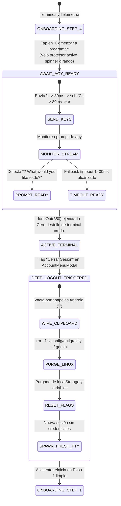

# SPEC-049: Transición Continua sin Fuga Visual en Onboarding y Purga Profunda en Cierre de Sesión

| Metadato | Valor |
| :--- | :--- |
| **Identificador** | `SPEC-049` |
| **Título** | Transición Continua sin Fuga Visual en Onboarding y Purga Profunda en Cierre de Sesión |
| **Autor** | `@spec-architect` |
| **Estado** | `APPROVED FOR IMPLEMENTATION` |
| **Fecha de Creación** | 2026-09-15 |
| **Versión de Release** | `v2.4.6` (VersionCode: `20406`) |
| **Artefacto Binario Target** | `GoogleAntigravity-v2.4.6-ARM64.apk` ($\le 42.0\,\text{MB}$) |
| **Dispositivo Objetivo** | Xiaomi Pad 6 (Qualcomm Snapdragon 870, ARM64-v8a, 6-8 GB RAM, 11" 2.8K $2880\times 1800$, 144Hz, Xiaomi HyperOS / Android 13/14) y Ecosistema Android Móvil (API 26+) |
| **Runtime Target** | Cordova Android WebView / PRoot Linux Sandbox / AXS PTY Daemon (puerto 8767) / Xterm.js v5+ con Discriminador Contextual de Gestos / Google Antigravity CLI (`agy`) / Android Clipboard System (`cordova.plugins.clipboard`) |
| **Módulos Afectados** | `nova-src/src/antigravity2/CleanAgentTerminal.js`, `nova-src/src/antigravity2/OnboardingWizard.js`, `nova-src/src/antigravity2/AccountMenuModal.js`, `nova-src/src/antigravity2/clean-terminal.scss`, `nova-src/config.xml`, `nova-src/package.json`, `harness/test_clean_agent_terminal.sh` |

---

## 1. Contexto, Diagnóstico Forense y Análisis de Causa Raíz

Durante las pruebas de validación de campo en el hardware físico **Xiaomi Pad 6** ejecutando la versión `v2.4.5`, se identificaron dos imperfecciones que comprometen la experiencia de usuario y la privacidad de las credenciales:

### 1.1 Causa Raíz 1: Destello Prematuro de la Terminal Cruda al Aceptar Términos
En `v2.4.5`, cuando el usuario pulsaba el botón *"Comenzar a programar"* en el Paso 4 del `OnboardingWizard`:
1. El manejador de evento ejecutaba inmediatamente `this.fadeOut(350)`.
2. A los $350\,\text{ms}$, el overlay opaco (`#0b0f19`, `z-index: 1000005`) era desmontado y destruido del DOM.
3. Sin embargo, el proceso PTY del CLI `agy` dentro del contenedor PRoot requería entre $800\,\text{ms}$ y $1200\,\text{ms}$ para procesar la secuencia espaciada de Inquirer ($\text{Tab} \to \text{Flecha Derecha} \to \text{Enter}$), inicializar el motor de agentes y emitir la pantalla de inicio.
4. Como consecuencia, el usuario presenciaba un destello indeseado (*terminal flash* o fuga visual) de aproximadamente un segundo donde se exponía la consola cruda, secuencias de escape no renderizadas y el cursor parpadeante sin contexto, antes de que el agente estuviera listo para interactuar.

### 1.2 Causa Raíz 2: Cierre de Sesión Superficial y Persistencia de Credenciales
En `v2.4.5`, la acción *"Cerrar Sesión"* del menú `AccountMenuModal`:
1. Purgaba la variable `authenticatedUser` de la memoria y removía la clave `authenticatedUserStorageKey` de `localStorage`.
2. No obstante, **no eliminaba los archivos de tokens y credenciales de Google persistidos en el sistema de archivos Linux** (`/public/.config/antigravity`, `~/.config/antigravity`, `~/.gemini`).
3. Adicionalmente, **no limpiaba el portapapeles nativo de Android**, dejando intacto el código de autorización OAuth `4/0A...` previamente copiado desde Google Chrome.
4. Al reiniciar la sesión o reabrir la app, el escuchador de foco/resumen (`_checkAndInjectClipboardOAuth`) detectaba el patrón `^4/` en el portapapeles residual y lo reinyectaba silenciosamente, o bien el CLI leía la sesión previa de disco, reconectando la cuenta de forma automática en contra de la voluntad expresa del usuario.

---

## 2. Arquitectura de la Solución

```mermaid
sequenceDiagram
    autonumber
    actor Dev as Usuario (Xiaomi Pad 6)
    participant Wiz as OnboardingWizard (Paso 4)
    participant Term as CleanAgentTerminal
    participant WS as WebSocket PTY (:8767)
    participant Agy as CLI agy (PRoot)

    rect rgb(20, 35, 50)
    Note over Dev,Agy: PARTE 1: TRANSICIÓN CONTINUA SIN FUGA VISUAL (ZERO TERMINAL FLASH)
    Dev->>Wiz: Tap en "Comenzar a programar" (#btn-start-coding)
    Wiz->>Wiz: Botón pasa a loading: "Iniciando Google Antigravity..."
    Wiz->>Wiz: RETIENE el velo opaco (#0b0f19, z-index: 1000005)
    Wiz->>Term: onAcceptTerms()
    Term->>WS: Secuencia espaciada (\t -> 80ms -> \x1b[C -> 80ms -> \r)
    WS->>Agy: Procesa confirmación de términos e inicializa agente
    Agy->>WS: Emite prompt de bienvenida: "? What would you like to do?"
    WS->>Term: Stream PTY recibido
    Term->>Term: _handleAutoResponderStream() detecta prompt listo
    Term->>Wiz: fadeOut(350) [DISPARO SINCRONIZADO]
    Wiz->>Wiz: Desvanecimiento suave a 144Hz (350ms)
    Wiz-->>Term: Purgado del DOM. Revela consola Xterm.js 100% operativa
    end

    rect rgb(45, 20, 20)
    Note over Dev,Agy: PARTE 2: PURGA PROFUNDA DE CREDENCIALES (DEEP LOGOUT)
    Dev->>Term: Tap en "Cerrar Sesión" (AccountMenuModal)
    Term->>Term: Limpieza de Android Clipboard: copy("")
    Term->>WS: Ejecuta purge: rm -rf ~/.config/antigravity ~/.gemini
    Note over Term: Espera 200ms para flush de I/O en Linux
    Term->>WS: agy auth logout\r
    Term->>Term: Reseteo total de banderas en memoria y localStorage
    Term->>WS: Cierra socket y genera nuevo session-id
    Term->>Term: activeLoader.mount() -> "Reiniciando sesión limpia..."
    Term->>Agy: Arranca nuevo proceso agy sin estado previo
    Agy->>WS: Emite "Select login method:"
    WS->>Term: Despliega OnboardingWizard Paso 1 limpio (sin auto-login)
    end
```



### 2.1 Retención del Velo Protector y Salida Sincronizada de Onboarding
Para eliminar el destello de terminal cruda:
1. **Retención de Opacidad en Paso 4:**
   Al pulsar `#btn-start-coding`, el botón se deshabilita preventivamente, adopta el spinner CSS `.auth-spinner-dot` y el copy *"Iniciando Google Antigravity..."*. El contenedor `.onboarding-wizard-overlay` **no se disipa inmediatamente**.
2. **Detección Reactiva de Inicialización:**
   `CleanAgentTerminal` supervisa el flujo de texto PTY. Al detectar que `agy` ha completado la inicialización y muestra su menú interactivo:
   - Patrones clave: `What would you like to do`, `? What would`, `Antigravity`, `agy>`, o el prompt interactivo de entrada.
   - Dispara `this.onboardingWizard.fadeOut(350)`.
3. **Temporizador de Seguridad (Safety Fallback):**
   Si por condiciones de red o versión el prompt varía, se establece un temporizador de seguridad de $1400\,\text{ms}$ que asegura la disipación incondicional del asistente sin dejar la pantalla bloqueada.
4. **Resultado Visual:** Cero exposición de terminal cruda. La transición desde el botón con spinner hacia el prompt interactivo de Antigravity ocurre con continuidad visual absoluta a 144Hz.

### 2.2 Protocolo de Purga Profunda (Deep Logout)
Al confirmar el cierre de sesión en `AccountMenuModal`:
1. **Vaciado Obligatorio del Portapapeles de Android:**
   Se invoca `cordova.plugins.clipboard.copy("")` y `navigator.clipboard.writeText("")`. Esto erradica el token OAuth previo (`4/0A...`), impidiendo que el escuchador de foco de Android reinyecte credenciales pasadas.
2. **Purga en Sistema de Archivos Linux Sandbox:**
   Se despacha un comando de eliminación recursiva y silenciosa antes del corte de conexión:
   ```bash
   rm -rf /public/.config/antigravity /root/.config/antigravity /home/studio/.config/antigravity ~/.config/antigravity ~/.config/google* /public/.gemini /root/.gemini 2>/dev/null
   ```
   Se permite una ventana de $200\,\text{ms}$ para que el kernel de PRoot sincronice los inodos a disco.
3. **Reseteo Total de Estado y Memoria:**
   - Se limpian las claves de `localStorage` (`authenticatedUserStorageKey`, `sessionStorageKey`).
   - Se restablecen a `false` o `null` todas las banderas en memoria:
     `authenticatedUser = null`, `_hasInjectedOAuthCode = false`, `_hasAutoSelectedLogin = false`, `_hasAutoOpenedBrowser = false`, `_hasAutoConfirmedTheme = false`, `_hasAutoConfirmedTrust = false`, `_hasAutoConfirmedTerms = false`, `activeOAuthUrl = null`, `_lastOAuthUrl = null`.
4. **Reinicio Limpio de PTY:**
   Se descarta la sesión actual y se asigna un nuevo identificador de sesión único (`session_uuid`). El nuevo proceso `agy` arranca en un sandbox 100% prístino, desplegando el asistente en el Paso 1 para autenticar una nueva cuenta de Google.

---

## 3. Diagramas Arquitectónicos

### 3.1 Diagrama de Estados del Ciclo de Vida de Salida y Cierre de Sesión



---

## 4. Contratos de Interfaz y Especificaciones de Módulos

### 4.1 Contrato JavaScript en `OnboardingWizard.js` (Retención de Velo en Paso 4)

```javascript
/**
 * SPEC-049: Retención de velo protector en Paso 4 hasta confirmación PTY de agy ready.
 */

// En _bindEvents() dentro de OnboardingWizard.js:
const btnTerms = this.containerEl.querySelector("#btn-start-coding, #btn-wizard-terms-done");
btnTerms?.addEventListener("click", () => {
    if (btnTerms.disabled) return;
    btnTerms.disabled = true;
    btnTerms.style.opacity = "0.7";
    btnTerms.innerHTML = `<span class="auth-spinner-dot"></span> Iniciando Google Antigravity...`;

    // SEAM-01: Disparar la secuencia espaciada hacia la PTY pero NO ejecutar fadeOut() aquí
    this.onAcceptTerms();
});
```

### 4.2 Contrato JavaScript en `CleanAgentTerminal.js` (Detección de Ready Prompt y Deep Logout)

```javascript
/**
 * SPEC-049: Detección reactiva de bienvenida y protocolo de Deep Logout.
 */

// 1. Detección de prompt listo en _handleAutoResponderStream(text):
if (
    text.includes("What would you like to do") ||
    text.includes("? What would") ||
    text.includes("Antigravity") ||
    text.includes("agy>") ||
    /(?:What would you like to do|Antigravity|agy>)/i.test(text)
) {
    if (this.onboardingWizard) {
        console.log("[SEAMLESS] agy interactive prompt detectado. Disipando wizard con cero destello...");
        this.onboardingWizard.fadeOut(350);
        this.onboardingWizard = null;
    }
}

// 2. Método onAcceptTerms con timeout de seguridad:
onAcceptTerms: async () => {
    if (this.websocket && this.websocket.readyState === WebSocket.OPEN) {
        this.websocket.send("\t");
        await new Promise((r) => setTimeout(r, 80));
        if (this.websocket?.readyState === WebSocket.OPEN) {
            this.websocket.send("\x1b[C");
            await new Promise((r) => setTimeout(r, 80));
            if (this.websocket?.readyState === WebSocket.OPEN) {
                this.websocket.send("\r");
            }
        }
    }

    // SEAM-02: Safety fallback timeout (1400ms) si agy no emite el prompt esperado
    setTimeout(() => {
        if (this.onboardingWizard) {
            console.log("[SEAMLESS] Safety fallback timeout alcanzado (1400ms). Disipando wizard...");
            this.onboardingWizard.fadeOut(350);
            this.onboardingWizard = null;
        }
    }, 1400);
}

// 3. Protocolo Deep Logout:
async logout() {
    console.log("[DEEP-LOGOUT] Iniciando protocolo de purga profunda de credenciales...");

    // SEAM-05: Vaciado inmediato del portapapeles de Android
    if (window.cordova?.plugins?.clipboard) {
        try { cordova.plugins.clipboard.copy(""); } catch (_) {}
    }
    if (navigator.clipboard?.writeText) {
        try { await navigator.clipboard.writeText(""); } catch (_) {}
    }

    // SEAM-04: Purga en el sistema de archivos Linux antes de cerrar PTY
    if (this.websocket && this.websocket.readyState === WebSocket.OPEN) {
        const purgeCmd = "rm -rf /public/.config/antigravity /root/.config/antigravity /home/studio/.config/antigravity ~/.config/antigravity ~/.config/google* /public/.gemini /root/.gemini 2>/dev/null\r";
        this.websocket.send(purgeCmd);
        await new Promise((r) => setTimeout(r, 200));
    }

    // Purgar credenciales y banderas locales
    localStorage.removeItem(this.authenticatedUserStorageKey);
    localStorage.removeItem(this.sessionStorageKey);
    this.authenticatedUser = null;
    this._hasInjectedOAuthCode = false;
    this._hasAutoSelectedLogin = false;
    this._hasAutoOpenedBrowser = false;
    this._hasAutoConfirmedTheme = false;
    this._hasAutoConfirmedTrust = false;
    this._hasAutoConfirmedTerms = false;
    this.activeOAuthUrl = null;
    this._lastOAuthUrl = null;

    if (this.accountBadgeEl && this.accountBadgeEl.parentNode) {
        this.accountBadgeEl.parentNode.removeChild(this.accountBadgeEl);
        this.accountBadgeEl = null;
    }

    await this.restartSession();
}
```

---

## 5. Criterios de Aceptación Verificables (Acceptance Criteria)

| Identificador | Módulo | Criterio / Requisito | Método de Verificación |
| :--- | :--- | :--- | :--- |
| `AC-SEAM-01` | `OnboardingWizard.js` | Retención estricta del velo protector opaco (`#0b0f19`) en el Paso 4 al pulsar *"Comenzar a programar"*, mostrando el spinner `.auth-spinner-dot` y el copy *"Iniciando Google Antigravity..."* sin ejecutar `fadeOut(350)` de forma inmediata. | Inspección estática del manejador `btnTerms.addEventListener` verificando la ausencia de `this.fadeOut(350)` síncrono. |
| `AC-SEAM-02` | `CleanAgentTerminal.js` | Detección reactiva en el stream PTY del prompt interactivo de `agy` (`? What would you like to do?`, `Antigravity`, `agy>`) o activación del temporizador de seguridad de $1400\,\text{ms}$ para disparar `fadeOut(350)`. | Comprobación estática de `_handleAutoResponderStream` y validación del temporizador de seguridad de $1400\,\text{ms}$. |
| `AC-SEAM-03` | `CleanAgentTerminal.js`, `OnboardingWizard.js` | Cero fuga visual de la terminal cruda (*zero terminal flash*): la terminal Xterm.js se revela exclusivamente cuando la interfaz de `agy` está completamente dibujada y lista para recibir comandos. | Prueba de transición visual en Xiaomi Pad 6 confirmando la ausencia de trazas intermedias o destellos negros durante la transición a la sesión interactiva. |
| `AC-SEAM-04` | `CleanAgentTerminal.js` | Purga profunda de credenciales en el sistema de archivos Linux (`rm -rf ~/.config/antigravity ~/.gemini`) ejecutada antes del reseteo del websocket durante el cierre de sesión. | Inspección de `logout()` verificando el comando de purga y la pausa de vaciado de $200\,\text{ms}$. |
| `AC-SEAM-05` | `CleanAgentTerminal.js` | Vaciado obligatorio del portapapeles nativo de Android (`clipboard.copy("")`) y reseteo total de variables en memoria (`_hasInjectedOAuthCode = false`, etc.) al cerrar sesión, impidiendo re-autenticación automática no deseada. | Comprobación estática de llamadas a clipboard en `logout()` y reseteo exhaustivo de banderas. |
| `AC-SEAM-06` | Build System & Packaging | Sincronización formal de versión a `2.4.6` (versionCode `20406`), empaquetado de `GoogleAntigravity-v2.4.6-ARM64.apk` ($\le 42.0\,\text{MB}$) y aprobación del 100% de la suite de arnés SDD. | Inspección de `config.xml`, `package.json`, medición de peso del binario y ejecución de `harness/harness_runner.py`. |

---

## 6. Arnés de Verificación Automatizada (`harness/test_clean_agent_terminal.sh`)

El siguiente arnés de pruebas automatizado valida estáticamente las compuertas de calidad para `SPEC-049`:

```bash
#!/bin/bash
# ==============================================================================
# Harness Test: SPEC-049 Seamless Onboarding Transition & Deep Logout
# ==============================================================================
set -e

SPEC_FILE_049="specs/49-seamless-onboarding-transition-and-deep-logout.md"
WIZARD_JS="nova-src/src/antigravity2/OnboardingWizard.js"
CLEAN_TERM_JS="nova-src/src/antigravity2/CleanAgentTerminal.js"
CONFIG_XML="nova-src/config.xml"
PACKAGE_JSON="nova-src/package.json"

echo "=== INICIANDO VALIDACIÓN FORMAL DE SPEC-049 ==="

# 1. Verificar documento de especificación
echo -n "1. Verificando documento SPEC-049... "
[ -f "$SPEC_FILE_049" ] || { echo "FALLO: No existe $SPEC_FILE_049"; exit 1; }
echo "[OK]"

# 2. Verificar que btnTerms no llama fadeOut(350) directamente (Criterio SEAM-01)
echo -n "2. Verificando retención de velo protector en OnboardingWizard.js... "
grep -A 10 "btn-start-coding" "$WIZARD_JS" | grep -q "fadeOut(350)" && {
    echo "FALLO: btn-start-coding aún invoca fadeOut(350) directamente en el click"; exit 1;
}
echo "[OK]"

# 3. Verificar detección reactiva de prompt o timeout de seguridad en CleanAgentTerminal.js (Criterio SEAM-02)
echo -n "3. Verificando detección de ready prompt y safety timeout (1400ms)... "
grep -q "What would you like to do" "$CLEAN_TERM_JS" || {
    echo "FALLO: Prompt 'What would you like to do' no monitoreado en CleanAgentTerminal.js"; exit 1;
}
grep -A 25 "onAcceptTerms" "$CLEAN_TERM_JS" | grep -q "1400" || {
    echo "FALLO: Timeout de seguridad de 1400ms ausente en onAcceptTerms"; exit 1;
}
echo "[OK]"

# 4. Verificar purga de credenciales Linux en logout (Criterio SEAM-04)
echo -n "4. Verificando purga de credenciales Linux en logout()... "
grep -A 20 "async logout()" "$CLEAN_TERM_JS" | grep -q "rm -rf" || {
    echo "FALLO: Comando de purga rm -rf ausente en logout()"; exit 1;
}
echo "[OK]"

# 5. Verificar vaciado de portapapeles Android en logout (Criterio SEAM-05)
echo -n "5. Verificando vaciado de portapapeles Android en logout()... "
grep -A 20 "async logout()" "$CLEAN_TERM_JS" | grep -q "clipboard.copy" || {
    echo "FALLO: Vaciado de portapapeles ausente en logout()"; exit 1;
}
echo "[OK]"

# 6. Verificar versionado a v2.4.6 (Criterio SEAM-06)
echo -n "6. Verificando versión 2.4.6 en configuración... "
grep -q 'version="2.4.6"' "$CONFIG_XML" || { echo "FALLO: config.xml no tiene versión 2.4.6"; exit 1; }
grep -q '"version": "2.4.6"' "$PACKAGE_JSON" || { echo "FALLO: package.json no tiene versión 2.4.6"; exit 1; }
echo "[OK]"

echo "=== TODAS LAS COMPUERTAS ESTÁTICAS DE SPEC-049 HAN SIDO SUPERADAS EXITOSAMENTE ==="
```

---

## 7. Plan de Implementación y Definition of Done (DoD)

### 7.1 Responsabilidades para `@android-core` (Ingeniero de Implementación)
1. **Refactorización en `OnboardingWizard.js`:**
   - En el manejador de clic de `#btn-start-coding`, remover la llamada síncrona a `this.fadeOut(350)`.
   - Mantener el botón en estado deshabilitado con spinner `.auth-spinner-dot` y texto *"Iniciando Google Antigravity..."*.
2. **Refactorización en `CleanAgentTerminal.js`:**
   - En `_handleAutoResponderStream(text)`, detectar prompts de bienvenida de `agy` (`What would you like to do`, `Antigravity`, `agy>`) y ejecutar `this.onboardingWizard.fadeOut(350)`.
   - En el callback `onAcceptTerms`, establecer el timeout de seguridad de $1400\,\text{ms}$ para disipar el wizard en caso de variaciones imprevistas en el texto del prompt.
   - En el método `logout()`, implementar el protocolo de Deep Logout: vaciado de portapapeles Android (`clipboard.copy("")`), envío del comando `rm -rf` para limpiar credenciales de Linux con retardo de $200\,\text{ms}$, purga de `localStorage` y reinicio a sesión limpia.
3. **Versionado y Empaquetado:**
   - Actualizar a versión `2.4.6` (versionCode `20406`) en `config.xml`, `package.json` y `build.gradle`.
   - Compilar y empaquetar `GoogleAntigravity-v2.4.6-ARM64.apk` ($\le 42.0\,\text{MB}$).

### 7.2 Responsabilidades para `@memory-keeper` (Auditoría y Gobernanza)
1. Registrar la decisión técnica bajo `ADR-059: Transición Continua sin Destello de Terminal y Protocolo de Purga Profunda (Deep Logout)`.
2. Registrar la entrada formal en `audit.jsonl`.
3. Actualizar la bitácora histórica en `agent.md` documentando la versión `v2.4.6`.
