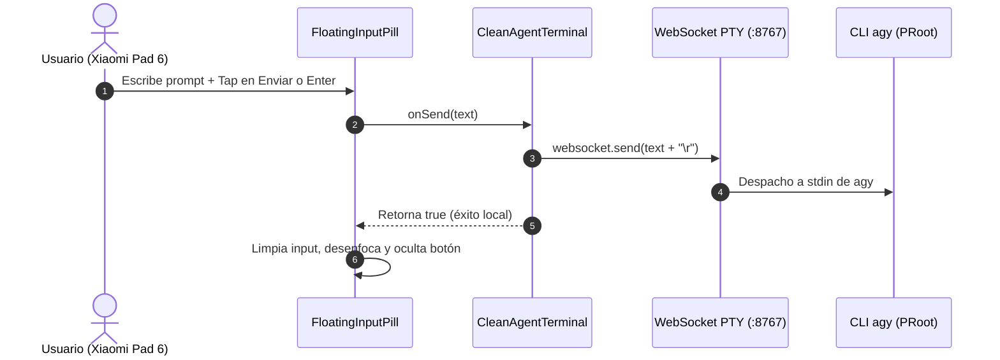

# SPEC-050: Barra de Entrada Flotante (Floating Input Pill) para Google Antigravity Mobile

| Metadato | Valor |
| :--- | :--- |
| **Identificador** | `SPEC-050` |
| **Título** | Barra de Entrada Flotante (Floating Input Pill) para Google Antigravity Mobile |
| **Autor** | `@android-core` |
| **Estado** | `APPROVED FOR IMPLEMENTATION` |
| **Fecha de Creación** | 2026-09-16 |
| **Versión de Release** | `v2.5.0` (VersionCode: `20500`) |
| **Artefacto Binario Target** | `GoogleAntigravity-v2.5.0-ARM64.apk` ($\le 42.0\,\text{MB}$) |
| **Dispositivo Objetivo** | Xiaomi Pad 6 (Qualcomm Snapdragon 870, ARM64-v8a, 6-8 GB RAM, 11" 2.8K $2880\times 1800$, 144Hz, Xiaomi HyperOS / Android 13/14) y Ecosistema Android Móvil (API 26+) |
| **Runtime Target** | Cordova Android WebView / PRoot Linux Sandbox / AXS PTY Daemon (puerto 8767) / Xterm.js v5+ con Discriminador Contextual de Gestos / Google Antigravity CLI (`agy`) |
| **Módulos Afectados** | `nova-src/src/antigravity2/FloatingInputPill.js`, `nova-src/src/antigravity2/CleanAgentTerminal.js`, `nova-src/src/antigravity2/clean-terminal.scss`, `nova-src/config.xml`, `nova-src/package.json`, `harness/test_clean_agent_terminal.sh` |

---

## 1. Contexto y Objetivos

Añadir una barra de entrada flotante tipo chat (Floating Input Pill) en la parte inferior de la pantalla sobre la terminal Xterm.js en la Xiaomi Pad 6 (ARM64). Permite a los desarrolladores enviar prompts y comandos al agente conversacional `agy` con ergonomía táctil moderna sin depender exclusivamente de pulsar directamente sobre la consola Xterm.js.

La salida de `agy`, la Top App Bar de 48px, el sistema de gestos de terminal, los asistentes de Onboarding y Cuenta, y el protocolo WebSocket PTY preservan intactos sus contratos.

---

## 2. Arquitectura de la Solución



---

## 3. Contratos de Interfaz

```javascript
/**
 * Contrato formal de FloatingInputPill
 */
export class FloatingInputPill {
    constructor(options = {}) {
        this.onSend = options.onSend || ((text) => false);
        this.containerEl = null;
        this.inputEl = null;
        this.visible = false;
    }
    mount(parentEl) {}
    show() {}
    hide() {}
    dismiss() {}
}
```

---

## 4. Criterios de Aceptación Verificables

| Identificador | Módulo | Criterio / Requisito | Método de Verificación |
| :--- | :--- | :--- | :--- |
| `AC-PILL-001` | `FloatingInputPill.js` | Existencia del componente con exportación `FloatingInputPill`, métodos `mount()`, `show()`, `hide()`, `dismiss()` y placeholder exacto `Pregúntale a Antigravity...`. | Inspección estática y pruebas unitarias de API. |
| `AC-PILL-002` | `FloatingInputPill.js` | El click en enviar o pulsar Enter ejecuta `onSend(text.trim())`. Solo texto útil (>0 chars) dispara el callback. | Validación de eventos en componente. |
| `AC-PILL-003` | `FloatingInputPill.js` | Supresión estricta durante composición IME (`isComposing === true` o `keyCode === 229`), impidiendo envíos prematuros. | Prueba estática de manejador de teclado. |
| `AC-PILL-004` | `CleanAgentTerminal.js` | Integración del adaptador `onSend`: cuando el socket está `OPEN`, envía exactamente `text + "\r"` y retorna `true`. | Inspección de `_mountFloatingPill` en CleanAgentTerminal. |
| `AC-PILL-005` | `CleanAgentTerminal.js` | Ciclo de vida y visibilidad: el pill permanece oculto durante onboarding, pantalla de autenticación y menú de cuenta. | Verificación de llamadas `hide()` / `show()` en transiciones. |
| `AC-PILL-006` | `clean-terminal.scss` | Estilos de píldora flotante con `fixed`, `height: 48px`, `border-radius: 28px`, `z-index: 999` y anti-colisión con `.has-input-pill`. | Comprobación de reglas en SCSS. |
| `AC-PILL-007` | Harness Suite | Pruebas automatizadas en `test_clean_agent_terminal.sh` cubriendo SPEC-050, selectores y sincronización. | Ejecución del script de verificación estática. |
| `AC-PILL-008` | Build System | Versión formal `2.5.0` (versionCode `20500`), compilación limpia y empaquetado de `GoogleAntigravity-v2.5.0-ARM64.apk` ($\le 42.0\,\text{MB}$). | Verificación de build Gradle y tamaño binario. |
